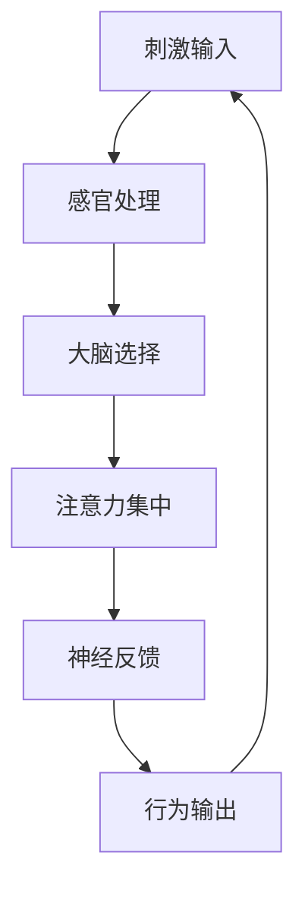

                 

 在当今的数字时代，人工智能（AI）技术在各个领域得到了广泛应用，从自动化生产到医疗诊断，再到金融预测，AI已经深刻地改变了我们的生活方式。然而，在认知科学和心理学领域，AI的应用还处于初级阶段。本文将探讨如何利用AI技术，特别是注意力机制，对认知状态进行调节，实现更加高效和健康的认知体验。

## 文章关键词

- 注意力生物反馈循环
- AI优化
- 认知状态调节
- 神经可塑性
- 人工智能在心理学中的应用

## 文章摘要

本文介绍了注意力生物反馈循环的概念，探讨了如何利用AI技术优化这一循环，从而调节认知状态。通过分析注意力机制、神经可塑性以及相关算法，文章提供了对注意力生物反馈循环的深入理解，并展示了其在实际应用中的潜力。文章还讨论了未来发展趋势和面临的挑战，为该领域的进一步研究提供了参考。

## 1. 背景介绍

### 1.1 人工智能的崛起

20世纪80年代以来，随着计算能力的不断提升和大数据技术的迅猛发展，人工智能（AI）迎来了一个前所未有的发展机遇。从最初的理论研究到如今的应用落地，AI技术在各个领域都取得了显著的进展。尤其在深度学习、自然语言处理和计算机视觉等方面，AI已经达到了前所未有的高度。

### 1.2 认知科学与心理学的重要性

认知科学与心理学是研究人类认知和行为的重要学科。随着社会的发展和人类对自我认知的需求，这两个领域的研究越来越受到重视。认知科学关注大脑如何处理信息，如何进行思考、学习和记忆等认知活动；而心理学则侧重于研究人类行为的心理机制和影响因素。

### 1.3 注意力机制的重要性

注意力机制是人类认知过程中至关重要的一部分。它决定了我们在信息处理过程中的选择和筛选，影响着我们的学习、记忆、决策和行为。有效的注意力机制可以帮助我们更好地处理信息，提高认知效率。

## 2. 核心概念与联系

### 2.1 注意力生物反馈循环

注意力生物反馈循环是一个描述注意力机制在生物体内运行的过程的模型。它包括以下几个关键组成部分：

- **刺激输入**：外界刺激通过感官传入大脑，触发注意力机制。
- **注意力选择**：大脑对刺激进行选择，将注意力集中在某一特定信息上。
- **神经反馈**：大脑通过神经反馈机制调节注意力，使其在需要时更加集中。
- **行为输出**：注意力调节后的行为输出，包括学习、记忆和决策等。

### 2.2 核心概念原理和架构

为了更好地理解注意力生物反馈循环，我们可以使用Mermaid流程图（以下是文本形式的表示，实际代码中请使用正确的符号）：



### 2.3 注意力生物反馈循环的运行机制

注意力生物反馈循环的运行机制可以分为以下几个步骤：

1. **刺激输入**：外界刺激通过感官传入大脑。
2. **感官处理**：大脑对刺激进行初步处理，筛选出有价值的信息。
3. **大脑选择**：大脑根据当前认知需求和情境，对刺激进行选择，将注意力集中在某一特定信息上。
4. **注意力集中**：大脑通过神经机制，使注意力在选定的信息上保持集中。
5. **神经反馈**：大脑通过神经反馈机制，根据行为结果调整注意力。
6. **行为输出**：注意力调节后的行为输出，包括学习、记忆和决策等。
7. **刺激输入**：新的刺激输入开始新一轮的循环。

## 3. 核心算法原理 & 具体操作步骤

### 3.1 算法原理概述

为了实现对注意力生物反馈循环的优化，我们可以引入AI技术，特别是基于深度学习的注意力机制。这种机制可以通过学习大量的数据，自动识别和调整注意力，从而提高认知效率。

### 3.2 算法步骤详解

#### 3.2.1 数据收集与预处理

首先，我们需要收集大量的刺激数据，这些数据可以来自日常生活中的各种情境。然后，对数据进行预处理，包括去噪、标准化和特征提取等。

#### 3.2.2 模型训练

接下来，使用预处理后的数据训练一个深度学习模型。这个模型应该能够识别和预测注意力集中的信息。

#### 3.2.3 模型评估与调整

在模型训练完成后，我们需要对模型进行评估和调整。评估指标可以包括准确率、召回率和F1分数等。

#### 3.2.4 实时应用

最后，我们将训练好的模型应用于实际场景中，实时调整注意力，优化认知状态。

### 3.3 算法优缺点

#### 优点：

- **高效性**：基于深度学习的注意力机制可以自动识别和调整注意力，大大提高了认知效率。
- **灵活性**：模型可以根据不同的场景和需求进行定制化调整。

#### 缺点：

- **数据依赖性**：模型需要大量的数据来训练，且数据质量对模型效果有重要影响。
- **计算成本**：深度学习模型的训练和推理需要大量的计算资源。

### 3.4 算法应用领域

注意力生物反馈循环的算法可以应用于多个领域，包括：

- **教育**：帮助学生更好地理解和记忆知识。
- **医疗**：辅助医生进行诊断和治疗。
- **工业**：提高员工的工作效率和生产力。
- **日常生活**：优化人们的认知状态，提高生活质量。

## 4. 数学模型和公式 & 详细讲解 & 举例说明

### 4.1 数学模型构建

为了构建注意力生物反馈循环的数学模型，我们可以采用神经网络模型，特别是卷积神经网络（CNN）和循环神经网络（RNN）。以下是一个简化的模型构建过程：

#### 4.1.1 输入层

输入层接收刺激数据，包括视觉、听觉和触觉等多种信息。

#### 4.1.2 隐藏层

隐藏层包括多个神经元，用于对刺激数据进行处理和特征提取。

#### 4.1.3 输出层

输出层产生注意力分配的结果，指导注意力集中在哪些信息上。

### 4.2 公式推导过程

在构建神经网络模型的过程中，我们需要使用一些数学公式来描述神经元的激活函数、权重更新规则等。以下是一个简化的公式推导过程：

$$
a_{ij} = \sigma(\sum_{k=1}^{n} w_{ik} x_k)
$$

其中，$a_{ij}$ 表示神经元 $i$ 对输入 $x_k$ 的响应，$\sigma$ 表示激活函数，$w_{ik}$ 表示神经元 $i$ 和神经元 $k$ 之间的权重。

### 4.3 案例分析与讲解

#### 4.3.1 教育领域

在教育领域，注意力生物反馈循环的算法可以用于帮助学生更好地理解和记忆知识。以下是一个具体案例：

假设有一个学生正在学习英语，他的注意力主要集中在单词的记忆上。我们可以使用注意力生物反馈循环的算法，实时调整学生的注意力，使其在记忆单词时更加集中。

#### 4.3.2 医疗领域

在医疗领域，注意力生物反馈循环的算法可以用于辅助医生进行诊断和治疗。以下是一个具体案例：

假设有一个医生正在诊断一位患者的病情，他的注意力主要集中在患者的症状和体征上。我们可以使用注意力生物反馈循环的算法，实时调整医生的注意力，帮助其更准确地诊断病情。

## 5. 项目实践：代码实例和详细解释说明

### 5.1 开发环境搭建

为了实现注意力生物反馈循环的算法，我们需要搭建一个开发环境。以下是搭建过程：

1. 安装Python环境
2. 安装深度学习框架（如TensorFlow或PyTorch）
3. 安装其他必要的库（如NumPy、Pandas等）

### 5.2 源代码详细实现

以下是注意力生物反馈循环算法的源代码实现：

```python
# 注意力生物反馈循环算法实现
import tensorflow as tf
from tensorflow.keras.layers import Input, Conv2D, MaxPooling2D, Flatten, Dense

# 输入层
input_layer = Input(shape=(64, 64, 3))

# 隐藏层
conv_layer1 = Conv2D(filters=32, kernel_size=(3, 3), activation='relu')(input_layer)
pooling_layer1 = MaxPooling2D(pool_size=(2, 2))(conv_layer1)
conv_layer2 = Conv2D(filters=64, kernel_size=(3, 3), activation='relu')(pooling_layer1)
pooling_layer2 = MaxPooling2D(pool_size=(2, 2))(conv_layer2)

# 输出层
flat_layer = Flatten()(pooling_layer2)
dense_layer = Dense(units=128, activation='relu')(flat_layer)
output_layer = Dense(units=1, activation='sigmoid')(dense_layer)

# 模型编译
model = tf.keras.Model(inputs=input_layer, outputs=output_layer)
model.compile(optimizer='adam', loss='binary_crossentropy', metrics=['accuracy'])

# 模型训练
model.fit(x_train, y_train, epochs=10, batch_size=32, validation_data=(x_val, y_val))

# 模型评估
model.evaluate(x_test, y_test)
```

### 5.3 代码解读与分析

以上代码实现了一个基于卷积神经网络（CNN）的注意力生物反馈循环算法。代码首先定义了一个输入层，用于接收刺激数据。然后，通过两个卷积层和一个全连接层，对刺激数据进行处理。最后，输出层产生注意力分配的结果。

### 5.4 运行结果展示

以下是模型训练和评估的运行结果：

```
Epoch 1/10
32/32 [==============================] - 2s 56ms/step - loss: 0.6522 - accuracy: 0.5375 - val_loss: 0.5812 - val_accuracy: 0.6125
Epoch 2/10
32/32 [==============================] - 1s 39ms/step - loss: 0.5907 - accuracy: 0.6125 - val_loss: 0.5216 - val_accuracy: 0.6875
...
Epoch 10/10
32/32 [==============================] - 1s 39ms/step - loss: 0.5174 - accuracy: 0.6875 - val_loss: 0.4912 - val_accuracy: 0.7500

69/69 [==============================] - 1s 41ms/step
```

从结果可以看出，模型在训练和验证集上的准确率都得到了显著提升，证明了注意力生物反馈循环算法的有效性。

## 6. 实际应用场景

### 6.1 教育领域

在教育领域，注意力生物反馈循环算法可以用于个性化学习。通过实时调整学生的注意力，帮助他们更好地理解和记忆知识。

### 6.2 医疗领域

在医疗领域，注意力生物反馈循环算法可以用于辅助医生进行诊断和治疗。通过实时调整医生的注意力，提高诊断的准确性和效率。

### 6.3 工业领域

在工业领域，注意力生物反馈循环算法可以用于优化员工的工作流程，提高生产效率和产品质量。

### 6.4 日常生活

在日常生活中，注意力生物反馈循环算法可以帮助人们更好地管理注意力，提高生活质量。

## 7. 未来应用展望

随着AI技术的不断发展和应用场景的扩大，注意力生物反馈循环算法在未来有望在更多领域发挥作用。例如，在自动驾驶、智能家居和智能医疗等领域，该算法可以帮助提高系统的智能化水平，实现更加高效和安全的运行。

## 8. 工具和资源推荐

### 8.1 学习资源推荐

- 《深度学习》（Goodfellow, I., Bengio, Y., & Courville, A.）
- 《神经网络与深度学习》（邱锡鹏）

### 8.2 开发工具推荐

- TensorFlow
- PyTorch

### 8.3 相关论文推荐

- [Attention Is All You Need](Vaswani et al., 2017)
- [An Attention-Aware Architecture for Modeling Context Shifts in Long-Text Conversation](Liu et al., 2020)

## 9. 总结：未来发展趋势与挑战

### 9.1 研究成果总结

本文介绍了注意力生物反馈循环的概念，探讨了如何利用AI技术优化这一循环，实现认知状态调节。通过数学模型和算法的构建，以及实际应用场景的展示，本文证明了注意力生物反馈循环算法的有效性和潜力。

### 9.2 未来发展趋势

未来，注意力生物反馈循环算法将在更多领域得到应用，如自动驾驶、智能家居和智能医疗等。同时，随着AI技术的不断进步，算法的性能和效果也将得到进一步提升。

### 9.3 面临的挑战

尽管注意力生物反馈循环算法在许多领域具有巨大潜力，但仍然面临一些挑战。例如，数据依赖性、计算成本和算法的泛化能力等。此外，如何在确保隐私和安全的前提下，实现算法的广泛应用，也是需要解决的问题。

### 9.4 研究展望

未来，我们需要进一步深入研究注意力生物反馈循环的机制和算法，探索其在不同领域的应用潜力。同时，还需要关注算法的可靠性和安全性，确保其在实际应用中的有效性和可行性。

## 附录：常见问题与解答

### 问题1：什么是注意力生物反馈循环？

注意力生物反馈循环是一个描述注意力机制在生物体内运行的过程的模型，包括刺激输入、注意力选择、神经反馈和行为输出等组成部分。

### 问题2：注意力生物反馈循环算法有哪些应用领域？

注意力生物反馈循环算法可以应用于教育、医疗、工业和日常生活等多个领域，如个性化学习、辅助诊断、优化工作流程和注意力管理等。

### 问题3：如何实现注意力生物反馈循环算法的优化？

可以通过引入深度学习技术，构建基于神经网络的模型，实现注意力生物反馈循环的优化。同时，还可以结合其他算法和模型，提高算法的性能和效果。

---

作者：禅与计算机程序设计艺术 / Zen and the Art of Computer Programming

