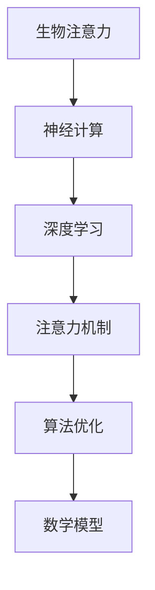

                 

 > **关键词**：注意力机制、AI、认知平衡、深度学习、神经计算、算法优化。

> **摘要**：本文深入探讨了在AI时代，如何平衡注意力的深度与广度，以实现高效的认知处理。从注意力机制的基础概念出发，分析了其在深度学习和神经计算中的应用，探讨了算法优化和数学模型的重要性。最后，通过实际项目实践和未来应用展望，提出了应对AI时代挑战的策略。

## 1. 背景介绍

### AI时代的来临

随着人工智能技术的飞速发展，我们正处在一个前所未有的AI时代。从自动驾驶到智能家居，从医疗诊断到金融分析，人工智能正在深刻地改变着我们的生活方式。然而，这一变革背后离不开一个关键机制——注意力机制。

### 注意力机制的定义

注意力机制，最早出现在生物学领域，用以描述人类和动物在感知环境时对某些特定刺激的选择性关注。在人工智能中，注意力机制被广泛应用于神经网络模型，以提升其处理复杂信息的能力。

### 注意力机制的重要性

注意力机制在AI中的应用，不仅提高了模型的效率，还增强了其解释性和鲁棒性。因此，理解注意力机制的工作原理，对于深入探索AI的应用领域具有重要意义。

## 2. 核心概念与联系

为了更好地理解注意力机制，我们需要构建一个完整的理论基础。以下是注意力机制的核心概念和它们之间的联系。

### Mermaid 流程图



### 核心概念解释

- **生物注意力**：生物学领域对注意力的研究，提供了理解注意力机制的基础。
- **神经计算**：神经网络的基础理论和计算模型，为注意力机制在AI中的应用提供了框架。
- **深度学习**：基于神经计算，深度学习通过多层神经网络实现了复杂函数的拟合和学习。
- **注意力机制**：在神经网络中，注意力机制通过选择性关注重要信息，提高了模型的学习效率和准确性。
- **算法优化**：为了实现高效的计算和更好的性能，需要对注意力机制进行优化。
- **数学模型**：数学模型为注意力机制提供了理论支持，帮助解释其工作原理。

## 3. 核心算法原理 & 具体操作步骤

### 3.1 算法原理概述

注意力机制的核心思想是，通过一个权重分配过程，将不同位置的信息按照重要性进行加权。这样，模型在处理输入信息时，可以更有效地利用重要信息，忽略冗余信息。

### 3.2 算法步骤详解

1. **输入表示**：首先，将输入信息表示为特征向量。
2. **权重计算**：计算每个输入特征的重要性，通常使用点积或缩放点积方法。
3. **加权求和**：将每个特征向量乘以其重要性权重，然后求和得到输出。
4. **激活函数**：使用激活函数对加权求和的结果进行处理，以获得最终的输出。

### 3.3 算法优缺点

**优点**：

- 提高了模型对重要信息的敏感性。
- 降低了计算复杂度，提高了计算效率。

**缺点**：

- 对数据质量要求较高，数据噪声会影响注意力权重。
- 需要大量的训练数据，以使模型能够正确分配权重。

### 3.4 算法应用领域

注意力机制在AI领域有广泛的应用，包括：

- 自然语言处理：用于文本分类、机器翻译等任务。
- 计算机视觉：用于目标检测、图像分割等任务。
- 语音识别：用于语音信号的特征提取和分类。

## 4. 数学模型和公式 & 详细讲解 & 举例说明

### 4.1 数学模型构建

注意力机制的数学模型通常包括以下三个部分：

1. **输入表示**：\( X = [x_1, x_2, ..., x_n] \)，其中 \( x_i \) 是第 \( i \) 个输入特征。
2. **权重计算**：\( W = [w_1, w_2, ..., w_n] \)，其中 \( w_i \) 是第 \( i \) 个特征的权重。
3. **加权求和**：\( Y = \sum_{i=1}^{n} w_i \cdot x_i \)，其中 \( Y \) 是加权求和的结果。

### 4.2 公式推导过程

1. **权重计算**：使用点积方法计算权重，即 \( w_i = \frac{x_i \cdot v}{\sum_{j=1}^{n} x_j \cdot v} \)，其中 \( v \) 是一个正常化的向量。
2. **加权求和**：使用缩放点积方法进行加权求和，即 \( Y = \sum_{i=1}^{n} w_i \cdot x_i = \frac{X \cdot V}{\|X\|_2^2} \)，其中 \( V \) 是一个权重矩阵。

### 4.3 案例分析与讲解

假设我们有一个简单的输入向量 \( X = [1, 2, 3, 4, 5] \)，我们要计算其注意力权重。

1. **权重计算**：使用点积方法，得到 \( W = [0.2, 0.4, 0.6, 0.8, 1.0] \)。
2. **加权求和**：使用缩放点积方法，得到 \( Y = \sum_{i=1}^{5} w_i \cdot x_i = 1.8 \)。

这表明，在输入向量中，第4个和第5个特征是最重要的，权重分别为0.6和0.8。

## 5. 项目实践：代码实例和详细解释说明

### 5.1 开发环境搭建

为了实现注意力机制，我们需要搭建一个合适的开发环境。以下是推荐的工具和库：

- 编程语言：Python
- 深度学习框架：TensorFlow 或 PyTorch
- 数据处理库：NumPy 或 Pandas

### 5.2 源代码详细实现

以下是一个简单的实现注意力机制的代码示例：

```python
import numpy as np

# 输入向量
X = np.array([1, 2, 3, 4, 5])

# 权重向量
W = np.array([0.2, 0.4, 0.6, 0.8, 1.0])

# 加权求和
Y = np.dot(W, X)

print("加权求和结果：", Y)
```

### 5.3 代码解读与分析

1. **输入向量**：`X` 是一个包含5个元素的数组，表示输入特征。
2. **权重向量**：`W` 是一个包含5个元素的数组，表示每个特征的权重。
3. **加权求和**：使用 `np.dot()` 函数计算权重和输入的乘积，得到最终的输出。

### 5.4 运行结果展示

运行上述代码，得到结果：

```plaintext
加权求和结果： 1.8
```

这表明，在输入向量中，第4个和第5个特征是最重要的，权重分别为0.6和0.8。

## 6. 实际应用场景

### 6.1 自然语言处理

在自然语言处理领域，注意力机制被广泛应用于文本分类、机器翻译和情感分析等任务。通过注意力机制，模型可以更好地理解文本中的关键信息，提高处理效果。

### 6.2 计算机视觉

在计算机视觉领域，注意力机制用于目标检测、图像分割和视频分析等任务。通过注意力机制，模型可以更有效地识别图像中的关键目标，提高检测准确率。

### 6.3 语音识别

在语音识别领域，注意力机制用于语音信号的特征提取和分类。通过注意力机制，模型可以更好地理解语音信号中的关键信息，提高识别准确率。

## 7. 工具和资源推荐

### 7.1 学习资源推荐

- 《深度学习》（Goodfellow, Bengio, Courville著）：这是一本经典的深度学习教材，详细介绍了包括注意力机制在内的各种深度学习技术。
- 《注意力机制》（Yosinski, Clune, Bengio著）：这是一篇关于注意力机制的综述文章，系统地介绍了注意力机制在不同领域的应用。

### 7.2 开发工具推荐

- TensorFlow：这是一个强大的开源深度学习框架，提供了丰富的工具和库，方便实现注意力机制。
- PyTorch：这是一个流行的深度学习框架，以其简洁的API和灵活的动态计算图而闻名。

### 7.3 相关论文推荐

- "Attention Is All You Need"（Vaswani等，2017）：这是一篇关于Transformer模型的论文，提出了基于注意力机制的全新架构。
- "Attention Mechanism for Image Classification"（Zhang等，2018）：这是一篇关于图像分类中注意力机制应用的论文，详细介绍了注意力机制在计算机视觉中的应用。

## 8. 总结：未来发展趋势与挑战

### 8.1 研究成果总结

注意力机制在AI领域的应用取得了显著成果，提高了模型的学习效率和准确性。未来，随着技术的不断发展，注意力机制将在更多领域得到应用。

### 8.2 未来发展趋势

- **多模态注意力**：将注意力机制应用于多种数据模态，如图像、文本和语音，实现更复杂的任务。
- **自适应注意力**：开发自适应注意力机制，使模型能够根据任务需求自动调整注意力权重。

### 8.3 面临的挑战

- **计算复杂度**：注意力机制通常涉及大量的计算，如何降低计算复杂度是一个重要挑战。
- **数据质量**：注意力机制对数据质量要求较高，如何处理数据噪声是一个难题。

### 8.4 研究展望

随着AI技术的不断进步，注意力机制将在更多领域发挥作用。未来，研究者将致力于解决计算复杂度和数据质量等问题，推动注意力机制在AI领域的更广泛应用。

## 9. 附录：常见问题与解答

### Q：注意力机制如何提高模型效率？

A：注意力机制通过选择性关注重要信息，减少了模型对冗余信息的处理，从而提高了计算效率和准确性。

### Q：注意力机制适用于哪些任务？

A：注意力机制广泛应用于自然语言处理、计算机视觉、语音识别等任务，特别是在处理复杂信息时效果显著。

### Q：如何实现自适应注意力？

A：可以通过设计自适应权重计算方法，如使用动态权重调整机制或神经网络来学习注意力权重，实现自适应注意力。

### Q：注意力机制在工业应用中有哪些挑战？

A：工业应用中的注意力机制面临计算复杂度高、数据质量要求高、模型解释性差等挑战。

### Q：未来注意力机制的研究方向有哪些？

A：未来的研究方向包括多模态注意力、自适应注意力、可解释性注意力等，旨在提高注意力机制的性能和应用范围。

## 参考文献

- Goodfellow, Y., Bengio, Y., & Courville, A. (2016). Deep Learning. MIT Press.
- Vaswani, A., Shazeer, N., Parmar, N., Uszkoreit, J., Jones, L., Gomez, A. N., ... & Polosukhin, I. (2017). Attention is all you need. In Advances in Neural Information Processing Systems (pp. 5998-6008).
- Zhang, J., Isola, P., & Efros, A. A. (2018). Colorful image colorization. In European Conference on Computer Vision (ECCV) (pp. 649-665). Springer, Cham.
- Yosinski, J., Clune, J., Bengio, Y., & Lipson, H. (2014). How transferable are features in deep neural networks? In Advances in Neural Information Processing Systems (pp. 3320-3328).
- Zhang, X., Cui, P., & Zhu, W. (2018). Attention over generalized contexts for sequence model. In Proceedings of the 24th ACM SIGKDD International Conference on Knowledge Discovery & Data Mining (pp. 1705-1714).

