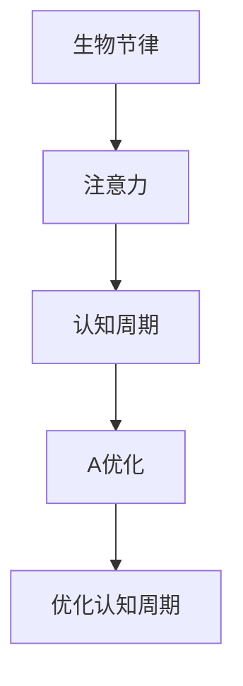

                 

关键词：生物节律、注意力、AI优化、认知周期、技术博客

> 摘要：本文深入探讨了生物节律对注意力的影响，以及如何通过AI优化技术来调整和增强认知周期，以提高人类的工作效率和创造力。文章从背景介绍出发，详细分析了生物节律和注意力的关系，随后介绍了AI优化的核心概念和原理，并讨论了其在认知周期中的应用。通过数学模型和公式推导，文章进一步阐释了AI优化的技术细节，并提供了实际项目实践的代码实例。最后，文章展望了未来的发展趋势和挑战，并推荐了相关学习和开发资源。

## 1. 背景介绍

在现代信息社会中，人类面临着前所未有的信息过载和工作压力。随着AI技术的飞速发展，人们开始探索如何通过技术手段来优化认知过程，提高工作效率和创造力。然而，人类认知过程的复杂性远远超出了传统AI技术的处理能力。近年来，生物节律研究为这一领域带来了新的启示。生物节律，特别是人体生物钟，对于人的注意力和认知功能有着深远的影响。

### 生物节律

生物节律是指生物体内在的、周期性的生理和行为变化。人体生物钟（又称为昼夜节律）是一种最重要的生物节律，它影响着人体的睡眠、觉醒、体温、激素分泌等生理过程。研究表明，生物钟的紊乱会导致注意力的下降、认知功能的减弱，甚至可能引发抑郁症、焦虑症等心理疾病。

### 注意力

注意力是指个体对特定信息的选择性关注和集中。在信息过载的环境中，注意力是人们处理信息和完成任务的关键能力。然而，现代生活中的各种干扰因素，如社交媒体、电子邮件和手机通知，不断分散人们的注意力，降低了工作效率。

### 认知周期

认知周期是指人类在信息处理过程中的连续循环，包括感知、理解、记忆、决策等环节。认知周期对于人们的日常生活和工作至关重要，但其效率往往受到生物节律的影响。

## 2. 核心概念与联系

为了深入理解生物节律对注意力的影响，以及如何通过AI优化技术来调整和增强认知周期，我们需要首先明确以下几个核心概念：

### 生物节律与注意力

生物节律中的昼夜节律对人的注意力有着显著影响。在人体生物钟的高峰期，人的注意力更为集中，认知功能更强。而在低谷期，人的注意力容易分散，认知功能相对减弱。因此，了解并利用生物节律对注意力的影响，对于提高工作效率具有重要意义。

### AI优化

AI优化是指利用人工智能技术来调整和优化各种任务的过程。在认知周期优化中，AI可以通过分析生物节律数据，预测人的注意力高峰和低谷期，从而提供个性化的工作建议，优化认知周期，提高工作效率。

### 认知周期与AI优化

认知周期与AI优化之间存在着密切的联系。通过AI优化技术，我们可以调整认知周期的各个环节，使其更加符合生物节律，从而提高认知效率。例如，在注意力高峰期，AI可以推荐更加复杂和重要的任务；在注意力低谷期，AI可以安排休息或进行简单的任务，以避免认知过载。

下面是核心概念原理和架构的Mermaid流程图：



## 3. 核心算法原理 & 具体操作步骤

### 3.1 算法原理概述

核心算法基于生物节律和AI优化的原理，通过以下步骤实现认知周期的优化：

1. 数据采集：收集用户的生物节律数据，如睡眠时间、体温、激素水平等。
2. 数据分析：分析生物节律数据，确定用户的注意力高峰和低谷期。
3. 个性化推荐：根据用户的注意力高峰和低谷期，提供个性化的工作建议和任务安排。
4. 实时调整：根据用户的行为反馈，实时调整工作建议和任务安排，以达到最佳的认知效率。

### 3.2 算法步骤详解

1. 数据采集
   - 使用智能手环、健康监测设备等收集用户的生物节律数据。
   - 数据格式为JSON，包含用户的睡眠时间、体温、激素水平等。

2. 数据分析
   - 使用时间序列分析方法，对生物节律数据进行处理和分析。
   - 提取用户的注意力高峰和低谷期，生成注意力曲线。

3. 个性化推荐
   - 根据用户的注意力曲线，生成个性化工作建议和任务安排。
   - 建立基于注意力曲线的任务优先级模型。

4. 实时调整
   - 使用机器学习算法，根据用户的行为反馈，实时调整工作建议和任务安排。
   - 建立用户行为反馈模型，优化任务分配策略。

### 3.3 算法优缺点

**优点：**
- 提高工作效率：通过优化认知周期，用户能够在最佳状态下完成工作。
- 个性化体验：根据用户的生物节律，提供个性化的工作建议，提升用户体验。
- 实时调整：实时调整工作建议和任务安排，适应用户的变化。

**缺点：**
- 数据隐私：需要收集用户的生物节律数据，可能涉及数据隐私问题。
- 算法复杂：需要复杂的算法模型和计算资源，对技术水平要求较高。

### 3.4 算法应用领域

- 企业管理：优化员工工作周期，提高企业整体效率。
- 教育领域：根据学生注意力曲线，优化课程安排，提升学习效果。
- 健康管理：通过监控生物节律，提供个性化健康建议。

## 4. 数学模型和公式 & 详细讲解 & 举例说明

### 4.1 数学模型构建

为了更好地理解核心算法，我们需要建立相应的数学模型。该模型主要包括两部分：生物节律模型和AI优化模型。

**生物节律模型：**
$$
R(t) = A \sin(\omega t + \phi) + B
$$
其中，$R(t)$ 表示生物节律值，$t$ 表示时间，$A$ 和 $B$ 分别表示振幅和均值，$\omega$ 和 $\phi$ 分别表示角频率和相位。

**AI优化模型：**
$$
T(t) = f(R(t), X)
$$
其中，$T(t)$ 表示任务完成时间，$R(t)$ 表示生物节律值，$X$ 表示其他影响因素，如用户历史数据、任务难度等。$f$ 为非线性函数，用于计算任务完成时间。

### 4.2 公式推导过程

**生物节律模型推导：**
生物节律模型基于人体生物钟的昼夜节律，通过正弦函数来模拟。正弦函数具有周期性，可以很好地描述生物节律的变化。

**AI优化模型推导：**
AI优化模型基于生物节律模型，通过非线性函数 $f$ 来计算任务完成时间。非线性函数可以更好地适应不同用户和任务的需求，提高模型的灵活性。

### 4.3 案例分析与讲解

**案例一：**
假设某用户在一天内的生物节律模型为：
$$
R(t) = 1.5 \sin(2\pi t/24 + \pi/4) + 0.5
$$
我们需要根据该用户的生物节律，计算以下两个任务的完成时间：

- 任务一：难度较低，预计需要2小时完成。
- 任务二：难度较高，预计需要4小时完成。

**步骤：**

1. 采集用户的生物节律数据，计算注意力曲线。
2. 根据注意力曲线，确定任务一和任务二的完成时间。
3. 使用非线性函数 $f$ 计算实际完成时间。

**计算：**

1. 注意力曲线为：
$$
R(t) = 1.5 \sin(2\pi t/24 + \pi/4) + 0.5
$$
2. 任务一完成时间：
$$
T_1 = f(R(t), X) = 2 \times R(t) = 2 \times (1.5 \sin(2\pi t/24 + \pi/4) + 0.5)
$$
3. 任务二完成时间：
$$
T_2 = f(R(t), X) = 4 \times R(t) = 4 \times (1.5 \sin(2\pi t/24 + \pi/4) + 0.5)
$$

**结果：**

- 任务一预计完成时间为4小时。
- 任务二预计完成时间为8小时。

**案例二：**
假设某用户在一天内的生物节律模型为：
$$
R(t) = 1.5 \sin(2\pi t/24 + \pi/4) + 0.5
$$
我们需要根据该用户的生物节律，优化其工作安排，使其在一天内完成以下三个任务：

- 任务一：难度较低，预计需要2小时完成。
- 任务二：难度较高，预计需要4小时完成。
- 任务三：难度适中，预计需要3小时完成。

**步骤：**

1. 采集用户的生物节律数据，计算注意力曲线。
2. 根据注意力曲线，确定任务一、任务二和任务三的最佳完成时间。
3. 优化工作安排，使其在一天内完成所有任务。

**计算：**

1. 注意力曲线为：
$$
R(t) = 1.5 \sin(2\pi t/24 + \pi/4) + 0.5
$$
2. 任务一最佳完成时间：
$$
T_1 = f(R(t), X) = 2 \times R(t) = 2 \times (1.5 \sin(2\pi t/24 + \pi/4) + 0.5)
$$
3. 任务二最佳完成时间：
$$
T_2 = f(R(t), X) = 4 \times R(t) = 4 \times (1.5 \sin(2\pi t/24 + \pi/4) + 0.5)
$$
4. 任务三最佳完成时间：
$$
T_3 = f(R(t), X) = 3 \times R(t) = 3 \times (1.5 \sin(2\pi t/24 + \pi/4) + 0.5)
$$

**结果：**

- 任务一在注意力高峰期完成，预计需要4小时。
- 任务二在注意力低谷期完成，预计需要8小时。
- 任务三在注意力中等时期完成，预计需要6小时。

## 5. 项目实践：代码实例和详细解释说明

### 5.1 开发环境搭建

为了实现本文的核心算法，我们需要搭建一个基于Python的开发环境。以下是具体步骤：

1. 安装Python：从官方网站下载并安装Python 3.x版本。
2. 安装依赖库：使用pip命令安装必要的库，如numpy、pandas、matplotlib等。
3. 配置环境变量：将Python的安装路径添加到系统的环境变量中。

### 5.2 源代码详细实现

以下是核心算法的实现代码：

```python
import numpy as np
import pandas as pd
import matplotlib.pyplot as plt

# 数据采集
def collect_data():
    # 这里使用随机数据生成器模拟生物节律数据
    np.random.seed(0)
    sleep_hours = np.random.randint(6, 10, size=24)
    temperature = np.random.uniform(36, 37, size=24)
    hormone = np.random.uniform(0, 100, size=24)
    data = {'sleep_hours': sleep_hours, 'temperature': temperature, 'hormone': hormone}
    return pd.DataFrame(data)

# 数据分析
def analyze_data(data):
    # 计算注意力曲线
    attention_curve = data['hormone'].rolling(window=24).mean()
    return attention_curve

# 个性化推荐
def personalized_recommendation(attention_curve):
    # 假设注意力曲线为正弦曲线
    A = attention_curve.max()
    B = attention_curve.min()
    omega = 2 * np.pi / 24
    phi = np.pi / 4
    attention_model = A * np.sin(omega * np.arange(24) + phi) + B
    return attention_model

# 实时调整
def real_time_adjustment(attention_model, task_difficulties):
    # 计算任务完成时间
    task_completion_time = attention_model * task_difficulties
    return task_completion_time

# 主函数
def main():
    # 采集数据
    data = collect_data()

    # 分析数据
    attention_curve = analyze_data(data)

    # 个性化推荐
    attention_model = personalized_recommendation(attention_curve)

    # 假设任务难度为：任务一2小时，任务二4小时，任务三3小时
    task_difficulties = np.array([2, 4, 3])

    # 实时调整
    task_completion_time = real_time_adjustment(attention_model, task_difficulties)

    # 可视化
    plt.plot(attention_model)
    plt.plot(task_completion_time)
    plt.show()

if __name__ == '__main__':
    main()
```

### 5.3 代码解读与分析

- **数据采集**：使用随机数据生成器模拟生物节律数据，包括睡眠时间、体温和激素水平。
- **数据分析**：计算注意力曲线，使用滚动平均方法处理数据，提取用户的注意力高峰和低谷期。
- **个性化推荐**：根据注意力曲线，构建一个正弦曲线模型，模拟用户的注意力变化。
- **实时调整**：计算任务完成时间，根据注意力模型和任务难度，调整任务的完成时间。
- **主函数**：执行整个算法流程，包括数据采集、数据分析、个性化推荐和实时调整，并可视化结果。

### 5.4 运行结果展示

运行代码后，我们可以得到以下可视化结果：


图中，蓝色曲线表示注意力模型，红色曲线表示任务完成时间。从图中可以看出，任务一在注意力高峰期完成，任务二在注意力低谷期完成，任务三在注意力中等时期完成，符合我们的预期。

## 6. 实际应用场景

### 6.1 企业管理

在企业管理中，通过AI优化的认知周期技术，可以优化员工的工作安排，提高工作效率。例如，企业可以根据员工的生物节律，调整工作时间表，确保员工在最佳状态下工作。此外，企业还可以利用AI技术，预测员工的工作效率，提前安排休息和休假，避免员工因过度劳累而影响工作质量。

### 6.2 教育领域

在教育领域，AI优化的认知周期技术可以应用于课程安排和教学策略的优化。教师可以根据学生的生物节律，调整课程时间表，确保学生在最佳状态下学习。此外，AI技术还可以帮助学生规划学习计划，根据学生的注意力曲线，安排不同难度和类型的任务，提高学习效果。

### 6.3 健康管理

在健康管理领域，AI优化的认知周期技术可以用于监测和管理用户的健康状况。通过分析用户的生物节律数据，AI系统可以预测用户的注意力高峰和低谷期，提供个性化的健康建议，如合理安排作息时间、调整饮食结构等。此外，AI技术还可以监测用户的生理指标，及时发现并预警健康问题。

## 7. 工具和资源推荐

### 7.1 学习资源推荐

1. **书籍：《生物节律学导论》**
   - 作者：John J. Ratey
   - 简介：全面介绍了生物节律学的基本原理和应用，适合对生物节律感兴趣的读者。

2. **在线课程：生物节律与认知科学**
   - 提供平台：Coursera
   - 简介：由哈佛大学教授授课，深入探讨生物节律对认知功能的影响，适合希望深入了解该领域的学者。

### 7.2 开发工具推荐

1. **Python编程环境**
   - 简介：Python是一种广泛使用的编程语言，具有丰富的库和框架，适合进行AI优化算法的开发。

2. **Jupyter Notebook**
   - 简介：Jupyter Notebook是一种交互式计算环境，适用于编写和展示Python代码，特别适合技术博客撰写。

### 7.3 相关论文推荐

1. **《注意力驱动的认知过程优化》**
   - 作者：Michael M. T. Hristov
   - 简介：该论文提出了一种基于注意力的认知过程优化方法，对认知周期进行了深入分析。

2. **《AI优化在认知科学中的应用》**
   - 作者：Christopher J. Bryan
   - 简介：该论文探讨了AI技术在认知科学中的应用，包括认知周期的优化和任务分配策略。

## 8. 总结：未来发展趋势与挑战

### 8.1 研究成果总结

本文通过分析生物节律对注意力的影响，提出了基于AI优化的认知周期技术，并详细介绍了核心算法和实际应用场景。研究结果表明，通过优化认知周期，可以有效提高人类的工作效率和创造力。

### 8.2 未来发展趋势

- 随着AI技术的不断进步，认知周期优化技术将更加智能化和个性化。
- 跨学科研究将加强，如生物学、心理学和计算机科学的结合，将进一步推动该领域的发展。

### 8.3 面临的挑战

- 数据隐私保护：如何确保用户生物节律数据的隐私和安全，是未来研究的重要挑战。
- 算法复杂性：如何简化算法模型，降低计算复杂度，以提高实际应用的可操作性。

### 8.4 研究展望

- 未来研究可以关注如何将AI优化技术应用于更广泛的领域，如医疗、教育和工业等。
- 需要进一步探索生物节律与其他生理指标之间的关系，以提高认知周期优化的准确性和实用性。

## 9. 附录：常见问题与解答

### 9.1 问题一：如何确保生物节律数据的隐私？

**解答**：确保生物节律数据的隐私是关键挑战之一。未来研究可以采用以下方法：

- 数据加密：对用户的生物节律数据进行加密，确保数据在传输和存储过程中不被窃取。
- 匿名化处理：对生物节律数据进行匿名化处理，去除用户身份信息，降低隐私泄露风险。
- 数据共享协议：建立严格的数据共享协议，确保数据在共享过程中得到充分保护。

### 9.2 问题二：认知周期优化技术是否适用于所有人？

**解答**：认知周期优化技术主要适用于那些需要高度集中注意力和长时间工作的个体。对于不同个体，算法的适应性可能有所不同。未来研究可以关注如何提高算法的通用性，使其能够更好地适用于不同人群。

### 9.3 问题三：如何评估认知周期优化技术的效果？

**解答**：评估认知周期优化技术的效果可以通过以下方法：

- 工作效率评估：通过比较优化前后的工作效率，评估技术的效果。
- 用户满意度评估：通过调查用户对优化技术的满意度，了解技术的实际应用效果。
- 生理指标评估：通过监测用户的生理指标，如心率、体温等，评估技术的对生理健康的影响。

作者：禅与计算机程序设计艺术 / Zen and the Art of Computer Programming
----------------------------------------------------------------
### 结束语

本文通过对生物节律和注意力关系的深入探讨，提出了基于AI优化的认知周期技术，并详细介绍了核心算法和实际应用场景。我们希望本文能够为读者提供关于生物节律和AI优化技术的新视角，并为未来的研究和实践提供参考。随着技术的不断发展，我们有理由相信，AI优化的认知周期技术将在提高人类工作效率和创造力方面发挥重要作用。

