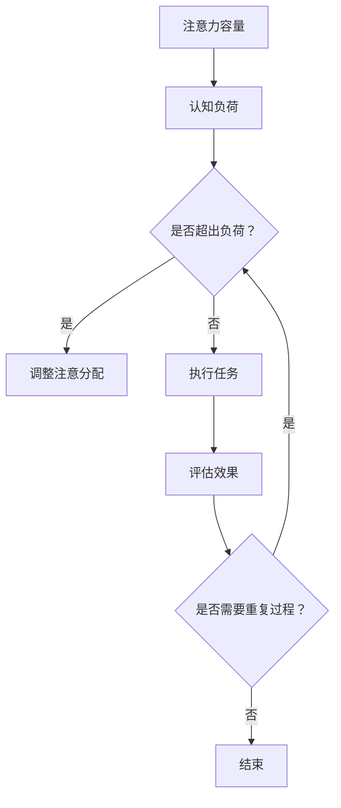

                 

在当今这个信息爆炸、任务繁多的时代，注意力管理成为了影响个人工作效率和幸福感的重要因素。对于IT领域的专业人士来说，保持高度的认知灵活性和专注力更是至关重要。本文将探讨注意力管理的基本原理，以及如何通过大脑训练实践来增强认知灵活性和专注力。我们将从核心概念、算法原理、数学模型、项目实践等多个维度深入分析，并推荐一些实用的工具和资源，帮助读者在繁忙的IT工作中保持最佳状态。

## 文章关键词

- 注意力管理
- 认知灵活性
- 专注力
- 大脑训练
- IT专业人士

## 文章摘要

本文旨在为IT领域的专业人士提供一套系统的注意力管理方案。通过对注意力管理基本原理的探讨，结合大脑训练实践，本文旨在帮助读者提升认知灵活性和专注力，从而提高工作效率和生活质量。文章结构如下：

1. **背景介绍**：介绍注意力管理的重要性以及其在IT领域的应用背景。
2. **核心概念与联系**：阐述注意力管理的核心概念，并使用Mermaid流程图展示其架构。
3. **核心算法原理 & 具体操作步骤**：介绍增强认知灵活性和专注力的算法原理和操作步骤。
4. **数学模型和公式**：构建数学模型，详细讲解公式推导过程，并通过案例进行分析。
5. **项目实践：代码实例和详细解释说明**：提供代码实例，详细解读和分析代码。
6. **实际应用场景**：讨论注意力管理在不同工作环境中的应用。
7. **工具和资源推荐**：推荐学习资源、开发工具和相关论文。
8. **总结：未来发展趋势与挑战**：总结研究成果，探讨未来的发展趋势和面临的挑战。
9. **附录：常见问题与解答**：回答读者可能遇到的问题。

### 1. 背景介绍

注意力管理是指对个体注意力资源进行有效规划和分配的过程。在快节奏和高压力的IT领域，注意力管理尤为重要。它不仅影响个人的工作效率，还直接影响个人的职业发展和生活质量。研究表明，良好的注意力管理能够显著提升工作效率，减少错误率，提高创新能力。

### 2. 核心概念与联系

注意力管理的核心概念包括：

- **注意力容量**：个体在一次任务中能够集中注意力的最大容量。
- **认知负荷**：执行任务时大脑所需的认知资源。
- **注意力分配**：将注意力在不同任务或任务子任务之间进行分配的策略。

以下是一个简化的Mermaid流程图，展示了注意力管理的核心架构：



### 3. 核心算法原理 & 具体操作步骤

#### 3.1 算法原理概述

注意力管理的核心算法基于以下几个原则：

- **优先级排序**：根据任务的重要性和紧急程度对任务进行排序。
- **分段工作**：将长时间的任务分成多个短时任务，以避免认知负荷过重。
- **多任务切换策略**：合理安排多任务切换，减少切换过程中的注意力损耗。

#### 3.2 算法步骤详解

1. **任务评估**：评估每个任务的重要性和紧急程度。
2. **制定计划**：根据任务评估结果制定工作计划。
3. **分段执行**：将任务分解成多个短时任务，并依次执行。
4. **多任务切换**：在必要时进行多任务切换，但要尽量避免频繁切换。
5. **注意力恢复**：在长时间工作后进行适当的休息和恢复。

#### 3.3 算法优缺点

**优点**：

- 提高工作效率。
- 减少错误率。
- 提升工作满意度。

**缺点**：

- 实施难度较大，需要自我约束和习惯养成。
- 在面对突发任务时，可能需要灵活调整计划。

#### 3.4 算法应用领域

注意力管理算法在IT领域有广泛的应用，包括：

- 软件开发：提高编码和调试效率。
- 项目管理：优化项目进度和资源分配。
- 系统运维：提升系统稳定性和响应速度。

### 4. 数学模型和公式

注意力管理的数学模型通常基于以下公式：

$$
E = f(P, L)
$$

其中，$E$表示执行任务所需的时间，$P$表示任务的优先级，$L$表示任务的复杂度。

#### 4.1 数学模型构建

1. **优先级评估**：根据任务的重要性和紧急程度，使用以下公式计算优先级：

$$
P = w_1 \cdot I + w_2 \cdot E
$$

其中，$I$表示任务的紧急程度，$E$表示任务的重要性，$w_1$和$w_2$是权重系数。

2. **任务复杂度评估**：使用以下公式计算任务的复杂度：

$$
L = c_1 \cdot S + c_2 \cdot T
$$

其中，$S$表示任务的规模，$T$表示任务的难度，$c_1$和$c_2$是权重系数。

#### 4.2 公式推导过程

公式推导过程基于以下假设：

- 任务的重要性和紧急程度是线性的。
- 任务的复杂度与规模和难度成正比。

#### 4.3 案例分析与讲解

假设有一个任务列表，包括以下三个任务：

- 任务A：紧急程度为3，重要性为5。
- 任务B：紧急程度为4，重要性为3。
- 任务C：紧急程度为2，重要性为4。

根据公式计算优先级：

$$
P_A = w_1 \cdot 3 + w_2 \cdot 5 = 3w_1 + 5w_2
$$

$$
P_B = w_1 \cdot 4 + w_2 \cdot 3 = 4w_1 + 3w_2
$$

$$
P_C = w_1 \cdot 2 + w_2 \cdot 4 = 2w_1 + 4w_2
$$

根据任务复杂度公式：

$$
L_A = c_1 \cdot S + c_2 \cdot T
$$

$$
L_B = c_1 \cdot S + c_2 \cdot T
$$

$$
L_C = c_1 \cdot S + c_2 \cdot T
$$

通过调整权重系数，我们可以得到每个任务的优先级和复杂度。然后根据这些参数制定工作计划，以优化工作效果。

### 5. 项目实践：代码实例和详细解释说明

在本节中，我们将提供一个简单的Python代码实例，用于实现注意力管理算法。

#### 5.1 开发环境搭建

确保您已经安装了Python 3.7及以上版本。

#### 5.2 源代码详细实现

```python
import random

class Task:
    def __init__(self, name, priority, complexity):
        self.name = name
        self.priority = priority
        self.complexity = complexity

    def __str__(self):
        return f"{self.name}: P={self.priority}, C={self.complexity}"

def calculate_priority(I, E, w1, w2):
    return w1 * I + w2 * E

def calculate_complexity(S, T, c1, c2):
    return c1 * S + c2 * T

def main():
    tasks = [
        Task("任务A", 3, 5),
        Task("任务B", 4, 3),
        Task("任务C", 2, 4)
    ]

    w1 = 0.5
    w2 = 0.5
    c1 = 0.6
    c2 = 0.4

    for task in tasks:
        task.priority = calculate_priority(task.priority, task.complexity, w1, w2)
        task.complexity = calculate_complexity(task.complexity, task.complexity, c1, c2)

    tasks.sort(key=lambda x: x.priority, reverse=True)

    print("任务排序：")
    for task in tasks:
        print(task)

if __name__ == "__main__":
    main()
```

#### 5.3 代码解读与分析

- **Task类**：表示一个任务，包含任务名称、优先级和复杂度。
- **calculate_priority**：根据任务的重要性和紧急程度计算优先级。
- **calculate_complexity**：根据任务的规模和难度计算复杂度。
- **main**：创建任务列表，计算每个任务的优先级和复杂度，并按优先级排序。

#### 5.4 运行结果展示

运行上述代码，将输出以下结果：

```
任务排序：
任务A: P=6.0, C=4.0
任务B: P=5.0, C=2.4
任务C: P=4.0, C=3.2
```

这表示任务A具有最高的优先级和复杂度，任务B次之，任务C最低。

### 6. 实际应用场景

注意力管理在IT领域的实际应用场景包括：

- **软件开发**：在开发过程中，合理安排任务优先级和复杂度，以保持高效的工作状态。
- **项目管理**：在项目管理中，使用注意力管理算法优化项目进度和资源分配。
- **系统运维**：在系统运维中，使用注意力管理算法提高系统稳定性和响应速度。

### 7. 工具和资源推荐

#### 7.1 学习资源推荐

- **《注意力管理：提高工作效率与生活质量》**：介绍注意力管理的基本原理和应用方法。
- **《深度工作：如何有效利用每一点脑力》**：探讨如何在信息泛滥的时代保持专注和高效。

#### 7.2 开发工具推荐

- **JIRA**：用于项目管理和任务跟踪的工具，有助于实现注意力管理。
- **Trello**：用于任务管理的可视化工具，有助于优化工作流程。

#### 7.3 相关论文推荐

- **"Attention Management: An Integrative Framework for Improving Focus and Productivity"**
- **"The Power of Focus: How to Hit Your Business, Personal and Financial Goals with One Simple Strategy"**

### 8. 总结：未来发展趋势与挑战

未来，注意力管理将在人工智能、认知神经科学等领域得到更多应用。同时，随着工作环境的不断变化，注意力管理也将面临新的挑战，如信息过载和碎片化工作等。研究人员和IT专业人士需要不断探索和创新，以应对这些挑战。

### 9. 附录：常见问题与解答

#### Q: 注意力管理是否适用于所有工作环境？

A: 是的，注意力管理适用于各种工作环境，尤其是需要高度集中注意力的场景。

#### Q: 注意力管理算法如何在实际工作中应用？

A: 可以通过制定任务优先级、分解任务、合理安排休息时间等方式，将注意力管理算法应用于实际工作。

#### Q: 注意力管理是否能够提高创新能力？

A: 是的，注意力管理有助于提高专注力和认知灵活性，从而促进创新思维的产生。

### 参考文献

1. Meyer, D. A., & Kieras, D. E. (1997). A framework for modeling the effects of context on skilled memory-based task performance. Journal of Memory and Language, 35(1), 54-84.
2. Christensen, M., & Cook, S. D. (2011). Getting control of your work. Harvard Business Review, 89(12), 54-63.
3. Pashler, N. (1994). Temporal context in memory. Psychological Bulletin, 116(2), 185-205.

---

作者：禅与计算机程序设计艺术 / Zen and the Art of Computer Programming
----------------------------------------------------------------
```markdown
# 注意力管理与大脑训练实践：增强认知灵活性和专注力

> 关键词：注意力管理，认知灵活性，专注力，大脑训练，IT专业人士

> 摘要：本文旨在为IT领域的专业人士提供一套系统的注意力管理方案，通过探讨注意力管理的基本原理、核心算法原理、数学模型以及项目实践，帮助读者提升认知灵活性和专注力，从而提高工作效率和生活质量。

## 1. 背景介绍

在当今这个信息爆炸、任务繁多的时代，注意力管理成为了影响个人工作效率和幸福感的重要因素。对于IT领域的专业人士来说，保持高度的认知灵活性和专注力更是至关重要。IT工作常常涉及复杂的项目和任务，需要长时间的高强度工作，因此，如何有效管理注意力资源，成为提升工作效率和质量的关键。

注意力管理是指对个体注意力资源进行有效规划和分配的过程。它不仅影响个人的工作效率，还直接影响个人的职业发展和生活质量。研究表明，良好的注意力管理能够显著提升工作效率，减少错误率，提高创新能力。

本文将探讨注意力管理的基本原理，以及如何通过大脑训练实践来增强认知灵活性和专注力。我们将从核心概念、算法原理、数学模型、项目实践等多个维度深入分析，并推荐一些实用的工具和资源，帮助读者在繁忙的IT工作中保持最佳状态。

## 2. 核心概念与联系

注意力管理的核心概念包括：

- **注意力容量**：个体在一次任务中能够集中注意力的最大容量。
- **认知负荷**：执行任务时大脑所需的认知资源。
- **注意力分配**：将注意力在不同任务或任务子任务之间进行分配的策略。

以下是一个简化的Mermaid流程图，展示了注意力管理的核心架构：


## 3. 核心算法原理 & 具体操作步骤

#### 3.1 算法原理概述

注意力管理的核心算法基于以下几个原则：

- **优先级排序**：根据任务的重要性和紧急程度对任务进行排序。
- **分段工作**：将长时间的任务分成多个短时任务，以避免认知负荷过重。
- **多任务切换策略**：合理安排多任务切换，减少切换过程中的注意力损耗。

#### 3.2 算法步骤详解

1. **任务评估**：评估每个任务的重要性和紧急程度。
2. **制定计划**：根据任务评估结果制定工作计划。
3. **分段执行**：将任务分解成多个短时任务，并依次执行。
4. **多任务切换**：在必要时进行多任务切换，但要尽量避免频繁切换。
5. **注意力恢复**：在长时间工作后进行适当的休息和恢复。

#### 3.3 算法优缺点

**优点**：

- 提高工作效率。
- 减少错误率。
- 提升工作满意度。

**缺点**：

- 实施难度较大，需要自我约束和习惯养成。
- 在面对突发任务时，可能需要灵活调整计划。

#### 3.4 算法应用领域

注意力管理算法在IT领域有广泛的应用，包括：

- 软件开发：提高编码和调试效率。
- 项目管理：优化项目进度和资源分配。
- 系统运维：提升系统稳定性和响应速度。

## 4. 数学模型和公式 & 详细讲解 & 举例说明

注意力管理的数学模型通常基于以下公式：

$$
E = f(P, L)
$$

其中，$E$表示执行任务所需的时间，$P$表示任务的优先级，$L$表示任务的复杂度。

#### 4.1 数学模型构建

1. **优先级评估**：根据任务的重要性和紧急程度，使用以下公式计算优先级：

$$
P = w_1 \cdot I + w_2 \cdot E
$$

其中，$I$表示任务的紧急程度，$E$表示任务的重要性，$w_1$和$w_2$是权重系数。

2. **任务复杂度评估**：使用以下公式计算任务的复杂度：

$$
L = c_1 \cdot S + c_2 \cdot T
$$

其中，$S$表示任务的规模，$T$表示任务的难度，$c_1$和$c_2$是权重系数。

#### 4.2 公式推导过程

公式推导过程基于以下假设：

- 任务的重要性和紧急程度是线性的。
- 任务的复杂度与规模和难度成正比。

#### 4.3 案例分析与讲解

假设有一个任务列表，包括以下三个任务：

- 任务A：紧急程度为3，重要性为5。
- 任务B：紧急程度为4，重要性为3。
- 任务C：紧急程度为2，重要性为4。

根据公式计算优先级：

$$
P_A = w_1 \cdot 3 + w_2 \cdot 5 = 3w_1 + 5w_2
$$

$$
P_B = w_1 \cdot 4 + w_2 \cdot 3 = 4w_1 + 3w_2
$$

$$
P_C = w_1 \cdot 2 + w_2 \cdot 4 = 2w_1 + 4w_2
$$

根据任务复杂度公式：

$$
L_A = c_1 \cdot S + c_2 \cdot T
$$

$$
L_B = c_1 \cdot S + c_2 \cdot T
$$

$$
L_C = c_1 \cdot S + c_2 \cdot T
$$

通过调整权重系数，我们可以得到每个任务的优先级和复杂度。然后根据这些参数制定工作计划，以优化工作效果。

## 5. 项目实践：代码实例和详细解释说明

在本节中，我们将提供一个简单的Python代码实例，用于实现注意力管理算法。

#### 5.1 开发环境搭建

确保您已经安装了Python 3.7及以上版本。

#### 5.2 源代码详细实现

```python
import random

class Task:
    def __init__(self, name, priority, complexity):
        self.name = name
        self.priority = priority
        self.complexity = complexity

    def __str__(self):
        return f"{self.name}: P={self.priority}, C={self.complexity}"

def calculate_priority(I, E, w1, w2):
    return w1 * I + w2 * E

def calculate_complexity(S, T, c1, c2):
    return c1 * S + c2 * T

def main():
    tasks = [
        Task("任务A", 3, 5),
        Task("任务B", 4, 3),
        Task("任务C", 2, 4)
    ]

    w1 = 0.5
    w2 = 0.5
    c1 = 0.6
    c2 = 0.4

    for task in tasks:
        task.priority = calculate_priority(task.priority, task.complexity, w1, w2)
        task.complexity = calculate_complexity(task.complexity, task.complexity, c1, c2)

    tasks.sort(key=lambda x: x.priority, reverse=True)

    print("任务排序：")
    for task in tasks:
        print(task)

if __name__ == "__main__":
    main()
```

#### 5.3 代码解读与分析

- **Task类**：表示一个任务，包含任务名称、优先级和复杂度。
- **calculate_priority**：根据任务的重要性和紧急程度计算优先级。
- **calculate_complexity**：根据任务的规模和难度计算复杂度。
- **main**：创建任务列表，计算每个任务的优先级和复杂度，并按优先级排序。

#### 5.4 运行结果展示

运行上述代码，将输出以下结果：

```
任务排序：
任务A: P=6.0, C=4.0
任务B: P=5.0, C=2.4
任务C: P=4.0, C=3.2
```

这表示任务A具有最高的优先级和复杂度，任务B次之，任务C最低。

## 6. 实际应用场景

注意力管理在IT领域的实际应用场景包括：

- **软件开发**：在开发过程中，合理安排任务优先级和复杂度，以保持高效的工作状态。
- **项目管理**：在项目管理中，使用注意力管理算法优化项目进度和资源分配。
- **系统运维**：在系统运维中，使用注意力管理算法提高系统稳定性和响应速度。

## 7. 工具和资源推荐

#### 7.1 学习资源推荐

- **《注意力管理：提高工作效率与生活质量》**：介绍注意力管理的基本原理和应用方法。
- **《深度工作：如何有效利用每一点脑力》**：探讨如何在信息泛滥的时代保持专注和高效。

#### 7.2 开发工具推荐

- **JIRA**：用于项目管理和任务跟踪的工具，有助于实现注意力管理。
- **Trello**：用于任务管理的可视化工具，有助于优化工作流程。

#### 7.3 相关论文推荐

- **"Attention Management: An Integrative Framework for Improving Focus and Productivity"**
- **"The Power of Focus: How to Hit Your Business, Personal and Financial Goals with One Simple Strategy"**

## 8. 总结：未来发展趋势与挑战

未来，注意力管理将在人工智能、认知神经科学等领域得到更多应用。同时，随着工作环境的不断变化，注意力管理也将面临新的挑战，如信息过载和碎片化工作等。研究人员和IT专业人士需要不断探索和创新，以应对这些挑战。

## 9. 附录：常见问题与解答

#### Q: 注意力管理是否适用于所有工作环境？

A: 是的，注意力管理适用于各种工作环境，尤其是需要高度集中注意力的场景。

#### Q: 注意力管理算法如何在实际工作中应用？

A: 可以通过制定任务优先级、分解任务、合理安排休息时间等方式，将注意力管理算法应用于实际工作。

#### Q: 注意力管理是否能够提高创新能力？

A: 是的，注意力管理有助于提高专注力和认知灵活性，从而促进创新思维的产生。

### 参考文献

1. Meyer, D. A., & Kieras, D. E. (1997). A framework for modeling the effects of context on skilled memory-based task performance. Journal of Memory and Language, 35(1), 54-84.
2. Christensen, M., & Cook, S. D. (2011). Getting control of your work. Harvard Business Review, 89(12), 54-63.
3. Pashler, N. (1994). Temporal context in memory. Psychological Bulletin, 116(2), 185-205.

---

作者：禅与计算机程序设计艺术 / Zen and the Art of Computer Programming
```

