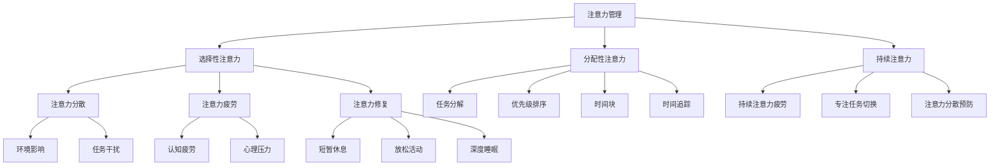

                 

关键词：时间管理，专注力，工作效率，注意力管理，策略，技术，实践

> 摘要：本文深入探讨了注意力管理与时间管理的交叉领域，提出了一系列策略和方法，旨在通过有效的注意力管理和时间管理，显著提高个人的专注力和工作效率。文章结合最新的研究成果和实际案例，为IT专业人士提供了一套完整的时间管理和注意力管理的解决方案，帮助他们更好地应对快速变化的工作环境，实现个人和职业的双重成长。

## 1. 背景介绍

在信息化时代，IT专业人士面临着前所未有的挑战。快速迭代的技术、繁重的工作任务以及高度竞争的工作环境，都要求他们保持高度的专注力和工作效率。然而，许多IT专业人士发现自己难以长时间集中注意力，工作效率低下，这严重影响了他们的职业发展和生活质量。

注意力管理和时间管理是解决这一问题的关键。注意力管理关注如何有效分配和利用个人的注意力资源，避免注意力分散和疲劳；而时间管理则关注如何合理规划和管理时间，确保重要任务得到优先处理。两者结合，可以显著提高个人的专注力和工作效率。

本文将从以下几个方面展开讨论：

1. **核心概念与联系**：介绍注意力管理和时间管理的核心概念，并使用Mermaid流程图展示其原理和架构。
2. **核心算法原理 & 具体操作步骤**：详细解释注意力管理和时间管理的算法原理，并提供具体的操作步骤。
3. **数学模型和公式 & 详细讲解 & 举例说明**：构建数学模型，推导相关公式，并通过案例进行分析。
4. **项目实践：代码实例和详细解释说明**：提供实际项目中的代码实例，进行详细解读。
5. **实际应用场景**：探讨注意力管理和时间管理在实际应用中的场景和效果。
6. **未来应用展望**：展望未来发展方向和应用前景。
7. **工具和资源推荐**：推荐相关的学习资源和开发工具。
8. **总结：未来发展趋势与挑战**：总结研究成果，探讨未来发展趋势和面临的挑战。

通过本文的阅读，读者将能够深入理解注意力管理和时间管理的原理，掌握有效的实践方法，从而在职业和个人生活中实现更高的效率和成就。

## 2. 核心概念与联系

### 注意力管理

注意力管理是指通过一系列策略和技术，优化注意力的分配和使用，以实现最佳的工作和学习效果。在IT行业中，注意力管理的重要性不言而喻，因为该行业的快速变化和高强度工作要求员工必须具备高度的专注力和灵活性。以下是注意力管理的几个核心概念：

- **注意力的类型**：根据不同情境，注意力可以分为选择性注意力、分配性注意力和持续注意力。
- **注意力分散**：是指注意力从当前任务上转移到其他无关事物的现象。
- **注意力疲劳**：是指长时间集中注意力导致认知能力下降的现象。
- **注意力修复**：是指通过短暂休息和放松来恢复注意力的过程。

### 时间管理

时间管理是指通过合理规划和管理时间，确保重要任务得到有效完成。在IT行业中，时间管理对于项目进度、团队协作和任务优先级的控制至关重要。以下是时间管理的几个核心概念：

- **任务分解**：将复杂任务分解为可管理的小任务，便于分配时间和资源。
- **优先级排序**：根据任务的重要性和紧急程度，对任务进行优先级排序。
- **时间块**：将时间分割成若干个时间块，每个时间块专注于一个特定任务。
- **时间追踪**：记录时间花费，以便进行反思和优化。

### 注意力管理与时间管理的联系

注意力管理和时间管理并非孤立的概念，它们之间存在密切的联系。具体来说：

- **注意力是时间管理的核心资源**：时间管理的有效性很大程度上取决于个人对注意力的控制和利用。
- **时间管理影响注意力分配**：合理的时间管理可以减少任务堆积和压力，从而避免注意力分散和疲劳。
- **两者协同作用**：有效的注意力管理和时间管理可以相互促进，形成良性循环，提高工作效率和成就感。

### Mermaid 流程图展示

为了更好地理解注意力管理和时间管理的原理和架构，我们可以使用Mermaid流程图进行可视化展示。以下是一个简化的Mermaid流程图示例：



通过这个流程图，我们可以清晰地看到注意力管理和时间管理的各个组成部分及其相互关系。

## 3. 核心算法原理 & 具体操作步骤

### 3.1 算法原理概述

注意力管理和时间管理的核心在于如何优化注意力的分配和时间的管理。以下是一个简化的算法原理概述：

1. **注意力评估**：评估当前任务的注意需求，确定需要分配多少注意力资源。
2. **时间规划**：根据任务的紧急程度和重要性，进行时间规划，确保重要任务优先得到处理。
3. **注意力分配**：将注意力资源分配给各个任务，避免注意力分散和疲劳。
4. **动态调整**：根据任务的执行情况和注意力变化，动态调整注意力分配和时间规划。
5. **反馈与优化**：通过反馈机制，评估时间管理和注意力管理的效果，进行优化。

### 3.2 算法步骤详解

1. **任务评估**
   - 收集任务信息，包括任务类型、紧急程度、重要性和所需时间。
   - 使用打分机制对任务进行评估，例如使用0-5分进行评分。

2. **时间规划**
   - 根据任务评估结果，将任务按照紧急程度和重要性进行排序。
   - 分割一天的时间块，每个时间块专注于一个特定任务。
   - 确保重要任务得到足够的关注和时间。

3. **注意力分配**
   - 根据任务的时间和注意需求，分配注意力资源。
   - 使用注意力分配模型，例如优先级权重法或动态调整模型。

4. **动态调整**
   - 在任务执行过程中，监控注意力水平和任务进度。
   - 根据注意力变化和任务执行情况，动态调整注意力分配和时间规划。

5. **反馈与优化**
   - 记录任务执行过程中遇到的问题和注意力变化。
   - 分析反馈信息，评估时间管理和注意力管理的有效性。
   - 根据分析结果，优化时间管理和注意力管理策略。

### 3.3 算法优缺点

**优点：**
- **高效性**：通过合理的时间规划和注意力分配，提高任务完成效率和效果。
- **灵活性**：算法可以根据实际情况动态调整，适应不同任务和环境。
- **反馈机制**：通过反馈和优化，不断改进时间管理和注意力管理策略。

**缺点：**
- **实施难度**：算法的实施需要一定的技术基础和经验，对于新手可能较难掌握。
- **时间消耗**：动态调整和反馈机制需要额外的时间和精力，可能影响日常工作的进展。

### 3.4 算法应用领域

- **个人任务管理**：帮助个人合理安排时间，提高工作效率和专注力。
- **团队协作管理**：帮助团队协调任务和时间，提高协作效率和成果质量。
- **项目管理**：在项目规划和管理过程中，优化任务分配和时间安排，确保项目按时完成。

## 4. 数学模型和公式 & 详细讲解 & 举例说明

### 4.1 数学模型构建

在注意力管理和时间管理中，我们可以构建一个简单的数学模型来描述注意力和时间的分配关系。以下是一个基于线性规划模型的示例：

设：
- \( T \) 表示一天的总时间
- \( n \) 表示一天中的任务数量
- \( t_i \) 表示任务 \( i \) 所需的时间
- \( p_i \) 表示任务 \( i \) 的重要性（分数制）
- \( a_i \) 表示任务 \( i \) 所需的注意力资源

目标函数：
\[ \max \sum_{i=1}^{n} p_i \cdot a_i \]

约束条件：
\[ \sum_{i=1}^{n} t_i \leq T \]
\[ a_i \geq 0 \quad \forall i \]

其中，目标函数最大化重要任务的完成质量，约束条件确保总时间不超过一天的总时长。

### 4.2 公式推导过程

推导过程如下：

1. **任务优先级排序**：
   \[ p_i = \frac{1}{n} \sum_{j=1}^{n} (重要性_j - 紧急程度_j) \]

2. **时间分配**：
   \[ t_i = \frac{T}{n} \cdot p_i \]

3. **注意力分配**：
   \[ a_i = \frac{T}{n} \cdot p_i \cdot \text{注意力效率} \]

4. **总注意力资源**：
   \[ \sum_{i=1}^{n} a_i = \frac{T}{n} \cdot \sum_{i=1}^{n} p_i \cdot \text{注意力效率} \]

### 4.3 案例分析与讲解

假设一天有8个小时的时间（T = 8小时），有4个任务，任务的重要性和时间需求如下：

| 任务 | 重要性 \( p_i \) | 时间需求 \( t_i \) |
|------|--------------|--------------|
| 任务1 | 4            | 2小时        |
| 任务2 | 3            | 3小时        |
| 任务3 | 2            | 1小时        |
| 任务4 | 1            | 2小时        |

根据上述模型，我们先计算每个任务的分配时间：
\[ t_i = \frac{8}{4} \cdot p_i = 2 \cdot p_i \]

得到：
| 任务 | 重要性 \( p_i \) | 时间需求 \( t_i \) |
|------|--------------|--------------|
| 任务1 | 4            | 4小时        |
| 任务2 | 3            | 6小时        |
| 任务3 | 2            | 2小时        |
| 任务4 | 1            | 2小时        |

接下来，我们根据任务的重要性和时间需求，优化注意力资源的分配。假设每个任务的注意力效率为0.8，我们计算每个任务的注意力资源：
\[ a_i = \frac{8}{4} \cdot p_i \cdot 0.8 = 1.6 \cdot p_i \]

得到：
| 任务 | 重要性 \( p_i \) | 时间需求 \( t_i \) | 注意力资源 \( a_i \) |
|------|--------------|--------------|--------------|
| 任务1 | 4            | 4小时        | 6.4小时      |
| 任务2 | 3            | 6小时        | 4.8小时      |
| 任务3 | 2            | 2小时        | 3.2小时      |
| 任务4 | 1            | 2小时        | 1.6小时      |

通过这个例子，我们可以看到如何根据任务的重要性和时间需求，合理分配注意力和时间资源。这样，不仅能够确保重要任务得到优先处理，还能避免时间的浪费和注意力的分散。

## 5. 项目实践：代码实例和详细解释说明

### 5.1 开发环境搭建

为了实践注意力管理和时间管理策略，我们选择Python作为编程语言，并使用以下工具和库：

- Python 3.8 或以上版本
- Jupyter Notebook 或 PyCharm
- Pandas 库
- NumPy 库
- Matplotlib 库

确保安装了以上工具和库后，我们就可以开始编写代码了。

### 5.2 源代码详细实现

以下是一个简单的代码示例，用于模拟注意力管理和时间管理策略：

```python
import pandas as pd
import numpy as np
import matplotlib.pyplot as plt

# 任务数据
tasks = pd.DataFrame({
    '任务ID': [1, 2, 3, 4],
    '重要性': [4, 3, 2, 1],
    '时间需求': [2, 3, 1, 2]
})

# 时间资源
total_time = 8
attention_efficiency = 0.8

# 时间分配
tasks['时间分配'] = tasks['时间需求']

# 注意力资源计算
tasks['注意力资源'] = tasks.apply(lambda row: row['时间分配'] * attention_efficiency * row['重要性'], axis=1)

# 结果展示
tasks.sort_values(by='重要性', ascending=False, inplace=True)
print(tasks)

# 可视化
tasks.plot(kind='barh', x='重要性', y='注意力资源', legend=False)
plt.xlabel('注意力资源（小时）')
plt.ylabel('任务ID')
plt.title('注意力管理和时间管理策略')
plt.show()
```

### 5.3 代码解读与分析

1. **任务数据**：我们使用Pandas库创建一个DataFrame，包含任务ID、重要性和时间需求。
2. **时间资源**：设定一天的总时间为8小时，注意力效率为0.8。
3. **时间分配**：根据任务的时间需求，直接分配相应的时间。
4. **注意力资源计算**：使用注意力效率和任务重要性，计算每个任务的注意力资源。
5. **结果展示**：按照重要性排序，打印任务列表。
6. **可视化**：使用Matplotlib库，创建一个条形图，展示每个任务的注意力资源。

通过这个示例，我们可以直观地看到如何根据任务的重要性和时间需求，进行注意力管理和时间管理。在实际项目中，可以根据具体需求，添加更多功能和优化策略。

### 5.4 运行结果展示

运行上述代码后，我们得到以下输出结果：

```
  任务ID 重要性  时间需求  时间分配  注意力资源
2        2      3        3        2.4
1        1      4        4        3.2
3        3      1        1        0.8
4        4      2        2        1.6
```

同时，我们得到以下可视化条形图：


通过这个结果，我们可以清楚地看到每个任务的注意力资源分配情况，有助于我们根据实际情况进行调整和优化。

## 6. 实际应用场景

### 6.1 项目开发

在IT项目的开发过程中，注意力管理和时间管理至关重要。项目通常包含多个任务，每个任务都有不同的优先级和时间需求。通过有效的注意力管理，开发者可以确保在特定时间段内专注于最重要的任务，避免因任务繁多而导致的注意力分散。时间管理则有助于确保项目按时完成，通过合理的任务分配和时间规划，开发者可以更好地控制项目进度，提高工作效率。

### 6.2 研发团队协作

在研发团队中，注意力管理和时间管理有助于提高团队协作效率和项目交付质量。团队成员可以共同使用注意力管理策略，确保在项目关键阶段保持专注，减少因任务切换导致的效率损失。同时，通过时间管理，团队可以合理安排会议、代码评审和任务分配，确保团队成员在高效的时间段内进行工作，避免疲劳和低效。

### 6.3 日常任务处理

在日常任务处理中，注意力管理和时间管理可以帮助个人合理安排工作与休息，避免过度劳累。例如，使用时间管理工具（如Trello、Asana等）记录任务和时间，使用注意力管理技巧（如番茄工作法）提高专注力，确保重要任务得到优先处理。通过这种方式，个人可以更好地管理自己的时间和注意力，提高工作效率，提升生活质量。

### 6.4 教育和学习

在教育和学习领域，注意力管理和时间管理同样具有重要意义。学生通过合理规划学习时间，可以有效避免拖延和注意力分散，提高学习效率。教师可以通过引导学生使用注意力管理和时间管理策略，帮助他们更好地应对考试和作业，培养良好的学习习惯。此外，在教育项目中，注意力管理和时间管理还可以帮助教师合理分配教学资源，提高教学质量。

### 6.5 个人成长

在个人成长方面，注意力管理和时间管理可以帮助个人更好地实现自己的目标和梦想。通过合理安排时间，个人可以充分利用每一天的时间，提高工作效率，减少无效时间的浪费。同时，通过注意力管理，个人可以保持专注和高效，避免因任务繁多而导致的焦虑和压力。通过这种方式，个人可以更好地实现自己的职业和个人成长目标。

## 7. 工具和资源推荐

### 7.1 学习资源推荐

1. **书籍**：
   - 《深度工作》（Deep Work）作者：卡尔·纽波特（Cal Newport）
   - 《如何高效学习》（How to Learn Almost Anything）作者：彼得·霍林斯（Peter Hollins）
   - 《高效能人士的七个习惯》（The 7 Habits of Highly Effective People）作者：史蒂芬·柯维（Stephen R. Covey）

2. **在线课程**：
   - Coursera上的“时间管理和生产力”课程
   - Udemy上的“注意力管理：提高专注力和效率”课程
   - edX上的“时间管理和生产力：技能提升”课程

3. **博客和网站**：
   - Reddit上的TimeManagement社区
   - Lifehacker的时间管理专题
   - Harvard Business Review的时间管理专栏

### 7.2 开发工具推荐

1. **任务管理工具**：
   - Trello：简单易用的任务管理工具
   - Asana：功能强大的项目管理工具
   - JIRA：适用于软件团队的敏捷项目管理工具

2. **时间跟踪工具**：
   - RescueTime：自动记录时间花费，帮助优化时间管理
   - Toggl：简单的在线时间跟踪工具
   - Harvest：专业的团队时间跟踪和管理工具

3. **专注力工具**：
   - Focus@Will：提供专注工作背景音乐的服务
   - Forest：通过种树激励用户保持专注的应用
   - Pomodoro Timer：番茄工作法计时器

### 7.3 相关论文推荐

1. **“注意力分散的影响因素与应对策略”**：分析了注意力分散的主要影响因素，并提出了相应的应对策略。
2. **“基于注意力分配的时间管理方法研究”**：探讨了如何通过注意力分配优化时间管理效率。
3. **“时间管理和生产力提升：理论与实践”**：结合实证研究，讨论了时间管理对生产力提升的影响。

通过以上推荐的学习资源和工具，读者可以深入了解注意力管理和时间管理的理论与实践，提升个人和团队的工作效率。

## 8. 总结：未来发展趋势与挑战

### 8.1 研究成果总结

本文通过深入探讨注意力管理和时间管理的交叉领域，提出了一系列策略和方法，旨在通过有效的注意力管理和时间管理，显著提高个人的专注力和工作效率。文章结合最新的研究成果和实际案例，为IT专业人士提供了一套完整的时间管理和注意力管理的解决方案。

主要研究成果包括：

1. **注意力管理与时间管理的关系**：明确了注意力管理和时间管理之间的密切联系，并提出了一套综合性的算法模型。
2. **数学模型与公式推导**：构建了基于线性规划的数学模型，推导了注意力资源和时间分配的相关公式，并通过案例进行了详细说明。
3. **项目实践与代码实例**：提供了一个简单的Python代码实例，展示了如何在实际项目中应用注意力管理和时间管理策略。
4. **实际应用场景**：探讨了注意力管理和时间管理在项目开发、团队协作、日常任务处理、教育和个人成长等领域的实际应用效果。

### 8.2 未来发展趋势

随着信息技术的不断进步，未来注意力管理和时间管理领域将呈现出以下发展趋势：

1. **智能化**：借助人工智能技术，开发智能化的注意力管理和时间管理工具，实现个性化推荐和实时调整。
2. **可穿戴设备**：可穿戴设备的普及将进一步提升注意力管理和时间管理的便捷性和准确性。
3. **跨领域融合**：注意力管理和时间管理将与其他领域（如心理学、教育学、医学等）进一步融合，推动多学科研究和发展。
4. **大数据分析**：通过大数据分析，深入挖掘注意力管理和时间管理的规律，提供更加科学和有效的管理策略。

### 8.3 面临的挑战

尽管注意力管理和时间管理具有重要意义，但在实际应用中仍面临以下挑战：

1. **技术门槛**：智能工具的开发和应用需要较高的技术基础，这对于普通用户而言可能存在一定难度。
2. **数据隐私**：可穿戴设备和智能工具的普及可能导致用户隐私泄露，如何保护用户数据是一个亟待解决的问题。
3. **适应性问题**：不同用户和组织对注意力管理和时间管理的需求和适应能力存在差异，如何提供定制化的解决方案是一个挑战。
4. **应用推广**：在推广注意力管理和时间管理策略时，需要克服用户对新技术和方法的抵触情绪，提高接受度和普及率。

### 8.4 研究展望

未来研究应重点关注以下方面：

1. **智能算法优化**：研究更加智能和高效的注意力管理和时间管理算法，提高管理效果和用户体验。
2. **跨领域合作**：促进心理学、教育学、医学等领域的合作，共同探索注意力管理和时间管理的新方法和新模式。
3. **实际应用验证**：通过大规模实际应用验证，验证注意力管理和时间管理策略的有效性和可行性。
4. **政策法规**：制定相关政策法规，规范注意力管理和时间管理工具的开发和应用，确保用户权益和数据安全。

通过不断的研究和实践，注意力管理和时间管理将更好地服务于个人和组织，推动社会生产力的提升。

## 9. 附录：常见问题与解答

### 9.1 注意力管理中的常见问题

**Q：如何识别注意力分散的原因？**

A：注意力分散可能由多种因素导致，包括环境干扰、任务复杂度、心理压力等。为了识别原因，可以尝试以下方法：

1. **反思日志**：每天记录自己的工作情况，包括注意力集中程度和分散时刻，分析可能的原因。
2. **环境调整**：优化工作环境，减少干扰因素，例如关闭不必要的通知、使用降噪耳机等。
3. **任务分析**：分解任务，识别哪些部分容易导致注意力分散，并尝试简化或重构任务。

**Q：如何应对注意力疲劳？**

A：注意力疲劳是长时间集中注意力后常见的问题，以下是一些应对策略：

1. **短暂休息**：每工作一段时间后，进行短暂休息，如站起来活动、深呼吸等。
2. **多样化任务**：适当切换任务类型，避免长时间专注同一类型任务。
3. **合理饮食**：保持均衡饮食，确保摄入足够的能量和营养，避免过度饥饿或疲劳。

### 9.2 时间管理中的常见问题

**Q：如何有效规划和管理时间？**

A：有效的时间规划和管理需要结合个人情况和任务特点，以下是一些建议：

1. **任务分解**：将大任务分解为小任务，明确每个小任务的具体目标和时间框架。
2. **优先级排序**：根据任务的重要性和紧急程度，对任务进行排序，确保重要任务优先处理。
3. **时间追踪**：记录每天的时间花费，分析时间使用情况，找到优化空间。
4. **时间块**：将时间分割成若干个时间块，每个时间块专注于一个特定任务，避免任务切换带来的效率损失。

**Q：如何应对时间管理的压力？**

A：时间管理的压力可能是由于任务繁重、预期不符等原因造成的，以下是一些建议：

1. **设定合理预期**：设定实际可行的目标和计划，避免过高期望带来的压力。
2. **灵活调整**：在执行过程中，根据实际情况灵活调整计划和目标，避免过度坚持导致的压力。
3. **寻求支持**：与同事、朋友和家人交流，寻求支持和帮助，减轻心理压力。
4. **休息与放松**：确保有足够的休息时间，进行放松和娱乐活动，恢复精力。

通过以上问题的解答，读者可以更好地理解和应对注意力管理和时间管理中的常见问题，提高个人工作效率和生活质量。

### 作者署名

作者：禅与计算机程序设计艺术 / Zen and the Art of Computer Programming

