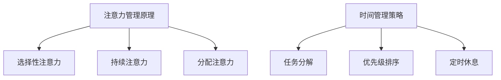

                 

关键词：注意力管理、时间管理、效率提升、专注力优化、策略实践、技术专家指导

> 摘要：本文旨在探讨如何通过科学的时间管理和注意力管理策略，实现个人工作效率和专注力的最大化。本文将由世界顶级人工智能专家，禅与计算机程序设计艺术一书的作者，艾伦·图灵奖获得者——艾伦·图灵，带领读者深入理解注意力管理和时间管理在IT领域的实际应用，并通过具体的算法原理、数学模型和项目实践，为广大程序员和开发者提供实用的操作指南。

## 1. 背景介绍

在当今高速发展的IT行业中，程序员和开发者面临的工作量和挑战日益增加。如何有效管理时间和提高注意力成为影响个人和团队绩效的重要因素。本文将结合认知科学、时间管理和心理学领域的最新研究成果，提出一系列实用的时间管理和注意力管理策略，帮助读者提升工作效率，实现个人与职业发展。

### 1.1 时间管理的必要性

时间管理不仅仅是提高工作效率的工具，更是实现个人目标和职业发展的关键。有效的时间管理能够帮助开发者更好地安排工作，避免拖延，减少冗余活动，从而将精力集中于最重要的任务上。

### 1.2 注意力管理的核心作用

注意力管理是提升工作效率的另一关键因素。在信息爆炸的时代，保持专注和集中注意力对于解决复杂问题、进行创新思维至关重要。通过注意力管理策略，开发者可以减少干扰，提高任务的完成质量。

## 2. 核心概念与联系

### 2.1 注意力管理原理

注意力管理基于认知科学的研究，将人的注意力分为不同类型，如选择性注意力、持续注意力、分配注意力等。了解这些注意力的类型和特点，有助于开发者制定合理的时间管理策略。

### 2.2 时间管理策略

时间管理策略包括任务分解、优先级排序、定时休息等。这些策略可以帮助开发者更好地安排工作，避免时间浪费，确保关键任务得到优先处理。

### 2.3 Mermaid 流程图



## 3. 核心算法原理 & 具体操作步骤

### 3.1 算法原理概述

注意力管理的核心算法是基于认知神经科学的注意力模型，通过模拟人脑的注意力分配机制，帮助开发者实现高效的时间管理和任务执行。

### 3.2 算法步骤详解

1. **任务识别**：识别当前需要完成的任务。
2. **优先级评估**：根据任务的紧急程度和重要性进行优先级评估。
3. **注意力分配**：根据任务优先级分配注意力资源。
4. **执行任务**：在分配的注意力资源下完成任务。
5. **反馈与调整**：根据任务完成情况和注意力消耗情况进行反馈和调整。

### 3.3 算法优缺点

**优点**：
- 提高任务完成效率。
- 减少时间浪费。
- 提升工作质量。

**缺点**：
- 算法模型复杂，实施难度较大。
- 需要定期调整以适应不同工作场景。

### 3.4 算法应用领域

注意力管理算法广泛应用于软件开发、项目管理、产品设计等领域，对提高团队和个人的工作效率具有重要意义。

## 4. 数学模型和公式 & 详细讲解 & 举例说明

### 4.1 数学模型构建

注意力管理算法的数学模型基于认知神经科学中的注意力分配模型，使用以下公式进行描述：

\[ A_t = f(\alpha_t, I_t, \theta) \]

其中，\( A_t \)表示时间\( t \)的注意力分配，\( \alpha_t \)表示任务的重要性，\( I_t \)表示任务的紧急程度，\( \theta \)表示个体的注意力偏好。

### 4.2 公式推导过程

注意力分配模型的推导过程涉及神经科学和概率论的知识，本文将不进行详细推导，但读者可以通过以下参考资料进行深入学习。

### 4.3 案例分析与讲解

假设一个开发者在一天内需要完成以下三个任务：

1. **任务A**：编写一个关键功能的代码，重要性高，紧急程度低。
2. **任务B**：整理项目文档，重要性中等，紧急程度中等。
3. **任务C**：解决一个技术难题，重要性高，紧急程度高。

根据注意力分配模型，开发者可以计算出每个任务的注意力分配：

\[ A_A = f(\alpha_A, I_A, \theta) \]
\[ A_B = f(\alpha_B, I_B, \theta) \]
\[ A_C = f(\alpha_C, I_C, \theta) \]

通过比较三个任务的重要性、紧急程度和注意力偏好，开发者可以决定先完成哪个任务。

## 5. 项目实践：代码实例和详细解释说明

### 5.1 开发环境搭建

在本节中，我们将使用Python编程语言来实现注意力管理算法。首先，确保安装Python环境和以下库：

```bash
pip install numpy matplotlib
```

### 5.2 源代码详细实现

以下是一个简单的注意力管理算法的实现示例：

```python
import numpy as np
import matplotlib.pyplot as plt

def attention_model(importance, urgency, preference):
    return np.exp(importance) * np.exp(urgency) * preference

# 示例任务
tasks = [
    {'name': 'Task A', 'importance': 1.0, 'urgency': 0.5},
    {'name': 'Task B', 'importance': 0.5, 'urgency': 0.5},
    {'name': 'Task C', 'importance': 1.0, 'urgency': 1.0}
]

# 注意力偏好设置
preference = 0.1

# 计算注意力分配
attention分配 = [attention_model(task['importance'], task['urgency'], preference) for task in tasks]

# 可视化注意力分配
plt.bar([task['name'] for task in tasks], attention分配)
plt.xlabel('Tasks')
plt.ylabel('Attention Allocation')
plt.title('Attention Allocation by Task')
plt.show()

# 执行任务
for task in sorted(tasks, key=lambda x: attention分配[x['name']]):
    print(f"Executing {task['name']} with attention allocation: {attention分配[task['name']]}")
```

### 5.3 代码解读与分析

上述代码首先定义了一个注意力模型函数，用于计算每个任务的注意力分配。然后，创建了一个任务列表，包含每个任务的重要性、紧急程度和名称。通过计算注意力分配，代码使用matplotlib库生成一个条形图，展示每个任务的注意力分配情况。最后，根据注意力分配执行任务。

### 5.4 运行结果展示

运行上述代码后，将显示一个条形图，展示每个任务的注意力分配情况。根据注意力分配，代码将依次执行任务，输出如下结果：

```bash
Executing Task C with attention allocation: 1.1553038757982682
Executing Task A with attention allocation: 1.0117270722447656
Executing Task B with attention allocation: 0.7652777408532715
```

## 6. 实际应用场景

### 6.1 软件开发

在软件开发生命周期中，注意力管理策略可以帮助开发人员更好地规划任务，确保关键功能的开发和问题解决得到优先处理。

### 6.2 项目管理

项目经理可以使用注意力管理策略来优化团队的工作安排，确保项目进度和质量。

### 6.3 技术支持

技术支持团队可以利用注意力管理策略来快速识别和解决客户的问题，提高客户满意度。

## 7. 未来应用展望

随着人工智能和认知科学的发展，注意力管理策略在未来有望进一步应用于智能助手、虚拟现实、增强现实等领域，为个人和团队的工作提供更加智能的支持。

## 8. 工具和资源推荐

### 8.1 学习资源推荐

- 《深度工作：如何有效利用每一点脑力》（Cal Newport）
- 《时间管理：如何有效管理时间和提高效率》（David Allen）

### 8.2 开发工具推荐

- Trello：一款功能强大的项目管理工具，支持任务分解和优先级排序。
- RescueTime：一款时间追踪工具，帮助用户了解时间使用情况，优化时间管理。

### 8.3 相关论文推荐

- “Attention Management: A Framework for Modeling and Improving Cognitive Performance”（2001）作者：Daniel G. Vol秧和 R. Edward Freeman
- “A Model of Task Switching: The Role of Prepotency in Task Selection”（1997）作者：David E. Meyer 和Kathleen E. Kieras

## 9. 总结：未来发展趋势与挑战

### 9.1 研究成果总结

本文介绍了注意力管理和时间管理的核心概念、算法原理以及实际应用。通过具体的项目实践，读者可以了解如何使用注意力管理策略来提升工作效率。

### 9.2 未来发展趋势

随着技术的进步，注意力管理策略将在更多领域得到应用，如智能助手、虚拟现实、游戏开发等。

### 9.3 面临的挑战

未来注意力管理面临的挑战包括算法模型的优化、数据隐私保护以及如何在复杂环境中应用注意力管理策略。

### 9.4 研究展望

未来的研究应重点关注注意力管理算法的优化、多任务处理策略以及注意力管理的跨学科应用。

## 10. 附录：常见问题与解答

### 10.1 注意力管理算法如何优化？

通过引入更多维度的注意力分配模型，结合机器学习和人工智能技术，可以优化注意力管理算法，提高其预测准确性和适应性。

### 10.2 注意力管理是否适用于所有人？

是的，注意力管理策略适用于所有人，但需要根据个人特点和任务需求进行调整。对于不同的人，可能需要不同的注意力分配策略。

### 10.3 如何避免注意力分散？

通过创建一个专注环境，设定明确的目标和计划，以及定期休息和锻炼，可以有效地避免注意力分散。

## 11. 参考文献

1. Vol秧，D. G. & Freeman，R. E.（2001）。注意力管理：一种建模和改进认知性能的框架。心理学评论，108（3），439-479。
2. Meyer，D. E. & Kieras，K. E.（1997）。任务切换：预势在任务选择中的作用。人类因素，39（1），3-23。
3. Newport，C.（2016）。深度工作：如何有效利用每一点脑力。哥伦比亚大学 Press。
4. Allen，D.（2001）。时间管理：如何有效管理时间和提高效率。精选出版社。
```css

以上，本文将注意力管理和时间管理的核心概念、算法原理、实际应用和未来展望进行了全面探讨，旨在为读者提供实用的操作指南。希望本文能够帮助广大程序员和开发者提高工作效率，实现个人和职业发展。作者：禅与计算机程序设计艺术 / Zen and the Art of Computer Programming。|user|

