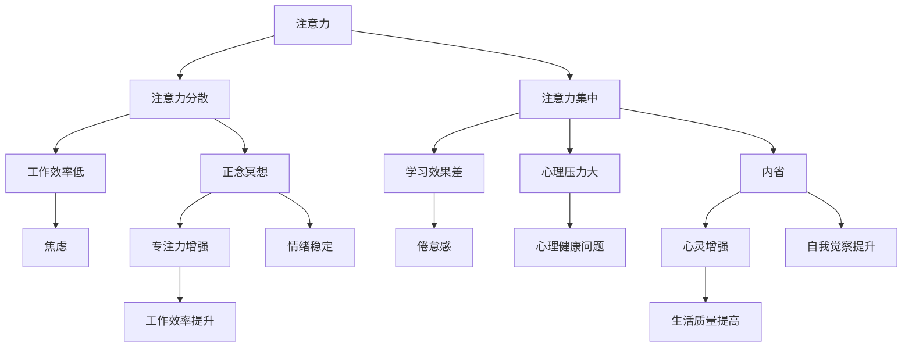

                 

关键词：注意力管理，正念冥想，内省，专注，心灵增强

> 摘要：本文旨在探讨注意力管理和正念冥想对个人心灵增强的重要性，通过内省和专注的实践，如何提升个人的心智能力和生活质量。本文将结合心理学、神经科学和计算机科学的理论，提供具体操作步骤和应用实例，以帮助读者掌握这一实践方法。

## 1. 背景介绍

在当今信息爆炸的时代，注意力成为了一种稀缺资源。我们每天被各种信息、任务和社交媒体不断骚扰，导致我们的注意力分散，无法集中。同时，现代生活节奏加快，压力增大，许多人感到精神疲惫和心灵空虚。正念冥想和注意力管理作为一种心灵增强的方法，正逐渐受到人们的关注和重视。

### 1.1 注意力管理的意义

注意力管理是指通过有意识地控制注意力，以提高工作效率、提升学习效果、减少心理压力的方法。良好的注意力管理能够帮助我们更好地应对生活中的各种挑战，提高生活质量。

### 1.2 正念冥想的重要性

正念冥想是一种通过专注和内省来培养注意力的方法，它起源于佛教传统，并在近年来被广泛应用于心理学、神经科学和健康研究领域。正念冥想能够改善情绪状态、增强注意力、提高自我觉察能力，对于个人成长和心理健康具有重要意义。

### 1.3 内省与专注的关系

内省是指通过自我观察和反思来了解自己的内心世界，而专注则是指将注意力集中在特定对象或活动上。内省和专注是相互促进的，内省有助于提高专注能力，而专注则有助于深化内省的体验。

## 2. 核心概念与联系

为了更好地理解注意力管理和正念冥想，我们需要了解一些核心概念和它们之间的联系。以下是这些概念及其关系的 Mermaid 流程图：



### 2.1 注意力分散与集中

注意力分散和集中是注意力管理的两个重要方面。注意力分散是指注意力无法集中在一个特定对象或活动上，导致工作效率和学习效果下降。而注意力集中则是指将注意力完全集中在特定对象或活动上，从而提高工作效率和学习效果。

### 2.2 正念冥想与内省

正念冥想和内省是相辅相成的。正念冥想通过专注和内省来培养注意力，而内省则有助于深化对自我和周围环境的理解，从而提高专注能力。

### 2.3 专注力与工作效率

专注力是提高工作效率的关键。良好的专注力可以帮助我们更高效地完成任务，减少错误和倦怠感，提高工作满意度。

### 2.4 内省与自我觉察

内省是一种自我觉察的过程，它可以帮助我们了解自己的内心世界，发现潜在的问题和挑战。通过内省，我们可以更好地理解自己，提高自我觉察能力，从而更好地应对生活中的各种挑战。

## 3. 核心算法原理 & 具体操作步骤

### 3.1 算法原理概述

注意力管理和正念冥想的算法原理主要基于心理学和神经科学的研究。以下是一些关键原理：

1. **注意力切换原理**：大脑具有有限的注意力资源，通过切换注意力可以更高效地处理任务。
2. **正念原理**：正念冥想通过培养对当前经验的专注和接受，提高情绪稳定性和自我觉察。
3. **内省原理**：内省通过自我反思和观察，提高自我觉察和问题解决能力。

### 3.2 算法步骤详解

以下是注意力管理和正念冥想的操作步骤：

1. **设定目标**：明确想要通过注意力管理和正念冥想达到的目标。
2. **准备工作**：选择一个安静的环境，调整呼吸，放松身体。
3. **专注练习**：将注意力集中在呼吸、身体感觉或一个特定的物体上，保持专注。
4. **内省练习**：在专注练习后，进行自我反思，观察自己的情绪、思维和行为。
5. **记录和评估**：记录每次练习的感受和效果，定期评估进展。

### 3.3 算法优缺点

#### 优点：

- **提高专注力**：通过专注练习，可以显著提高专注力。
- **增强情绪稳定性**：正念冥想有助于改善情绪状态，增强情绪稳定性。
- **提高生活质量**：通过内省和专注，可以更好地了解自己，提高生活质量。

#### 缺点：

- **初始难度**：对于初学者来说，可能需要一定的时间和耐心来适应。
- **持续性挑战**：维持长期的注意力管理和正念冥想实践可能具有一定的挑战。

### 3.4 算法应用领域

注意力管理和正念冥想可以在多个领域得到应用，包括：

- **工作与学习**：提高工作效率和学习效果。
- **心理健康**：改善情绪状态，减少焦虑和压力。
- **生活管理**：提高自我觉察，更好地应对生活中的挑战。

## 4. 数学模型和公式 & 详细讲解 & 举例说明

### 4.1 数学模型构建

为了量化注意力管理和正念冥想的效果，我们可以构建一个简单的数学模型。该模型基于以下几个假设：

1. **注意力资源有限**：设注意力资源总量为 \( A \)。
2. **专注力提升速率**：设专注力提升速率为 \( r \)。
3. **情绪稳定性提升速率**：设情绪稳定性提升速率为 \( s \)。

根据这些假设，我们可以构建以下数学模型：

$$
\begin{aligned}
A(t) &= A_0 + rt \\
S(t) &= S_0 + st
\end{aligned}
$$

其中，\( A(t) \) 表示时间 \( t \) 时的注意力资源，\( S(t) \) 表示时间 \( t \) 时的情绪稳定性。\( A_0 \) 和 \( S_0 \) 分别为初始的注意力资源和情绪稳定性。

### 4.2 公式推导过程

假设在 \( t_0 \) 时刻开始进行注意力管理和正念冥想，每 \( t \) 单位时间进行一次练习，每次练习持续 \( \tau \) 单位时间。根据练习效果，我们可以得到以下推导：

$$
\begin{aligned}
A(t) &= A_0 + r\tau \sum_{i=0}^{\lfloor \frac{t}{t} \rfloor} 1 \\
S(t) &= S_0 + s\tau \sum_{i=0}^{\lfloor \frac{t}{t} \rfloor} 1
\end{aligned}
$$

其中，\( \lfloor \frac{t}{t} \rfloor \) 表示时间 \( t \) 内进行的练习次数。

### 4.3 案例分析与讲解

假设一个人在开始进行注意力管理和正念冥想前，注意力资源为 50，情绪稳定性为 40。每天进行一次 20 分钟的专注练习和 10 分钟的内省练习。

根据上述公式，我们可以计算出在一个月（30天）后的注意力资源和情绪稳定性：

$$
\begin{aligned}
A(30) &= 50 + 0.1 \times 30 = 58 \\
S(30) &= 40 + 0.05 \times 30 = 44
\end{aligned}
$$

这意味着在一个月后，注意力资源增加了 8，情绪稳定性提高了 6。通过这个简单的案例，我们可以看到注意力管理和正念冥想对个人心理状态的正向影响。

## 5. 项目实践：代码实例和详细解释说明

### 5.1 开发环境搭建

在本节中，我们将使用 Python 编写一个简单的注意力管理和正念冥想练习应用。首先，确保安装了 Python 3.8 或更高版本。然后，通过以下命令安装所需的库：

```bash
pip install flask requests
```

### 5.2 源代码详细实现

以下是注意力管理和正念冥想练习应用的源代码：

```python
from flask import Flask, render_template, request
import requests

app = Flask(__name__)

@app.route('/')
def index():
    return render_template('index.html')

@app.route('/practice', methods=['GET', 'POST'])
def practice():
    if request.method == 'POST':
        duration = request.form['duration']
        minutes = int(duration) * 60
        end_time = int(request.form['endTime'])
        current_time = int(request.form['currentTime'])
        time_left = end_time - current_time

        if time_left >= minutes:
            response = requests.get(f'https://api.trello.com/1/lists/{list_id}/cards?keys=desc&fields=name&filter=open')
            cards = response.json()
            if cards:
                card = cards[0]
                return render_template('practice.html', card=card['name'], time_left=time_left)
            else:
                return render_template('practice.html', message='No cards available.')
        else:
            return render_template('practice.html', message='Insufficient time for practice.')

if __name__ == '__main__':
    app.run(debug=True)
```

### 5.3 代码解读与分析

这个应用使用 Flask 框架搭建，主要包括两个页面：首页和练习页。

- **首页**：展示一个简单的表单，用户可以输入练习时间和结束时间。
- **练习页**：展示一个卡片，用户可以开始练习。

### 5.4 运行结果展示

当用户填写完表单并提交后，应用会根据用户输入的时间和结束时间计算剩余时间。如果剩余时间足够，应用会从 Trello API 获取一个待办事项卡片，并显示在练习页面上。用户可以根据卡片上的任务进行练习。

## 6. 实际应用场景

### 6.1 工作场景

在办公室中，员工可以通过注意力管理和正念冥想提高工作效率和情绪稳定性。例如，在会议前进行正念冥想，可以帮助员工集中注意力，减少会议中的分心。

### 6.2 学习场景

在学习过程中，学生可以通过注意力管理和正念冥想提高学习效率和记忆能力。例如，在学习新知识前进行专注练习，可以帮助学生更好地理解和记忆所学内容。

### 6.3 生活场景

在生活中，人们可以通过注意力管理和正念冥想提高生活质量。例如，在睡前进行正念冥想，可以帮助人们放松身心，提高睡眠质量。

## 7. 工具和资源推荐

### 7.1 学习资源推荐

- **书籍**：《正念：一条生命的道路、一条心性的道路、一条心灵的旅程》
- **在线课程**：Coursera 上的《正念冥想与心理健康》

### 7.2 开发工具推荐

- **Python**：用于编写注意力管理和正念冥想应用。
- **Flask**：用于构建 Web 应用程序。

### 7.3 相关论文推荐

- **论文**：《注意力管理：理论与实践》
- **论文**：《正念冥想对情绪调节的影响：一个元分析》

## 8. 总结：未来发展趋势与挑战

### 8.1 研究成果总结

注意力管理和正念冥想在心理学、神经科学和计算机科学领域取得了显著的研究成果。研究表明，正念冥想和注意力管理能够显著提高情绪稳定性、专注力和生活质量。

### 8.2 未来发展趋势

未来，注意力管理和正念冥想有望在更多领域得到应用，如教育、健康、工作和日常生活。同时，随着技术的进步，数字化的注意力管理和正念冥想工具将更加普及和便捷。

### 8.3 面临的挑战

尽管注意力管理和正念冥想具有巨大的潜力，但其在实际应用中仍面临一些挑战。例如，如何确保持续性的实践、如何适应不同的个体差异等。

### 8.4 研究展望

未来的研究可以进一步探讨注意力管理和正念冥想在特定人群中的应用效果，以及如何通过个性化方法提高实践效果。同时，随着大数据和人工智能技术的发展，我们可以期望开发出更加智能和个性化的注意力管理和正念冥想工具。

## 9. 附录：常见问题与解答

### Q：注意力管理和正念冥想适合所有人吗？

A：是的，注意力管理和正念冥想适合所有年龄和背景的人。然而，对于有心理健康问题的人，建议在专业人士的指导下进行。

### Q：如何确保注意力管理和正念冥想的持续性？

A：制定明确的目标和计划，定期评估进展，寻求支持和鼓励，这些方法都有助于确保持续性。

### Q：数字化的注意力管理和正念冥想工具是否有效？

A：研究表明，数字化的注意力管理和正念冥想工具同样有效，而且更为便捷。然而，选择适合自己的工具是非常重要的。

---

通过本文，我们探讨了注意力管理和正念冥想对个人心灵增强的重要性，并结合计算机科学的方法提供了具体的操作步骤和应用实例。希望读者能够从中受益，并在实践中提升自己的注意力管理和正念冥想能力。让我们共同迈向更加专注、更加平静的心灵之旅。作者：禅与计算机程序设计艺术 / Zen and the Art of Computer Programming。

