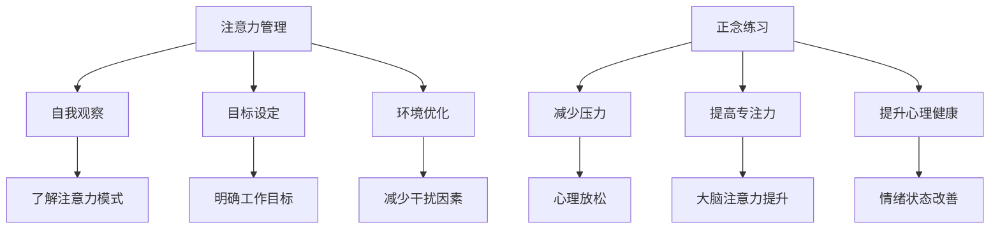

                 

关键词：注意力管理，正念练习，专注力，心灵清晰度，技术实践，心理健康，IT领域

> 摘要：在信息技术快速发展的时代，程序员和开发者面临着巨大的压力和挑战。本文通过介绍注意力管理和正念练习的核心概念，探讨如何在快节奏的工作环境中增强专注力和心灵清晰度，提高工作效率和心理健康。文章将结合实际案例，详细阐述正念练习的方法和技巧，为IT从业者提供切实可行的实践指南。

## 1. 背景介绍

随着计算机技术的飞速发展，IT行业已经成为全球经济的重要驱动力。程序员和开发者作为这一领域的核心力量，他们需要处理复杂的算法、大量的代码以及不断变化的技术趋势。这种工作环境要求他们具备高度的专注力和清晰的思维，然而，长期的编码工作往往伴随着疲劳、焦虑和压力，使得专注力和心灵清晰度逐渐减弱。

### 现状分析

根据多项研究和调查，程序员和开发者普遍面临着以下问题：

1. **专注力下降**：长时间面对屏幕，程序员容易受到外界干扰，导致注意力分散，影响工作效率。
2. **心灵不清晰**：工作中的高压环境容易导致心理疲劳，甚至出现焦虑和抑郁等心理问题。
3. **心理健康问题**：长时间的编程工作对心理健康造成了负面影响，如失眠、焦虑和压力等。

### 解决方案

为了应对这些问题，许多程序员和开发者开始寻求新的方法来提高自己的专注力和心理健康。注意力管理和正念练习成为了一种备受关注的方法。本文将探讨这些方法在IT领域的应用，并分享一些实用的技巧和经验。

## 2. 核心概念与联系

### 注意力管理

注意力管理是一种通过自我意识和策略来优化注意力集中和资源利用的方法。它可以帮助程序员更好地应对复杂的工作任务，提高工作效率。注意力管理的关键在于：

- **自我观察**：了解自己的注意力模式和习惯。
- **目标设定**：明确具体的工作目标，并确保注意力集中在这些目标上。
- **环境优化**：创造一个有利于专注的工作环境，减少干扰因素。

### 正念练习

正念练习是一种源自佛教传统的冥想练习，强调活在当下，专注于当前的经历。正念练习对心理健康有诸多益处，包括：

- **减少压力**：通过专注于呼吸和身体感觉，减轻心理压力和焦虑。
- **提高专注力**：通过练习正念，可以提高大脑的注意力和集中能力。
- **提升心理健康**：正念练习有助于改善情绪状态，提高自我意识。

### Mermaid 流程图

以下是注意力管理和正念练习的核心概念和联系：



## 3. 核心算法原理 & 具体操作步骤

### 3.1 算法原理概述

注意力管理和正念练习的核心在于通过自我观察、目标设定和环境优化来提高专注力，以及通过正念练习来减少压力和提升心理健康。

### 3.2 算法步骤详解

1. **自我观察**：程序员可以通过记录自己的注意力模式和工作习惯，了解哪些因素会分散注意力。
2. **目标设定**：设定明确、具体的工作目标，并确保注意力集中在这些目标上。
3. **环境优化**：创造一个有利于专注的工作环境，减少干扰因素。
4. **正念练习**：
    - **呼吸练习**：专注于呼吸，通过深呼吸来放松身心。
    - **身体感觉**：关注身体的感觉，如身体的重量、触感等。
    - **情绪觉察**：观察自己的情绪变化，并学会接纳和处理负面情绪。

### 3.3 算法优缺点

- **优点**：
  - 提高专注力和工作效率。
  - 减少压力和焦虑，提升心理健康。
  - 增强自我意识和情绪管理能力。
- **缺点**：
  - 需要持续的练习和自我观察。
  - 在高压环境下，初学者可能难以立即看到效果。

### 3.4 算法应用领域

注意力管理和正念练习在IT领域具有广泛的应用，包括：

- **软件开发**：提高编码效率和代码质量。
- **项目管理**：优化时间管理和团队协作。
- **个人成长**：提升自我认知和心理健康。

## 4. 数学模型和公式 & 详细讲解 & 举例说明

### 4.1 数学模型构建

注意力管理和正念练习的核心在于提高自我意识和情绪管理能力。以下是构建数学模型的基本思路：

- **自我意识**：通过记录和分析注意力模式和工作习惯，构建注意力模型的参数。
- **情绪管理**：通过评估情绪状态和反应，构建情绪管理的模型。

### 4.2 公式推导过程

- **注意力模型**：

  $$A_t = f(B_t, C_t, D_t)$$

  其中，$A_t$表示第$t$次的注意力水平，$B_t$表示自我观察的结果，$C_t$表示目标设定的效果，$D_t$表示环境优化的效果。

- **情绪管理模型**：

  $$E_t = g(F_t, G_t, H_t)$$

  其中，$E_t$表示第$t$次的情绪状态，$F_t$表示呼吸练习的效果，$G_t$表示身体感觉的专注程度，$H_t$表示情绪觉察的结果。

### 4.3 案例分析与讲解

假设一位程序员在工作期间面临以下情况：

- **注意力分散**：每天需要处理大量代码，但经常被邮件、社交媒体等外部因素干扰。
- **情绪波动**：工作压力导致情绪不稳定，容易出现焦虑和烦躁。

通过注意力管理和正念练习，该程序员可以采取以下措施：

1. **自我观察**：记录每天的工作时间、注意力分散的原因以及情绪变化。
2. **目标设定**：设定每天的工作目标，确保注意力集中在这些目标上。
3. **环境优化**：关闭不必要的通知和干扰，创造一个安静、专注的工作环境。
4. **正念练习**：
    - **呼吸练习**：每天进行5分钟的深呼吸练习，帮助放松身心。
    - **身体感觉**：在工作间隙，关注身体的感觉，如坐姿、呼吸等。
    - **情绪觉察**：观察自己的情绪变化，学会接纳和处理负面情绪。

经过一段时间的实践，该程序员发现：

- **注意力水平**：逐渐提高，工作效率明显提升。
- **情绪状态**：情绪波动减少，心理压力减轻。

## 5. 项目实践：代码实例和详细解释说明

### 5.1 开发环境搭建

为了更好地实践注意力管理和正念练习，我们需要搭建一个简单的开发环境。以下是一个基本的Python环境搭建步骤：

1. 安装Python：从官方网站下载并安装Python。
2. 安装IDE：选择一个适合Python开发的IDE，如PyCharm或VSCode。
3. 安装必要的库：使用pip安装必要的库，如matplotlib、numpy等。

### 5.2 源代码详细实现

以下是一个简单的Python脚本，用于记录注意力水平和情绪状态：

```python
import datetime

def record_attention(attention_level):
    with open('attention_log.txt', 'a') as file:
        timestamp = datetime.datetime.now()
        file.write(f"{timestamp}: {attention_level}\n")

def record_emotion(emotion):
    with open('emotion_log.txt', 'a') as file:
        timestamp = datetime.datetime.now()
        file.write(f"{timestamp}: {emotion}\n")

# 记录注意力水平
record_attention("高")

# 记录情绪状态
record_emotion("轻松")
```

### 5.3 代码解读与分析

这段代码定义了两个函数：`record_attention`和`record_emotion`。这两个函数用于记录当前的注意力水平和情绪状态。每次调用这些函数时，都会将当前的时间戳和记录的内容写入到文本文件中。

### 5.4 运行结果展示

运行上述代码后，将在当前目录下生成两个文本文件：`attention_log.txt`和`emotion_log.txt`。这两个文件将记录每天的注意力水平和情绪状态。

## 6. 实际应用场景

### 6.1 软件开发

在软件开发过程中，程序员可以通过注意力管理和正念练习来提高编码效率和代码质量。例如，通过自我观察和目标设定，程序员可以更好地管理自己的时间，避免分心和拖延。

### 6.2 项目管理

在项目管理中，正念练习可以帮助项目经理更好地应对压力和挑战。通过呼吸练习和情绪觉察，项目经理可以保持冷静和清晰的思维，从而更好地规划和管理项目。

### 6.3 个人成长

对于IT从业者来说，注意力管理和正念练习是一种重要的个人成长工具。通过持续的练习，他们可以提升自我意识和情绪管理能力，从而更好地应对工作和生活中的挑战。

## 7. 工具和资源推荐

### 7.1 学习资源推荐

- 《正念：一种心灵修炼的方法》（作者：乔·卡巴金）
- 《注意力管理：如何提高专注力、减少干扰》（作者：詹姆斯·马奇）

### 7.2 开发工具推荐

- PyCharm：一款强大的Python IDE，支持多种编程语言。
- VSCode：一款轻量级、开源的代码编辑器，支持丰富的插件。

### 7.3 相关论文推荐

- "Attention Management in Software Development"（软件开发中的注意力管理）
- "Mindfulness for IT Professionals"（IT从业者的正念练习）

## 8. 总结：未来发展趋势与挑战

### 8.1 研究成果总结

注意力管理和正念练习在提高IT从业者的专注力和心理健康方面具有显著效果。通过自我观察、目标设定、环境优化和正念练习，程序员和开发者可以更好地应对工作压力和挑战。

### 8.2 未来发展趋势

随着信息技术的发展，注意力管理和正念练习有望在更多领域得到应用。例如，虚拟现实、增强现实和人工智能等领域，都可能借助这些方法来提升用户体验和开发者效率。

### 8.3 面临的挑战

尽管注意力管理和正念练习具有显著的优势，但在实际应用中仍然面临一些挑战。例如，初学者可能难以坚持练习，或者缺乏有效的指导。此外，如何将注意力管理和正念练习融入到日常工作和生活中，也是一个需要解决的问题。

### 8.4 研究展望

未来，研究者可以进一步探索注意力管理和正念练习在不同工作环境和情境下的应用效果。同时，开发更便捷、有效的工具和平台，以帮助程序员和开发者更好地实践这些方法。

## 9. 附录：常见问题与解答

### 问题1：正念练习需要多长时间才能看到效果？

答：正念练习的效果因人而异。一般来说，持续练习至少几周后，人们可以感受到明显的改善。然而，要达到最佳效果，建议至少持续练习几个月。

### 问题2：注意力管理和正念练习适合所有人吗？

答：是的，注意力管理和正念练习适合所有年龄段和职业的人。然而，对于初学者来说，可能需要一定的时间来适应和掌握这些方法。

### 问题3：如何克服练习中的困难？

答：可以尝试以下方法：
- 找到适合自己的练习时间和环境。
- 参加线上或线下的正念课程，获取专业的指导。
- 坚持练习，即使初期效果不明显，也要保持耐心。

## 结语

注意力管理和正念练习为IT从业者提供了一种有效的方法来应对工作压力和提高心理健康。通过自我观察、目标设定、环境优化和正念练习，程序员和开发者可以更好地管理自己的注意力，提高工作效率和幸福感。希望本文能对您有所帮助，祝您在编程之路上越走越远。

### 作者署名

作者：禅与计算机程序设计艺术 / Zen and the Art of Computer Programming

----------------------------------------------------------------

以上就是本文的完整内容，希望对您有所启发和帮助。在快节奏的IT行业中，保持专注力和心理健康至关重要。通过注意力管理和正念练习，我们可以更好地应对挑战，享受工作与生活的平衡。如果您有任何疑问或建议，欢迎留言交流。祝您编程愉快！

