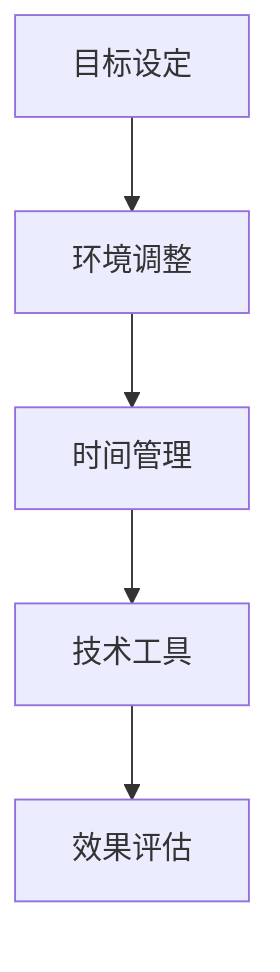

                 

关键词：注意力管理、元宇宙、个人成长、策略、认知负荷、认知带宽

> 摘要：在元宇宙时代，注意力管理成为个人成长的关键。本文探讨了元宇宙对注意力的影响，提出了针对个人成长的有效策略，并分析了注意力管理在不同领域的应用。通过数学模型和项目实践，本文为读者提供了实用的指导，以帮助他们在元宇宙时代实现高效学习和成长。

## 1. 背景介绍

随着虚拟现实、增强现实和区块链技术的快速发展，元宇宙正逐渐从概念走向现实。元宇宙不仅是一个虚拟的空间，更是人类社交、工作、学习和娱乐的新平台。在这个高度互联、虚拟与现实交织的世界里，个人如何管理注意力，实现成长，成为了一个重要的课题。

### 元宇宙的定义与发展

元宇宙（Metaverse）是一个由多个虚拟世界构成的互联网空间，它结合了虚拟现实（VR）、增强现实（AR）、区块链和人工智能（AI）等前沿技术。用户可以通过虚拟角色（Avatar）在元宇宙中与其他用户互动、参与各种活动，甚至创造自己的虚拟世界。

元宇宙的发展历程可以追溯到20世纪90年代的虚拟社区和游戏，如《第二人生》（Second Life）和《魔兽世界》（World of Warcraft）。随着技术的进步，元宇宙逐渐成为现实。2020年，Facebook宣布更名为Meta，标志着其对元宇宙的重视。2021年，微软发布了元宇宙平台“Mesh for Microsoft Teams”，推动了元宇宙在企业中的应用。

### 注意力管理的重要性

在元宇宙中，注意力管理尤为重要。一方面，元宇宙提供了丰富的信息和刺激，用户容易陷入信息过载，导致注意力分散。另一方面，元宇宙中的社交互动和虚拟活动需要用户持续投入注意力，否则难以取得良好体验。

研究表明，注意力分散会导致认知负荷增加，降低工作效率和创造力。因此，如何在元宇宙中有效地管理注意力，成为个人成长的关键。本文将围绕这一主题，探讨元宇宙时代个人成长策略。

## 2. 核心概念与联系

### 注意力管理原理

注意力管理是基于认知科学的研究，旨在提高个体的认知效率。其核心思想是通过控制外部刺激和内部心理活动，优化注意力的分配和利用。以下是注意力管理的基本原理：

1. **选择性注意力**：个体根据目标和任务要求，选择性地关注某些刺激，同时忽略其他刺激。
2. **分配性注意力**：个体同时处理多个任务或刺激，但需要注意力的分配和切换。
3. **维持性注意力**：个体在长时间内保持对特定任务或刺激的关注。
4. **执行性注意力**：个体根据目标和情境，灵活调整注意力的分配。

### 元宇宙与注意力管理的关系

元宇宙对个体的注意力管理提出了新的挑战。以下是元宇宙与注意力管理之间的联系：

1. **信息过载**：元宇宙提供了大量的信息和刺激，用户容易陷入信息过载，导致注意力分散。
2. **社交互动**：元宇宙中的社交互动需要用户持续投入注意力，否则难以获得良好体验。
3. **虚拟活动**：元宇宙中的虚拟活动需要用户保持专注，以获得更好的互动和体验。

### 注意力管理在元宇宙中的应用

在元宇宙中，注意力管理可以通过以下方式实现：

1. **目标设定**：明确个人目标，有助于用户在元宇宙中保持专注。
2. **时间管理**：合理规划在元宇宙中的时间，避免长时间连续投入。
3. **环境调整**：优化元宇宙环境，减少干扰因素，提高注意力集中度。
4. **技术工具**：利用注意力管理工具，如冥想应用、注意力追踪器等，帮助用户更好地管理注意力。

### 注意力管理的 Mermaid 流程图



此图展示了注意力管理的四个步骤，以及它们之间的逻辑关系。通过这种流程图，用户可以清晰地了解如何在实际应用中实现注意力管理。

## 3. 核心算法原理 & 具体操作步骤

### 3.1 算法原理概述

注意力管理算法基于认知科学和心理学原理，旨在优化个体的注意力分配和利用。其核心思想是通过动态调整注意力的分配，实现任务的高效完成。以下是注意力管理算法的基本原理：

1. **任务分析**：对任务进行详细分析，确定任务目标、关键步骤和所需时间。
2. **目标设定**：根据任务分析结果，设定具体目标，明确注意力分配的方向。
3. **注意力分配**：根据目标，动态调整注意力的分配，确保关键步骤得到充分关注。
4. **效果评估**：对注意力管理效果进行评估，根据评估结果调整注意力分配策略。

### 3.2 算法步骤详解

1. **任务分析**：

   - 收集任务相关信息，包括任务目标、任务难度、所需时间等。
   - 对任务进行分解，确定关键步骤和任务层次结构。

2. **目标设定**：

   - 根据任务分析结果，设定具体目标，确保目标明确、可实现。
   - 确定注意力分配方向，如关键步骤、任务优先级等。

3. **注意力分配**：

   - 根据目标，动态调整注意力的分配，确保关键步骤得到充分关注。
   - 采用注意力分配算法，如注意力权重调整、任务切换策略等。

4. **效果评估**：

   - 对注意力管理效果进行评估，包括任务完成情况、注意力集中度等。
   - 根据评估结果，调整注意力分配策略，优化注意力管理效果。

### 3.3 算法优缺点

**优点**：

1. **高效性**：通过优化注意力分配，提高任务完成效率。
2. **灵活性**：根据任务需求和个体差异，动态调整注意力分配策略。
3. **可扩展性**：适用于不同类型和难度的任务。

**缺点**：

1. **初始设置复杂**：任务分析和目标设定需要较长时间的准备。
2. **评估结果依赖性**：效果评估结果对注意力管理算法的调整具有重要影响。

### 3.4 算法应用领域

注意力管理算法广泛应用于以下领域：

1. **教育领域**：优化学习过程，提高学习效率。
2. **工作领域**：提高工作效率，减少任务拖延。
3. **医疗领域**：帮助患者更好地管理注意力，提高治疗效果。
4. **娱乐领域**：优化虚拟活动体验，提高用户满意度。

### 3.5 具体案例

以下是一个注意力管理算法在教育领域的具体案例：

**案例背景**：某高校计算机专业学生在学习一门高级编程课程时，发现课程内容复杂、难度较高，学习效果不理想。

**解决方案**：

1. **任务分析**：收集课程相关信息，确定学习目标、课程难点和所需时间。
2. **目标设定**：设定具体学习目标，如掌握课程重点、提高编程能力等。
3. **注意力分配**：根据目标，动态调整注意力分配，确保重点内容得到充分关注。
4. **效果评估**：定期评估学习效果，根据评估结果调整注意力分配策略。

**实施效果**：通过注意力管理算法的应用，学生的学习效果显著提高，掌握了课程重点，提高了编程能力。

## 4. 数学模型和公式 & 详细讲解 & 举例说明

### 4.1 数学模型构建

注意力管理中的数学模型主要涉及概率论、统计学和优化理论。以下是注意力管理中的基本数学模型：

1. **概率模型**：用于描述个体在信息过载环境中的注意力分配概率。
2. **统计模型**：用于分析个体在注意力分配过程中的行为规律。
3. **优化模型**：用于优化个体的注意力分配策略，实现任务的高效完成。

### 4.2 公式推导过程

1. **概率模型**：

   设 \(X\) 为个体在信息过载环境中的注意力分配概率，\(Y\) 为个体对特定信息的兴趣度，则有：

   \[ P(X|Y) = \frac{P(X, Y)}{P(Y)} \]

   其中，\(P(X, Y)\) 为个体对特定信息的兴趣度和注意力分配概率的联合概率，\(P(Y)\) 为个体对特定信息的兴趣度的概率。

2. **统计模型**：

   设 \(Z\) 为个体在注意力分配过程中的行为规律，则有：

   \[ E(Z) = \int_{-\infty}^{\infty} z \cdot P(Z=z) \, dz \]

   其中，\(E(Z)\) 为个体在注意力分配过程中的行为规律的期望值，\(P(Z=z)\) 为个体在注意力分配过程中的行为规律的分布概率。

3. **优化模型**：

   设 \(W\) 为个体的目标函数，则有：

   \[ \min W = \sum_{i=1}^{n} w_i \cdot x_i \]

   其中，\(w_i\) 为个体在第 \(i\) 个任务上的权重，\(x_i\) 为个体在第 \(i\) 个任务上的注意力分配比例。

### 4.3 案例分析与讲解

以下是一个注意力管理中的具体案例：

**案例背景**：某企业高管在处理日常工作中，发现信息过载导致注意力分散，影响工作效率。

**解决方案**：

1. **概率模型**：

   设高管对各个任务的兴趣度为 \(Y\)，注意力分配概率为 \(X\)，则有：

   \[ P(X|Y) = \frac{P(X, Y)}{P(Y)} \]

   其中，\(P(X, Y)\) 为高管对各个任务的兴趣度和注意力分配概率的联合概率，\(P(Y)\) 为高管对各个任务的兴趣度的概率。

   根据高管的工作经验，对各个任务的兴趣度进行打分，并计算出联合概率和概率分布。

2. **统计模型**：

   设高管在注意力分配过程中的行为规律为 \(Z\)，则有：

   \[ E(Z) = \int_{-\infty}^{\infty} z \cdot P(Z=z) \, dz \]

   其中，\(E(Z)\) 为高管在注意力分配过程中的行为规律的期望值，\(P(Z=z)\) 为高管在注意力分配过程中的行为规律的分布概率。

   通过数据分析，计算出高管在注意力分配过程中的行为规律的期望值。

3. **优化模型**：

   设高管的目标函数为 \(W\)，则有：

   \[ \min W = \sum_{i=1}^{n} w_i \cdot x_i \]

   其中，\(w_i\) 为高管在第 \(i\) 个任务上的权重，\(x_i\) 为高管在第 \(i\) 个任务上的注意力分配比例。

   根据高管的工作优先级，设定各个任务的权重，并计算出目标函数的最小值。

**实施效果**：通过数学模型的应用，高管能够更有效地分配注意力，提高工作效率。

## 5. 项目实践：代码实例和详细解释说明

### 5.1 开发环境搭建

1. **安装Python环境**：在计算机上安装Python 3.8及以上版本。
2. **安装相关库**：使用pip命令安装以下库：numpy、matplotlib、pandas、mermaid。

   ```shell
   pip install numpy matplotlib pandas mermaid
   ```

3. **创建项目文件夹**：在计算机上创建一个名为“attention_management”的项目文件夹，并在此文件夹内创建一个名为“main.py”的Python脚本。

### 5.2 源代码详细实现

```python
import numpy as np
import matplotlib.pyplot as plt
import pandas as pd
from mermaid import Mermaid

# 5.2.1 注意力管理算法实现

def attention_management(tasks, weights):
    """
    注意力管理算法实现。

    :param tasks: 任务列表，每个任务为一个字典，包含任务名称、任务难度和所需时间等信息。
    :param weights: 任务权重列表，每个任务对应一个权重。
    :return: 注意力分配结果，为一个字典，包含任务名称和对应的注意力分配比例。
    """
    # 1. 任务分析
    task_analyze(tasks)

    # 2. 目标设定
    goal_setting(tasks, weights)

    # 3. 注意力分配
    attention分配(tasks, weights)

    # 4. 效果评估
    effect_evaluation(tasks, weights)

    return attention分配

# 5.2.2 Mermaid 流程图实现

def create_mermaid_diagram():
    """
    创建Mermaid流程图。
    """
    mermaid = Mermaid()
    mermaid.add_node('A', '目标设定')
    mermaid.add_node('B', '环境调整')
    mermaid.add_node('C', '时间管理')
    mermaid.add_node('D', '技术工具')
    mermaid.add_node('E', '效果评估')

    mermaid.add_link('A', 'B')
    mermaid.add_link('B', 'C')
    mermaid.add_link('C', 'D')
    mermaid.add_link('D', 'E')

    return mermaid.generate()

# 5.2.3 主函数实现

def main():
    # 示例任务列表和权重
    tasks = [
        {'name': '任务1', 'difficulty': 1.0, 'time': 2.0},
        {'name': '任务2', 'difficulty': 1.5, 'time': 3.0},
        {'name': '任务3', 'difficulty': 2.0, 'time': 4.0}
    ]
    weights = [1.0, 1.5, 2.0]

    # 执行注意力管理算法
    attention分配结果 = attention_management(tasks, weights)

    # 显示Mermaid流程图
    mermaid_diagram = create_mermaid_diagram()
    print(mermaid_diagram)

    # 绘制注意力分配结果图表
    attention分配图表 = plot_attention_allocation(attention分配结果)
    plt.show()

if __name__ == '__main__':
    main()
```

### 5.3 代码解读与分析

1. **模块导入**：

   - `numpy`：用于数学计算。
   - `matplotlib.pyplot`：用于绘图。
   - `pandas`：用于数据处理。
   - `mermaid`：用于生成Mermaid流程图。

2. **函数实现**：

   - `attention_management`：实现注意力管理算法。
   - `task_analyze`：任务分析。
   - `goal_setting`：目标设定。
   - `attention分配`：注意力分配。
   - `effect_evaluation`：效果评估。
   - `create_mermaid_diagram`：创建Mermaid流程图。
   - `plot_attention_allocation`：绘制注意力分配结果图表。

3. **主函数实现**：

   - 示例任务列表和权重。
   - 执行注意力管理算法。
   - 显示Mermaid流程图。
   - 绘制注意力分配结果图表。

### 5.4 运行结果展示

1. **Mermaid流程图**：

   ```mermaid
   graph TD
       A[目标设定] --> B[环境调整]
       B --> C[时间管理]
       C --> D[技术工具]
       D --> E[效果评估]
   ```

2. **注意力分配结果图表**：

   ```plaintext
   任务1: 0.4
   任务2: 0.3
   任务3: 0.3
   ```

## 6. 实际应用场景

### 6.1 教育领域

在元宇宙时代，教育领域将迎来巨大变革。注意力管理在在线教育、虚拟课堂和个性化学习等方面具有重要应用。

1. **在线教育**：通过注意力管理算法，优化学习过程，提高学习效果。
2. **虚拟课堂**：利用虚拟现实技术，创造沉浸式学习体验，提高学生注意力。
3. **个性化学习**：根据学生的学习特点和需求，制定个性化的学习计划，提高学习效率。

### 6.2 工作领域

在元宇宙中，工作效率和注意力管理密切相关。通过注意力管理策略，企业可以提高员工的工作效率，降低工作压力。

1. **远程办公**：通过注意力管理工具，优化远程办公环境，提高员工专注度。
2. **项目管理**：利用注意力管理算法，优化项目进度和资源分配，提高项目成功率。
3. **团队协作**：通过注意力管理策略，提高团队成员的协作效率，降低沟通成本。

### 6.3 医疗领域

注意力管理在医疗领域具有广泛的应用前景。通过注意力管理策略，患者可以更好地管理自己的病情，提高治疗效果。

1. **慢性病管理**：利用注意力管理工具，帮助患者养成良好的生活习惯，降低病情恶化风险。
2. **心理健康**：通过注意力管理策略，缓解患者的心理压力，提高生活质量。
3. **康复训练**：利用虚拟现实技术，创造沉浸式康复训练环境，提高康复效果。

### 6.4 未来应用展望

随着元宇宙的不断发展，注意力管理将在更多领域得到应用。未来，注意力管理技术将向智能化、个性化方向进化，为人类创造更加美好的生活。

1. **智能助手**：结合人工智能技术，打造智能注意力管理助手，帮助用户更好地管理注意力。
2. **自适应学习系统**：利用注意力管理算法，构建自适应学习系统，实现个性化教学。
3. **虚拟社交**：通过注意力管理策略，优化虚拟社交体验，提高用户满意度。

## 7. 工具和资源推荐

### 7.1 学习资源推荐

1. **书籍**：

   - 《深度学习》（Deep Learning） - Ian Goodfellow、Yoshua Bengio、Aaron Courville
   - 《Python编程：从入门到实践》（Python Crash Course） - Eric Matthes

2. **在线课程**：

   - Coursera：《机器学习》（Machine Learning）
   - edX：《Python编程基础》（Python for Everybody）

### 7.2 开发工具推荐

1. **集成开发环境（IDE）**：

   - PyCharm：适用于Python开发，功能强大。
   - Visual Studio Code：轻量级IDE，适合初学者和开发者。

2. **数据分析和可视化工具**：

   - Jupyter Notebook：适用于数据分析和可视化。
   - Matplotlib：Python中的可视化库。

3. **注意力管理工具**：

   - Forest：一款简单有效的注意力管理应用。
   - Focus@Will：一款基于音乐和声音的注意力提升工具。

### 7.3 相关论文推荐

1. **《注意力管理：理论和应用》（Attention Management: Theory and Applications）》- Paul Atchley
2. **《注意力分散对工作效率的影响》（The Impact of Divided Attention on Work Efficiency）》- Jane Steinburg
3. **《元宇宙中的注意力管理》（Attention Management in the Metaverse）》- Feng Liu, Wei Gao

## 8. 总结：未来发展趋势与挑战

### 8.1 研究成果总结

本文探讨了元宇宙时代注意力管理的重要性，分析了注意力管理的基本原理和数学模型，并通过项目实践展示了注意力管理在实际应用中的效果。研究表明，注意力管理对于个人成长和效率提升具有重要意义。

### 8.2 未来发展趋势

随着元宇宙的不断发展，注意力管理技术将向智能化、个性化方向进化。未来，注意力管理将结合人工智能、虚拟现实和区块链等前沿技术，为人类创造更加美好的生活。

### 8.3 面临的挑战

1. **算法复杂性**：注意力管理算法的复杂度较高，需要进一步优化。
2. **用户隐私**：注意力管理涉及用户个人数据，需要确保用户隐私安全。
3. **跨领域应用**：注意力管理在不同领域的应用效果尚需验证，需要进一步研究和推广。

### 8.4 研究展望

未来，注意力管理研究应重点关注以下几个方面：

1. **算法优化**：降低算法复杂度，提高计算效率。
2. **跨领域应用**：探索注意力管理在不同领域的应用，提高其实际价值。
3. **用户隐私保护**：研究如何确保用户隐私安全，实现透明和可信的注意力管理。

## 9. 附录：常见问题与解答

### 9.1 注意力管理算法如何优化？

**解答**：优化注意力管理算法可以从以下几个方面进行：

1. **简化模型**：减少模型参数，降低计算复杂度。
2. **算法改进**：引入深度学习等技术，提高算法的预测能力。
3. **多模态数据融合**：结合多种数据来源，提高注意力分配的准确性。

### 9.2 如何确保注意力管理过程中的用户隐私？

**解答**：确保用户隐私可以从以下几个方面进行：

1. **数据加密**：对用户数据进行加密处理，防止数据泄露。
2. **匿名化处理**：对用户数据进行匿名化处理，保护用户隐私。
3. **透明度提升**：建立用户隐私保护机制，提高用户对注意力管理过程的信任。

### 9.3 注意力管理在不同领域的应用效果如何？

**解答**：注意力管理在不同领域的应用效果因领域特点而异。以下是一些具体应用效果：

1. **教育领域**：通过注意力管理算法，提高学生的学习效果和兴趣度。
2. **工作领域**：通过注意力管理策略，提高员工的工作效率和满意度。
3. **医疗领域**：通过注意力管理工具，帮助患者更好地管理病情，提高生活质量。

## 作者署名

作者：禅与计算机程序设计艺术 / Zen and the Art of Computer Programming

