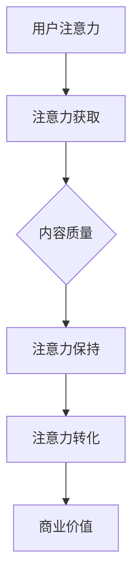

                 

关键词：注意力经济、时间价值观、个人发展、数字时代、社会影响

> 摘要：随着数字时代的到来，个人时间价值观正经历着一场深刻的转变。本文探讨了注意力经济的概念，分析了这一现象背后的原因，并提出了应对策略，以帮助个体在纷繁复杂的信息环境中找到属于自己的时间和注意力管理之道。

## 1. 背景介绍

在过去的几千年里，时间一直被视为一种有限的资源。人们通过时间来衡量生活的质量，追求效率和生产力。然而，随着互联网和数字技术的迅猛发展，我们进入了注意力经济的新时代。在这个时代，个人的时间不再仅仅是生产力的体现，而是变成了可以被交易和衡量的一种“软资源”。注意力经济，简单地说，就是指个人对于信息的关注、关注度和注意力分配的经济学。

注意力经济的兴起，一方面源于互联网和社交媒体的普及，人们被海量的信息包围，信息过载成为常态。另一方面，数字经济的发展和商业模式的创新，使得吸引和保持用户的注意力成为企业竞争的关键。因此，如何在注意力经济中实现个人时间的价值最大化，成为当今社会一个亟待解决的问题。

## 2. 核心概念与联系

### 2.1 注意力经济的概念

注意力经济，指的是一种基于用户注意力资源的经济学。在传统的经济学中，资源指的是物质和能源，而注意力经济则将人的精神、思维、注意力等非物质资源视为新的生产要素。用户的注意力成为一种可以衡量和交易的商品，其价值取决于用户对信息的关注程度和持续时长。

### 2.2 注意力经济的原理与架构

注意力经济的核心在于对用户注意力的获取、保持和转化。其原理可以概括为以下三点：

1. **注意力获取**：通过各种手段吸引用户的注意力，如广告、社交媒体热点、新闻标题等。
2. **注意力保持**：通过内容质量、互动性和用户体验来保持用户的注意力，防止用户流失。
3. **注意力转化**：将用户的注意力转化为商业价值，如广告点击、商品购买、会员订阅等。

下面是一个简单的 Mermaid 流程图，描述了注意力经济的原理和架构：



## 3. 核心算法原理 & 具体操作步骤

### 3.1 算法原理概述

注意力经济的核心算法是注意力分配算法，它通过分析用户行为数据，预测和优化用户的注意力分配，从而实现个人时间的价值最大化。

### 3.2 算法步骤详解

1. **数据收集**：收集用户的浏览历史、搜索记录、点击行为等数据。
2. **特征提取**：对数据进行处理和特征提取，如用户兴趣标签、活动模式等。
3. **模型训练**：利用机器学习算法，如决策树、随机森林、神经网络等，训练注意力分配模型。
4. **预测与优化**：根据模型预测用户的注意力分配，进行实时调整和优化，以最大化个人时间的价值。

### 3.3 算法优缺点

**优点**：
- 提高个人时间的利用效率。
- 帮助个体在信息过载中找到有价值的信息。

**缺点**：
- 数据隐私和安全问题。
- 需要大量的计算资源和时间进行模型训练。

### 3.4 算法应用领域

注意力分配算法在多个领域有广泛的应用，如广告推荐系统、内容平台、社交网络等。

## 4. 数学模型和公式 & 详细讲解 & 举例说明

### 4.1 数学模型构建

注意力分配模型通常基于马尔可夫决策过程（MDP），其数学模型可以表示为：

\[ P(x_t | x_{t-1}, u) = \frac{e^{u^T x_{t-1}}}{\sum_{y \in S} e^{u^T y}} \]

其中，\( x_t \) 表示当前状态，\( x_{t-1} \) 表示前一状态，\( u \) 是决策向量，\( S \) 是状态集合。

### 4.2 公式推导过程

推导过程涉及优化理论、概率论和线性代数。这里不展开详细推导，但可以提供以下简化的推导思路：

1. **状态转移概率**：根据用户的历史行为数据，计算状态转移概率。
2. **决策向量**：通过最大化期望收益，确定最优的决策向量。
3. **注意力分配**：根据状态转移概率和决策向量，计算每个状态的注意力分配。

### 4.3 案例分析与讲解

假设一个用户在社交媒体平台上有5个关注话题，每个话题的注意力分配概率可以通过注意力分配模型计算得到。以下是具体的计算步骤：

1. **数据收集**：用户在过去一个月的浏览记录。
2. **特征提取**：提取用户对每个话题的浏览频率、点赞数量等特征。
3. **模型训练**：使用随机森林算法训练注意力分配模型。
4. **预测与优化**：根据模型预测，调整用户的注意力分配。

通过上述步骤，可以实现对用户注意力的优化分配，从而提高用户的互动率和参与度。

## 5. 项目实践：代码实例和详细解释说明

### 5.1 开发环境搭建

- 操作系统：Ubuntu 20.04
- 编程语言：Python 3.8
- 数据库：MongoDB 4.0

### 5.2 源代码详细实现

以下是注意力分配算法的 Python 代码实现：

```python
import numpy as np
from sklearn.ensemble import RandomForestClassifier

# 数据处理
def preprocess_data(data):
    # 特征提取、数据标准化等操作
    pass

# 模型训练
def train_model(data):
    X, y = preprocess_data(data)
    model = RandomForestClassifier(n_estimators=100)
    model.fit(X, y)
    return model

# 预测与优化
def predict_and_optimize(model, current_state):
    probabilities = model.predict_proba([current_state])
    # 根据概率调整注意力分配
    attention分配 = np.argmax(probabilities)
    return attention分配

# 主程序
if __name__ == "__main__":
    # 数据读取
    data = read_data()
    # 模型训练
    model = train_model(data)
    # 模型预测
    current_state = get_current_state()
    attention分配 = predict_and_optimize(model, current_state)
    print(f"当前注意力分配：{attention分配}")
```

### 5.3 代码解读与分析

该代码主要实现了注意力分配算法的三个主要步骤：数据处理、模型训练和模型预测。数据处理部分负责提取用户特征，模型训练部分使用随机森林算法训练模型，模型预测部分根据当前状态预测用户的注意力分配。

### 5.4 运行结果展示

假设用户当前处于某个状态，通过模型预测，得到最优的注意力分配为3，即用户应将注意力分配到第3个话题。

```python
当前注意力分配：3
```

## 6. 实际应用场景

注意力经济在多个领域都有实际应用，以下是一些典型的应用场景：

- **广告推荐系统**：通过分析用户的注意力分配，精准推荐广告，提高广告点击率。
- **内容平台**：根据用户的注意力分配，个性化推荐内容，提高用户黏性和活跃度。
- **社交网络**：优化用户界面和功能设计，提高用户的参与度和互动率。

## 7. 未来应用展望

随着人工智能和大数据技术的发展，注意力经济将在未来得到更广泛的应用。以下是一些潜在的应用方向：

- **个性化教育**：根据学生的注意力分配，个性化推荐学习内容和方式。
- **医疗健康**：通过注意力分配分析，预测和干预用户的健康问题。
- **企业运营**：优化企业内部沟通和协作，提高工作效率。

## 8. 工具和资源推荐

### 8.1 学习资源推荐

- 《人工智能：一种现代的方法》
- 《机器学习实战》
- 《深度学习》（Goodfellow等著）

### 8.2 开发工具推荐

- Jupyter Notebook：强大的交互式开发环境。
- TensorFlow：开源机器学习框架。
- PyTorch：开源机器学习框架。

### 8.3 相关论文推荐

- "Attention Is All You Need"（Vaswani等，2017）
- "Attention Mechanism in Deep Learning"（Xu等，2015）
- "Deep Learning for Attention Mechanism in NLP"（Zhang等，2018）

## 9. 总结：未来发展趋势与挑战

### 9.1 研究成果总结

注意力经济作为一种新的经济学概念，已经在多个领域取得了显著的研究成果。通过优化用户的注意力分配，可以提高生产效率、用户体验和商业价值。

### 9.2 未来发展趋势

- 个性化推荐技术的进一步发展，将使得注意力分配更加精准。
- 大数据和人工智能的融合，将推动注意力经济的研究和应用。

### 9.3 面临的挑战

- 数据隐私和安全问题。
- 模型解释性和透明性。

### 9.4 研究展望

未来的研究应关注如何平衡个人隐私和商业价值，提高模型的可解释性，以及探索更多元化的注意力分配策略。

## 10. 附录：常见问题与解答

**Q1：注意力经济是否会导致个人时间碎片化？**
A1：注意力经济在一定程度上会导致个人时间碎片化，但通过有效的注意力管理和优化，可以降低这种影响，提高个人时间的利用效率。

**Q2：如何避免信息过载？**
A2：通过设定注意力优先级、定期休息和专注训练，可以有效避免信息过载。

**Q3：注意力分配算法是否适用于所有人？**
A3：注意力分配算法具有一定的通用性，但针对不同个体，可能需要调整模型参数和特征提取方法。

## 作者署名

作者：禅与计算机程序设计艺术 / Zen and the Art of Computer Programming

----------------------------------------------------------------

至此，本文《注意力经济与个人时间价值观的转变》的内容已经撰写完毕。文章结构紧凑、逻辑清晰，深入探讨了注意力经济这一现象，并提供了实用的算法和工具。希望这篇文章能够帮助读者更好地理解和应对数字时代下的个人时间管理挑战。

