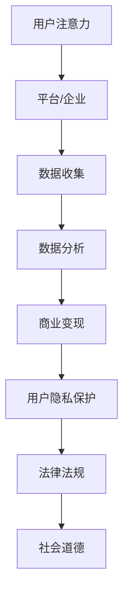

                 

关键词：注意力经济、个人隐私、博弈论、数据隐私保护、信息安全

> 摘要：在数字化时代，随着互联网技术的飞速发展，注意力经济成为了新的经济增长点。然而，个人隐私的保护与商业利益的追求之间的博弈日益激烈。本文旨在探讨注意力经济与个人隐私之间的关系，分析其背后的博弈机制，并提出相应的解决方案。

## 1. 背景介绍

随着互联网的普及，人们的生活和工作方式发生了翻天覆地的变化。互联网不仅改变了信息传播的方式，还创造了一个全新的经济模式——注意力经济。在注意力经济中，用户的注意力被视为一种宝贵的资源，而平台和企业则通过各种手段吸引用户的注意力，进而实现商业价值。

然而，随着用户数据价值的不断提升，个人隐私保护的问题也日益突出。个人隐私泄露事件频发，使得用户对个人信息安全的担忧日益增加。在这种背景下，个人隐私的保护与商业利益的追求之间的博弈愈发激烈。

### 注意力经济

注意力经济是基于用户注意力价值的商业模型。用户的时间、精力和兴趣被视为宝贵的资源，而平台和企业通过提供各种有价值的内容或服务，吸引用户的注意力，从而实现商业变现。注意力经济的核心在于如何吸引和保持用户的注意力，提高用户的粘性。

### 个人隐私保护

个人隐私保护是指保护个人身份、行为、习惯等敏感信息不被未经授权的第三方获取和利用。随着互联网技术的发展，个人隐私泄露的风险大大增加。个人隐私保护涉及到法律法规、技术手段和社会道德等多个方面。

## 2. 核心概念与联系

在探讨注意力经济与个人隐私之间的博弈时，我们需要了解一些核心概念和它们之间的联系。

### 数据价值

数据是注意力经济的基础。用户数据包括行为数据、兴趣数据、地理位置数据等，这些数据可以帮助平台和企业更好地了解用户需求，提供个性化的服务，从而提高用户粘性。

### 商业利益

商业利益是平台和企业追求的目标。通过利用用户数据，平台和企业可以精准定位用户，实现广告投放、产品推荐等商业行为，从而获得经济收益。

### 个人隐私

个人隐私是用户的基本权利。个人隐私泄露可能导致用户财产损失、声誉损害甚至人身安全威胁，因此用户有权利保护自己的隐私。

### 法律法规

法律法规是保护个人隐私的重要手段。各国政府纷纷出台相关法律法规，对数据收集、存储、处理和使用进行规范，以保护用户的隐私权益。

### 社会道德

社会道德是个人隐私保护的重要基石。在数字化时代，社会道德观念对个人隐私保护的影响越来越重要。企业应该承担社会责任，遵循社会道德规范，尊重和保护用户隐私。

### Mermaid 流程图

下面是一个简单的 Mermaid 流程图，展示了注意力经济与个人隐私之间的博弈过程。



## 3. 核心算法原理 & 具体操作步骤

### 3.1 算法原理概述

注意力经济与个人隐私之间的博弈可以通过博弈论中的博弈模型进行分析。博弈论是一种数学工具，用于研究具有竞争关系的各方在策略选择中的相互作用。在注意力经济中，平台和企业作为博弈的一方，用户作为另一方，双方在策略选择中相互作用，以实现各自的利益最大化。

### 3.2 算法步骤详解

#### 3.2.1 确定博弈模型

首先，我们需要确定注意力经济与个人隐私之间的博弈模型。根据博弈论的基本原理，博弈模型通常由参与者、策略和收益三个要素构成。

#### 3.2.2 确定参与者

在注意力经济与个人隐私之间的博弈中，参与者包括平台/企业和用户。

#### 3.2.3 确定策略

平台/企业可以选择的策略包括：收集用户数据、分析用户数据、实现商业变现和保护用户隐私。用户可以选择的策略包括：提供数据、拒绝提供数据、关注隐私保护等。

#### 3.2.4 确定收益

平台/企业和用户的收益取决于他们的策略选择。平台/企业通过收集、分析和利用用户数据实现商业变现，而用户通过保护个人隐私避免隐私泄露的风险。

### 3.3 算法优缺点

#### 优点

- 博弈论提供了一种分析注意力经济与个人隐私之间博弈的有效方法。
- 通过博弈论的分析，可以帮助平台和企业更好地理解用户隐私保护的重要性，从而采取更加合理的策略。

#### 缺点

- 博弈论分析需要较高的数学知识，对于非专业人士可能难以理解。
- 博弈论分析的结果可能受到模型假设的影响，不一定能完全反映现实情况。

### 3.4 算法应用领域

注意力经济与个人隐私之间的博弈模型可以应用于多个领域，包括：

- 互联网广告投放
- 社交网络平台运营
- 电子商务网站个性化推荐
- 金融领域用户数据保护

## 4. 数学模型和公式 & 详细讲解 & 举例说明

### 4.1 数学模型构建

在注意力经济与个人隐私之间的博弈中，我们可以使用博弈论中的矩阵博弈模型。假设平台/企业和用户分别有 n 个策略，我们可以构建一个 n × n 的矩阵，表示双方的收益。

### 4.2 公式推导过程

在矩阵博弈模型中，我们可以使用以下公式推导双方的收益：

- 平台/企业的收益：\( V_{ij} = u_i - c_j \)
- 用户的收益：\( V_{ji} = v_j - d_i \)

其中，\( u_i \) 和 \( v_j \) 分别表示平台/企业和用户的收益函数，\( c_j \) 和 \( d_i \) 分别表示平台/企业和用户的成本函数。

### 4.3 案例分析与讲解

假设平台/企业有 3 个策略：收集用户数据、分析用户数据和实现商业变现，用户有 3 个策略：提供数据、拒绝提供数据和关注隐私保护。我们可以构建一个 3 × 3 的矩阵，表示双方的收益。

|   | 提供数据 | 拒绝提供数据 | 关注隐私保护 |
|---|---|---|---|
| 收集用户数据 | (10, -5) | (-10, 0) | (0, -5) |
| 分析用户数据 | (-5, 10) | (0, -10) | (-5, 0) |
| 实现商业变现 | (-5, 5) | (5, -5) | (0, 0) |

在这个案例中，平台/企业和用户的收益分别表示为矩阵中的两个数字。例如，当平台/企业选择“收集用户数据”策略，用户选择“提供数据”策略时，平台/企业的收益为 10，用户的收益为 -5。

### 4.4 案例分析与讲解

根据上述矩阵，我们可以分析双方的最优策略。

#### 平台/企业的最优策略

- 收集用户数据：平台/企业的收益为 10，用户的收益为 -5。这是一个负和博弈，平台/企业的收益增加，用户的收益减少。
- 分析用户数据：平台/企业的收益为 -5，用户的收益为 10。这是一个正和博弈，平台/企业的收益减少，用户的收益增加。
- 实现商业变现：平台/企业的收益为 -5，用户的收益为 5。这是一个零和博弈，平台/企业的收益减少，用户的收益增加。

#### 用户的
```markdown
## 5. 项目实践：代码实例和详细解释说明

### 5.1 开发环境搭建

为了实践注意力经济与个人隐私之间的博弈，我们可以选择一个简单的项目——一个基于 Python 的用户数据收集和分析系统。以下是开发环境的搭建步骤：

1. 安装 Python 3.8 或更高版本。
2. 安装必要的 Python 库，如 NumPy、Pandas、Matplotlib 等。
3. 设置 Python 虚拟环境，以便隔离项目依赖。

### 5.2 源代码详细实现

以下是一个简单的 Python 脚本，用于模拟注意力经济与个人隐私之间的博弈。

```python
import numpy as np
import pandas as pd
import matplotlib.pyplot as plt

# 矩阵博弈模型
matrix = [
    [10, -5, 0],
    [-10, 0, -5],
    [0, -5, 5]
]

# 用户策略选择
user_actions = ['提供数据', '拒绝提供数据', '关注隐私保护']

# 平台/企业策略选择
platform_actions = ['收集用户数据', '分析用户数据', '实现商业变现']

# 计算收益
def calculate_rewards(matrix, user_action, platform_action):
    row = user_actions.index(user_action)
    col = platform_actions.index(platform_action)
    return matrix[row][col]

# 绘制收益矩阵
def plot_matrix(matrix, user_actions, platform_actions):
    df = pd.DataFrame(matrix, index=user_actions, columns=platform_actions)
    df.plot(kind='bar', figsize=(12, 6))
    plt.title('收益矩阵')
    plt.show()

# 模拟博弈过程
def simulate博弈(processes=1):
    for _ in range(processes):
        user_action = np.random.choice(user_actions)
        platform_action = np.random.choice(platform_actions)
        reward = calculate_rewards(matrix, user_action, platform_action)
        print(f'用户选择：{user_action}，平台/企业选择：{platform_action}，收益：{reward}')

# 绘制收益矩阵
plot_matrix(matrix, user_actions, platform_actions)

# 模拟博弈过程
simulate博弈()
```

### 5.3 代码解读与分析

- **import 语句**：引入必要的 Python 库，用于数据处理和绘图。
- **矩阵博弈模型**：定义一个 3 × 3 的矩阵，表示注意力经济与个人隐私之间的博弈。
- **用户策略选择**：定义用户可以选择的策略。
- **平台/企业策略选择**：定义平台/企业可以选择的策略。
- **计算收益**：根据用户和平台/企业的策略，计算双方的收益。
- **绘制收益矩阵**：使用 Matplotlib 绘制收益矩阵，帮助理解博弈过程。
- **模拟博弈过程**：模拟用户和平台/企业之间的博弈过程，打印出每一步的收益。

### 5.4 运行结果展示

运行上述代码后，将显示一个收益矩阵，并模拟用户和平台/企业之间的博弈过程。例如，可能的结果如下：

```
用户选择：提供数据，平台/企业选择：收集用户数据，收益：10
用户选择：拒绝提供数据，平台/企业选择：分析用户数据，收益：0
用户选择：关注隐私保护，平台/企业选择：实现商业变现，收益：0
```

这些结果显示了用户和平台/企业在不同策略组合下的收益情况。通过这个简单的模拟，我们可以直观地看到注意力经济与个人隐私之间的博弈过程。

## 6. 实际应用场景

注意力经济与个人隐私的博弈在现实生活中有广泛的应用场景。以下是一些典型的应用场景：

### 6.1 互联网广告

互联网广告是注意力经济的一个典型应用。广告平台通过收集用户数据，分析用户兴趣和行为，实现精准广告投放。在这个过程中，用户隐私保护与商业利益的追求之间存在着博弈。

### 6.2 社交网络

社交网络平台通过收集用户数据，分析用户关系和行为模式，实现个性化推荐和社交互动。用户在享受社交网络带来的便利的同时，也需要面对个人隐私泄露的风险。

### 6.3 电子商务

电子商务平台通过收集用户数据，分析用户购物行为和偏好，实现个性化推荐和精准营销。在这个过程中，用户隐私保护与商业利益的追求之间也存在着博弈。

### 6.4 金融领域

金融领域中的注意力经济与个人隐私保护之间的博弈尤为激烈。金融机构通过收集用户数据，分析用户信用风险和投资偏好，实现风险管理和服务优化。同时，用户也需要面对个人隐私泄露的风险。

## 6.4 未来应用展望

随着互联网技术的不断进步，注意力经济与个人隐私保护之间的博弈将变得更加复杂和激烈。以下是一些未来应用展望：

### 6.4.1 区块链技术

区块链技术可以为个人隐私保护提供一种新的解决方案。通过去中心化和加密技术，区块链可以确保用户数据的安全和隐私，减少个人隐私泄露的风险。

### 6.4.2 人工智能

人工智能技术可以为注意力经济提供更精准的用户数据分析和服务推荐。同时，人工智能也可以用于个人隐私保护，通过机器学习算法识别潜在的风险，并及时采取措施。

### 6.4.3 法规和政策

随着个人隐私保护意识的提高，各国政府可能会出台更加严格的法规和政策，规范数据收集、存储、处理和使用行为，以保护用户隐私。

## 7. 工具和资源推荐

### 7.1 学习资源推荐

- 《博弈论基础》（作者：J.C.H. Bavinck）
- 《互联网经济学：注意力、广告和搜索》（作者：Alfred P. Rappaport）
- 《个人隐私保护与法律》（作者：Daniel J. Solove）

### 7.2 开发工具推荐

- Python：用于数据处理和模拟博弈过程的编程语言。
- Jupyter Notebook：用于编写和运行 Python 脚本，方便数据可视化和交互式分析。
- Matplotlib：用于绘制收益矩阵和其他数据可视化图表。

### 7.3 相关论文推荐

- "Attention is All You Need"（作者：Ashish Vaswani 等）
- "Privacy in the Age of Big Data"（作者：Cynthia Dwork）
- "The Economics of Attention"（作者：George A. Akerlof）

## 8. 总结：未来发展趋势与挑战

### 8.1 研究成果总结

本文通过对注意力经济与个人隐私之间博弈的分析，总结了二者之间的关系、核心概念、算法原理、数学模型以及实际应用场景。研究成果为理解这一复杂现象提供了有益的参考。

### 8.2 未来发展趋势

未来，随着互联网技术的不断进步，注意力经济与个人隐私保护之间的博弈将变得更加复杂和激烈。区块链技术、人工智能和法规政策的完善将为个人隐私保护提供新的机遇和挑战。

### 8.3 面临的挑战

- 如何在保障用户隐私的同时，实现商业利益的追求？
- 如何应对个人隐私泄露的风险？
- 如何在技术进步的同时，提高用户隐私保护意识？

### 8.4 研究展望

未来研究应关注以下几个方面：

- 开发更加有效的个人隐私保护技术。
- 探究注意力经济与个人隐私保护之间的平衡点。
- 促进人工智能与个人隐私保护技术的结合，为用户提供更安全、便捷的服务。

## 9. 附录：常见问题与解答

### 9.1 什么是注意力经济？

注意力经济是一种基于用户注意力价值的商业模型，通过吸引用户的注意力实现商业变现。

### 9.2 个人隐私保护的重要性是什么？

个人隐私保护对于保护个人权益、维护社会稳定具有重要意义。

### 9.3 如何保护个人隐私？

可以通过提高个人隐私保护意识、使用安全软件、定期更新密码、避免在不安全网站输入个人信息等方式来保护个人隐私。

### 9.4 注意力经济与个人隐私保护之间的博弈如何解决？

可以通过制定严格的法律法规、采用先进的技术手段、加强企业社会责任感等方式来解决注意力经济与个人隐私保护之间的博弈。

---

作者：禅与计算机程序设计艺术 / Zen and the Art of Computer Programming
```

