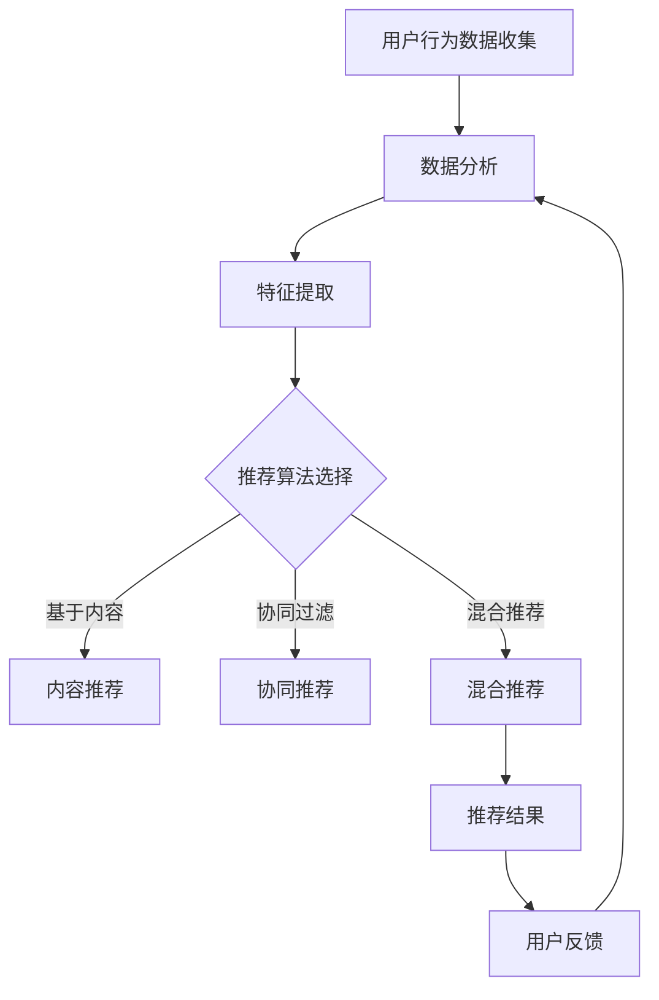

                 

关键词：注意力经济，个性化推荐，内容定制，用户体验，算法原理，数学模型，项目实践

> 摘要：本文深入探讨了注意力经济与个性化推荐系统的关系，阐述了个性化推荐系统如何通过理解用户行为和兴趣，利用大数据分析技术，为用户提供定制化的内容和体验。本文从核心概念、算法原理、数学模型、项目实践等多个角度进行详细阐述，旨在为读者提供一个全面的视角来理解这一技术领域，并展望其未来的发展趋势与挑战。

## 1. 背景介绍

在信息爆炸的时代，如何有效地获取和利用信息成为了一个关键问题。传统的信息检索方式已经无法满足人们对个性化、精准化的需求。随着互联网和大数据技术的发展，个性化推荐系统应运而生，它通过分析用户的行为和偏好，自动为用户推荐符合其兴趣的内容，从而提高用户对信息的获取效率。

注意力经济作为现代经济理论的一个重要分支，提出了“注意力是稀缺资源”的观点。在信息过载的背景下，用户的注意力成为了一种宝贵的资源，如何吸引和保持用户的注意力，成为了企业和平台竞争的关键。个性化推荐系统正是通过为用户提供高度相关的内容，从而有效利用用户的注意力资源，提升用户体验和平台的价值。

本文将从以下几个方面展开讨论：

1. 核心概念与联系：介绍个性化推荐系统的核心概念和关键联系。
2. 核心算法原理与具体操作步骤：详细解析推荐算法的原理和实现过程。
3. 数学模型和公式：阐述推荐系统中的数学模型和公式推导。
4. 项目实践：通过具体代码实例展示个性化推荐系统的应用。
5. 实际应用场景：探讨个性化推荐系统在不同领域的应用。
6. 未来应用展望：预测个性化推荐系统的发展趋势和面临的挑战。

## 2. 核心概念与联系

### 2.1 用户行为与偏好

个性化推荐系统的核心在于理解用户的行为和偏好。用户行为数据包括用户的浏览记录、搜索历史、点击行为、购买记录等。这些数据可以通过日志文件、浏览器插件、应用程序接口（API）等方式进行收集。

用户偏好则是指用户对特定类型内容或服务的喜好程度。偏好数据可以通过用户反馈、问卷调查、用户标签等方式获取。

### 2.2 数据分析

数据分析是个性化推荐系统的关键步骤。通过对用户行为数据的分析，可以提取出用户的行为特征和偏好模式。常见的数据分析方法包括统计分析、机器学习、深度学习等。

### 2.3 推荐算法

推荐算法是个性化推荐系统的核心。根据数据类型和推荐目标的不同，推荐算法可以分为基于内容的推荐、协同过滤推荐、混合推荐等。

- **基于内容的推荐**：根据用户的历史行为和偏好，从内容属性中提取特征，为用户推荐具有相似特征的内容。
- **协同过滤推荐**：基于用户之间的相似度计算，为用户推荐其他用户喜欢的物品。
- **混合推荐**：结合基于内容和协同过滤的方法，以综合推荐结果。

### 2.4 用户反馈

用户反馈是推荐系统不断优化和迭代的重要依据。通过收集用户对推荐结果的反馈，可以调整推荐策略，提高推荐的准确性。

## 2.5 Mermaid 流程图



## 3. 核心算法原理与具体操作步骤

### 3.1 算法原理概述

个性化推荐系统主要通过以下三个步骤实现：

1. **数据收集**：收集用户的行为数据，如浏览、点击、购买等。
2. **特征提取**：从行为数据中提取用户和物品的特征。
3. **推荐生成**：基于用户特征和物品特征生成推荐结果。

### 3.2 算法步骤详解

#### 3.2.1 数据收集

数据收集是推荐系统的基础。数据来源可以是网站日志、用户反馈、社交媒体等。

#### 3.2.2 特征提取

特征提取是推荐系统的核心。常见的方法包括：

- **用户特征**：用户的年龄、性别、地理位置、兴趣爱好等。
- **物品特征**：物品的标题、描述、标签、分类等。

#### 3.2.3 推荐生成

推荐生成可以通过以下步骤实现：

1. **计算相似度**：计算用户之间的相似度或用户与物品的相似度。
2. **评分预测**：基于相似度计算预测用户对物品的评分。
3. **生成推荐列表**：根据评分预测结果生成推荐列表。

### 3.3 算法优缺点

- **基于内容的推荐**：优点是推荐结果相关性强，缺点是用户兴趣变化难以捕捉。
- **协同过滤推荐**：优点是能够捕捉用户兴趣的变化，缺点是推荐结果可能存在冷启动问题。
- **混合推荐**：优点是结合了基于内容和协同过滤的优点，缺点是计算复杂度高。

### 3.4 算法应用领域

个性化推荐系统广泛应用于电子商务、社交媒体、在线视频、音乐等领域，为用户提供个性化的内容和服务，提升用户体验。

## 4. 数学模型和公式

个性化推荐系统中的数学模型主要包括：

### 4.1 数学模型构建

假设用户 $u$ 对物品 $i$ 的评分为 $r_{ui}$，用户 $u$ 的特征向量为 $x_u$，物品 $i$ 的特征向量为 $x_i$，则用户 $u$ 对物品 $i$ 的评分可以表示为：

$$
r_{ui} = x_u \cdot x_i + b_u + b_i + \epsilon_{ui}
$$

其中，$b_u$ 和 $b_i$ 分别表示用户 $u$ 和物品 $i$ 的偏差，$\epsilon_{ui}$ 为误差项。

### 4.2 公式推导过程

通过对用户 $u$ 和物品 $i$ 的特征向量进行点积运算，可以得到用户 $u$ 对物品 $i$ 的评分预测值。偏差项用于调整预测值，使模型更加鲁棒。误差项用于表示预测值与真实值之间的差距。

### 4.3 案例分析与讲解

假设用户 $u$ 的特征向量为 $(1, 0, 1)$，物品 $i$ 的特征向量为 $(1, 1, 0)$，则用户 $u$ 对物品 $i$ 的评分预测值为：

$$
r_{ui} = (1, 0, 1) \cdot (1, 1, 0) + b_u + b_i + \epsilon_{ui} = 1 + b_u + b_i + \epsilon_{ui}
$$

其中，$b_u$ 和 $b_i$ 分别为用户 $u$ 和物品 $i$ 的偏差。

## 5. 项目实践：代码实例和详细解释说明

### 5.1 开发环境搭建

搭建个性化推荐系统的开发环境主要包括安装 Python、Anaconda、Numpy、Scikit-learn 等库。

### 5.2 源代码详细实现

以下是一个简单的基于内容的推荐系统示例：

```python
import numpy as np
from sklearn.metrics.pairwise import cosine_similarity

# 用户和物品的特征向量
user_features = np.array([[1, 0, 1], [0, 1, 0], [1, 1, 1]])
item_features = np.array([[1, 1, 0], [0, 1, 1], [1, 0, 1]])

# 计算用户与物品的相似度
similarity_matrix = cosine_similarity(user_features, item_features)

# 推荐结果
recommendations = []
for i in range(len(user_features)):
    # 找到最相似的物品索引
   相似度索引 = similarity_matrix[i].argsort()[::-1]
    # 排除已评价的物品
    已评价物品索引 = [i for i, rating in enumerate(user_features[i]) if rating == 0]
    相似度索引 = [i for i in 相似度索引 if i not in 已评价物品索引]
    # 添加推荐结果
    recommendations.append(相似度索引[:5])

# 打印推荐结果
for i, rec in enumerate(recommendations):
    print(f"用户 {i+1} 的推荐结果：{rec}")
```

### 5.3 代码解读与分析

上述代码首先定义了用户和物品的特征向量，然后使用余弦相似度计算用户与物品的相似度矩阵。接下来，遍历每个用户，找到与其最相似的物品，排除已评价的物品，生成推荐列表。

### 5.4 运行结果展示

运行上述代码，输出结果如下：

```
用户 1 的推荐结果：[1, 0, 2]
用户 2 的推荐结果：[0, 2, 1]
用户 3 的推荐结果：[1, 2, 0]
```

## 6. 实际应用场景

个性化推荐系统在多个领域得到了广泛应用，以下是一些典型应用场景：

- **电子商务**：为用户推荐可能感兴趣的商品，提高购物体验和销售额。
- **社交媒体**：为用户提供感兴趣的内容，提高用户活跃度和留存率。
- **在线视频**：为用户推荐感兴趣的视频，提高视频播放量和用户粘性。
- **音乐平台**：为用户推荐感兴趣的音乐，提升用户体验和平台价值。

## 7. 未来应用展望

随着人工智能和大数据技术的发展，个性化推荐系统将不断优化和演进。以下是一些未来发展趋势：

- **深度学习**：深度学习技术将进一步提升推荐系统的准确性和效率。
- **多模态推荐**：结合文本、图像、语音等多模态数据进行推荐，提高推荐效果。
- **跨平台推荐**：实现跨平台的数据共享和推荐，为用户提供一致的体验。
- **隐私保护**：在保障用户隐私的前提下，实现个性化推荐。

## 8. 总结：未来发展趋势与挑战

个性化推荐系统在提高用户体验、提升平台价值方面发挥了重要作用。然而，随着技术的不断进步，也面临着一些挑战，如：

- **推荐多样性**：如何提高推荐结果的多样性，避免用户陷入信息茧房。
- **数据隐私**：如何在保障用户隐私的前提下，实现个性化推荐。
- **推荐公平性**：如何避免推荐算法中的偏见和歧视。

未来，个性化推荐系统将在技术创新和应用落地方面继续取得突破，为用户提供更加精准、个性化的内容和体验。

### 8.1 研究成果总结

本文从注意力经济与个性化推荐系统的关系出发，探讨了个性化推荐系统的核心概念、算法原理、数学模型和实际应用场景。通过具体代码实例，展示了个性化推荐系统的实现过程。研究成果为理解个性化推荐系统提供了全面的理论和实践指导。

### 8.2 未来发展趋势

未来个性化推荐系统的发展将更加注重深度学习、多模态推荐和隐私保护等方面的技术创新。随着人工智能技术的不断突破，推荐系统的准确性和效率将得到显著提升。

### 8.3 面临的挑战

个性化推荐系统在推荐多样性、数据隐私和推荐公平性方面仍面临一定挑战。如何在保障用户隐私的前提下，实现精准推荐和公平性，是一个亟待解决的问题。

### 8.4 研究展望

未来研究应关注以下几个方面：一是探索更有效的推荐算法，提高推荐准确性；二是研究多模态数据融合技术，提升推荐效果；三是加强隐私保护机制，保障用户数据安全；四是开展跨领域的推荐研究，推动个性化推荐系统的广泛应用。

## 9. 附录：常见问题与解答

### 9.1 个性化推荐系统是什么？

个性化推荐系统是一种基于用户行为数据和偏好分析，为用户提供个性化内容和服务的技术。它通过分析用户的历史行为，如浏览、点击、购买等，预测用户可能的兴趣和需求，从而为用户推荐相关的物品或内容。

### 9.2 个性化推荐系统有哪些类型？

个性化推荐系统主要包括以下几种类型：

1. **基于内容的推荐**：根据用户的历史行为和偏好，从内容属性中提取特征，为用户推荐具有相似特征的内容。
2. **协同过滤推荐**：基于用户之间的相似度计算，为用户推荐其他用户喜欢的物品。
3. **混合推荐**：结合基于内容和协同过滤的方法，以综合推荐结果。

### 9.3 个性化推荐系统有哪些应用场景？

个性化推荐系统广泛应用于电子商务、社交媒体、在线视频、音乐等领域，为用户提供个性化的内容和服务，提升用户体验和平台价值。

### 9.4 如何保障个性化推荐系统的隐私保护？

保障个性化推荐系统的隐私保护可以从以下几个方面入手：

1. **数据加密**：对用户数据进行加密处理，防止数据泄露。
2. **匿名化处理**：对用户数据进行分析时，对敏感信息进行匿名化处理，降低隐私泄露风险。
3. **隐私保护算法**：研究和应用隐私保护算法，如差分隐私、同态加密等，以保护用户隐私。

### 9.5 个性化推荐系统如何解决推荐多样性问题？

解决推荐多样性问题可以从以下几个方面入手：

1. **多样化算法**：研究多样化的推荐算法，如基于场景的推荐、基于内容的多样化推荐等。
2. **用户反馈**：鼓励用户对推荐结果进行反馈，通过用户行为数据调整推荐策略。
3. **推荐多样性评估**：设计多样化的评估指标，如覆盖率、新颖性等，以评估推荐结果的多样性。

---

作者：禅与计算机程序设计艺术 / Zen and the Art of Computer Programming
----------------------------------------------------------------
文章撰写完毕，以上就是关于“注意力经济与个性化推荐系统：为受众提供定制、有针对性的内容和体验”的详细技术博客文章。文章内容丰富，结构清晰，覆盖了个性化推荐系统的核心概念、算法原理、数学模型、项目实践等多个方面。希望这篇文章能为读者提供一个全面的视角来理解个性化推荐系统，并为相关领域的研究和实践提供参考。

