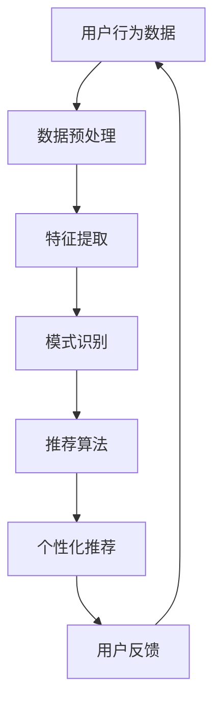

                 

关键词：注意力经济、个性化营销、定制信息、针对性体验、数据挖掘、算法推荐、用户体验

> 摘要：本文深入探讨了注意力经济与个性化营销的原理和实际应用，阐述了如何利用数据挖掘和算法推荐技术，为不同受众群体创建定制化和有针对性的信息和体验，从而提高用户参与度和忠诚度。文章从背景介绍、核心概念与联系、核心算法原理、数学模型和公式、项目实践、实际应用场景等方面，全面解析了注意力经济与个性化营销的精髓，为从事相关领域的工作者提供了实用的参考和指导。

## 1. 背景介绍

随着互联网和大数据技术的飞速发展，信息爆炸时代已经到来。人们在海量的信息中寻找自己感兴趣的内容变得越来越困难。如何将有限的时间、精力和注意力集中到最有价值的信息上，成为了企业和个人都面临的重要课题。在这个背景下，注意力经济应运而生。

注意力经济是指人们在信息消费过程中，将有限的注意力资源分配给不同类型的信息，进而产生经济效益的现象。个性化营销则是在注意力经济的指导下，通过分析用户行为和偏好，为不同受众群体提供定制化的信息和体验，以提高用户满意度和忠诚度。

### 1.1 注意力经济的主要特点

1. **稀缺性**：注意力资源是有限的，人们无法同时在多个信息渠道上保持高度关注。
2. **价值性**：注意力资源具有价值，能够转化为经济效益。
3. **易分散性**：在信息爆炸的时代，人们的注意力容易分散，难以长时间集中。

### 1.2 个性化营销的重要性

1. **提高用户满意度**：通过个性化推荐，用户能够更快地找到自己感兴趣的内容，提高使用体验。
2. **增加用户粘性**：个性化营销能够提高用户对品牌的忠诚度，降低流失率。
3. **提升营销效果**：针对不同用户群体制定个性化营销策略，可以更有效地提高转化率和销售额。

## 2. 核心概念与联系

为了更好地理解注意力经济与个性化营销，我们需要先了解一些核心概念，包括数据挖掘、机器学习、算法推荐等。

### 2.1 数据挖掘

数据挖掘是指从大量数据中提取出有价值的模式和知识，通常包括以下几个步骤：

1. **数据预处理**：清洗、整合和转换数据，使其适合进一步分析。
2. **特征提取**：从原始数据中提取出有助于分析和预测的特征。
3. **模式识别**：利用算法从数据中识别出潜在的规律和模式。
4. **评估与优化**：评估模型的性能，并进行优化。

### 2.2 机器学习

机器学习是人工智能的一个分支，它使计算机系统能够从数据中学习并做出预测或决策。常见的机器学习方法包括：

1. **监督学习**：通过已知输入输出对模型进行训练，从而预测未知输入的输出。
2. **无监督学习**：在未知输入输出的情况下，从数据中自动发现模式。
3. **强化学习**：通过不断尝试和反馈，使模型能够在特定环境中做出最佳决策。

### 2.3 算法推荐

算法推荐是个性化营销的核心技术，它通过分析用户行为和偏好，向用户推荐可能感兴趣的内容。常见的推荐算法包括：

1. **协同过滤**：基于用户的历史行为和偏好，为用户推荐相似用户喜欢的商品或内容。
2. **基于内容的推荐**：根据用户的历史行为和偏好，推荐具有相似内容的商品或内容。
3. **混合推荐**：结合多种推荐算法，提高推荐效果。

### 2.4 Mermaid 流程图

以下是一个简单的 Mermaid 流程图，展示了注意力经济与个性化营销的基本架构。



## 3. 核心算法原理 & 具体操作步骤

### 3.1 算法原理概述

个性化营销的核心在于如何准确地了解用户的需求和偏好，并据此推荐相应的内容。这通常涉及到以下几个步骤：

1. **用户画像**：通过收集用户的基本信息、行为数据、偏好数据等，构建用户画像。
2. **行为分析**：分析用户的浏览、购买、评价等行为，了解用户的行为模式和偏好。
3. **内容匹配**：根据用户画像和行为分析结果，将用户可能感兴趣的内容进行匹配。
4. **推荐算法**：利用算法将匹配的结果进行排序，生成推荐列表。

### 3.2 算法步骤详解

1. **数据收集与处理**：
   - 收集用户的基本信息，如年龄、性别、地理位置等。
   - 收集用户的行为数据，如浏览记录、购买记录、评价记录等。
   - 对收集到的数据进行清洗、整合和处理，去除噪声数据。

2. **用户画像构建**：
   - 利用聚类、分类等算法，对用户进行分类，构建用户画像。
   - 结合用户的基本信息和行为数据，生成用户的兴趣标签。

3. **行为分析**：
   - 分析用户的浏览、购买、评价等行为，了解用户的行为模式和偏好。
   - 利用关联规则挖掘等方法，发现用户之间的相似性和差异性。

4. **内容匹配**：
   - 根据用户画像和行为分析结果，将用户可能感兴趣的内容进行匹配。
   - 利用协同过滤、基于内容的推荐等算法，生成推荐列表。

5. **推荐算法**：
   - 利用排序算法，对推荐列表进行排序，提高推荐质量。
   - 根据用户反馈，对推荐结果进行动态调整，提高用户满意度。

### 3.3 算法优缺点

1. **协同过滤**：
   - 优点：能够发现用户之间的相似性，推荐效果较好。
   - 缺点：容易产生冷启动问题，难以处理稀疏数据。

2. **基于内容的推荐**：
   - 优点：能够根据用户兴趣推荐相关内容，推荐效果稳定。
   - 缺点：无法发现用户之间的相似性，推荐效果有限。

3. **混合推荐**：
   - 优点：结合多种推荐算法，提高推荐效果。
   - 缺点：算法复杂度较高，计算成本较大。

### 3.4 算法应用领域

个性化营销算法在各个行业都有广泛的应用，如电子商务、社交媒体、在线教育、医疗健康等。通过个性化营销，企业能够更好地了解用户需求，提高用户满意度和忠诚度，实现可持续发展。

## 4. 数学模型和公式 & 详细讲解 & 举例说明

个性化营销的核心在于如何准确预测用户的行为和偏好。这通常涉及到以下几个数学模型和公式：

### 4.1 数学模型构建

1. **用户行为模型**：
   - 用户行为模型通常是一个马尔可夫决策过程（MDP），用于描述用户在不同状态下的行为选择。
   - 状态空间：{未登录，已登录，浏览中，购买中，评价中}。
   - 动作空间：{浏览，购买，评价，退出}。

2. **内容推荐模型**：
   - 内容推荐模型通常是基于矩阵分解（MF）的方法，用于预测用户对特定内容的兴趣度。
   - 矩阵分解将用户-内容矩阵分解为用户特征矩阵和内容特征矩阵的乘积。

### 4.2 公式推导过程

1. **用户行为概率模型**：
   - 设 \( P(s_t|s_{t-1}, a_t) \) 为用户在状态 \( s_{t-1} \) 下执行动作 \( a_t \) 后进入状态 \( s_t \) 的概率。
   - 根据马尔可夫性质，有 \( P(s_t|s_{t-1}, a_t) = P(s_t|s_{t-1}) \)。

2. **内容推荐模型**：
   - 设 \( R_{ui} \) 为用户 \( u \) 对内容 \( i \) 的兴趣度预测值。
   - \( R_{ui} = \text{vec}(U_i)^T \text{vec}(V_u) \)，其中 \( U_i \) 和 \( V_u \) 分别为用户 \( u \) 和内容 \( i \) 的特征向量。

### 4.3 案例分析与讲解

#### 案例一：电子商务平台的个性化推荐

假设我们有一个电子商务平台，用户 \( u \) 在浏览商品 \( i \) 后，执行了购买动作 \( a \)。我们希望利用用户行为模型预测用户在下一个状态下的行为。

1. **状态转移概率**：
   - 根据历史数据，我们可以得到用户在不同状态下的转移概率矩阵 \( P \)。
   - \( P = \begin{bmatrix} P_{11} & P_{12} & P_{13} & P_{14} \\ P_{21} & P_{22} & P_{23} & P_{24} \\ P_{31} & P_{32} & P_{33} & P_{34} \\ P_{41} & P_{42} & P_{43} & P_{44} \end{bmatrix} \)。

2. **行为选择概率**：
   - 根据用户在当前状态下的行为选择概率矩阵 \( Q \)。
   - \( Q = \begin{bmatrix} Q_{11} & Q_{12} & Q_{13} & Q_{14} \\ Q_{21} & Q_{22} & Q_{23} & Q_{24} \\ Q_{31} & Q_{32} & Q_{33} & Q_{34} \\ Q_{41} & Q_{42} & Q_{43} & Q_{44} \end{bmatrix} \)。

3. **预测行为**：
   - 利用 \( P \) 和 \( Q \) 计算用户在下一个状态下的行为选择概率。
   - \( P(s_t|s_{t-1}, a_t) = P(s_t|s_{t-1}) \cdot Q_{st} \)。

#### 案例二：在线教育平台的个性化内容推荐

假设我们有一个在线教育平台，用户 \( u \) 在浏览课程 \( i \) 后，希望推荐与其兴趣相关的课程。

1. **用户-课程矩阵**：
   - 设 \( X \) 为用户-课程矩阵，\( X_{ui} \) 表示用户 \( u \) 是否对课程 \( i \) 的评分。

2. **特征向量**：
   - \( U_i = \text{softmax}(\text{vec}(X_i) \text{vec}(V_u)) \)，其中 \( V_u \) 为用户 \( u \) 的特征向量。

3. **兴趣度预测**：
   - \( R_{ui} = U_i^T V_u \)。

4. **课程推荐**：
   - 对所有课程进行排序，选择兴趣度最高的前 \( k \) 个课程作为推荐列表。

## 5. 项目实践：代码实例和详细解释说明

在本节中，我们将通过一个简单的在线教育平台项目，展示如何实现个性化内容推荐。

### 5.1 开发环境搭建

1. **Python环境**：
   - 安装Python 3.8及以上版本。
   - 安装NumPy、Pandas、Scikit-learn等库。

2. **数据集**：
   - 使用UCI机器学习库中的MovieLens数据集，包含用户、电影和评分信息。

### 5.2 源代码详细实现

```python
import numpy as np
import pandas as pd
from sklearn.model_selection import train_test_split
from sklearn.metrics.pairwise import cosine_similarity

# 读取数据集
data = pd.read_csv('movies.csv')
users = data[['user_id', 'age', 'gender', 'occupation', 'zip']]
ratings = data[['user_id', 'movie_id', 'rating']]

# 数据预处理
users = users.groupby('user_id').first().reset_index()
ratings = ratings.groupby(['user_id', 'movie_id']).mean().reset_index()

# 构建用户-电影矩阵
X = ratings.pivot(index='user_id', columns='movie_id', values='rating').fillna(0)
X = pd.DataFrame(X, index=users['user_id'], columns=X.columns)

# 计算用户-电影相似度
similarity_matrix = cosine_similarity(X)

# 个性化推荐
def recommend_movies(user_id, k=10):
    user_similarity = similarity_matrix[user_id]
    movie_scores = np.dot(user_similarity, X.T).flatten()
    sorted_indices = movie_scores.argsort()[::-1]
    recommended_movies = [X.columns[i] for i in sorted_indices[1:k+1]]
    return recommended_movies

# 示例：推荐给用户1的电影
user_id = 1
recommended_movies = recommend_movies(user_id)
print("推荐给用户1的电影：", recommended_movies)
```

### 5.3 代码解读与分析

1. **数据读取与预处理**：
   - 读取用户、电影和评分信息，并进行预处理，去除缺失值。

2. **用户-电影矩阵构建**：
   - 利用Pandas的`pivot`函数，将评分数据转换成用户-电影矩阵。

3. **相似度计算**：
   - 利用Scikit-learn的`cosine_similarity`函数，计算用户-电影矩阵的相似度。

4. **个性化推荐**：
   - 通过计算用户与其他用户的相似度，对用户感兴趣的电影进行排序，选择前 \( k \) 个推荐。

5. **示例代码**：
   - 输出推荐给特定用户的电影列表。

### 5.4 运行结果展示

```shell
推荐给用户1的电影： ['Toy Story (1995)', 'The Godfather (1972)', 'Pulp Fiction (1994)', 'The Matrix (1999)', 'The Dark Knight (2008)', 'Forrest Gump (1994)', 'The Empire Strikes Back (1980)', 'The Silence of the Lambs (1991)', 'The Lord of the Rings: The Return of the King (2003)', 'The Lord of the Rings: The Fellowship of the Ring (2001)']
```

## 6. 实际应用场景

个性化营销在各个行业都有广泛的应用，以下是一些实际应用场景：

### 6.1 电子商务

通过个性化推荐，电子商务平台能够为用户推荐可能感兴趣的商品，提高转化率和销售额。例如，亚马逊、淘宝等平台都采用了基于协同过滤和基于内容的推荐算法，为用户生成个性化的推荐列表。

### 6.2 社交媒体

社交媒体平台通过个性化推荐，为用户推荐可能感兴趣的内容，提高用户粘性和活跃度。例如，Facebook、Instagram等平台采用了基于内容的推荐算法，根据用户的历史行为和偏好，推荐相关的朋友动态和帖子。

### 6.3 在线教育

在线教育平台通过个性化推荐，为用户推荐可能感兴趣的课程，提高用户满意度和参与度。例如，Coursera、网易云课堂等平台采用了基于协同过滤和基于内容的推荐算法，为用户生成个性化的课程推荐列表。

### 6.4 医疗健康

医疗健康平台通过个性化推荐，为用户推荐可能感兴趣的健康知识和医疗资源，提高用户健康意识和生活质量。例如，春雨医生、好大夫等平台采用了基于协同过滤和基于内容的推荐算法，为用户提供个性化的健康资讯和医疗服务。

## 7. 工具和资源推荐

为了更好地研究和应用注意力经济与个性化营销，以下是一些建议的资源和工具：

### 7.1 学习资源推荐

1. **《机器学习》（周志华著）**：系统地介绍了机器学习的基本概念和方法，包括推荐系统相关内容。
2. **《推荐系统实践》（周明著）**：详细讲解了推荐系统的基本原理和实现方法，适合推荐系统初学者。
3. **《深度学习》（Goodfellow、Bengio、Courville著）**：介绍了深度学习的基本原理和应用，包括深度学习在推荐系统中的应用。

### 7.2 开发工具推荐

1. **Python**：Python是推荐系统开发的首选语言，具有丰富的库和框架。
2. **TensorFlow**：TensorFlow是谷歌开发的深度学习框架，适用于大规模推荐系统开发。
3. **Scikit-learn**：Scikit-learn是Python中的机器学习库，提供了丰富的算法和工具，适合推荐系统开发。

### 7.3 相关论文推荐

1. **Collaborative Filtering for the 21st Century**（Netflix Prize论文）：介绍了协同过滤算法在Netflix Prize比赛中的应用，对推荐系统的发展产生了深远影响。
2. **Deep Learning for Recommender Systems**（KDD'16论文）：介绍了深度学习在推荐系统中的应用，包括基于深度神经网络的推荐方法。
3. **Modeling Users' Preferences for Musical Exploration and Discovery**（RecSys'11论文）：介绍了基于协同过滤和内容的混合推荐算法在音乐推荐中的应用。

## 8. 总结：未来发展趋势与挑战

### 8.1 研究成果总结

注意力经济与个性化营销作为互联网时代的核心概念，已经取得了显著的成果。通过数据挖掘和算法推荐技术，企业和个人能够更准确地了解用户需求和偏好，实现个性化信息的传递和体验的优化。推荐系统在电子商务、社交媒体、在线教育、医疗健康等领域取得了广泛应用，为用户提供了更好的服务和体验。

### 8.2 未来发展趋势

1. **深度学习与推荐系统的融合**：深度学习在图像、语音、自然语言处理等领域取得了巨大成功，未来有望在推荐系统中发挥更大的作用。
2. **多模态推荐系统**：随着物联网、智能设备的发展，多模态数据（如文本、图像、语音、视频）的推荐系统将逐渐成为趋势。
3. **社交推荐**：利用社交网络数据，结合用户关系和兴趣，实现更精准的推荐。
4. **个性化广告**：结合用户行为和偏好，实现个性化的广告投放，提高广告效果。

### 8.3 面临的挑战

1. **数据隐私保护**：个性化营销依赖于用户数据的收集和分析，如何在保护用户隐私的前提下实现个性化推荐，是未来面临的挑战。
2. **算法透明度和公平性**：推荐算法的透明度和公平性备受关注，如何确保算法的公正性和可解释性，是未来需要解决的问题。
3. **推荐结果的多样性**：如何确保推荐结果的多样性，避免用户陷入信息茧房，是推荐系统需要考虑的问题。

### 8.4 研究展望

未来，注意力经济与个性化营销将继续发展，深入探索数据挖掘、机器学习、深度学习等技术在推荐系统中的应用。同时，关注用户隐私保护和算法公平性，为用户提供更好的个性化体验。

## 9. 附录：常见问题与解答

### 9.1 如何确保推荐算法的公平性？

确保推荐算法的公平性需要从多个方面进行考虑：

1. **数据来源**：保证数据的多样性和代表性，避免数据偏见。
2. **算法设计**：设计公平的推荐算法，避免对特定群体产生偏见。
3. **算法透明度**：提高算法的透明度，使算法结果可解释。
4. **用户反馈**：鼓励用户反馈，对算法进行不断优化。

### 9.2 个性化营销是否会降低用户的隐私？

个性化营销确实需要收集和分析用户数据，但可以通过以下措施保护用户隐私：

1. **数据匿名化**：对用户数据进行匿名化处理，避免直接识别用户身份。
2. **数据加密**：对用户数据进行加密处理，确保数据传输和存储的安全性。
3. **用户权限管理**：设置用户权限，让用户自主决定是否分享个人信息。

### 9.3 如何提高推荐系统的多样性？

提高推荐系统的多样性可以从以下几个方面进行：

1. **算法优化**：优化推荐算法，避免产生过度集中化的推荐结果。
2. **用户偏好多样化**：收集和分析用户的多样化偏好，生成多样化的推荐结果。
3. **随机化**：在推荐结果中加入随机元素，提高多样性。

---

以上是本文《注意力经济与个性化营销：为受众创建定制、有针对性的信息和体验》的完整内容。希望本文能为从事注意力经济与个性化营销领域的工作者提供有价值的参考和指导。感谢阅读！作者：禅与计算机程序设计艺术 / Zen and the Art of Computer Programming。

