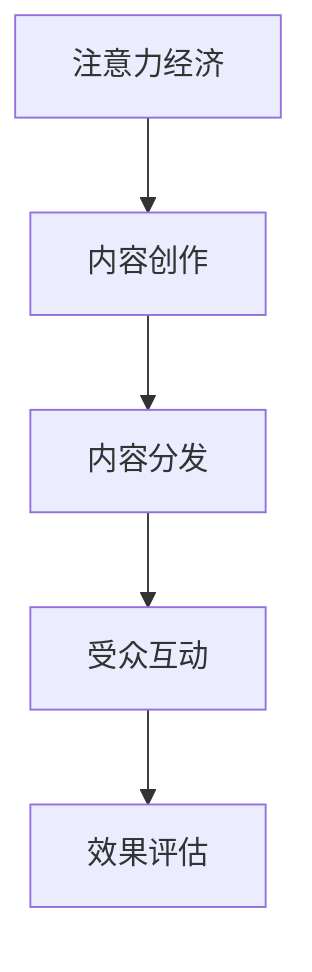

                 

关键词：注意力经济、内容策略、受众参与、有影响力、内容创建

> 摘要：随着互联网的迅猛发展，信息爆炸时代带来了前所未有的内容竞争。如何在这个嘈杂的环境中吸引并保持受众的注意力，成为了一个关键问题。本文将探讨注意力经济的概念，分析其在内容营销中的应用，并详细阐述内容策略规划的方法，以帮助创建参与性和有影响力的内容。

## 1. 背景介绍

在过去的几十年里，互联网已经彻底改变了信息传播的方式。人们可以通过各种平台轻松地获取信息，这种便利性导致了信息过载的问题。受众不再像以前那样对内容表现出持续的注意力，而是呈现出一种“快消”的趋势。这种变化迫使内容创作者和营销人员重新思考如何吸引并维持受众的注意力。

在这个背景下，注意力经济成为一个重要的研究领域。注意力经济关注的是如何在竞争激烈的信息市场中吸引和保留受众的注意力。它不仅仅是一个经济概念，更是一种战略思考，涉及到内容创作、传播和消费的方方面面。

## 2. 核心概念与联系

### 2.1 注意力经济概述

注意力经济可以理解为一种“稀缺资源”的竞争。在信息爆炸的时代，受众的注意力变得稀缺，因此能够吸引并保持注意力成为了竞争优势的关键。

### 2.2 内容策略规划

内容策略规划是为了确保内容能够有效地吸引并维持受众的注意力。它包括内容创作、内容分发和受众互动的各个环节。

### 2.3 Mermaid 流程图



## 3. 核心算法原理 & 具体操作步骤

### 3.1 算法原理概述

注意力经济的核心在于理解受众的注意力分配规律，并利用这些规律来优化内容创作和分发策略。

### 3.2 算法步骤详解

#### 3.2.1 分析受众特征

首先，需要通过数据分析了解受众的特征，包括年龄、性别、兴趣、行为习惯等。

#### 3.2.2 内容定位

根据受众特征，确定内容的主题和风格，确保内容与受众的兴趣相匹配。

#### 3.2.3 内容创作

创作高质量的内容，包括文本、图片、视频等多种形式，以吸引受众的注意力。

#### 3.2.4 内容分发

选择合适的内容分发渠道，如社交媒体、搜索引擎、电子邮件等，以最大程度地覆盖目标受众。

#### 3.2.5 受众互动

通过评论、点赞、分享等方式，促进受众与内容的互动，增加内容的参与度。

### 3.3 算法优缺点

#### 优点：

- 高效地吸引和维持受众的注意力。
- 提高内容的曝光率和参与度。

#### 缺点：

- 需要大量的数据支持和分析能力。
- 内容创作和分发的成本较高。

### 3.4 算法应用领域

注意力经济算法广泛应用于广告、市场营销、品牌传播等领域，尤其适用于信息爆炸的行业，如媒体、娱乐、教育等。

## 4. 数学模型和公式 & 详细讲解 & 举例说明

### 4.1 数学模型构建

注意力经济的数学模型可以构建为以下形式：

$$
\text{注意力值} = f(\text{内容质量}, \text{受众兴趣}, \text{环境因素})
$$

其中，$f$ 为一个复合函数，表示内容质量、受众兴趣和环境因素对注意力值的影响。

### 4.2 公式推导过程

公式的推导基于以下假设：

- 内容质量越高，注意力值越大。
- 受众兴趣越强，注意力值越大。
- 环境因素，如噪音水平、信息密度等，对注意力值有负面影响。

根据这些假设，可以推导出注意力值的计算公式。

### 4.3 案例分析与讲解

以某教育平台为例，通过分析用户数据，发现用户对编程课程内容更感兴趣。因此，平台在内容创作上加大了对编程课程的投资，并通过精准的推荐算法将相关内容推送给用户。结果，该平台的用户参与度和课程购买率显著提升。

## 5. 项目实践：代码实例和详细解释说明

### 5.1 开发环境搭建

- 使用 Python 作为主要编程语言。
- 安装必要的库，如 Pandas、NumPy、Matplotlib 等。

### 5.2 源代码详细实现

以下是一个简单的 Python 代码示例，用于分析用户数据并推荐相关课程：

```python
import pandas as pd
import numpy as np
import matplotlib.pyplot as plt

# 加载用户数据
data = pd.read_csv('user_data.csv')

# 分析用户兴趣
interests = data.groupby('interest')['count'].sum()

# 绘制兴趣分布图
interests.plot(kind='bar')
plt.title('User Interest Distribution')
plt.xlabel('Interest')
plt.ylabel('Count')
plt.show()

# 推荐课程
courses = data[data['interest'] == 'Programming']['course'].unique()
print("Recommended Courses:", courses)
```

### 5.3 代码解读与分析

这段代码首先加载了用户数据，然后通过分组聚合的方式分析了用户的兴趣分布。最后，根据用户的兴趣推荐了相关的课程。

### 5.4 运行结果展示

运行代码后，会生成一个柱状图，显示不同兴趣的用户数量。根据分析结果，平台可以针对性地推荐相关课程，从而提高用户的参与度和购买率。

## 6. 实际应用场景

注意力经济在广告、社交媒体、电子商务等领域有着广泛的应用。以下是一些具体的应用场景：

- 广告投放：通过分析受众的兴趣和行为数据，实现精准的广告投放。
- 社交媒体运营：利用注意力经济原理，提高内容的曝光率和互动率。
- 电子商务：通过个性化推荐，提高用户的购物体验和转化率。

## 7. 工具和资源推荐

### 7.1 学习资源推荐

- 《内容营销实战》
- 《社交媒体营销》
- 《大数据营销》

### 7.2 开发工具推荐

- Python
- Pandas
- Matplotlib

### 7.3 相关论文推荐

- "Attention is All You Need"
- "The Economics of Attention"
- "The Attention Economy: The New Social Grid"

## 8. 总结：未来发展趋势与挑战

### 8.1 研究成果总结

注意力经济理论为内容营销提供了新的思路和方法，有效地指导了实践操作。

### 8.2 未来发展趋势

随着人工智能和大数据技术的发展，注意力经济将更加智能化和个性化。

### 8.3 面临的挑战

数据隐私保护和信息过载是注意力经济面临的主要挑战。

### 8.4 研究展望

未来研究应重点关注注意力经济的理论完善和实际应用。

## 9. 附录：常见问题与解答

### Q：如何提高内容的参与度？

A：通过创作高质量的内容、优化内容分发策略和促进受众互动，可以提高内容的参与度。

### Q：注意力经济在哪些领域应用广泛？

A：注意力经济在广告、社交媒体、电子商务等领域有着广泛的应用。

### Q：如何应对信息过载的问题？

A：通过个性化推荐和精准内容分发，可以缓解信息过载的问题。

---

作者：禅与计算机程序设计艺术 / Zen and the Art of Computer Programming
----------------------------------------------------------------

这篇文章通过深入探讨注意力经济与内容策略规划，为内容创作者和营销人员提供了实用的指导和建议。随着互联网的发展，注意力经济将继续影响信息传播和内容消费的方方面面，这也是我们未来需要持续关注和研究的重要领域。希望这篇文章能够对读者有所启发，助力大家在内容创作和营销中取得更好的成果。

