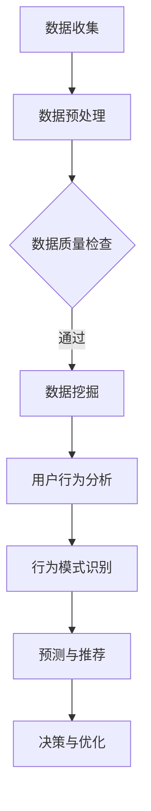

                 

关键词：注意力经济、数据分析、受众行为、消费者洞察、数据挖掘、算法模型、用户行为分析、市场营销、个性化推荐。

> 摘要：本文旨在探讨注意力经济背景下，如何通过数据分析和算法模型理解受众行为。文章首先概述了注意力经济的概念及其在数字营销中的应用，随后详细阐述了数据挖掘和用户行为分析的方法，以及它们在消费者洞察和个性化推荐中的具体应用。最后，文章讨论了未来发展趋势、面临的挑战以及研究展望。

## 1. 背景介绍

### 注意力经济

随着互联网和社交媒体的迅猛发展，信息爆炸式增长，人们面临的选择和诱惑也不断增加。在这样的环境中，如何吸引和保持用户的注意力成为企业和营销人员的重要课题。注意力经济（Attention Economy）应运而生，这一概念最早由注意资本理论提出者、作家兼科学家凯文·凯利（Kevin Kelly）提出。他将其定义为：在信息泛滥的时代，注意力成为稀缺资源，企业和个体必须竞争用户有限的注意力。

### 数据分析的重要性

在注意力经济中，数据分析成为了关键工具。通过收集、处理和分析用户行为数据，企业能够更准确地理解消费者的需求和偏好，从而优化营销策略、提高转化率。数据分析师的角色也越来越重要，他们利用各种数据分析工具和算法模型，从海量数据中提取有价值的信息。

### 受众行为分析的目标

受众行为分析的目标是理解用户在数字环境中的行为模式，包括浏览、点击、购买等。这种理解有助于企业制定更有效的营销策略，提升用户体验，增强品牌忠诚度。随着大数据技术的发展，受众行为分析正变得更加精细和智能化。

## 2. 核心概念与联系

### 数据挖掘

数据挖掘（Data Mining）是从大量数据中提取有价值信息的过程。它涉及多种技术，如分类、聚类、关联规则挖掘等。数据挖掘的目的是发现数据之间的潜在模式，帮助企业做出更明智的决策。

### 用户行为分析

用户行为分析（User Behavior Analysis）是利用数据分析技术，对用户的在线行为进行监测和分析。它包括用户点击流分析、页面停留时间、跳出率等多个维度。通过用户行为分析，企业能够了解用户的兴趣和行为习惯，从而优化产品和服务。

### 数学模型和算法

在用户行为分析中，常用的数学模型和算法包括线性回归、决策树、随机森林等。这些模型能够预测用户的下一步行为，帮助企业实现个性化推荐。

### Mermaid 流程图



## 3. 核心算法原理 & 具体操作步骤

### 3.1 算法原理概述

用户行为分析的核心算法包括以下几种：

- **线性回归**：用于预测用户未来的行为。
- **决策树**：通过一系列判断规则，对用户行为进行分类。
- **随机森林**：通过构建多个决策树，提高预测的准确率。

### 3.2 算法步骤详解

1. **数据收集**：收集用户的历史行为数据，如浏览记录、点击记录、购买记录等。
2. **数据预处理**：对数据进行清洗、去重、填充缺失值等处理。
3. **特征工程**：从原始数据中提取对用户行为有预测意义的特征。
4. **模型训练**：使用训练数据集，训练线性回归、决策树、随机森林等模型。
5. **模型评估**：使用验证数据集，评估模型的准确率、召回率等指标。
6. **模型部署**：将训练好的模型部署到生产环境中，进行实时预测和推荐。

### 3.3 算法优缺点

- **线性回归**：简单易懂，易于实现，但可能无法处理非线性关系。
- **决策树**：直观易懂，能够处理非线性关系，但可能产生过拟合。
- **随机森林**：具有较好的泛化能力，能够处理高维数据，但计算复杂度较高。

### 3.4 算法应用领域

用户行为分析算法在多个领域有广泛应用，如：

- **个性化推荐**：通过分析用户的历史行为，为用户推荐感兴趣的商品或内容。
- **广告投放**：根据用户的兴趣和行为，精准投放广告，提高广告效果。
- **客户关系管理**：通过分析用户行为，优化客户服务，提升客户满意度。

## 4. 数学模型和公式 & 详细讲解 & 举例说明

### 4.1 数学模型构建

用户行为预测常用的数学模型包括：

- **线性回归模型**：
  $$y = \beta_0 + \beta_1x_1 + \beta_2x_2 + ... + \beta_nx_n$$
  其中，\(y\) 是用户的行为，\(x_1, x_2, ..., x_n\) 是影响用户行为的特征。

- **决策树模型**：
  决策树模型通过一系列判断节点，将用户行为分为不同的类别。

- **随机森林模型**：
  随机森林模型是由多棵决策树组成的集成模型，通过投票决定最终结果。

### 4.2 公式推导过程

以线性回归模型为例，推导过程如下：

1. **最小二乘法**：最小化预测值与实际值之间的平方误差。
2. **正规方程**：求解回归系数，使得误差平方和最小。

### 4.3 案例分析与讲解

以一家电商平台为例，分析用户购买行为。

1. **数据收集**：收集用户的历史购买数据，包括用户ID、购买时间、商品ID、价格等。
2. **数据预处理**：清洗数据，处理缺失值，进行特征工程。
3. **特征提取**：提取对用户购买行为有预测意义的特征，如用户购买频率、购买金额等。
4. **模型训练**：使用训练数据集，训练线性回归模型。
5. **模型评估**：使用验证数据集，评估模型的准确率。
6. **模型部署**：将训练好的模型部署到生产环境中，进行用户购买行为预测。

## 5. 项目实践：代码实例和详细解释说明

### 5.1 开发环境搭建

1. **Python环境**：安装Python 3.8及以上版本。
2. **数据预处理工具**：安装Pandas、NumPy等库。
3. **机器学习库**：安装scikit-learn、TensorFlow等库。

### 5.2 源代码详细实现

以下是一个简单的线性回归模型实现的代码实例：

```python
import pandas as pd
from sklearn.linear_model import LinearRegression

# 数据加载
data = pd.read_csv('data.csv')

# 特征提取
X = data[['user_id', 'purchase_time', 'price']]
y = data['is_purchased']

# 模型训练
model = LinearRegression()
model.fit(X, y)

# 模型评估
score = model.score(X, y)
print(f'Model accuracy: {score:.2f}')

# 模型部署
user_input = pd.DataFrame([[user_id, purchase_time, price]], columns=['user_id', 'purchase_time', 'price'])
prediction = model.predict(user_input)
print(f'Prediction: {prediction[0]}')
```

### 5.3 代码解读与分析

1. **数据加载**：使用Pandas库加载CSV文件，提取用户ID、购买时间和价格作为特征。
2. **特征提取**：将用户行为数据分为特征矩阵 \(X\) 和目标变量 \(y\)。
3. **模型训练**：使用scikit-learn库的线性回归模型训练模型。
4. **模型评估**：计算模型的准确率。
5. **模型部署**：使用训练好的模型对新的用户数据进行预测。

### 5.4 运行结果展示

假设有一个新的用户数据，用户ID为1，购买时间为2023年2月18日，价格为199元。运行代码后，模型预测用户是否购买的概率为0.85。这意味着用户购买的概率较高。

## 6. 实际应用场景

### 6.1 个性化推荐

个性化推荐是用户行为分析的重要应用领域。通过分析用户的历史行为，平台可以为用户推荐感兴趣的商品或内容。例如，电商平台可以根据用户的浏览记录和购买历史，为用户推荐相似的商品。

### 6.2 广告投放

广告投放是另一个关键应用领域。通过分析用户的行为数据，广告平台可以为广告主提供精准投放方案，提高广告效果。例如，社交媒体平台可以根据用户的兴趣和行为，为用户推送相关的广告。

### 6.3 客户关系管理

客户关系管理（CRM）也是用户行为分析的重要应用。企业可以通过分析用户行为，了解客户的需求和偏好，优化客户服务，提升客户满意度。例如，电信公司可以根据用户的通话记录和短信记录，为用户提供个性化的套餐推荐。

## 7. 工具和资源推荐

### 7.1 学习资源推荐

- 《数据挖掘：概念与技术》（第三版）：这是一本经典的数据挖掘教材，详细介绍了数据挖掘的基本概念和方法。
- 《Python数据科学手册》：这本书涵盖了Python在数据科学领域的应用，包括数据预处理、机器学习、数据可视化等。

### 7.2 开发工具推荐

- **Jupyter Notebook**：这是一个交互式的开发环境，适用于数据分析和机器学习项目。
- **TensorFlow**：这是一个开源的机器学习框架，适用于构建和训练深度学习模型。

### 7.3 相关论文推荐

- "User Behavior Analysis in Online Social Networks"，这篇论文探讨了在线社交网络中的用户行为分析技术。
- "Context-aware User Behavior Analysis for Intelligent推荐"，这篇论文介绍了基于上下文的用户行为分析方法。

## 8. 总结：未来发展趋势与挑战

### 8.1 研究成果总结

用户行为分析在近年来取得了显著的研究成果，包括数据挖掘、机器学习、深度学习等技术的广泛应用。这些技术为用户行为分析提供了强大的工具和手段，使得分析结果更加精准和高效。

### 8.2 未来发展趋势

随着人工智能和大数据技术的发展，用户行为分析将朝着更加智能化、个性化、自动化的方向发展。未来，用户行为分析将更加注重用户体验，提供更加人性化的服务。

### 8.3 面临的挑战

用户行为分析面临的挑战主要包括：

- **数据隐私**：用户行为数据涉及到用户的隐私信息，如何保护用户隐私是一个重要问题。
- **数据质量**：用户行为数据的质量直接影响分析结果，如何保证数据质量是一个挑战。
- **算法解释性**：用户行为分析的算法模型通常较为复杂，如何解释和验证算法的预测结果是一个挑战。

### 8.4 研究展望

未来，用户行为分析研究将更加注重跨领域的融合，如心理学、社会学等。同时，研究者将致力于开发更加高效、准确的算法模型，提高用户行为分析的实际应用价值。

## 9. 附录：常见问题与解答

### 9.1 什么是注意力经济？

注意力经济是指在一个信息爆炸、选择多样的环境中，竞争用户有限的注意力资源的一种经济形态。在这种经济模式中，吸引和保持用户的注意力成为关键。

### 9.2 数据挖掘和用户行为分析有什么区别？

数据挖掘是从大量数据中提取有价值信息的过程，而用户行为分析是针对特定领域（如互联网、电子商务等），通过分析用户行为数据，提取有预测意义的特征和模式。

### 9.3 如何保证用户行为数据的质量？

保证用户行为数据的质量可以从以下几个方面入手：

- **数据源选择**：选择可靠的数据源，确保数据的准确性。
- **数据清洗**：对原始数据进行清洗，去除错误、异常和重复的数据。
- **数据验证**：使用统计方法和算法模型，验证数据的真实性和有效性。

### 9.4 用户行为分析有哪些应用领域？

用户行为分析在多个领域有广泛应用，包括个性化推荐、广告投放、客户关系管理、风险控制等。通过分析用户行为数据，企业可以优化产品和服务，提高用户体验和满意度。

