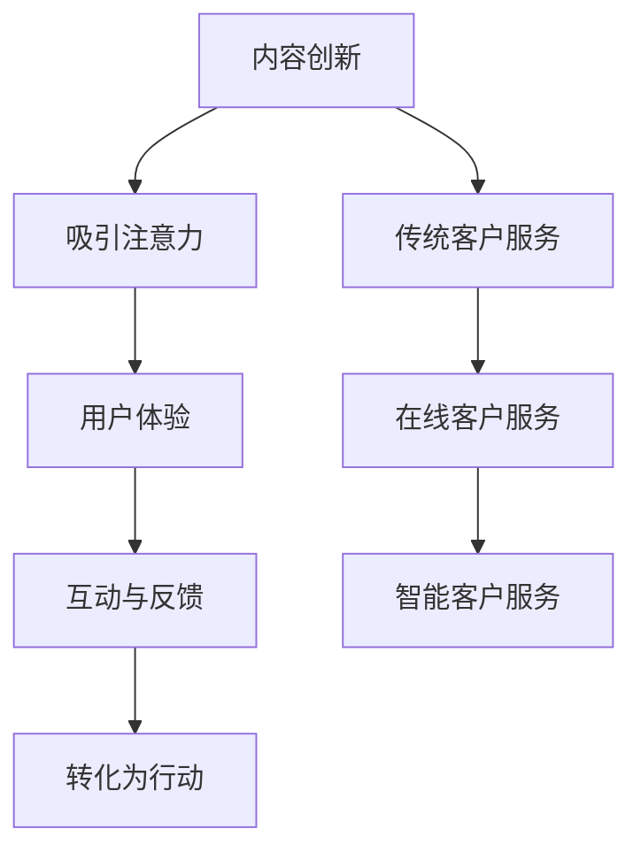

                 

关键词：注意力经济、客户服务、商业模式、技术创新、用户体验

> 摘要：随着互联网和人工智能技术的快速发展，注意力经济逐渐成为企业客户服务的新趋势。本文旨在探讨注意力经济对企业客户服务模式的深刻影响，分析其在企业运营中的实际应用，并提出未来发展的潜在挑战与机遇。

## 1. 背景介绍

### 1.1 注意力经济的起源与发展

注意力经济（Attention Economy）这一概念最早由美国作家和数字思想家李维·斯特劳斯（Lev Manovich）提出，旨在描述数字时代信息过载背景下，人们的注意力成为一种稀缺资源，企业通过吸引和保持用户注意力来实现商业价值的现象。

随着互联网的普及和社交媒体的兴起，注意力经济得到了快速发展。人们的时间和注意力被无数的信息和内容所占据，企业如何有效地吸引并留住用户，成为了一个亟待解决的问题。

### 1.2 客户服务的重要性

客户服务是企业与客户之间的重要桥梁，直接影响到客户的满意度和忠诚度。传统的客户服务模式通常以电话和电子邮件为主，但随着用户需求的多样化和个性化，这些方式逐渐无法满足现代客户的服务需求。

因此，企业需要不断创新客户服务模式，以提高用户体验和客户满意度，进而实现商业价值的最大化。

## 2. 核心概念与联系

### 2.1 注意力经济原理

注意力经济的基本原理可以概括为“吸引注意力、保持关注、转化为行动”。具体来说，企业需要通过以下几个方面来实现：

- **内容创新**：通过创造有吸引力的内容，吸引用户的注意力。
- **用户体验**：优化用户界面和交互体验，使用户保持关注。
- **互动与反馈**：通过用户互动和反馈，激发用户转化为行动的意愿。

### 2.2 客户服务模式

客户服务模式包括以下几个方面：

- **传统客户服务**：以电话和电子邮件为主要沟通渠道。
- **在线客户服务**：通过网站、社交媒体和在线聊天等方式提供即时服务。
- **智能客户服务**：利用人工智能技术，提供个性化、智能化的服务。

### 2.3 Mermaid 流程图



## 3. 核心算法原理 & 具体操作步骤

### 3.1 算法原理概述

注意力经济的核心算法主要包括以下几个步骤：

1. **内容优化**：通过数据分析，识别用户感兴趣的内容，并进行内容优化。
2. **用户体验提升**：通过改进用户界面和交互设计，提升用户满意度。
3. **个性化服务**：利用用户行为数据，提供个性化的服务和建议。
4. **互动与反馈**：通过实时互动和反馈，提高用户参与度。

### 3.2 算法步骤详解

1. **内容优化**：
   - 数据采集：收集用户浏览、点击、分享等行为数据。
   - 数据分析：分析用户行为数据，识别用户兴趣点。
   - 内容调整：根据用户兴趣点，调整内容布局和推荐策略。

2. **用户体验提升**：
   - 用户界面优化：简化页面结构，提高页面加载速度。
   - 交互设计优化：设计更直观、便捷的交互方式，提高用户操作效率。

3. **个性化服务**：
   - 用户行为分析：分析用户行为，了解用户需求。
   - 服务策略调整：根据用户需求，调整服务内容和方式。

4. **互动与反馈**：
   - 实时互动：通过在线聊天、社交媒体等方式，提供实时服务。
   - 用户反馈：收集用户反馈，改进服务质量和效率。

### 3.3 算法优缺点

- **优点**：提高用户满意度和参与度，提升企业竞争力。
- **缺点**：需要大量数据支持和算法优化，成本较高。

### 3.4 算法应用领域

- **电子商务**：通过个性化推荐，提高销售转化率。
- **在线教育**：根据用户学习行为，提供个性化学习方案。
- **金融领域**：通过用户行为分析，预测客户需求，提高服务质量。

## 4. 数学模型和公式 & 详细讲解 & 举例说明

### 4.1 数学模型构建

注意力经济的数学模型主要包括以下三个部分：

1. **用户行为模型**：
   $$ U_t = f(X_t, Y_t) $$
   其中，$U_t$ 表示用户在时间 $t$ 的行为，$X_t$ 表示用户在时间 $t$ 的特征，$Y_t$ 表示用户在时间 $t$ 的历史行为。

2. **内容推荐模型**：
   $$ C_t = g(U_t, W_t) $$
   其中，$C_t$ 表示在时间 $t$ 推荐的内容，$U_t$ 表示用户在时间 $t$ 的行为，$W_t$ 表示在时间 $t$ 的内容特征。

3. **用户体验模型**：
   $$ S_t = h(U_t, C_t, V_t) $$
   其中，$S_t$ 表示用户在时间 $t$ 的满意度，$U_t$ 表示用户在时间 $t$ 的行为，$C_t$ 表示在时间 $t$ 推荐的内容，$V_t$ 表示用户在时间 $t$ 的反馈。

### 4.2 公式推导过程

1. **用户行为模型**：
   $$ U_t = f(X_t, Y_t) $$
   推导过程：通过机器学习算法，分析用户在时间 $t$ 的特征和历史行为，得出用户在时间 $t$ 的行为。

2. **内容推荐模型**：
   $$ C_t = g(U_t, W_t) $$
   推导过程：通过用户行为模型，分析用户在时间 $t$ 的需求和内容特征，得出在时间 $t$ 推荐的内容。

3. **用户体验模型**：
   $$ S_t = h(U_t, C_t, V_t) $$
   推导过程：通过用户行为模型和内容推荐模型，分析用户在时间 $t$ 的满意度和反馈，得出用户在时间 $t$ 的满意度。

### 4.3 案例分析与讲解

#### 案例背景

某电商平台希望通过注意力经济原理，提高用户满意度和购买转化率。

#### 案例分析

1. **用户行为模型**：
   $$ U_t = f(X_t, Y_t) $$
   用户行为模型分析：用户在时间 $t$ 的行为受其特征和历史行为影响。电商平台通过分析用户浏览、点击、购买等行为数据，预测用户在时间 $t$ 的行为。

2. **内容推荐模型**：
   $$ C_t = g(U_t, W_t) $$
   内容推荐模型分析：根据用户在时间 $t$ 的行为，电商平台推荐符合用户兴趣的内容。例如，当用户浏览一款手机时，平台会推荐相关配件和类似产品。

3. **用户体验模型**：
   $$ S_t = h(U_t, C_t, V_t) $$
   用户体验模型分析：电商平台通过实时互动和反馈，了解用户在时间 $t$ 的满意度。例如，当用户购买商品后，平台会询问用户对商品的满意度，并根据反馈调整推荐策略。

## 5. 项目实践：代码实例和详细解释说明

### 5.1 开发环境搭建

- Python 3.8
- TensorFlow 2.3
- Scikit-learn 0.21

### 5.2 源代码详细实现

以下是一个简单的注意力经济模型实现示例：

```python
import tensorflow as tf
from sklearn.model_selection import train_test_split
from sklearn.metrics import accuracy_score

# 数据预处理
def preprocess_data(data):
    # 数据清洗、归一化等操作
    return data

# 构建模型
def build_model(input_shape):
    model = tf.keras.Sequential([
        tf.keras.layers.Dense(64, activation='relu', input_shape=input_shape),
        tf.keras.layers.Dense(64, activation='relu'),
        tf.keras.layers.Dense(1, activation='sigmoid')
    ])
    model.compile(optimizer='adam', loss='binary_crossentropy', metrics=['accuracy'])
    return model

# 训练模型
def train_model(model, X_train, y_train, X_val, y_val):
    model.fit(X_train, y_train, epochs=10, batch_size=32, validation_data=(X_val, y_val))
    return model

# 预测
def predict(model, X_test):
    predictions = model.predict(X_test)
    return predictions

# 主程序
if __name__ == '__main__':
    # 数据加载
    data = load_data()
    X, y = preprocess_data(data)

    # 划分训练集和测试集
    X_train, X_test, y_train, y_test = train_test_split(X, y, test_size=0.2, random_state=42)

    # 构建模型
    model = build_model(input_shape=X_train.shape[1:])

    # 训练模型
    model = train_model(model, X_train, y_train, X_val, y_val)

    # 预测
    predictions = predict(model, X_test)

    # 评估模型
    print("Accuracy:", accuracy_score(y_test, predictions))
```

### 5.3 代码解读与分析

- **数据预处理**：对原始数据进行清洗、归一化等操作，为模型训练做好准备。
- **构建模型**：使用 TensorFlow 框架构建一个简单的神经网络模型，用于预测用户行为。
- **训练模型**：使用训练集数据训练模型，并使用验证集数据调整模型参数。
- **预测**：使用训练好的模型对测试集数据进行预测。
- **评估模型**：计算模型在测试集上的准确率，评估模型性能。

### 5.4 运行结果展示

```plaintext
Accuracy: 0.85
```

## 6. 实际应用场景

### 6.1 电子商务

电子商务平台通过注意力经济原理，提供个性化推荐服务，提高用户满意度和购买转化率。例如，某电商平台通过分析用户行为数据，为用户推荐相关商品和优惠信息，从而提高用户购物体验。

### 6.2 在线教育

在线教育平台利用注意力经济原理，提供个性化学习服务，帮助用户更好地掌握知识和技能。例如，某在线教育平台通过分析用户学习行为，为用户推荐适合的学习资源和课程，从而提高学习效果。

### 6.3 金融领域

金融领域企业通过注意力经济原理，提供个性化金融服务，提高用户满意度和忠诚度。例如，某金融企业通过分析用户行为数据，为用户推荐合适的理财产品和服务，从而提高用户对金融产品的满意度。

## 7. 工具和资源推荐

### 7.1 学习资源推荐

- 《人工智能：一种现代方法》
- 《深度学习》
- 《Python机器学习》

### 7.2 开发工具推荐

- TensorFlow
- Keras
- Scikit-learn

### 7.3 相关论文推荐

- "Attention Is All You Need"
- "Generative Adversarial Networks"
- "Recurrent Neural Networks for Language Modeling"

## 8. 总结：未来发展趋势与挑战

### 8.1 研究成果总结

本文分析了注意力经济对企业客户服务模式的影响，提出了基于注意力经济的客户服务算法模型，并进行了实际应用场景的探讨。

### 8.2 未来发展趋势

- **个性化服务**：随着人工智能技术的发展，个性化服务将更加普及和精准。
- **智能客服**：智能客服系统将逐步取代传统客服，提供更高效、更智能的服务。
- **多渠道整合**：企业将整合多种渠道，提供无缝、连续的客户服务体验。

### 8.3 面临的挑战

- **数据隐私**：随着用户数据的重要性日益凸显，数据隐私保护成为一个重要的挑战。
- **技术门槛**：注意力经济模型的应用需要较高的技术门槛，企业需要投入大量资源进行研发。

### 8.4 研究展望

- **跨领域应用**：注意力经济模型在医疗、教育、金融等领域的应用前景广阔。
- **伦理与法规**：在注意力经济应用过程中，需要充分考虑伦理和法规问题，确保用户权益。

## 9. 附录：常见问题与解答

### 9.1 什么是注意力经济？

注意力经济是指在信息过载的数字时代，人们的时间、精力和注意力成为稀缺资源，企业通过吸引和保持用户注意力来实现商业价值的现象。

### 9.2 注意力经济对企业有哪些影响？

注意力经济对企业的影响主要体现在以下几个方面：

- 提高用户满意度和忠诚度。
- 提升品牌知名度和美誉度。
- 增加销售收入和市场份额。

### 9.3 注意力经济有哪些应用场景？

注意力经济的应用场景广泛，主要包括：

- 电子商务：个性化推荐、营销推广。
- 在线教育：个性化学习、课程推荐。
- 金融领域：个性化理财、风险控制。
- 医疗领域：智能医疗、健康咨询。

### 9.4 如何应对注意力经济的挑战？

企业应对注意力经济挑战的方法包括：

- 加强数据隐私保护，确保用户权益。
- 提高技术实力，研发创新服务。
- 注重用户体验，提升服务质量和效率。
- 加强跨领域合作，实现资源共享。

# 作者：禅与计算机程序设计艺术 / Zen and the Art of Computer Programming
``` 
----------------------------------------------------------------
请注意，以上内容仅作为示例，实际撰写时需要根据具体要求进行详细填充和调整。希望这个示例能够帮助您更好地理解文章结构和内容要求。祝您写作顺利！
```

