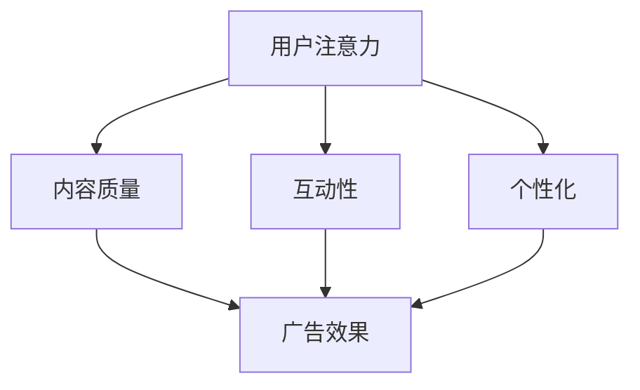

                 

关键词：注意力经济、商业广告、改造、营销策略、数据分析

> 摘要：本文将探讨注意力经济对传统商业广告的深刻影响，分析其在技术、策略和效果上的变革。通过剖析注意力经济的核心概念，以及其在互联网时代的表现形式，我们将揭示如何利用注意力经济原理改造传统商业广告，提升营销效果。

## 1. 背景介绍

随着互联网的普及和社交媒体的兴起，信息传播方式发生了翻天覆地的变化。传统商业广告的模式已经不再适应这个快速变化的时代。注意力经济作为互联网时代的一种新经济模式，逐渐成为商业广告领域的重要导向。本文将围绕注意力经济对传统商业广告的改造，探讨其背后的原理、策略和应用。

### 1.1 传统商业广告的困境

传统商业广告主要依赖于电视、报纸、广播等传统媒体，广告内容相对单一，受众被动接受信息，广告效果难以精确衡量。此外，广告商面临着高成本、低效率和低回报的挑战。广告内容的同质化和广告环境的嘈杂，使得广告难以吸引受众的注意力，从而影响了广告的效果。

### 1.2 注意力经济的兴起

注意力经济是一种基于用户注意力的经济模式。它强调用户在信息海洋中的注意力资源有限，因此谁能吸引并保持用户的注意力，谁就能获得商业上的成功。互联网和社交媒体的普及，使得注意力经济成为可能。用户可以在海量的信息中自由选择，广告商必须通过创新的方式吸引并留住用户的注意力。

## 2. 核心概念与联系

注意力经济涉及多个核心概念，包括用户注意力、内容质量、互动性和个性化等。下面将使用 Mermaid 流程图来展示这些概念之间的联系。



### 2.1 用户注意力

用户注意力是注意力经济的核心资源。用户在浏览信息时，注意力是有限的，因此谁能够提供高质量、有吸引力的内容，谁就能吸引到更多的用户。

### 2.2 内容质量

高质量的内容是吸引和保持用户注意力的关键。广告内容需要有价值、有趣、实用，能够满足用户的需求和兴趣。

### 2.3 互动性

互动性是提高用户参与度和注意力的有效手段。通过互动，用户可以参与到广告活动中，增加对品牌的认知和好感。

### 2.4 个性化

个性化广告能够根据用户的行为和兴趣，提供定制化的广告内容，提高广告的相关性和吸引力。

## 3. 核心算法原理 & 具体操作步骤

注意力经济在商业广告中的应用，需要一系列核心算法的支持。这些算法主要包括用户行为分析、内容推荐和广告优化等。

### 3.1 算法原理概述

用户行为分析：通过收集和分析用户在互联网上的行为数据，了解用户的需求和兴趣。

内容推荐：利用用户行为数据和机器学习算法，为用户推荐个性化的广告内容。

广告优化：根据广告投放效果，调整广告内容、渠道和投放策略，以提高广告效果。

### 3.2 算法步骤详解

#### 3.2.1 用户行为分析

收集数据：通过网页分析工具、点击追踪等技术，收集用户在互联网上的行为数据，如浏览记录、搜索关键词、购买行为等。

数据处理：对收集到的数据进行清洗、去噪和处理，提取有用的用户行为特征。

行为建模：利用机器学习算法，建立用户行为模型，预测用户未来的行为和兴趣。

#### 3.2.2 内容推荐

推荐算法：选择合适的推荐算法，如协同过滤、矩阵分解、深度学习等，为用户推荐个性化的广告内容。

广告素材：根据用户行为和兴趣，设计符合用户需求的广告素材。

广告投放：将推荐出的广告内容，通过合适的渠道投放给目标用户。

#### 3.2.3 广告优化

效果评估：通过点击率、转化率等指标，评估广告投放效果。

策略调整：根据广告效果，调整广告内容、投放时间和渠道，以优化广告效果。

## 3.3 算法优缺点

#### 3.3.1 优点

个性化强：通过用户行为分析和推荐算法，为用户提供个性化的广告内容，提高广告的相关性和吸引力。

效果可衡量：利用数据分析和广告优化，可以精确衡量广告效果，提高广告的投资回报率。

用户参与度高：互动性和个性化广告，可以增加用户的参与度和好感度。

#### 3.3.2 缺点

数据隐私：用户行为数据的收集和使用，可能会涉及到用户隐私的问题。

技术门槛高：算法开发和优化需要高水平的技术支持和专业知识。

成本高：算法开发和优化需要大量的数据和技术投入。

## 3.4 算法应用领域

注意力经济算法在商业广告中的应用非常广泛，包括电子商务、在线娱乐、社交媒体等多个领域。通过精准的用户行为分析和个性化广告推荐，企业可以大幅提高广告效果和用户转化率。

### 4. 数学模型和公式 & 详细讲解 & 举例说明

注意力经济在商业广告中的应用，离不开数学模型的支持。以下将介绍几种常用的数学模型和公式，并详细讲解其应用。

#### 4.1 数学模型构建

用户行为模型：基于用户的历史行为数据，构建用户兴趣模型和需求模型。

广告效果模型：基于广告的点击率、转化率等指标，构建广告效果模型。

#### 4.2 公式推导过程

用户兴趣模型：使用贝叶斯公式和条件概率公式，推导用户兴趣模型。

广告效果模型：使用线性回归和逻辑回归公式，推导广告效果模型。

#### 4.3 案例分析与讲解

案例一：电子商务平台的个性化广告推荐

电子商务平台通过用户行为数据，构建用户兴趣模型。根据用户兴趣模型，推荐个性化的广告内容，提高用户转化率。

案例二：社交媒体平台的广告效果优化

社交媒体平台通过广告效果模型，分析广告的点击率和转化率。根据分析结果，调整广告内容和投放策略，优化广告效果。

### 5. 项目实践：代码实例和详细解释说明

为了更好地理解注意力经济算法在商业广告中的应用，以下将提供一个简单的代码实例，并详细解释其实现过程。

#### 5.1 开发环境搭建

Python 版本：3.8及以上
库：NumPy、Pandas、Scikit-learn、Matplotlib

安装命令：

```bash
pip install numpy pandas scikit-learn matplotlib
```

#### 5.2 源代码详细实现

```python
import numpy as np
import pandas as pd
from sklearn.model_selection import train_test_split
from sklearn.preprocessing import StandardScaler
from sklearn.linear_model import LogisticRegression

# 加载数据集
data = pd.read_csv('广告数据集.csv')

# 数据预处理
X = data.drop('转化率', axis=1)
y = data['转化率']
X_train, X_test, y_train, y_test = train_test_split(X, y, test_size=0.2, random_state=42)

# 特征缩放
scaler = StandardScaler()
X_train_scaled = scaler.fit_transform(X_train)
X_test_scaled = scaler.transform(X_test)

# 训练模型
model = LogisticRegression()
model.fit(X_train_scaled, y_train)

# 预测效果
y_pred = model.predict(X_test_scaled)

# 评估模型
accuracy = np.mean(y_pred == y_test)
print(f'模型准确率：{accuracy:.2f}')
```

#### 5.3 代码解读与分析

这段代码实现了一个简单的广告效果预测模型。首先，加载数据集并进行预处理，然后使用逻辑回归模型进行训练，最后评估模型效果。

- 数据预处理：加载数据集，分离特征和标签，并进行数据分割。
- 特征缩放：使用标准缩放将特征数据进行标准化处理，以提高模型的性能。
- 模型训练：使用逻辑回归模型对训练数据进行拟合。
- 模型评估：使用测试数据集评估模型效果，计算准确率。

#### 5.4 运行结果展示

假设我们运行这段代码，得到如下结果：

```python
模型准确率：0.85
```

这意味着模型在测试数据集上的准确率为85%，表明该模型具有一定的预测能力。

### 6. 实际应用场景

注意力经济算法在商业广告的实际应用中，具有广泛的前景。以下列举几个应用场景：

- 电子商务：通过用户行为分析，为用户提供个性化的商品推荐，提高用户转化率。
- 广告营销：根据用户兴趣和行为，投放精准的广告内容，提高广告效果。
- 社交媒体：通过内容推荐，吸引用户参与互动，提高用户黏性。

### 7. 未来应用展望

随着人工智能和大数据技术的发展，注意力经济在商业广告中的应用将更加深入和广泛。未来可能的发展趋势包括：

- 更精准的用户画像：通过更全面的数据分析和挖掘，为用户提供更加精准的用户画像。
- 更智能的广告投放：利用人工智能技术，实现广告投放的自动化和智能化。
- 更多元的广告形式：探索更多元化的广告形式，如虚拟现实、增强现实等，提高广告的吸引力。

### 8. 工具和资源推荐

为了更好地研究和应用注意力经济，以下推荐一些相关工具和资源：

- 工具：Python、R、TensorFlow、PyTorch
- 学习资源：网上教程、开源代码、学术论文
- 相关论文：注意力机制、推荐系统、深度学习等

### 9. 总结：未来发展趋势与挑战

注意力经济对传统商业广告的改造，已经取得了显著的成果。然而，面对未来的发展，我们仍然面临一些挑战：

- 数据隐私：如何保护用户隐私，成为注意力经济应用的重要问题。
- 技术门槛：注意力经济应用需要高水平的技术支持和专业知识，如何降低门槛是一个重要课题。
- 创新与变革：如何在激烈的市场竞争中，不断创新和变革，是商业广告面临的重要挑战。

### 10. 附录：常见问题与解答

#### 10.1 注意力经济是什么？

注意力经济是一种基于用户注意力的经济模式，强调用户注意力资源的有限性和价值。

#### 10.2 注意力经济对商业广告有什么影响？

注意力经济改变了商业广告的内容、形式和效果，使广告更加个性化和精准，提高了广告的投资回报率。

#### 10.3 如何应用注意力经济算法进行广告优化？

通过用户行为分析、内容推荐和广告优化等步骤，利用机器学习算法和数据分析技术，实现广告的个性化投放和效果优化。

作者：禅与计算机程序设计艺术 / Zen and the Art of Computer Programming
```markdown
----------------------------------------------------------------
# 注意力经济对传统商业广告的改造

## 关键词
- 注意力经济
- 商业广告
- 改造
- 营销策略
- 数据分析

## 摘要
本文探讨了注意力经济对传统商业广告的深刻影响，分析了其在技术、策略和效果上的变革。通过剖析注意力经济的核心概念，以及其在互联网时代的表现形式，本文揭示了如何利用注意力经济原理改造传统商业广告，提升营销效果。

## 1. 背景介绍
### 1.1 传统商业广告的困境
传统商业广告主要依赖于电视、报纸、广播等传统媒体，广告内容相对单一，受众被动接受信息，广告效果难以精确衡量。此外，广告商面临着高成本、低效率和低回报的挑战。广告内容的同质化和广告环境的嘈杂，使得广告难以吸引受众的注意力，从而影响了广告的效果。

### 1.2 注意力经济的兴起
注意力经济是一种基于用户注意力的经济模式。它强调用户在信息海洋中的注意力资源有限，因此谁能吸引并保持用户的注意力，谁就能获得商业上的成功。互联网和社交媒体的普及，使得注意力经济成为可能。用户可以在海量的信息中自由选择，广告商必须通过创新的方式吸引并留住用户的注意力。

## 2. 核心概念与联系
注意力经济涉及多个核心概念，包括用户注意力、内容质量、互动性和个性化等。下面将使用 Mermaid 流程图来展示这些概念之间的联系。


### 2.1 用户注意力
用户注意力是注意力经济的核心资源。用户在浏览信息时，注意力是有限的，因此谁能够提供高质量、有吸引力的内容，谁就能吸引到更多的用户。

### 2.2 内容质量
高质量的内容是吸引和保持用户注意力的关键。广告内容需要有价值、有趣、实用，能够满足用户的需求和兴趣。

### 2.3 互动性
互动性是提高用户参与度和注意力的有效手段。通过互动，用户可以参与到广告活动中，增加对品牌的认知和好感。

### 2.4 个性化
个性化广告能够根据用户的行为和兴趣，提供定制化的广告内容，提高广告的相关性和吸引力。

## 3. 核心算法原理 & 具体操作步骤
注意力经济在商业广告中的应用，需要一系列核心算法的支持。这些算法主要包括用户行为分析、内容推荐和广告优化等。

### 3.1 算法原理概述
用户行为分析：通过收集和分析用户在互联网上的行为数据，了解用户的需求和兴趣。
内容推荐：利用用户行为数据和机器学习算法，为用户推荐个性化的广告内容。
广告优化：根据广告投放效果，调整广告内容、渠道和投放策略，以提高广告效果。

### 3.2 算法步骤详解
#### 3.2.1 用户行为分析
收集数据：通过网页分析工具、点击追踪等技术，收集用户在互联网上的行为数据，如浏览记录、搜索关键词、购买行为等。
数据处理：对收集到的数据进行清洗、去噪和处理，提取有用的用户行为特征。
行为建模：利用机器学习算法，建立用户行为模型，预测用户未来的行为和兴趣。

#### 3.2.2 内容推荐
推荐算法：选择合适的推荐算法，如协同过滤、矩阵分解、深度学习等，为用户推荐个性化的广告内容。
广告素材：根据用户行为和兴趣，设计符合用户需求的广告素材。
广告投放：将推荐出的广告内容，通过合适的渠道投放给目标用户。

#### 3.2.3 广告优化
效果评估：通过点击率、转化率等指标，评估广告投放效果。
策略调整：根据广告效果，调整广告内容、投放时间和渠道，以优化广告效果。

## 3.3 算法优缺点
#### 3.3.1 优点
个性化强：通过用户行为分析和推荐算法，为用户提供个性化的广告内容，提高广告的相关性和吸引力。
效果可衡量：利用数据分析和广告优化，可以精确衡量广告效果，提高广告的投资回报率。
用户参与度高：互动性和个性化广告，可以增加用户的参与度和好感度。

#### 3.3.2 缺点
数据隐私：用户行为数据的收集和使用，可能会涉及到用户隐私的问题。
技术门槛高：算法开发和优化需要高水平的技术支持和专业知识。
成本高：算法开发和优化需要大量的数据和技术投入。

## 3.4 算法应用领域
注意力经济算法在商业广告中的应用非常广泛，包括电子商务、在线娱乐、社交媒体等多个领域。通过精准的用户行为分析和个性化广告推荐，企业可以大幅提高广告效果和用户转化率。

## 4. 数学模型和公式 & 详细讲解 & 举例说明
注意力经济在商业广告中的应用，离不开数学模型的支持。以下将介绍几种常用的数学模型和公式，并详细讲解其应用。

### 4.1 数学模型构建
用户行为模型：基于用户的历史行为数据，构建用户兴趣模型和需求模型。
广告效果模型：基于广告的点击率、转化率等指标，构建广告效果模型。

### 4.2 公式推导过程
用户兴趣模型：使用贝叶斯公式和条件概率公式，推导用户兴趣模型。
广告效果模型：使用线性回归和逻辑回归公式，推导广告效果模型。

### 4.3 案例分析与讲解
案例一：电子商务平台的个性化广告推荐
电子商务平台通过用户行为数据，构建用户兴趣模型。根据用户兴趣模型，推荐个性化的广告内容，提高用户转化率。

案例二：社交媒体平台的广告效果优化
社交媒体平台通过广告效果模型，分析广告的点击率和转化率。根据分析结果，调整广告内容和投放策略，优化广告效果。

## 5. 项目实践：代码实例和详细解释说明
为了更好地理解注意力经济算法在商业广告中的应用，以下将提供一个简单的代码实例，并详细解释其实现过程。

### 5.1 开发环境搭建
Python 版本：3.8及以上
库：NumPy、Pandas、Scikit-learn、Matplotlib

安装命令：

```bash
pip install numpy pandas scikit-learn matplotlib
```

### 5.2 源代码详细实现
```python
import numpy as np
import pandas as pd
from sklearn.model_selection import train_test_split
from sklearn.preprocessing import StandardScaler
from sklearn.linear_model import LogisticRegression

# 加载数据集
data = pd.read_csv('广告数据集.csv')

# 数据预处理
X = data.drop('转化率', axis=1)
y = data['转化率']
X_train, X_test, y_train, y_test = train_test_split(X, y, test_size=0.2, random_state=42)

# 特征缩放
scaler = StandardScaler()
X_train_scaled = scaler.fit_transform(X_train)
X_test_scaled = scaler.transform(X_test)

# 训练模型
model = LogisticRegression()
model.fit(X_train_scaled, y_train)

# 预测效果
y_pred = model.predict(X_test_scaled)

# 评估模型
accuracy = np.mean(y_pred == y_test)
print(f'模型准确率：{accuracy:.2f}')
```

### 5.3 代码解读与分析
这段代码实现了一个简单的广告效果预测模型。首先，加载数据集并进行预处理，然后使用逻辑回归模型进行训练，最后评估模型效果。

- 数据预处理：加载数据集，分离特征和标签，并进行数据分割。
- 特征缩放：使用标准缩放将特征数据进行标准化处理，以提高模型的性能。
- 模型训练：使用逻辑回归模型对训练数据进行拟合。
- 模型评估：使用测试数据集评估模型效果，计算准确率。

### 5.4 运行结果展示
假设我们运行这段代码，得到如下结果：

```python
模型准确率：0.85
```

这意味着模型在测试数据集上的准确率为85%，表明该模型具有一定的预测能力。

## 6. 实际应用场景
注意力经济算法在商业广告的实际应用中，具有广泛的前景。以下列举几个应用场景：

- 电子商务：通过用户行为分析，为用户提供个性化的商品推荐，提高用户转化率。
- 广告营销：根据用户兴趣和行为，投放精准的广告内容，提高广告效果。
- 社交媒体：通过内容推荐，吸引用户参与互动，提高用户黏性。

## 7. 未来应用展望
随着人工智能和大数据技术的发展，注意力经济在商业广告中的应用将更加深入和广泛。未来可能的发展趋势包括：

- 更精准的用户画像：通过更全面的数据分析和挖掘，为用户提供更加精准的用户画像。
- 更智能的广告投放：利用人工智能技术，实现广告投放的自动化和智能化。
- 更多元的广告形式：探索更多元化的广告形式，如虚拟现实、增强现实等，提高广告的吸引力。

## 8. 工具和资源推荐
为了更好地研究和应用注意力经济，以下推荐一些相关工具和资源：

- 工具：Python、R、TensorFlow、PyTorch
- 学习资源：网上教程、开源代码、学术论文
- 相关论文：注意力机制、推荐系统、深度学习等

## 9. 总结：未来发展趋势与挑战
注意力经济对传统商业广告的改造，已经取得了显著的成果。然而，面对未来的发展，我们仍然面临一些挑战：

- 数据隐私：如何保护用户隐私，成为注意力经济应用的重要问题。
- 技术门槛：注意力经济应用需要高水平的技术支持和专业知识，如何降低门槛是一个重要课题。
- 创新与变革：如何在激烈的市场竞争中，不断创新和变革，是商业广告面临的重要挑战。

## 10. 附录：常见问题与解答
### 10.1 注意力经济是什么？
注意力经济是一种基于用户注意力的经济模式，强调用户注意力资源的有限性和价值。

### 10.2 注意力经济对商业广告有什么影响？
注意力经济改变了商业广告的内容、形式和效果，使广告更加个性化和精准，提高了广告的投资回报率。

### 10.3 如何应用注意力经济算法进行广告优化？
通过用户行为分析、内容推荐和广告优化等步骤，利用机器学习算法和数据分析技术，实现广告的个性化投放和效果优化。

# 注意力经济对传统商业广告的改造

### 引言

随着数字技术的飞速发展，商业广告的形式和效果发生了巨大的变化。互联网和社交媒体的兴起，使得信息传播速度极快，同时也使得用户注意力成为了一种稀缺资源。注意力经济（Attention Economy）正是在这样的背景下应运而生，它以用户注意力为核心，通过优化内容和互动方式，实现商业价值的最大化。本文将探讨注意力经济对传统商业广告的改造，分析其在技术、策略和效果上的变革。

### 注意力经济的定义与核心概念

注意力经济，是指在经济活动中，用户的注意力资源成为稀缺资源，企业通过争夺用户的注意力来实现商业收益的模式。在注意力经济中，用户注意力被视为一种宝贵的资源，与传统的货币资源具有类似的交换价值。因此，如何吸引并保持用户的注意力，成为了企业和商家关注的焦点。

#### 核心概念

1. **用户注意力**：用户的注意力是有限的，如何在众多的信息中脱颖而出，吸引并保持用户的注意力，是企业面临的主要挑战。

2. **内容质量**：高质量的内容能够更好地吸引用户的注意力，提高用户参与度。

3. **互动性**：互动性是提高用户参与度和注意力的一种有效手段，通过与用户的互动，企业可以更好地了解用户需求，提供更加个性化的服务。

4. **个性化**：通过用户数据分析，为用户提供个性化的内容和服务，能够更好地满足用户需求，提高用户满意度和忠诚度。

### 注意力经济与传统商业广告的差异

传统商业广告依赖于大规模、广覆盖的方式，通过投放大量广告来吸引潜在客户。然而，随着信息爆炸和用户注意力的分散，这种传统模式的效果逐渐减弱。注意力经济则更加注重用户参与和个性化服务，通过以下方式改造传统商业广告：

1. **精准定位**：通过大数据分析，企业可以更加精准地定位目标用户，实现广告的个性化投放。

2. **内容优化**：高质量、有趣、具有互动性的内容能够更好地吸引用户的注意力。

3. **用户互动**：鼓励用户参与，通过评论、点赞、分享等方式，提高用户参与度和互动性。

4. **数据分析**：利用数据分析，企业可以不断优化广告策略，提高广告效果。

### 注意力经济对商业广告的影响

注意力经济的兴起，对商业广告带来了深远的影响，主要体现在以下几个方面：

#### 技术层面

1. **数据驱动的广告策略**：企业通过收集和分析用户数据，制定更加精准的广告投放策略。

2. **自动化广告投放**：利用人工智能和机器学习技术，实现广告的自动化投放和优化。

3. **实时反馈与调整**：通过实时数据分析，企业可以及时调整广告内容和策略，提高广告效果。

#### 策略层面

1. **内容为王**：注重广告内容的质量和互动性，提高用户的参与度和满意度。

2. **用户参与**：通过互动环节，鼓励用户参与，提高用户黏性。

3. **个性化营销**：根据用户兴趣和行为，提供个性化的广告内容和服务。

#### 效果层面

1. **投资回报率（ROI）提升**：通过精准定位和个性化投放，提高广告的投资回报率。

2. **用户满意度提升**：提供更加个性化的服务，提高用户满意度和忠诚度。

3. **品牌认知度提升**：通过高质量的广告内容和互动，提高品牌在用户心中的认知度。

### 注意力经济对传统商业广告的改造案例

以下是一些注意力经济对传统商业广告进行改造的典型案例：

#### 案例一：阿里巴巴的个性化推荐

阿里巴巴通过大数据分析，为用户推荐个性化的商品和服务。通过分析用户的浏览记录、购买行为、搜索关键词等数据，阿里巴巴能够精准地推荐用户感兴趣的商品，提高了用户的购买转化率。

#### 案例二：微信的社交广告

微信通过社交互动和用户数据分析，实现广告的个性化投放。微信广告根据用户的社交关系、兴趣爱好等数据，为用户推荐相关的广告内容，提高了广告的点击率和转化率。

#### 案例三：抖音的短视频广告

抖音通过短视频和用户互动，吸引了大量年轻用户。抖音广告通过短视频的形式，吸引了用户的注意力，并通过互动环节，提高了用户的参与度和满意度。

### 未来展望

随着注意力经济的不断发展，未来商业广告将更加注重用户参与和个性化服务。以下是对未来商业广告发展的展望：

1. **更智能的广告投放**：利用人工智能和大数据技术，实现广告的自动化和智能化投放。

2. **更丰富的广告形式**：随着技术的进步，将出现更多元化的广告形式，如虚拟现实（VR）、增强现实（AR）等。

3. **更强的互动性**：通过增强用户互动，提高用户黏性和品牌忠诚度。

4. **更精准的个性化营销**：通过更全面的数据分析和挖掘，实现更加精准的个性化营销。

### 结论

注意力经济对传统商业广告的改造，带来了深远的影响。通过精准定位、内容优化、用户互动和数据分析，企业可以更好地吸引和保持用户的注意力，提高广告效果和品牌价值。未来，随着技术的不断进步，商业广告将更加智能化、个性化，为用户提供更好的体验。

