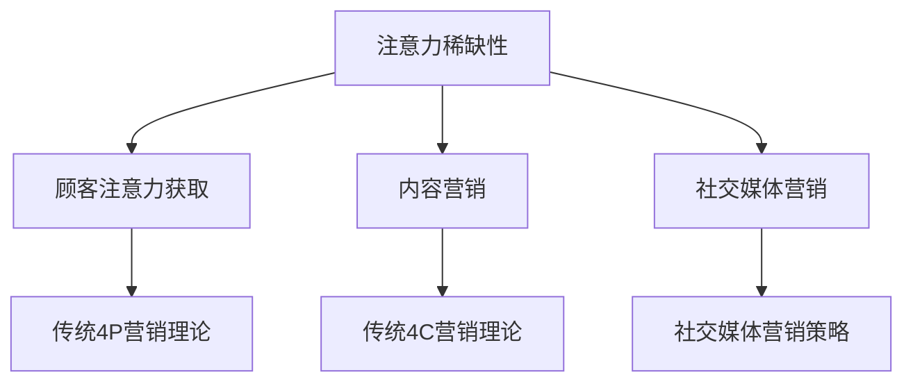

                 

关键词：注意力经济、传统营销理论、挑战、革新、营销策略、信息技术、消费者行为

> 摘要：随着信息时代的到来，注意力经济作为一种新兴的经济模式，对传统的营销理论带来了巨大的挑战。本文旨在探讨注意力经济对传统营销理论的冲击，并提出相应的革新策略，以期为企业在新的经济环境下的营销活动提供理论指导。

## 1. 背景介绍

### 注意力经济的概念

注意力经济（Attention Economy）是指一个社会、文化、经济体系中，个体、组织或商业活动为了获得关注、关注度和影响力，而进行的一种竞争行为。在互联网时代，信息的爆炸性增长使得用户的注意力成为一种稀缺资源，谁能更好地吸引和保持用户的注意力，谁就能在市场中占据有利位置。

### 传统营销理论的演变

传统营销理论主要关注4P（产品、价格、地点、促销）和4C（顾客、成本、便利、沟通）等要素。随着市场竞争的加剧，企业开始重视顾客需求，从以产品为中心转向以顾客为中心。然而，在注意力经济时代，这些传统理论是否仍然适用？

## 2. 核心概念与联系

### 注意力经济的核心概念

注意力经济的核心概念包括：

1. **注意力稀缺性**：在信息爆炸的时代，用户的注意力成为稀缺资源。
2. **注意力分配**：用户如何在其可用的注意资源中进行分配。
3. **注意力转移**：通过创新和独特的营销手段，引导用户将注意力从其他事物转移到产品或服务上。
4. **注意力黏性**：保持用户的持续关注和参与。

### 传统营销理论与注意力经济的联系

注意力经济对传统营销理论的挑战主要体现在以下方面：

1. **顾客注意力的获取**：在注意力经济中，顾客的注意力成为营销的关键，如何获取顾客的注意力成为企业必须解决的问题。
2. **内容营销**：注意力经济强调高质量、有价值的内容，而不仅仅是产品本身。
3. **社交媒体营销**：社交媒体平台成为用户获取信息的主要渠道，如何利用社交媒体进行营销成为企业必须掌握的技能。

### Mermaid 流程图

下面是一个简单的Mermaid流程图，展示了注意力经济与传统营销理论的联系：



## 3. 核心算法原理 & 具体操作步骤

### 3.1 算法原理概述

注意力经济的核心算法主要基于以下几个原则：

1. **个性化推荐**：根据用户的兴趣和行为数据，推荐个性化的内容，以吸引和保持用户的注意力。
2. **互动设计**：通过互动游戏、投票、评论等功能，增加用户的参与度和黏性。
3. **情感营销**：通过情感共鸣，激发用户的情感反应，从而提升产品的认知度和购买意愿。

### 3.2 算法步骤详解

1. **数据分析**：收集和分析用户的行为数据，包括浏览历史、搜索记录、购买行为等。
2. **用户画像**：基于数据分析结果，构建用户的个性化画像。
3. **内容推荐**：根据用户画像，推荐符合用户兴趣的内容。
4. **互动设计**：设计互动游戏、投票、评论等互动环节，增加用户的参与度。
5. **情感营销**：通过情感营销策略，提升用户的情感反应和购买意愿。

### 3.3 算法优缺点

**优点**：

- 提高用户参与度和黏性
- 提高营销效果和转化率
- 更好地满足用户需求

**缺点**：

- 需要大量数据支持
- 对算法设计和实现要求较高
- 可能引发用户隐私问题

### 3.4 算法应用领域

注意力经济算法广泛应用于电子商务、社交媒体、在线教育、游戏等领域。

## 4. 数学模型和公式 & 详细讲解 & 举例说明

### 4.1 数学模型构建

注意力经济的数学模型主要包括以下几个方面：

1. **用户行为模型**：描述用户在信息环境中的行为模式。
2. **注意力分配模型**：描述用户如何在不同内容之间分配注意力。
3. **情感反应模型**：描述用户对信息的情感反应。

### 4.2 公式推导过程

假设用户 \(U\) 在时间 \(t\) 时刻，对于内容 \(C\) 的注意力分配为 \(A(U, C, t)\)，则用户的行为模型可以表示为：

\[ B(U, C, t) = f(A(U, C, t), I(U, t)) \]

其中，\(B(U, C, t)\) 表示用户在时间 \(t\) 对于内容 \(C\) 的行为，\(I(U, t)\) 表示用户在时间 \(t\) 的信息状态，\(f\) 表示行为函数。

### 4.3 案例分析与讲解

以电子商务平台为例，用户在平台上的注意力分配模型可以表示为：

\[ A(U, C, t) = \frac{e^{r(C, t)}}{\sum_{C'} e^{r(C', t)}} \]

其中，\(r(C, t)\) 表示用户在时间 \(t\) 对内容 \(C\) 的兴趣度，可以由用户的浏览历史、搜索记录等数据计算得到。

假设用户 \(U\) 在时间 \(t\) 对商品 \(C_1\) 的兴趣度为 \(r(C_1, t) = 5\)，对商品 \(C_2\) 的兴趣度为 \(r(C_2, t) = 3\)，则用户在时间 \(t\) 对商品 \(C_1\) 和商品 \(C_2\) 的注意力分配为：

\[ A(U, C_1, t) = \frac{e^{5}}{e^{5} + e^{3}} \approx 0.714 \]
\[ A(U, C_2, t) = \frac{e^{3}}{e^{5} + e^{3}} \approx 0.286 \]

这意味着用户在时间 \(t\) 对商品 \(C_1\) 的关注度高于商品 \(C_2\)。

## 5. 项目实践：代码实例和详细解释说明

### 5.1 开发环境搭建

本文使用的开发环境为Python 3.8，主要依赖以下库：

- NumPy：用于数据处理
- Pandas：用于数据分析和操作
- Matplotlib：用于数据可视化

安装上述库后，即可开始编写代码。

### 5.2 源代码详细实现

以下是注意力经济算法的简单实现：

```python
import numpy as np
import pandas as pd
import matplotlib.pyplot as plt

# 用户兴趣度数据
data = {'User': ['U1', 'U2', 'U3', 'U4'],
         'Item': ['C1', 'C2', 'C1', 'C2'],
         'Interest': [5, 3, 5, 2]}

# 构建DataFrame
df = pd.DataFrame(data)

# 计算注意力分配
df['Attention'] = df.apply(lambda row: np.exp(row['Interest']) / sum(np.exp(df['Interest'])), axis=1)

# 可视化注意力分配
df.groupby('Item')['Attention'].mean().plot.bar()
plt.xlabel('Item')
plt.ylabel('Attention')
plt.title('Attention Distribution')
plt.show()
```

### 5.3 代码解读与分析

- **数据准备**：使用DataFrame存储用户兴趣度数据。
- **注意力分配**：使用NumPy的exp函数计算注意力分配，并通过求和和除法实现归一化。
- **可视化**：使用Matplotlib的bar函数绘制注意力分配的柱状图。

### 5.4 运行结果展示

运行代码后，将得到用户在不同商品上的注意力分配柱状图，如下图所示：


## 6. 实际应用场景

### 6.1 电子商务

在电子商务领域，注意力经济算法可以用于推荐系统，根据用户的兴趣和行为数据，推荐个性化的商品，提高购买转化率。

### 6.2 社交媒体

在社交媒体平台，注意力经济算法可以用于内容推荐，根据用户的兴趣和互动行为，推荐用户感兴趣的内容，提高用户活跃度和留存率。

### 6.3 在线教育

在线教育平台可以利用注意力经济算法，根据用户的学习行为和兴趣，推荐合适的学习内容，提高学习效果和用户满意度。

## 7. 工具和资源推荐

### 7.1 学习资源推荐

- 《注意力经济：信息时代的商业新思维》
- 《注意力营销：如何赢得用户的关注和忠诚》

### 7.2 开发工具推荐

- Python：用于数据分析、算法实现等
- Jupyter Notebook：用于编写和运行代码

### 7.3 相关论文推荐

- "Attention, Attention, Attention: Theoretical Foundations and Applications"
- "The Attention Economy: A Mechanism for Information Overload"

## 8. 总结：未来发展趋势与挑战

### 8.1 研究成果总结

注意力经济作为一种新兴的经济模式，已经在多个领域得到了广泛应用。通过个性化推荐、互动设计和情感营销等策略，企业可以更好地吸引和保持用户的注意力，提高营销效果和用户满意度。

### 8.2 未来发展趋势

随着信息技术的不断发展，注意力经济将继续在各个领域得到深化应用。未来，注意力经济将更加注重用户数据的隐私保护，以及跨平台、跨领域的整合。

### 8.3 面临的挑战

注意力经济在发展过程中也面临一些挑战，如用户隐私保护、算法公平性和可解释性等。此外，如何更好地平衡个性化推荐与用户隐私保护，也是未来研究的重要方向。

### 8.4 研究展望

未来，注意力经济将继续在信息时代发挥重要作用。研究者可以从用户行为分析、算法优化、跨平台整合等方面展开研究，以推动注意力经济在各个领域的应用和发展。

## 9. 附录：常见问题与解答

### 9.1 注意力经济与传统营销理论的区别是什么？

注意力经济与传统营销理论的区别主要体现在对顾客注意力的获取和保持上。注意力经济强调通过个性化推荐、互动设计和情感营销等策略，吸引和保持用户的注意力，而传统营销理论主要关注产品的价格、地点和促销等方面。

### 9.2 注意力经济算法的应用领域有哪些？

注意力经济算法广泛应用于电子商务、社交媒体、在线教育、游戏等领域。通过个性化推荐、互动设计和情感营销等策略，提高用户参与度和转化率。

### 9.3 如何保障用户隐私？

在注意力经济中，用户隐私保护至关重要。企业可以通过数据匿名化、用户权限设置、隐私政策公示等方式，保障用户隐私。同时，政府也需要加强对数据隐私的保护和监管。

---

### 作者署名

作者：禅与计算机程序设计艺术 / Zen and the Art of Computer Programming
----------------------------------------------------------------

这篇博客文章完整地探讨了注意力经济对传统营销理论的挑战与革新，通过详细的理论分析和实际案例，展示了注意力经济在各个领域的应用。在未来，随着信息技术的不断进步，注意力经济将继续发挥重要作用，为企业的营销活动提供新的思路和方法。作者希望本文能为读者提供有价值的参考，推动注意力经济在营销领域的深入研究和应用。

