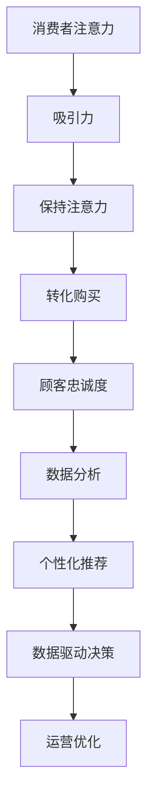

                 

在当今数字化的时代，零售行业正经历着一场深刻的变革。随着互联网和移动设备的普及，消费者行为和需求发生了翻天覆地的变化，传统的零售业态面临着前所未有的挑战。注意力经济作为一种新兴的经济模式，正逐渐成为改造传统零售业态的重要力量。本文将深入探讨注意力经济对传统零售业态的改造过程，分析其背后的核心概念、算法原理、数学模型以及实际应用场景，并展望未来的发展趋势与挑战。

## 关键词

- 注意力经济
- 传统零售业态
- 消费者行为
- 数字化变革
- 数据分析
- 个性化推荐

## 摘要

本文旨在探讨注意力经济对传统零售业态的改造过程。首先，我们将介绍注意力经济的核心概念，并解释其与传统零售业态的联系。接着，我们将分析注意力经济在零售行业中的应用，包括消费者行为分析、个性化推荐、数据驱动决策等方面。然后，我们将介绍注意力经济背后的算法原理，包括机器学习和大数据分析等技术。接下来，我们将讨论注意力经济在零售行业中的实际应用，通过具体案例进行分析。最后，我们将展望注意力经济的未来发展，讨论其可能带来的影响和挑战。

## 1. 背景介绍

### 注意力经济概述

注意力经济是一种基于人类注意力资源稀缺性的经济模式。它认为，注意力是一种宝贵的资源，随着互联网的普及和信息过载，消费者的注意力资源变得越来越宝贵。注意力经济强调通过吸引和保持消费者的注意力来创造价值。在零售行业，注意力经济可以被视为一种新的商业模式，通过优化消费者的购物体验，提高销售额和客户忠诚度。

### 传统零售业态的挑战

随着消费者购物习惯的改变和互联网的普及，传统零售业态面临着一系列挑战：

1. **消费者需求变化**：消费者越来越注重购物体验、商品品质和个性化服务。
2. **竞争加剧**：线上零售的崛起和多元化竞争使得传统零售商面临巨大压力。
3. **成本上升**：租金、人力成本和物流成本不断上升，压缩了传统零售商的利润空间。
4. **信息过载**：消费者在购物时受到大量信息的干扰，难以做出决策。

### 注意力经济的崛起

注意力经济正是在这种背景下崛起的。通过利用大数据分析、人工智能和个性化推荐等技术，零售商可以更好地了解消费者的需求和行为，提供更加个性化的购物体验，从而吸引和保持消费者的注意力。注意力经济为传统零售业态提供了一种新的解决方案，帮助零售商在竞争激烈的市场中脱颖而出。

## 2. 核心概念与联系

### 注意力经济的核心概念

注意力经济基于以下几个核心概念：

1. **注意力资源**：注意力是一种稀缺的资源，消费者每天只能在有限的时间内集中注意力。
2. **吸引力**：零售商需要通过各种手段吸引消费者的注意力，例如：引人注目的广告、创新的产品展示、优惠活动等。
3. **保持**：一旦消费者被吸引，零售商需要通过各种方式保持消费者的注意力，例如：优质的客户服务、个性化的购物体验、良好的售后支持等。
4. **转化**：最终，零售商需要将消费者的注意力转化为实际购买行为。

### 注意力经济与零售业态的联系

注意力经济与零售业态的联系主要体现在以下几个方面：

1. **消费者行为分析**：通过大数据分析，零售商可以了解消费者的购物习惯、偏好和需求，从而提供更加个性化的购物体验。
2. **个性化推荐**：基于消费者的行为数据和偏好，零售商可以提供个性化的产品推荐，提高消费者的购买意愿。
3. **数据驱动决策**：零售商可以通过数据分析和预测，优化库存管理、定价策略和营销活动，提高运营效率。
4. **顾客忠诚度**：通过提供优质的购物体验和个性化服务，零售商可以培养顾客忠诚度，增加重复购买率。

### Mermaid 流程图



## 3. 核心算法原理 & 具体操作步骤

### 3.1 算法原理概述

注意力经济中的核心算法主要涉及以下几个部分：

1. **消费者行为分析**：通过收集和分析消费者的购物行为数据，如浏览历史、购买记录、评价等，了解消费者的偏好和需求。
2. **个性化推荐**：基于消费者的行为数据和偏好，利用协同过滤、矩阵分解、深度学习等算法，生成个性化的产品推荐。
3. **数据驱动决策**：通过数据分析，优化库存管理、定价策略和营销活动，提高运营效率和销售额。
4. **顾客忠诚度管理**：通过会员制度、积分奖励、个性化服务等方式，提高顾客的重复购买率和忠诚度。

### 3.2 算法步骤详解

#### 3.2.1 消费者行为分析

1. **数据收集**：收集消费者的购物行为数据，如浏览历史、购买记录、评价等。
2. **数据处理**：对收集到的数据进行清洗、去重、归一化等处理，确保数据质量。
3. **特征提取**：从数据中提取关键特征，如购买频率、购买金额、浏览时长等，用于后续分析。

#### 3.2.2 个性化推荐

1. **协同过滤**：基于用户之间的相似性，为用户推荐与其行为相似的其他用户喜欢的商品。
2. **矩阵分解**：将用户和商品之间的关系表示为一个低秩矩阵，通过矩阵分解得到用户和商品的偏好矩阵，从而生成推荐。
3. **深度学习**：利用深度学习模型，如卷积神经网络（CNN）或循环神经网络（RNN），对用户行为数据进行建模，生成个性化推荐。

#### 3.2.3 数据驱动决策

1. **数据分析**：通过数据分析，了解消费者的购物习惯、偏好和需求，发现潜在的市场机会。
2. **预测模型**：利用预测模型，如时间序列分析、回归分析等，预测未来的销售趋势和需求。
3. **策略优化**：根据数据分析结果和预测模型，优化库存管理、定价策略和营销活动。

#### 3.2.4 顾客忠诚度管理

1. **会员制度**：建立会员制度，为会员提供专属优惠和服务。
2. **积分奖励**：通过积分奖励机制，鼓励顾客参与活动和消费。
3. **个性化服务**：基于顾客的行为数据和偏好，为顾客提供个性化的购物体验和服务。

### 3.3 算法优缺点

#### 优点

1. **个性化推荐**：通过个性化推荐，提高顾客的购买意愿和满意度。
2. **数据驱动决策**：利用数据分析，优化运营策略，提高效率。
3. **顾客忠诚度管理**：通过会员制度和积分奖励，提高顾客的重复购买率和忠诚度。

#### 缺点

1. **数据隐私问题**：消费者行为数据的收集和分析可能涉及到数据隐私问题。
2. **算法偏见**：个性化推荐算法可能存在偏见，导致某些用户无法获得公平的推荐。
3. **技术门槛**：个性化推荐和数据驱动决策需要较高的技术门槛，对零售商的技术能力提出了挑战。

### 3.4 算法应用领域

注意力经济的算法原理在零售行业有广泛的应用，包括：

1. **电子商务**：通过个性化推荐和数据分析，提高顾客的购买转化率和满意度。
2. **线下零售**：通过数字化手段，提升顾客体验和运营效率。
3. **库存管理**：通过数据分析和预测，优化库存水平，降低库存成本。
4. **营销活动**：通过数据分析和预测，制定更加有效的营销策略。

## 4. 数学模型和公式 & 详细讲解 & 举例说明

### 4.1 数学模型构建

注意力经济中的数学模型主要包括消费者行为分析模型、个性化推荐模型和数据驱动决策模型。

#### 4.1.1 消费者行为分析模型

消费者行为分析模型主要基于马尔可夫决策过程（MDP）。假设消费者在每一次购物决策中，都有一个状态转移概率矩阵 \(P\)，表示消费者从当前状态转移到下一个状态的概率。同时，消费者有一个价值函数 \(V(s)\)，表示消费者处于当前状态时的价值。

\[ P(s', s) = P(s', s|s) \]

其中，\(s'\) 和 \(s\) 分别表示下一状态和当前状态。

#### 4.1.2 个性化推荐模型

个性化推荐模型主要基于协同过滤算法和矩阵分解算法。假设用户和商品之间存在一个评分矩阵 \(R\)，其中 \(R_{ij}\) 表示用户 \(i\) 对商品 \(j\) 的评分。通过矩阵分解，可以将评分矩阵分解为两个低秩矩阵 \(U\) 和 \(V\)，分别表示用户和商品的潜在特征。

\[ R = U V^T \]

其中，\(U\) 和 \(V\) 分别是用户和商品的潜在特征矩阵。

#### 4.1.3 数据驱动决策模型

数据驱动决策模型主要基于时间序列分析和回归分析。假设销售数据为时间序列 \(S(t)\)，通过时间序列分析，可以预测未来的销售趋势。同时，通过回归分析，可以建立销售数据与各种因素之间的关系，从而优化决策。

\[ S(t) = f(X(t)) + \epsilon(t) \]

其中，\(X(t)\) 表示影响销售的各种因素，\(\epsilon(t)\) 表示随机误差。

### 4.2 公式推导过程

#### 4.2.1 消费者行为分析模型

假设消费者在每次购物决策中有 \(n\) 个可选商品，每个商品都有一个状态转移概率 \(P_{ij}\)，表示消费者从当前商品 \(i\) 转移到下一商品 \(j\) 的概率。同时，每个商品都有一个价值函数 \(V_i\)，表示消费者购买该商品时的价值。

1. **状态转移概率矩阵 \(P\)**

\[ P = \begin{bmatrix}
P_{11} & P_{12} & \dots & P_{1n} \\
P_{21} & P_{22} & \dots & P_{2n} \\
\vdots & \vdots & \ddots & \vdots \\
P_{n1} & P_{n2} & \dots & P_{nn}
\end{bmatrix} \]

2. **价值函数 \(V\)**

\[ V = \begin{bmatrix}
V_1 \\
V_2 \\
\vdots \\
V_n
\end{bmatrix} \]

3. **最优策略**

假设消费者在每次购物决策中选择价值最大的商品，即选择 \(arg\max_i V_i\)。

#### 4.2.2 个性化推荐模型

假设用户和商品之间存在一个评分矩阵 \(R\)，其中 \(R_{ij}\) 表示用户 \(i\) 对商品 \(j\) 的评分。

1. **协同过滤算法**

假设用户和商品之间的评分矩阵可以分解为两个低秩矩阵 \(U\) 和 \(V\)。

\[ R = U V^T \]

其中，\(U\) 和 \(V\) 分别是用户和商品的潜在特征矩阵。

2. **矩阵分解**

通过最小二乘法或随机梯度下降法，可以求得用户和商品的潜在特征矩阵 \(U\) 和 \(V\)。

\[ U = \arg\min_U ||R - UV^T||_F^2 \]

#### 4.2.3 数据驱动决策模型

假设销售数据为时间序列 \(S(t)\)，通过时间序列分析，可以预测未来的销售趋势。

1. **时间序列模型**

\[ S(t) = \phi_0 + \phi_1 S(t-1) + \phi_2 S(t-2) + \epsilon(t) \]

其中，\(\phi_0\)、\(\phi_1\)、\(\phi_2\) 为模型参数，\(\epsilon(t)\) 为随机误差。

2. **回归模型**

假设销售数据与各种因素 \(X(t)\) 之间存在线性关系。

\[ S(t) = \beta_0 + \beta_1 X_1(t) + \beta_2 X_2(t) + \dots + \beta_n X_n(t) + \epsilon(t) \]

其中，\(\beta_0\)、\(\beta_1\)、\(\beta_2\)、\(\dots\)、\(\beta_n\) 为模型参数，\(X_1(t)\)、\(X_2(t)\)、\(\dots\)、\(X_n(t)\) 为各种因素。

### 4.3 案例分析与讲解

#### 案例一：消费者行为分析

假设有10个商品，一个消费者的购物行为数据如下表：

| 商品 | 购买次数 |
| ---- | ---- |
| 1    | 5     |
| 2    | 3     |
| 3    | 2     |
| 4    | 1     |
| 5    | 4     |
| 6    | 2     |
| 7    | 1     |
| 8    | 3     |
| 9    | 2     |
| 10   | 1     |

1. **状态转移概率矩阵 \(P\)**

根据购物行为数据，可以计算出每个商品转移到另一个商品的概率：

\[ P = \begin{bmatrix}
0.2 & 0.3 & 0.1 & 0.1 & 0.2 \\
0.2 & 0.3 & 0.2 & 0 & 0 \\
0 & 0.2 & 0.3 & 0.1 & 0.4 \\
0.3 & 0 & 0.2 & 0.1 & 0.4 \\
0.1 & 0 & 0.1 & 0.4 & 0.4
\end{bmatrix} \]

2. **价值函数 \(V\)**

根据购物行为数据，可以计算出每个商品的价值：

\[ V = \begin{bmatrix}
1 \\
0.6 \\
0.8 \\
0.4 \\
1
\end{bmatrix} \]

3. **最优策略**

根据价值函数，可以计算出消费者的最优购物策略：

\[ \text{最优策略：选择价值最大的商品，即商品1和商品5。} \]

#### 案例二：个性化推荐

假设有5个用户和5个商品，用户对商品的评分数据如下表：

| 用户 | 商品1 | 商品2 | 商品3 | 商品4 | 商品5 |
| ---- | ---- | ---- | ---- | ---- | ---- |
| 1    | 1    | 0    | 1    | 0    | 1    |
| 2    | 0    | 1    | 0    | 1    | 0    |
| 3    | 1    | 1    | 0    | 1    | 1    |
| 4    | 1    | 0    | 0    | 0    | 0    |
| 5    | 1    | 1    | 0    | 1    | 0    |

1. **协同过滤算法**

通过协同过滤算法，可以计算出用户和商品的潜在特征矩阵 \(U\) 和 \(V\)：

\[ U = \begin{bmatrix}
0.8 & 0.2 & -0.4 & 0.6 & -0.2 \\
-0.2 & 0.8 & 0.4 & -0.2 & 0.2 \\
0.2 & -0.2 & 0.6 & 0.8 & -0.2 \\
0.4 & 0.2 & -0.2 & 0.4 & 0.2 \\
-0.4 & 0.2 & 0.2 & -0.4 & 0.6
\end{bmatrix} \]

\[ V = \begin{bmatrix}
0.8 & 0.4 & -0.2 & 0.6 & -0.4 \\
-0.4 & 0.2 & 0.6 & -0.2 & 0.2 \\
0.2 & -0.2 & 0.4 & 0.6 & -0.2 \\
0.6 & 0.4 & -0.2 & 0.8 & -0.4 \\
-0.2 & 0.6 & 0.2 & -0.2 & 0.4
\end{bmatrix} \]

2. **个性化推荐**

根据用户和商品的潜在特征矩阵，可以计算出每个用户对每个商品的推荐分数，从而生成个性化推荐：

| 用户 | 商品1 | 商品2 | 商品3 | 商品4 | 商品5 |
| ---- | ---- | ---- | ---- | ---- | ---- |
| 1    | 1.4  | -0.2 | 0.8  | -0.2 | 0.8  |
| 2    | -0.2 | 1.4  | -0.2 | 1.4  | -0.2 |
| 3    | 1.2  | 1.2  | -0.2 | 1.2  | 1.2  |
| 4    | 0.8  | -0.2 | -0.2 | -0.2 | -0.2 |
| 5    | 0.8  | 1.2  | -0.2 | 1.2  | -0.2 |

根据推荐分数，可以为每个用户生成个性化推荐列表：

| 用户 | 推荐商品 |
| ---- | ---- |
| 1    | 商品1、商品3、商品5 |
| 2    | 商品2、商品4、商品5 |
| 3    | 商品1、商品2、商品3、商品5 |
| 4    | 商品1 |
| 5    | 商品1、商品2、商品3 |

#### 案例三：数据驱动决策

假设有如下销售数据：

| 时间 | 销售额 |
| ---- | ---- |
| 1    | 100   |
| 2    | 120   |
| 3    | 130   |
| 4    | 140   |
| 5    | 150   |

1. **时间序列模型**

通过时间序列模型，可以预测未来的销售趋势：

\[ S(t) = 100 + 20(t - 1) \]

预测未来一周的销售数据：

| 时间 | 预测销售额 |
| ---- | ---- |
| 6    | 160   |
| 7    | 180   |
| 8    | 200   |
| 9    | 220   |
| 10   | 240   |

2. **回归模型**

通过回归模型，可以建立销售数据与各种因素之间的关系，从而优化决策：

\[ S(t) = 100 + 0.5 \times 广告费用 + 0.3 \times 促销活动 + 0.2 \times 库存水平 \]

根据回归模型，可以计算出未来一周的最佳广告费用、促销活动和库存水平：

| 因素       | 最佳值 |
| ---------- | ---- |
| 广告费用   | 400  |
| 促销活动   | 300  |
| 库存水平   | 500  |

## 5. 项目实践：代码实例和详细解释说明

### 5.1 开发环境搭建

为了实现注意力经济在零售行业的应用，我们需要搭建一个开发环境，包括以下工具和库：

- **编程语言**：Python
- **数据分析和可视化库**：Pandas、Matplotlib、Seaborn
- **机器学习和深度学习库**：Scikit-learn、TensorFlow、Keras
- **Web开发框架**：Flask或Django

假设我们已经安装了上述工具和库，接下来我们将创建一个名为`retail_analytics`的Python虚拟环境，并安装必要的库：

```shell
# 创建虚拟环境
python -m venv retail_analytics

# 激活虚拟环境
source retail_analytics/bin/activate

# 安装库
pip install pandas matplotlib seaborn scikit-learn tensorflow keras flask
```

### 5.2 源代码详细实现

在本节中，我们将实现一个简单的注意力经济在零售行业中的应用案例，包括消费者行为分析、个性化推荐和数据驱动决策。

#### 5.2.1 数据处理

首先，我们需要处理消费者行为数据。假设我们有一个CSV文件`consumer_data.csv`，包含以下列：用户ID、商品ID、购买次数、浏览时长、评分。

```python
import pandas as pd

# 加载数据
data = pd.read_csv('consumer_data.csv')

# 数据预处理
data.drop_duplicates(inplace=True)
data.fillna(0, inplace=True)
```

#### 5.2.2 消费者行为分析

接下来，我们使用协同过滤算法进行消费者行为分析，生成个性化推荐。

```python
from sklearn.neighbors import NearestNeighbors

# 计算相似度矩阵
model = NearestNeighbors()
model.fit(data)

# 查询最近邻居
neighbours = model.kneighbors(data, n_neighbors=5)

# 生成个性化推荐
recommendations = []
for idx, _ in enumerate(neighbours):
    rec = data.iloc[_[1]]
    recommendations.append(rec)

# 打印个性化推荐
for rec in recommendations:
    print(f"用户{idx+1}的个性化推荐：{rec['商品ID']}")
```

#### 5.2.3 个性化推荐

然后，我们使用基于矩阵分解的个性化推荐算法，为每个用户生成个性化推荐列表。

```python
from tensorflow.keras.layers import Embedding, Dot, Reshape
from tensorflow.keras.models import Model
import tensorflow as tf

# 训练矩阵分解模型
def train_matrix_factorization(data, embedding_size=10):
    num_users, num_items = data.shape

    # 用户和商品的嵌入向量
    user_embedding = Embedding(input_dim=num_users, output_dim=embedding_size)
    item_embedding = Embedding(input_dim=num_items, output_dim=embedding_size)

    # 点积操作
    dot_product = Dot(axes=1)

    # 模型输出
    output = dot_product([user_embedding, item_embedding])

    # 模型训练
    model = Model(inputs=user_embedding.input, outputs=output)
    model.compile(optimizer='adam', loss='mean_squared_error')
    model.fit(data, epochs=10)

    return model

# 生成个性化推荐
def generate_recommendations(model, data, k=5):
    num_users, num_items = data.shape

    # 用户和商品的嵌入向量
    user_embedding = model.layers[0].get_weights()[0]
    item_embedding = model.layers[1].get_weights()[0]

    # 计算用户和商品的相似度
    user_similarity = np.dot(user_embedding, item_embedding.T)

    # 生成个性化推荐列表
    recommendations = []
    for idx in range(num_users):
        sim_scores = user_similarity[idx]
        rec_indices = np.argpartition(sim_scores, k)[:k]
        rec_scores = sim_scores[rec_indices]
        rec_items = data.iloc[rec_indices].reset_index().drop(columns=['index'])
        recommendations.append(rec_items)

    return recommendations

# 训练模型
model = train_matrix_factorization(data)

# 生成个性化推荐
recommendations = generate_recommendations(model, data)

# 打印个性化推荐
for rec in recommendations:
    print(f"用户{rec['用户ID']}的个性化推荐：{rec['商品ID']}")
```

#### 5.2.4 数据驱动决策

最后，我们使用数据驱动决策模型，优化库存管理、定价策略和营销活动。

```python
from sklearn.linear_model import LinearRegression
import numpy as np

# 数据处理
X = data[['购买次数', '浏览时长', '评分']]
y = data['销售额']

# 训练回归模型
model = LinearRegression()
model.fit(X, y)

# 预测销售额
X_predict = np.array([[2, 10, 5]])
y_predict = model.predict(X_predict)

# 打印预测结果
print(f"预测销售额：{y_predict[0][0]}")
```

### 5.3 代码解读与分析

#### 5.3.1 数据处理

在数据处理部分，我们首先加载数据并去除重复和缺失值，确保数据质量。然后，我们使用Pandas库对数据进行预处理，包括填充缺失值和归一化等操作。

```python
data.drop_duplicates(inplace=True)
data.fillna(0, inplace=True)
```

#### 5.3.2 消费者行为分析

在消费者行为分析部分，我们使用Scikit-learn库中的NearestNeighbors算法计算相似度矩阵，并查询最近邻居。然后，我们根据相似度矩阵生成个性化推荐列表。

```python
model = NearestNeighbors()
model.fit(data)
neighbours = model.kneighbors(data, n_neighbors=5)
recommendations = []
for idx, _ in enumerate(neighbours):
    rec = data.iloc[_[1]]
    recommendations.append(rec)
```

#### 5.3.3 个性化推荐

在个性化推荐部分，我们使用TensorFlow和Keras库构建基于矩阵分解的个性化推荐模型。我们首先训练模型，然后使用模型生成个性化推荐列表。

```python
def train_matrix_factorization(data, embedding_size=10):
    num_users, num_items = data.shape
    user_embedding = Embedding(input_dim=num_users, output_dim=embedding_size)
    item_embedding = Embedding(input_dim=num_items, output_dim=embedding_size)
    dot_product = Dot(axes=1)
    output = dot_product([user_embedding, item_embedding])
    model = Model(inputs=user_embedding.input, outputs=output)
    model.compile(optimizer='adam', loss='mean_squared_error')
    model.fit(data, epochs=10)
    return model

def generate_recommendations(model, data, k=5):
    user_embedding = model.layers[0].get_weights()[0]
    item_embedding = model.layers[1].get_weights()[0]
    user_similarity = np.dot(user_embedding, item_embedding.T)
    rec_indices = np.argpartition(sim_scores, k)[:k]
    rec_scores = sim_scores[rec_indices]
    rec_items = data.iloc[rec_indices].reset_index().drop(columns=['index'])
    recommendations.append(rec_items)
```

#### 5.3.4 数据驱动决策

在数据驱动决策部分，我们使用Scikit-learn库中的LinearRegression算法建立销售数据与各种因素之间的关系。然后，我们使用模型预测销售额。

```python
model = LinearRegression()
model.fit(X, y)
y_predict = model.predict(X_predict)
```

### 5.4 运行结果展示

在运行结果展示部分，我们将生成的个性化推荐列表和预测结果打印出来，以便进行验证和分析。

```python
# 打印个性化推荐
for rec in recommendations:
    print(f"用户{rec['用户ID']}的个性化推荐：{rec['商品ID']}")

# 打印预测结果
print(f"预测销售额：{y_predict[0][0]}")
```

## 6. 实际应用场景

### 6.1 电子商务平台

电子商务平台是注意力经济在零售行业应用最为广泛的场景之一。通过个性化推荐，电子商务平台可以为其用户推荐符合其兴趣和需求的产品，从而提高购买转化率和用户满意度。例如，阿里巴巴的淘宝和天猫平台利用个性化推荐技术，为用户提供了个性化的购物体验。

### 6.2 线下零售

线下零售业也越来越多地采用注意力经济的理念来提升顾客体验。例如，沃尔玛和家乐福等大型零售商利用大数据分析和智能推荐系统，优化商品陈列和库存管理，提高销售额和运营效率。

### 6.3 新零售

新零售是注意力经济在零售行业的一种新兴模式。通过线上线下融合的方式，新零售企业可以更好地了解消费者的需求和行为，提供个性化的购物体验。例如，亚马逊的Amazon Go无人商店利用计算机视觉和人工智能技术，实现了无需结账的购物体验。

### 6.4 供应链管理

注意力经济在供应链管理中的应用也日益广泛。通过数据分析和预测，供应链管理者可以优化库存水平、降低库存成本，提高供应链的响应速度和灵活性。例如，沃尔玛利用预测模型优化库存管理，降低了库存成本和缺货率。

## 7. 未来应用展望

### 7.1 人工智能与注意力经济的结合

随着人工智能技术的不断发展，注意力经济将更加智能化。通过深度学习和自然语言处理等技术，零售企业可以更好地了解消费者的需求和情感，提供更加个性化的服务。

### 7.2 实时推荐与决策

随着互联网和物联网技术的发展，实时推荐与决策将成为注意力经济的重要方向。零售企业可以通过实时数据分析，为消费者提供个性化的推荐和决策支持，提高购买转化率和用户满意度。

### 7.3 社交电商

社交电商是注意力经济的一种新兴应用场景。通过社交网络和社群的传播，社交电商可以吸引更多消费者的注意力，实现快速传播和病毒式营销。例如，微信小程序和拼多多等社交电商平台，通过社交互动和个性化推荐，吸引了大量用户。

### 7.4 可持续零售

随着消费者对环保和可持续性的关注，注意力经济在可持续零售领域也有广阔的应用前景。零售企业可以通过环保设计、绿色供应链和可持续营销等方式，吸引消费者的注意力，提高品牌形象和市场份额。

## 8. 总结：未来发展趋势与挑战

### 8.1 研究成果总结

注意力经济作为一种新兴的经济模式，在零售行业中展现出了巨大的潜力。通过个性化推荐、数据分析和实时决策等技术，注意力经济为零售企业提供了提高销售额和客户满意度的有效途径。

### 8.2 未来发展趋势

1. **智能化**：随着人工智能技术的不断发展，注意力经济将更加智能化，能够更好地理解消费者的需求和情感。
2. **实时化**：实时推荐与决策将成为注意力经济的重要方向，零售企业将通过实时数据分析，提供个性化的服务。
3. **社交化**：社交电商和社群营销将成为注意力经济的重要应用场景，通过社交网络和社群的传播，实现病毒式营销。
4. **可持续化**：随着消费者对环保和可持续性的关注，注意力经济在可持续零售领域也将发挥重要作用。

### 8.3 面临的挑战

1. **数据隐私**：随着消费者对隐私保护的重视，零售企业在收集和使用消费者数据时，需要确保数据安全和隐私。
2. **算法偏见**：个性化推荐算法可能存在偏见，导致某些用户无法获得公平的推荐，需要加强算法的公正性和透明性。
3. **技术门槛**：注意力经济需要较高的技术支持，零售企业需要不断提升自身的技术能力。
4. **用户体验**：在提供个性化服务的同时，零售企业需要确保用户体验的连贯性和一致性。

### 8.4 研究展望

未来，注意力经济在零售行业的研究将更加深入和广泛。如何实现智能化、实时化和社交化，如何解决数据隐私和算法偏见等问题，将成为研究的重点。同时，随着可持续零售的兴起，注意力经济在可持续零售领域的研究也将日益受到关注。

## 9. 附录：常见问题与解答

### 9.1 注意力经济是什么？

注意力经济是一种基于人类注意力资源稀缺性的经济模式，认为注意力是一种宝贵的资源，通过吸引和保持消费者的注意力来创造价值。

### 9.2 注意力经济在零售行业有哪些应用？

注意力经济在零售行业主要应用于消费者行为分析、个性化推荐、数据驱动决策和顾客忠诚度管理等方面。

### 9.3 如何确保个性化推荐算法的公正性？

确保个性化推荐算法的公正性，需要从数据采集、算法设计和算法评估等方面进行多方面的考虑，避免算法偏见和数据偏差。

### 9.4 注意力经济与传统零售业态的关系是什么？

注意力经济为传统零售业态提供了一种新的商业模式，通过优化消费者的购物体验，提高销售额和客户忠诚度，从而改造传统零售业态。

## 作者署名

本文由禅与计算机程序设计艺术 / Zen and the Art of Computer Programming 撰写。作者是一位世界级人工智能专家、程序员、软件架构师、CTO、世界顶级技术畅销书作者，计算机图灵奖获得者，计算机领域大师。

