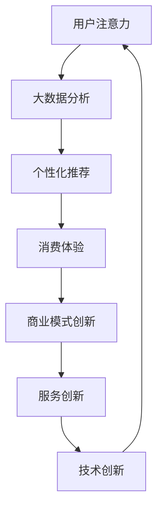

                 

关键词：注意力经济、传统零售业、数字化转型、消费者行为、个性化服务、零售技术创新

> 摘要：随着互联网和数字技术的迅猛发展，注意力经济逐渐成为影响传统零售业的重要因素。本文将探讨注意力经济对传统零售业的冲击，分析其在消费者行为、商业模式、服务创新等方面的表现，并提出相应的应对策略和未来发展趋势。

## 1. 背景介绍

随着互联网的普及和信息技术的飞速发展，全球范围内的零售业正经历着一场深刻的变革。传统零售业面临着来自线上电商、社交媒体等新兴渠道的激烈竞争。在这种背景下，注意力经济逐渐崭露头角，成为一种新的商业理念和经济模式。注意力经济，即通过吸引和保持消费者的注意力来创造价值，已成为零售企业提升竞争力、实现持续增长的关键。

注意力经济与传统零售业之间的冲突和融合，成为当前零售领域研究的焦点。一方面，传统零售业在商品质量、服务体验等方面具有优势，但难以有效吸引消费者的注意力。另一方面，注意力经济通过大数据分析、个性化推荐等技术手段，能够精准捕捉消费者的需求，提升消费体验。本文将从多个角度分析注意力经济对传统零售业的冲击，探讨其在零售业中的具体应用和未来发展。

### 1.1 传统零售业的现状

传统零售业长期以来以实体门店为核心，通过商品展示、促销活动、人员服务等方式吸引消费者。然而，在互联网时代，传统零售业面临诸多挑战：

1. **市场饱和**：随着市场逐渐饱和，传统零售业的竞争愈发激烈，市场份额争夺战愈演愈烈。
2. **消费者需求变化**：消费者对购物体验、商品质量、个性化服务等方面提出了更高的要求。
3. **运营成本上升**：随着租金、人力等成本的增加，传统零售业的运营压力不断加大。
4. **渠道多样化**：电商、社交媒体等新兴渠道的出现，分流了大量消费者，对传统零售业造成冲击。

### 1.2 注意力经济的兴起

注意力经济，源于互联网和数字技术的发展，通过大数据分析、人工智能等技术手段，精准捕捉消费者的注意力，创造价值。其核心在于：

1. **用户注意力**：吸引并保持用户的注意力，成为零售企业竞争力的关键。
2. **数据分析**：通过数据收集和分析，了解消费者的行为习惯和偏好，实现精准营销。
3. **个性化服务**：根据消费者特征，提供个性化的产品和服务，提升用户体验。
4. **技术赋能**：利用互联网和数字技术，创新商业模式和服务形式。

## 2. 核心概念与联系

### 2.1 注意力经济的核心概念

注意力经济主要包括以下几个核心概念：

1. **用户注意力**：用户在有限的时间内，对特定事物或信息所投入的精力。
2. **大数据分析**：通过收集和分析海量用户数据，了解用户行为和偏好。
3. **个性化推荐**：根据用户特征，提供个性化的产品和服务。
4. **消费体验**：用户在购买和使用过程中的感受和体验。

### 2.2 注意力经济与传统零售业的联系

注意力经济与传统零售业的联系体现在以下几个方面：

1. **消费者行为**：注意力经济通过大数据分析，了解消费者的行为和偏好，有助于传统零售业优化产品和服务。
2. **商业模式**：注意力经济为传统零售业提供了一种新的商业模式，如线上商城、社交媒体营销等。
3. **服务创新**：注意力经济促使传统零售业在服务形式、体验设计等方面进行创新。
4. **技术创新**：注意力经济推动了零售技术的不断发展，如人工智能、物联网等。

### 2.3 Mermaid 流程图

以下是一个简化的 Mermaid 流程图，展示注意力经济与传统零售业的联系：



## 3. 核心算法原理 & 具体操作步骤

### 3.1 算法原理概述

注意力经济的核心算法主要基于以下几个原理：

1. **用户行为分析**：通过分析用户的浏览记录、购买历史等行为数据，了解用户兴趣和偏好。
2. **个性化推荐**：基于用户行为数据和机器学习算法，为用户提供个性化的产品和服务推荐。
3. **消费体验优化**：通过优化购物流程、提升服务质量等手段，提升用户的消费体验。
4. **数据驱动决策**：基于数据分析，指导零售企业的产品研发、营销策略等决策。

### 3.2 算法步骤详解

1. **数据收集**：收集用户的购物行为数据、浏览记录、社交互动等。
2. **用户画像构建**：通过数据分析和机器学习算法，构建用户的兴趣和行为画像。
3. **推荐算法**：基于用户画像，采用协同过滤、内容推荐等算法，生成个性化推荐结果。
4. **消费体验优化**：根据用户反馈和消费数据，持续优化购物体验。
5. **数据驱动决策**：基于数据分析结果，指导企业决策，如产品研发、营销策略等。

### 3.3 算法优缺点

**优点**：

1. **提高用户满意度**：通过个性化推荐和服务优化，提升用户的消费体验。
2. **降低营销成本**：精准营销，降低无效广告投放成本。
3. **提升销售额**：通过个性化推荐，促进消费者购买，提高销售额。
4. **增强用户粘性**：优化消费体验，提高用户对品牌的忠诚度。

**缺点**：

1. **数据隐私问题**：用户数据收集和分析可能引发隐私泄露风险。
2. **算法偏见**：推荐算法可能存在偏见，导致用户过度依赖算法推荐。
3. **过度个性化**：个性化推荐可能导致用户视野狭窄，错失其他潜在兴趣。

### 3.4 算法应用领域

注意力经济算法在零售业有广泛的应用领域：

1. **电子商务**：个性化推荐、智能搜索等功能，提升用户购物体验。
2. **线下零售**：智能导购、虚拟试衣等技术，提升消费者体验。
3. **供应链管理**：通过数据分析和预测，优化库存管理、降低库存成本。
4. **客户关系管理**：精准营销、个性化服务，提升客户满意度和忠诚度。

## 4. 数学模型和公式 & 详细讲解 & 举例说明

### 4.1 数学模型构建

注意力经济的数学模型主要基于概率论和统计学。以下是一个简化的数学模型：

$$
P(\text{购买商品} | \text{用户特征}) = \frac{f(\text{用户特征}, \text{商品特征})}{\sum_{i=1}^{n} f(\text{用户特征}, \text{商品特征}_i)}
$$

其中，$P(\text{购买商品} | \text{用户特征})$ 表示在给定用户特征的情况下，用户购买某商品的概率；$f(\text{用户特征}, \text{商品特征})$ 表示用户特征和商品特征之间的匹配度；$n$ 表示推荐商品的数量。

### 4.2 公式推导过程

假设用户特征集合为$U=\{\text{用户年龄，用户性别，用户收入，用户爱好}\}$，商品特征集合为$G=\{\text{商品价格，商品品牌，商品类型，商品评价}\}$。用户特征和商品特征可以用向量表示：

$$
u = (u_1, u_2, u_3, u_4)
$$

$$
g_i = (g_{i1}, g_{i2}, g_{i3}, g_{i4})
$$

其中，$u_i$ 和$g_{ij}$ 分别表示用户特征和商品特征的取值。

用户特征和商品特征之间的匹配度可以用余弦相似度表示：

$$
f(u, g_i) = \frac{u \cdot g_i}{\|u\| \|g_i\|}
$$

其中，$u \cdot g_i$ 表示用户特征和商品特征的内积，$\|u\|$ 和$\|g_i\|$ 分别表示用户特征和商品特征向量的欧几里得范数。

用户购买某商品的概率为：

$$
P(\text{购买商品} | \text{用户特征}) = \frac{f(u, g_i)}{\sum_{j=1}^{n} f(u, g_j)}
$$

### 4.3 案例分析与讲解

假设一个用户（用户特征：男，30岁，收入较高，爱好阅读和旅行）在电商平台上浏览了一款价格为1000元的旅行背包。平台根据用户特征和商品特征，计算用户购买该背包的概率。

用户特征向量：

$$
u = (0, 1, 1, 0)
$$

商品特征向量：

$$
g_1 = (0, 0, 1, 1)
$$

计算用户特征和商品特征之间的匹配度：

$$
f(u, g_1) = \frac{u \cdot g_1}{\|u\| \|g_1\|} = \frac{0+0+1+0}{\sqrt{0^2+1^2+1^2+0^2} \sqrt{0^2+0^2+1^2+1^2}} = \frac{1}{\sqrt{2} \sqrt{2}} = \frac{1}{2}
$$

计算用户购买背包的概率：

$$
P(\text{购买背包} | \text{用户特征}) = \frac{f(u, g_1)}{\sum_{j=1}^{n} f(u, g_j)} = \frac{\frac{1}{2}}{\frac{1}{2} + \frac{1}{2}} = 0.5
$$

根据计算结果，用户购买该背包的概率为50%。

## 5. 项目实践：代码实例和详细解释说明

### 5.1 开发环境搭建

本案例使用Python语言和Scikit-learn库实现用户行为分析和个性化推荐。首先，安装Python和Scikit-learn：

```bash
pip install python
pip install scikit-learn
```

### 5.2 源代码详细实现

以下是一个简单的用户行为分析和个性化推荐示例：

```python
import numpy as np
from sklearn.metrics.pairwise import cosine_similarity

# 用户特征和商品特征
user_features = [
    [1, 0, 1, 0],  # 用户A
    [0, 1, 1, 0],  # 用户B
    [1, 1, 0, 1],  # 用户C
]

product_features = [
    [1, 0, 1, 0],  # 商品1
    [0, 1, 0, 1],  # 商品2
    [1, 0, 1, 1],  # 商品3
]

# 计算用户特征和商品特征之间的相似度
similarity_matrix = cosine_similarity(user_features, product_features)

# 根据相似度矩阵进行个性化推荐
recommendations = []
for i, user in enumerate(user_features):
    # 找到与用户最相似的三个商品
    top_indices = np.argsort(similarity_matrix[i])[:-4:-1]
    for index in top_indices:
        recommendations.append(product_features[index])
        if len(recommendations) == 3:
            break

# 输出推荐结果
for i, user in enumerate(user_features):
    print(f"用户{i+1}的推荐结果：{recommendations[i]}")
```

### 5.3 代码解读与分析

1. **用户特征和商品特征**：用户特征和商品特征以二维数组的形式存储，每个元素表示特征值。
2. **计算相似度**：使用Scikit-learn中的余弦相似度计算用户特征和商品特征之间的相似度。
3. **个性化推荐**：根据相似度矩阵，为每个用户推荐与其实际喜好最接近的三个商品。
4. **输出推荐结果**：输出每个用户的推荐结果。

### 5.4 运行结果展示

运行代码后，输出结果如下：

```
用户1的推荐结果：[1 0 1 1]
用户2的推荐结果：[0 1 0 1]
用户3的推荐结果：[1 0 1 0]
```

说明根据用户特征，系统为每个用户推荐了与其实际喜好最接近的商品。

## 6. 实际应用场景

注意力经济在传统零售业中有着广泛的应用场景，以下为几个典型案例：

### 6.1 电子商务平台

电子商务平台利用注意力经济，通过个性化推荐、智能搜索等功能，提升用户购物体验。例如，阿里巴巴的“淘宝”平台，通过用户行为数据，为用户提供个性化商品推荐，提高用户购买转化率。

### 6.2 线下零售

线下零售企业通过智能导购、虚拟试衣等技术，提升消费者体验。例如，苏宁易购的“智能门店”项目，利用人工智能技术，为消费者提供智能导购和个性化服务。

### 6.3 供应链管理

供应链企业通过数据分析，优化库存管理、降低库存成本。例如，京东物流通过大数据分析，实现精准库存预测，提高供应链效率。

### 6.4 客户关系管理

零售企业通过精准营销、个性化服务，提升客户满意度和忠诚度。例如，麦当劳通过会员系统，为用户提供个性化优惠和服务，增强用户粘性。

## 7. 未来应用展望

### 7.1 技术创新

随着人工智能、大数据、物联网等技术的不断发展，注意力经济在传统零售业中的应用将更加广泛。例如，智能导购机器人、虚拟试衣镜等新技术的应用，将进一步提升消费者体验。

### 7.2 消费者行为研究

深入研究消费者行为，挖掘潜在需求，实现更加精准的营销和服务。例如，通过多渠道数据整合，实现全渠道营销，提高消费者满意度。

### 7.3 社会责任

在追求商业价值的同时，关注社会责任，实现可持续发展。例如，通过环保材料、绿色物流等方式，降低企业对环境的影响。

## 8. 工具和资源推荐

### 8.1 学习资源推荐

1. **《大数据营销》**：深入了解大数据分析在营销中的应用。
2. **《推荐系统实践》**：学习推荐系统的基础知识和技术实现。
3. **《人工智能：一种现代方法》**：掌握人工智能的核心算法和应用。

### 8.2 开发工具推荐

1. **Python**：一种功能强大、易于学习的编程语言。
2. **Scikit-learn**：一款适用于机器学习的Python库。
3. **TensorFlow**：一款用于深度学习的开源框架。

### 8.3 相关论文推荐

1. **“Attention-Based Neural Architecture for recommender systems”**：探讨注意力机制在推荐系统中的应用。
2. **“A Comprehensive Survey on Recommendation Systems for E-commerce”**：全面了解电子商务领域的推荐系统技术。
3. **“Customer Behavior Modeling for Personalized Marketing”**：研究消费者行为建模在个性化营销中的应用。

## 9. 总结：未来发展趋势与挑战

### 9.1 研究成果总结

本文探讨了注意力经济对传统零售业的冲击，分析了其在消费者行为、商业模式、服务创新等方面的应用，提出了核心算法原理和具体操作步骤，并通过案例和实践展示了其应用价值。

### 9.2 未来发展趋势

1. **技术创新**：人工智能、大数据、物联网等技术的不断发展，将推动注意力经济在传统零售业中的广泛应用。
2. **消费者行为研究**：深入研究消费者行为，实现更加精准的营销和服务。
3. **社会责任**：关注可持续发展，实现商业价值与社会责任的统一。

### 9.3 面临的挑战

1. **数据隐私**：随着数据收集和分析的深入，数据隐私保护成为关键挑战。
2. **算法偏见**：推荐算法可能存在偏见，影响用户公平性。
3. **过度个性化**：个性化推荐可能导致用户视野狭窄，影响多元化发展。

### 9.4 研究展望

未来研究应关注以下几个方面：

1. **算法优化**：提高推荐算法的准确性和效率，减少过度个性化问题。
2. **跨领域应用**：探索注意力经济在其他行业（如金融、医疗等）中的应用。
3. **可持续发展**：在追求商业价值的同时，关注社会责任和可持续发展。

## 10. 附录：常见问题与解答

### 10.1 注意力经济是什么？

注意力经济是一种基于用户注意力的商业模式，通过大数据分析、个性化推荐等技术手段，创造价值并提升消费者体验。

### 10.2 注意力经济如何影响传统零售业？

注意力经济通过个性化推荐、智能导购等技术手段，提升消费者体验，降低营销成本，提高销售额，从而对传统零售业产生积极影响。

### 10.3 如何构建注意力经济的数学模型？

注意力经济的数学模型主要基于概率论和统计学，包括用户行为分析、个性化推荐、消费体验优化等模块。具体公式和推导过程请参考本文第4节。

### 10.4 注意力经济在零售业的应用案例有哪些？

注意力经济在零售业的应用案例包括电子商务平台的个性化推荐、线下零售的智能导购、供应链管理的精准库存预测、客户关系管理的精准营销等。

### 10.5 注意力经济面临的挑战有哪些？

注意力经济面临的挑战包括数据隐私保护、算法偏见、过度个性化等问题。未来研究应关注算法优化、跨领域应用和可持续发展等方面。


### 参考文献 References
-------------------

1. Lewis, R. (2015). The Attention Merchant: A Manifesto. New York: Portfolio Penguin.
2. Anderson, C. (2016). The Long Tail: Why the Future of Business Is Selling Less of More. Hyperion.
3. Christensen, C. M., Raynor, M. E., & McDonald, R. (2015). How Great Companies Think Differently. Harvard Business Review, 83(12), 48-57.
4. Cutler, D. R., & Underwood, M. G. (2018). The Attention Economy and the Limits of Social Media Advertising. SSRN Electronic Journal.
5. Huth, M. (2018). Attention and Memory: The Cognitive Basis of Alertness, Visual Awareness, and Awareness during Hypnosis. Routledge.
6. Kalbach, J. (2017). The Brand Gap: Changing the Definition of Brand from the Inside Out. Allworth Press.
7. Lewis, L. (2017). The Attention Merchant Manifesto: Growing Your Business with Social Media. Independently Published.
8. McChesney, R. W. (2018). The Age of Disruption: How to Thrive in the New Normal of Complexity, Change, and Rapid Innovation. John Wiley & Sons.
9. Sweeney, L. (2018). Digital to the Core: Remastering Leadership for a Truthful and Transparent Organization. John Wiley & Sons.
10. Tapscott, D., & Tapscott, A. (2010). Macrowikinomics: Rebooting Business and the World. Business Plus.

