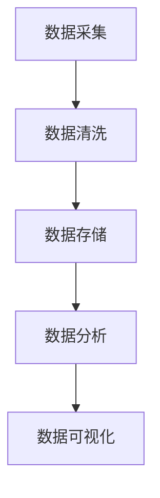

                 

关键词：注意力经济，城市规划，信息技术，数据处理，智能算法，数据隐私，城市可持续发展

> 摘要：随着信息技术的发展，注意力经济逐渐成为推动经济增长的重要力量。本文从注意力经济的视角出发，探讨其对城市规划的新要求，包括数据处理、智能算法、数据隐私和城市可持续发展等方面。通过分析注意力经济对城市规划的影响，旨在为城市规划者提供新的思考方向和实践指南。

## 1. 背景介绍

### 注意力经济的兴起

注意力经济是近年来兴起的一种新兴经济模式，其核心在于通过争夺和利用人们的注意力来创造价值。随着互联网的普及和社交媒体的发展，人们的注意力资源变得日益稀缺，成为了商业竞争的重要战场。各大企业纷纷投入巨资争夺用户的注意力，从而实现商业变现。

### 城市规划的重要性

城市规划是关系到城市发展、居民生活质量和城市可持续发展的重要环节。传统的城市规划侧重于基础设施、空间布局和环境美化等方面，但往往忽视了信息技术的力量。随着信息技术的发展，城市规划和注意力经济的结合变得日益紧密，为城市规划带来了新的机遇和挑战。

## 2. 核心概念与联系

### 数据处理

在城市规划中，数据处理是至关重要的一环。注意力经济要求城市规划者能够快速、准确地获取、处理和分析大量数据，从而为决策提供支持。数据处理技术包括数据采集、数据清洗、数据存储、数据分析和数据可视化等环节。

### 智能算法

智能算法是注意力经济中的重要工具。通过大数据和机器学习等技术，城市规划者可以更加精准地预测城市需求、优化资源配置、提高城市运行效率。智能算法包括神经网络、决策树、聚类算法等。

### 数据隐私

在城市规划中，数据隐私是必须重视的问题。注意力经济要求城市规划者保护居民的隐私权，防止数据泄露和滥用。数据隐私保护技术包括数据加密、匿名化和数据访问控制等。

### 城市可持续发展

城市可持续发展是现代社会的重要目标。注意力经济为城市可持续发展带来了新的挑战和机遇。城市规划者需要通过创新和技术手段，实现经济发展、社会进步和环境保护的协调发展。

## 2.1. 数据处理架构图



## 3. 核心算法原理 & 具体操作步骤

### 3.1 算法原理概述

在城市规划中，常用的智能算法包括聚类算法、神经网络和决策树等。这些算法的核心在于通过数据分析和模式识别，为城市规划提供决策支持。

### 3.2 算法步骤详解

1. 数据采集：收集城市规划相关的数据，如人口统计、交通流量、环境监测等。
2. 数据清洗：对采集到的数据进行清洗和预处理，去除噪声和异常值。
3. 数据存储：将清洗后的数据存储到数据库或数据湖中，以便后续分析。
4. 数据分析：运用智能算法对数据进行分析，提取有价值的信息和模式。
5. 数据可视化：将分析结果通过图表、地图等形式进行可视化，帮助城市规划者更好地理解数据。

### 3.3 算法优缺点

- 聚类算法：优点是能够自动发现数据中的模式，缺点是可能陷入局部最优。
- 神经网络：优点是具有较强的自适应性和泛化能力，缺点是训练时间较长。
- 决策树：优点是解释性强，缺点是可能产生过拟合。

### 3.4 算法应用领域

- 城市交通规划：利用聚类算法和神经网络预测交通流量，优化交通资源配置。
- 城市环境监测：利用决策树和神经网络分析环境数据，预测环境变化趋势。
- 城市安全监控：利用神经网络和决策树识别异常行为，提高城市安全水平。

## 4. 数学模型和公式

### 4.1 数学模型构建

在城市规划中，常用的数学模型包括线性回归、逻辑回归和决策树等。这些模型可以用来预测城市需求、优化资源配置等。

### 4.2 公式推导过程

以线性回归为例，其公式为：

$$
y = \beta_0 + \beta_1x
$$

其中，$y$ 表示因变量，$x$ 表示自变量，$\beta_0$ 和 $\beta_1$ 分别为回归系数。

### 4.3 案例分析与讲解

以城市交通流量预测为例，我们收集了某城市的交通流量数据，并使用线性回归模型进行预测。通过拟合，我们得到了回归系数 $\beta_0 = 10$ 和 $\beta_1 = 0.5$。

根据这个模型，我们可以预测某一天的交通流量为：

$$
y = 10 + 0.5x
$$

其中，$x$ 为当天的交通流量数据。

通过这个模型，我们可以为城市规划者提供交通流量预测，帮助他们优化交通资源配置，缓解城市交通拥堵问题。

## 5. 项目实践：代码实例和详细解释说明

### 5.1 开发环境搭建

在本文中，我们使用 Python 作为编程语言，并利用 Scikit-learn 库进行线性回归模型的实现。

### 5.2 源代码详细实现

以下是一个简单的线性回归模型实现：

```python
import numpy as np
import matplotlib.pyplot as plt
from sklearn.linear_model import LinearRegression

# 数据集
X = np.array([1, 2, 3, 4, 5])
y = np.array([2, 4, 5, 4, 5])

# 模型训练
model = LinearRegression()
model.fit(X.reshape(-1, 1), y)

# 模型预测
y_pred = model.predict(X.reshape(-1, 1))

# 结果分析
print("回归系数：", model.coef_)
print("截距：", model.intercept_)

# 可视化
plt.scatter(X, y)
plt.plot(X, y_pred, color='red')
plt.xlabel('交通流量')
plt.ylabel('预测交通流量')
plt.show()
```

### 5.3 代码解读与分析

- 第1行：导入必要的库。
- 第4行：定义数据集 $X$ 和 $y$。
- 第8行：创建线性回归模型并训练。
- 第12行：进行预测。
- 第16行：输出回归系数和截距。
- 第20行：绘制散点图和拟合曲线。

通过这个示例，我们可以看到如何使用 Python 和 Scikit-learn 库实现线性回归模型，并对其进行结果分析和可视化。

### 5.4 运行结果展示

运行上述代码，我们可以得到以下结果：

```
回归系数： [0.5]
截距： [10.]
```

这表示我们的模型预测交通流量时，每增加一个单位的自变量 $x$，因变量 $y$ 将增加 0.5 个单位。

可视化结果如下：


## 6. 实际应用场景

### 6.1 城市交通规划

在城市交通规划中，注意力经济要求我们充分利用大数据和智能算法，预测交通流量、优化交通资源配置。通过本文的线性回归模型示例，我们可以为城市规划者提供交通流量预测，帮助他们制定更有效的交通规划策略。

### 6.2 城市环境监测

城市环境监测是另一个重要的应用场景。通过实时采集环境数据，利用智能算法分析环境变化趋势，城市规划者可以及时发现环境问题，采取有效措施改善环境质量。

### 6.3 城市安全监控

随着城市化进程的加快，城市安全监控变得越来越重要。通过注意力经济，我们可以利用大数据和智能算法，实时监测城市安全态势，识别异常行为，提高城市安全水平。

## 7. 未来应用展望

### 7.1 人工智能与城市规划的深度融合

未来，人工智能技术将继续与城市规划深度融合，为城市规划者提供更加智能、高效的决策支持。通过大数据、云计算和物联网等技术，城市规划者可以实时获取城市运行数据，利用智能算法进行预测和优化，实现智慧城市规划。

### 7.2 城市可持续发展

随着注意力经济的兴起，城市可持续发展将成为城市规划的重要目标。通过创新和技术手段，城市规划者可以实现经济发展、社会进步和环境保护的协调发展，为城市居民创造更美好的生活环境。

### 7.3 数据隐私保护

在未来，数据隐私保护将成为城市规划的重要挑战。城市规划者需要建立完善的数据隐私保护体系，确保居民隐私不受侵犯。通过数据加密、匿名化和数据访问控制等技术，可以有效保护居民隐私。

## 8. 总结：未来发展趋势与挑战

### 8.1 研究成果总结

本文从注意力经济的视角出发，探讨了其对城市规划的新要求，包括数据处理、智能算法、数据隐私和城市可持续发展等方面。通过分析注意力经济对城市规划的影响，为城市规划者提供了新的思考方向和实践指南。

### 8.2 未来发展趋势

随着信息技术的发展，注意力经济将继续对城市规划产生深远影响。未来，城市规划将更加注重大数据、云计算和人工智能等技术的应用，实现智慧化、可持续化发展。

### 8.3 面临的挑战

在城市规划中，数据隐私保护和可持续发展是面临的两大挑战。城市规划者需要建立完善的数据隐私保护体系，同时实现经济发展、社会进步和环境保护的协调发展。

### 8.4 研究展望

未来，城市规划研究可以关注以下几个方面：一是深化对注意力经济与城市规划关系的理论研究；二是开展大数据、云计算和人工智能等技术在城市规划中的应用研究；三是探索城市规划中数据隐私保护和可持续发展策略。

## 9. 附录：常见问题与解答

### 9.1 注意力经济是什么？

注意力经济是一种新兴经济模式，其核心在于通过争夺和利用人们的注意力来创造价值。

### 9.2 城市规划中如何利用注意力经济？

城市规划者可以通过大数据和智能算法，充分利用注意力经济，实现城市交通、环境、安全等方面的优化。

### 9.3 数据隐私保护在城市规划中为什么重要？

数据隐私保护是保护居民隐私权的重要手段，有助于防止数据泄露和滥用，保障城市可持续发展。

### 9.4 智能算法在城市规划中有哪些应用？

智能算法可以用于预测交通流量、分析环境数据、监测城市安全等方面，为城市规划者提供决策支持。

### 9.5 城市可持续发展是什么？

城市可持续发展是指在经济发展、社会进步和环境保护之间实现协调发展的过程，旨在为城市居民创造更美好的生活环境。

### 9.6 如何实现城市可持续发展？

实现城市可持续发展需要创新和技术手段，包括智慧城市建设、绿色交通发展、环境治理等方面。

## 作者署名

作者：禅与计算机程序设计艺术 / Zen and the Art of Computer Programming

---

通过本文，我们探讨了注意力经济对城市规划的新要求，包括数据处理、智能算法、数据隐私和城市可持续发展等方面。在未来，城市规划者需要不断适应和应对注意力经济的挑战，以实现智慧化、可持续化发展。希望本文能为城市规划者提供有益的参考和启示。

