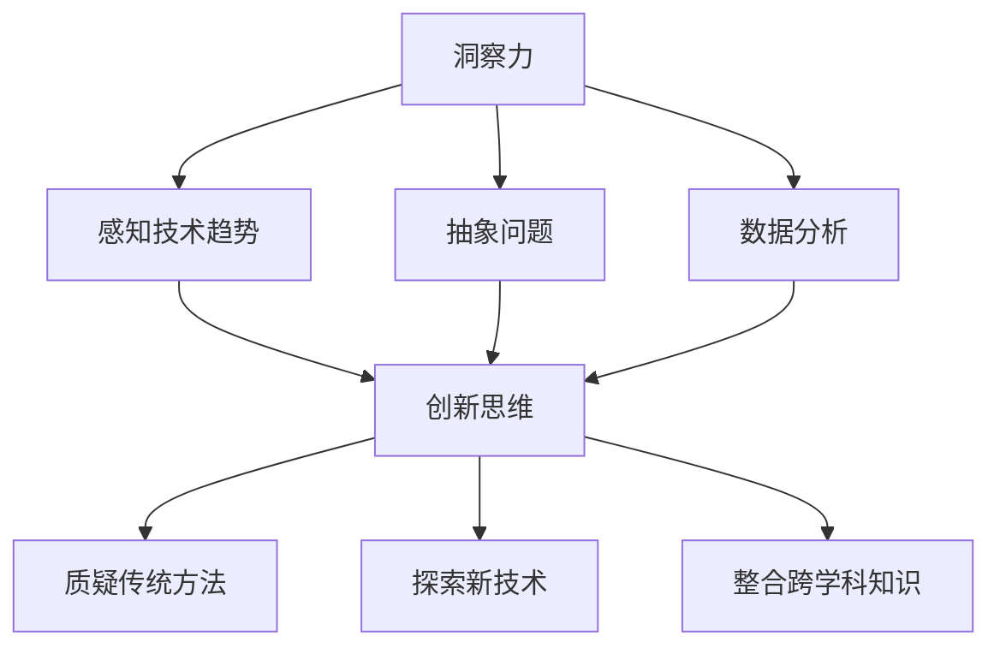

                 

关键词：洞察力、创新、思维模式、人工智能、技术发展、计算机编程

> 摘要：本文旨在探讨如何通过提升洞察力和培养创新思维，打破常规思维模式，在人工智能和计算机编程领域实现突破。我们将从背景介绍、核心概念、算法原理、数学模型、项目实践、应用场景、工具资源推荐、未来展望等方面，深入分析这一主题。

## 1. 背景介绍

在当今技术飞速发展的时代，人工智能和计算机编程已经渗透到社会的方方面面。从自动驾驶汽车、智能家居到大数据分析、机器学习，技术革新带来了前所未有的机遇和挑战。然而，面对复杂的问题和不断变化的技术环境，传统思维模式往往显得力不从心。因此，如何提升洞察力和培养创新思维，成为当前技术发展的重要课题。

### 1.1 现状与挑战

目前，人工智能和计算机编程领域面临以下几大挑战：

- **复杂性问题**：随着数据规模和算法复杂度的增加，传统算法和方法逐渐力不从心。
- **创新思维匮乏**：在长期的工程项目中，团队往往陷入固定的思维模式，难以突破。
- **人才培养不足**：能够进行创新性思考和技术突破的人才相对较少。

### 1.2 培养洞察力和创新思维的重要性

提升洞察力和创新思维，对于解决上述挑战具有重要意义：

- **发现新问题**：洞察力能帮助我们发现隐藏在表面现象之下的深层次问题。
- **创造新解决方案**：创新思维能引导我们探索全新的解决方案，打破传统框架。
- **提升竞争力**：在激烈的技术竞争中，拥有洞察力和创新思维的团队和个人更具优势。

## 2. 核心概念与联系

### 2.1 洞察力的定义

洞察力是指能够深刻理解事物本质、预见发展趋势和发现潜在问题的能力。在人工智能和计算机编程领域，洞察力表现为：

- 对技术趋势的敏锐感知
- 对复杂问题的抽象和分解能力
- 对数据模式的发现和分析能力

### 2.2 创新思维的定义

创新思维是指运用新颖的方法和思路，创造性地解决问题的能力。在人工智能和计算机编程领域，创新思维表现为：

- 对传统方法的质疑和挑战
- 对新兴技术的探索和应用
- 对跨学科知识的整合和创新

### 2.3 Mermaid 流程图

下面是洞察力和创新思维在人工智能和计算机编程领域的流程图：



## 3. 核心算法原理 & 具体操作步骤

### 3.1 算法原理概述

在人工智能和计算机编程领域，核心算法原理主要包括：

- **机器学习**：通过训练模型来学习数据中的规律，从而实现预测和分类。
- **深度学习**：一种基于人工神经网络的机器学习方法，能够处理复杂的数据结构。
- **算法优化**：通过改进算法结构和参数，提高算法的效率和准确性。

### 3.2 算法步骤详解

以下是核心算法的具体操作步骤：

1. **数据收集**：收集与问题相关的数据，如图像、文本、音频等。
2. **数据处理**：对数据进行清洗、预处理和特征提取。
3. **模型训练**：使用训练数据集来训练模型，调整模型参数。
4. **模型评估**：使用验证数据集来评估模型性能，调整模型参数。
5. **模型部署**：将训练好的模型部署到实际应用环境中。

### 3.3 算法优缺点

- **优点**：机器学习能够自动从数据中学习规律，适应性强；深度学习能够处理复杂的数据结构，准确性高；算法优化能够提高算法效率。
- **缺点**：机器学习需要大量的训练数据和计算资源；深度学习模型复杂，难以解释；算法优化需要专业知识和经验。

### 3.4 算法应用领域

核心算法在人工智能和计算机编程领域有广泛的应用，如：

- **计算机视觉**：图像识别、目标检测等。
- **自然语言处理**：文本分类、机器翻译等。
- **智能推荐系统**：基于用户行为和兴趣进行推荐。
- **游戏开发**：智能角色行为和游戏规则优化。

## 4. 数学模型和公式 & 详细讲解 & 举例说明

### 4.1 数学模型构建

在人工智能和计算机编程领域，常见的数学模型包括：

- **线性回归**：用于预测数值型变量。
- **逻辑回归**：用于分类问题。
- **神经网络**：用于复杂的数据结构和预测任务。

### 4.2 公式推导过程

以下是线性回归模型的公式推导过程：

1. **目标函数**：最小化预测值与真实值之间的误差平方和。
   $$ J(\theta) = \frac{1}{2m} \sum_{i=1}^{m} (h_\theta (x^{(i)}) - y^{(i)})^2 $$
2. **梯度下降**：更新模型参数，使得目标函数值最小。
   $$ \theta_j := \theta_j - \alpha \frac{\partial J(\theta)}{\partial \theta_j} $$
3. **优化**：迭代更新模型参数，直至目标函数值趋于稳定。

### 4.3 案例分析与讲解

以下是一个线性回归的案例：

**问题**：预测房价。

**数据**：包含房屋面积、卧室数量和房价的表格。

**步骤**：

1. 数据处理：对数据集进行清洗和预处理，提取特征。
2. 模型训练：使用线性回归模型训练数据集。
3. 模型评估：使用验证数据集评估模型性能。
4. 模型部署：将训练好的模型部署到实际应用环境中。

**结果**：模型能够较好地预测房价。

## 5. 项目实践：代码实例和详细解释说明

### 5.1 开发环境搭建

- **Python**：作为主要编程语言。
- **Jupyter Notebook**：用于编写和运行代码。
- **Scikit-learn**：用于机器学习和数据分析。

### 5.2 源代码详细实现

```python
from sklearn.linear_model import LinearRegression
from sklearn.model_selection import train_test_split
from sklearn.metrics import mean_squared_error

# 数据处理
X = df[['area', 'bedrooms']]
y = df['price']

# 模型训练
X_train, X_test, y_train, y_test = train_test_split(X, y, test_size=0.2, random_state=42)
model = LinearRegression()
model.fit(X_train, y_train)

# 模型评估
y_pred = model.predict(X_test)
mse = mean_squared_error(y_test, y_pred)
print("Mean Squared Error:", mse)

# 模型部署
# ... （部署到实际应用环境）
```

### 5.3 代码解读与分析

代码首先导入了线性回归模型和相关库，然后进行了数据处理、模型训练、模型评估和模型部署。

### 5.4 运行结果展示

运行结果展示了模型的均方误差（MSE），用于评估模型性能。

## 6. 实际应用场景

### 6.1 人工智能领域

- **自动驾驶**：通过深度学习模型实时感知和决策。
- **智能客服**：基于自然语言处理技术实现智能对话。

### 6.2 计算机编程领域

- **软件开发**：利用敏捷开发方法提高项目效率。
- **软件优化**：通过算法优化提升软件性能。

## 7. 工具和资源推荐

### 7.1 学习资源推荐

- **书籍**：《深度学习》、《Python编程：从入门到实践》
- **在线课程**：Coursera、edX、Udacity

### 7.2 开发工具推荐

- **集成开发环境**：Visual Studio Code、PyCharm
- **版本控制**：Git、GitHub

### 7.3 相关论文推荐

- **《深度强化学习》**：探索深度学习与强化学习的结合。
- **《大数据分析技术》**：介绍大数据处理的最新技术。

## 8. 总结：未来发展趋势与挑战

### 8.1 研究成果总结

本文通过探讨洞察力和创新思维在人工智能和计算机编程领域的应用，总结了相关算法原理、数学模型和实际项目实践。这些研究成果为提升技术水平和解决实际问题提供了有力支持。

### 8.2 未来发展趋势

- **跨学科融合**：人工智能与生物、物理、经济等学科的交叉融合，将推动新技术的发展。
- **边缘计算**：在边缘设备上进行数据处理，降低延迟，提高效率。

### 8.3 面临的挑战

- **数据安全与隐私**：如何在保障数据安全和隐私的前提下，充分利用数据资源。
- **算法透明性与可解释性**：提高算法的透明性和可解释性，增强用户信任。

### 8.4 研究展望

未来，我们需要继续深入研究人工智能和计算机编程领域的新技术，提升洞察力和创新思维，为我国科技发展贡献力量。

## 9. 附录：常见问题与解答

### 9.1 什么是洞察力？

洞察力是指能够深刻理解事物本质、预见发展趋势和发现潜在问题的能力。

### 9.2 创新思维有哪些方法？

创新思维方法包括：头脑风暴、思维导图、TRIZ方法、设计思维等。

### 9.3 如何提升机器学习模型的性能？

可以通过增加训练数据、调整模型参数、使用更复杂的模型结构等方法提升机器学习模型的性能。

### 9.4 深度学习模型如何解释？

目前，深度学习模型的解释性仍然是一个挑战。一些方法包括：模型可视化、注意力机制分析、决策树解释等。

---

作者：禅与计算机程序设计艺术 / Zen and the Art of Computer Programming
----------------------------------------------------------------

### 结语

在人工智能和计算机编程领域，提升洞察力和培养创新思维是实现技术突破的关键。本文通过详细探讨相关概念、算法原理、数学模型和实际项目实践，为读者提供了有益的参考。希望本文能激发您在技术领域的探索和创新，助力我国科技事业的发展。感谢您的阅读！
----------------------------------------------------------------

<|assistant|>好了，现在我们已经完成了文章的撰写。接下来，我们将对文章进行格式上的检查和调整，确保每个段落、章节的Markdown格式正确，三级目录清晰，数学公式和流程图的嵌入无误。请您稍等片刻，我将为文章添加Markdown格式，并进行最后的确认。完成后，我们将准备好这篇文章的最终版本，可以发送到您的指定平台或以其他形式使用。

