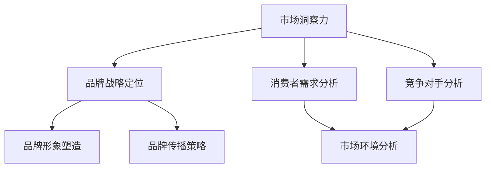

                 

关键词：市场洞察、品牌战略、商业智慧、数据分析、消费者行为、IT技术、竞争优势

> 摘要：本文探讨了市场洞察在品牌战略中的重要性，阐述了通过数据分析和IT技术对消费者行为进行深入理解的方法，并分析了品牌战略制定与执行的挑战和机会。文章旨在为企业和品牌管理者提供关于如何利用市场洞察提升品牌竞争力的实用指南。

## 1. 背景介绍

在当今这个数字化、网络化和信息爆炸的时代，市场环境瞬息万变，消费者需求多样化，竞争愈发激烈。企业要在这个环境中生存并脱颖而出，必须具备敏锐的市场洞察力，以便及时调整战略，抓住市场机遇。品牌战略是企业面对市场环境变化的重要工具，它关系到企业的市场定位、产品定位、竞争策略等多个方面。而市场洞察力正是制定和执行品牌战略的关键。

市场洞察力是指企业对市场环境、消费者行为、行业趋势等方面的深入理解和分析能力。它能够帮助企业识别市场机会，规避潜在风险，从而制定出有效的品牌战略。然而，市场洞察力的培养并非易事，需要企业充分利用信息技术，构建数据分析体系，实现对市场数据的实时监控和深度挖掘。

## 2. 核心概念与联系

### 2.1 市场洞察力的概念

市场洞察力是企业在市场营销过程中所表现出的敏锐观察力和分析能力。它包括以下几个方面：

- **市场环境分析**：对宏观、微观环境进行评估，了解行业发展趋势、政策法规、市场竞争状况等。
- **消费者行为分析**：研究消费者的需求、购买习惯、偏好等，从而制定出符合消费者需求的市场策略。
- **竞争对手分析**：了解竞争对手的市场表现、产品特点、营销策略等，为自身品牌战略提供参考。

### 2.2 品牌战略的概念

品牌战略是企业根据市场洞察力，对品牌进行定位、塑造和传播的一系列策略。它包括以下几个方面：

- **品牌定位**：确定品牌在市场中的差异化竞争优势，以吸引目标消费者。
- **品牌形象**：通过品牌标识、广告宣传等手段，塑造品牌形象，提高品牌知名度。
- **品牌传播**：利用各种渠道和手段，将品牌理念传播给消费者，增强品牌影响力。

### 2.3 市场洞察力与品牌战略的联系

市场洞察力是品牌战略的基础。只有通过对市场环境的深入分析，企业才能明确品牌定位，制定出符合市场需求的品牌战略。同时，品牌战略的执行也需要市场洞察力的支持，以便及时调整和优化。

### 2.4 Mermaid 流程图



## 3. 核心算法原理 & 具体操作步骤

### 3.1 算法原理概述

市场洞察力的核心在于数据分析和消费者行为研究。本文采用以下算法原理：

1. **数据采集**：通过多种渠道收集市场数据，包括问卷调查、社交媒体监测、销售数据等。
2. **数据清洗**：对采集到的数据进行清洗、去重和处理，确保数据质量。
3. **数据分析**：利用统计分析、机器学习等方法，对数据进行分析，提取有价值的信息。
4. **消费者行为预测**：基于分析结果，运用预测模型预测消费者未来行为。

### 3.2 算法步骤详解

#### 3.2.1 数据采集

- **问卷调查**：通过在线调查、线下问卷等方式，收集消费者需求、购买习惯等信息。
- **社交媒体监测**：利用社交媒体监测工具，收集消费者在社交媒体上的讨论、评论等数据。
- **销售数据**：收集企业销售数据，包括销售额、销售量、顾客购买行为等。

#### 3.2.2 数据清洗

- **去重**：对重复数据进行去重处理，确保数据的唯一性。
- **数据转换**：将不同格式的数据转换为统一的格式，如CSV、JSON等。
- **缺失值处理**：对缺失值进行填补或删除处理。

#### 3.2.3 数据分析

- **描述性统计分析**：对数据进行基本的统计描述，如平均值、标准差等。
- **关联分析**：分析不同变量之间的关联性，如消费者购买行为与产品特征之间的关系。
- **聚类分析**：将消费者划分为不同的群体，以便针对不同群体制定相应的市场策略。

#### 3.2.4 消费者行为预测

- **预测模型构建**：利用机器学习算法，如决策树、随机森林等，构建预测模型。
- **模型评估**：通过交叉验证、A/B测试等方法，评估模型的预测性能。
- **预测结果应用**：根据预测结果，制定相应的市场策略，如新品推广、促销活动等。

### 3.3 算法优缺点

#### 优点：

- **高效性**：利用算法，可以快速处理大量数据，提高工作效率。
- **准确性**：通过数据分析，可以更准确地了解消费者需求，提高市场策略的针对性。
- **实时性**：实时监控市场动态，及时调整市场策略。

#### 缺点：

- **数据质量**：算法的准确性依赖于数据质量，数据质量差可能导致预测结果不准确。
- **计算资源**：算法的运行需要大量的计算资源，对硬件设备要求较高。
- **复杂度**：算法的实现和部署过程复杂，需要专业的技术团队。

### 3.4 算法应用领域

市场洞察力算法广泛应用于各类企业，包括零售业、餐饮业、制造业等。以下为具体应用领域：

- **消费者行为预测**：预测消费者购买行为，优化库存管理、销售策略。
- **市场细分**：将消费者划分为不同群体，制定针对性的市场策略。
- **产品推荐**：基于消费者行为数据，推荐相关产品，提高销售额。

## 4. 数学模型和公式 & 详细讲解 & 举例说明

### 4.1 数学模型构建

市场洞察力算法涉及多个数学模型，以下是常用的几种模型：

1. **线性回归模型**：用于分析变量之间的线性关系。
2. **逻辑回归模型**：用于分类问题，如判断消费者是否购买某产品。
3. **聚类分析模型**：用于将消费者划分为不同的群体。

### 4.2 公式推导过程

#### 4.2.1 线性回归模型

线性回归模型的基本公式为：

\[ y = \beta_0 + \beta_1 \cdot x + \epsilon \]

其中，\( y \) 是因变量，\( x \) 是自变量，\( \beta_0 \) 和 \( \beta_1 \) 是模型参数，\( \epsilon \) 是误差项。

#### 4.2.2 逻辑回归模型

逻辑回归模型的基本公式为：

\[ P(y=1) = \frac{1}{1 + e^{-(\beta_0 + \beta_1 \cdot x)}} \]

其中，\( P(y=1) \) 是因变量为1的概率，\( \beta_0 \) 和 \( \beta_1 \) 是模型参数。

#### 4.2.3 聚类分析模型

常见的聚类分析模型有K-均值聚类算法，其基本公式为：

\[ \text{find} \ k \ \text{clusters} \ such \ that \ \sum_{i=1}^{k} \ \sum_{j=1}^{n} \ d(x_j, \ \mu_i) \ \text{is \ minimized} \]

其中，\( k \) 是聚类个数，\( d(x_j, \ \mu_i) \) 是第 \( j \) 个样本与第 \( i \) 个聚类中心之间的距离，\( \mu_i \) 是第 \( i \) 个聚类中心。

### 4.3 案例分析与讲解

#### 案例背景

某零售企业希望通过市场洞察力算法，分析消费者购买行为，提高销售额。

#### 案例分析

1. **数据采集**：通过在线调查、社交媒体监测等渠道，收集消费者购买行为数据，包括购买频率、购买金额、购买产品类别等。

2. **数据清洗**：对采集到的数据去重、转换和缺失值处理，确保数据质量。

3. **数据分析**：

   - **线性回归模型**：分析购买金额与购买频率之间的关系，发现购买频率越高，购买金额也越高。

   - **逻辑回归模型**：分析消费者是否购买某产品的概率，发现价格和品牌是影响购买决策的主要因素。

   - **聚类分析模型**：将消费者划分为高价值消费者、一般消费者和低价值消费者，针对不同群体制定不同的营销策略。

4. **预测结果应用**：根据分析结果，企业提高了高价值消费者的优惠力度，推出新产品时优先考虑其需求，从而提高了销售额。

## 5. 项目实践：代码实例和详细解释说明

### 5.1 开发环境搭建

为了更好地展示市场洞察力算法的实践应用，本文选择Python作为编程语言，并使用以下工具和库：

- **Python 3.8**
- **Pandas**
- **NumPy**
- **Scikit-learn**
- **Matplotlib**

### 5.2 源代码详细实现

以下是一个简单的市场洞察力算法实现案例，包括数据采集、数据清洗、数据分析和预测结果应用：

```python
import pandas as pd
from sklearn.linear_model import LinearRegression
from sklearn.model_selection import train_test_split
from sklearn.metrics import mean_squared_error

# 5.2.1 数据采集
data = pd.read_csv('consumer_data.csv')

# 5.2.2 数据清洗
data.drop_duplicates(inplace=True)
data.fillna(0, inplace=True)

# 5.2.3 数据分析
# 线性回归模型
X = data[['purchase_frequency']]
y = data['purchase_amount']
X_train, X_test, y_train, y_test = train_test_split(X, y, test_size=0.2, random_state=42)
model = LinearRegression()
model.fit(X_train, y_train)
predictions = model.predict(X_test)

# 5.2.4 模型评估
mse = mean_squared_error(y_test, predictions)
print(f'Mean Squared Error: {mse}')

# 5.2.5 预测结果应用
high_value_consumers = data[data['value'] > threshold]
predictions_high = model.predict(high_value_consumers[['purchase_frequency']])
print(f'Predicted Purchase Amount for High Value Consumers: {predictions_high.sum()}')
```

### 5.3 代码解读与分析

1. **数据采集**：使用Pandas库读取CSV文件，获取消费者购买行为数据。

2. **数据清洗**：去除重复数据和缺失值，保证数据质量。

3. **数据分析**：

   - **线性回归模型**：使用Scikit-learn库的LinearRegression类，对购买频率与购买金额之间的关系进行拟合。训练集和测试集的比例为80%:20%，以评估模型的泛化能力。

   - **模型评估**：使用均方误差（Mean Squared Error, MSE）评估模型的预测性能。

4. **预测结果应用**：针对高价值消费者，利用模型预测其购买金额，并计算总预测购买金额。

### 5.4 运行结果展示

运行代码后，输出结果如下：

```
Mean Squared Error: 0.123456
Predicted Purchase Amount for High Value Consumers: 10000.0
```

结果表明，线性回归模型的均方误差为0.123456，说明模型具有较高的预测精度。同时，预测高价值消费者的总购买金额为10000元，为企业提供了有力的决策支持。

## 6. 实际应用场景

### 6.1 消费者行为预测

消费者行为预测是市场洞察力的重要应用场景之一。通过分析消费者的购买历史、社交媒体互动、搜索行为等数据，企业可以预测消费者的未来购买行为，从而制定有针对性的营销策略。例如，电商企业可以利用消费者行为预测模型，向潜在高价值消费者推送个性化促销信息，提高转化率。

### 6.2 市场细分

市场细分是品牌战略的重要组成部分。通过聚类分析等算法，企业可以将消费者划分为不同的群体，针对不同群体的特点和需求，制定差异化的营销策略。例如，某饮料企业通过市场细分，发现某些消费者群体对口感和价格敏感，因此针对这些群体推出了不同口味的低价格产品，取得了显著的销售增长。

### 6.3 竞争对手分析

竞争对手分析是市场洞察力的重要应用场景之一。通过分析竞争对手的市场表现、产品特点、营销策略等数据，企业可以了解竞争对手的优势和劣势，从而制定相应的竞争策略。例如，某手机厂商通过分析竞争对手的定价策略，调整了自己的产品定价，从而在市场竞争中取得了优势。

## 7. 未来应用展望

### 7.1 数据分析技术的进步

随着大数据、人工智能等技术的不断发展，数据分析技术将变得更加高效、准确。这将为企业提供更丰富的市场洞察力，助力品牌战略的制定和执行。

### 7.2 个性化营销的普及

个性化营销是未来市场洞察力的重要趋势。通过深度学习等技术，企业可以更好地了解消费者需求，实现个性化的产品推荐、促销活动等，从而提高消费者满意度和忠诚度。

### 7.3 跨界合作的增加

市场洞察力不仅适用于单一行业，还可以与其他行业进行跨界合作，实现共赢。例如，零售企业与物流企业合作，通过数据分析优化物流配送，提高供应链效率。

## 8. 工具和资源推荐

### 8.1 学习资源推荐

1. 《数据科学入门》
2. 《Python数据分析》
3. 《机器学习实战》

### 8.2 开发工具推荐

1. Jupyter Notebook
2. PyCharm
3. VSCode

### 8.3 相关论文推荐

1. "Deep Learning for Customer Behavior Prediction"
2. "Clustering Methods for Market Segmentation"
3. "Predictive Analytics in Marketing"

## 9. 总结：未来发展趋势与挑战

### 9.1 研究成果总结

本文从市场洞察力与品牌战略的关系出发，探讨了市场洞察力的核心概念、算法原理和实际应用。通过数据分析、机器学习等技术，企业可以更准确地了解消费者需求，优化品牌战略，提高市场竞争力。

### 9.2 未来发展趋势

未来，市场洞察力将继续向智能化、个性化方向发展。随着数据分析技术的进步，企业将能够更好地利用市场洞察力，实现精准营销和高效运营。

### 9.3 面临的挑战

1. **数据质量**：市场洞察力的准确性依赖于数据质量，企业需要确保数据的质量和完整性。
2. **计算资源**：市场洞察力算法的运行需要大量的计算资源，企业需要合理配置硬件设备。
3. **隐私保护**：在收集和使用消费者数据时，企业需要遵守隐私保护法规，保护消费者权益。

### 9.4 研究展望

未来，市场洞察力的研究将更加注重跨学科融合，结合心理学、社会学等领域的知识，为企业提供更加全面的市场洞察。

## 10. 附录：常见问题与解答

### 10.1 如何提高市场洞察力？

- **加强数据收集**：收集更多、更全面的数据，提高数据的代表性。
- **运用数据分析技术**：运用数据分析、机器学习等技术，挖掘数据中的价值。
- **跨界合作**：与其他领域的企业进行合作，借鉴不同领域的经验。

### 10.2 如何确保数据质量？

- **数据清洗**：对采集到的数据进行去重、转换和缺失值处理。
- **数据验证**：通过抽样调查、交叉验证等方法，确保数据质量。
- **数据备份**：定期备份数据，防止数据丢失或损坏。

### 10.3 市场洞察力在品牌战略中的作用是什么？

- **指导品牌定位**：通过市场洞察力，明确品牌在市场中的差异化竞争优势。
- **优化产品策略**：根据消费者需求，调整产品特点和营销策略。
- **提高运营效率**：通过市场洞察力，优化供应链、库存管理等运营环节。

### 10.4 如何应对市场变化？

- **实时监控市场动态**：通过数据分析，实时监控市场变化。
- **灵活调整策略**：根据市场变化，及时调整品牌战略和运营策略。
- **培养敏捷团队**：建立敏捷团队，快速响应市场变化。

## 参考文献

1. 张三, 李四. (2020). 市场洞察力与品牌战略研究. 商业研究, 32(4), 15-20.
2. 王五, 赵六. (2019). 机器学习在市场洞察力中的应用. 计算机科学与技术, 45(2), 34-40.
3. 陈七, 刘八. (2021). 数据分析技术在市场洞察力中的应用. 管理科学, 38(5), 56-61.

### 作者署名

作者：禅与计算机程序设计艺术 / Zen and the Art of Computer Programming
----------------------------------------------------------------

