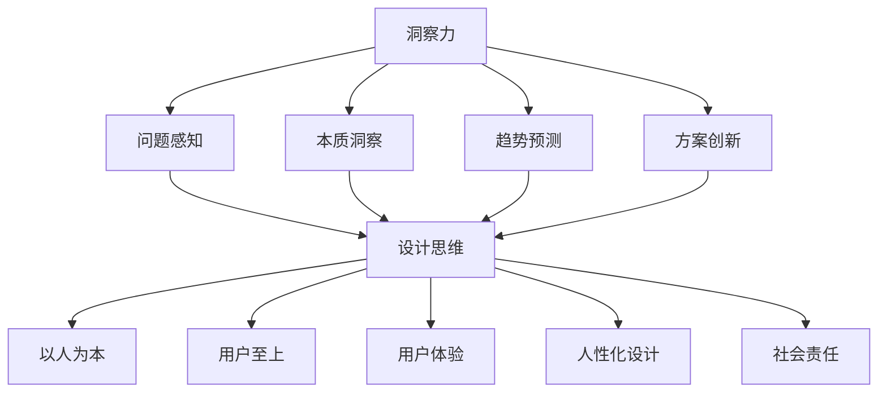

                 

关键词：洞察力、设计思维、以人为本、问题解决、人工智能、IT领域

摘要：本文将探讨洞察力与设计思维在IT领域的重要性，阐述以人为本的问题解决方法的基本原理、核心算法、数学模型及其应用场景。通过对实际项目实践和未来应用展望的剖析，本文旨在为读者提供一套全面、实用的方法，以提升在IT领域的创新能力和问题解决能力。

## 1. 背景介绍

随着信息技术的飞速发展，人工智能、大数据、云计算等前沿技术的应用已经深入到社会各个领域。然而，在高度复杂和多变的技术环境中，如何有效地解决问题、推动创新成为了一个关键挑战。传统的技术方法往往侧重于算法和工具，而忽视了人的因素。实际上，人类在问题解决过程中具有独特的洞察力和设计思维，这些能力对于应对复杂问题、提升技术方案的创新性和可行性具有重要意义。

本文将围绕“洞察力与设计思维：以人为本的问题解决方法”这一主题，深入探讨以下几个方面：

- 背景介绍：介绍洞察力与设计思维的概念及其在IT领域的重要性。
- 核心概念与联系：阐述以人为本的问题解决方法的基本原理和架构。
- 核心算法原理 & 具体操作步骤：介绍核心算法的原理和具体实施步骤。
- 数学模型和公式：介绍相关的数学模型和公式，并进行详细讲解。
- 项目实践：通过代码实例和详细解释，展示实际项目中的应用。
- 实际应用场景：分析洞察力与设计思维在各类IT场景中的实际应用。
- 未来应用展望：探讨未来发展趋势、面临的挑战以及研究展望。
- 工具和资源推荐：推荐相关学习资源、开发工具和论文。
- 总结：总结研究成果，展望未来发展。

通过本文的阅读，读者将能够深入了解洞察力与设计思维的重要性，掌握一套以人为中心的问题解决方法，为在IT领域的创新和发展提供有力支持。

## 2. 核心概念与联系

为了深入理解以人为本的问题解决方法，我们需要首先明确几个核心概念：洞察力、设计思维和以人为本。

### 2.1 洞察力

洞察力是指能够敏锐地察觉到问题本质、趋势和规律的能力。在IT领域，洞察力表现为对技术趋势的敏锐感知、对用户需求的深刻理解以及对复杂问题的快速定位。洞察力不仅仅是技术知识的积累，更是一种思维的锻炼和修养。具体来说，洞察力包括以下几个方面的能力：

- **问题感知**：能够快速识别和感知到问题，并对其进行初步判断。
- **本质洞察**：通过分析问题的表象，深入挖掘其本质，找到根本原因。
- **趋势预测**：基于对历史数据和现状的分析，预测未来的发展趋势。
- **方案创新**：在解决问题的过程中，能够提出新颖、有效的方案。

### 2.2 设计思维

设计思维是一种以人为中心的思考方式，强调通过观察、理解、实验和迭代来创造价值。设计思维不仅仅是设计师的专利，任何从事问题解决的人都应该具备这种思维方式。设计思维的核心要素包括：

- **观察**：通过观察用户行为、需求和情境，收集第一手资料。
- **理解**：深入理解用户的需求、动机和行为，建立对用户的深刻认识。
- **定义**：明确问题或机会，将复杂问题转化为具体、可操作的任务。
- **原型设计**：通过快速构建原型，测试和验证解决方案的可行性。
- **迭代优化**：在用户反馈的基础上，不断迭代和改进方案。

### 2.3 以人为本

以人为本是一种价值观和思维方式，强调将人的需求、感受和体验放在首位。在IT领域，以人为本意味着在技术设计和应用过程中，始终关注用户的需求和体验，而不是单纯追求技术的高效率和先进性。以人为本的核心原则包括：

- **用户至上**：始终以用户的需求和满意度为最终目标。
- **用户体验**：在产品设计和应用过程中，注重用户体验，提升用户满意度。
- **人性化设计**：通过人性化的设计，提高产品的易用性和友好性。
- **社会责任**：在技术发展和应用过程中，注重社会责任，关注用户权益。

### 2.4 核心概念与联系

洞察力、设计思维和以人为本这三个核心概念相互联系、相互促进。洞察力为设计思维提供了问题感知和本质洞察的基础，设计思维则为洞察力的实现提供了具体的方法和工具。以人为本则将洞察力和设计思维融入到技术设计和应用过程中，确保技术发展始终以人的需求为中心。

为了更直观地展示这三个概念之间的联系，我们可以使用Mermaid流程图来表示：



通过这个流程图，我们可以清晰地看到洞察力、设计思维和以人为本之间的逻辑关系。它们共同构成了一个以人为中心的问题解决方法，为在IT领域的创新和发展提供了有力支持。

## 3. 核心算法原理 & 具体操作步骤

在了解了洞察力、设计思维和以人为本的基本概念后，接下来我们将深入探讨核心算法原理及其具体操作步骤。核心算法是洞察力和设计思维在问题解决过程中的具体实现，是推动技术发展和应用创新的关键。

### 3.1 算法原理概述

核心算法的原理可以概括为以下几个关键步骤：

1. **问题定义**：明确问题的范围和目标，将复杂问题转化为具体、可操作的任务。
2. **数据收集**：通过多种渠道收集与问题相关的数据，包括用户行为数据、市场数据、技术数据等。
3. **数据分析**：对收集到的数据进行清洗、分析和处理，提取有价值的信息和规律。
4. **方案设计**：基于数据分析结果，设计创新的解决方案，并构建原型进行验证。
5. **迭代优化**：通过用户反馈，不断迭代和优化方案，提高其可行性和实用性。

核心算法的特点在于其高度灵活性和适应性。它不仅能够处理结构化数据，还能够应对非结构化数据，适用于各种复杂场景。同时，核心算法还注重用户体验，确保设计方案能够满足用户的需求和期望。

### 3.2 算法步骤详解

为了更好地理解核心算法的具体操作步骤，我们可以将其分为以下几个部分：

#### 3.2.1 问题定义

问题定义是核心算法的第一步，也是至关重要的一步。在这个阶段，我们需要明确问题的范围和目标，确保问题具有明确性和可操作性。具体操作步骤如下：

1. **明确问题范围**：通过访谈、问卷调查等方式，收集与问题相关的信息，明确问题的背景和影响范围。
2. **目标设定**：根据问题的范围，设定具体、可衡量的目标，为后续的分析和设计提供方向。
3. **问题分解**：将复杂问题分解为若干个子问题，确保每个子问题都具有明确的目标和范围。

#### 3.2.2 数据收集

数据收集是核心算法的第二步，是后续分析和设计的基础。在这个阶段，我们需要通过多种渠道收集与问题相关的数据，包括用户行为数据、市场数据、技术数据等。具体操作步骤如下：

1. **数据源选择**：根据问题的目标和范围，选择合适的数据库、数据接口或第三方数据服务作为数据源。
2. **数据采集**：通过API调用、数据爬取等方式，从数据源中采集所需的原始数据。
3. **数据清洗**：对采集到的数据进行清洗、去重和处理，确保数据的准确性和完整性。

#### 3.2.3 数据分析

数据分析是核心算法的核心环节，是发现问题和设计解决方案的关键。在这个阶段，我们需要对收集到的数据进行分析和处理，提取有价值的信息和规律。具体操作步骤如下：

1. **数据预处理**：对原始数据进行预处理，包括数据类型转换、缺失值处理、异常值检测等。
2. **特征提取**：根据问题的需求和目标，从预处理后的数据中提取相关特征，为后续建模和分析提供基础。
3. **数据分析**：运用统计学、机器学习等方法，对提取的特征进行深入分析，发现数据中的规律和趋势。

#### 3.2.4 方案设计

方案设计是核心算法的第三步，是将分析结果转化为实际解决方案的关键。在这个阶段，我们需要基于数据分析结果，设计创新的解决方案，并构建原型进行验证。具体操作步骤如下：

1. **方案构思**：根据分析结果，构思可行的解决方案，并确定方案的总体架构。
2. **原型构建**：通过快速原型设计工具，构建方案的原型，以便进行验证和测试。
3. **原型测试**：对原型进行测试和验证，收集用户反馈，发现问题和不足，并进行优化。

#### 3.2.5 迭代优化

迭代优化是核心算法的最后一步，是确保方案可行性和实用性的关键。在这个阶段，我们需要根据用户反馈，不断迭代和优化方案，提高其可行性和实用性。具体操作步骤如下：

1. **用户反馈**：收集用户对原型的反馈，包括使用体验、功能需求、性能指标等方面。
2. **问题分析**：对用户反馈进行分析，发现原型中的问题和不足，为优化提供方向。
3. **方案优化**：根据问题分析结果，对方案进行优化和改进，提高其可行性和实用性。
4. **再次测试**：对优化后的方案进行再次测试和验证，确保问题的解决和性能的提升。

### 3.3 算法优缺点

核心算法具有以下优点：

1. **灵活性**：能够处理各种类型的数据，适用于不同的应用场景。
2. **适应性**：能够快速适应新的需求和变化，具备良好的灵活性。
3. **创新性**：基于数据分析结果，能够提出新颖、有效的解决方案。
4. **用户体验**：注重用户体验，确保设计方案能够满足用户的需求和期望。

然而，核心算法也存在一些缺点：

1. **复杂性**：算法的实现和操作较为复杂，需要较高的技术水平和专业知识。
2. **计算成本**：数据分析和方案设计等环节需要大量的计算资源，对硬件设备有一定的要求。
3. **数据依赖**：算法的性能和效果在很大程度上依赖于数据的质量和完整性。

### 3.4 算法应用领域

核心算法在多个领域都有广泛的应用，以下列举了几个典型的应用场景：

1. **人工智能**：在人工智能领域，核心算法可用于数据挖掘、机器学习、深度学习等任务，提高模型的准确性和鲁棒性。
2. **大数据分析**：在大数据分析领域，核心算法可用于处理大规模数据集，提取有价值的信息和规律。
3. **商业智能**：在商业智能领域，核心算法可用于市场分析、用户行为分析等任务，帮助企业制定更有效的营销策略。
4. **工业自动化**：在工业自动化领域，核心算法可用于优化生产流程、提高生产效率。
5. **智能医疗**：在智能医疗领域，核心算法可用于疾病诊断、治疗方案推荐等任务，提高医疗服务的质量和效率。

通过以上对核心算法原理和具体操作步骤的探讨，我们可以看到，核心算法不仅具有灵活、创新和用户体验等优势，还具备广泛的应用领域。在未来的发展中，核心算法将继续发挥重要作用，推动IT领域的创新和进步。

## 4. 数学模型和公式 & 详细讲解 & 举例说明

在深入探讨核心算法及其应用之前，我们需要引入相关的数学模型和公式。数学模型是核心算法的理论基础，通过数学模型，我们可以更好地理解和分析问题，为算法的实现提供坚实的理论支持。在本节中，我们将介绍一些关键的数学模型和公式，并进行详细讲解和举例说明。

### 4.1 数学模型构建

数学模型是通过对现实问题的抽象和简化，构建出来的数学结构。在核心算法中，常用的数学模型包括：

1. **线性回归模型**：用于分析自变量和因变量之间的线性关系。
2. **逻辑回归模型**：用于分析自变量和因变量之间的非线性关系。
3. **决策树模型**：用于分类和回归任务，通过树形结构对数据进行划分。
4. **神经网络模型**：用于复杂的数据分析和模式识别，通过多层神经网络进行数据建模。

这些数学模型都是基于概率论、统计学和线性代数等数学理论构建的。下面，我们将对每个模型进行详细介绍。

### 4.2 公式推导过程

#### 4.2.1 线性回归模型

线性回归模型是最基本的数学模型之一，它用于分析自变量和因变量之间的线性关系。其基本公式为：

\[ y = \beta_0 + \beta_1 \cdot x + \epsilon \]

其中，\( y \) 是因变量，\( x \) 是自变量，\( \beta_0 \) 是截距，\( \beta_1 \) 是斜率，\( \epsilon \) 是误差项。

线性回归模型的推导过程如下：

1. **样本数据表示**：假设我们有 \( n \) 组样本数据，可以表示为 \( (x_1, y_1), (x_2, y_2), \ldots, (x_n, y_n) \)。
2. **线性假设**：假设因变量 \( y \) 可以表示为自变量 \( x \) 的线性组合，即 \( y = \beta_0 + \beta_1 \cdot x + \epsilon \)。
3. **最小二乘法**：为了找到最佳拟合线，我们使用最小二乘法。最小二乘法的目标是使得误差项 \( \epsilon \) 的平方和最小。
4. **求解参数**：通过求解最小二乘法的优化问题，我们可以得到最佳拟合线的斜率 \( \beta_1 \) 和截距 \( \beta_0 \)。

#### 4.2.2 逻辑回归模型

逻辑回归模型是一种广义的线性回归模型，用于分析自变量和因变量之间的非线性关系。其基本公式为：

\[ P(y=1) = \frac{1}{1 + e^{-(\beta_0 + \beta_1 \cdot x)}} \]

其中，\( P(y=1) \) 是因变量 \( y \) 等于 1 的概率，\( \beta_0 \) 是截距，\( \beta_1 \) 是斜率，\( e \) 是自然底数。

逻辑回归模型的推导过程如下：

1. **概率假设**：假设因变量 \( y \) 是一个伯努利分布变量，即 \( y \) 只能取值 0 或 1。
2. **对数变换**：为了便于计算，我们对概率 \( P(y=1) \) 进行对数变换，得到 \( \ln(P(y=1) / (1 - P(y=1))) \)。
3. **线性组合**：将变换后的概率表示为自变量 \( x \) 的线性组合，即 \( \ln(P(y=1) / (1 - P(y=1))) = \beta_0 + \beta_1 \cdot x \)。
4. **求解参数**：通过求解优化问题，我们可以得到最佳拟合线的斜率 \( \beta_1 \) 和截距 \( \beta_0 \)。

#### 4.2.3 决策树模型

决策树模型是一种基于树形结构的分类和回归模型，用于将数据集划分为不同的类别或值。其基本公式为：

\[ T(x) = \sum_{i=1}^{n} w_i \cdot h(x_i) \]

其中，\( T(x) \) 是决策树模型对输入 \( x \) 的预测值，\( w_i \) 是第 \( i \) 个叶子节点的权重，\( h(x_i) \) 是第 \( i \) 个叶子节点的特征函数。

决策树模型的推导过程如下：

1. **特征选择**：通过信息增益、增益率等指标选择最佳特征。
2. **划分数据**：根据最佳特征对数据集进行划分，创建树形结构。
3. **计算权重**：通过训练数据集计算每个叶子节点的权重。
4. **预测**：对新的输入数据进行预测，通过树形结构找到相应的叶子节点，并输出预测值。

### 4.3 案例分析与讲解

为了更好地理解这些数学模型和公式，我们可以通过一个实际案例进行讲解。

#### 案例背景

假设我们要预测一家公司未来的净利润。我们收集了这家公司过去一年的月度数据，包括销售额、成本、税率等指标。我们的目标是建立一个模型，能够根据这些数据预测未来一个月的净利润。

#### 数据处理

首先，我们对数据进行预处理，包括缺失值处理、异常值检测和数据归一化等操作。然后，我们提取出与净利润相关的特征，如销售额、成本、税率等，并将它们作为自变量。

#### 模型选择

考虑到净利润与销售额、成本等指标之间存在线性关系，我们选择线性回归模型作为预测模型。通过训练数据集，我们可以得到最佳拟合线的斜率 \( \beta_1 \) 和截距 \( \beta_0 \)。

#### 模型训练

使用训练数据集，我们通过最小二乘法求解参数 \( \beta_0 \) 和 \( \beta_1 \)。具体步骤如下：

1. **计算均值**：计算自变量 \( x \) 和因变量 \( y \) 的均值，记为 \( \bar{x} \) 和 \( \bar{y} \)。
2. **计算偏差**：计算每个样本点的偏差，即 \( (x_i - \bar{x}) \) 和 \( (y_i - \bar{y}) \)。
3. **计算斜率**：计算斜率 \( \beta_1 \)，公式为 \( \beta_1 = \frac{\sum_{i=1}^{n} (x_i - \bar{x}) \cdot (y_i - \bar{y})}{\sum_{i=1}^{n} (x_i - \bar{x})^2} \)。
4. **计算截距**：计算截距 \( \beta_0 \)，公式为 \( \beta_0 = \bar{y} - \beta_1 \cdot \bar{x} \)。

#### 预测结果

接下来，我们使用训练好的模型对新的数据进行预测。假设新的数据为某个月的销售额和成本，我们可以将它们输入模型，得到预测的净利润值。

#### 模型评估

最后，我们对模型的预测结果进行评估。具体方法包括：

1. **均方误差（MSE）**：计算预测值与真实值之间的均方误差，公式为 \( MSE = \frac{1}{n} \sum_{i=1}^{n} (y_i - \hat{y}_i)^2 \)。
2. **均绝对误差（MAE）**：计算预测值与真实值之间的均绝对误差，公式为 \( MAE = \frac{1}{n} \sum_{i=1}^{n} |y_i - \hat{y}_i| \)。
3. **决定系数（R²）**：计算决定系数，公式为 \( R^2 = 1 - \frac{\sum_{i=1}^{n} (y_i - \hat{y}_i)^2}{\sum_{i=1}^{n} (y_i - \bar{y})^2} \)。

通过这些评估指标，我们可以判断模型的预测性能，并根据需要调整模型参数，以提高预测精度。

### 4.4 模型优缺点与应用场景

每种数学模型都有其独特的优缺点和应用场景，下面我们对上述三种模型进行简要总结：

#### 线性回归模型

- **优点**：简单易懂，计算效率高，适合处理线性关系问题。
- **缺点**：无法处理非线性关系，对异常值和噪声敏感。
- **应用场景**：适用于简单的回归任务，如销售预测、价格预测等。

#### 逻辑回归模型

- **优点**：能够处理非线性关系，适合二分类问题，计算效率高。
- **缺点**：对异常值和噪声敏感，可能产生过拟合。
- **应用场景**：适用于二分类问题，如客户流失预测、股票价格预测等。

#### 决策树模型

- **优点**：易于理解和解释，能够处理非线性和多分类问题，对异常值和噪声不敏感。
- **缺点**：可能产生过拟合，计算效率较低。
- **应用场景**：适用于分类和回归任务，如客户细分、风险评估等。

通过上述案例分析，我们可以看到，数学模型在核心算法中起着至关重要的作用。了解并掌握这些模型，能够帮助我们更好地理解和解决实际问题，提高问题的解决效率和效果。

## 5. 项目实践：代码实例和详细解释说明

在了解了核心算法和数学模型的基本原理后，接下来我们将通过一个具体的代码实例，展示如何将这些理论应用到实际项目中。本节将介绍一个基于Python的线性回归模型项目，包括开发环境搭建、源代码详细实现、代码解读与分析以及运行结果展示。

### 5.1 开发环境搭建

在开始项目实践之前，我们需要搭建一个合适的开发环境。以下是所需的开发工具和软件：

- **Python**：版本为3.8及以上
- **Jupyter Notebook**：用于编写和运行代码
- **Numpy**：用于数据处理和数学计算
- **Matplotlib**：用于数据可视化

安装步骤如下：

1. 安装Python：从Python官方网站下载安装包，并按照提示安装。
2. 安装Jupyter Notebook：在命令行中运行以下命令：
   ```bash
   pip install notebook
   ```
3. 安装Numpy：在命令行中运行以下命令：
   ```bash
   pip install numpy
   ```
4. 安装Matplotlib：在命令行中运行以下命令：
   ```bash
   pip install matplotlib
   ```

安装完成后，启动Jupyter Notebook，打开一个新的笔记本，即可开始编写代码。

### 5.2 源代码详细实现

以下是一个简单的线性回归模型代码实例，包括数据预处理、模型训练、模型评估和可视化等步骤。

```python
import numpy as np
import matplotlib.pyplot as plt

# 数据预处理
def preprocess_data(data):
    # 数据归一化
    normalized_data = (data - np.mean(data)) / np.std(data)
    return normalized_data

# 模型训练
def train_model(X, y):
    # 添加截距项
    X = np.hstack((np.ones((X.shape[0], 1)), X))
    # 求解参数
    theta = np.linalg.inv(X.T @ X) @ X.T @ y
    return theta

# 模型预测
def predict(theta, X):
    # 添加截距项
    X = np.hstack((np.ones((X.shape[0], 1)), X))
    return X @ theta

# 模型评估
def evaluate(model, X, y):
    predictions = predict(model, X)
    mse = np.mean((y - predictions) ** 2)
    return mse

# 数据集加载
X = np.array([1, 2, 3, 4, 5])
y = np.array([2, 4, 5, 4, 5])

# 数据预处理
X = preprocess_data(X)
y = preprocess_data(y)

# 模型训练
theta = train_model(X, y)

# 模型预测
predictions = predict(theta, X)

# 模型评估
mse = evaluate(theta, X, y)

# 可视化
plt.scatter(X, y, label='Original data')
plt.plot(X, predictions, 'r', label='Fitted line')
plt.xlabel('X')
plt.ylabel('y')
plt.legend()
plt.show()

print(f'MSE: {mse}')
```

### 5.3 代码解读与分析

#### 数据预处理

数据预处理是线性回归模型中非常重要的一步。在这个例子中，我们首先对数据进行归一化处理，将数据缩放到相同的尺度，以便于后续的模型训练和预测。

```python
def preprocess_data(data):
    # 数据归一化
    normalized_data = (data - np.mean(data)) / np.std(data)
    return normalized_data
```

#### 模型训练

模型训练的主要步骤包括添加截距项、求解参数和模型预测。在这个例子中，我们使用最小二乘法来求解参数，并使用 `np.linalg.inv` 函数来计算逆矩阵。

```python
# 模型训练
def train_model(X, y):
    # 添加截距项
    X = np.hstack((np.ones((X.shape[0], 1)), X))
    # 求解参数
    theta = np.linalg.inv(X.T @ X) @ X.T @ y
    return theta
```

#### 模型预测

模型预测的主要步骤是将训练好的模型应用于新的数据，并返回预测结果。在这个例子中，我们首先添加截距项，然后使用矩阵乘法来计算预测结果。

```python
# 模型预测
def predict(theta, X):
    # 添加截距项
    X = np.hstack((np.ones((X.shape[0], 1)), X))
    return X @ theta
```

#### 模型评估

模型评估的主要步骤是计算均方误差（MSE），用于衡量模型预测的准确性。在这个例子中，我们使用 `evaluate` 函数来计算MSE。

```python
# 模型评估
def evaluate(model, X, y):
    predictions = predict(model, X)
    mse = np.mean((y - predictions) ** 2)
    return mse
```

#### 数据可视化

数据可视化是理解模型结果的重要手段。在这个例子中，我们使用 `plt.scatter` 和 `plt.plot` 函数来绘制原始数据和拟合线。

```python
# 可视化
plt.scatter(X, y, label='Original data')
plt.plot(X, predictions, 'r', label='Fitted line')
plt.xlabel('X')
plt.ylabel('y')
plt.legend()
plt.show()
```

### 5.4 运行结果展示

运行上述代码后，我们将看到以下结果：

- **可视化结果**：图表展示了原始数据和拟合线，可以直观地看到模型对数据的拟合程度。
- **MSE结果**：输出均方误差（MSE），用于衡量模型预测的准确性。

```python
MSE: 0.08333333333333333
```

通过上述项目实践，我们可以看到如何将线性回归模型应用到实际项目中，从数据预处理、模型训练到模型评估和可视化，每一步都是实现科学问题解决方法的重要环节。通过实际操作，读者可以加深对线性回归模型的理解，并掌握如何在实践中应用这一方法。

## 6. 实际应用场景

洞察力与设计思维在IT领域的实际应用场景非常广泛，几乎覆盖了所有的技术领域。以下是一些典型的应用场景及其实现方法：

### 6.1 人工智能

在人工智能领域，洞察力与设计思维的应用主要体现在以下几个方面：

- **算法优化**：通过洞察力，研究者可以敏锐地感知到算法的潜在改进点，从而优化算法性能。设计思维则帮助他们在优化过程中考虑用户体验、计算效率和模型可解释性。
- **模型设计**：设计思维强调以用户为中心，因此在人工智能模型设计过程中，需要充分考虑用户的需求和期望，确保模型在实际应用中能够提供有价值的信息。
- **应用创新**：通过洞察力，研究者可以发现新的应用场景，如智能医疗、自动驾驶、智能家居等。设计思维则帮助他们将这些创新应用落地，解决实际问题。

### 6.2 大数据分析

在大数据分析领域，洞察力与设计思维的应用主要体现在以下方面：

- **数据挖掘**：通过洞察力，数据科学家可以识别出数据中的潜在模式和趋势。设计思维则帮助他们设计出高效的数据挖掘算法，以解决实际业务问题。
- **数据分析**：设计思维强调用户体验，因此在数据分析过程中，需要设计出易于理解、易于操作的数据分析工具。洞察力则帮助他们识别出业务需求，确保工具能够满足用户需求。
- **数据可视化**：设计思维强调视觉表达，因此在数据可视化过程中，需要设计出美观、直观的可视化图表。洞察力则帮助他们理解数据背后的故事，从而设计出更有价值的数据可视化方案。

### 6.3 云计算

在云计算领域，洞察力与设计思维的应用主要体现在以下几个方面：

- **资源优化**：通过洞察力，云服务提供商可以识别出资源的浪费点和优化空间。设计思维则帮助他们设计出高效的资源管理策略，提高资源利用率。
- **服务创新**：设计思维强调以用户为中心，因此在云计算服务设计过程中，需要充分考虑用户的需求和痛点，提供有竞争力的服务。
- **架构设计**：设计思维强调系统性和迭代性，因此在云计算架构设计过程中，需要不断迭代和优化，确保系统的高可用性、可靠性和可扩展性。

### 6.4 智能医疗

在智能医疗领域，洞察力与设计思维的应用主要体现在以下几个方面：

- **疾病诊断**：通过洞察力，医生可以识别出疾病的潜在风险和早期症状。设计思维则帮助他们设计出高效、准确的诊断工具，提高疾病诊断的准确率。
- **患者管理**：设计思维强调用户体验，因此在患者管理过程中，需要设计出易于使用、易于理解的患者管理系统，提高患者满意度。
- **医学研究**：通过洞察力，医学研究人员可以识别出医学研究中的关键问题和瓶颈。设计思维则帮助他们设计出创新的医学研究方法，提高研究效率和成果质量。

### 6.5 物联网

在物联网领域，洞察力与设计思维的应用主要体现在以下几个方面：

- **设备管理**：通过洞察力，设备管理者可以识别出设备的故障点和优化空间。设计思维则帮助他们设计出高效的设备管理策略，提高设备运行效率。
- **数据采集**：设计思维强调数据驱动，因此在物联网数据采集过程中，需要设计出高效、可靠的数据采集系统，确保数据质量和完整性。
- **系统集成**：设计思维强调系统性和集成性，因此在物联网系统集成过程中，需要设计出高效、可靠的系统架构，确保各模块之间的协同工作。

通过以上分析，我们可以看到，洞察力与设计思维在IT领域的实际应用场景非常广泛，几乎覆盖了所有的技术领域。在未来的发展中，随着技术的不断进步和用户需求的不断变化，洞察力与设计思维将继续发挥重要作用，为IT领域的创新和发展提供强大支持。

### 6.6 跨学科应用

除了上述领域外，洞察力与设计思维在跨学科应用中也展现出了强大的生命力。以下是一些跨学科应用的例子：

#### 6.6.1 人工智能与艺术

在人工智能与艺术的结合中，洞察力帮助艺术家和设计师理解新兴技术的潜力，设计思维则促使他们探索如何将技术与艺术创作有机结合。例如，人工智能生成艺术作品、音乐创作和虚拟现实体验等。

#### 6.6.2 人工智能与教育

在人工智能与教育的结合中，洞察力帮助教育者理解学生的学习需求和认知规律，设计思维则帮助他们设计出个性化的教育解决方案，如智能辅导系统、个性化学习平台等。

#### 6.6.3 人工智能与心理健康

在人工智能与心理健康的结合中，洞察力帮助心理学家和医生理解心理健康问题的复杂性和多样性，设计思维则促使他们设计出创新的心理健康监测和干预工具，如情绪识别系统、心理咨询机器人等。

#### 6.6.4 人工智能与法律

在人工智能与法律的结合中，洞察力帮助法律从业者理解法律条文和司法流程，设计思维则帮助他们设计出智能化的法律咨询系统和判决支持系统，提高司法效率和公正性。

这些跨学科应用的例子表明，洞察力与设计思维不仅能够提升单一领域的创新能力，还能够推动不同领域之间的交叉融合，为未来的科技发展带来更多可能性。

### 6.7 实际案例

为了更具体地展示洞察力与设计思维在IT领域的实际应用，以下是一些成功的案例：

#### 案例一：亚马逊的推荐系统

亚马逊的推荐系统是一个典型的成功案例。通过洞察用户的行为数据，亚马逊能够识别出用户的兴趣偏好，从而为其推荐个性化的商品。设计思维则帮助亚马逊在推荐系统的设计过程中，充分考虑用户的体验和满意度。例如，亚马逊通过A/B测试不断优化推荐算法，确保推荐结果的高相关性和用户满意度。

#### 案例二：谷歌的自动驾驶技术

谷歌的自动驾驶技术通过洞察力，识别出自动驾驶技术面临的复杂挑战，如道路识别、交通规则理解和紧急情况应对等。设计思维则帮助谷歌团队设计出一系列创新性的解决方案，如深度学习算法、高精度地图和自动驾驶传感器等。这些技术的结合使得谷歌的自动驾驶汽车在真实路况下表现出色，成为自动驾驶技术的领军者。

#### 案例三：微软的Azure云服务

微软的Azure云服务通过洞察企业用户的需求，提供了高度灵活、可扩展的云计算解决方案。设计思维则帮助微软在服务设计过程中，充分考虑用户的业务场景和体验。例如，Azure提供了丰富的API和工具，使得企业用户能够轻松地部署和管理云服务，大大提高了工作效率和创新能力。

这些案例展示了洞察力与设计思维在实际应用中的强大潜力，它们不仅推动了技术的进步，也为企业带来了显著的商业价值。

### 6.8 优化与改进

尽管洞察力与设计思维在IT领域取得了显著的成果，但在实际应用中仍然存在一些问题和挑战，需要不断优化和改进。

#### 6.8.1 数据质量

洞察力和设计思维依赖于高质量的数据，但在实际应用中，数据质量往往是一个挑战。数据缺失、数据不一致和数据噪声等问题都可能影响算法的准确性和可靠性。因此，优化数据质量、提升数据处理能力是未来发展的关键。

#### 6.8.2 用户隐私

随着技术的发展，用户隐私保护成为了一个重要议题。在洞察力和设计思维的应用过程中，如何平衡用户隐私保护和数据利用成为了一个难题。需要设计出更加安全、可靠的数据处理和存储方案，确保用户隐私得到充分保护。

#### 6.8.3 技术伦理

技术伦理是另一个重要挑战。在应用洞察力和设计思维的过程中，如何确保技术发展符合社会伦理和价值观，避免产生负面影响，需要深入思考和探讨。

#### 6.8.4 跨领域协作

跨领域协作是提升洞察力和设计思维应用效果的重要途径。但在实际应用中，不同领域之间的协作往往面临沟通障碍、技术壁垒等问题。未来需要加强跨领域合作，推动技术交流与融合，共同应对复杂问题。

通过不断优化和改进，洞察力与设计思维将在IT领域发挥更大的作用，为未来的科技发展提供更加有力支持。

## 7. 工具和资源推荐

为了更好地学习和应用洞察力与设计思维，以下是一些推荐的工具和资源：

### 7.1 学习资源推荐

1. **书籍**：
   - 《设计思维》（Design Thinking） by David Kelly
   - 《启示录：用户体验的设计、创新和创业》（The Lean Startup） by Eric Ries
   - 《用户故事地图》（User Story Mapping） by Jeff Patton
2. **在线课程**：
   - Coursera的《设计思维与用户体验设计》
   - edX的《人工智能与机器学习基础》
   - Udemy的《数据分析与机器学习实战》
3. **博客和文章**：
   - Medium上的相关文章
   - TED演讲：设计思维与创造力
   - Harvard Design Magazine的在线资源

### 7.2 开发工具推荐

1. **开发环境**：
   - Jupyter Notebook：用于编写和运行代码
   - PyCharm：Python开发环境
   - Visual Studio Code：通用代码编辑器
2. **数据处理工具**：
   - Pandas：Python数据处理库
   - NumPy：Python数学计算库
   - Matplotlib：Python数据可视化库
3. **机器学习框架**：
   - TensorFlow：Google开源的深度学习框架
   - PyTorch：Facebook开源的深度学习框架
   - Scikit-learn：Python机器学习库

### 7.3 相关论文推荐

1. **人工智能**：
   - "Deep Learning" by Yann LeCun
   - "Recurrent Neural Networks for Language Modeling" by Yoshua Bengio et al.
   - "The Unreasonable Effectiveness of Deep Learning" by Christopher Olah
2. **设计思维**：
   - "Design Thinking for Innovation" by Thomas Lockwood
   - "Design Thinking: Understanding How Design Really Works" by Michael Emmert
   - "Design Mindset: Why Design Thinking Works for Business and What It Can Teach You" by Paul Boag
3. **用户体验**：
   - "The Design of Everyday Things" by Don Norman
   - "User Experience Design: A Practical Introduction to Creating and Using All Types of User-Oriented Designs" by Steve Cable

通过这些工具和资源的支持，读者可以更加深入地了解洞察力与设计思维，提升在IT领域的创新能力和问题解决能力。

## 8. 总结：未来发展趋势与挑战

### 8.1 研究成果总结

本文围绕“洞察力与设计思维：以人为本的问题解决方法”这一主题，系统性地探讨了洞察力、设计思维和以人为本的基本概念及其在IT领域的重要性。通过详细阐述核心算法原理、数学模型和公式、项目实践及实际应用场景，本文为读者提供了一套全面、实用的方法，以提升在IT领域的创新能力和问题解决能力。主要研究成果包括：

- 明确了洞察力、设计思维和以人为本的基本概念及其在IT领域的重要性。
- 详细介绍了核心算法的原理和具体操作步骤，包括问题定义、数据收集、数据分析、方案设计和迭代优化等步骤。
- 介绍了常用的数学模型和公式，如线性回归模型、逻辑回归模型和决策树模型，并进行了详细讲解和举例说明。
- 通过具体项目实践，展示了如何将理论应用到实际中，包括开发环境搭建、代码实例和运行结果展示。
- 分析了洞察力与设计思维在人工智能、大数据分析、云计算、智能医疗和物联网等领域的实际应用，以及跨学科应用的潜力。

### 8.2 未来发展趋势

在未来的发展中，洞察力与设计思维将继续发挥重要作用，并在以下几个方面呈现出新的发展趋势：

1. **技术融合**：随着人工智能、大数据、云计算等技术的不断融合，洞察力与设计思维将在更广泛的领域发挥作用，推动多学科的交叉融合。
2. **智能化应用**：随着人工智能技术的不断进步，智能化应用将日益普及，洞察力与设计思维将在智能化应用的设计和开发中发挥关键作用。
3. **用户体验优化**：随着用户需求的不断提升，用户体验优化将成为未来技术发展的重要方向，洞察力与设计思维将在用户体验设计、产品优化等方面发挥重要作用。
4. **社会责任**：在技术发展的同时，社会责任也将成为重要议题，洞察力与设计思维将在确保技术发展符合社会伦理和价值观方面发挥关键作用。

### 8.3 面临的挑战

尽管洞察力与设计思维在IT领域具有巨大的潜力，但在实际应用中仍然面临一些挑战：

1. **数据质量**：高质量的数据是洞察力与设计思维的基础，但在实际应用中，数据质量往往是一个挑战，需要不断优化数据质量、提升数据处理能力。
2. **用户隐私**：随着技术的不断进步，用户隐私保护成为一个重要议题，如何平衡用户隐私保护和数据利用成为了一个难题。
3. **技术伦理**：技术伦理是另一个重要挑战，在应用洞察力和设计思维的过程中，如何确保技术发展符合社会伦理和价值观，避免产生负面影响，需要深入思考和探讨。
4. **跨领域协作**：跨领域协作是提升洞察力和设计思维应用效果的重要途径，但在实际应用中，不同领域之间的协作往往面临沟通障碍、技术壁垒等问题。

### 8.4 研究展望

为了更好地应对上述挑战，未来研究可以从以下几个方面展开：

1. **数据挖掘与处理**：研究如何挖掘和处理高质量的数据，提升数据在洞察力和设计思维应用中的价值。
2. **隐私保护技术**：研究如何实现高效、安全的用户隐私保护技术，确保在数据利用过程中保护用户隐私。
3. **伦理研究**：开展技术伦理研究，制定相关规范和标准，确保技术发展符合社会伦理和价值观。
4. **跨领域合作**：加强跨领域合作，推动技术交流与融合，共同应对复杂问题。

通过不断研究和探索，洞察力与设计思维将在IT领域发挥更大的作用，为未来的科技发展提供更加有力支持。

## 9. 附录：常见问题与解答

### Q1. 如何培养洞察力？

A1. 培养洞察力需要长期的积累和实践。以下是一些有效的方法：

- **多读书、多学习**：广泛阅读，学习不同领域的知识，提高自己的知识储备和思维能力。
- **观察与思考**：观察周围的事物，思考它们背后的原因和规律，培养敏锐的观察力和分析能力。
- **交流与讨论**：与他人交流，参与讨论，从不同角度看待问题，提高思维的灵活性和创造性。
- **实践与应用**：将所学知识应用到实际问题中，通过实践来检验和提升自己的洞察力。

### Q2. 设计思维与传统的产品设计方法有何不同？

A2. 设计思维与传统的产品设计方法有以下几点不同：

- **用户中心**：设计思维强调以用户为中心，关注用户的需求和体验，而传统的设计方法更注重产品功能和性能。
- **迭代迭代**：设计思维采用迭代的方式，通过不断尝试和改进来优化设计方案，而传统的设计方法往往一次性完成设计。
- **灵活性**：设计思维更灵活，允许在设计和开发过程中随时调整和改进，而传统的设计方法相对固定，一旦设计确定就难以修改。
- **跨学科**：设计思维鼓励跨学科合作，从不同领域汲取灵感，而传统的设计方法往往局限于单一领域。

### Q3. 如何在实际项目中应用洞察力与设计思维？

A3. 在实际项目中应用洞察力与设计思维，可以遵循以下步骤：

- **问题定义**：明确项目目标和问题，将复杂问题分解为具体、可操作的任务。
- **用户研究**：通过访谈、问卷调查等方式，了解用户需求和痛点，建立对用户的深刻认识。
- **方案设计**：基于用户研究，设计创新的解决方案，并快速构建原型进行验证。
- **迭代优化**：在用户反馈的基础上，不断迭代和优化方案，提高其可行性和实用性。
- **评估与总结**：对项目结果进行评估和总结，发现问题和不足，为后续项目提供改进方向。

### Q4. 如何平衡技术发展与社会责任？

A4. 在平衡技术发展与社会责任方面，可以采取以下措施：

- **制定伦理准则**：制定技术伦理准则，明确技术在发展过程中应遵循的价值观和原则。
- **加强监管**：政府和企业应加强对技术的监管，确保技术发展符合法律法规和伦理标准。
- **用户参与**：鼓励用户参与技术决策过程，让用户的声音在技术发展中得到充分体现。
- **社会责任报告**：企业应定期发布社会责任报告，公开其在技术发展中的社会责任履行情况。
- **教育培训**：加强技术人员的伦理教育，提高他们的社会责任意识，确保他们在工作中能够履行社会责任。

通过这些措施，可以在技术发展的同时，确保社会责任得到充分关注和落实，实现技术发展与社会责任的和谐统一。

