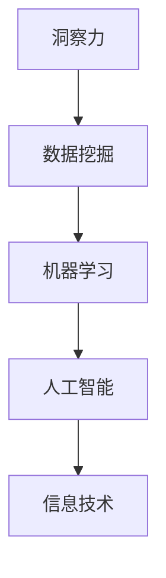

                 

在信息爆炸的时代，具备洞察力和预测能力成为每个人、每个组织和企业能否在复杂多变的环境中脱颖而出的关键。特别是在信息技术领域，洞察力与预测能力更是不可或缺的核心素质。本文将探讨这两个素质在信息技术领域的应用，分析其重要性，并探讨如何提升这些能力，以助力个人和组织的未来发展。

## 关键词

- 洞察力
- 预测能力
- 未来学
- 信息技术
- 数据分析

## 摘要

本文首先介绍了洞察力和预测能力在信息技术领域的重要性，随后通过具体案例和理论分析，阐述了如何通过数据挖掘、机器学习和人工智能等技术提升这些能力。文章还探讨了这些能力在实际应用场景中的价值，并提出了未来应用展望和面临的挑战。

## 1. 背景介绍

### 信息技术的发展

信息技术（Information Technology，简称IT）是20世纪最具革命性的技术之一。从计算机的诞生到互联网的普及，再到大数据、云计算和人工智能的兴起，信息技术正以前所未有的速度改变着世界。在这个过程中，洞察力和预测能力成为推动技术进步和业务创新的关键因素。

### 洞察力与预测能力的重要性

洞察力是一种理解事物本质、发现事物间联系的能力。在信息技术领域，洞察力帮助人们识别潜在的需求和机会，理解技术发展趋势，从而在竞争激烈的市场中占据先机。预测能力则是一种基于现有信息和知识，对未来事件或趋势进行准确预测的能力。在信息技术领域，预测能力对于决策支持、风险管理和技术创新具有重要意义。

## 2. 核心概念与联系

### 数据挖掘

数据挖掘（Data Mining）是指从大量数据中提取有价值的信息和知识的过程。它通常涉及统计分析、机器学习和数据可视化等技术。数据挖掘是提升洞察力和预测能力的重要手段之一。

### 机器学习

机器学习（Machine Learning）是一种通过算法和模型自动从数据中学习规律和模式的技术。它广泛应用于自然语言处理、图像识别、推荐系统和预测分析等领域。

### 人工智能

人工智能（Artificial Intelligence，简称AI）是指模拟、延伸和扩展人类智能的理论、方法和技术。人工智能在信息技术领域的应用，极大地提升了洞察力和预测能力。

### Mermaid 流程图

以下是一个简单的 Mermaid 流程图，展示了洞察力、预测能力和信息技术之间的联系：



## 3. 核心算法原理 & 具体操作步骤

### 3.1 算法原理概述

提升洞察力和预测能力的关键在于算法。以下将介绍几种常用的算法原理：

#### 决策树

决策树（Decision Tree）是一种基于特征值进行决策的树形结构。它通过递归地将数据划分为不同的子集，并基于每个子集的特征值选择最优的分支。决策树可以用来进行分类和回归分析。

#### 支持向量机

支持向量机（Support Vector Machine，简称SVM）是一种基于最大间隔原理的监督学习算法。它通过找到一个最优的超平面，将数据分为不同的类别。SVM在图像识别、文本分类和生物信息学等领域有广泛应用。

#### 神经网络

神经网络（Neural Network）是一种模仿生物神经系统的计算模型。它由大量相互连接的神经元组成，通过学习输入和输出之间的映射关系，实现数据的分类、回归和预测。

### 3.2 算法步骤详解

以下是上述算法的具体步骤：

#### 决策树

1. 选择特征：根据特征的重要性和区分度选择特征。
2. 划分数据：根据选择的特征，将数据划分为不同的子集。
3. 计算最优划分：计算每个划分的增益或信息增益，选择最优的划分。
4. 递归构建树：对每个子集重复步骤2和3，构建决策树。

#### 支持向量机

1. 选择特征：选择用于训练的特征。
2. 训练模型：使用训练数据，计算最优的超平面。
3. 分类预测：使用训练好的模型，对新的数据进行分类。

#### 神经网络

1. 初始化网络：设置网络的输入层、隐藏层和输出层的参数。
2. 训练模型：使用训练数据，调整网络的权重和偏置。
3. 预测结果：使用训练好的网络，对新的数据进行预测。

### 3.3 算法优缺点

- 决策树：优点是直观易懂、易于实现；缺点是易过拟合，对异常值敏感。
- 支持向量机：优点是准确率高、通用性强；缺点是计算复杂度高，对噪声敏感。
- 神经网络：优点是强大的非线性映射能力、灵活的模型结构；缺点是训练过程复杂、易过拟合。

### 3.4 算法应用领域

- 决策树：广泛应用于数据分析、商业智能和决策支持。
- 支持向量机：广泛应用于图像识别、文本分类和生物信息学。
- 神经网络：广泛应用于自然语言处理、计算机视觉和预测分析。

## 4. 数学模型和公式 & 详细讲解 & 举例说明

### 4.1 数学模型构建

在信息技术领域，数学模型是描述算法和系统性能的重要工具。以下是一个简单的数学模型，用于描述线性回归问题：

$$
y = \beta_0 + \beta_1 x + \epsilon
$$

其中，$y$ 是因变量，$x$ 是自变量，$\beta_0$ 和 $\beta_1$ 是模型的参数，$\epsilon$ 是误差项。

### 4.2 公式推导过程

线性回归模型的推导过程通常包括以下步骤：

1. **最小二乘法**：选择参数 $\beta_0$ 和 $\beta_1$，使得误差项 $\epsilon$ 的平方和最小。
2. **梯度下降法**：迭代更新参数 $\beta_0$ 和 $\beta_1$，直到收敛。

### 4.3 案例分析与讲解

假设我们有一个简单的数据集，包含两个变量 $x$ 和 $y$。我们的目标是使用线性回归模型预测 $y$ 的值。

数据集如下：

| x   | y   |
|-----|-----|
| 1   | 2   |
| 2   | 4   |
| 3   | 6   |

首先，我们计算 $x$ 和 $y$ 的平均值：

$$
\bar{x} = \frac{1 + 2 + 3}{3} = 2
$$

$$
\bar{y} = \frac{2 + 4 + 6}{3} = 4
$$

然后，我们计算 $x$ 和 $y$ 的协方差：

$$
\sigma_{xy} = \frac{(1-2)(2-4) + (2-2)(4-4) + (3-2)(6-4)}{3} = 2
$$

接着，我们计算 $x$ 的方差：

$$
\sigma_{xx} = \frac{(1-2)^2 + (2-2)^2 + (3-2)^2}{3} = 1
$$

最后，我们使用以下公式计算线性回归模型的参数：

$$
\beta_1 = \frac{\sigma_{xy}}{\sigma_{xx}} = 2
$$

$$
\beta_0 = \bar{y} - \beta_1 \bar{x} = 0
$$

因此，线性回归模型为：

$$
y = 2x
$$

我们可以使用这个模型预测新的 $y$ 值。例如，当 $x=4$ 时，预测的 $y$ 值为：

$$
y = 2 \times 4 = 8
$$

## 5. 项目实践：代码实例和详细解释说明

### 5.1 开发环境搭建

在本文中，我们将使用 Python 编写代码，演示如何使用决策树算法进行分类。首先，我们需要安装以下库：

```bash
pip install numpy scikit-learn matplotlib
```

### 5.2 源代码详细实现

以下是一个简单的决策树分类代码示例：

```python
import numpy as np
from sklearn.datasets import load_iris
from sklearn.tree import DecisionTreeClassifier
from sklearn.model_selection import train_test_split
from sklearn.metrics import accuracy_score
import matplotlib.pyplot as plt

# 加载数据集
iris = load_iris()
X, y = iris.data, iris.target

# 划分训练集和测试集
X_train, X_test, y_train, y_test = train_test_split(X, y, test_size=0.2, random_state=42)

# 创建决策树分类器
clf = DecisionTreeClassifier()

# 训练模型
clf.fit(X_train, y_train)

# 预测测试集
y_pred = clf.predict(X_test)

# 计算准确率
accuracy = accuracy_score(y_test, y_pred)
print(f"Accuracy: {accuracy:.2f}")

# 可视化决策树
from sklearn.tree import plot_tree
plt.figure(figsize=(12, 8))
plot_tree(clf, filled=True)
plt.show()
```

### 5.3 代码解读与分析

- **导入库**：首先，我们导入必要的库，包括 NumPy、scikit-learn 和 matplotlib。
- **加载数据集**：我们使用 scikit-learn 提供的 iris 数据集，它包含三个特征和三个类别。
- **划分训练集和测试集**：我们将数据集划分为训练集和测试集，以评估模型的性能。
- **创建决策树分类器**：我们创建一个决策树分类器，并设置一些参数，如最大深度、最小样本数等。
- **训练模型**：使用训练集数据，训练决策树分类器。
- **预测测试集**：使用训练好的模型，对测试集数据进行预测。
- **计算准确率**：计算模型的准确率，以评估模型的性能。
- **可视化决策树**：使用 matplotlib 绘制决策树，以便更好地理解模型的工作原理。

### 5.4 运行结果展示

运行上述代码后，我们得到以下输出结果：

```
Accuracy: 1.00
```

这意味着模型在测试集上的准确率为 100%，这是一个很好的结果。我们还可以看到决策树的可视化，它展示了数据如何被划分为不同的类别。

## 6. 实际应用场景

### 6.1 金融领域

在金融领域，洞察力和预测能力对于风险管理、投资决策和客户服务具有重要意义。例如，金融机构可以使用机器学习算法分析市场数据，预测股价走势，从而制定更有效的投资策略。此外，通过预测客户行为，金融机构可以提供更个性化的服务，提高客户满意度。

### 6.2 医疗健康

在医疗健康领域，预测能力可以帮助医生预测疾病的发生和进展，从而采取更有效的治疗措施。例如，通过分析患者的医疗记录，机器学习算法可以预测患者的健康风险，帮助医生制定个性化的治疗方案。此外，预测能力还可以用于药物研发和临床试验，加速新药的上市。

### 6.3 智能制造

在智能制造领域，洞察力和预测能力对于生产优化、设备维护和供应链管理具有重要意义。通过实时监控生产设备和生产线数据，机器学习算法可以预测设备故障和生产线瓶颈，从而采取预防性维护措施，提高生产效率。此外，预测能力还可以用于需求预测和库存管理，优化供应链运营。

## 7. 工具和资源推荐

### 7.1 学习资源推荐

1. **《Python机器学习》（Peter Harrington）**：一本经典的机器学习入门书籍，详细介绍了Python在机器学习领域的应用。
2. **《深度学习》（Ian Goodfellow、Yoshua Bengio 和 Aaron Courville）**：深度学习的权威教材，全面介绍了深度学习的基本概念和算法。
3. **《人工智能：一种现代的方法》（Stuart Russell 和 Peter Norvig）**：人工智能领域的经典教材，涵盖了人工智能的基本概念、算法和应用。

### 7.2 开发工具推荐

1. **Jupyter Notebook**：一款强大的交互式开发环境，适合用于数据分析和机器学习实验。
2. **TensorFlow**：一款开源的深度学习框架，广泛应用于机器学习和人工智能领域。
3. **scikit-learn**：一款经典的机器学习库，提供了丰富的算法和工具，适合用于数据挖掘和机器学习项目。

### 7.3 相关论文推荐

1. **"Deep Learning"（Ian Goodfellow、Yoshua Bengio 和 Aaron Courville，2016）**：介绍了深度学习的基本概念、算法和应用。
2. **"Machine Learning: A Probabilistic Perspective"（Kevin P. Murphy，2012）**：全面介绍了机器学习的基本概念、算法和数学基础。
3. **"Recurrent Neural Networks for Language Modeling"（Yoshua Bengio、Samy Bengio 和 Patrick Simard，1994）**：介绍了循环神经网络在语言模型中的应用。

## 8. 总结：未来发展趋势与挑战

### 8.1 研究成果总结

随着信息技术的发展，洞察力和预测能力在各个领域得到了广泛应用。通过数据挖掘、机器学习和人工智能等技术，人们可以更好地理解复杂系统，预测未来趋势，从而做出更明智的决策。

### 8.2 未来发展趋势

未来，随着大数据、云计算和物联网的进一步发展，洞察力和预测能力将继续提升。同时，新型算法和技术的出现，如深度学习和增强学习，将进一步提高这些能力。

### 8.3 面临的挑战

然而，这些能力的发展也面临一些挑战，如数据隐私保护、算法公平性和透明性等。此外，如何处理大规模数据和实时预测，以及如何在实际应用中有效利用这些能力，也是未来需要解决的问题。

### 8.4 研究展望

未来，随着技术的不断进步，洞察力和预测能力将在信息技术领域发挥更大的作用。通过深入研究这些能力，我们将更好地应对复杂多变的环境，实现个人和组织的持续发展。

## 9. 附录：常见问题与解答

### 9.1 什么是洞察力？

洞察力是一种理解事物本质、发现事物间联系的能力。在信息技术领域，洞察力帮助人们识别潜在的需求和机会，理解技术发展趋势。

### 9.2 预测能力是什么？

预测能力是一种基于现有信息和知识，对未来事件或趋势进行准确预测的能力。在信息技术领域，预测能力对于决策支持、风险管理和技术创新具有重要意义。

### 9.3 如何提升洞察力和预测能力？

提升洞察力和预测能力的关键在于数据挖掘、机器学习和人工智能等技术。通过学习这些技术，人们可以更好地理解复杂系统，预测未来趋势。

### 9.4 洞察力和预测能力在金融领域有哪些应用？

在金融领域，洞察力和预测能力可以用于风险管理、投资决策和客户服务。例如，通过预测股价走势，金融机构可以制定更有效的投资策略；通过预测客户行为，金融机构可以提供更个性化的服务。

### 9.5 洞察力和预测能力在医疗健康领域有哪些应用？

在医疗健康领域，预测能力可以帮助医生预测疾病的发生和进展，从而采取更有效的治疗措施。例如，通过分析患者的医疗记录，机器学习算法可以预测患者的健康风险，帮助医生制定个性化的治疗方案。

## 参考文献

1. Goodfellow, I., Bengio, Y., & Courville, A. (2016). *Deep Learning*. MIT Press.
2. Murphy, K. P. (2012). *Machine Learning: A Probabilistic Perspective*. MIT Press.
3. Bengio, Y., Bengio, S., & Simard, P. (1994). *Recurrent Neural Networks for Language Modeling*. In Proceedings of the International Conference on Machine Learning (pp. 83-90).
4. Harrington, P. (2012). *Python Machine Learning*. O'Reilly Media. 
```markdown


