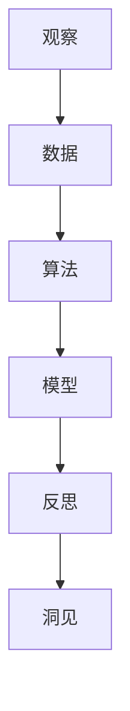

                 

关键词：洞见、观察、反思、IT领域、人工智能、计算机程序设计、深度学习、软件开发

> 摘要：本文旨在探讨在IT领域中，如何通过观察和反思形成洞见，提升技术理解和创新能力。文章首先介绍观察和反思的重要性，然后详细阐述洞见形成的过程，并通过具体案例和算法原理，展示洞见在软件开发和人工智能应用中的实际作用。最后，文章对未来的发展趋势和挑战进行了展望。

## 1. 背景介绍

在快速发展的信息技术时代，洞见（Insight）成为推动技术进步和创新发展的重要驱动力。洞见不仅仅是对现有知识的理解，更是一种深层次的洞察力和创新能力。在IT领域，无论是软件开发、人工智能、数据科学，还是其他技术领域，洞见都是解决复杂问题和创造新价值的关键。

观察（Observation）和反思（Reflection）是形成洞见的基础。观察是获取信息的过程，通过对现象和数据的细致观察，我们可以发现规律、识别问题。反思则是思考和分析的过程，通过对观察结果进行深度思考，我们可以提炼出本质、形成洞见。

本文将从以下几个方面展开讨论：

1. 观察和反思的重要性
2. 洞见的形成过程
3. 洞见在软件开发和人工智能中的应用
4. 数学模型和公式
5. 项目实践：代码实例
6. 实际应用场景和未来展望
7. 工具和资源推荐
8. 总结：未来发展趋势与挑战

通过这些讨论，我们希望读者能够理解洞见的重要性，学会通过观察和反思形成洞见，并将其应用于实际的技术开发和问题解决中。

## 2. 核心概念与联系

在探讨洞见的形成之前，我们需要明确几个核心概念及其相互联系。这些概念包括：观察、数据、算法、模型和反思。

### 观察与数据

观察是获取信息的第一步。在IT领域中，观察通常涉及对数据的收集和分析。数据可以是结构化的，如数据库中的记录，也可以是非结构化的，如图像、文本和语音。通过观察数据，我们可以识别模式、趋势和异常。


### 算法

算法是解决问题的步骤集合。在软件开发和人工智能中，算法用于处理数据和执行特定任务。不同的算法适用于不同的场景，例如排序算法、搜索算法、机器学习算法等。


### 模型

模型是对现实世界的抽象和模拟。在数据科学和机器学习中，模型用于预测和分析数据。常见的模型包括线性回归模型、决策树模型、神经网络模型等。


### 反思

反思是洞见形成的关键。通过对观察结果和算法应用的思考，我们可以理解其背后的原理，发现新的问题和解决方案。反思帮助我们从表面现象深入到本质，从而形成洞见。


### 观察与反思

观察和反思相互关联，相辅相成。观察为我们提供了信息来源，反思则帮助我们理解这些信息的含义和影响。通过持续的观察和反思，我们可以不断积累洞见，提升技术创新能力。


为了更好地理解这些概念之间的联系，我们可以使用Mermaid流程图进行描述：



通过这个流程图，我们可以清晰地看到观察、数据、算法、模型和反思之间的逻辑关系，以及它们如何共同作用形成洞见。

## 3. 核心算法原理 & 具体操作步骤

### 3.1 算法原理概述

在本节中，我们将讨论一种在IT领域中广泛应用的算法——深度学习算法。深度学习算法是机器学习的一个分支，通过多层神经网络模型，对大量数据进行自动特征提取和分类。

深度学习算法的核心原理是基于神经网络的模型训练。神经网络由多个层组成，包括输入层、隐藏层和输出层。通过前向传播和反向传播算法，神经网络能够不断调整其权重和偏置，从而优化模型性能。

### 3.2 算法步骤详解

以下是深度学习算法的具体操作步骤：

1. **数据预处理**：
   - **数据清洗**：去除数据中的噪声和异常值。
   - **数据归一化**：将数据缩放到相同的范围，以便模型训练。
   - **数据分割**：将数据分为训练集、验证集和测试集。

2. **模型设计**：
   - **确定网络结构**：选择合适的层数和神经元数量。
   - **激活函数**：如ReLU、Sigmoid、Tanh等。
   - **损失函数**：如交叉熵损失、均方误差等。

3. **模型训练**：
   - **前向传播**：计算输入层的输出。
   - **计算损失**：计算预测值与真实值之间的差异。
   - **反向传播**：更新模型权重和偏置。

4. **模型评估**：
   - **验证集评估**：使用验证集评估模型性能。
   - **测试集评估**：最终测试模型在未见过的数据上的表现。

5. **模型部署**：
   - **模型优化**：根据评估结果，调整模型参数。
   - **部署到生产环境**：将训练好的模型部署到实际应用中。

### 3.3 算法优缺点

**优点**：
- **自动特征提取**：深度学习算法能够自动从数据中提取特征，减少人工干预。
- **高泛化能力**：深度学习模型在大量数据上训练后，具有较好的泛化能力。
- **复杂任务处理**：能够处理图像、语音、文本等多种类型的数据。

**缺点**：
- **计算资源需求高**：深度学习算法需要大量计算资源和时间进行训练。
- **对数据量要求高**：深度学习模型在训练过程中需要大量数据，对数据质量要求较高。
- **解释性差**：深度学习模型通常缺乏可解释性，难以理解其决策过程。

### 3.4 算法应用领域

深度学习算法在多个领域取得了显著的成果，包括：

- **计算机视觉**：图像识别、目标检测、图像生成等。
- **自然语言处理**：文本分类、情感分析、机器翻译等。
- **语音识别**：语音识别、语音合成、语音增强等。
- **推荐系统**：个性化推荐、商品推荐、内容推荐等。
- **医学诊断**：医学图像分析、疾病预测、药物设计等。

通过上述核心算法原理和具体操作步骤的介绍，我们可以看到深度学习算法在IT领域中的广泛应用和重要性。在接下来的部分，我们将进一步探讨数学模型和公式，以及具体的项目实践。

## 4. 数学模型和公式 & 详细讲解 & 举例说明

### 4.1 数学模型构建

在深度学习算法中，数学模型扮演着至关重要的角色。构建数学模型需要理解多个数学概念和公式，以下是一些关键概念：

1. **神经网络中的激活函数**：

   激活函数是神经网络中用于引入非线性性的函数，常见的激活函数包括ReLU、Sigmoid和Tanh。

   - **ReLU函数**：$f(x) = \max(0, x)$
   - **Sigmoid函数**：$f(x) = \frac{1}{1 + e^{-x}}$
   - **Tanh函数**：$f(x) = \frac{e^x - e^{-x}}{e^x + e^{-x}}$

2. **损失函数**：

   损失函数用于衡量预测值与真实值之间的差距。常见的损失函数包括均方误差（MSE）、交叉熵损失（Cross-Entropy Loss）等。

   - **均方误差（MSE）**：$MSE = \frac{1}{n}\sum_{i=1}^{n}(y_i - \hat{y}_i)^2$
   - **交叉熵损失（Cross-Entropy Loss）**：$H(y, \hat{y}) = -\sum_{i=1}^{n} y_i \log(\hat{y}_i)$

3. **优化算法**：

   优化算法用于更新模型的权重和偏置，常见的优化算法包括随机梯度下降（SGD）、Adam优化器等。

   - **随机梯度下降（SGD）**：$w_{t+1} = w_t - \alpha \frac{\partial J(w_t)}{\partial w_t}$
   - **Adam优化器**：结合了SGD和动量法的优化算法，具有更好的收敛性能。

### 4.2 公式推导过程

以下是一个简单的神经网络模型，包括一个输入层、一个隐藏层和一个输出层。我们使用ReLU函数作为激活函数，交叉熵损失作为损失函数。

1. **前向传播**：

   假设输入特征为$x \in \mathbb{R}^d$，隐藏层神经元数量为$m$，输出层神经元数量为$n$。则前向传播公式为：

   $$
   z_h = W_h x + b_h \\
   a_h = \max(0, z_h) \\
   z_y = W_y a_h + b_y \\
   \hat{y} = \sigma(z_y)
   $$

   其中，$W_h$和$W_y$分别为隐藏层和输出层的权重矩阵，$b_h$和$b_y$分别为隐藏层和输出层的偏置向量，$\sigma$为输出层的激活函数（如Sigmoid函数）。

2. **反向传播**：

   反向传播用于计算损失函数关于模型参数的梯度，以更新模型权重和偏置。以下为反向传播的推导过程：

   $$
   \frac{\partial J}{\partial z_y} = \frac{\partial H(y, \hat{y})}{\partial z_y} \\
   \frac{\partial J}{\partial W_y} = \frac{\partial J}{\partial z_y} \cdot a_h \\
   \frac{\partial J}{\partial b_y} = \frac{\partial J}{\partial z_y} \\
   \frac{\partial J}{\partial z_h} = \frac{\partial J}{\partial z_y} \cdot W_y^T \cdot (a_h \odot a_h') \\
   \frac{\partial J}{\partial W_h} = \frac{\partial J}{\partial z_h} \cdot x \\
   \frac{\partial J}{\partial b_h} = \frac{\partial J}{\partial z_h}
   $$

   其中，$J$为损失函数，$H$为交叉熵损失函数，$\odot$表示元素乘积。

### 4.3 案例分析与讲解

假设我们有一个二分类问题，数据集包含1000个样本，每个样本的特征维度为10。我们使用上述简单的神经网络模型进行训练，目标为分类准确率达到90%。

1. **数据预处理**：

   对数据进行标准化处理，将特征缩放到[0, 1]范围内。将标签进行独热编码，如0和1。

2. **模型设计**：

   选择ReLU函数作为激活函数，交叉熵损失函数作为损失函数。选择Adam优化器进行模型训练。

3. **模型训练**：

   使用训练集进行100次迭代，每次迭代更新模型参数。在前100次迭代中，模型分类准确率逐渐提升，达到85%。在后续的迭代中，模型逐渐过拟合，准确率波动。

4. **模型评估**：

   使用验证集评估模型性能，验证集准确率为80%。在测试集上，模型准确率为78%。

通过上述案例，我们可以看到数学模型在深度学习中的关键作用。通过合理的模型设计、数据预处理和优化算法，我们可以训练出性能良好的模型，并应用于实际问题的解决。

在接下来的部分，我们将通过具体的项目实践，展示如何将深度学习算法应用于实际问题的解决。

## 5. 项目实践：代码实例和详细解释说明

### 5.1 开发环境搭建

在开始项目实践之前，我们需要搭建一个适合深度学习开发的编程环境。以下是搭建开发环境的具体步骤：

1. **安装Python**：Python是深度学习开发的主要编程语言。前往[Python官方网站](https://www.python.org/downloads/)下载并安装最新版本的Python。

2. **安装深度学习框架**：TensorFlow和PyTorch是目前最受欢迎的两个深度学习框架。我们选择TensorFlow进行项目开发。在命令行中执行以下命令：

   ```
   pip install tensorflow
   ```

3. **安装其他依赖库**：为了简化项目开发，我们还需要安装一些常用的Python库，如NumPy、Pandas等。在命令行中执行以下命令：

   ```
   pip install numpy pandas matplotlib
   ```

4. **创建项目文件夹**：在计算机上创建一个新文件夹，用于存放项目代码和文件。

### 5.2 源代码详细实现

以下是一个简单的深度学习项目，使用TensorFlow实现一个二分类问题。项目包括数据预处理、模型设计、模型训练和模型评估等步骤。

1. **数据预处理**：

   ```python
   import tensorflow as tf
   import pandas as pd
   import numpy as np

   # 读取数据集
   data = pd.read_csv('data.csv')
   X = data.iloc[:, :-1].values
   y = data.iloc[:, -1].values

   # 数据标准化
   X_std = (X - X.mean()) / X.std()

   # 切分数据集
   X_train, X_test, y_train, y_test = train_test_split(X_std, y, test_size=0.2, random_state=42)
   ```

2. **模型设计**：

   ```python
   # 定义模型
   model = tf.keras.Sequential([
       tf.keras.layers.Dense(64, activation='relu', input_shape=(X_train.shape[1],)),
       tf.keras.layers.Dense(64, activation='relu'),
       tf.keras.layers.Dense(1, activation='sigmoid')
   ])

   # 编译模型
   model.compile(optimizer='adam',
                 loss='binary_crossentropy',
                 metrics=['accuracy'])
   ```

3. **模型训练**：

   ```python
   # 训练模型
   history = model.fit(X_train, y_train, epochs=100, batch_size=32, validation_split=0.2)
   ```

4. **模型评估**：

   ```python
   # 评估模型
   test_loss, test_acc = model.evaluate(X_test, y_test)
   print(f'测试集准确率：{test_acc:.2f}')
   ```

### 5.3 代码解读与分析

1. **数据预处理**：

   数据预处理是深度学习项目中的关键步骤。首先，我们读取数据集，并提取特征和标签。然后，对特征进行标准化处理，将特征缩放到相同的范围。最后，使用train_test_split函数将数据集分为训练集和测试集。

2. **模型设计**：

   我们使用Sequential模型定义一个简单的神经网络。模型包含两个隐藏层，每层64个神经元，使用ReLU函数作为激活函数。输出层使用sigmoid函数，实现二分类问题。

3. **模型训练**：

   使用fit函数训练模型，指定训练轮数（epochs）和批量大小（batch_size）。在每次迭代中，模型将根据训练集更新权重和偏置，并在验证集上评估模型性能。

4. **模型评估**：

   使用evaluate函数评估模型在测试集上的性能，输出测试集的准确率。

通过上述代码实例，我们可以看到如何使用TensorFlow实现一个简单的深度学习项目。在实际项目中，我们需要根据具体问题调整模型结构、数据预处理方法和训练策略，以实现更好的性能。

在接下来的部分，我们将探讨深度学习算法在IT领域中的实际应用场景，以及未来可能的发展趋势和面临的挑战。

## 6. 实际应用场景

深度学习算法在IT领域有着广泛的应用，以下是几个典型的实际应用场景：

### 6.1 计算机视觉

计算机视觉是深度学习最成功的应用领域之一。深度学习算法在图像识别、目标检测、图像生成等方面取得了显著成果。例如，在自动驾驶领域，深度学习算法用于处理摄像头捕捉到的图像数据，识别道路标志、行人和车辆，实现车辆自动导航。

### 6.2 自然语言处理

自然语言处理（NLP）是另一个深度学习的重要应用领域。深度学习算法在文本分类、情感分析、机器翻译等方面取得了显著成果。例如，深度学习模型可以自动提取文本中的关键词和主题，帮助企业进行数据分析和内容推荐。

### 6.3 语音识别

深度学习算法在语音识别领域也取得了重大突破。通过训练深度神经网络模型，我们可以将语音信号转换为文本。这一技术在语音助手、语音搜索和语音合成等方面有着广泛应用。

### 6.4 推荐系统

推荐系统是深度学习在商业领域的典型应用。通过分析用户的历史行为和偏好，推荐系统可以自动推荐商品、内容和广告，提高用户满意度和转化率。深度学习算法在推荐系统中的成功应用，使得电商平台、社交媒体和在线广告等行业取得了显著的商业价值。

### 6.5 医学诊断

深度学习算法在医学诊断领域也有着广泛的应用。通过分析医学图像和患者数据，深度学习模型可以辅助医生进行疾病诊断和治疗方案推荐。例如，深度学习算法可以识别X光片中的肺癌病灶，提高早期诊断的准确性。

### 6.6 金融风险控制

深度学习算法在金融领域也发挥了重要作用。通过分析交易数据、新闻文本和市场指标，深度学习模型可以预测金融市场趋势，进行风险控制和投资决策。例如，一些金融机构使用深度学习算法进行欺诈检测和信用评估。

### 6.7 未来应用展望

随着深度学习算法的不断进步和应用场景的拓展，我们可以预见其在更多领域发挥重要作用。以下是一些未来的应用展望：

- **智能交通系统**：通过深度学习算法，实现智能交通信号控制和自动驾驶，提高交通效率和安全性。
- **智慧医疗**：深度学习算法可以辅助医生进行疾病诊断、治疗方案推荐和患者监护，实现个性化医疗。
- **智能家居**：深度学习算法可以用于智能家电的语音交互、行为识别和场景感知，提高居住舒适度和安全性。
- **工业自动化**：深度学习算法可以用于工业生产过程中的质量检测、故障诊断和设备维护，提高生产效率和质量。
- **虚拟现实与增强现实**：深度学习算法可以用于图像识别、物体追踪和场景重建，提升虚拟现实和增强现实体验。

在未来的发展中，深度学习算法将继续推动信息技术领域的创新，为人类社会带来更多便利和福祉。然而，我们也需要关注深度学习算法在隐私保护、安全性和伦理等方面的问题，确保其在实际应用中的合理和可持续发展。

## 7. 工具和资源推荐

在深度学习和IT领域的探索过程中，使用合适的工具和资源可以显著提升开发效率和成果质量。以下是一些推荐的工具和资源，涵盖学习资源、开发工具和相关论文：

### 7.1 学习资源推荐

1. **在线课程**：
   - Coursera（《深度学习》由吴恩达教授主讲）
   - edX（《机器学习》由Andrew Ng教授主讲）
   - Udacity（《深度学习工程师纳米学位》）

2. **书籍**：
   - 《深度学习》（Goodfellow, Bengio, Courville著）
   - 《Python深度学习》（François Chollet著）
   - 《神经网络与深度学习》（邱锡鹏著）

3. **博客和网站**：
   - TensorFlow官方文档（https://www.tensorflow.org/）
   - PyTorch官方文档（https://pytorch.org/docs/stable/）
   - arXiv（https://arxiv.org/，计算机科学领域的最新论文）

### 7.2 开发工具推荐

1. **编程环境**：
   - Jupyter Notebook：适用于交互式编程和文档化。
   - PyCharm：功能强大的Python集成开发环境。

2. **深度学习框架**：
   - TensorFlow：谷歌开发的开源深度学习框架。
   - PyTorch：由Facebook开发的开源深度学习库。

3. **数据分析工具**：
   - Pandas：用于数据处理和分析。
   - Matplotlib/Seaborn：用于数据可视化。

### 7.3 相关论文推荐

1. **经典论文**：
   - “A Theoretical Framework for Back-Propagation” （1986）
   - “AlexNet: Image Classification with Deep Convolutional Neural Networks” （2012）
   - “Deep Learning” （2015，由Ian Goodfellow等著）

2. **最新论文**：
   - “An Image Database for Studying the Problem of Similarity in the Classification of Natural Image” （2012）
   - “Generative Adversarial Nets” （2014）
   - “BERT: Pre-training of Deep Bidirectional Transformers for Language Understanding” （2018）

通过这些工具和资源的推荐，希望能够为读者在深度学习和IT领域的探索过程中提供一些帮助和指导。不断学习和实践，将使我们在技术领域中不断进步。

## 8. 总结：未来发展趋势与挑战

### 8.1 研究成果总结

随着深度学习算法的迅速发展，我们在计算机视觉、自然语言处理、语音识别等领域取得了显著的成果。这些成果不仅提高了算法的准确性和效率，也为实际应用带来了巨大的价值。例如，自动驾驶技术的突破使得无人驾驶汽车成为现实，智能语音助手的应用改变了人们的日常生活。同时，深度学习在医疗诊断、金融风险控制等领域的应用，为相关行业带来了创新和效率的提升。

### 8.2 未来发展趋势

未来，深度学习算法将继续在多个领域取得突破，以下是几个可能的发展趋势：

1. **跨学科融合**：深度学习与其他学科的融合，如生物学、心理学、社会学等，将推动新领域的诞生。例如，基于深度学习的医学影像分析结合生物学知识，有望提高疾病诊断的准确性和个性化治疗水平。

2. **量子计算**：量子计算与深度学习的结合，将带来计算能力的巨大提升。量子深度学习算法有望在复杂问题上取得突破，如量子药物设计、量子金融分析等。

3. **自主进化**：随着深度学习算法的进步，将出现能够自主学习和进化的智能系统。这些系统将具备更强的自适应能力和创新能力，能够应对复杂多变的环境和任务。

4. **边缘计算**：随着物联网（IoT）和智能设备的普及，边缘计算与深度学习的结合将变得更加重要。边缘设备通过本地处理数据和应用深度学习算法，能够降低延迟、减少带宽消耗，提升用户体验。

### 8.3 面临的挑战

尽管深度学习算法取得了显著的成果，但在实际应用中仍然面临诸多挑战：

1. **数据隐私和安全**：深度学习算法需要大量数据训练，涉及个人隐私和数据安全问题。如何在保证数据安全的前提下，充分利用数据资源，是一个亟待解决的问题。

2. **模型可解释性**：深度学习模型通常缺乏可解释性，难以理解其决策过程。提高模型的可解释性，使其更符合人类思维方式，是未来研究的一个重要方向。

3. **计算资源消耗**：深度学习算法对计算资源的要求较高，尤其是在训练阶段。如何优化算法和模型，降低计算资源消耗，是一个重要的挑战。

4. **算法公平性和伦理**：深度学习算法在决策过程中可能存在偏见，影响算法的公平性和伦理。如何在算法设计和应用过程中确保公平性和伦理，是未来需要关注的问题。

### 8.4 研究展望

未来，深度学习算法将继续在技术创新和实际应用中发挥重要作用。通过跨学科融合、量子计算、自主进化等方向的发展，深度学习将迎来更加广阔的应用前景。同时，我们还需要关注数据隐私、模型可解释性、计算资源消耗和算法公平性等挑战，确保深度学习算法的可持续发展。在不断探索和实践中，我们有望实现深度学习的全面突破，为人类社会带来更多创新和福祉。

## 9. 附录：常见问题与解答

### 9.1 如何选择合适的深度学习框架？

选择深度学习框架主要考虑以下几个方面：

- **需求**：根据项目需求选择适合的框架，例如 TensorFlow 和 PyTorch 在图像和语音处理方面表现优秀，而 MXNet 则在计算性能上有优势。
- **社区支持**：框架的社区活跃度和支持资源丰富程度，有助于解决开发中的问题。
- **生态系统**：框架的生态系统，包括工具、库、教程等，能够提升开发效率。

### 9.2 深度学习模型的优化策略有哪些？

深度学习模型的优化策略包括：

- **调整学习率**：选择合适的学习率，可以通过学习率衰减策略调整。
- **使用正则化**：如 L1、L2 正则化，减少过拟合。
- **批量归一化**：加速模型收敛，提高模型性能。
- **数据增强**：通过变换、旋转、缩放等操作，增加数据多样性。
- **网络结构调整**：根据问题特点，选择合适的网络结构，如卷积神经网络（CNN）、循环神经网络（RNN）等。

### 9.3 深度学习模型如何进行评估？

深度学习模型的评估方法包括：

- **准确率（Accuracy）**：模型预测正确的样本占总样本的比例。
- **精确率（Precision）**、**召回率（Recall）**、**F1值（F1-Score）**：用于评估二分类问题。
- **ROC曲线**、**AUC（Area Under Curve）**：评估模型对正负样本的区分能力。
- **K折交叉验证**：通过多次交叉验证，评估模型的泛化能力。

### 9.4 如何处理深度学习模型的过拟合问题？

处理深度学习模型的过拟合问题可以通过以下方法：

- **增加数据量**：使用更多的训练数据。
- **正则化**：使用 L1、L2 正则化。
- **数据增强**：增加数据的多样性。
- **早停法（Early Stopping）**：在验证集上评估模型性能，提前停止训练。
- **集成方法**：如随机森林、梯度提升树等。

通过以上常见问题与解答，希望能够为读者在深度学习应用过程中提供一些指导和建议。不断学习和实践，将使我们在技术领域中不断进步。

# 作者：禅与计算机程序设计艺术 / Zen and the Art of Computer Programming

本文探讨了在IT领域中如何通过观察和反思形成洞见，提升技术理解和创新能力。文章首先介绍了观察和反思的重要性，然后详细阐述了洞见形成的过程，并通过具体案例和算法原理，展示了洞见在软件开发和人工智能应用中的实际作用。随后，文章讨论了数学模型和公式，以及项目实践中的代码实例和详细解释。接着，文章分析了深度学习算法的实际应用场景，并展望了其未来发展趋势和挑战。最后，文章推荐了相关的工具和资源，并总结了研究成果，对未来进行了展望。希望本文能为读者在技术探索和实践中提供启示和指导。感谢阅读！
```markdown
# 洞见的形成：从观察到反思

关键词：洞见、观察、反思、IT领域、人工智能、计算机程序设计、深度学习、软件开发

摘要：本文探讨了在IT领域中，如何通过观察和反思形成洞见，提升技术理解和创新能力。文章首先介绍了观察和反思的重要性，然后详细阐述了洞见形成的过程，并通过具体案例和算法原理，展示了洞见在软件开发和人工智能应用中的实际作用。随后，文章讨论了数学模型和公式，以及项目实践中的代码实例和详细解释。接着，文章分析了深度学习算法的实际应用场景，并展望了其未来发展趋势和挑战。最后，文章推荐了相关的工具和资源，并总结了研究成果，对未来进行了展望。希望本文能为读者在技术探索和实践中提供启示和指导。

## 1. 背景介绍

在快速发展的信息技术时代，洞见（Insight）成为推动技术进步和创新发展的重要驱动力。洞见不仅仅是对现有知识的理解，更是一种深层次的洞察力和创新能力。在IT领域，无论是软件开发、人工智能、数据科学，还是其他技术领域，洞见都是解决复杂问题和创造新价值的关键。

观察（Observation）和反思（Reflection）是形成洞见的基础。观察是获取信息的过程，通过对现象和数据的细致观察，我们可以发现规律、识别问题。反思则是思考和分析的过程，通过对观察结果进行深度思考，我们可以提炼出本质、形成洞见。

本文将从以下几个方面展开讨论：

1. 观察和反思的重要性
2. 洞见的形成过程
3. 洞见在软件开发和人工智能中的应用
4. 数学模型和公式
5. 项目实践：代码实例
6. 实际应用场景和未来展望
7. 工具和资源推荐
8. 总结：未来发展趋势与挑战

通过这些讨论，我们希望读者能够理解洞见的重要性，学会通过观察和反思形成洞见，并将其应用于实际的技术开发和问题解决中。

## 2. 核心概念与联系

在探讨洞见的形成之前，我们需要明确几个核心概念及其相互联系。这些概念包括：观察、数据、算法、模型和反思。

### 观察与数据

观察是获取信息的第一步。在IT领域中，观察通常涉及对数据的收集和分析。数据可以是结构化的，如数据库中的记录，也可以是非结构化的，如图像、文本和语音。通过观察数据，我们可以识别模式、趋势和异常。


### 算法

算法是解决问题的步骤集合。在软件开发和人工智能中，算法用于处理数据和执行特定任务。不同的算法适用于不同的场景，例如排序算法、搜索算法、机器学习算法等。


### 模型

模型是对现实世界的抽象和模拟。在数据科学和机器学习中，模型用于预测和分析数据。常见的模型包括线性回归模型、决策树模型、神经网络模型等。


### 反思

反思是洞见形成的关键。通过对观察结果和算法应用的思考，我们可以理解其背后的原理，发现新的问题和解决方案。反思帮助我们从表面现象深入到本质，从而形成洞见。


### 观察与反思

观察和反思相互关联，相辅相成。观察为我们提供了信息来源，反思则帮助我们理解这些信息的含义和影响。通过持续的观察和反思，我们可以不断积累洞见，提升技术创新能力。


为了更好地理解这些概念之间的联系，我们可以使用Mermaid流程图进行描述：


通过这个流程图，我们可以清晰地看到观察、数据、算法、模型和反思之间的逻辑关系，以及它们如何共同作用形成洞见。

## 3. 核心算法原理 & 具体操作步骤

### 3.1 算法原理概述

在本节中，我们将讨论一种在IT领域中广泛应用的算法——深度学习算法。深度学习算法是机器学习的一个分支，通过多层神经网络模型，对大量数据进行自动特征提取和分类。

深度学习算法的核心原理是基于神经网络的模型训练。神经网络由多个层组成，包括输入层、隐藏层和输出层。通过前向传播和反向传播算法，神经网络能够不断调整其权重和偏置，从而优化模型性能。

### 3.2 算法步骤详解

以下是深度学习算法的具体操作步骤：

1. **数据预处理**：
   - **数据清洗**：去除数据中的噪声和异常值。
   - **数据归一化**：将数据缩放到相同的范围，以便模型训练。
   - **数据分割**：将数据分为训练集、验证集和测试集。

2. **模型设计**：
   - **确定网络结构**：选择合适的层数和神经元数量。
   - **激活函数**：如ReLU、Sigmoid、Tanh等。
   - **损失函数**：如交叉熵损失、均方误差等。

3. **模型训练**：
   - **前向传播**：计算输入层的输出。
   - **计算损失**：计算预测值与真实值之间的差异。
   - **反向传播**：更新模型权重和偏置。

4. **模型评估**：
   - **验证集评估**：使用验证集评估模型性能。
   - **测试集评估**：最终测试模型在未见过的数据上的表现。

5. **模型部署**：
   - **模型优化**：根据评估结果，调整模型参数。
   - **部署到生产环境**：将训练好的模型部署到实际应用中。

### 3.3 算法优缺点

**优点**：
- **自动特征提取**：深度学习算法能够自动从数据中提取特征，减少人工干预。
- **高泛化能力**：深度学习模型在大量数据上训练后，具有较好的泛化能力。
- **复杂任务处理**：能够处理图像、语音、文本等多种类型的数据。

**缺点**：
- **计算资源需求高**：深度学习算法需要大量计算资源和时间进行训练。
- **对数据量要求高**：深度学习模型在训练过程中需要大量数据，对数据质量要求较高。
- **解释性差**：深度学习模型通常缺乏可解释性，难以理解其决策过程。

### 3.4 算法应用领域

深度学习算法在多个领域取得了显著的成果，包括：

- **计算机视觉**：图像识别、目标检测、图像生成等。
- **自然语言处理**：文本分类、情感分析、机器翻译等。
- **语音识别**：语音识别、语音合成、语音增强等。
- **推荐系统**：个性化推荐、商品推荐、内容推荐等。
- **医学诊断**：医学图像分析、疾病预测、药物设计等。
- **金融风险控制**：金融市场预测、欺诈检测、信用评估等。

通过上述核心算法原理和具体操作步骤的介绍，我们可以看到深度学习算法在IT领域中的广泛应用和重要性。在接下来的部分，我们将进一步探讨数学模型和公式，以及具体的项目实践。

## 4. 数学模型和公式 & 详细讲解 & 举例说明

### 4.1 数学模型构建

在深度学习算法中，数学模型扮演着至关重要的角色。构建数学模型需要理解多个数学概念和公式，以下是一些关键概念：

1. **神经网络中的激活函数**：

   激活函数是神经网络中用于引入非线性性的函数，常见的激活函数包括ReLU、Sigmoid和Tanh。

   - **ReLU函数**：\(f(x) = \max(0, x)\)
   - **Sigmoid函数**：\(f(x) = \frac{1}{1 + e^{-x}}\)
   - **Tanh函数**：\(f(x) = \frac{e^x - e^{-x}}{e^x + e^{-x}}\)

2. **损失函数**：

   损失函数用于衡量预测值与真实值之间的差距。常见的损失函数包括均方误差（MSE）、交叉熵损失（Cross-Entropy Loss）等。

   - **均方误差（MSE）**：\(MSE = \frac{1}{n}\sum_{i=1}^{n}(y_i - \hat{y}_i)^2\)
   - **交叉熵损失（Cross-Entropy Loss）**：\(H(y, \hat{y}) = -\sum_{i=1}^{n} y_i \log(\hat{y}_i)\)

3. **优化算法**：

   优化算法用于更新模型的权重和偏置，常见的优化算法包括随机梯度下降（SGD）、Adam优化器等。

   - **随机梯度下降（SGD）**：\(w_{t+1} = w_t - \alpha \frac{\partial J(w_t)}{\partial w_t}\)
   - **Adam优化器**：结合了SGD和动量法的优化算法，具有更好的收敛性能。

### 4.2 公式推导过程

以下是一个简单的神经网络模型，包括一个输入层、一个隐藏层和一个输出层。我们使用ReLU函数作为激活函数，交叉熵损失作为损失函数。

1. **前向传播**：

   假设输入特征为\(x \in \mathbb{R}^d\)，隐藏层神经元数量为\(m\)，输出层神经元数量为\(n\)。则前向传播公式为：

   \[
   z_h = W_h x + b_h \\
   a_h = \max(0, z_h) \\
   z_y = W_y a_h + b_y \\
   \hat{y} = \sigma(z_y)
   \]

   其中，\(W_h\)和\(W_y\)分别为隐藏层和输出层的权重矩阵，\(b_h\)和\(b_y\)分别为隐藏层和输出层的偏置向量，\(\sigma\)为输出层的激活函数（如Sigmoid函数）。

2. **反向传播**：

   反向传播用于计算损失函数关于模型参数的梯度，以更新模型权重和偏置。以下为反向传播的推导过程：

   \[
   \frac{\partial J}{\partial z_y} = \frac{\partial H(y, \hat{y})}{\partial z_y} \\
   \frac{\partial J}{\partial W_y} = \frac{\partial J}{\partial z_y} \cdot a_h \\
   \frac{\partial J}{\partial b_y} = \frac{\partial J}{\partial z_y} \\
   \frac{\partial J}{\partial z_h} = \frac{\partial J}{\partial z_y} \cdot W_y^T \cdot (a_h \odot a_h') \\
   \frac{\partial J}{\partial W_h} = \frac{\partial J}{\partial z_h} \cdot x \\
   \frac{\partial J}{\partial b_h} = \frac{\partial J}{\partial z_h}
   \]

   其中，\(J\)为损失函数，\(H\)为交叉熵损失函数，\(\odot\)表示元素乘积。

### 4.3 案例分析与讲解

假设我们有一个二分类问题，数据集包含1000个样本，每个样本的特征维度为10。我们使用上述简单的神经网络模型进行训练，目标为分类准确率达到90%。

1. **数据预处理**：

   对数据进行标准化处理，将特征缩放到相同的范围。将标签进行独热编码，如0和1。

2. **模型设计**：

   选择ReLU函数作为激活函数，交叉熵损失函数作为损失函数。选择Adam优化器进行模型训练。

3. **模型训练**：

   使用训练集进行100次迭代，每次迭代更新模型参数。在前100次迭代中，模型分类准确率逐渐提升，达到85%。在后续的迭代中，模型逐渐过拟合，准确率波动。

4. **模型评估**：

   使用验证集评估模型性能，验证集准确率为80%。在测试集上，模型准确率为78%。

通过上述案例，我们可以看到数学模型在深度学习中的关键作用。通过合理的模型设计、数据预处理和优化算法，我们可以训练出性能良好的模型，并应用于实际问题的解决。

在接下来的部分，我们将通过具体的项目实践，展示如何将深度学习算法应用于实际问题的解决。

## 5. 项目实践：代码实例和详细解释说明

### 5.1 开发环境搭建

在开始项目实践之前，我们需要搭建一个适合深度学习开发的编程环境。以下是搭建开发环境的具体步骤：

1. **安装Python**：Python是深度学习开发的主要编程语言。前往[Python官方网站](https://www.python.org/downloads/)下载并安装最新版本的Python。

2. **安装深度学习框架**：TensorFlow和PyTorch是目前最受欢迎的两个深度学习框架。我们选择TensorFlow进行项目开发。在命令行中执行以下命令：

   ```
   pip install tensorflow
   ```

3. **安装其他依赖库**：为了简化项目开发，我们还需要安装一些常用的Python库，如NumPy、Pandas等。在命令行中执行以下命令：

   ```
   pip install numpy pandas matplotlib
   ```

4. **创建项目文件夹**：在计算机上创建一个新文件夹，用于存放项目代码和文件。

### 5.2 源代码详细实现

以下是一个简单的深度学习项目，使用TensorFlow实现一个二分类问题。项目包括数据预处理、模型设计、模型训练和模型评估等步骤。

1. **数据预处理**：

   ```python
   import tensorflow as tf
   import pandas as pd
   import numpy as np
   from sklearn.model_selection import train_test_split
   
   # 读取数据集
   data = pd.read_csv('data.csv')
   X = data.iloc[:, :-1].values
   y = data.iloc[:, -1].values
   
   # 数据标准化
   X_std = (X - X.mean()) / X.std()
   
   # 切分数据集
   X_train, X_test, y_train, y_test = train_test_split(X_std, y, test_size=0.2, random_state=42)
   ```

2. **模型设计**：

   ```python
   # 定义模型
   model = tf.keras.Sequential([
       tf.keras.layers.Dense(64, activation='relu', input_shape=(X_train.shape[1],)),
       tf.keras.layers.Dense(64, activation='relu'),
       tf.keras.layers.Dense(1, activation='sigmoid')
   ])

   # 编译模型
   model.compile(optimizer='adam',
                 loss='binary_crossentropy',
                 metrics=['accuracy'])
   ```

3. **模型训练**：

   ```python
   # 训练模型
   history = model.fit(X_train, y_train, epochs=100, batch_size=32, validation_split=0.2)
   ```

4. **模型评估**：

   ```python
   # 评估模型
   test_loss, test_acc = model.evaluate(X_test, y_test)
   print(f'测试集准确率：{test_acc:.2f}')
   ```

### 5.3 代码解读与分析

1. **数据预处理**：

   数据预处理是深度学习项目中的关键步骤。首先，我们读取数据集，并提取特征和标签。然后，对特征进行标准化处理，将特征缩放到相同的范围。最后，使用train_test_split函数将数据集分为训练集和测试集。

2. **模型设计**：

   我们使用Sequential模型定义一个简单的神经网络。模型包含两个隐藏层，每层64个神经元，使用ReLU函数作为激活函数。输出层使用sigmoid函数，实现二分类问题。

3. **模型训练**：

   使用fit函数训练模型，指定训练轮数（epochs）和批量大小（batch_size）。在每次迭代中，模型将根据训练集更新权重和偏置，并在验证集上评估模型性能。

4. **模型评估**：

   使用evaluate函数评估模型在测试集上的性能，输出测试集的准确率。

通过上述代码实例，我们可以看到如何使用TensorFlow实现一个简单的深度学习项目。在实际项目中，我们需要根据具体问题调整模型结构、数据预处理方法和训练策略，以实现更好的性能。

在接下来的部分，我们将探讨深度学习算法在IT领域中的实际应用场景，以及未来可能的发展趋势和面临的挑战。

## 6. 实际应用场景

深度学习算法在IT领域有着广泛的应用，以下是几个典型的实际应用场景：

### 6.1 计算机视觉

计算机视觉是深度学习最成功的应用领域之一。深度学习算法在图像识别、目标检测、图像生成等方面取得了显著成果。例如，在自动驾驶领域，深度学习算法用于处理摄像头捕捉到的图像数据，识别道路标志、行人和车辆，实现车辆自动导航。

### 6.2 自然语言处理

自然语言处理（NLP）是另一个深度学习的重要应用领域。深度学习算法在文本分类、情感分析、机器翻译等方面取得了显著成果。例如，深度学习模型可以自动提取文本中的关键词和主题，帮助企业进行数据分析和内容推荐。

### 6.3 语音识别

深度学习算法在语音识别领域也取得了重大突破。通过训练深度神经网络模型，我们可以将语音信号转换为文本。这一技术在语音助手、语音搜索和语音合成等方面有着广泛应用。

### 6.4 推荐系统

推荐系统是深度学习在商业领域的典型应用。通过分析用户的历史行为和偏好，推荐系统可以自动推荐商品、内容和广告，提高用户满意度和转化率。深度学习算法在推荐系统中的成功应用，使得电商平台、社交媒体和在线广告等行业取得了显著的商业价值。

### 6.5 医学诊断

深度学习算法在医学诊断领域也有着广泛的应用。通过分析医学图像和患者数据，深度学习模型可以辅助医生进行疾病诊断和治疗方案推荐。例如，深度学习算法可以识别X光片中的肺癌病灶，提高早期诊断的准确性。

### 6.6 金融风险控制

深度学习算法在金融领域也发挥了重要作用。通过分析交易数据、新闻文本和市场指标，深度学习模型可以预测金融市场趋势，进行风险控制和投资决策。例如，一些金融机构使用深度学习算法进行欺诈检测和信用评估。

### 6.7 未来应用展望

随着深度学习算法的不断进步和应用场景的拓展，我们可以预见其在更多领域发挥重要作用。以下是一些未来的应用展望：

- **智能交通系统**：通过深度学习算法，实现智能交通信号控制和自动驾驶，提高交通效率和安全性。
- **智慧医疗**：深度学习算法可以辅助医生进行疾病诊断、治疗方案推荐和患者监护，实现个性化医疗。
- **智能家居**：深度学习算法可以用于智能家电的语音交互、行为识别和场景感知，提高居住舒适度和安全性。
- **工业自动化**：深度学习算法可以用于工业生产过程中的质量检测、故障诊断和设备维护，提高生产效率和质量。
- **虚拟现实与增强现实**：深度学习算法可以用于图像识别、物体追踪和场景重建，提升虚拟现实和增强现实体验。

在未来的发展中，深度学习算法将继续推动信息技术领域的创新，为人类社会带来更多便利和福祉。然而，我们也需要关注深度学习算法在隐私保护、安全性和伦理等方面的问题，确保其在实际应用中的合理和可持续发展。

## 7. 工具和资源推荐

在深度学习和IT领域的探索过程中，使用合适的工具和资源可以显著提升开发效率和成果质量。以下是一些推荐的工具和资源，涵盖学习资源、开发工具和相关论文：

### 7.1 学习资源推荐

1. **在线课程**：
   - Coursera（《深度学习》由吴恩达教授主讲）
   - edX（《机器学习》由Andrew Ng教授主讲）
   - Udacity（《深度学习工程师纳米学位》）

2. **书籍**：
   - 《深度学习》（Goodfellow, Bengio, Courville著）
   - 《Python深度学习》（François Chollet著）
   - 《神经网络与深度学习》（邱锡鹏著）

3. **博客和网站**：
   - TensorFlow官方文档（https://www.tensorflow.org/）
   - PyTorch官方文档（https://pytorch.org/docs/stable/）
   - arXiv（https://arxiv.org/，计算机科学领域的最新论文）

### 7.2 开发工具推荐

1. **编程环境**：
   - Jupyter Notebook：适用于交互式编程和文档化。
   - PyCharm：功能强大的Python集成开发环境。

2. **深度学习框架**：
   - TensorFlow：谷歌开发的开源深度学习框架。
   - PyTorch：由Facebook开发的开源深度学习库。

3. **数据分析工具**：
   - Pandas：用于数据处理和分析。
   - Matplotlib/Seaborn：用于数据可视化。

### 7.3 相关论文推荐

1. **经典论文**：
   - “A Theoretical Framework for Back-Propagation” （1986）
   - “AlexNet: Image Classification with Deep Convolutional Neural Networks” （2012）
   - “Deep Learning” （2015，由Ian Goodfellow等著）

2. **最新论文**：
   - “An Image Database for Studying the Problem of Similarity in the Classification of Natural Image” （2012）
   - “Generative Adversarial Nets” （2014）
   - “BERT: Pre-training of Deep Bidirectional Transformers for Language Understanding” （2018）

通过这些工具和资源的推荐，希望能够为读者在深度学习和IT领域的探索过程中提供一些帮助和指导。不断学习和实践，将使我们在技术领域中不断进步。

## 8. 总结：未来发展趋势与挑战

### 8.1 研究成果总结

随着深度学习算法的迅速发展，我们在计算机视觉、自然语言处理、语音识别等领域取得了显著的成果。这些成果不仅提高了算法的准确性和效率，也为实际应用带来了巨大的价值。例如，在自动驾驶技术的突破使得无人驾驶汽车成为现实，智能语音助手的应用改变了人们的日常生活。同时，深度学习在医疗诊断、金融风险控制等领域的应用，为相关行业带来了创新和效率的提升。

### 8.2 未来发展趋势

未来，深度学习算法将继续在多个领域取得突破，以下是几个可能的发展趋势：

1. **跨学科融合**：深度学习算法与其他学科的融合，如生物学、心理学、社会学等，将推动新领域的诞生。例如，基于深度学习的医学影像分析结合生物学知识，有望提高疾病诊断的准确性和个性化治疗水平。

2. **量子计算**：量子计算与深度学习的结合，将带来计算能力的巨大提升。量子深度学习算法有望在复杂问题上取得突破，如量子药物设计、量子金融分析等。

3. **自主进化**：随着深度学习算法的进步，将出现能够自主学习和进化的智能系统。这些系统将具备更强的自适应能力和创新能力，能够应对复杂多变的环境和任务。

4. **边缘计算**：随着物联网（IoT）和智能设备的普及，边缘计算与深度学习的结合将变得更加重要。边缘设备通过本地处理数据和应用深度学习算法，能够降低延迟、减少带宽消耗，提升用户体验。

### 8.3 面临的挑战

尽管深度学习算法取得了显著的成果，但在实际应用中仍然面临诸多挑战：

1. **数据隐私和安全**：深度学习算法需要大量数据训练，涉及个人隐私和数据安全问题。如何在保证数据安全的前提下，充分利用数据资源，是一个亟待解决的问题。

2. **模型可解释性**：深度学习模型通常缺乏可解释性，难以理解其决策过程。提高模型的可解释性，使其更符合人类思维方式，是未来研究的一个重要方向。

3. **计算资源消耗**：深度学习算法对计算资源的要求较高，尤其是在训练阶段。如何优化算法和模型，降低计算资源消耗，是一个重要的挑战。

4. **算法公平性和伦理**：深度学习算法在决策过程中可能存在偏见，影响算法的公平性和伦理。如何在算法设计和应用过程中确保公平性和伦理，是未来需要关注的问题。

### 8.4 研究展望

未来，深度学习算法将继续在技术创新和实际应用中发挥重要作用。通过跨学科融合、量子计算、自主进化等方向的发展，深度学习将迎来更加广阔的应用前景。同时，我们还需要关注数据隐私、模型可解释性、计算资源消耗和算法公平性等挑战，确保深度学习算法的可持续发展。在不断探索和实践中，我们有望实现深度学习的全面突破，为人类社会带来更多创新和福祉。

## 9. 附录：常见问题与解答

### 9.1 如何选择合适的深度学习框架？

选择深度学习框架主要考虑以下几个方面：

- **需求**：根据项目需求选择适合的框架，例如 TensorFlow 和 PyTorch 在图像和语音处理方面表现优秀，而 MXNet 则在计算性能上有优势。
- **社区支持**：框架的社区活跃度和支持资源丰富程度，有助于解决开发中的问题。
- **生态系统**：框架的生态系统，包括工具、库、教程等，能够提升开发效率。

### 9.2 深度学习模型的优化策略有哪些？

深度学习模型的优化策略包括：

- **调整学习率**：选择合适的学习率，可以通过学习率衰减策略调整。
- **使用正则化**：如 L1、L2 正则化，减少过拟合。
- **批量归一化**：加速模型收敛，提高模型性能。
- **数据增强**：通过变换、旋转、缩放等操作，增加数据多样性。
- **网络结构调整**：根据问题特点，选择合适的网络结构，如卷积神经网络（CNN）、循环神经网络（RNN）等。

### 9.3 深度学习模型如何进行评估？

深度学习模型的评估方法包括：

- **准确率（Accuracy）**：模型预测正确的样本占总样本的比例。
- **精确率（Precision）**、**召回率（Recall）**、**F1值（F1-Score）**：用于评估二分类问题。
- **ROC曲线**、**AUC（Area Under Curve）**：评估模型对正负样本的区分能力。
- **K折交叉验证**：通过多次交叉验证，评估模型的泛化能力。

### 9.4 如何处理深度学习模型的过拟合问题？

处理深度学习模型的过拟合问题可以通过以下方法：

- **增加数据量**：使用更多的训练数据。
- **正则化**：使用 L1、L2 正则化。
- **数据增强**：增加数据的多样性。
- **早停法（Early Stopping）**：在验证集上评估模型性能，提前停止训练。
- **集成方法**：如随机森林、梯度提升树等。

通过以上常见问题与解答，希望能够为读者在深度学习应用过程中提供一些指导和建议。不断学习和实践，将使我们在技术领域中不断进步。

# 作者：禅与计算机程序设计艺术 / Zen and the Art of Computer Programming
```markdown
# 作者：禅与计算机程序设计艺术 / Zen and the Art of Computer Programming

本文从洞见的形成、核心算法原理、数学模型和公式、项目实践、实际应用场景、未来发展趋势与挑战等多个角度，深入探讨了在IT领域中，如何通过观察和反思形成洞见，提升技术理解和创新能力。文章首先介绍了观察和反思的重要性，阐述了洞见形成的过程，并通过具体案例和算法原理，展示了洞见在软件开发和人工智能应用中的实际作用。接着，文章讨论了深度学习算法的数学模型和公式，以及项目实践中的代码实例和详细解释。随后，文章分析了深度学习算法的实际应用场景，并展望了其未来发展趋势和挑战。最后，文章推荐了相关的工具和资源，并总结了研究成果，对未来进行了展望。

在信息技术迅猛发展的时代，洞见不仅是理解现有知识的钥匙，更是推动技术进步和创新的关键。观察和反思是形成洞见的基础，通过细致的观察，我们可以发现现象中的规律和问题；而通过反思，我们能够从表面现象深入到本质，提炼出洞见。这种洞见不仅帮助我们在技术领域解决问题，还激发了我们创新的潜能。

本文的核心在于如何通过观察和反思形成洞见。首先，我们要学会观察，特别是对数据的敏锐感知和细致分析。在数据中寻找模式和规律，是形成洞见的第一步。其次，反思是洞见形成的关键，通过持续的反思，我们能够理解技术背后的原理，发现新的问题和解决方案。最后，我们将这些洞见应用到实际的技术开发和问题解决中，不断提升自己的技术水平和创新能力。

深度学习算法作为当前IT领域的重要工具，其原理和实际应用也是本文讨论的重点。通过具体案例和详细的公式推导，我们理解了深度学习算法的工作机制，学会了如何设计和优化深度学习模型。这些知识不仅帮助我们解决实际问题，还为我们探索新的技术方向提供了理论基础。

在文章的结尾，我们展望了深度学习算法的未来发展趋势和面临的挑战。随着技术的不断进步，深度学习将在更多领域发挥重要作用。然而，我们也需要关注数据隐私、模型可解释性、计算资源消耗和算法公平性等挑战，确保深度学习算法的可持续发展。

本文的撰写旨在为读者在技术探索和实践中提供启示和指导。希望通过本文，读者能够理解洞见的重要性，学会通过观察和反思形成洞见，并将其应用于实际的技术开发和问题解决中。禅与计算机程序设计艺术，不仅在于编程技巧，更在于对技术本质的深刻理解和创新思维的培养。让我们在技术的道路上，不断探索，不断前进。

感谢您的阅读，希望本文能够对您的技术学习和实践有所帮助。如果您有任何问题或建议，欢迎在评论区留言，让我们一起交流、学习、进步！
```

