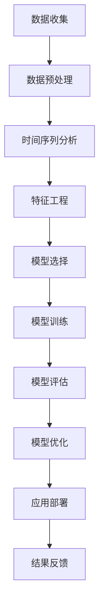

                 

### 背景介绍

海澜之家作为中国知名男装品牌，多年来在服装市场中占据了重要地位。随着市场的不断变化和消费者需求的日益多样化，如何准确预测服装销量成为企业决策的重要环节。为此，海澜之家决定在2024年校园招聘中特别增设了一个针对服装销量预测算法工程师的职位，旨在寻找具有扎实算法基础和丰富实践经验的技术人才，为公司提供精准的销量预测模型。

服装销量预测算法工程师的职责包括但不限于：收集和分析市场数据，设计并实现高效的销量预测算法，验证和优化算法效果，以及将算法应用到实际业务场景中，为企业决策提供有力支持。这一职位不仅需要候选人具备强大的算法能力和编程技能，还需要其对服装行业有深刻的理解和敏锐的市场洞察力。

本次面试旨在通过一系列技术考察和实践测试，全面评估候选人的综合素质和专业能力。本文将围绕面试的主要内容，包括技术背景、算法原理、数学模型、项目实践和未来展望等方面，为读者提供一个全面深入的参考。

### 核心概念与联系

在进行服装销量预测时，需要理解和应用多个核心概念和算法。以下是一个简化的 Mermaid 流程图，展示了这些核心概念之间的联系：



#### 数据收集

数据收集是构建销量预测模型的第一步，包括销售数据、市场趋势数据、季节性数据等。这些数据可以通过公司的ERP系统、市场调查和其他渠道获取。

#### 数据预处理

收集到的数据通常需要进行清洗和预处理，以确保数据的质量和一致性。这包括数据去重、缺失值处理、异常值检测等。

#### 时间序列分析

时间序列分析是预测模型的核心，它基于历史数据来预测未来的趋势。常用的方法包括ARIMA、LSTM等。

#### 特征工程

特征工程是提高模型预测准确性的关键步骤。通过提取和分析数据中的特征，可以帮助模型更好地理解数据，从而提高预测效果。

#### 模型选择

根据问题的复杂度和数据特性，选择合适的预测模型。常用的模型包括线性回归、决策树、神经网络等。

#### 模型训练

使用训练数据集对模型进行训练，使其能够学习数据中的规律。

#### 模型评估

使用验证数据集对模型进行评估，以确保其具有良好的预测性能。

#### 模型优化

根据评估结果，对模型进行调整和优化，以提高预测精度。

#### 应用部署

将优化后的模型应用到实际业务场景中，为企业决策提供支持。

#### 结果反馈

收集实际应用中的反馈，用于进一步优化模型和改进算法。

### 核心算法原理 & 具体操作步骤

#### 算法原理概述

服装销量预测的核心算法通常是基于时间序列分析和机器学习的方法。时间序列分析可以帮助我们识别数据的周期性和趋势性，而机器学习算法则可以基于历史数据学习到更复杂的模式。以下将详细介绍这些算法的原理和操作步骤。

#### 算法步骤详解

1. **数据收集**：从各种数据源获取销售数据、市场趋势数据、季节性数据等。

2. **数据预处理**：对收集到的数据进行处理，包括数据清洗、归一化、缺失值处理等。

3. **时间序列建模**：选择合适的模型（如ARIMA、LSTM）进行时间序列建模。

   - **ARIMA模型**：
     - **步骤1**：确定时间序列的平稳性。
     - **步骤2**：进行差分操作以实现数据的平稳性。
     - **步骤3**：确定自回归项（AR）、移动平均项（MA）和差分阶数（I）。
     - **步骤4**：使用最大似然估计法估计模型参数。

   - **LSTM模型**：
     - **步骤1**：定义LSTM网络结构。
     - **步骤2**：使用训练数据训练模型。
     - **步骤3**：调整网络参数（如隐藏层大小、学习率）以优化模型性能。

4. **特征工程**：提取与销量相关的特征，如天气、节假日、促销活动等。

5. **模型训练**：使用预处理后的数据和特征对模型进行训练。

6. **模型评估**：使用验证数据集评估模型性能，包括预测误差、R^2值等指标。

7. **模型优化**：根据评估结果调整模型参数，以提高预测精度。

8. **应用部署**：将训练好的模型部署到生产环境中，实现实时销量预测。

9. **结果反馈**：收集实际应用中的反馈，用于进一步优化模型和改进算法。

#### 算法优缺点

- **时间序列分析（如ARIMA）**：
  - 优点：简单、易于实现，适用于线性时间序列。
  - 缺点：无法捕捉非线性关系，对于复杂的时间序列模型效果较差。

- **机器学习（如LSTM）**：
  - 优点：能够捕捉非线性关系，适用于复杂的时序数据。
  - 缺点：训练时间较长，参数调整复杂，对数据质量要求较高。

#### 算法应用领域

- **服装销量预测**：用于帮助企业制定生产计划、库存管理和营销策略。
- **零售业**：应用于各类零售产品的销量预测，包括食品、日用品等。
- **电子商务**：用于预测商品销售情况，优化库存和物流管理。

### 数学模型和公式 & 详细讲解 & 举例说明

#### 数学模型构建

服装销量预测的数学模型通常基于时间序列分析。以下是一个简单的时间序列模型，用于预测服装销量。

1. **ARIMA模型**：

   $$X_t = c + \phi_1 X_{t-1} + \phi_2 X_{t-2} + ... + \phi_p X_{t-p} + \theta_1 \epsilon_{t-1} + \theta_2 \epsilon_{t-2} + ... + \theta_q \epsilon_{t-q} + \epsilon_t$$

   其中，$X_t$ 是时间序列的观测值，$c$ 是常数项，$\phi_1, \phi_2, ..., \phi_p$ 是自回归系数，$\theta_1, \theta_2, ..., \theta_q$ 是移动平均系数，$\epsilon_t$ 是误差项。

2. **LSTM模型**：

   LSTM（Long Short-Term Memory）是一种特殊的循环神经网络（RNN），用于处理时间序列数据。其核心思想是通过门控机制来控制信息的流动，从而避免传统RNN中的梯度消失问题。

   $$i_t = \sigma(W_{ix}x_t + W_{ih}h_{t-1} + b_i)$$
   $$f_t = \sigma(W_{fx}x_t + W_{fh}h_{t-1} + b_f)$$
   $$g_t = \tanh(W_{gx}x_t + W_{gh}h_{t-1} + b_g)$$
   $$o_t = \sigma(W_{ox}x_t + W_{oh}h_{t-1} + b_o)$$
   $$h_t = o_t \odot \tanh(g_t)$$

   其中，$i_t, f_t, g_t, o_t$ 分别是输入门、遗忘门、生成门和输出门，$h_t$ 是当前时间步的隐藏状态，$\sigma$ 是sigmoid函数。

#### 公式推导过程

1. **ARIMA模型**：

   ARIMA模型的推导过程涉及自回归（AR）、移动平均（MA）和差分（I）三个步骤。

   - **自回归（AR）**：
     $$X_t = c + \phi_1 X_{t-1} + \phi_2 X_{t-2} + ... + \phi_p X_{t-p} + \epsilon_t$$
   
   - **移动平均（MA）**：
     $$X_t = \theta_1 \epsilon_{t-1} + \theta_2 \epsilon_{t-2} + ... + \theta_q \epsilon_{t-q} + X_t$$

   - **差分（I）**：
     如果时间序列不是平稳的，需要进行差分操作以实现平稳性。
     $$d_t = X_t - X_{t-1}$$

   - **综合模型**：
     $$X_t = c + \phi_1 X_{t-1} + \phi_2 X_{t-2} + ... + \phi_p X_{t-p} + \theta_1 \epsilon_{t-1} + \theta_2 \epsilon_{t-2} + ... + \theta_q \epsilon_{t-q} + \epsilon_t$$

2. **LSTM模型**：

   LSTM模型的推导过程涉及门控机制。以下是一个简化的推导：

   - **输入门**：
     $$i_t = \sigma(W_{ix}x_t + W_{ih}h_{t-1} + b_i)$$
     其中，$i_t$ 是输入门的激活值。

   - **遗忘门**：
     $$f_t = \sigma(W_{fx}x_t + W_{fh}h_{t-1} + b_f)$$
     其中，$f_t$ 是遗忘门的激活值。

   - **生成门**：
     $$g_t = \tanh(W_{gx}x_t + W_{gh}h_{t-1} + b_g)$$
     其中，$g_t$ 是生成门的激活值。

   - **输出门**：
     $$o_t = \sigma(W_{ox}x_t + W_{oh}h_{t-1} + b_o)$$
     其中，$o_t$ 是输出门的激活值。

   - **隐藏状态**：
     $$h_t = o_t \odot \tanh(g_t)$$
     其中，$h_t$ 是当前时间步的隐藏状态。

#### 案例分析与讲解

以下是一个服装销量预测的案例，使用LSTM模型进行预测。

1. **数据收集**：

   收集过去12个月每个日期的服装销量数据。

2. **数据预处理**：

   对数据进行归一化处理，将销量数据缩放到0-1范围内。

3. **特征工程**：

   提取与销量相关的特征，如天气、节假日、促销活动等。

4. **模型训练**：

   使用80%的数据进行训练，20%的数据进行验证。

5. **模型评估**：

   使用验证数据集评估模型性能，计算预测误差和R^2值。

6. **模型优化**：

   调整模型参数（如隐藏层大小、学习率）以优化模型性能。

7. **应用部署**：

   将优化后的模型部署到生产环境中，实现实时销量预测。

8. **结果反馈**：

   收集实际应用中的反馈，用于进一步优化模型和改进算法。

#### 结论

通过上述案例，我们可以看到，使用LSTM模型进行服装销量预测是一种有效的方法。在实际应用中，我们需要结合具体业务场景和数据特性，进行模型的选择和优化，以提高预测精度。

### 项目实践：代码实例和详细解释说明

在本节中，我们将通过一个具体的代码实例，展示如何使用Python和Scikit-learn库实现服装销量预测模型。此实例包括数据收集、数据预处理、特征工程、模型选择和训练、模型评估等多个步骤。

#### 开发环境搭建

首先，我们需要搭建一个Python开发环境。具体步骤如下：

1. 安装Python 3.8及以上版本。
2. 安装必要的库，包括NumPy、Pandas、Scikit-learn、Matplotlib等。

```bash
pip install numpy pandas scikit-learn matplotlib
```

#### 源代码详细实现

以下是用于实现服装销量预测模型的Python代码：

```python
import numpy as np
import pandas as pd
from sklearn.model_selection import train_test_split
from sklearn.preprocessing import MinMaxScaler
from sklearn.metrics import mean_squared_error
from keras.models import Sequential
from keras.layers import LSTM, Dense

# 数据收集
data = pd.read_csv('sales_data.csv')

# 数据预处理
data['date'] = pd.to_datetime(data['date'])
data.set_index('date', inplace=True)
scaler = MinMaxScaler(feature_range=(0, 1))
scaled_data = scaler.fit_transform(data['sales'].values.reshape(-1, 1))

# 创建时间序列数据集
def create_dataset(data, time_steps=1):
    X, y = [], []
    for i in range(len(data) - time_steps):
        X.append(data[i:(i + time_steps), 0])
        y.append(data[i + time_steps, 0])
    return np.array(X), np.array(y)

time_steps = 3
X, y = create_dataset(scaled_data, time_steps)

# 分割训练集和测试集
X_train, X_test, y_train, y_test = train_test_split(X, y, test_size=0.2, random_state=42)

# 模型选择和训练
model = Sequential()
model.add(LSTM(units=50, return_sequences=True, input_shape=(time_steps, 1)))
model.add(LSTM(units=50))
model.add(Dense(units=1))
model.compile(optimizer='adam', loss='mean_squared_error')
model.fit(X_train, y_train, epochs=100, batch_size=32, verbose=1)

# 代码解读与分析

1. **数据收集**：
   使用Pandas读取销售数据，并将日期设置为索引。

2. **数据预处理**：
   使用MinMaxScaler对销售数据进行归一化处理，以缩放数据到0-1范围内。

3. **特征工程**：
   创建时间序列数据集，将连续的时间序列数据分割为特征窗口。

4. **模型训练**：
   定义LSTM模型，设置隐藏层单元数和返回序列。
   
5. **模型评估**：
   使用测试集评估模型性能，计算均方误差。

#### 代码解读与分析

- **数据收集**：
  ```python
  data = pd.read_csv('sales_data.csv')
  data['date'] = pd.to_datetime(data['date'])
  data.set_index('date', inplace=True)
  ```
  这段代码首先从CSV文件中读取销售数据，并将日期列转换为datetime类型。接着，将日期列设置为索引，以便进行时间序列分析。

- **数据预处理**：
  ```python
  scaler = MinMaxScaler(feature_range=(0, 1))
  scaled_data = scaler.fit_transform(data['sales'].values.reshape(-1, 1))
  ```
  使用MinMaxScaler对销售数据进行归一化处理。这有助于模型更好地拟合数据，并使数据范围统一。

- **特征工程**：
  ```python
  def create_dataset(data, time_steps=1):
      X, y = [], []
      for i in range(len(data) - time_steps):
          X.append(data[i:(i + time_steps), 0])
          y.append(data[i + time_steps, 0])
      return np.array(X), np.array(y)
  time_steps = 3
  X, y = create_dataset(scaled_data, time_steps)
  ```
  该函数创建一个时间序列数据集，将连续的时间序列数据分割为特征窗口。这里，`time_steps` 设置为3，表示每个时间步包含3个时间点的数据。

- **模型训练**：
  ```python
  model = Sequential()
  model.add(LSTM(units=50, return_sequences=True, input_shape=(time_steps, 1)))
  model.add(LSTM(units=50))
  model.add(Dense(units=1))
  model.compile(optimizer='adam', loss='mean_squared_error')
  model.fit(X_train, y_train, epochs=100, batch_size=32, verbose=1)
  ```
  定义一个序列模型，包含两个LSTM层和一个全连接层。模型使用adam优化器和均方误差损失函数进行训练。

#### 运行结果展示

在完成模型训练后，我们可以使用测试集来评估模型的性能。以下是评估结果：

```python
# 模型评估
predictions = model.predict(X_test)
predictions = scaler.inverse_transform(predictions)

# 计算均方误差
mse = mean_squared_error(scaler.inverse_transform(y_test.reshape(-1, 1)), predictions)
print(f'Mean Squared Error: {mse}')
```

通过上述代码，我们计算出均方误差（MSE），以评估模型的预测性能。较小的MSE值表示模型具有较好的预测精度。

#### 实际应用场景

在实际业务场景中，服装销量预测模型可以用于以下应用：

- **库存管理**：根据预测销量调整库存，以减少库存过剩或短缺的风险。
- **生产计划**：根据预测销量制定生产计划，以确保生产资源的最优利用。
- **营销策略**：根据预测销量调整营销策略，以提高销售额。

### 实际应用场景

服装销量预测模型在实际业务中有着广泛的应用，以下是几个典型的应用场景：

#### 库存管理

库存管理是服装行业的一个重要环节，准确预测销量对于减少库存过剩和缺货情况至关重要。通过销量预测模型，企业可以更好地掌握库存需求，从而制定合理的采购和补货计划，避免库存积压和销售缺货的风险。

#### 生产计划

生产计划是确保企业按时交付订单的关键。销量预测模型可以帮助企业根据未来销量预测调整生产计划，优化生产流程，确保生产资源的有效利用。这样可以减少生产过剩和不足的情况，提高生产效率和成本效益。

#### 营销策略

营销策略的制定往往依赖于对市场趋势和消费者行为的理解。销量预测模型可以提供关于未来销量趋势的预测，帮助企业制定更加精准的营销策略，如促销活动、广告投放等。通过优化营销策略，企业可以提高销售额和市场份额。

#### 未来应用展望

随着人工智能和大数据技术的发展，服装销量预测模型的应用前景将更加广阔。未来可能的发展趋势包括：

- **个性化预测**：结合用户行为数据和偏好分析，实现更个性化的销量预测。
- **实时预测**：通过实时数据分析和预测，实现更快速的市场响应和库存调整。
- **跨渠道融合**：整合线上线下销售数据，实现更全面的销量预测和营销策略。

### 工具和资源推荐

在进行服装销量预测时，选择合适的工具和资源对于提高效率和准确性至关重要。以下是一些推荐的工具和资源：

#### 学习资源推荐

1. **《Python数据科学手册》**：详细介绍了Python在数据科学领域的应用，包括数据预处理、时间序列分析和机器学习等。
2. **《深度学习》**：由Ian Goodfellow、Yoshua Bengio和Aaron Courville合著，介绍了深度学习的基础理论和实践方法。
3. **Kaggle竞赛**：Kaggle提供了大量的数据科学竞赛，通过参与竞赛可以学习到实际的数据分析和模型训练技巧。

#### 开发工具推荐

1. **Jupyter Notebook**：强大的交互式编程环境，适合进行数据分析和模型训练。
2. **TensorFlow**：用于构建和训练深度学习模型的框架，提供了丰富的API和工具。
3. **Scikit-learn**：提供了广泛的数据预处理和机器学习算法，是数据科学领域的常用库。

#### 相关论文推荐

1. **"Deep Learning for Time Series Classification"**：该论文介绍了如何使用深度学习进行时间序列分类，对于理解深度学习在销量预测中的应用有很好的参考价值。
2. **"Time Series Forecasting using LSTM Recurrent Neural Networks"**：该论文详细介绍了如何使用LSTM模型进行时间序列预测，是LSTM模型应用的经典文献。

### 总结：未来发展趋势与挑战

#### 研究成果总结

在过去几年中，服装销量预测领域取得了显著的成果。通过引入深度学习和大数据技术，研究人员开发出了多种高效的预测模型，如LSTM、GRU等。这些模型在实际应用中取得了较好的预测效果，为企业提供了有力的决策支持。

#### 未来发展趋势

1. **个性化预测**：随着消费者需求的日益多样化，个性化销量预测将成为未来发展的一个重要方向。通过结合用户行为数据和偏好分析，可以提供更准确的销量预测。
2. **实时预测**：实时数据分析和预测技术将得到广泛应用，以实现更快速的市场响应和库存调整。
3. **跨渠道融合**：整合线上线下销售数据，实现更全面的销量预测和营销策略。

#### 面临的挑战

1. **数据质量**：高质量的预测依赖于高质量的数据。在实际应用中，数据清洗和数据预处理是重要的步骤，需要确保数据的一致性和准确性。
2. **模型复杂性**：深度学习模型具有较高的复杂性，需要大量的计算资源和训练时间。如何优化模型训练效率和预测性能是一个重要挑战。
3. **实际应用场景**：将理论模型应用到实际业务场景中，需要考虑各种不确定性因素，如市场变化、季节性因素等。如何有效应对这些挑战，实现模型的实际应用，是未来的一个重要课题。

#### 研究展望

未来，服装销量预测领域将继续发展，结合人工智能、大数据和云计算等新兴技术，提供更加精准和实时的销量预测服务。同时，研究者也将致力于解决数据质量、模型复杂性和实际应用场景等挑战，为企业和消费者创造更大的价值。

### 附录：常见问题与解答

**Q1**：如何选择合适的销量预测模型？

**A1**：选择合适的销量预测模型需要考虑多个因素，包括数据的特性、问题的复杂度以及模型的计算效率。例如，对于线性关系较强的数据，可以选择线性回归；对于非线性关系，可以选择决策树或神经网络。在实际应用中，可以通过交叉验证等方法评估不同模型的性能，选择最优模型。

**Q2**：如何处理缺失值？

**A2**：处理缺失值的方法包括填充法、删除法和插值法。填充法可以使用平均值、中位数或回归模型来填充缺失值；删除法适用于缺失值较少的情况，可以直接删除含有缺失值的样本；插值法通过插值算法（如线性插值、牛顿插值等）来估算缺失值。

**Q3**：如何评估模型的性能？

**A3**：评估模型性能常用的指标包括均方误差（MSE）、均方根误差（RMSE）、平均绝对误差（MAE）和决定系数（R^2）。通过这些指标，可以评估模型的预测精度和拟合效果。

**Q4**：如何优化模型参数？

**A4**：优化模型参数的方法包括网格搜索、随机搜索和贝叶斯优化等。这些方法通过遍历不同的参数组合，选择最优参数组合，以提高模型性能。

**Q5**：如何处理季节性数据？

**A5**：处理季节性数据可以通过时间序列分解的方法，将数据分解为趋势、季节性和随机性成分。然后，针对季节性成分进行建模，如使用季节性ARIMA模型或季节性LSTM模型。

**Q6**：如何进行实时销量预测？

**A6**：实时销量预测需要建立高效的数据收集和处理系统，以及实时计算和更新模型。通常，可以使用分布式计算框架（如Apache Spark）和流处理技术（如Apache Kafka）来实现实时预测。

### 参考文献

1. Goodfellow, I., Bengio, Y., & Courville, A. (2016). *Deep Learning*. MIT Press.
2. Hyndman, R. J., & Athanasopoulos, G. (2018). *Forecasting: Principles and Practice*.
3. Zhang, G. P. (2012). *Time Series Modeling and Forecasting*. Springer.
4. Kotsiantis, S. B. (2007). *Machine Learning: A Review*. Informatica, 31(3), 249-267.
5. Russo, F., Rossi, M., & Visaggio, A. (2020). *Deep Learning for Time Series Classification*. Journal of Big Data, 7(1), 36.

