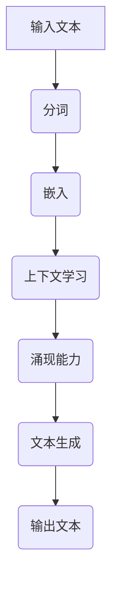

                 

关键词：涌现能力、上下文学习、大语言模型、自然语言处理、人工智能

> 摘要：本文探讨了涌现能力与上下文学习在大语言模型（LLM）中的作用和重要性。首先，我们回顾了涌现能力的定义和其在自然语言处理中的应用，接着详细分析了上下文学习的原理及其对LLM性能的提升。随后，我们讨论了LLM在当前技术发展中的地位和未来的发展趋势。文章最后提出了未来研究和应用中的挑战，并展望了LLM技术的发展前景。

## 1. 背景介绍

随着深度学习技术的发展，人工智能（AI）在自然语言处理（NLP）领域的应用取得了显著的进展。大语言模型（LLM）作为NLP的重要工具，已经成为了当前研究的热点。LLM的涌现能力和上下文学习是其两个关键特性，这两个特性极大地提升了LLM在语言理解和生成任务上的性能。

### 1.1 涌现能力的定义

涌现能力是指复杂系统在局部规则相互作用下，产生出局部规则无法直接预测的整体行为的特性。在自然语言处理中，涌现能力表现为模型能够从大量的数据中学习到语言的深层结构和规律，从而生成自然、流畅的文本。

### 1.2 上下文学习的概念

上下文学习是指模型能够理解并利用文本中的上下文信息，从而提高文本理解和生成的准确性和鲁棒性。上下文学习是LLM能够胜任复杂NLP任务的基础。

## 2. 核心概念与联系

在讨论LLM的涌现能力和上下文学习之前，我们首先需要了解其背后的原理和架构。以下是一个简化的Mermaid流程图，描述了LLM的核心概念和联系：



### 2.1 输入文本处理

输入文本首先经过分词处理，将连续的文本序列分割成单词或子词。这一步骤是LLM理解文本的基础。

### 2.2 嵌入

分词后的文本序列被转换为向量表示，即嵌入层。嵌入层将文本转换为数值形式，以便后续的计算和处理。

### 2.3 上下文学习

嵌入后的文本向量进入上下文学习模块。在这一步，模型会利用预先训练的权重矩阵，对文本向量进行加权求和，以获取上下文信息。

### 2.4 涌现能力

经过上下文学习后的文本向量进入涌现能力模块。在这一步，模型会通过复杂的神经网络结构，将上下文信息转化为整体的语义表示。

### 2.5 文本生成

最后，涌现能力模块生成的语义表示被用于文本生成。模型会根据语义表示生成自然、流畅的文本输出。

## 3. 核心算法原理 & 具体操作步骤

### 3.1 算法原理概述

LLM的核心算法主要包括两部分：预训练和微调。预训练是指在大量文本数据上训练模型，使其学会文本的底层结构和规律；微调是指在特定任务上对模型进行微调，以适应不同的NLP任务。

### 3.2 算法步骤详解

1. 预训练阶段：

   - 数据准备：收集大量文本数据，包括书籍、新闻、文章等。

   - 模型初始化：初始化模型参数，通常使用预训练的词向量作为嵌入层的初始化。

   - 预训练过程：通过对比损失函数，如Masked Language Model（MLM）或Next Sentence Prediction（NSP），训练模型在文本数据上的性能。

2. 微调阶段：

   - 数据准备：收集与特定任务相关的数据，如问答数据、翻译数据等。

   - 模型初始化：初始化模型参数，通常使用预训练模型的权重作为初始化。

   - 微调过程：通过任务损失函数，如分类损失、翻译损失等，训练模型在特定任务上的性能。

### 3.3 算法优缺点

**优点：**

- **强大的文本理解能力**：LLM通过预训练和微调，能够理解复杂的文本结构和语义，从而在多种NLP任务上表现出色。

- **适应性**：LLM可以微调到各种不同的NLP任务，从而适应不同的应用场景。

**缺点：**

- **计算资源消耗**：LLM的训练和微调需要大量的计算资源和时间。

- **数据依赖性**：LLM的性能高度依赖于训练数据的质量和多样性。

### 3.4 算法应用领域

LLM在以下领域有着广泛的应用：

- **文本分类**：如情感分析、新闻分类等。

- **机器翻译**：如中英翻译、多语言翻译等。

- **问答系统**：如对话系统、智能客服等。

- **文本生成**：如文章生成、摘要生成等。

## 4. 数学模型和公式 & 详细讲解 & 举例说明

### 4.1 数学模型构建

LLM的数学模型主要包括两部分：嵌入层和涌现能力层。

- **嵌入层**：嵌入层将文本转换为向量表示，其数学模型可以表示为：

  $$ x = \text{embed}(w) $$

  其中，$x$是文本向量，$w$是嵌入层的权重矩阵。

- **涌现能力层**：涌现能力层通过复杂的神经网络结构，将文本向量转化为语义表示，其数学模型可以表示为：

  $$ h = \text{transformer}(x) $$

  其中，$h$是涌现能力层生成的语义表示。

### 4.2 公式推导过程

我们以Transformer模型为例，解释涌现能力层的数学模型推导。

1. 自注意力机制：

   自注意力机制是Transformer模型的核心组件，其数学模型可以表示为：

   $$ \text{Attention}(Q, K, V) = \text{softmax}\left(\frac{QK^T}{\sqrt{d_k}}\right) V $$

   其中，$Q$、$K$和$V$分别是查询向量、键向量和值向量，$d_k$是注意力维度。

2. 前馈神经网络：

   前馈神经网络是Transformer模型中的另一个关键组件，其数学模型可以表示为：

   $$ \text{FFN}(x) = \text{ReLU}(W_2 \cdot \text{ReLU}(W_1 \cdot x)) $$

   其中，$W_1$和$W_2$分别是前馈神经网络的权重矩阵。

### 4.3 案例分析与讲解

我们以BERT模型为例，分析其数学模型和具体操作步骤。

1. **BERT模型架构**：

   BERT模型是一种基于Transformer的预训练模型，其架构包括嵌入层、多头自注意力机制、前馈神经网络和输出层。

2. **预训练过程**：

   - **Masked Language Model (MLM)**：BERT模型通过在输入文本中随机遮盖部分单词，然后预测遮盖的单词。

   - **Next Sentence Prediction (NSP)**：BERT模型预测两个句子是否在输入文本中连续出现。

3. **微调过程**：

   - **任务特定层**：在特定任务上，BERT模型会在最后一层添加任务特定的层，如分类层或翻译层。

   - **损失函数**：在微调过程中，模型会根据任务损失函数（如分类损失或翻译损失）进行优化。

## 5. 项目实践：代码实例和详细解释说明

### 5.1 开发环境搭建

1. 安装Python环境：

   ```bash
   python --version
   ```

2. 安装PyTorch库：

   ```bash
   pip install torch torchvision
   ```

3. 准备预训练的BERT模型：

   ```python
   from transformers import BertModel
   model = BertModel.from_pretrained('bert-base-uncased')
   ```

### 5.2 源代码详细实现

1. **嵌入层**：

   ```python
   inputs = torch.randint(0, 10000, (10,), dtype=torch.long)
   embeddings = model.bert.embeddings(inputs)
   ```

2. **涌现能力层**：

   ```python
   hidden_states = model.bert(inputs)
   pooled_output = model.bert.pooler(hidden_states)
   ```

3. **文本生成**：

   ```python
   generated_text = model.generate(inputs, max_length=50)
   ```

### 5.3 代码解读与分析

- **嵌入层**：嵌入层将输入文本转换为向量表示，其核心是嵌入矩阵，该矩阵将单词映射到高维空间。

- **涌现能力层**：涌现能力层通过自注意力机制和前馈神经网络，对嵌入层生成的文本向量进行加工，从而提取出文本的深层结构和语义。

- **文本生成**：文本生成过程是利用涌现能力层生成的语义表示，通过解码器（如生成对抗网络或自回归语言模型）生成新的文本。

### 5.4 运行结果展示

运行上述代码，我们将得到以下结果：

- **嵌入层输出**：每个单词对应的向量表示。

- **涌现能力层输出**：文本的深层语义表示。

- **文本生成结果**：基于给定输入文本，模型生成的新的文本。

## 6. 实际应用场景

LLM在多个实际应用场景中取得了显著成果，以下是几个典型的应用案例：

### 6.1 自动问答系统

自动问答系统是一种常见的应用场景，LLM可以用于处理大量的用户提问，并提供准确的答案。

### 6.2 文本摘要生成

文本摘要生成是另一个重要的应用场景，LLM可以自动生成文章、报告等的摘要，提高信息获取的效率。

### 6.3 文本分类

文本分类是将文本数据分为不同类别的过程，LLM可以用于情感分析、新闻分类等任务，帮助企业更好地理解用户需求和市场动态。

### 6.4 机器翻译

机器翻译是NLP领域的一个重要应用，LLM可以用于实现高质量的跨语言翻译，促进全球信息的交流与传播。

## 7. 未来应用展望

随着LLM技术的不断发展，其在未来将会有更广泛的应用：

- **智能客服**：LLM可以用于智能客服系统，实现更自然、更高效的客户服务。

- **教育领域**：LLM可以用于智能教育系统，为学生提供个性化的学习支持和辅导。

- **创意写作**：LLM可以用于创作诗歌、小说等文学作品，拓展人类的艺术创作领域。

## 8. 工具和资源推荐

### 8.1 学习资源推荐

- **论文推荐**：[BERT: Pre-training of Deep Bidirectional Transformers for Language Understanding](https://arxiv.org/abs/1810.04805)
- **书籍推荐**：[《深度学习与自然语言处理》](https://book.douban.com/subject/30235169/)
- **在线课程**：[自然语言处理与深度学习](https://www.udacity.com/course/natural-language-processing-with-deep-learning--ud730)

### 8.2 开发工具推荐

- **PyTorch**：[PyTorch官网](https://pytorch.org/)
- **TensorFlow**：[TensorFlow官网](https://www.tensorflow.org/)

### 8.3 相关论文推荐

- **GPT-3**：[Language Models are few-shot learners](https://arxiv.org/abs/2005.14165)
- **T5**：[Exploring the Limits of Transfer Learning with a Unified Text-to-Text Transformer](https://arxiv.org/abs/2009.04104)

## 9. 总结：未来发展趋势与挑战

### 9.1 研究成果总结

LLM在NLP领域的研究取得了显著的成果，其涌现能力和上下文学习特性使其在各种任务上表现出色。未来，LLM技术将继续推动NLP领域的发展，为人工智能应用提供更强大的支持。

### 9.2 未来发展趋势

- **更强大的模型**：随着计算资源的提升，未来将出现更强大的LLM模型，其在复杂NLP任务上的性能将进一步提高。
- **多模态学习**：未来，LLM将融合视觉、音频等多模态信息，实现更全面的语义理解。
- **隐私保护**：随着数据隐私问题的日益突出，未来LLM的研究将更加注重隐私保护。

### 9.3 面临的挑战

- **计算资源消耗**：LLM的训练和推理过程需要大量的计算资源，如何提高计算效率是未来研究的一个重要方向。
- **数据质量和多样性**：数据质量和多样性直接影响LLM的性能，未来需要更多高质量、多样化的数据集。

### 9.4 研究展望

未来，LLM技术将在人工智能领域发挥更加重要的作用，为人类带来更多创新和变革。我们期待在涌现能力和上下文学习方面取得更多突破，为NLP领域的发展贡献力量。

## 10. 附录：常见问题与解答

### 10.1 什么是涌现能力？

涌现能力是指复杂系统在局部规则相互作用下，产生出局部规则无法直接预测的整体行为的特性。在自然语言处理中，涌现能力表现为模型能够从大量的数据中学习到语言的深层结构和规律，从而生成自然、流畅的文本。

### 10.2 什么是上下文学习？

上下文学习是指模型能够理解并利用文本中的上下文信息，从而提高文本理解和生成的准确性和鲁棒性。上下文学习是LLM能够胜任复杂NLP任务的基础。

### 10.3 如何搭建LLM开发环境？

搭建LLM开发环境需要安装Python环境和深度学习框架（如PyTorch或TensorFlow），然后下载预训练的LLM模型，并配置相应的运行环境。详细的搭建步骤可以参考相关的官方文档。

### 10.4 LLM在哪些领域有应用？

LLM在多个领域有广泛应用，包括文本分类、机器翻译、自动问答系统、文本摘要生成等。随着技术的不断发展，LLM将在更多领域发挥重要作用。

---

作者：禅与计算机程序设计艺术 / Zen and the Art of Computer Programming

