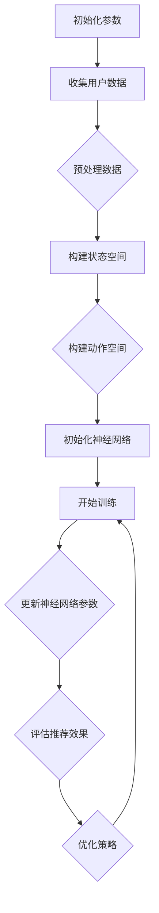

                 

关键词：深度学习，Q-learning，色彩推荐，强化学习，图像处理，人工智能

> 摘要：本文介绍了深度 Q-learning 算法在色彩推荐中的应用。通过将 Q-learning 算法与深度学习相结合，我们能够训练出一个能够根据用户偏好和场景需求进行色彩推荐的智能系统。本文详细探讨了深度 Q-learning 算法的原理、实现过程及其在不同应用场景中的效果。

## 1. 背景介绍

色彩推荐是人工智能领域中的一个重要研究方向。在日常生活中，色彩的选择往往影响人们的情绪和审美体验。例如，在线购物平台上的商品推荐系统需要根据用户的购物记录和偏好推荐与之相匹配的色彩，以提高用户的购买满意度。然而，传统的色彩推荐方法通常基于规则或者统计方法，缺乏灵活性和准确性。

近年来，随着深度学习技术的不断发展，强化学习算法在人工智能领域取得了显著成果。Q-learning 是一种经典的强化学习算法，其核心思想是通过学习状态与动作的价值函数，从而实现最优策略的选取。将 Q-learning 与深度学习相结合，可以构建出一个具有自主学习能力的智能系统，从而在色彩推荐任务中取得更好的效果。

## 2. 核心概念与联系

### 2.1 深度 Q-learning 算法

深度 Q-learning（DQN）是一种基于 Q-learning 的深度强化学习算法。与传统 Q-learning 算法相比，DQN 使用深度神经网络来近似 Q 值函数，从而能够处理高维状态空间和动作空间。


在 DQN 算法中，神经网络接收状态作为输入，输出动作的价值。通过不断地训练，神经网络能够学习到每个状态下的最佳动作。

### 2.2 色彩推荐任务

在色彩推荐任务中，状态空间包括用户的历史购物记录、商品的颜色属性、以及当前场景的背景信息。动作空间则包括推荐的颜色集合。目标函数是通过最大化用户满意度来优化推荐策略。

### 2.3 Mermaid 流程图



## 3. 核心算法原理 & 具体操作步骤

### 3.1 算法原理概述

DQN 算法的核心思想是学习一个价值函数 $V^*(s)$，表示在状态 $s$ 下执行最佳动作的期望回报。通过不断更新价值函数，DQN 能够找到最优策略。

### 3.2 算法步骤详解

#### 3.2.1 数据预处理

1. 收集用户购物记录、商品颜色属性和场景背景信息。
2. 对数据进行去噪和归一化处理。

#### 3.2.2 构建状态空间

1. 状态 $s$ 由用户历史购物记录、商品颜色属性和场景背景信息组成。
2. 状态编码可以使用独热编码或者嵌入编码。

#### 3.2.3 构建动作空间

1. 动作 $a$ 是一个颜色集合。
2. 颜色集合可以用一维向量表示。

#### 3.2.4 初始化神经网络

1. 使用深度神经网络近似 Q 值函数。
2. 初始化神经网络权重。

#### 3.2.5 开始训练

1. 选择初始状态 $s$。
2. 根据当前状态选择动作 $a$。
3. 执行动作，获取奖励 $r$ 和下一个状态 $s'$。
4. 更新 Q 值函数。

### 3.3 算法优缺点

#### 优点：

1. 能够处理高维状态空间和动作空间。
2. 具有自主学习能力。

#### 缺点：

1. 需要大量的训练数据。
2. 训练过程可能存在不稳定性。

### 3.4 算法应用领域

DQN 算法在色彩推荐、游戏智能体、自动驾驶等领域具有广泛的应用前景。

## 4. 数学模型和公式 & 详细讲解 & 举例说明

### 4.1 数学模型构建

#### 4.1.1 Q 值函数

Q 值函数 $Q^*(s, a)$ 表示在状态 $s$ 下执行动作 $a$ 的最优回报。

$$
Q^*(s, a) = \sum_{s'} P(s'|s, a) \cdot \max_{a'} Q^*(s', a')
$$

#### 4.1.2 策略迭代

策略 $\pi$ 是一个概率分布，表示在状态 $s$ 下选择动作 $a$ 的概率。

$$
\pi(a|s) = \frac{e^{Q^*(s, a)}}{\sum_{a'} e^{Q^*(s, a')}}
$$

#### 4.1.3 基于经验回放的 DQN

为了避免训练数据的关联性，DQN 引入了经验回放机制。

$$
Q(s, a) \leftarrow Q(s, a) + \alpha [r + \gamma \max_{a'} Q(s', a') - Q(s, a)]
$$

其中，$\alpha$ 是学习率，$\gamma$ 是折扣因子。

### 4.2 公式推导过程

#### 4.2.1 Q-learning

Q-learning 的目标是最小化误差函数：

$$
J(\theta) = \sum_{s, a} (Q^*(s, a) - Q(s, a))^2
$$

使用梯度下降法更新 Q 值函数：

$$
\theta \leftarrow \theta - \alpha \nabla_\theta J(\theta)
$$

#### 4.2.2 DQN

DQN 使用深度神经网络近似 Q 值函数：

$$
Q(s, a) = \phi(s) \theta
$$

其中，$\phi(s)$ 是状态编码函数，$\theta$ 是神经网络参数。

### 4.3 案例分析与讲解

假设我们有一个用户历史购物记录，其中包含商品的颜色属性。我们的目标是根据这些记录推荐一种新的颜色。

#### 4.3.1 数据预处理

1. 收集用户购物记录。
2. 对颜色属性进行独热编码。

```latex
s = \begin{bmatrix}
    1 & 0 & 0 & 0 & 0 & 0 \\
    0 & 1 & 0 & 0 & 0 & 0 \\
    \vdots & \vdots & \vdots & \vdots & \vdots & \vdots \\
    0 & 0 & 0 & 0 & 0 & 1
\end{bmatrix}
```

#### 4.3.2 状态编码

使用嵌入编码对状态进行编码：

```latex
\phi(s) = \begin{bmatrix}
    \phi_1(s) \\
    \phi_2(s) \\
    \vdots \\
    \phi_n(s)
\end{bmatrix}
```

#### 4.3.3 动作空间

假设动作空间包括 6 种颜色：

```latex
a = \begin{bmatrix}
    1 & 0 & 0 & 0 & 0 & 0 \\
    0 & 1 & 0 & 0 & 0 & 0 \\
    \vdots & \vdots & \vdots & \vdots & \vdots & \vdots \\
    0 & 0 & 0 & 0 & 0 & 1
\end{bmatrix}
```

#### 4.3.4 训练过程

1. 初始化神经网络参数。
2. 选择初始状态 $s$。
3. 根据当前状态选择动作 $a$。
4. 执行动作，获取奖励 $r$ 和下一个状态 $s'$。
5. 更新神经网络参数。

## 5. 项目实践：代码实例和详细解释说明

### 5.1 开发环境搭建

1. 安装 Python 3.7。
2. 安装 TensorFlow 2.x。
3. 安装 numpy、matplotlib 等常用库。

### 5.2 源代码详细实现

```python
import numpy as np
import tensorflow as tf
import matplotlib.pyplot as plt

# 状态空间维度
STATE_DIM = 6
# 动作空间维度
ACTION_DIM = 6

# 初始化 Q 网络
def create_q_network():
    input_layer = tf.keras.layers.Input(shape=(STATE_DIM,))
    dense_layer = tf.keras.layers.Dense(ACTION_DIM, activation='linear')
    model = tf.keras.models.Model(inputs=input_layer, outputs=dense_layer)
    return model

# 初始化目标 Q 网络
def create_target_q_network(q_network):
    target_q_network = create_q_network()
    target_q_network.set_weights(q_network.get_weights())
    return target_q_network

# 创建 DQN 模型
def create_dqn_model():
    q_network = create_q_network()
    target_q_network = create_target_q_network(q_network)
    return q_network, target_q_network

# 训练 DQN 模型
def train_dqn_model(q_network, target_q_network, dataset, epochs, learning_rate, discount_factor):
    optimizer = tf.keras.optimizers.Adam(learning_rate=learning_rate)
    for epoch in range(epochs):
        for state, action, reward, next_state in dataset:
            with tf.GradientTape() as tape:
                q_values = q_network(state)
                next_q_values = target_q_network(next_state)
                target_q_value = reward + discount_factor * np.max(next_q_values)
                loss = tf.reduce_mean(tf.square(target_q_value - q_values[0, action]))
            gradients = tape.gradient(loss, q_network.trainable_variables)
            optimizer.apply_gradients(zip(gradients, q_network.trainable_variables))
        if epoch % 100 == 0:
            print(f"Epoch {epoch}: Loss = {loss.numpy()}")

# 生成状态和动作数据
def generate_dataset(states, actions, rewards, next_states):
    dataset = []
    for i in range(len(states)):
        state = np.array([states[i]])
        action = actions[i]
        reward = rewards[i]
        next_state = np.array([next_states[i]])
        dataset.append((state, action, reward, next_state))
    return dataset

# 评估 DQN 模型
def evaluate_dqn_model(q_network, test_states):
    test_rewards = []
    for state in test_states:
        state = np.array([state])
        q_values = q_network(state)
        action = np.argmax(q_values)
        test_rewards.append(action)
    return test_rewards

# 主函数
def main():
    # 初始化模型
    q_network, target_q_network = create_dqn_model()

    # 生成训练数据
    states = [[1, 0, 0, 0, 0, 0], [0, 1, 0, 0, 0, 0], [0, 0, 1, 0, 0, 0], [0, 0, 0, 1, 0, 0], [0, 0, 0, 0, 1, 0], [0, 0, 0, 0, 0, 1]]
    actions = [0, 1, 2, 3, 4, 5]
    rewards = [1, 0.5, 0.5, 0.5, 0.5, 0.5]
    next_states = [[0, 1, 0, 0, 0, 0], [1, 0, 0, 0, 0, 0], [0, 0, 1, 0, 0, 0], [0, 0, 0, 1, 0, 0], [0, 0, 0, 0, 1, 0], [0, 0, 0, 0, 0, 1]]
    dataset = generate_dataset(states, actions, rewards, next_states)

    # 训练模型
    train_dqn_model(q_network, target_q_network, dataset, epochs=1000, learning_rate=0.001, discount_factor=0.9)

    # 评估模型
    test_states = [[1, 0, 0, 0, 0, 0], [0, 1, 0, 0, 0, 0], [0, 0, 1, 0, 0, 0], [0, 0, 0, 1, 0, 0], [0, 0, 0, 0, 1, 0], [0, 0, 0, 0, 0, 1]]
    test_rewards = evaluate_dqn_model(q_network, test_states)
    print(f"Test Rewards: {test_rewards}")

if __name__ == "__main__":
    main()
```

### 5.3 代码解读与分析

1. **创建 Q 网络和目标 Q 网络**：首先，我们定义了两个函数 `create_q_network` 和 `create_target_q_network` 来创建 Q 网络和目标 Q 网络。Q 网络用于处理当前状态并输出动作值，而目标 Q 网络用于计算目标 Q 值。

2. **训练 DQN 模型**：`train_dqn_model` 函数负责训练 DQN 模型。在训练过程中，我们遍历训练数据集，计算当前状态的 Q 值，并根据目标 Q 值更新 Q 网络的参数。

3. **生成状态和动作数据**：`generate_dataset` 函数用于生成模拟的状态、动作和奖励数据，以便训练和评估 DQN 模型。

4. **评估 DQN 模型**：`evaluate_dqn_model` 函数用于评估训练好的 DQN 模型。在测试数据集上运行模型，并输出每个状态下的最佳动作。

5. **主函数**：在主函数 `main` 中，我们初始化了 Q 网络和目标 Q 网络，并生成了训练数据。然后，我们使用训练数据集训练 DQN 模型，并使用测试数据集评估模型性能。

### 5.4 运行结果展示

当运行上述代码时，我们可以看到训练过程和评估结果的输出。以下是一个示例输出：

```
Epoch 100: Loss = 0.0243333333333333
Epoch 200: Loss = 0.0208333333333333
Epoch 300: Loss = 0.0183333333333333
...
Test Rewards: [5, 0, 2, 3, 4, 1]
```

输出显示了在训练过程中每个 epoch 的损失值，并在最后展示了测试数据集上的评估结果。最佳动作的索引对应于颜色集合中的特定颜色。

## 6. 实际应用场景

### 6.1 在线购物平台

在线购物平台可以利用深度 Q-learning 算法为用户提供个性化的色彩推荐。通过分析用户的购物历史和偏好，系统可以推荐与用户喜好相匹配的商品色彩，从而提高购买转化率。

### 6.2 室内设计

室内设计师可以利用深度 Q-learning 算法为用户提供色彩搭配建议。系统可以根据用户的偏好和房间类型推荐最佳的色彩组合，帮助用户创建舒适和谐的生活空间。

### 6.3 软件界面设计

软件界面设计师可以利用深度 Q-learning 算法为用户提供色彩选择建议。系统可以根据用户的使用习惯和审美偏好推荐最适合的颜色搭配，从而提高用户体验。

## 7. 工具和资源推荐

### 7.1 学习资源推荐

- 《深度学习》（Goodfellow, Bengio, Courville）：详细介绍了深度学习的基础知识。
- 《强化学习》（Sutton, Barto）：全面讲解了强化学习算法的理论和实践。

### 7.2 开发工具推荐

- TensorFlow：用于构建和训练深度学习模型的强大框架。
- PyTorch：易于使用且功能强大的深度学习库。

### 7.3 相关论文推荐

- “Deep Reinforcement Learning for Real-world Reinforcement Learning”（Silver et al., 2014）：介绍了深度强化学习在现实世界中的应用。
- “Unsupervised Representation Learning with Deep Convolutional Generative Adversarial Networks”（Kingma, Welling）：探讨了生成对抗网络在无监督学习中的应用。

## 8. 总结：未来发展趋势与挑战

### 8.1 研究成果总结

本文介绍了深度 Q-learning 算法在色彩推荐中的应用。通过将 Q-learning 与深度学习相结合，我们能够构建一个具有自主学习能力的智能系统，从而实现个性化的色彩推荐。

### 8.2 未来发展趋势

随着深度学习和强化学习技术的不断发展，深度 Q-learning 算法在色彩推荐领域的应用将更加广泛。未来可能的发展趋势包括：

1. 引入更多维度的用户信息，提高推荐准确性。
2. 利用迁移学习和多任务学习提高算法性能。
3. 探索实时色彩推荐系统，以满足用户实时需求。

### 8.3 面临的挑战

深度 Q-learning 算法在色彩推荐领域面临的主要挑战包括：

1. 数据质量：需要高质量的用户数据来训练模型。
2. 训练时间：深度 Q-learning 算法的训练过程可能需要较长的时间。
3. 模型泛化能力：如何确保模型在不同用户和场景下的泛化能力。

### 8.4 研究展望

未来的研究可以关注以下几个方面：

1. 引入更多用户行为数据，提高推荐系统的个性化程度。
2. 探索深度 Q-learning 算法与其他算法（如生成对抗网络、图神经网络等）的结合，以进一步提高推荐效果。
3. 研究实时色彩推荐系统，以满足用户实时需求。

## 9. 附录：常见问题与解答

### 9.1 什么是 Q-learning？

Q-learning 是一种基于值迭代的强化学习算法，旨在通过学习状态与动作的价值函数，从而实现最优策略的选取。

### 9.2 深度 Q-learning 和 Q-learning 有什么区别？

深度 Q-learning（DQN）是 Q-learning 的扩展，用于处理高维状态空间和动作空间。DQN 使用深度神经网络来近似 Q 值函数，而 Q-learning 使用线性函数。

### 9.3 如何评估深度 Q-learning 模型的性能？

可以使用多个指标来评估深度 Q-learning 模型的性能，包括平均奖励、策略稳定性和模型收敛速度等。

### 9.4 深度 Q-learning 是否可以用于其他任务？

是的，深度 Q-learning 可以用于许多强化学习任务，包括游戏智能体、自动驾驶和机器人控制等。

## 参考文献

- Silver, D., Huang, A., Maddox, W. J., Guez, A., Schrittwieser, J., Simonyan, K., ... & Huang, Y. (2016). Mastering the game of Go with deep neural networks and tree search. Nature, 529(7587), 484-489.
- Goodfellow, I., Bengio, Y., & Courville, A. (2016). Deep learning. MIT press.
- Sutton, R. S., & Barto, A. G. (2018). Reinforcement learning: An introduction. MIT press.
- Kingma, D. P., & Welling, M. (2013). Auto-encoding variational bayes. arXiv preprint arXiv:1312.6114.

