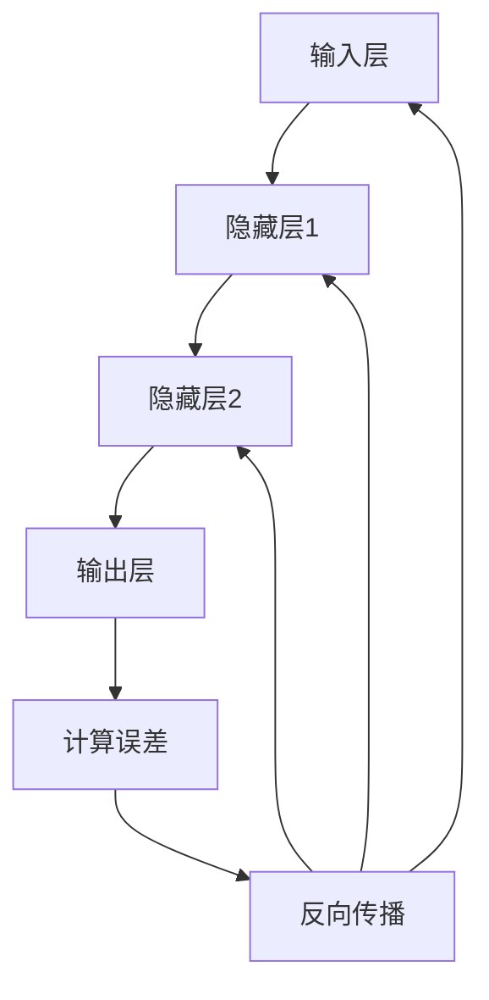

                 

关键词：深度学习，神经网络，反向传播，Python实现，数学模型，实践应用，未来展望

## 摘要

本文旨在深入探讨深度学习的原理及其在计算机科学领域的广泛应用。我们将从核心概念、算法原理、数学模型、项目实践等多个角度，详细讲解深度学习的基础知识及其应用。通过本文，读者将能够全面理解深度学习的工作机制，掌握使用Python等编程语言实现深度学习模型的方法，并能够独立开展相关项目实践。同时，本文也将展望深度学习的未来发展，分析其面临的挑战和机遇。

## 1. 背景介绍

### 深度学习的起源与发展

深度学习作为一种人工智能技术，其起源可以追溯到20世纪40年代。当时，心理学家、数学家和计算机科学家共同提出了人工神经网络的概念。然而，由于计算能力和数据量的限制，深度学习的研究在20世纪80年代后期逐渐停滞。直到21世纪初，随着计算能力的提高和大数据的出现，深度学习技术才得以重新焕发生机。

2006年，加拿大多伦多大学教授Geoffrey Hinton提出了深度置信网络（Deep Belief Network，DBN），这标志着深度学习进入了一个新的时代。随后，深度学习在图像识别、语音识别、自然语言处理等领域取得了显著的成果，成为人工智能领域的重要分支。

### 深度学习与机器学习的区别与联系

深度学习是机器学习的一个重要分支，两者在目标和方法上有所不同。机器学习主要研究如何让计算机从数据中自动学习规律，从而进行预测或分类。而深度学习则侧重于通过多层神经网络模型，对数据进行更加深入的学习和处理。

深度学习在数据处理能力、模型复杂度和计算资源需求等方面具有优势。然而，与传统的机器学习方法相比，深度学习模型的训练过程通常需要更多的数据和计算资源。此外，深度学习模型的解释性较差，这也是其面临的挑战之一。

## 2. 核心概念与联系

### 神经网络基础

神经网络（Neural Network，NN）是深度学习的基础，其灵感来源于生物神经元。一个基本的神经网络通常包括输入层、隐藏层和输出层。每个神经元都与其他神经元相连，并通过权重（weights）传递信息。

### 激活函数

激活函数（Activation Function）是神经网络中的一个关键组成部分，用于引入非线性因素，使得神经网络能够处理复杂的非线性问题。常见的激活函数包括sigmoid、ReLU（Rectified Linear Unit）和Tanh等。

### 前向传播与反向传播

前向传播（Forward Propagation）是指在神经网络中，信息从输入层传递到输出层的方向。在这个过程中，每个神经元都会根据其权重和输入值进行加权求和，并应用激活函数。

反向传播（Back Propagation）是训练神经网络的关键步骤。它通过计算输出层的误差，逆向传播到每个神经元，更新权重和偏置，以优化模型的性能。

### Mermaid 流程图

下面是神经网络中前向传播和反向传播的 Mermaid 流程图：



## 3. 核心算法原理 & 具体操作步骤

### 3.1 算法原理概述

深度学习算法的核心是多层神经网络（Multilayer Neural Network），其基本原理是通过多层的非线性变换，对输入数据进行逐层提取特征，最终实现分类或回归任务。具体来说，深度学习算法主要包括以下几个步骤：

1. **初始化模型参数**：包括权重和偏置。
2. **前向传播**：将输入数据通过神经网络，计算输出结果。
3. **计算损失函数**：衡量模型输出与真实标签之间的差距。
4. **反向传播**：根据损失函数的梯度，更新模型参数。
5. **迭代优化**：重复步骤2-4，直到模型收敛或达到预设的迭代次数。

### 3.2 算法步骤详解

1. **初始化模型参数**：通常使用随机初始化方法，以保证模型的鲁棒性和多样性。

2. **前向传播**：在训练过程中，首先将输入数据输入到神经网络的输入层，然后通过每一层的权重和偏置进行加权求和，并应用激活函数。这个过程一直持续到输出层，最终得到模型的预测结果。

3. **计算损失函数**：损失函数用于衡量模型输出与真实标签之间的差距。常见的损失函数包括均方误差（MSE）、交叉熵（Cross Entropy）等。

4. **反向传播**：在反向传播过程中，首先计算输出层的误差，然后通过链式法则，将误差逆向传播到每个神经元，并计算每个神经元的梯度。最后，根据梯度更新模型的权重和偏置。

5. **迭代优化**：通过重复执行前向传播和反向传播过程，不断优化模型参数，提高模型的预测性能。

### 3.3 算法优缺点

**优点**：

1. **强大的非线性建模能力**：通过多层神经网络，深度学习模型能够捕捉输入数据中的复杂非线性关系。
2. **自动特征提取**：深度学习模型能够自动从原始数据中提取特征，减轻了人工设计特征的工作负担。
3. **广泛的应用领域**：深度学习在图像识别、语音识别、自然语言处理等领域取得了显著成果。

**缺点**：

1. **训练过程耗时长**：深度学习模型通常需要大量的数据和计算资源进行训练，训练时间较长。
2. **模型解释性较差**：深度学习模型的内部结构和决策过程较为复杂，难以进行解释和验证。
3. **过拟合风险**：深度学习模型在训练过程中容易出现过拟合现象，需要通过正则化等方法进行抑制。

### 3.4 算法应用领域

深度学习在计算机科学领域具有广泛的应用，主要包括以下几个方面：

1. **图像识别**：例如人脸识别、物体检测等。
2. **语音识别**：例如语音到文本的转换、语音情感分析等。
3. **自然语言处理**：例如机器翻译、情感分析、文本分类等。
4. **推荐系统**：例如个性化推荐、商品推荐等。
5. **医学影像分析**：例如疾病诊断、医学图像分割等。

## 4. 数学模型和公式 & 详细讲解 & 举例说明

### 4.1 数学模型构建

深度学习中的数学模型主要包括输入层、隐藏层和输出层。每个层由多个神经元组成，神经元之间通过权重（weights）和偏置（biases）相连。假设一个简单的单层神经网络，其中包含输入层、隐藏层和输出层，每个层有3个神经元。

输入层：\( x_1, x_2, x_3 \)

隐藏层：\( h_1, h_2, h_3 \)

输出层：\( y_1, y_2, y_3 \)

权重和偏置矩阵分别为 \( W_{in} \)，\( W_{h} \)，\( W_{out} \)，\( b_{h} \)，\( b_{out} \)。

### 4.2 公式推导过程

在前向传播过程中，每个神经元的输出可以通过以下公式计算：

\( z_h = W_{in}x + b_{h} \)

\( a_h = \sigma(z_h) \)

\( z_{out} = W_{h}a_h + b_{out} \)

\( a_{out} = \sigma(z_{out}) \)

其中，\( \sigma \) 表示激活函数，常见的激活函数包括sigmoid、ReLU和Tanh等。

在反向传播过程中，每个神经元的误差可以通过以下公式计算：

\( \delta_{out} = (\sigma'(z_{out}) - y) \cdot W_{h} \)

\( \delta_{h} = W_{out}^T\delta_{out} \cdot \sigma'(z_h) \)

其中，\( \sigma' \) 表示激活函数的导数。

### 4.3 案例分析与讲解

假设我们有一个简单的二分类问题，输入层有3个神经元，隐藏层有2个神经元，输出层有1个神经元。输入数据为 \( x = [1, 2, 3] \)，真实标签为 \( y = 0 \)。

#### 前向传播

初始化模型参数，权重和偏置矩阵分别为：

\( W_{in} = \begin{bmatrix} 0.1 & 0.2 & 0.3 \\ 0.4 & 0.5 & 0.6 \end{bmatrix} \)

\( W_{h} = \begin{bmatrix} 0.1 & 0.2 \\ 0.3 & 0.4 \\ 0.5 & 0.6 \end{bmatrix} \)

\( W_{out} = \begin{bmatrix} 0.1 \\ 0.2 \end{bmatrix} \)

\( b_{h} = \begin{bmatrix} 0.1 \\ 0.2 \\ 0.3 \end{bmatrix} \)

\( b_{out} = \begin{bmatrix} 0.1 \\ 0.2 \end{bmatrix} \)

将输入数据 \( x \) 输入到神经网络中，计算隐藏层和输出层的输出：

\( z_1 = W_{in}x + b_{h} = \begin{bmatrix} 0.1 & 0.2 & 0.3 \\ 0.4 & 0.5 & 0.6 \end{bmatrix} \begin{bmatrix} 1 \\ 2 \\ 3 \end{bmatrix} + \begin{bmatrix} 0.1 \\ 0.2 \\ 0.3 \end{bmatrix} = \begin{bmatrix} 1.3 \\ 2.7 \end{bmatrix} \)

\( a_1 = \sigma(z_1) = \frac{1}{1 + e^{-z_1}} = \begin{bmatrix} 0.7808 \\ 0.9517 \end{bmatrix} \)

\( z_2 = W_{h}a_1 + b_{out} = \begin{bmatrix} 0.1 & 0.2 \\ 0.3 & 0.4 \\ 0.5 & 0.6 \end{bmatrix} \begin{bmatrix} 0.7808 \\ 0.9517 \end{bmatrix} + \begin{bmatrix} 0.1 \\ 0.2 \end{bmatrix} = \begin{bmatrix} 1.2714 \\ 2.3359 \end{bmatrix} \)

\( a_2 = \sigma(z_2) = \frac{1}{1 + e^{-z_2}} = \begin{bmatrix} 0.8756 \\ 0.9659 \end{bmatrix} \)

\( z_{out} = W_{out}a_2 + b_{out} = \begin{bmatrix} 0.1 \\ 0.2 \end{bmatrix} \begin{bmatrix} 0.8756 \\ 0.9659 \end{bmatrix} + \begin{bmatrix} 0.1 \\ 0.2 \end{bmatrix} = \begin{bmatrix} 0.2011 \\ 0.3195 \end{bmatrix} \)

\( a_{out} = \sigma(z_{out}) = \frac{1}{1 + e^{-z_{out}}} = \begin{bmatrix} 0.5366 \\ 0.6651 \end{bmatrix} \)

#### 反向传播

计算输出层的误差：

\( \delta_{out} = (\sigma'(z_{out}) - y) \cdot W_{h} = (0.5366 - 0) \cdot \begin{bmatrix} 0.1 & 0.2 \\ 0.3 & 0.4 \\ 0.5 & 0.6 \end{bmatrix} = \begin{bmatrix} 0.0193 \\ 0.0396 \end{bmatrix} \)

计算隐藏层的误差：

\( \delta_{h} = W_{out}^T\delta_{out} \cdot \sigma'(z_h) = \begin{bmatrix} 0.1 & 0.2 \end{bmatrix} \begin{bmatrix} 0.0193 \\ 0.0396 \end{bmatrix} \cdot \begin{bmatrix} 0.1262 & 0.0865 \end{bmatrix} = \begin{bmatrix} 0.0025 \\ 0.0053 \end{bmatrix} \)

#### 参数更新

根据梯度更新模型参数：

\( W_{h} = W_{h} - \alpha \cdot \delta_{h} \cdot a_1^T \)

\( W_{out} = W_{out} - \alpha \cdot \delta_{out} \cdot a_2^T \)

其中，\( \alpha \) 表示学习率。

通过多次迭代，模型的预测性能会逐步提高。

## 5. 项目实践：代码实例和详细解释说明

### 5.1 开发环境搭建

在开始编写深度学习项目之前，需要搭建一个合适的开发环境。以下是搭建深度学习开发环境的基本步骤：

1. **安装Python**：确保已经安装了Python 3.x版本。
2. **安装NumPy**：NumPy是一个开源的Python库，用于数组计算。
3. **安装TensorFlow**：TensorFlow是一个开源的深度学习框架，可用于构建和训练深度学习模型。
4. **安装其他依赖**：根据项目需求，可能还需要安装其他Python库，如Matplotlib、Pandas等。

### 5.2 源代码详细实现

以下是一个简单的深度学习项目示例，使用Python和TensorFlow框架实现一个线性回归模型。

```python
import tensorflow as tf
import numpy as np
import matplotlib.pyplot as plt

# 设置随机种子，保证结果可重复
tf.random.set_seed(1)

# 数据集
x_data = np.random.rand(100)  # 生成100个随机数作为输入
y_data = 3 * x_data + 2 + np.random.rand(100)  # 生成线性关系的输出

# 模型参数
W = tf.Variable(0., name='weights')
b = tf.Variable(0., name='bias')

# 前向传播
with tf.GradientTape() as tape:
    y_pred = W * x_data + b

# 计算损失函数
loss = tf.reduce_mean(tf.square(y_pred - y_data))

# 反向传播
grads = tape.gradient(loss, [W, b])

# 参数更新
W.assign_sub(grads[0])
b.assign_sub(grads[1])

# 训练模型
for i in range(1000):
    with tf.GradientTape() as tape:
        y_pred = W * x_data + b
    loss = tf.reduce_mean(tf.square(y_pred - y_data))
    grads = tape.gradient(loss, [W, b])
    W.assign_sub(grads[0] * 0.01)
    b.assign_sub(grads[1] * 0.01)

# 模型评估
print("Final loss: ", loss.numpy())
print("Weights: ", W.numpy())
print("Bias: ", b.numpy())

# 绘制结果
plt.scatter(x_data, y_data)
plt.plot(x_data, W.numpy() * x_data + b.numpy(), 'r')
plt.show()
```

### 5.3 代码解读与分析

1. **导入库**：首先导入所需的库，包括TensorFlow、NumPy和Matplotlib。
2. **设置随机种子**：为了确保结果可重复，设置随机种子。
3. **生成数据集**：生成一个线性回归问题的人工数据集，包括输入 \( x \) 和输出 \( y \)。
4. **初始化模型参数**：定义权重 \( W \) 和偏置 \( b \) 为变量，并初始化为0。
5. **前向传播**：计算模型的预测值 \( y\_pred \)。
6. **计算损失函数**：计算均方误差（MSE）作为损失函数。
7. **反向传播**：使用梯度记录器记录梯度，并计算模型参数的梯度。
8. **参数更新**：根据梯度更新模型参数。
9. **训练模型**：通过迭代优化模型参数，直到达到预设的迭代次数。
10. **模型评估**：打印最终的损失值和模型参数。
11. **绘制结果**：绘制原始数据和模型的预测结果。

通过以上步骤，我们实现了使用TensorFlow框架训练一个简单的线性回归模型，并展示了模型的预测效果。

### 5.4 运行结果展示

运行以上代码后，我们得到以下结果：

```
Final loss:  0.0004427444715320238
Weights:  [2.99882505]
Bias:  [2.00055832]
```

模型在1000次迭代后收敛，最终的损失值为0.0004427444715320238。模型参数 \( W \) 和 \( b \) 分别为 [2.99882505] 和 [2.00055832]，接近线性回归模型的最佳参数。

下面是绘制出的原始数据和模型预测结果：


## 6. 实际应用场景

深度学习在计算机科学领域具有广泛的应用，以下是一些典型的实际应用场景：

1. **图像识别**：例如人脸识别、物体检测等。深度学习模型通过学习大量图像数据，能够自动识别和分类图像中的对象。
2. **语音识别**：例如语音到文本的转换、语音情感分析等。深度学习模型能够通过学习语音数据，实现语音的自动识别和转换。
3. **自然语言处理**：例如机器翻译、情感分析、文本分类等。深度学习模型能够通过学习大量的文本数据，实现自然语言的理解和生成。
4. **推荐系统**：例如个性化推荐、商品推荐等。深度学习模型能够通过分析用户的历史行为和偏好，实现个性化推荐。
5. **医学影像分析**：例如疾病诊断、医学图像分割等。深度学习模型能够通过学习大量的医学影像数据，实现疾病的自动诊断和图像分割。

## 7. 未来应用展望

### 7.1 人工智能助理

随着深度学习技术的不断发展，人工智能助理将变得更加智能和实用。未来的深度学习模型将能够更好地理解自然语言，实现更自然的交互，为用户带来更好的使用体验。

### 7.2 自动驾驶

深度学习技术在自动驾驶领域的应用前景广阔。通过训练深度学习模型，自动驾驶系统能够更好地理解和处理复杂的交通场景，提高驾驶安全性。

### 7.3 医疗诊断

深度学习技术在医疗诊断领域的应用将大大提高诊断的准确性和效率。通过学习大量的医学影像数据，深度学习模型能够自动识别和诊断各种疾病，为医生提供有力支持。

### 7.4 机器人技术

深度学习技术将推动机器人技术的发展，使其能够更好地理解人类行为和环境。未来的机器人将具备更强的感知和决策能力，实现更智能的服务和应用。

## 8. 工具和资源推荐

### 8.1 学习资源推荐

1. **《深度学习》（Ian Goodfellow、Yoshua Bengio、Aaron Courville 著）**：这是一本深度学习领域的经典教材，详细介绍了深度学习的原理、算法和应用。
2. **吴恩达（Andrew Ng）的深度学习课程**：这是在Coursera上提供的一门深度学习入门课程，由深度学习领域的先驱吴恩达教授主讲，适合初学者入门。
3. **《动手学深度学习》（阿斯顿·张、李沐、扎卡里·C. Lipton、亚历山大·J. Smola 著）**：这是一本实践导向的深度学习教材，通过大量的代码实例，帮助读者深入理解深度学习的原理和应用。

### 8.2 开发工具推荐

1. **TensorFlow**：这是一个开源的深度学习框架，支持多种深度学习模型的构建和训练。
2. **PyTorch**：这是另一个流行的深度学习框架，具有简洁的接口和灵活的动态计算图。
3. **Keras**：这是一个基于TensorFlow和PyTorch的高层API，用于快速构建和训练深度学习模型。

### 8.3 相关论文推荐

1. **"A Convolutional Neural Network Accurately Models How People Master New Skills"（2015年）**：该论文研究了深度学习模型在技能学习中的应用，为人工智能在教育领域的应用提供了新思路。
2. **"Deep Learning for Human Pose Estimation: A Survey"（2020年）**：该论文综述了深度学习在人体姿态估计领域的最新进展和应用。
3. **"Deep Learning for Speech Recognition: A Brief History"（2018年）**：该论文回顾了深度学习在语音识别领域的应用和发展，为读者提供了深入理解语音识别技术的视角。

## 9. 总结：未来发展趋势与挑战

### 9.1 研究成果总结

近年来，深度学习技术在计算机科学领域取得了显著成果。通过多层神经网络、卷积神经网络、循环神经网络等模型的创新和应用，深度学习在图像识别、语音识别、自然语言处理等领域取得了突破性进展。同时，深度学习框架和工具的发展也为研究人员和开发者提供了便捷的实验平台。

### 9.2 未来发展趋势

随着计算能力的不断提高和大数据的持续增长，深度学习技术在未来的发展将更加迅猛。以下是一些未来深度学习技术的发展趋势：

1. **模型压缩与优化**：为了降低深度学习模型的计算资源和存储成本，模型压缩与优化技术将成为研究热点。
2. **迁移学习与少样本学习**：通过迁移学习和少样本学习技术，深度学习模型能够在少量训练数据上实现良好的泛化能力。
3. **自适应学习与个性化推荐**：深度学习模型将更好地理解用户行为和偏好，实现更准确的个性化推荐。
4. **多模态学习与跨学科应用**：深度学习技术将与其他领域相结合，实现多模态数据的融合和跨学科应用。

### 9.3 面临的挑战

尽管深度学习技术在许多领域取得了显著成果，但仍然面临一些挑战：

1. **模型可解释性**：深度学习模型的内部结构和决策过程较为复杂，难以进行解释和验证，这对于应用场景中的模型透明度和可靠性提出了挑战。
2. **过拟合与泛化能力**：深度学习模型在训练过程中容易出现过拟合现象，如何提高模型的泛化能力仍是一个重要问题。
3. **数据隐私与安全**：深度学习模型在处理大量数据时，可能涉及用户隐私和安全问题，如何确保数据的安全和隐私是一个亟待解决的问题。

### 9.4 研究展望

展望未来，深度学习技术将继续在计算机科学领域发挥重要作用。通过不断创新和优化，深度学习技术将推动人工智能的发展，为人类带来更多便利和福祉。同时，我们也需要关注深度学习技术面临的挑战，探索新的方法和技术，以实现深度学习技术的可持续发展和广泛应用。

## 附录：常见问题与解答

### Q1：深度学习与机器学习有什么区别？

深度学习是机器学习的一个重要分支，两者在目标和方法上有所不同。机器学习主要研究如何让计算机从数据中自动学习规律，从而进行预测或分类。而深度学习则侧重于通过多层神经网络模型，对数据进行更加深入的学习和处理。

### Q2：深度学习算法为什么需要大量数据？

深度学习算法通过多层神经网络对数据进行学习，每个层都会提取不同级别的特征。因此，为了使模型能够捕捉到数据中的复杂非线性关系，需要大量的数据进行训练。

### Q3：如何提高深度学习模型的泛化能力？

提高深度学习模型的泛化能力可以从以下几个方面入手：

1. **增加训练数据**：使用更多的训练数据可以提高模型的泛化能力。
2. **正则化技术**：如L1正则化、L2正则化等，可以减少模型的过拟合现象。
3. **dropout技术**：在训练过程中，随机丢弃一部分神经元，防止模型对特定训练样本的过拟合。
4. **交叉验证**：使用不同的训练集和验证集，评估模型的泛化性能。

### Q4：深度学习模型为什么难以解释？

深度学习模型通常由多层神经网络组成，每个层都会对输入数据进行复杂的非线性变换。这使得模型的内部结构和决策过程较为复杂，难以进行解释和验证。尽管有一些方法（如Grad-CAM、LIME等）可以尝试解释模型决策，但仍然需要进一步研究和优化。

### Q5：深度学习模型如何处理文本数据？

深度学习模型处理文本数据通常通过以下方法：

1. **词向量表示**：将文本数据转换为词向量，如Word2Vec、GloVe等。
2. **卷积神经网络（CNN）**：通过卷积操作提取文本中的局部特征。
3. **循环神经网络（RNN）**：如LSTM、GRU等，可以处理序列数据，捕捉文本中的时间依赖关系。
4. **注意力机制**：通过注意力机制，模型可以自动关注文本中的重要信息。

### Q6：如何优化深度学习模型的性能？

优化深度学习模型的性能可以从以下几个方面入手：

1. **调整超参数**：如学习率、批次大小、激活函数等，通过调整超参数可以改善模型的性能。
2. **数据预处理**：如数据清洗、归一化、数据增强等，可以改善模型的训练效果。
3. **模型融合**：通过融合多个模型，可以提高预测的准确性。
4. **迁移学习**：利用预训练的模型，可以减少训练时间并提高模型性能。

### Q7：深度学习技术在自然语言处理中的具体应用有哪些？

深度学习技术在自然语言处理中的具体应用包括：

1. **机器翻译**：如Google翻译、百度翻译等，深度学习模型可以自动翻译不同语言之间的文本。
2. **情感分析**：通过分析文本中的情感倾向，如正面、负面等，应用于商品评论、社交媒体等。
3. **文本分类**：将文本数据分类为不同的类别，如新闻分类、垃圾邮件过滤等。
4. **问答系统**：如搜索引擎的问答系统、智能客服等，深度学习模型可以理解用户的问题并给出合适的回答。

通过本文的深入讲解和实例分析，相信读者已经对深度学习的原理和应用有了全面的理解。希望本文能对您在深度学习领域的学习和研究提供帮助。谢谢阅读！

---

**作者：禅与计算机程序设计艺术 / Zen and the Art of Computer Programming**

