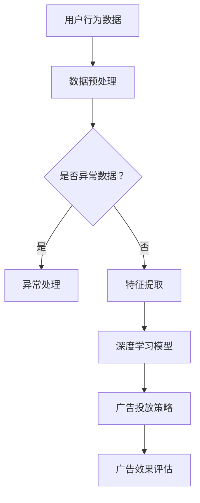

                 

关键词：深度学习，广告投放，大数据，人工智能，精准营销

> 摘要：随着互联网和大数据技术的发展，广告投放逐渐从传统的定向广告转向了更加精准和个性化的深度学习广告投放。本文将探讨深度学习在广告投放中的应用，包括核心概念、算法原理、数学模型、项目实践以及未来展望。

## 1. 背景介绍

广告投放是商业活动中的重要环节，它的目标是吸引潜在客户并促进销售。传统的广告投放方式主要依赖于用户特征和行为数据的分析，如年龄、性别、地理位置等。然而，这种基于规则的定向广告投放存在以下问题：

- **信息过载**：用户每天会接收到大量的广告，传统定向广告很难在有限的时间和资源内实现精准投放。
- **效果难以量化**：传统广告投放的效果难以量化，广告主往往无法准确评估广告的回报率。
- **用户体验差**：传统广告投放方式容易导致用户反感，影响品牌形象。

随着互联网和大数据技术的发展，广告投放开始向智能化和个性化方向发展。深度学习作为一种强大的机器学习技术，为广告投放带来了新的契机。

## 2. 核心概念与联系

### 2.1 深度学习的基本概念

深度学习是机器学习的一种重要分支，它通过构建多层神经网络模型，对大量数据进行自动特征提取和学习。深度学习的核心组件包括：

- **神经网络**：神经网络是模仿生物神经系统的计算模型，通过前向传播和反向传播算法进行学习。
- **深度神经网络**：深度神经网络由多个隐藏层组成，能够提取更高层次的特征。
- **卷积神经网络（CNN）**：CNN特别适用于处理图像数据，通过卷积操作提取图像特征。
- **循环神经网络（RNN）**：RNN适用于处理序列数据，如文本、语音等，能够捕捉时间序列信息。

### 2.2 广告投放中的深度学习应用

在广告投放中，深度学习主要应用于以下方面：

- **用户画像**：通过深度学习模型对用户行为数据进行分析，构建用户画像，实现个性化广告推荐。
- **广告投放优化**：利用深度学习算法优化广告投放策略，提高广告点击率（CTR）和转化率（CVR）。
- **内容生成**：生成个性化的广告内容，提高广告吸引力和用户体验。

### 2.3 Mermaid 流程图



## 3. 核心算法原理 & 具体操作步骤

### 3.1 算法原理概述

深度学习广告投放主要依赖于以下算法原理：

- **自动特征提取**：通过深度神经网络自动提取用户行为数据中的潜在特征，为广告投放提供更细粒度的信息。
- **模型优化**：利用梯度下降等优化算法对深度学习模型进行调整，提高广告投放效果。
- **模型评估**：通过交叉验证等方法对深度学习模型进行评估，确保模型在实际应用中的效果。

### 3.2 算法步骤详解

1. **数据收集与预处理**：收集用户行为数据，包括点击、浏览、购买等，对数据进行分析和清洗，去除异常值和噪声数据。
2. **特征提取**：利用深度学习模型对预处理后的数据进行自动特征提取，提取出潜在的特征。
3. **模型训练**：使用训练数据集对深度学习模型进行训练，调整模型参数。
4. **模型评估**：使用验证数据集对训练好的模型进行评估，确保模型在未知数据上的表现。
5. **广告投放**：根据模型预测结果进行广告投放，优化广告投放策略。
6. **效果评估**：通过广告点击率（CTR）、转化率（CVR）等指标评估广告投放效果，根据效果调整模型参数。

### 3.3 算法优缺点

**优点**：

- **自动特征提取**：能够自动提取数据中的潜在特征，提高广告投放的精度。
- **模型优化**：通过优化算法调整模型参数，提高广告投放效果。
- **模型评估**：能够对模型进行量化评估，确保模型在实际应用中的效果。

**缺点**：

- **计算资源消耗大**：深度学习模型训练需要大量的计算资源。
- **数据依赖性强**：深度学习模型的效果依赖于高质量的数据，数据质量问题会直接影响模型效果。

### 3.4 算法应用领域

深度学习在广告投放中的应用主要包括：

- **广告推荐**：通过深度学习算法对用户兴趣和行为进行分析，实现个性化广告推荐。
- **广告投放优化**：利用深度学习算法优化广告投放策略，提高广告点击率和转化率。
- **内容生成**：生成个性化的广告内容，提高广告吸引力和用户体验。

## 4. 数学模型和公式 & 详细讲解 & 举例说明

### 4.1 数学模型构建

在深度学习广告投放中，常用的数学模型包括：

- **多层感知机（MLP）**：一种简单的全连接神经网络，适用于分类和回归问题。
- **卷积神经网络（CNN）**：适用于图像数据处理，通过卷积操作提取图像特征。
- **循环神经网络（RNN）**：适用于序列数据处理，如文本和语音，能够捕捉时间序列信息。

### 4.2 公式推导过程

以多层感知机（MLP）为例，其输出层的计算过程如下：

$$
z = \sigma(W_n \cdot a_{n-1} + b_n)
$$

其中，$z$ 是输出层神经元的激活值，$\sigma$ 是激活函数（如 sigmoid 函数），$W_n$ 是输出层权重，$a_{n-1}$ 是前一层神经元的激活值，$b_n$ 是输出层偏置。

### 4.3 案例分析与讲解

假设我们有一个广告投放项目，目标是提高广告点击率（CTR）。我们可以使用多层感知机（MLP）模型进行广告投放优化。

1. **数据收集与预处理**：收集用户点击广告的行为数据，包括用户ID、广告ID、点击时间等。对数据进行清洗，去除异常值和噪声数据。
2. **特征提取**：对预处理后的数据进行特征提取，提取出用户的潜在特征，如用户兴趣、广告内容等。
3. **模型训练**：使用训练数据集对多层感知机（MLP）模型进行训练，调整模型参数。
4. **模型评估**：使用验证数据集对训练好的模型进行评估，确保模型在实际应用中的效果。
5. **广告投放**：根据模型预测结果进行广告投放，优化广告投放策略。
6. **效果评估**：通过广告点击率（CTR）等指标评估广告投放效果，根据效果调整模型参数。

通过以上步骤，我们可以实现广告投放的优化，提高广告点击率。

## 5. 项目实践：代码实例和详细解释说明

### 5.1 开发环境搭建

在本项目实践中，我们将使用 Python 编程语言，结合 TensorFlow 深度学习框架进行广告投放优化。

- 安装 Python 3.8 及以上版本。
- 安装 TensorFlow 深度学习框架。

### 5.2 源代码详细实现

以下是广告投放优化的 Python 代码实现：

```python
import tensorflow as tf
from tensorflow.keras.models import Sequential
from tensorflow.keras.layers import Dense
from sklearn.model_selection import train_test_split
from sklearn.preprocessing import StandardScaler

# 数据预处理
def preprocess_data(data):
    # 数据清洗和特征提取
    # ...
    return processed_data

# 训练模型
def train_model(X_train, y_train):
    model = Sequential()
    model.add(Dense(64, input_dim=X_train.shape[1], activation='relu'))
    model.add(Dense(32, activation='relu'))
    model.add(Dense(1, activation='sigmoid'))
    model.compile(optimizer='adam', loss='binary_crossentropy', metrics=['accuracy'])
    model.fit(X_train, y_train, epochs=10, batch_size=32)
    return model

# 模型评估
def evaluate_model(model, X_test, y_test):
    loss, accuracy = model.evaluate(X_test, y_test)
    print(f"Test accuracy: {accuracy * 100:.2f}%")

# 主函数
def main():
    # 数据收集
    data = ...
    processed_data = preprocess_data(data)

    # 划分训练集和验证集
    X, y = processed_data[:, :-1], processed_data[:, -1]
    X_train, X_test, y_train, y_test = train_test_split(X, y, test_size=0.2, random_state=42)

    # 标准化特征
    scaler = StandardScaler()
    X_train = scaler.fit_transform(X_train)
    X_test = scaler.transform(X_test)

    # 训练模型
    model = train_model(X_train, y_train)

    # 模型评估
    evaluate_model(model, X_test, y_test)

if __name__ == "__main__":
    main()
```

### 5.3 代码解读与分析

以上代码实现了一个基于多层感知机（MLP）的广告投放优化模型。主要步骤如下：

1. **数据预处理**：对收集到的用户行为数据进行清洗和特征提取，为模型训练做准备。
2. **模型训练**：使用训练数据集对多层感知机（MLP）模型进行训练，调整模型参数。
3. **模型评估**：使用验证数据集对训练好的模型进行评估，确保模型在实际应用中的效果。
4. **主函数**：执行数据收集、划分训练集和验证集、模型训练和模型评估等步骤。

通过以上代码，我们可以实现广告投放的优化，提高广告点击率。

## 6. 实际应用场景

### 6.1 线上广告投放

在线上广告投放中，深度学习技术被广泛应用于：

- **广告推荐**：根据用户历史行为和兴趣，推荐个性化的广告。
- **广告投放优化**：根据广告效果实时调整投放策略，提高广告点击率和转化率。
- **内容生成**：生成吸引人的广告内容，提高用户体验。

### 6.2 线下广告投放

在线下广告投放中，深度学习技术也有很大的应用潜力：

- **用户画像**：通过人脸识别技术对顾客进行实时分析，实现个性化广告推荐。
- **广告投放优化**：根据顾客行为和兴趣调整广告投放策略，提高广告效果。
- **内容生成**：根据顾客需求生成个性化的广告内容，提高广告吸引力和用户体验。

## 7. 工具和资源推荐

### 7.1 学习资源推荐

- 《深度学习》（Goodfellow, Bengio, Courville 著）：深度学习领域的经典教材。
- 《Python深度学习》（François Chollet 著）：结合 Python 实践的深度学习入门书籍。
- 《广告学原理》（魏增寿 著）：广告投放的理论基础。

### 7.2 开发工具推荐

- TensorFlow：Google 开源的深度学习框架，适用于广告投放优化。
- Keras：基于 TensorFlow 的简洁、高效的深度学习库，适用于广告投放实践。
- Scikit-learn：Python 的机器学习库，适用于数据预处理和模型评估。

### 7.3 相关论文推荐

- "Deep Learning for Ad Prediction"（2016）：介绍深度学习在广告预测中的应用。
- "Learning Deep Features for Advertising Click Through Rate Prediction"（2016）：使用深度学习预测广告点击率。
- "User Interest Recognition Based on Deep Learning for Online Advertising"（2017）：基于深度学习技术的在线广告用户兴趣识别。

## 8. 总结：未来发展趋势与挑战

### 8.1 研究成果总结

近年来，深度学习在广告投放中的应用取得了显著的成果。通过自动特征提取和模型优化，深度学习技术显著提高了广告投放的精准度和效果。同时，深度学习在广告内容生成和用户画像构建等方面也有广泛的应用。

### 8.2 未来发展趋势

随着大数据和人工智能技术的发展，深度学习在广告投放中的应用前景广阔。未来发展趋势包括：

- **更多应用场景**：深度学习将在更多广告投放场景中得到应用，如线下广告投放、跨平台广告投放等。
- **更精准的用户画像**：通过深度学习技术，构建更精准的用户画像，实现个性化广告推荐。
- **更智能的广告投放策略**：利用深度学习算法，实时调整广告投放策略，提高广告效果。

### 8.3 面临的挑战

尽管深度学习在广告投放中取得了显著成果，但仍面临一些挑战：

- **数据隐私**：广告投放需要大量用户行为数据，数据隐私保护是一个重要问题。
- **计算资源**：深度学习模型训练需要大量计算资源，如何高效利用计算资源是一个挑战。
- **模型可解释性**：深度学习模型往往缺乏可解释性，如何提高模型的可解释性是一个重要课题。

### 8.4 研究展望

未来，深度学习在广告投放中的应用将朝着更加智能化、个性化、高效化的方向发展。通过不断探索和创新，深度学习将为广告投放带来更多可能性，助力企业实现精准营销。

## 9. 附录：常见问题与解答

### 9.1 什么是深度学习？

深度学习是一种机器学习技术，通过构建多层神经网络模型，对大量数据进行自动特征提取和学习。

### 9.2 深度学习在广告投放中有哪些应用？

深度学习在广告投放中的应用主要包括用户画像构建、广告投放优化和广告内容生成。

### 9.3 如何使用深度学习进行广告投放优化？

使用深度学习进行广告投放优化的主要步骤包括数据收集与预处理、特征提取、模型训练、模型评估和广告投放。

### 9.4 深度学习广告投放有哪些挑战？

深度学习广告投放面临的挑战包括数据隐私、计算资源和模型可解释性等。

---

作者：禅与计算机程序设计艺术 / Zen and the Art of Computer Programming


