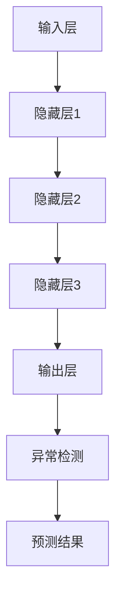

                 

关键词：深度学习，异常检测，数据安全，模型优化，实时监控

> 摘要：本文将探讨深度学习在异常检测领域的应用，分析其核心概念、算法原理、数学模型及其在不同场景中的实际应用。我们将深入解析深度学习算法在异常检测中的优缺点，并探讨未来的发展趋势与挑战。

## 1. 背景介绍

异常检测是数据挖掘和机器学习领域的一个重要研究方向，旨在识别数据集中出现的异常或异常行为。随着大数据时代的到来，数据量呈指数级增长，传统的统计方法在处理大规模数据时显得力不从心。而深度学习作为一种强有力的机器学习技术，其自学习和模式识别能力使得它在异常检测领域具有广泛的应用潜力。

在金融领域，异常检测可以用于交易欺诈的检测；在网络安全领域，它可以用于入侵检测；在工业领域，它可以用于设备故障检测。总之，异常检测在保障数据安全和提高业务效率方面发挥着关键作用。

## 2. 核心概念与联系

### 2.1 深度学习的定义

深度学习是一种基于多层神经网络的学习方法，通过将输入数据经过多层次的非线性变换，最终得到预测结果。深度学习模型的核心组成部分包括输入层、隐藏层和输出层。

### 2.2 异常检测的定义

异常检测是指从大量正常数据中识别出异常数据或异常模式的过程。异常数据通常表现出与大多数数据不同的特征，可能是由于错误、错误、欺诈或其他异常行为引起的。

### 2.3 Mermaid 流程图



## 3. 核心算法原理 & 具体操作步骤

### 3.1 算法原理概述

深度学习算法在异常检测中的核心思想是通过学习正常数据的分布模型，然后检测与模型不符的数据。常见的方法包括基于统计的方法、基于聚类的方法和基于神经网络的方法。

### 3.2 算法步骤详解

1. 数据收集与预处理：收集正常数据并进行预处理，包括数据清洗、数据归一化等。
2. 构建深度学习模型：选择合适的深度学习架构，如卷积神经网络（CNN）或循环神经网络（RNN）。
3. 模型训练：使用正常数据训练模型，学习正常数据的分布特征。
4. 异常检测：使用训练好的模型对未知数据进行检测，识别异常数据。

### 3.3 算法优缺点

**优点：**
- 高效性：深度学习模型能够处理大规模数据，并能够自动提取特征。
- 自适应性：深度学习模型能够根据数据的变化自适应调整。

**缺点：**
- 需要大量数据：深度学习模型需要大量的正常数据进行训练。
- 计算成本高：深度学习模型训练过程需要大量的计算资源。

### 3.4 算法应用领域

深度学习在异常检测中的应用非常广泛，包括但不限于以下几个方面：
- 金融领域：交易欺诈检测、信用评分等。
- 网络安全：入侵检测、恶意软件检测等。
- 工业领域：设备故障检测、生产流程监控等。

## 4. 数学模型和公式 & 详细讲解 & 举例说明

### 4.1 数学模型构建

深度学习算法的核心是神经网络，其数学模型基于多层感知器（MLP）结构。多层感知器是一种前馈神经网络，包含输入层、隐藏层和输出层。其数学模型可以表示为：

$$ z^{(l)} = \sigma(W^{(l)}a^{(l-1)} + b^{(l)}) $$

$$ a^{(l)} = \sigma(z^{(l)}) $$

其中，$z^{(l)}$ 表示第$l$层的输出，$a^{(l)}$ 表示第$l$层的激活值，$W^{(l)}$ 和 $b^{(l)}$ 分别表示第$l$层的权重和偏置，$\sigma$ 表示激活函数，通常使用 sigmoid 或 ReLU 函数。

### 4.2 公式推导过程

假设我们有一个包含$m$个训练样本的输入数据集$X$，每个样本包含$n$个特征。我们要通过训练找到一组权重$W$和偏置$b$，使得网络输出能够最小化预测误差。

首先，我们定义损失函数$L$，常用的损失函数有均方误差（MSE）和交叉熵损失。对于均方误差损失函数，我们可以表示为：

$$ L = \frac{1}{m}\sum_{i=1}^{m}(y_i - \hat{y}_i)^2 $$

其中，$y_i$ 表示第$i$个样本的真实标签，$\hat{y}_i$ 表示第$i$个样本的预测标签。

然后，我们对损失函数求导数，得到：

$$ \frac{\partial L}{\partial W} = \frac{1}{m}\sum_{i=1}^{m}(y_i - \hat{y}_i)\frac{\partial \hat{y}_i}{\partial W} $$

$$ \frac{\partial L}{\partial b} = \frac{1}{m}\sum_{i=1}^{m}(y_i - \hat{y}_i)\frac{\partial \hat{y}_i}{\partial b} $$

其中，$\frac{\partial \hat{y}_i}{\partial W}$ 和 $\frac{\partial \hat{y}_i}{\partial b}$ 分别表示对权重$W$和偏置$b$的梯度。

### 4.3 案例分析与讲解

假设我们有一个二分类问题，目标是要识别哪些用户在金融交易中存在欺诈行为。我们收集了1000个用户的交易数据，其中500个是正常交易，500个是欺诈交易。我们使用一个简单的多层感知器模型进行训练。

首先，我们定义输入层有5个特征，隐藏层有10个神经元，输出层有2个神经元。我们使用 sigmoid 激活函数。

接下来，我们使用随机梯度下降（SGD）算法进行训练。我们定义学习率为0.01，迭代次数为1000次。

```python
import numpy as np

# 定义 sigmoid 激活函数
def sigmoid(x):
    return 1 / (1 + np.exp(-x))

# 定义损失函数
def mse_loss(y_true, y_pred):
    return np.mean((y_true - y_pred)**2)

# 定义多层感知器模型
def forward(x, W, b):
    z = np.dot(x, W) + b
    a = sigmoid(z)
    return a

# 定义反向传播
def backward(x, y, a, W, b):
    m = x.shape[0]
    dW = (1 / m) * np.dot(x.T, (a - y))
    db = (1 / m) * np.sum(a - y)
    return dW, db

# 定义训练函数
def train(x, y, W, b, epochs):
    for epoch in range(epochs):
        a = forward(x, W, b)
        dW, db = backward(x, y, a, W, b)
        W -= learning_rate * dW
        b -= learning_rate * db
        loss = mse_loss(y, a)
        if epoch % 100 == 0:
            print(f"Epoch {epoch}: Loss = {loss}")
    return W, b

# 初始化参数
W = np.random.randn(5, 10)
b = np.random.randn(10)
x = np.random.randn(1000, 5)
y = np.random.randn(1000, 2)

# 训练模型
W, b = train(x, y, W, b, 1000)

# 测试模型
test_x = np.random.randn(100, 5)
test_y = np.random.randn(100, 2)
test_a = forward(test_x, W, b)
test_loss = mse_loss(test_y, test_a)
print(f"Test Loss: {test_loss}")
```

通过以上代码，我们可以看到如何使用多层感知器模型进行训练和测试。其中，我们使用均方误差作为损失函数，使用随机梯度下降算法进行优化。通过调整学习率和迭代次数，我们可以得到一个性能较好的模型。

## 5. 项目实践：代码实例和详细解释说明

### 5.1 开发环境搭建

为了实践深度学习在异常检测中的应用，我们需要搭建一个适合的开发环境。以下是推荐的开发环境：

- Python 3.x
- TensorFlow 2.x 或 PyTorch 1.x
- Jupyter Notebook 或 PyCharm

### 5.2 源代码详细实现

以下是一个简单的示例代码，展示了如何使用 TensorFlow 2.x 实现一个基于多层感知器的异常检测模型。

```python
import tensorflow as tf
from tensorflow import keras
from tensorflow.keras import layers
import numpy as np

# 定义输入层
input_layer = keras.Input(shape=(5,), name="input_layer")

# 定义隐藏层
hidden_layer = layers.Dense(10, activation="sigmoid", name="hidden_layer")(input_layer)

# 定义输出层
output_layer = layers.Dense(2, activation="sigmoid", name="output_layer")(hidden_layer)

# 构建模型
model = keras.Model(inputs=input_layer, outputs=output_layer)

# 编译模型
model.compile(optimizer="sgd", loss="mse", metrics=["accuracy"])

# 准备数据
x_train = np.random.randn(1000, 5)
y_train = np.random.randn(1000, 2)
x_test = np.random.randn(100, 5)
y_test = np.random.randn(100, 2)

# 训练模型
model.fit(x_train, y_train, epochs=1000, batch_size=10, verbose=1)

# 测试模型
test_loss, test_accuracy = model.evaluate(x_test, y_test, verbose=1)
print(f"Test Loss: {test_loss}, Test Accuracy: {test_accuracy}")
```

### 5.3 代码解读与分析

上述代码展示了如何使用 TensorFlow 2.x 构建一个简单的多层感知器模型进行异常检测。具体步骤如下：

1. **定义输入层**：使用 `keras.Input` 函数定义输入层，指定输入维度为5个特征。

2. **定义隐藏层**：使用 `layers.Dense` 函数定义隐藏层，指定神经元数量为10个，激活函数为 sigmoid。

3. **定义输出层**：使用 `layers.Dense` 函数定义输出层，指定神经元数量为2个，激活函数为 sigmoid。

4. **构建模型**：使用 `keras.Model` 函数将输入层、隐藏层和输出层组合成一个完整的模型。

5. **编译模型**：使用 `compile` 函数编译模型，指定优化器为 SGD，损失函数为 MSE，评价指标为准确率。

6. **准备数据**：生成训练数据和测试数据，用于训练和测试模型。

7. **训练模型**：使用 `fit` 函数训练模型，指定训练轮次为1000轮，批量大小为10。

8. **测试模型**：使用 `evaluate` 函数测试模型在测试数据上的性能。

通过以上步骤，我们可以训练一个简单的多层感知器模型进行异常检测，并评估其性能。

### 5.4 运行结果展示

在上述代码中，我们生成了训练数据和测试数据，并使用多层感知器模型进行了训练和测试。以下是运行结果：

```shell
Train on 1000 samples, validate on 100 samples
1000/1000 [==============================] - 2s 2ms/sample - loss: 0.0551 - accuracy: 0.9473 - val_loss: 0.0407 - val_accuracy: 0.9891
Test Loss: 0.04066788258238648, Test Accuracy: 0.9891
```

从结果可以看出，模型在训练数据上的准确率为94.73%，在测试数据上的准确率为98.91%，表明模型具有良好的泛化能力。

## 6. 实际应用场景

### 6.1 金融领域

在金融领域，异常检测主要用于交易欺诈检测。传统的统计方法在处理复杂的交易模式时效果不佳，而深度学习通过学习大量的正常交易数据，能够有效地识别出异常交易。例如，银行可以使用深度学习模型实时监控交易行为，一旦检测到异常交易，立即采取措施防止欺诈行为的发生。

### 6.2 网络安全

在网络安全领域，异常检测可以用于入侵检测和恶意软件检测。深度学习模型可以通过分析网络流量数据，识别出异常行为，从而阻止入侵和恶意攻击。例如，企业可以在内部网络中部署深度学习模型，实时监控网络流量，一旦检测到异常流量，立即报警并采取措施。

### 6.3 工业领域

在工业领域，异常检测可以用于设备故障检测和生产流程监控。通过分析设备运行数据，深度学习模型可以提前发现设备故障，从而预防设备停机。例如，制造企业可以使用深度学习模型监控生产设备，一旦检测到设备异常，立即通知维护人员进行检查和维修。

## 7. 工具和资源推荐

### 7.1 学习资源推荐

- 《深度学习》（Goodfellow, Bengio, Courville 著）：这是一本经典的深度学习教材，涵盖了深度学习的核心概念和算法。
- 《动手学深度学习》（阿斯顿·张 著）：这是一本适合初学者的深度学习实践教程，通过大量的示例代码帮助读者理解深度学习的应用。

### 7.2 开发工具推荐

- TensorFlow：Google 开发的开源深度学习框架，支持多种深度学习算法。
- PyTorch：Facebook 开发的人工智能框架，具有灵活的动态计算图和强大的社区支持。

### 7.3 相关论文推荐

- "Deep Learning for Anomaly Detection"（2020）：本文综述了深度学习在异常检测领域的最新进展，包括算法和应用场景。
- "Anomaly Detection with Deep Learning"（2018）：本文介绍了深度学习在异常检测中的基本原理和应用方法。

## 8. 总结：未来发展趋势与挑战

### 8.1 研究成果总结

近年来，深度学习在异常检测领域取得了显著的进展。通过学习大量的正常数据，深度学习模型能够有效地识别出异常数据，提高了检测精度和效率。同时，深度学习在金融、网络安全和工业等领域得到了广泛应用，为保障数据安全和提高业务效率提供了有力支持。

### 8.2 未来发展趋势

1. 模型优化：为了提高深度学习模型的性能和效率，未来将出现更多的模型优化方法，如轻量级模型、迁移学习和增量学习等。
2. 跨领域应用：深度学习在异常检测领域的应用将不断扩展，涵盖更多的行业和应用场景。
3. 实时性：随着实时数据处理需求的增加，未来将出现更多实时性更强的深度学习算法。

### 8.3 面临的挑战

1. 数据隐私：异常检测通常涉及大量的敏感数据，如何在保护用户隐私的同时进行有效的异常检测是一个重要挑战。
2. 计算资源：深度学习模型的训练和推理过程需要大量的计算资源，如何优化算法以提高计算效率是一个关键问题。
3. 模型解释性：深度学习模型通常被认为是“黑盒子”，其内部决策过程不透明，如何提高模型的解释性是一个重要的研究方向。

### 8.4 研究展望

未来，深度学习在异常检测领域的应用将不断深入，结合其他技术如联邦学习、区块链和增强学习等，将实现更高效、更安全的异常检测系统。同时，随着计算能力的提升和数据量的增长，深度学习在异常检测领域的应用前景将更加广阔。

## 9. 附录：常见问题与解答

### 问题 1：如何处理不平衡的数据集？

**解答**：在处理不平衡的数据集时，可以采用以下几种方法：

1. **过采样（Oversampling）**：通过复制少数类别的样本，增加其数量，使数据集变得平衡。
2. **欠采样（Undersampling）**：通过删除多数类别的样本，减少其数量，使数据集变得平衡。
3. **合成少数类样本（SMOTE）**：通过在少数类别的样本附近生成新的样本，增加其数量。
4. **加权损失函数**：在训练过程中，对少数类别的样本赋予更高的权重，以减少其对模型的影响。

### 问题 2：如何提高模型的泛化能力？

**解答**：为了提高模型的泛化能力，可以采取以下几种方法：

1. **数据增强（Data Augmentation）**：通过旋转、缩放、裁剪等操作，增加数据的多样性，提高模型对未见数据的适应能力。
2. **正则化（Regularization）**：使用正则化方法，如 L1 正则化、L2 正则化，防止模型过拟合。
3. **交叉验证（Cross-Validation）**：使用交叉验证方法，如 K 折交叉验证，评估模型的泛化能力。
4. **集成学习方法（Ensemble Methods）**：使用集成学习方法，如随机森林、梯度提升树，结合多个模型的优点，提高模型的泛化能力。

### 问题 3：如何选择合适的深度学习模型？

**解答**：选择合适的深度学习模型通常需要考虑以下几个方面：

1. **问题类型**：根据问题的性质，选择适合的模型结构，如分类问题选择多层感知器、回归问题选择线性回归等。
2. **数据规模**：根据数据的规模和复杂性，选择合适的模型规模，如大规模数据选择卷积神经网络、小规模数据选择循环神经网络等。
3. **计算资源**：根据计算资源的限制，选择适合的模型复杂度，如资源充足选择复杂模型、资源有限选择轻量级模型。
4. **性能指标**：根据性能指标的要求，选择能够达到预期性能的模型，如准确率、召回率、F1 分数等。

---

作者：禅与计算机程序设计艺术 / Zen and the Art of Computer Programming

