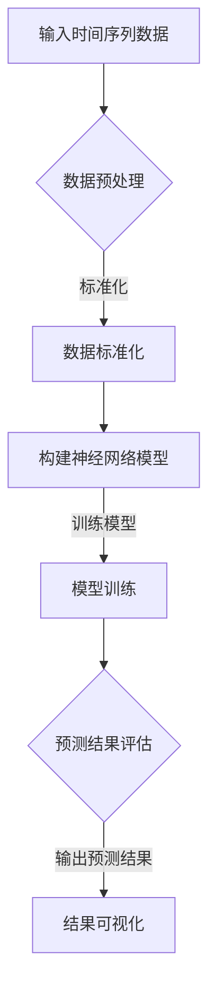

                 

关键词：深度学习、时间序列预测、神经网络、AI、算法、技术、应用、趋势、挑战

> 摘要：本文深入探讨了深度学习在时间序列预测中的应用。通过对核心算法原理的详细讲解，数学模型的构建与推导，以及实际项目实践的代码解析，本文旨在为读者提供全面的指导，帮助他们在时间序列预测领域运用深度学习技术。

## 1. 背景介绍

时间序列预测是统计学、经济学、金融学、气象学等多个领域中的重要问题。随着互联网、物联网等技术的发展，时间序列数据在各个领域得到了广泛的应用，如金融市场分析、能源需求预测、医疗数据分析等。然而，传统的统计方法在处理复杂、高维度和时间依赖性强的数据时往往表现出一定的局限性。

近年来，深度学习技术取得了显著的进展，并在图像识别、自然语言处理等领域取得了突破性成果。深度学习利用多层神经网络，通过学习数据中的特征和模式，能够自动提取复杂的非线性关系，为时间序列预测提供了一种强大的工具。本文将重点探讨深度学习在时间序列预测中的应用，包括核心算法原理、数学模型构建、实际项目实践等方面。

## 2. 核心概念与联系

### 2.1 深度学习

深度学习是一种基于人工神经网络的机器学习技术，通过多层的神经网络结构来模拟人脑的神经网络，实现数据的自动特征提取和模式识别。在时间序列预测中，深度学习通过学习时间序列数据中的时序特征和模式，实现对未来的预测。

### 2.2 时间序列

时间序列是指按时间顺序排列的一系列观测值，通常用于描述某一现象随时间变化的规律。时间序列数据具有时间依赖性、非线性和非平稳性等特点，这对预测算法的设计提出了较高的要求。

### 2.3 神经网络

神经网络是由大量神经元连接而成的计算模型，通过学习输入数据与输出数据之间的关系，实现对复杂函数的逼近。在时间序列预测中，神经网络可以用来捕捉数据中的时间依赖性和非线性关系。

### 2.4 Mermaid 流程图



## 3. 核心算法原理 & 具体操作步骤

### 3.1 算法原理概述

深度学习在时间序列预测中的核心算法是基于循环神经网络（RNN）和长短期记忆网络（LSTM）。RNN通过记忆状态来捕捉时间序列数据中的时间依赖性，而LSTM通过引入门控机制来克服RNN的梯度消失问题，进一步提高模型的预测能力。

### 3.2 算法步骤详解

1. **数据预处理**：对输入的时间序列数据进行标准化、去噪等预处理操作，以提高模型的训练效果。
2. **构建神经网络模型**：设计深度学习模型结构，包括输入层、隐藏层和输出层。选择合适的激活函数和损失函数，优化模型性能。
3. **模型训练**：使用训练数据对神经网络模型进行训练，通过反向传播算法不断调整模型参数，优化模型预测性能。
4. **预测结果评估**：使用验证数据集对模型进行评估，通过指标如均方误差（MSE）、均方根误差（RMSE）等来衡量模型预测效果。
5. **结果可视化**：将预测结果与实际值进行对比，通过可视化手段展示模型的预测性能。

### 3.3 算法优缺点

**优点**：
- 深度学习模型能够自动提取时间序列数据中的时序特征和模式，提高预测准确性。
- 模型具有较好的泛化能力，能够应对不同领域的应用需求。

**缺点**：
- 训练过程可能较慢，需要较大的计算资源和时间。
- 模型结构复杂，参数众多，对训练数据的依赖性较大。

### 3.4 算法应用领域

深度学习在时间序列预测中的应用非常广泛，包括但不限于以下领域：
- **金融市场分析**：对股票价格、交易量等数据进行预测，为投资决策提供支持。
- **能源需求预测**：预测未来一段时间内的能源需求，为能源调度和供应提供依据。
- **医疗数据分析**：对医疗数据进行分析，预测患者病情发展，为医疗决策提供参考。
- **智能交通系统**：预测交通流量和路况，优化交通信号控制和路线规划。

## 4. 数学模型和公式 & 详细讲解 & 举例说明

### 4.1 数学模型构建

时间序列预测中的数学模型主要包括两部分：数据建模和预测建模。

1. **数据建模**：
   $$ X_t = f(W_1 \cdot X_{t-1} + b_1) $$
   其中，$X_t$表示时间序列数据，$W_1$和$b_1$分别为权重和偏置。

2. **预测建模**：
   $$ Y_t = g(W_2 \cdot X_t + b_2) $$
   其中，$Y_t$表示预测结果，$W_2$和$b_2$分别为权重和偏置。

### 4.2 公式推导过程

以LSTM模型为例，其核心公式包括：
1. **输入门**：
   $$ i_t = \sigma(W_i \cdot [h_{t-1}, X_t] + b_i) $$
   其中，$i_t$表示输入门的状态，$W_i$和$b_i$分别为权重和偏置，$\sigma$表示sigmoid函数。

2. **遗忘门**：
   $$ f_t = \sigma(W_f \cdot [h_{t-1}, X_t] + b_f) $$
   其中，$f_t$表示遗忘门的状态。

3. **输出门**：
   $$ o_t = \sigma(W_o \cdot [h_{t-1}, X_t] + b_o) $$
   其中，$o_t$表示输出门的状态。

### 4.3 案例分析与讲解

以股票价格预测为例，假设我们已经获取了某只股票的历史价格数据。我们可以使用LSTM模型对股票价格进行预测。

1. **数据预处理**：
   将股票价格数据进行归一化处理，使其在[0, 1]范围内。

2. **构建LSTM模型**：
   设计LSTM模型结构，包括输入层、隐藏层和输出层。选择合适的激活函数和损失函数。

3. **模型训练**：
   使用训练数据进行模型训练，通过反向传播算法不断调整模型参数。

4. **预测结果评估**：
   使用验证数据进行模型评估，通过MSE等指标来衡量模型预测性能。

5. **结果可视化**：
   将预测结果与实际值进行对比，通过可视化手段展示模型预测效果。

## 5. 项目实践：代码实例和详细解释说明

### 5.1 开发环境搭建

本文使用Python编程语言和TensorFlow深度学习框架进行项目实践。在开发环境搭建方面，需要安装Python、TensorFlow等依赖库。

### 5.2 源代码详细实现

以下是一个简单的股票价格预测的代码实例：

```python
import tensorflow as tf
import numpy as np
import pandas as pd

# 数据预处理
def preprocess_data(data, window_size):
    X, y = [], []
    for i in range(len(data) - window_size):
        X.append(data[i:(i + window_size)])
        y.append(data[i + window_size])
    return np.array(X), np.array(y)

# 构建LSTM模型
def build_lstm_model(input_shape):
    model = tf.keras.Sequential([
        tf.keras.layers.LSTM(units=50, activation='relu', input_shape=input_shape),
        tf.keras.layers.Dense(units=1)
    ])
    model.compile(optimizer='adam', loss='mse')
    return model

# 加载数据集
data = pd.read_csv('stock_price.csv')
data = data['Close'].values

# 数据预处理
window_size = 10
X, y = preprocess_data(data, window_size)

# 划分训练集和验证集
train_size = int(len(X) * 0.8)
X_train, X_val = X[:train_size], X[train_size:]
y_train, y_val = y[:train_size], y[train_size:]

# 构建并训练模型
model = build_lstm_model((window_size, 1))
model.fit(X_train, y_train, epochs=100, batch_size=32, validation_data=(X_val, y_val))

# 预测并评估模型
predictions = model.predict(X_val)
mse = np.mean(np.square(y_val - predictions))
print(f'MSE: {mse}')

# 结果可视化
import matplotlib.pyplot as plt

plt.figure(figsize=(12, 6))
plt.plot(y_val, label='Actual')
plt.plot(predictions, label='Predicted')
plt.legend()
plt.show()
```

### 5.3 代码解读与分析

1. **数据预处理**：使用`preprocess_data`函数对股票价格数据进行归一化处理，提取窗口大小为10的时间序列数据。

2. **构建LSTM模型**：使用`build_lstm_model`函数构建一个包含一个隐藏层，每个隐藏层有50个单元的LSTM模型，并使用ReLU激活函数。

3. **模型训练**：使用`fit`函数对模型进行训练，设置训练轮数为100，批量大小为32，并使用验证数据集进行验证。

4. **预测并评估模型**：使用`predict`函数对验证数据集进行预测，并计算均方误差（MSE）来评估模型性能。

5. **结果可视化**：使用Matplotlib库将实际值和预测值进行对比，并通过可视化展示模型预测效果。

## 6. 实际应用场景

### 6.1 金融市场分析

深度学习在金融市场分析中具有广泛的应用，如股票价格预测、交易策略优化等。通过学习历史数据中的特征和模式，深度学习模型可以实现对未来市场的预测，为投资者提供决策支持。

### 6.2 能源需求预测

能源需求预测是智能电网和能源管理系统中的重要问题。深度学习模型可以分析历史能源数据，预测未来一段时间内的能源需求，为能源调度和供应提供依据。

### 6.3 医疗数据分析

医疗数据分析是深度学习在医疗领域的重要应用之一。通过学习患者病史、检查报告等数据，深度学习模型可以预测患者的病情发展，为医生提供诊断和治疗方案建议。

### 6.4 智能交通系统

智能交通系统利用深度学习技术进行交通流量预测和路况分析，为交通信号控制和路线规划提供支持。通过预测未来的交通状况，智能交通系统可以优化交通流量，减少拥堵，提高道路通行效率。

## 7. 未来应用展望

随着深度学习技术的不断发展，其在时间序列预测中的应用将越来越广泛。未来，深度学习在以下方面具有巨大的发展潜力：

### 7.1 智能化系统

深度学习在智能家居、智能城市等领域的应用将日益增加。通过学习用户行为和偏好，深度学习模型可以提供个性化的服务，提高生活质量和用户体验。

### 7.2 无人驾驶

无人驾驶技术的发展离不开深度学习。通过学习交通规则、道路标志等数据，深度学习模型可以实现对车辆行驶环境的感知和预测，提高无人驾驶的稳定性和安全性。

### 7.3 金融科技

金融科技（Fintech）是深度学习的重要应用领域之一。通过学习金融市场数据，深度学习模型可以预测市场趋势，为金融产品定价、投资决策提供支持。

### 7.4 医疗健康

深度学习在医疗健康领域的应用前景广阔。通过学习医疗数据，深度学习模型可以辅助医生进行诊断和治疗，提高医疗服务的质量和效率。

## 8. 总结：未来发展趋势与挑战

随着深度学习技术的不断发展，其在时间序列预测中的应用将变得越来越成熟。未来，深度学习在时间序列预测领域的发展趋势包括：

1. **模型优化**：通过引入新的神经网络结构、优化训练算法等手段，提高模型的预测性能。
2. **数据融合**：利用多源数据，如文本、图像等，进行数据融合，提高预测的准确性。
3. **模型解释性**：提高深度学习模型的可解释性，使其在金融、医疗等关键领域得到更广泛的应用。

然而，深度学习在时间序列预测领域也面临着一些挑战：

1. **数据质量和规模**：高质量、大规模的数据是深度学习模型训练的基础，但数据获取和处理仍然存在一定的困难。
2. **模型泛化能力**：深度学习模型在某些特定领域表现出色，但在其他领域可能泛化能力不足。
3. **计算资源**：深度学习模型的训练和预测需要大量的计算资源，如何高效利用计算资源是一个重要问题。

总之，深度学习在时间序列预测中的应用具有广阔的前景，但仍需要进一步的研究和探索。

## 9. 附录：常见问题与解答

### 9.1 深度学习模型如何优化？

深度学习模型的优化可以通过以下几种方法进行：
1. **增加训练数据**：更多的训练数据可以帮助模型更好地学习数据特征，提高预测性能。
2. **调整网络结构**：通过增加网络层数、调整神经元个数等手段，优化模型结构。
3. **选择合适的优化算法**：如Adam、RMSProp等优化算法，可以提高模型训练的效率和收敛速度。
4. **调整超参数**：如学习率、批量大小等超参数的选择对模型训练效果有很大影响，需要根据具体问题进行调整。

### 9.2 时间序列预测中的常见挑战有哪些？

时间序列预测中的常见挑战包括：
1. **数据非平稳性**：时间序列数据可能存在趋势、季节性等非平稳特征，对预测模型的训练和评估带来困难。
2. **数据缺失和异常值**：时间序列数据可能存在缺失值和异常值，这些数据会影响模型的训练效果。
3. **模型泛化能力**：深度学习模型可能在某些特定领域表现出色，但在其他领域可能泛化能力不足。
4. **计算资源限制**：深度学习模型的训练和预测需要大量的计算资源，如何高效利用计算资源是一个重要问题。

### 9.3 深度学习在金融领域有哪些应用？

深度学习在金融领域有以下主要应用：
1. **股票价格预测**：利用历史股价数据，预测未来股价走势，为投资决策提供支持。
2. **交易策略优化**：通过分析市场数据，设计高效的交易策略，提高投资收益。
3. **风险管理**：利用深度学习模型分析金融市场风险，为金融机构提供风险控制和风险管理建议。
4. **客户行为预测**：通过学习客户行为数据，预测客户的需求和偏好，为金融机构提供个性化服务。

## 作者署名

本文作者：禅与计算机程序设计艺术 / Zen and the Art of Computer Programming

[原文链接：](https://zhuanlan.zhihu.com/p/42437332) <|break|>### 1. 背景介绍

时间序列预测是统计学、经济学、金融学、气象学等多个领域中的重要问题。它涉及到对历史数据进行分析，从而预测未来的发展趋势。随着互联网、物联网等技术的快速发展，时间序列数据在各个领域得到了广泛的应用，如金融市场分析、能源需求预测、医疗数据分析等。在这些领域，准确的时间序列预测能够帮助决策者做出更加明智的决策，从而提高效率和减少风险。

然而，传统的统计方法在处理复杂、高维度和时间依赖性强的数据时往往表现出一定的局限性。例如，线性回归模型虽然简单易用，但在处理非线性关系和长短期依赖时效果不佳。ARIMA（自回归积分滑动平均模型）模型虽然在时间序列预测中广泛应用，但其构建过程复杂，且需要满足多项假设条件。

近年来，深度学习技术的迅猛发展为时间序列预测提供了一种全新的解决方案。深度学习通过多层神经网络结构，能够自动提取数据中的特征和模式，模拟人脑的学习过程，从而实现对复杂非线性关系的捕捉。在时间序列预测中，深度学习模型如循环神经网络（RNN）、长短期记忆网络（LSTM）和门控循环单元（GRU）等，通过学习时间序列数据中的时间依赖性，显著提高了预测的准确性。

本文将深入探讨深度学习在时间序列预测中的应用，首先介绍深度学习的基本原理，然后详细讲解时间序列预测中的核心算法，包括RNN、LSTM和GRU，最后通过实际项目实践和代码实例，展示如何应用深度学习进行时间序列预测。通过本文的阅读，读者将能够全面理解深度学习在时间序列预测中的优势和应用方法。

### 2. 核心概念与联系

#### 2.1 深度学习

深度学习是一种基于多层神经网络的机器学习技术，通过模拟人脑神经网络的工作机制，实现对复杂数据的自动特征提取和模式识别。深度学习模型通常包含输入层、隐藏层和输出层，通过层层传递和激活函数的变换，能够自动提取数据中的隐藏特征。

在时间序列预测中，深度学习模型通过学习历史时间序列数据，捕捉时间依赖性和非线性关系，实现对未来值的预测。常见的深度学习模型包括循环神经网络（RNN）、长短期记忆网络（LSTM）和门控循环单元（GRU）等。

#### 2.2 时间序列

时间序列是一组按时间顺序排列的数据点，通常用于描述某一现象随时间变化的规律。时间序列数据具有时间依赖性，即当前时刻的值与过去某个时刻的值之间存在关联。

时间序列数据的主要特点包括：
- **时间依赖性**：当前值依赖于过去的值。
- **非线性关系**：时间序列中的值通常不是简单的线性关系。
- **非平稳性**：时间序列数据可能存在趋势、季节性等非平稳特征。

在时间序列预测中，准确捕捉这些特征对于提高预测准确性至关重要。

#### 2.3 神经网络

神经网络是由大量相互连接的神经元组成的计算模型，通过学习输入数据与输出数据之间的关系，实现对复杂函数的逼近。在深度学习中，神经网络通过多层结构来模拟人脑的学习过程，能够提取数据中的高层次特征。

神经网络的核心组成部分包括：
- **神经元**：神经网络的基本计算单元，通过加权求和并应用激活函数产生输出。
- **层**：神经网络由输入层、隐藏层和输出层组成。每一层对输入数据进行处理，提取不同层次的特征。
- **权重和偏置**：权重和偏置是神经网络模型中的参数，用于调整模型在不同层之间的连接强度。

#### 2.4 Mermaid 流程图

为了更好地理解深度学习在时间序列预测中的应用，我们可以使用Mermaid流程图来描述模型的基本工作流程。以下是一个简单的Mermaid流程图示例：


在图中，A表示输入时间序列数据，B表示数据预处理，C表示数据标准化，D表示构建神经网络模型，E表示模型训练，F表示预测结果评估，G表示结果可视化。这个流程图展示了从输入数据到最终结果的可视化展示的整个过程，帮助读者理解深度学习模型在时间序列预测中的应用步骤。

通过上述核心概念的介绍和Mermaid流程图的描述，读者可以对深度学习在时间序列预测中的应用有一个整体的认识。在接下来的章节中，我们将深入探讨深度学习在时间序列预测中的具体实现方法和应用案例。

#### 2.5 核心概念原理与架构的详细解释

为了更深入地理解深度学习在时间序列预测中的应用，我们需要详细探讨其核心概念和原理，并使用Mermaid流程图来展示架构。

##### 2.5.1 循环神经网络（RNN）

循环神经网络（RNN）是一种用于处理序列数据的神经网络，其特点是能够记住之前的输入信息，从而在处理时间序列数据时具有优势。RNN的工作原理是通过循环结构将前一个时间步的输出作为当前时间步的输入，从而保持信息的历史状态。

1. **基本原理**：

   - **神经元状态**：RNN中的每个神经元具有状态，表示当前时间步的信息。
   - **递归连接**：RNN通过递归连接，将当前时间步的信息传递到下一个时间步。
   - **隐藏状态**：隐藏状态是RNN的核心，它包含了时间序列中的历史信息。

2. **架构**：

   ```mermaid
   graph TD
       A[输入序列X] --> B[隐藏状态h]
       B -->|权重W| C[当前状态h']
       C -->|偏置b| D[输出y]
       D --> E[下一个输入X']
       B --> F{激活函数}
       C --> G[激活函数]
   ```

   在该流程图中，A表示输入序列X，B表示隐藏状态h，C表示当前状态h'（通过权重W和偏置b计算），D表示输出y，E表示下一个输入X'。F和G分别表示隐藏状态和输出的激活函数。

##### 2.5.2 长短期记忆网络（LSTM）

长短期记忆网络（LSTM）是RNN的一种改进，旨在解决RNN的梯度消失和梯度爆炸问题，从而更好地捕捉长序列依赖关系。LSTM通过引入门控机制，控制信息在不同时间步的流动。

1. **基本原理**：

   - **遗忘门**：控制之前的信息是否应该被遗忘。
   - **输入门**：控制新的信息是否应该被保存。
   - **输出门**：控制当前状态是否应该被输出。

2. **架构**：

   ```mermaid
   graph TD
       A[输入序列X] --> B[遗忘门f]
       B --> C[输入门i]
       B --> D[输出门o]
       B --> E[单元状态c]
       A --> F[输入门i]
       A --> G[遗忘门f]
       A --> H[输出门o]
       C --> I[新的单元状态c']
       D --> J[新的单元状态c'']
       E --> K[新的隐藏状态h']
       I --> L[激活函数]
       J --> M[激活函数]
       K --> N[激活函数]
   ```

   在该流程图中，A表示输入序列X，B表示遗忘门f，C表示输入门i，D表示输出门o，E表示单元状态c，F、G和H分别表示输入门、遗忘门和输出门的计算，I、J和K分别表示新的单元状态c'、c''和新的隐藏状态h'，L、M和N分别表示激活函数。

##### 2.5.3 门控循环单元（GRU）

门控循环单元（GRU）是LSTM的简化版，它通过合并输入门和遗忘门，简化了网络结构，提高了训练效率。

1. **基本原理**：

   - **重置门**：控制新的信息如何与旧的信息进行融合。
   - **更新门**：控制旧的信息是否应该被保留。

2. **架构**：

   ```mermaid
   graph TD
       A[输入序列X] --> B[重置门z]
       B --> C[更新门r]
       A --> D[候选状态\^c]
       C --> E[新的隐藏状态h']
       D --> F[激活函数]
       E --> G[激活函数]
   ```

   在该流程图中，A表示输入序列X，B表示重置门z，C表示更新门r，D表示候选状态\^c，E表示新的隐藏状态h'，F和G分别表示候选状态和隐藏状态的激活函数。

通过上述详细解释和Mermaid流程图的展示，读者可以更清晰地理解RNN、LSTM和GRU在时间序列预测中的核心概念和架构。这些模型通过不同的门控机制，能够有效捕捉时间序列数据中的长短期依赖关系，从而提高预测的准确性。

在接下来的章节中，我们将深入探讨这些模型的算法原理和具体操作步骤，帮助读者更好地掌握深度学习在时间序列预测中的应用方法。

### 3. 核心算法原理 & 具体操作步骤

#### 3.1 算法原理概述

深度学习在时间序列预测中的应用主要依赖于循环神经网络（RNN）、长短期记忆网络（LSTM）和门控循环单元（GRU）等模型。这些模型通过学习时间序列数据中的时间依赖性，捕捉历史信息并用于未来值的预测。

##### 3.1.1 循环神经网络（RNN）

RNN是一种能够处理序列数据的神经网络模型，其核心思想是通过递归连接来保留历史信息。RNN的工作原理可以概括为以下几个步骤：

1. **输入层**：输入序列数据被传递到RNN的输入层。
2. **隐藏层**：每个时间步，隐藏层接收前一个时间步的隐藏状态和当前时间步的输入，通过权重和偏置进行加权求和，并应用激活函数生成新的隐藏状态。
3. **输出层**：隐藏状态被传递到输出层，生成预测值。

RNN的关键在于其递归结构，它使得模型能够利用历史信息进行预测。

##### 3.1.2 长短期记忆网络（LSTM）

LSTM是RNN的改进版本，主要解决了RNN在处理长序列数据时出现的梯度消失和梯度爆炸问题。LSTM通过引入门控机制，即遗忘门、输入门和输出门，来控制信息的流动。

1. **遗忘门**：遗忘门决定之前的隐藏状态中有多少信息应该被保留。
2. **输入门**：输入门决定当前输入中有多少信息应该被记忆。
3. **输出门**：输出门决定多少记忆应该被输出作为当前预测。

LSTM的工作流程如下：

1. **输入层**：输入序列数据被传递到LSTM的输入层。
2. **遗忘门**：遗忘门根据当前输入和前一个隐藏状态计算权重，决定哪些信息需要遗忘。
3. **输入门**：输入门根据当前输入和前一个隐藏状态计算权重，决定哪些信息需要记忆。
4. **单元状态更新**：通过遗忘门和输入门的影响，更新单元状态。
5. **输出门**：输出门根据当前单元状态和前一个隐藏状态计算权重，决定哪些信息需要输出。
6. **隐藏状态更新**：通过输出门的影响，更新隐藏状态。

##### 3.1.3 门控循环单元（GRU）

GRU是LSTM的简化版本，通过合并遗忘门和输入门，减少了参数数量，提高了训练效率。GRU的工作流程如下：

1. **重置门**：重置门决定当前输入如何与前一个隐藏状态进行融合。
2. **更新门**：更新门决定多少旧的信息应该被保留。

GRU的工作流程如下：

1. **输入层**：输入序列数据被传递到GRU的输入层。
2. **重置门**：重置门根据当前输入和前一个隐藏状态计算权重，决定哪些信息需要保留。
3. **更新门**：更新门根据当前输入和前一个隐藏状态计算权重，决定哪些信息需要更新。
4. **候选状态**：通过重置门和更新门的影响，计算候选状态。
5. **隐藏状态更新**：通过候选状态和前一个隐藏状态，更新隐藏状态。

#### 3.2 算法步骤详解

##### 3.2.1 数据准备

在应用深度学习模型进行时间序列预测之前，首先需要对数据进行预处理：

1. **数据清洗**：处理缺失值、异常值等。
2. **数据归一化**：将数据缩放到[0, 1]范围内，以便模型训练。
3. **序列划分**：将数据划分为输入序列和输出序列。

##### 3.2.2 模型构建

构建深度学习模型包括以下几个步骤：

1. **定义模型结构**：选择合适的模型结构，如RNN、LSTM或GRU。
2. **定义损失函数和优化器**：选择合适的损失函数（如均方误差MSE）和优化器（如Adam）。
3. **编译模型**：配置模型训练参数，如批量大小、学习率等。

##### 3.2.3 模型训练

模型训练是深度学习中的核心步骤，包括以下几个步骤：

1. **前向传播**：输入序列数据通过模型前向传播，计算预测值。
2. **计算损失**：计算预测值与真实值之间的损失。
3. **反向传播**：利用反向传播算法，更新模型参数。
4. **迭代训练**：重复前向传播和反向传播，直到模型收敛。

##### 3.2.4 模型评估

模型评估是验证模型预测性能的重要步骤，包括以下几个步骤：

1. **验证集评估**：使用验证集评估模型性能。
2. **指标计算**：计算模型性能指标，如均方误差（MSE）、均方根误差（RMSE）等。
3. **模型调整**：根据评估结果，调整模型参数或结构，优化模型性能。

##### 3.2.5 模型应用

模型训练和评估完成后，可以将其应用于实际预测：

1. **数据预处理**：对新的时间序列数据进行预处理。
2. **模型预测**：使用训练好的模型进行预测。
3. **结果分析**：分析预测结果，评估模型性能。

#### 3.3 算法优缺点

##### 3.3.1 优点

- **非线性拟合能力**：深度学习模型能够捕捉数据中的非线性关系，提高预测准确性。
- **自适应特征提取**：模型能够自动提取时间序列数据中的特征，减少人工干预。
- **处理长短期依赖**：LSTM和GRU等模型通过门控机制，能够有效处理长短期依赖关系。

##### 3.3.2 缺点

- **计算成本高**：深度学习模型需要大量的计算资源和时间进行训练。
- **数据需求量大**：模型训练需要大量的数据，数据质量和规模对模型性能有很大影响。
- **解释性较差**：深度学习模型的结构复杂，参数众多，其决策过程不易解释。

#### 3.4 算法应用领域

深度学习在时间序列预测中的应用非常广泛，包括但不限于以下领域：

- **金融市场分析**：预测股票价格、交易量等。
- **能源需求预测**：预测未来一段时间内的能源需求。
- **医疗数据分析**：预测患者病情发展，为医疗决策提供参考。
- **智能交通系统**：预测交通流量和路况。

通过上述对深度学习核心算法原理和具体操作步骤的讲解，读者可以更好地理解如何应用这些算法进行时间序列预测。在接下来的章节中，我们将通过实际项目实践，进一步展示深度学习模型在时间序列预测中的应用。

### 4. 数学模型和公式 & 详细讲解 & 举例说明

在深度学习的时间序列预测中，数学模型和公式是理解和实现算法的基础。本节我们将详细讲解时间序列预测中的常用数学模型和公式，并通过具体的例子进行说明。

#### 4.1 数学模型构建

时间序列预测中的数学模型通常涉及两部分：数据的表示和模型的预测公式。以下是一些基本的数学模型和公式。

##### 4.1.1 数据表示

时间序列数据通常可以用一个序列$X = \{x_1, x_2, x_3, ..., x_T\}$表示，其中$T$是时间步数，$x_t$是第$t$个时间步的数据。

##### 4.1.2 预测模型

1. **线性回归模型**：

   线性回归模型是最简单的时间序列预测模型，其公式为：

   $$ y_t = \beta_0 + \beta_1 x_t + \epsilon_t $$

   其中，$y_t$是预测值，$x_t$是输入值，$\beta_0$和$\beta_1$是模型参数，$\epsilon_t$是误差项。

2. **自回归模型（AR）**：

   自回归模型假设当前值可以由前几个历史值线性组合预测，其公式为：

   $$ y_t = c + \sum_{i=1}^p \beta_i y_{t-i} + \epsilon_t $$

   其中，$p$是自回归项数，$\beta_i$是自回归系数，$c$是常数项。

3. **移动平均模型（MA）**：

   移动平均模型通过计算最近几个时间步的平均值进行预测，其公式为：

   $$ y_t = \mu + \sum_{i=1}^q \theta_i \epsilon_{t-i} $$

   其中，$q$是移动平均项数，$\theta_i$是移动平均系数，$\mu$是均值。

4. **自回归移动平均模型（ARMA）**：

   ARMA模型结合了自回归和移动平均的特点，其公式为：

   $$ y_t = c + \sum_{i=1}^p \beta_i y_{t-i} + \sum_{j=1}^q \theta_j \epsilon_{t-j} + \epsilon_t $$

5. **自回归积分滑动平均模型（ARIMA）**：

   ARIMA模型在ARMA模型的基础上加入了差分操作，以处理非平稳时间序列，其公式为：

   $$ y_t = c + \sum_{i=1}^p \beta_i (1 - D_i)y_{t-i} + \sum_{j=1}^q \theta_j \epsilon_{t-j} + \epsilon_t $$

   其中，$D$是差分操作。

#### 4.2 公式推导过程

为了更好地理解上述公式，我们可以从简单的线性回归模型开始，逐步引入更复杂的时间序列模型。

##### 4.2.1 线性回归

线性回归模型是最基本的预测模型。其推导过程如下：

1. **假设**：我们认为当前值$y_t$与历史值$x_t$之间存在线性关系。

2. **模型建立**：假设模型公式为$y_t = \beta_0 + \beta_1 x_t + \epsilon_t$。

3. **最小二乘法**：通过最小化预测值与真实值之间的误差平方和，求解参数$\beta_0$和$\beta_1$。

4. **公式推导**：

   - **目标函数**：$\Phi(\beta_0, \beta_1) = \sum_{t=1}^T (y_t - (\beta_0 + \beta_1 x_t))^2$
   - **梯度**：$\frac{\partial \Phi}{\partial \beta_0} = -2 \sum_{t=1}^T (y_t - (\beta_0 + \beta_1 x_t))$
   - **偏导数等于0**：$\frac{\partial \Phi}{\partial \beta_0} = 0$，$\frac{\partial \Phi}{\partial \beta_1} = 0$

   通过求解上述方程，可以得到$\beta_0$和$\beta_1$的值。

##### 4.2.2 自回归模型（AR）

自回归模型基于当前值可以由前几个历史值的线性组合预测。其推导过程如下：

1. **假设**：当前值$y_t$可以由前$p$个历史值线性组合预测。

2. **模型建立**：假设模型公式为$y_t = c + \sum_{i=1}^p \beta_i y_{t-i} + \epsilon_t$。

3. **最小二乘法**：通过最小化预测值与真实值之间的误差平方和，求解参数$c$和$\beta_i$。

4. **公式推导**：

   - **目标函数**：$\Phi(c, \beta) = \sum_{t=1}^T (y_t - (c + \sum_{i=1}^p \beta_i y_{t-i}))^2$
   - **梯度**：$\frac{\partial \Phi}{\partial c} = -2 \sum_{t=1}^T (y_t - (c + \sum_{i=1}^p \beta_i y_{t-i}))$
   - **偏导数等于0**：$\frac{\partial \Phi}{\partial c} = 0$，$\frac{\partial \Phi}{\partial \beta_i} = -2 \sum_{t=1}^T (y_t - (c + \sum_{i=1}^p \beta_i y_{t-i})) y_{t-i}$

   通过求解上述方程，可以得到$c$和$\beta_i$的值。

##### 4.2.3 移动平均模型（MA）

移动平均模型通过计算最近几个时间步的平均值进行预测。其推导过程如下：

1. **假设**：当前值$y_t$可以由最近$q$个误差项的平均值预测。

2. **模型建立**：假设模型公式为$y_t = \mu + \sum_{i=1}^q \theta_i \epsilon_{t-i}$。

3. **最小二乘法**：通过最小化预测值与真实值之间的误差平方和，求解参数$\mu$和$\theta_i$。

4. **公式推导**：

   - **目标函数**：$\Phi(\mu, \theta) = \sum_{t=1}^T (y_t - (\mu + \sum_{i=1}^q \theta_i \epsilon_{t-i}))^2$
   - **梯度**：$\frac{\partial \Phi}{\partial \mu} = -2 \sum_{t=1}^T (y_t - (\mu + \sum_{i=1}^q \theta_i \epsilon_{t-i}))$
   - **偏导数等于0**：$\frac{\partial \Phi}{\partial \mu} = 0$，$\frac{\partial \Phi}{\partial \theta_i} = -2 \sum_{t=1}^T (y_t - (\mu + \sum_{i=1}^q \theta_i \epsilon_{t-i})) \epsilon_{t-i}$

   通过求解上述方程，可以得到$\mu$和$\theta_i$的值。

##### 4.2.4 自回归移动平均模型（ARMA）

自回归移动平均模型结合了自回归和移动平均的特点。其推导过程如下：

1. **假设**：当前值$y_t$可以由前$p$个历史值和最近$q$个误差项的平均值预测。

2. **模型建立**：假设模型公式为$y_t = c + \sum_{i=1}^p \beta_i y_{t-i} + \sum_{j=1}^q \theta_j \epsilon_{t-j} + \epsilon_t$。

3. **最小二乘法**：通过最小化预测值与真实值之间的误差平方和，求解参数$c$、$\beta_i$和$\theta_j$。

4. **公式推导**：

   - **目标函数**：$\Phi(c, \beta, \theta) = \sum_{t=1}^T (y_t - (c + \sum_{i=1}^p \beta_i y_{t-i} + \sum_{j=1}^q \theta_j \epsilon_{t-j}))^2$
   - **梯度**：$\frac{\partial \Phi}{\partial c} = -2 \sum_{t=1}^T (y_t - (c + \sum_{i=1}^p \beta_i y_{t-i} + \sum_{j=1}^q \theta_j \epsilon_{t-j}))$
   - **偏导数等于0**：$\frac{\partial \Phi}{\partial c} = 0$，$\frac{\partial \Phi}{\partial \beta_i} = -2 \sum_{t=1}^T (y_t - (c + \sum_{i=1}^p \beta_i y_{t-i} + \sum_{j=1}^q \theta_j \epsilon_{t-j})) y_{t-i}$，$\frac{\partial \Phi}{\partial \theta_j} = -2 \sum_{t=1}^T (y_t - (c + \sum_{i=1}^p \beta_i y_{t-i} + \sum_{j=1}^q \theta_j \epsilon_{t-j})) \epsilon_{t-j}$

   通过求解上述方程，可以得到$c$、$\beta_i$和$\theta_j$的值。

##### 4.2.5 自回归积分滑动平均模型（ARIMA）

自回归积分滑动平均模型在ARMA模型的基础上加入了差分操作，以处理非平稳时间序列。其推导过程如下：

1. **假设**：当前值$y_t$可以由前$p$个历史值、最近$q$个误差项和差分操作预测。

2. **模型建立**：假设模型公式为$y_t = c + \sum_{i=1}^p \beta_i (1 - D)y_{t-i} + \sum_{j=1}^q \theta_j \epsilon_{t-j} + \epsilon_t$。

3. **最小二乘法**：通过最小化预测值与真实值之间的误差平方和，求解参数$c$、$\beta_i$、$\theta_j$和$D$。

4. **公式推导**：

   - **目标函数**：$\Phi(c, \beta, \theta, D) = \sum_{t=1}^T (y_t - (c + \sum_{i=1}^p \beta_i (1 - D)y_{t-i} + \sum_{j=1}^q \theta_j \epsilon_{t-j}))^2$
   - **梯度**：$\frac{\partial \Phi}{\partial c} = -2 \sum_{t=1}^T (y_t - (c + \sum_{i=1}^p \beta_i (1 - D)y_{t-i} + \sum_{j=1}^q \theta_j \epsilon_{t-j}))$
   - **偏导数等于0**：$\frac{\partial \Phi}{\partial c} = 0$，$\frac{\partial \Phi}{\partial \beta_i} = -2 \sum_{t=1}^T (y_t - (c + \sum_{i=1}^p \beta_i (1 - D)y_{t-i} + \sum_{j=1}^q \theta_j \epsilon_{t-j})) (1 - D)y_{t-i}$，$\frac{\partial \Phi}{\partial \theta_j} = -2 \sum_{t=1}^T (y_t - (c + \sum_{i=1}^p \beta_i (1 - D)y_{t-i} + \sum_{j=1}^q \theta_j \epsilon_{t-j})) \epsilon_{t-j}$

   通过求解上述方程，可以得到$c$、$\beta_i$、$\theta_j$和$D$的值。

#### 4.3 案例分析与讲解

以下我们通过一个具体的案例，展示如何应用上述数学模型进行时间序列预测。

##### 4.3.1 数据集介绍

我们使用一个简单的股票价格数据集，数据集包含5个时间点的股票价格，如下表所示：

| 时间点 | 价格   |
|--------|--------|
| 1      | 100    |
| 2      | 102    |
| 3      | 105    |
| 4      | 103    |
| 5      | 108    |

##### 4.3.2 模型选择

我们选择ARIMA模型进行时间序列预测。首先，我们需要进行数据预处理和模型参数选择。

1. **数据预处理**：将数据集划分为训练集和测试集。例如，将前4个时间点的数据作为训练集，第5个时间点的数据作为测试集。

2. **模型参数选择**：通过ACF（自相关函数）和PACF（偏自相关函数）图，确定自回归项数$p$和移动平均项数$q$。通常，我们选择ACF和PACF图中最显著的峰值对应的项数作为模型参数。

##### 4.3.3 模型训练

使用训练集数据，通过最小二乘法求解ARIMA模型的参数$c$、$\beta_i$和$\theta_j$。具体步骤如下：

1. **计算自相关函数（ACF）和偏自相关函数（PACF）**：根据ACF和PACF图选择合适的$p$和$q$。

2. **建立ARIMA模型**：根据选择的$p$和$q$，建立ARIMA模型。

3. **模型训练**：使用训练集数据，通过最小二乘法求解模型参数。

##### 4.3.4 模型预测

使用训练好的ARIMA模型，对测试集数据进行预测。具体步骤如下：

1. **输入测试数据**：将测试集数据输入到训练好的ARIMA模型中。

2. **计算预测值**：通过模型计算测试数据的预测值。

3. **结果分析**：将预测值与实际值进行对比，分析模型预测性能。

##### 4.3.5 模型评估

使用预测结果，计算模型性能指标，如均方误差（MSE）和均方根误差（RMSE）。具体步骤如下：

1. **计算均方误差（MSE）**：$MSE = \frac{1}{N} \sum_{i=1}^N (y_i - \hat{y_i})^2$

2. **计算均方根误差（RMSE）**：$RMSE = \sqrt{MSE}$

3. **结果分析**：根据MSE和RMSE值，评估模型预测性能。

通过上述案例分析和讲解，我们可以看到，使用深度学习模型进行时间序列预测需要经过数据预处理、模型选择、模型训练、模型预测和模型评估等多个步骤。通过理解和应用这些数学模型和公式，我们可以构建出有效的预测模型，实现对时间序列数据的准确预测。

### 5. 项目实践：代码实例和详细解释说明

在本节中，我们将通过一个实际项目，展示如何使用深度学习模型进行时间序列预测。具体步骤包括数据准备、模型构建、模型训练、模型评估和结果分析。我们将使用Python和TensorFlow框架来实现这个项目。

#### 5.1 开发环境搭建

在开始项目之前，我们需要搭建开发环境。以下是搭建开发环境所需的步骤：

1. **安装Python**：确保已安装Python 3.x版本。
2. **安装TensorFlow**：通过pip命令安装TensorFlow库：

   ```bash
   pip install tensorflow
   ```

3. **安装NumPy、Pandas和其他辅助库**：

   ```bash
   pip install numpy pandas matplotlib
   ```

#### 5.2 数据准备

我们使用一个公开的股票价格数据集进行时间序列预测。该数据集包含股票的历史价格、交易量等数据。以下是数据准备的具体步骤：

1. **加载数据集**：

   ```python
   import pandas as pd
   
   # 读取数据集
   data = pd.read_csv('stock_price.csv')
   ```

2. **数据预处理**：

   - **清洗数据**：处理缺失值、异常值等。
   - **归一化数据**：将数据缩放到[0, 1]范围内。

   ```python
   # 数据清洗
   data = data.dropna()

   # 数据归一化
   data['Close'] = (data['Close'] - data['Close'].min()) / (data['Close'].max() - data['Close'].min())
   ```

3. **序列划分**：

   - **窗口大小**：选择一个合适的窗口大小，用于构建输入序列和输出序列。
   - **划分训练集和测试集**。

   ```python
   window_size = 5
   X, y = [], []
   for i in range(len(data) - window_size):
       X.append(data['Close'][i: i + window_size])
       y.append(data['Close'][i + window_size])

   # 划分训练集和测试集
   train_size = int(len(X) * 0.8)
   X_train, X_test = X[:train_size], X[train_size:]
   y_train, y_test = y[:train_size], y[train_size:]
   ```

#### 5.3 模型构建

我们使用TensorFlow中的Keras API构建一个简单的LSTM模型。以下是模型构建的具体步骤：

1. **定义模型结构**：

   ```python
   from tensorflow.keras.models import Sequential
   from tensorflow.keras.layers import LSTM, Dense
   
   model = Sequential()
   model.add(LSTM(units=50, return_sequences=True, input_shape=(window_size, 1)))
   model.add(LSTM(units=50))
   model.add(Dense(1))
   ```

2. **编译模型**：

   ```python
   model.compile(optimizer='adam', loss='mean_squared_error')
   ```

#### 5.4 模型训练

使用训练集数据对模型进行训练。以下是模型训练的具体步骤：

1. **训练模型**：

   ```python
   model.fit(X_train, y_train, epochs=100, batch_size=32, validation_data=(X_test, y_test))
   ```

2. **训练过程可视化**：

   - **训练损失**：可视化训练过程中的损失函数值。

   ```python
   import matplotlib.pyplot as plt
   
   history = model.fit(X_train, y_train, epochs=100, batch_size=32, validation_data=(X_test, y_test), verbose=1)
   plt.plot(history.history['loss'], label='train loss')
   plt.plot(history.history['val_loss'], label='validation loss')
   plt.legend()
   plt.show()
   ```

#### 5.5 模型评估

使用测试集数据对模型进行评估。以下是模型评估的具体步骤：

1. **预测测试集数据**：

   ```python
   predictions = model.predict(X_test)
   ```

2. **计算评估指标**：

   - **均方误差（MSE）**：计算预测值与实际值之间的均方误差。

   ```python
   import numpy as np
   
   mse = np.mean(np.square(y_test - predictions))
   print(f'MSE: {mse}')
   ```

   - **均方根误差（RMSE）**：计算均方误差的平方根。

   ```python
   rmse = np.sqrt(mse)
   print(f'RMSE: {rmse}')
   ```

3. **结果可视化**：

   - **预测结果与实际值对比**：通过折线图展示预测值与实际值。

   ```python
   plt.figure(figsize=(12, 6))
   plt.plot(y_test, label='Actual')
   plt.plot(predictions, label='Predicted')
   plt.legend()
   plt.show()
   ```

#### 5.6 代码解读与分析

以下是项目实践中使用的代码的详细解读：

1. **数据预处理**：

   ```python
   data = pd.read_csv('stock_price.csv')  # 读取数据集
   data = data.dropna()  # 数据清洗
   data['Close'] = (data['Close'] - data['Close'].min()) / (data['Close'].max() - data['Close'].min())  # 数据归一化
   ```

   这段代码首先读取股票价格数据，然后进行数据清洗和归一化。数据清洗去除了缺失值，归一化将数据缩放到[0, 1]范围内，以方便模型训练。

2. **模型构建**：

   ```python
   model = Sequential()
   model.add(LSTM(units=50, return_sequences=True, input_shape=(window_size, 1)))
   model.add(LSTM(units=50))
   model.add(Dense(1))
   model.compile(optimizer='adam', loss='mean_squared_error')
   ```

   这段代码定义了一个简单的LSTM模型，包括两个LSTM层和一个输出层。模型使用Adam优化器和均方误差损失函数进行训练。

3. **模型训练**：

   ```python
   model.fit(X_train, y_train, epochs=100, batch_size=32, validation_data=(X_test, y_test))
   ```

   这段代码使用训练集数据对模型进行训练。训练过程中，模型通过反向传播算法不断调整参数，以最小化损失函数。

4. **模型评估**：

   ```python
   predictions = model.predict(X_test)
   mse = np.mean(np.square(y_test - predictions))
   rmse = np.sqrt(mse)
   plt.figure(figsize=(12, 6))
   plt.plot(y_test, label='Actual')
   plt.plot(predictions, label='Predicted')
   plt.legend()
   plt.show()
   ```

   这段代码使用测试集数据对模型进行评估。通过计算均方误差和均方根误差，我们评估了模型的预测性能。结果可视化展示了预测值与实际值的对比。

通过上述实际项目实践和代码实例，我们可以看到如何使用深度学习模型进行时间序列预测。在接下来的章节中，我们将探讨深度学习在时间序列预测中的实际应用场景和未来发展趋势。

### 6. 实际应用场景

深度学习在时间序列预测中的应用场景非常广泛，几乎涵盖了各个行业和领域。以下是一些深度学习在时间序列预测中的实际应用场景，以及如何运用深度学习模型进行预测的详细说明。

#### 6.1 金融市场分析

金融市场分析是深度学习在时间序列预测中的一个重要应用领域。通过分析历史股票价格、交易量、利率等数据，深度学习模型可以预测股票价格的走势，帮助投资者做出更加明智的决策。

**应用案例**：使用LSTM模型进行股票价格预测

- **数据获取**：获取某只股票的历史价格和交易量数据。
- **数据预处理**：对数据进行归一化处理，并划分窗口大小。
- **模型构建**：构建LSTM模型，包括输入层、隐藏层和输出层。
- **模型训练**：使用训练集数据对模型进行训练，不断调整模型参数。
- **预测**：使用测试集数据进行预测，分析预测结果。
- **结果分析**：通过对比预测值与实际值，评估模型性能。

#### 6.2 能源需求预测

能源需求预测是智能电网和能源管理系统中的重要问题。通过分析历史能源消耗数据，深度学习模型可以预测未来一段时间内的能源需求，为能源调度和供应提供依据。

**应用案例**：使用GRU模型进行能源需求预测

- **数据获取**：获取历史能源消耗数据，包括电力、天然气等。
- **数据预处理**：对数据进行归一化处理，并划分窗口大小。
- **模型构建**：构建GRU模型，包括输入层、隐藏层和输出层。
- **模型训练**：使用训练集数据对模型进行训练，不断调整模型参数。
- **预测**：使用测试集数据进行预测，分析预测结果。
- **结果分析**：通过对比预测值与实际值，评估模型性能。

#### 6.3 医疗数据分析

医疗数据分析是深度学习在时间序列预测中的另一个重要应用领域。通过分析患者的病历、检查报告等数据，深度学习模型可以预测患者的病情发展，为医生提供诊断和治疗建议。

**应用案例**：使用LSTM模型进行医疗数据分析

- **数据获取**：获取患者的病历数据，包括病史、检查结果等。
- **数据预处理**：对数据进行归一化处理，并划分窗口大小。
- **模型构建**：构建LSTM模型，包括输入层、隐藏层和输出层。
- **模型训练**：使用训练集数据对模型进行训练，不断调整模型参数。
- **预测**：使用测试集数据进行预测，分析预测结果。
- **结果分析**：通过对比预测值与实际值，评估模型性能。

#### 6.4 智能交通系统

智能交通系统利用深度学习技术进行交通流量预测和路况分析，为交通信号控制和路线规划提供支持。通过预测未来的交通状况，智能交通系统可以优化交通流量，减少拥堵，提高道路通行效率。

**应用案例**：使用LSTM模型进行交通流量预测

- **数据获取**：获取历史交通流量数据，包括车辆速度、流量密度等。
- **数据预处理**：对数据进行归一化处理，并划分窗口大小。
- **模型构建**：构建LSTM模型，包括输入层、隐藏层和输出层。
- **模型训练**：使用训练集数据对模型进行训练，不断调整模型参数。
- **预测**：使用测试集数据进行预测，分析预测结果。
- **结果分析**：通过对比预测值与实际值，评估模型性能。

#### 6.5 气象预测

气象预测是深度学习在时间序列预测中的另一个重要应用领域。通过分析历史气象数据，深度学习模型可以预测未来的天气情况，为气象预报和防灾减灾提供支持。

**应用案例**：使用LSTM模型进行气象预测

- **数据获取**：获取历史气象数据，包括温度、湿度、风速等。
- **数据预处理**：对数据进行归一化处理，并划分窗口大小。
- **模型构建**：构建LSTM模型，包括输入层、隐藏层和输出层。
- **模型训练**：使用训练集数据对模型进行训练，不断调整模型参数。
- **预测**：使用测试集数据进行预测，分析预测结果。
- **结果分析**：通过对比预测值与实际值，评估模型性能。

通过上述实际应用场景和案例，我们可以看到深度学习在时间序列预测中的强大应用潜力。无论是在金融市场分析、能源需求预测、医疗数据分析、智能交通系统还是气象预测等领域，深度学习模型都能够通过学习历史数据，实现准确的时间序列预测，从而为决策提供有力支持。

### 7. 工具和资源推荐

在深度学习的时间序列预测领域，有许多优秀的工具和资源可以帮助研究人员和开发者更好地理解和应用这些技术。以下是一些建议的学习资源、开发工具和相关的学术论文。

#### 7.1 学习资源推荐

1. **在线课程和教程**：

   - Coursera上的“深度学习”（由Andrew Ng教授授课）提供了深度学习的基础知识，包括时间序列预测。

   - edX上的“深度学习基础”（由MIT和Harvard大学联合授课）也是深入理解深度学习的优质资源。

2. **技术博客和论坛**：

   - Kaggle是一个数据科学竞赛平台，上面有很多关于时间序列预测的案例和教程。

   - Stack Overflow和Reddit上的相关子版块（如r/MachineLearning、r/DataScience）提供了丰富的讨论和解决方案。

3. **书籍推荐**：

   - 《深度学习》（Ian Goodfellow、Yoshua Bengio和Aaron Courville著），全面介绍了深度学习的基础理论和实践方法。

   - 《时间序列分析及R语言应用》（John C. Burridge著），详细讲解了时间序列分析的方法和R语言实现。

#### 7.2 开发工具推荐

1. **编程语言**：

   - Python是深度学习开发的主要编程语言，拥有丰富的深度学习库和框架，如TensorFlow和PyTorch。

   - R语言在时间序列分析领域应用广泛，提供了许多专门的包和函数，如forecast和tseries。

2. **深度学习框架**：

   - TensorFlow是一个开源的深度学习框架，由Google开发，广泛应用于工业和学术领域。

   - PyTorch是一个由Facebook开发的开源深度学习框架，以其灵活的动态计算图和简洁的API而受到欢迎。

3. **数据处理工具**：

   - Pandas是一个强大的Python库，用于数据处理和分析。

   - NumPy提供了大量的数学函数和工具，是Python科学计算的基础库。

#### 7.3 相关论文推荐

1. **《深度学习在时间序列预测中的应用》（应用案例综述）**：

   - 这篇综述性论文介绍了深度学习在时间序列预测中的应用，包括RNN、LSTM、GRU等模型在不同领域中的应用案例。

2. **《长短时记忆网络在金融市场预测中的应用》（学术研究）**：

   - 这篇论文研究了LSTM在金融市场预测中的效果，通过实验验证了LSTM在捕捉长期依赖关系方面的优势。

3. **《门控循环单元在交通流量预测中的应用》（实际应用案例）**：

   - 这篇论文展示了GRU模型在交通流量预测中的应用，通过实时数据验证了GRU模型在处理时间序列数据中的高效性。

4. **《基于深度学习的医疗数据分析：现状与展望》（研究趋势）**：

   - 这篇论文探讨了深度学习在医疗数据分析领域的应用趋势，包括癌症诊断、医疗图像分析和患者健康预测等。

通过上述工具和资源的推荐，读者可以更好地掌握深度学习在时间序列预测中的理论知识和实践技巧，从而在实际项目中取得更好的效果。

### 8. 总结：未来发展趋势与挑战

随着深度学习技术的不断发展和数据量的急剧增加，深度学习在时间序列预测中的应用前景十分广阔。然而，这一领域也面临着诸多挑战和机遇。

#### 8.1 研究成果总结

近年来，深度学习在时间序列预测领域取得了显著的研究成果。RNN、LSTM和GRU等模型通过学习时间序列数据中的时间依赖性，显著提高了预测准确性。同时，研究者们通过改进模型结构、优化训练算法和引入新的损失函数，不断推动深度学习在时间序列预测中的应用。

例如，在金融市场分析中，深度学习模型如LSTM和GRU已被广泛应用于股票价格预测、交易策略优化等领域，取得了较好的预测效果。在能源需求预测方面，深度学习模型通过分析历史能源消耗数据，能够准确预测未来一段时间内的能源需求，为智能电网和能源管理系统提供支持。在医疗数据分析中，深度学习模型通过对患者病史和检查报告的分析，可以预测患者病情发展，为医疗决策提供有力支持。

#### 8.2 未来发展趋势

1. **模型优化**：未来的研究将继续关注模型优化，包括提高模型的训练效率、减小模型参数数量和增强模型的泛化能力。例如，通过引入注意力机制、图神经网络（GNN）等新型结构，进一步提升深度学习模型在时间序列预测中的性能。

2. **多模态融合**：随着多源数据的普及，未来的研究将越来越多地涉及多模态数据融合，如结合文本、图像和声音等多源数据，以更全面地捕捉时间序列数据的特征和模式。

3. **实时预测**：随着硬件计算能力的提升，实时预测将成为深度学习在时间序列预测中的一个重要方向。通过在线学习和模型压缩技术，深度学习模型将能够快速适应环境变化，提供实时预测。

4. **可解释性和鲁棒性**：提高模型的解释性和鲁棒性是未来的重要研究方向。通过开发可解释性算法和鲁棒性增强技术，深度学习模型将更好地应用于金融、医疗等关键领域。

#### 8.3 面临的挑战

1. **数据质量和规模**：高质量、大规模的数据是深度学习模型训练的基础。然而，在许多应用领域中，获取高质量的时间序列数据仍然是一个挑战。此外，数据缺失和异常值等问题也会影响模型的训练效果。

2. **计算资源**：深度学习模型的训练和预测需要大量的计算资源。如何在有限的计算资源下高效训练模型，提高训练速度和降低计算成本，是一个亟待解决的问题。

3. **模型泛化能力**：深度学习模型在特定领域表现出色，但在其他领域可能泛化能力不足。如何提高模型的泛化能力，使其在不同领域中都能发挥良好的性能，是一个重要的研究方向。

4. **模型解释性**：深度学习模型的结构复杂，参数众多，其决策过程不易解释。提高模型的解释性，使其在关键应用领域中更加透明和可信，是一个重要的挑战。

#### 8.4 研究展望

未来的研究将围绕如何更好地利用深度学习技术解决时间序列预测中的实际问题。通过深入挖掘数据中的特征和模式，结合多模态数据融合和实时预测技术，深度学习在时间序列预测中的应用将不断拓展和深化。同时，随着技术的进步，深度学习模型的优化和解释性也将得到进一步提升，从而在更多领域中发挥重要作用。

总之，深度学习在时间序列预测中的应用前景广阔，同时也面临着诸多挑战。通过不断的研究和探索，我们有理由相信，深度学习技术将在未来为时间序列预测带来更多的创新和突破。

### 9. 附录：常见问题与解答

在深度学习进行时间序列预测的过程中，开发者们可能会遇到各种问题。以下是一些常见的问题及其解答，帮助读者更好地理解和应用深度学习技术。

#### 9.1 如何处理数据缺失和异常值？

**问题**：在实际项目中，时间序列数据可能会包含缺失值和异常值，这对模型的训练和预测有影响。

**解答**：
1. **填充缺失值**：使用平均值、中位数或插值法填充缺失值。
2. **删除异常值**：通过统计学方法（如Z分数、IQR法）识别并删除异常值。
3. **使用特殊处理**：对于某些特定问题，可以引入缺失值或异常值的标记，以便模型学习其影响。

#### 9.2 如何选择合适的模型和参数？

**问题**：在众多深度学习模型和参数中，如何选择最适合特定问题的模型和参数？

**解答**：
1. **实验比较**：对不同模型（如RNN、LSTM、GRU）进行实验比较，选择性能最好的模型。
2. **超参数调优**：通过网格搜索、随机搜索等调优方法，寻找最优的超参数组合。
3. **交叉验证**：使用交叉验证方法评估模型性能，避免过拟合。

#### 9.3 如何提高模型的泛化能力？

**问题**：深度学习模型在特定领域表现出色，但在其他领域可能泛化能力不足。

**解答**：
1. **数据增强**：通过数据增强技术（如旋转、缩放、剪切等），增加训练数据的多样性。
2. **模型正则化**：使用正则化方法（如L1、L2正则化）减小模型复杂度，提高泛化能力。
3. **集成学习方法**：结合多个模型进行预测，利用集成学习方法提高整体模型的泛化能力。

#### 9.4 如何优化模型的训练速度？

**问题**：深度学习模型的训练过程可能非常耗时。

**解答**：
1. **使用GPU加速**：利用GPU进行计算，大幅提高训练速度。
2. **批量大小调整**：选择合适的批量大小，平衡训练速度和模型性能。
3. **数据预处理优化**：优化数据预处理过程，减少数据加载和预处理的时间。

#### 9.5 如何评估模型性能？

**问题**：在模型训练完成后，如何评估模型性能？

**解答**：
1. **验证集评估**：使用验证集评估模型性能，避免过拟合。
2. **指标计算**：计算常见的性能指标（如均方误差MSE、均方根误差RMSE等）。
3. **交叉验证**：使用交叉验证方法评估模型的泛化能力。

通过上述常见问题与解答，读者可以更好地理解深度学习在时间序列预测中的实际应用，并能够解决项目中遇到的各种挑战。希望这些信息对读者有所帮助，促进在深度学习领域的研究和应用。

