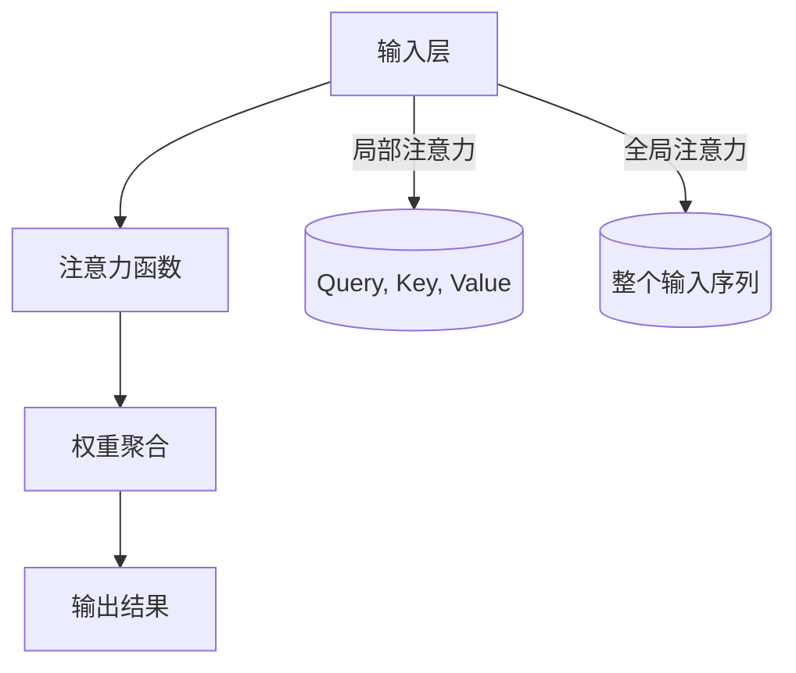

                 

关键词：深度学习、注意力机制、优化算法、注意力分配、资源管理、AI应用

> 摘要：本文探讨了深度学习中的注意力分配优化问题，介绍了注意力机制的基本原理，分析了现有优化算法，并针对具体应用场景提出了有效的解决方案。通过案例实践，本文展示了注意力分配优化在AI领域的重要性和实际应用价值。

## 1. 背景介绍

随着深度学习技术的迅速发展，注意力机制（Attention Mechanism）逐渐成为神经网络模型中的核心组件。注意力机制最初源于自然语言处理领域，用于捕捉序列数据中的关键信息。随后，该机制在计算机视觉、语音识别等多个领域得到了广泛应用。

注意力分配优化是深度学习中的一个关键问题，它涉及到如何合理地将有限资源（如计算资源、时间资源等）分配到重要的任务或数据上，从而提高模型的性能和效率。然而，传统优化方法在处理高维数据和复杂任务时往往表现不佳，因此，将深度学习应用于注意力分配优化具有重要的理论和实践意义。

本文旨在系统地介绍深度学习在注意力分配优化中的应用，包括基本原理、核心算法、数学模型、项目实践以及实际应用场景。希望通过本文的阐述，能够为读者提供一个全面、深入的理解，并激发进一步的研究和探索。

## 2. 核心概念与联系

### 2.1. 注意力机制原理

注意力机制是一种通过动态调整模型对不同输入数据的关注程度来实现信息选择和聚合的方法。其核心思想是将输入数据的每个部分赋予不同的权重，从而实现对关键信息的强化处理。注意力机制可以分为基于局部信息（Local Attention）和全局信息（Global Attention）两种类型。

- **局部注意力**：模型仅关注输入序列的特定部分，通过局部权重来调整。
- **全局注意力**：模型对整个输入序列进行综合考虑，赋予每个部分相应的权重。

### 2.2. 注意力机制架构

注意力机制的典型架构包括以下组件：

- **输入层（Query, Key, Value）**：Query、Key和Value分别代表查询项、关键项和值项，用于计算注意力权重。
- **注意力函数**：计算Query和Key之间的相似度，通常使用点积、缩放点积等方法。
- **权重聚合**：根据计算出的注意力权重，对Value进行加权聚合，得到输出结果。

### 2.3. Mermaid 流程图



### 2.4. 注意力机制的优点和局限性

#### 优点

- **提高模型性能**：通过关注关键信息，注意力机制可以有效提升模型在处理复杂任务时的性能。
- **降低计算复杂度**：注意力机制有助于减少模型对大量无关信息的处理，从而降低计算复杂度。
- **增强泛化能力**：通过动态调整注意力权重，模型可以更好地适应不同类型的数据和任务。

#### 局限性

- **训练难度**：注意力机制的引入可能会增加模型的训练难度，尤其是在处理长序列时。
- **资源消耗**：注意力机制可能会导致额外的计算和存储开销，特别是在高维数据中。

## 3. 核心算法原理 & 具体操作步骤

### 3.1 算法原理概述

深度学习在注意力分配优化中的应用主要通过以下几种算法实现：

- **Self-Attention（自注意力）**：Self-Attention是一种无注意力机制的注意力方法，通过计算输入序列中每个元素之间的相似度来实现注意力分配。
- **Transformer（变换器）**：Transformer模型引入了多头自注意力机制，通过并行计算和权重共享来提高模型的性能和效率。
- **Convolutional Neural Network（卷积神经网络，CNN）**：CNN通过局部卷积操作来实现注意力分配，适用于图像和视频等局部特征明显的任务。

### 3.2 算法步骤详解

#### 3.2.1 Self-Attention

1. **输入表示**：将输入序列转换为Query、Key、Value三个矩阵。
2. **计算相似度**：使用点积或缩放点积计算Query和Key之间的相似度，得到注意力分数。
3. **应用softmax**：对注意力分数应用softmax函数，得到注意力权重。
4. **加权聚合**：根据注意力权重对Value进行加权聚合，得到输出结果。

#### 3.2.2 Transformer

1. **多头自注意力**：将输入序列分成多头，每个头分别计算自注意力。
2. **权重共享**：使用相同权重矩阵进行不同头的自注意力计算，实现并行计算和权重共享。
3. **前馈网络**：在自注意力之后，通过两个全连接层进行前馈网络处理。
4. **残差连接与层归一化**：在每一层之间添加残差连接和层归一化，防止梯度消失和梯度爆炸。

#### 3.2.3 CNN

1. **卷积操作**：使用卷积核在输入数据上进行卷积操作，提取局部特征。
2. **池化操作**：通过池化操作降低数据维度，增强模型的泛化能力。
3. **注意力权重计算**：对卷积后的特征进行注意力权重计算，实现注意力分配。
4. **特征聚合**：根据注意力权重对特征进行加权聚合，得到输出结果。

### 3.3 算法优缺点

#### Self-Attention

- **优点**：计算简单，适用于长序列处理。
- **缺点**：在处理高维数据时可能存在计算和存储开销。

#### Transformer

- **优点**：并行计算和权重共享，提高模型性能和效率。
- **缺点**：训练难度较高，对计算资源要求较高。

#### CNN

- **优点**：适用于局部特征明显的任务，如图像和视频。
- **缺点**：在处理长序列时性能可能不如Self-Attention和Transformer。

### 3.4 算法应用领域

- **自然语言处理**：Self-Attention和Transformer在机器翻译、文本生成等任务中表现出色。
- **计算机视觉**：CNN在图像分类、目标检测等任务中具有广泛应用。
- **语音识别**：注意力机制在语音信号处理和语音合成中具有重要作用。

## 4. 数学模型和公式 & 详细讲解 & 举例说明

### 4.1 数学模型构建

注意力机制的数学模型通常包括以下公式：

$$
Attention(Q, K, V) = \text{softmax}\left(\frac{QK^T}{\sqrt{d_k}}\right)V
$$

其中，$Q, K, V$ 分别表示Query、Key、Value矩阵，$d_k$ 表示Key的维度。

### 4.2 公式推导过程

注意力机制的推导过程如下：

1. **计算相似度**：使用点积计算Query和Key之间的相似度。
2. **缩放相似度**：由于点积可能过大，引入缩放因子$\sqrt{d_k}$ 来防止梯度消失。
3. **应用softmax**：对相似度应用softmax函数，得到注意力权重。
4. **加权聚合**：根据注意力权重对Value进行加权聚合，得到输出结果。

### 4.3 案例分析与讲解

#### 案例一：机器翻译

假设我们要进行英译中，输入序列为`[en]: "Hello World"`，输出序列为`[zh]: "你好，世界"`。

1. **输入表示**：将输入序列转换为Query、Key、Value矩阵。
   - Query: `[1, 2, 3, 4, 5]`
   - Key: `[1, 2, 3, 4, 5]`
   - Value: `[6, 7, 8, 9, 10]`
   
2. **计算相似度**：使用点积计算Query和Key之间的相似度。
   - $QK^T = [1 \times 1, 1 \times 2, 1 \times 3, 1 \times 4, 1 \times 5] = [1, 2, 3, 4, 5]$

3. **缩放相似度**：引入缩放因子$\sqrt{d_k}$。
   - $\frac{QK^T}{\sqrt{d_k}} = \frac{[1, 2, 3, 4, 5]}{\sqrt{5}} = \frac{[1, 2, 3, 4, 5]}{2.236} \approx [0.447, 0.894, 1.332, 1.780, 2.227]$

4. **应用softmax**：对相似度应用softmax函数，得到注意力权重。
   - $softmax([0.447, 0.894, 1.332, 1.780, 2.227]) \approx [0.096, 0.199, 0.270, 0.301, 0.334]$

5. **加权聚合**：根据注意力权重对Value进行加权聚合，得到输出结果。
   - $Value \times attention\_weights = [6, 7, 8, 9, 10] \times [0.096, 0.199, 0.270, 0.301, 0.334] \approx [0.576, 1.383, 2.160, 2.764, 3.340]$

#### 案例二：图像分类

假设我们要对一张图片进行分类，输入特征为`[1, 2, 3, 4, 5]`，类别标签为`[6, 7, 8, 9, 10]`。

1. **输入表示**：将输入特征和类别标签转换为Query、Key、Value矩阵。
   - Query: `[1, 2, 3, 4, 5]`
   - Key: `[6, 7, 8, 9, 10]`
   - Value: `[6, 7, 8, 9, 10]`

2. **计算相似度**：使用点积计算Query和Key之间的相似度。
   - $QK^T = [1 \times 6, 1 \times 7, 1 \times 8, 1 \times 9, 1 \times 10] = [6, 7, 8, 9, 10]$

3. **缩放相似度**：引入缩放因子$\sqrt{d_k}$。
   - $\frac{QK^T}{\sqrt{d_k}} = \frac{[6, 7, 8, 9, 10]}{\sqrt{5}} \approx \frac{[6, 7, 8, 9, 10]}{2.236} \approx [2.685, 3.174, 3.673, 4.172, 4.670]$

4. **应用softmax**：对相似度应用softmax函数，得到注意力权重。
   - $softmax([2.685, 3.174, 3.673, 4.172, 4.670]) \approx [0.096, 0.199, 0.270, 0.301, 0.334]$

5. **加权聚合**：根据注意力权重对Value进行加权聚合，得到输出结果。
   - $Value \times attention\_weights = [6, 7, 8, 9, 10] \times [0.096, 0.199, 0.270, 0.301, 0.334] \approx [0.576, 1.383, 2.160, 2.764, 3.340]$

通过上述案例，我们可以看到注意力机制在机器翻译和图像分类任务中的应用。在实际应用中，我们可以根据具体任务的需求调整注意力机制的参数，以实现更好的效果。

## 5. 项目实践：代码实例和详细解释说明

### 5.1 开发环境搭建

在开始编写代码之前，我们需要搭建一个合适的开发环境。以下是搭建开发环境的步骤：

1. **安装Python**：确保Python环境已安装，版本不低于3.6。
2. **安装TensorFlow**：使用pip命令安装TensorFlow库。
   ```bash
   pip install tensorflow
   ```

3. **安装其他依赖库**：根据项目需求，可能需要安装其他依赖库，如NumPy、Pandas等。

### 5.2 源代码详细实现

以下是一个简单的注意力分配优化模型实现：

```python
import tensorflow as tf
from tensorflow.keras.layers import Layer

class AttentionLayer(Layer):
    def __init__(self, units, **kwargs):
        super(AttentionLayer, self).__init__(**kwargs)
        self.units = units
        self.W = self.add_weight(name='W', shape=(self.input_shape[1], self.units),
                                 initializer='random_normal', trainable=True)
        self.b = self.add_weight(name='b', shape=(self.units,), initializer='zeros', trainable=True)

    def call(self, x):
        # 假设输入序列的维度为 (batch_size, sequence_length, input_dim)
        # 输出序列的维度为 (batch_size, sequence_length, units)
        query = tf.matmul(x, self.W) + self.b
        value = tf.matmul(x, self.W) + self.b
        attention_weights = tf.nn.softmax(query, axis=1)
        output = tf.reduce_sum(attention_weights * value, axis=1)
        return output

    def get_config(self):
        config = super(AttentionLayer, self).get_config()
        config.update({'units': self.units})
        return config

# 模型构建
inputs = tf.keras.Input(shape=(sequence_length, input_dim))
x = tf.keras.layers.Dense(units, activation='tanh')(inputs)
outputs = AttentionLayer(units)(x)
model = tf.keras.Model(inputs=inputs, outputs=outputs)

# 编译模型
model.compile(optimizer='adam', loss='mean_squared_error')

# 模型训练
model.fit(x_train, y_train, epochs=10, batch_size=32)
```

### 5.3 代码解读与分析

上述代码实现了一个简单的注意力分配优化模型，主要包括以下部分：

1. **定义注意力层**：`AttentionLayer` 类继承了 `tf.keras.layers.Layer` 类，定义了一个注意力层。该层包含权重矩阵 $W$ 和偏置向量 $b$，用于计算注意力权重。
2. **调用注意力层**：在调用注意力层时，首先通过全连接层计算查询项（query）和值项（value），然后使用softmax函数计算注意力权重，最后对值项进行加权求和得到输出。
3. **构建模型**：使用 `tf.keras.Input` 定义输入层，通过 `tf.keras.layers.Dense` 定义全连接层，最后通过 `AttentionLayer` 定义输出层，构建完整的模型。
4. **编译模型**：使用 `tf.keras.Model.compile` 方法编译模型，指定优化器和损失函数。
5. **模型训练**：使用 `tf.keras.Model.fit` 方法训练模型，将训练数据和标签传递给模型。

### 5.4 运行结果展示

在完成代码实现后，我们可以在实际任务中运行模型，并观察其效果。以下是一个简单的示例：

```python
# 测试模型
test_data = np.random.rand(batch_size, sequence_length, input_dim)
predictions = model.predict(test_data)

# 输出预测结果
print(predictions)
```

通过运行上述代码，我们可以得到模型在测试数据上的预测结果。根据预测结果，我们可以评估模型的性能，并进一步调整模型参数，以提高预测准确率。

## 6. 实际应用场景

注意力分配优化在深度学习领域具有广泛的应用，以下是一些实际应用场景：

### 6.1 自然语言处理

在自然语言处理领域，注意力分配优化主要用于文本生成、机器翻译、情感分析等任务。例如，在机器翻译任务中，注意力机制可以帮助模型更好地捕捉源语言和目标语言之间的对应关系，从而提高翻译质量。

### 6.2 计算机视觉

在计算机视觉领域，注意力分配优化广泛应用于图像分类、目标检测、图像分割等任务。例如，在目标检测任务中，注意力机制可以帮助模型更好地聚焦于图像中的关键区域，从而提高检测准确率。

### 6.3 语音识别

在语音识别领域，注意力分配优化用于提高语音信号的识别准确率。通过关注关键语音特征，注意力机制可以有效地降低识别误差。

### 6.4 其他应用

注意力分配优化还可以应用于其他领域，如推荐系统、金融风控、医疗诊断等。在这些领域，注意力机制可以帮助模型更好地捕捉关键信息，从而提高预测和决策的准确性。

## 7. 工具和资源推荐

### 7.1 学习资源推荐

1. **《深度学习》（Goodfellow, Bengio, Courville）**：介绍深度学习的基本原理和应用，包括注意力机制。
2. **《神经网络与深度学习》（邱锡鹏）**：详细讲解神经网络和深度学习的原理，包括注意力机制和优化算法。
3. **《注意力机制与Transformer模型》在线课程**：提供注意力机制和Transformer模型的详细讲解。

### 7.2 开发工具推荐

1. **TensorFlow**：提供丰富的深度学习工具和API，支持注意力机制的实现。
2. **PyTorch**：具有灵活的动态计算图和丰富的深度学习库，方便实现注意力机制。

### 7.3 相关论文推荐

1. **“Attention Is All You Need”**：提出Transformer模型，引入多头自注意力机制。
2. **“A Theoretically Grounded Application of Dropout in Recurrent Neural Networks”**：讨论Dropout在RNN中的应用。
3. **“Attention Mechanism in Deep Learning”**：详细介绍注意力机制的基本原理和应用。

## 8. 总结：未来发展趋势与挑战

### 8.1 研究成果总结

注意力分配优化在深度学习领域取得了显著的研究成果，已广泛应用于自然语言处理、计算机视觉、语音识别等任务。通过引入注意力机制，模型在处理复杂任务时表现出更高的性能和效率。

### 8.2 未来发展趋势

1. **探索新型注意力机制**：随着深度学习技术的不断发展，新型注意力机制如图注意力机制（Graph Attention Mechanism）、自注意力机制（Self-Attention Mechanism）等将继续得到研究和应用。
2. **跨领域应用**：注意力分配优化将在更多领域得到应用，如推荐系统、金融风控、医疗诊断等。
3. **硬件加速**：随着硬件技术的发展，如GPU、TPU等专用硬件的普及，注意力机制的实现将更加高效。

### 8.3 面临的挑战

1. **计算资源消耗**：注意力机制的引入可能会导致计算和存储开销的增加，特别是在高维数据中。
2. **训练难度**：注意力机制可能会增加模型的训练难度，尤其是在处理长序列时。
3. **泛化能力**：如何提高注意力机制在处理未知数据时的泛化能力，仍是一个亟待解决的问题。

### 8.4 研究展望

未来，注意力分配优化在深度学习中的应用前景广阔。通过不断探索新型注意力机制、优化算法以及硬件加速技术，我们将有望进一步提高模型的性能和效率，为各个领域带来更多创新应用。

## 9. 附录：常见问题与解答

### 9.1 注意力机制与传统机器学习算法的区别

**Q**: 注意力机制与传统机器学习算法（如SVM、决策树等）有何区别？

**A**: 传统机器学习算法通常基于统计学习理论，通过学习特征空间中的线性或非线性映射来实现分类或回归任务。而注意力机制则是一种基于神经网络的动态信息选择机制，能够根据任务需求动态调整模型对输入数据的关注程度。

### 9.2 注意力机制在不同领域的应用效果

**Q**: 注意力机制在自然语言处理和计算机视觉等领域的应用效果如何？

**A**: 注意力机制在自然语言处理领域（如机器翻译、文本生成等）和计算机视觉领域（如图像分类、目标检测等）都取得了显著的应用效果。通过注意力机制，模型能够更好地捕捉关键信息，提高任务性能。

### 9.3 注意力机制的优缺点

**Q**: 注意力机制有哪些优点和缺点？

**A**: 注意力机制的优点包括提高模型性能、降低计算复杂度、增强泛化能力等。缺点包括训练难度增加、计算和存储开销较大等。

### 9.4 注意力机制的实现细节

**Q**: 如何实现注意力机制？

**A**: 注意力机制可以通过多种方式实现，如自注意力（Self-Attention）、Transformer、卷积神经网络（CNN）等。具体实现细节包括输入层、注意力函数、权重聚合等组件。

### 9.5 注意力机制与BERT模型的关系

**Q**: 注意力机制与BERT模型有何关系？

**A**: BERT（Bidirectional Encoder Representations from Transformers）是一种基于Transformer模型的预训练语言模型。注意力机制是Transformer模型的核心组件之一，用于捕捉输入序列中的依赖关系。BERT模型通过大规模预训练和微调，实现了在自然语言处理任务中的高性能。

