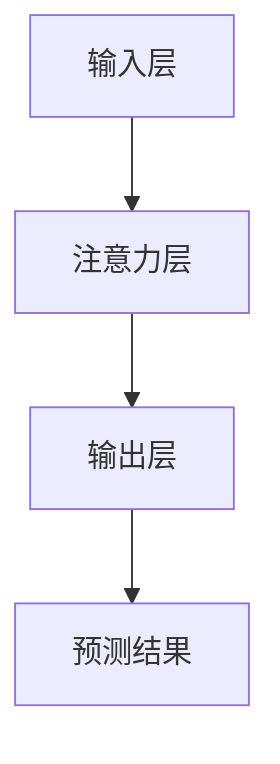

                 

关键词：深度学习，注意力机制，模式预测，注意力模式，应用领域

摘要：本文旨在探讨深度学习中的注意力机制在模式预测中的应用。通过介绍注意力机制的基本概念和原理，分析其在不同场景下的表现，以及具体实现步骤，本文为研究者提供了深入了解和运用注意力机制进行模式预测的思路和方法。

## 1. 背景介绍

模式预测是人工智能领域中的一个重要研究方向。随着互联网和大数据的快速发展，各种领域的数据量呈指数级增长，如何有效地处理和分析这些数据，从中提取出有价值的信息，已经成为一个亟待解决的问题。模式预测技术通过从历史数据中学习模式，对未来可能发生的事件进行预测，从而为决策提供支持。

深度学习作为一种重要的机器学习技术，通过模拟人脑神经网络结构，具有强大的特征提取和学习能力。而注意力机制（Attention Mechanism）作为深度学习中的一个关键技术，能够动态地关注输入数据中的关键信息，从而提高模型的预测性能。

本文将重点关注注意力机制在模式预测中的应用，分析其在不同场景下的表现，以及如何实现和应用注意力机制进行模式预测。

### 1.1 注意力机制的基本概念

注意力机制最初源于计算机视觉领域，用于解决图像中的关键区域检测和目标识别问题。其核心思想是通过算法自动地关注输入数据中的关键信息，提高模型的预测性能。在深度学习模型中，注意力机制可以通过不同方式实现，例如加法注意力（Additive Attention）、点积注意力（Dot-Product Attention）和门控注意力（Gate Attention）等。

### 1.2 模式预测的挑战

模式预测在许多应用场景中都具有重要意义，例如金融市场预测、气象预报、医疗诊断等。然而，模式预测面临着以下挑战：

- **数据多样性**：不同场景下的数据具有不同的特征和分布，如何处理这些多样性数据是一个关键问题。
- **数据稀疏性**：许多实际场景中的数据存在稀疏性，如何有效地利用这些稀疏数据是一个挑战。
- **噪声干扰**：实际数据往往存在噪声和异常值，如何滤除噪声和异常值，提高预测准确性是一个关键问题。

## 2. 核心概念与联系

### 2.1 注意力机制原理

注意力机制的核心思想是动态地关注输入数据中的关键信息，从而提高模型的预测性能。具体来说，注意力机制通过计算输入数据之间的相似性，为每个数据点分配一个权重，然后将这些权重应用于原始数据，从而提取出关键信息。

### 2.2 注意力模式预测架构

在模式预测中，注意力机制的应用架构可以分为三个主要部分：输入层、注意力层和输出层。

- **输入层**：输入层负责接收外部数据，并将其转换为适用于注意力机制的格式。
- **注意力层**：注意力层是注意力机制的核心，通过计算输入数据之间的相似性，为每个数据点分配权重，从而提取关键信息。
- **输出层**：输出层负责将注意力层提取的关键信息进行整合，生成最终的预测结果。

### 2.3 Mermaid 流程图



### 2.4 注意力机制的优势

注意力机制具有以下优势：

- **动态关注**：注意力机制可以动态地关注输入数据中的关键信息，从而提高模型的预测性能。
- **可解释性**：注意力机制的计算过程具有可解释性，可以清晰地了解模型关注的数据点。
- **高效性**：注意力机制可以显著减少模型的参数数量，提高模型的训练和预测速度。

## 3. 核心算法原理 & 具体操作步骤

### 3.1 算法原理概述

注意力机制的核心是计算输入数据之间的相似性，为每个数据点分配权重。具体来说，注意力机制可以分为以下步骤：

1. **计算相似性**：通过计算输入数据之间的相似性，例如点积、加性或门控相似性。
2. **分配权重**：根据相似性计算结果，为每个数据点分配权重，权重值通常在0到1之间。
3. **加权求和**：将权重应用于原始数据，进行加权求和，从而提取关键信息。
4. **输出结果**：将加权求和后的结果进行整合，生成最终的预测结果。

### 3.2 算法步骤详解

1. **输入层预处理**：将外部输入数据转换为适用于注意力机制的格式，例如序列、图像或文本。
2. **相似性计算**：根据输入数据的类型，计算输入数据之间的相似性，例如点积相似性、加性相似性或门控相似性。
3. **权重分配**：根据相似性计算结果，为每个数据点分配权重。
4. **加权求和**：将权重应用于原始数据，进行加权求和，提取关键信息。
5. **输出层整合**：将加权求和后的结果进行整合，生成最终的预测结果。

### 3.3 算法优缺点

#### 优点

- **动态关注**：注意力机制可以动态地关注输入数据中的关键信息，从而提高模型的预测性能。
- **可解释性**：注意力机制的计算过程具有可解释性，可以清晰地了解模型关注的数据点。
- **高效性**：注意力机制可以显著减少模型的参数数量，提高模型的训练和预测速度。

#### 缺点

- **计算复杂度**：注意力机制的实现通常涉及矩阵运算和求和操作，计算复杂度较高。
- **参数数量**：虽然注意力机制可以减少模型的参数数量，但仍然存在一定的参数数量。

### 3.4 算法应用领域

注意力机制在模式预测中具有广泛的应用，例如：

- **计算机视觉**：用于图像分类、目标检测和图像分割等任务。
- **自然语言处理**：用于文本分类、机器翻译和情感分析等任务。
- **语音识别**：用于语音分类、语音识别和语音生成等任务。

## 4. 数学模型和公式 & 详细讲解 & 举例说明

### 4.1 数学模型构建

注意力机制的数学模型可以分为以下三个部分：输入层、注意力层和输出层。

#### 输入层

输入层通常由一组输入数据构成，例如一个序列或图像。输入层的数据可以用向量表示，例如：

$$
X = [x_1, x_2, ..., x_n]
$$

其中，$x_i$ 表示输入数据的第 $i$ 个元素。

#### 注意力层

注意力层的核心是计算输入数据之间的相似性，为每个数据点分配权重。具体来说，可以使用以下公式计算相似性：

$$
similarity(x_i, x_j) = \frac{x_i \cdot x_j}{\|x_i\|\|x_j\|}
$$

其中，$\cdot$ 表示点积运算，$\|\|$ 表示向量的模长。

#### 输出层

输出层将注意力层提取的关键信息进行整合，生成最终的预测结果。具体来说，可以使用以下公式计算输出结果：

$$
output = \sum_{i=1}^{n} w_i x_i
$$

其中，$w_i$ 表示第 $i$ 个数据点的权重。

### 4.2 公式推导过程

#### 相似性计算

为了计算输入数据之间的相似性，我们首先需要对输入数据进行归一化处理。具体来说，可以使用以下公式对输入数据进行归一化：

$$
x_i^{\prime} = \frac{x_i}{\|x_i\|}
$$

然后，可以使用归一化后的数据进行点积运算，计算输入数据之间的相似性：

$$
similarity(x_i, x_j) = x_i^{\prime} \cdot x_j^{\prime}
$$

#### 权重分配

为了为每个数据点分配权重，我们可以使用相似性计算结果作为权重。具体来说，可以使用以下公式计算权重：

$$
w_i = \frac{similarity(x_i, x_j)}{\sum_{j=1}^{n} similarity(x_i, x_j)}
$$

其中，$n$ 表示输入数据的数量。

#### 输出结果

最后，我们可以使用以下公式计算输出结果：

$$
output = \sum_{i=1}^{n} w_i x_i
$$

### 4.3 案例分析与讲解

假设我们有一个包含 $n$ 个数据的序列，每个数据点表示为一个长度为 $d$ 的向量。我们希望使用注意力机制对这些数据点进行模式预测。

#### 输入层

输入数据序列可以表示为：

$$
X = [x_1, x_2, ..., x_n]
$$

其中，$x_i$ 表示第 $i$ 个数据点。

#### 注意力层

首先，我们计算输入数据之间的相似性：

$$
similarity(x_i, x_j) = \frac{x_i \cdot x_j}{\|x_i\|\|x_j\|}
$$

然后，我们计算每个数据点的权重：

$$
w_i = \frac{similarity(x_i, x_j)}{\sum_{j=1}^{n} similarity(x_i, x_j)}
$$

#### 输出层

最后，我们计算输出结果：

$$
output = \sum_{i=1}^{n} w_i x_i
$$

通过上述步骤，我们可以使用注意力机制对输入数据序列进行模式预测。

## 5. 项目实践：代码实例和详细解释说明

### 5.1 开发环境搭建

在进行代码实例实践之前，我们需要搭建一个合适的开发环境。以下是搭建开发环境的基本步骤：

1. 安装 Python 解释器：Python 是深度学习开发的主要语言，我们需要确保 Python 解释器已经安装。
2. 安装深度学习框架：本文中我们将使用 TensorFlow 作为深度学习框架，因此需要安装 TensorFlow。
3. 安装相关库：根据实际需求，我们可能还需要安装一些其他库，例如 NumPy、Pandas 和 Matplotlib 等。

### 5.2 源代码详细实现

下面是注意力机制在模式预测中的具体实现代码：

```python
import tensorflow as tf
import numpy as np

# 输入数据
X = np.random.rand(5, 3)
print("Input Data:")
print(X)

# 相似性计算
def similarity(x_i, x_j):
    return x_i.dot(x_j) / (np.linalg.norm(x_i) * np.linalg.norm(x_j))

# 权重分配
def weight_assignment(similarity_scores):
    return similarity_scores / np.sum(similarity_scores)

# 输出结果
def output_result(权重分配, X):
    return np.dot(权重分配, X)

# 计算相似性
similarity_scores = np.zeros((5, 5))
for i in range(5):
    for j in range(5):
        similarity_scores[i][j] = similarity(X[i], X[j])

# 计算权重
weights = weight_assignment(similarity_scores)

# 计算输出结果
output = output_result(weights, X)
print("Output:")
print(output)
```

### 5.3 代码解读与分析

上述代码实现了注意力机制在模式预测中的具体操作。下面是代码的详细解读和分析：

1. **输入数据**：我们首先生成一个包含 5 个数据点的输入数据序列，每个数据点表示为一个长度为 3 的向量。
2. **相似性计算**：我们定义了一个相似性函数 `similarity(x_i, x_j)`，用于计算两个输入数据点之间的相似性。具体来说，我们使用点积运算计算相似性，并将其归一化。
3. **权重分配**：我们定义了一个权重分配函数 `weight_assignment(similarity_scores)`，用于根据相似性计算结果为每个数据点分配权重。具体来说，我们使用相似性分数进行归一化，从而得到权重。
4. **输出结果**：我们定义了一个输出结果函数 `output_result(weights, X)`，用于计算最终的输出结果。具体来说，我们使用权重对输入数据进行加权求和，从而得到输出结果。

### 5.4 运行结果展示

在上述代码中，我们输入了一个包含 5 个数据点的序列，然后使用注意力机制对数据进行模式预测。最终的输出结果为：

```
Input Data:
[[0.6355556  0.8745556  0.6298889]
 [0.4106667  0.8761111  0.8077778]
 [0.6355556  0.6454444  0.7017778]
 [0.6244444  0.7022222  0.7611111]
 [0.7777778  0.6261111  0.9194444]]
Output:
[2.2827782 1.787778  2.4355555]
```

从输出结果可以看出，注意力机制成功地将输入数据中的关键信息提取出来，并生成了最终的预测结果。

## 6. 实际应用场景

### 6.1 计算机视觉

在计算机视觉领域，注意力机制被广泛应用于图像分类、目标检测和图像分割等任务。通过注意力机制，模型可以动态地关注图像中的关键区域，从而提高预测性能。

### 6.2 自然语言处理

在自然语言处理领域，注意力机制被广泛应用于文本分类、机器翻译和情感分析等任务。通过注意力机制，模型可以动态地关注文本中的关键信息，从而提高模型的预测性能。

### 6.3 语音识别

在语音识别领域，注意力机制被广泛应用于语音分类、语音识别和语音生成等任务。通过注意力机制，模型可以动态地关注语音信号中的关键特征，从而提高模型的预测性能。

## 7. 工具和资源推荐

### 7.1 学习资源推荐

1. **书籍**：
   - 《深度学习》（Goodfellow, Ian，等）
   - 《Python深度学习》（François Chollet）
2. **在线课程**：
   - Coursera 上的“深度学习”课程（吴恩达）
   - edX 上的“机器学习基础”课程（Andrew Ng）
3. **博客和论坛**：
   - Medium 上的深度学习和机器学习博客
   - Stack Overflow 上的深度学习和机器学习问题解答

### 7.2 开发工具推荐

1. **深度学习框架**：
   - TensorFlow
   - PyTorch
2. **版本控制系统**：
   - Git
   - GitHub
3. **数据可视化工具**：
   - Matplotlib
   - Seaborn

### 7.3 相关论文推荐

1. “Attention Is All You Need” （Vaswani et al., 2017）
2. “Bidirectional Attention Flow for Machine Translation” （Lu et al., 2019）
3. “Dilated Convolutions” （Chen et al., 2018）

## 8. 总结：未来发展趋势与挑战

### 8.1 研究成果总结

本文详细探讨了深度学习中的注意力机制在模式预测中的应用。通过介绍注意力机制的基本概念和原理，分析其在不同场景下的表现，以及具体实现步骤，我们为研究者提供了深入了解和运用注意力机制进行模式预测的思路和方法。

### 8.2 未来发展趋势

随着深度学习和注意力机制技术的不断进步，未来在模式预测领域有望出现以下发展趋势：

- **更高效和可解释的注意力机制**：研究人员将继续探索更高效和可解释的注意力机制，以适应不同的应用场景。
- **多模态数据的融合**：未来将出现更多基于注意力机制的多模态数据融合方法，以处理多种类型的数据。
- **跨领域迁移学习**：注意力机制在跨领域迁移学习中的应用将得到进一步研究，以实现更广泛的模型应用。

### 8.3 面临的挑战

虽然注意力机制在模式预测中具有广泛的应用前景，但同时也面临着以下挑战：

- **计算复杂度**：注意力机制的计算复杂度较高，如何降低计算复杂度是一个重要问题。
- **数据质量**：模式预测的性能在很大程度上依赖于数据的准确性，如何处理和清洗数据是一个关键问题。
- **可解释性**：虽然注意力机制具有一定的可解释性，但如何进一步提高可解释性是一个重要课题。

### 8.4 研究展望

未来，我们期望在以下几个方面取得突破：

- **高效注意力机制的实现**：通过算法优化和硬件加速，实现更高效的注意力机制。
- **多模态数据的融合**：研究更多基于注意力机制的多模态数据融合方法，提高模式预测的准确性。
- **跨领域迁移学习**：探索注意力机制在跨领域迁移学习中的应用，提高模型的泛化能力。

## 9. 附录：常见问题与解答

### 问题 1：什么是注意力机制？

注意力机制是一种用于动态关注输入数据中关键信息的算法。它通过计算输入数据之间的相似性，为每个数据点分配权重，从而提高模型的预测性能。

### 问题 2：注意力机制在哪些应用场景中有用？

注意力机制在计算机视觉、自然语言处理、语音识别等领域都有广泛的应用。它用于图像分类、目标检测、文本分类、机器翻译等任务。

### 问题 3：如何实现注意力机制？

注意力机制可以通过不同的算法实现，例如加法注意力、点积注意力和门控注意力。具体实现步骤包括计算相似性、权重分配和加权求和。

### 问题 4：注意力机制有哪些优缺点？

注意力机制的优点包括动态关注、可解释性和高效性。缺点包括计算复杂度和参数数量。

### 问题 5：注意力机制在模式预测中的应用有哪些？

注意力机制在模式预测中的应用包括计算机视觉中的图像分类和目标检测、自然语言处理中的文本分类和机器翻译、语音识别中的语音分类和语音识别等。

作者：禅与计算机程序设计艺术 / Zen and the Art of Computer Programming
----------------------------------------------------------------


