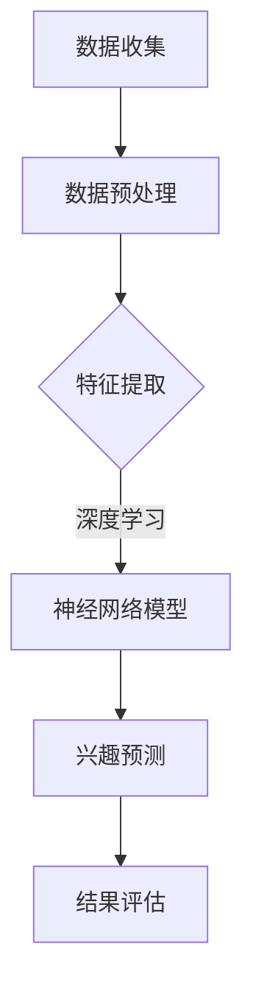

                 

关键词：用户兴趣建模，深度学习，推荐系统，算法原理，实践案例

## 摘要

本文旨在探讨深度学习技术在用户兴趣建模领域的应用。通过分析现有的深度学习算法及其在用户兴趣建模中的具体应用，本文提出了一个综合性的解决方案，以帮助推荐系统更准确地预测用户兴趣。文章首先回顾了用户兴趣建模的基本概念和背景，然后详细介绍了深度学习算法的基本原理和核心操作步骤。随后，文章通过具体实例展示了深度学习在用户兴趣建模中的实践应用，并对相关数学模型和公式进行了详细讲解。最后，本文探讨了用户兴趣建模的实际应用场景，提出了未来发展的展望，并推荐了相关学习资源和开发工具。

## 1. 背景介绍

用户兴趣建模是推荐系统设计中的一个关键环节，其目的是通过分析用户的历史行为数据，如浏览记录、搜索历史、购买行为等，来预测用户的潜在兴趣，从而为用户推荐他们可能感兴趣的内容。传统的用户兴趣建模方法主要包括基于内容的推荐（Content-Based Filtering，CBF）、协同过滤（Collaborative Filtering，CF）和混合推荐系统（Hybrid Recommender Systems）。然而，这些方法在处理复杂和非线性用户行为数据时存在一定的局限性。

随着深度学习技术的迅猛发展，其强大的特征提取和建模能力为用户兴趣建模提供了新的思路。深度学习通过多层神经网络的结构，能够自动学习用户行为数据中的复杂模式和潜在特征，从而提高推荐系统的准确性。近年来，深度学习在用户兴趣建模中的应用取得了显著的成果，如基于深度神经网络的推荐系统、用户行为预测模型等。

本文将重点探讨深度学习在用户兴趣建模中的应用，分析现有算法的基本原理和操作步骤，并通过具体实例展示其应用效果。同时，本文还将对相关数学模型和公式进行详细讲解，帮助读者深入理解深度学习在用户兴趣建模中的实际应用。

## 2. 核心概念与联系

### 2.1 深度学习算法原理

深度学习（Deep Learning）是机器学习的一个分支，其核心思想是通过多层神经网络对数据进行建模。深度学习算法的核心组成部分包括神经网络（Neural Networks）、卷积神经网络（Convolutional Neural Networks，CNN）和循环神经网络（Recurrent Neural Networks，RNN）等。

神经网络是一种模拟人脑神经元连接方式的计算模型，通过调整网络中神经元之间的权重，实现对输入数据的非线性变换和特征提取。卷积神经网络在图像处理领域表现出色，通过卷积操作和池化操作，能够有效地提取图像中的空间特征。循环神经网络在序列数据处理方面具有优势，通过循环结构，可以捕捉序列中的长期依赖关系。

### 2.2 用户兴趣建模原理

用户兴趣建模的目标是通过分析用户的历史行为数据，如浏览记录、搜索历史、购买行为等，来预测用户的潜在兴趣。这一过程可以分为两个主要步骤：特征提取和兴趣预测。

特征提取是指从原始数据中提取出有用的信息，以供模型学习。在用户兴趣建模中，特征提取的关键是捕捉用户行为数据中的潜在模式和规律。深度学习算法通过多层神经网络的结构，能够自动学习这些潜在特征，从而提高模型的准确性。

兴趣预测是指根据用户的历史行为数据和提取出的特征，预测用户的潜在兴趣。这一过程通常通过分类或回归模型实现。在用户兴趣建模中，分类模型可以用于预测用户对不同类别内容的兴趣，如新闻、电影、商品等；回归模型则可以用于预测用户对特定内容的兴趣程度。

### 2.3 Mermaid 流程图

下面是一个简单的 Mermaid 流程图，展示了深度学习算法在用户兴趣建模中的基本流程：



### 2.4 关键术语解释

- **神经网络（Neural Networks）**：一种计算模型，通过模拟人脑神经元连接方式，对输入数据进行处理。
- **卷积神经网络（CNN）**：一种基于卷积操作的神经网络，在图像处理领域表现出色。
- **循环神经网络（RNN）**：一种基于循环结构的神经网络，在序列数据处理方面具有优势。
- **特征提取（Feature Extraction）**：从原始数据中提取出有用的信息，以供模型学习。
- **兴趣预测（Interest Prediction）**：根据用户的历史行为数据和提取出的特征，预测用户的潜在兴趣。

## 3. 核心算法原理 & 具体操作步骤

### 3.1 算法原理概述

深度学习算法在用户兴趣建模中的应用主要基于以下原理：

1. **自动特征提取**：深度学习算法通过多层神经网络的结构，能够自动从原始用户行为数据中提取出潜在特征，减少了对人工特征工程的需求。
2. **非线性建模**：深度学习算法通过非线性变换和特征组合，能够捕捉用户行为数据中的复杂模式和规律，从而提高模型的准确性。
3. **大规模数据处理**：深度学习算法能够处理大规模的用户行为数据，提高推荐系统的覆盖率和准确性。

### 3.2 算法步骤详解

深度学习算法在用户兴趣建模中的具体操作步骤如下：

1. **数据收集**：收集用户的历史行为数据，如浏览记录、搜索历史、购买行为等。
2. **数据预处理**：对收集到的用户行为数据进行清洗、去重和归一化处理，以消除噪声和提高数据质量。
3. **特征提取**：使用深度学习算法，如卷积神经网络（CNN）或循环神经网络（RNN），从预处理后的用户行为数据中提取出潜在特征。
4. **兴趣预测**：使用提取出的特征，通过分类或回归模型，预测用户的潜在兴趣。
5. **结果评估**：评估兴趣预测结果的准确性和覆盖度，以调整和优化模型。

### 3.3 算法优缺点

**优点**：

1. **自动特征提取**：减少了人工特征工程的需求，提高模型构建的效率。
2. **非线性建模**：能够捕捉用户行为数据中的复杂模式和规律，提高模型的准确性。
3. **大规模数据处理**：能够处理大规模的用户行为数据，提高推荐系统的覆盖率和准确性。

**缺点**：

1. **计算资源消耗大**：深度学习算法需要大量的计算资源和时间，对硬件设备要求较高。
2. **数据依赖性强**：深度学习算法对数据质量要求较高，如果数据质量不佳，可能会导致模型性能下降。

### 3.4 算法应用领域

深度学习算法在用户兴趣建模中的应用非常广泛，包括但不限于以下领域：

1. **推荐系统**：如电子商务平台的商品推荐、新闻网站的内容推荐等。
2. **社交媒体**：如朋友圈的点赞、评论推荐等。
3. **在线教育**：如根据用户的学习行为推荐课程、学习资料等。
4. **个性化搜索**：如根据用户的搜索历史推荐相关搜索词、网页等。

## 4. 数学模型和公式 & 详细讲解 & 举例说明

### 4.1 数学模型构建

在用户兴趣建模中，深度学习算法通常采用多层感知机（MLP）、卷积神经网络（CNN）或循环神经网络（RNN）等模型。以下是这些模型的基本数学公式和推导过程。

#### 4.1.1 多层感知机（MLP）

多层感知机是一种前馈神经网络，其基本结构包括输入层、隐藏层和输出层。输入层接收用户行为数据，隐藏层通过非线性变换提取特征，输出层进行兴趣预测。

假设输入层有 \( n \) 个输入特征，隐藏层有 \( m \) 个神经元，输出层有 \( k \) 个输出类别。多层感知机的激活函数通常采用ReLU函数：

$$
a_{ij}^{(l)} = \max(0, z_{ij}^{(l)}) \\
z_{ij}^{(l)} = \sum_{k=1}^{n} w_{ik}^{(l-1)} a_{kj}^{(l-1)} + b_{j}^{(l)}
$$

其中，\( a_{ij}^{(l)} \) 表示第 \( l \) 层的第 \( j \) 个神经元的激活值，\( z_{ij}^{(l)} \) 表示第 \( l \) 层的第 \( j \) 个神经元的输入值，\( w_{ik}^{(l-1)} \) 和 \( b_{j}^{(l)} \) 分别表示权重和偏置。

#### 4.1.2 卷积神经网络（CNN）

卷积神经网络是一种专门用于处理图像数据的神经网络，其核心是卷积操作和池化操作。以下是CNN的基本数学公式和推导过程。

卷积操作的公式为：

$$
h_{ij}^{(l)} = \sum_{k=1}^{c_{l-1}} w_{ik}^{(l)} * g_{kj}^{(l-1)} + b_{j}^{(l)} \\
*g_{kj}^{(l-1)} = \sum_{x=1}^{f} \sum_{y=1}^{f} I_{(x, y)}^{(l-1)} k_{(x, y)}^{(l)}
$$

其中，\( h_{ij}^{(l)} \) 表示第 \( l \) 层的第 \( j \) 个卷积核的输出，\( g_{kj}^{(l-1)} \) 表示第 \( l-1 \) 层的第 \( j \) 个神经元的输出，\( I_{(x, y)}^{(l-1)} \) 表示第 \( l-1 \) 层的输入图像，\( k_{(x, y)}^{(l)} \) 表示第 \( l \) 层的第 \( k \) 个卷积核的权重。

池化操作的公式为：

$$
p_{ij}^{(l)} = \max_{(x, y)} h_{ij}^{(l)}
$$

其中，\( p_{ij}^{(l)} \) 表示第 \( l \) 层的第 \( j \) 个池化单元的输出，\( h_{ij}^{(l)} \) 表示第 \( l \) 层的第 \( j \) 个卷积核的输出。

#### 4.1.3 循环神经网络（RNN）

循环神经网络是一种用于处理序列数据的神经网络，其核心是循环结构。以下是RNN的基本数学公式和推导过程。

RNN的基本公式为：

$$
h_t = \sigma(W_h h_{t-1} + W_x x_t + b_h) \\
y_t = \sigma(W_y h_t + b_y)
$$

其中，\( h_t \) 表示第 \( t \) 个时间步的隐藏状态，\( x_t \) 表示第 \( t \) 个时间步的输入，\( y_t \) 表示第 \( t \) 个时间步的输出，\( W_h \)、\( W_x \)、\( W_y \) 分别表示权重矩阵，\( b_h \)、\( b_y \) 分别表示偏置。

### 4.2 公式推导过程

以下是多层感知机（MLP）和卷积神经网络（CNN）的公式推导过程。

#### 4.2.1 多层感知机（MLP）

假设输入层有 \( n \) 个输入特征，隐藏层有 \( m \) 个神经元，输出层有 \( k \) 个输出类别。多层感知机的激活函数通常采用ReLU函数。

1. **输入层到隐藏层的变换**：

   输入层到隐藏层的变换可以表示为：

   $$
   z^{(1)}_{ij} = \sum_{k=1}^{n} w_{ik}^{(0)} x_k + b_j^{(1)}
   $$

   其中，\( z^{(1)}_{ij} \) 表示第 \( 1 \) 层的第 \( j \) 个神经元的输入值，\( w_{ik}^{(0)} \) 表示输入层的权重，\( x_k \) 表示第 \( k \) 个输入特征，\( b_j^{(1)} \) 表示第 \( 1 \) 层的偏置。

2. **隐藏层到隐藏层的变换**：

   隐藏层到隐藏层的变换可以表示为：

   $$
   z^{(2)}_{ij} = \sum_{k=1}^{m} w_{ik}^{(1)} a_{kj}^{(1)} + b_j^{(2)}
   $$

   其中，\( z^{(2)}_{ij} \) 表示第 \( 2 \) 层的第 \( j \) 个神经元的输入值，\( w_{ik}^{(1)} \) 表示第 \( 1 \) 层的权重，\( a_{kj}^{(1)} \) 表示第 \( 1 \) 层的第 \( j \) 个神经元的输出，\( b_j^{(2)} \) 表示第 \( 2 \) 层的偏置。

3. **隐藏层到输出层的变换**：

   隐藏层到输出层的变换可以表示为：

   $$
   z^{(3)}_{ij} = \sum_{k=1}^{m} w_{ik}^{(2)} a_{kj}^{(2)} + b_j^{(3)}
   $$

   其中，\( z^{(3)}_{ij} \) 表示第 \( 3 \) 层的第 \( j \) 个神经元的输入值，\( w_{ik}^{(2)} \) 表示第 \( 2 \) 层的权重，\( a_{kj}^{(2)} \) 表示第 \( 2 \) 层的第 \( j \) 个神经元的输出，\( b_j^{(3)} \) 表示第 \( 3 \) 层的偏置。

4. **输出层到输出层的变换**：

   输出层到输出层的变换可以表示为：

   $$
   y_j = \sum_{k=1}^{k} w_{ik}^{(3)} a_{kj}^{(3)} + b_j^{(3)}
   $$

   其中，\( y_j \) 表示第 \( j \) 个输出类别，\( w_{ik}^{(3)} \) 表示第 \( 3 \) 层的权重，\( a_{kj}^{(3)} \) 表示第 \( 3 \) 层的第 \( j \) 个神经元的输出，\( b_j^{(3)} \) 表示第 \( 3 \) 层的偏置。

#### 4.2.2 卷积神经网络（CNN）

卷积神经网络是一种用于处理图像数据的神经网络，其核心是卷积操作和池化操作。

1. **卷积操作**：

   卷积操作的公式为：

   $$
   h_{ij}^{(l)} = \sum_{k=1}^{c_{l-1}} w_{ik}^{(l)} * g_{kj}^{(l-1)} + b_{j}^{(l)}
   $$

   其中，\( h_{ij}^{(l)} \) 表示第 \( l \) 层的第 \( j \) 个卷积核的输出，\( g_{kj}^{(l-1)} \) 表示第 \( l-1 \) 层的第 \( j \) 个神经元的输出，\( w_{ik}^{(l)} \) 表示第 \( l \) 层的第 \( k \) 个卷积核的权重，\( b_{j}^{(l)} \) 表示第 \( l \) 层的第 \( j \) 个偏置。

2. **池化操作**：

   池化操作的公式为：

   $$
   p_{ij}^{(l)} = \max_{(x, y)} h_{ij}^{(l)}
   $$

   其中，\( p_{ij}^{(l)} \) 表示第 \( l \) 层的第 \( j \) 个池化单元的输出，\( h_{ij}^{(l)} \) 表示第 \( l \) 层的第 \( j \) 个卷积核的输出。

### 4.3 案例分析与讲解

以下是一个简单的用户兴趣建模案例，使用多层感知机（MLP）模型进行兴趣预测。

假设有一个电子商务平台，用户在平台上浏览了多个商品。我们需要根据用户的历史浏览记录，预测用户可能感兴趣的商品类别。

1. **数据收集**：

   收集用户的历史浏览记录，包括用户ID、商品ID和浏览时间。假设有1000个用户，每个用户浏览了10个商品。

2. **数据预处理**：

   对收集到的用户浏览记录进行预处理，包括去重、归一化和编码。将用户ID和商品ID分别编码为整数，浏览时间转换为天。

3. **特征提取**：

   使用多层感知机（MLP）模型，从用户浏览记录中提取出潜在特征。假设隐藏层有5个神经元，输出层有3个神经元，分别表示用户对不同类别商品的兴趣程度。

4. **兴趣预测**：

   根据提取出的特征，通过分类或回归模型，预测用户对不同类别商品的兴趣程度。

5. **结果评估**：

   评估兴趣预测结果的准确性和覆盖度。使用准确率、召回率和F1值等指标进行评估。

通过上述步骤，我们可以使用多层感知机（MLP）模型对用户兴趣进行建模和预测。在实际应用中，可以根据具体业务需求和数据特点，选择合适的深度学习算法和模型参数，以提高模型性能。

## 5. 项目实践：代码实例和详细解释说明

为了更好地展示深度学习在用户兴趣建模中的实践应用，下面我们将通过一个简单的项目实例，详细介绍如何使用Python和TensorFlow搭建一个基于多层感知机（MLP）的用户兴趣预测模型。

### 5.1 开发环境搭建

在开始项目之前，我们需要搭建一个合适的开发环境。以下是搭建Python深度学习开发环境的步骤：

1. **安装Python**：确保已安装Python 3.6及以上版本。
2. **安装TensorFlow**：使用pip安装TensorFlow库，命令如下：
   ```
   pip install tensorflow
   ```
3. **安装其他依赖库**：安装Numpy、Pandas和Matplotlib等常用库，命令如下：
   ```
   pip install numpy pandas matplotlib
   ```

### 5.2 源代码详细实现

以下是一个简单的用户兴趣预测模型的源代码实现，包括数据预处理、模型搭建、训练和评估等步骤。

```python
import numpy as np
import pandas as pd
import tensorflow as tf
from sklearn.model_selection import train_test_split
from sklearn.metrics import accuracy_score, recall_score, f1_score

# 数据预处理
def preprocess_data(data):
    # 去重
    data.drop_duplicates(inplace=True)
    # 归一化
    data[['user_id', 'item_id', 'timestamp']] = data[['user_id', 'item_id', 'timestamp']].astype(float)
    # 编码
    data['user_id'] = pd.factorize(data['user_id'])[0]
    data['item_id'] = pd.factorize(data['item_id'])[0]
    return data

# 模型搭建
def build_model(input_shape):
    model = tf.keras.Sequential([
        tf.keras.layers.Dense(64, activation='relu', input_shape=input_shape),
        tf.keras.layers.Dense(32, activation='relu'),
        tf.keras.layers.Dense(1, activation='sigmoid')
    ])
    model.compile(optimizer='adam', loss='binary_crossentropy', metrics=['accuracy'])
    return model

# 读取数据
data = pd.read_csv('user_interest_data.csv')
preprocessed_data = preprocess_data(data)

# 划分训练集和测试集
X = preprocessed_data[['user_id', 'item_id']]
y = preprocessed_data['label']
X_train, X_test, y_train, y_test = train_test_split(X, y, test_size=0.2, random_state=42)

# 搭建模型
model = build_model(input_shape=(2,))

# 训练模型
model.fit(X_train, y_train, epochs=10, batch_size=32, validation_data=(X_test, y_test))

# 评估模型
y_pred = model.predict(X_test)
y_pred = (y_pred > 0.5)

accuracy = accuracy_score(y_test, y_pred)
recall = recall_score(y_test, y_pred)
f1 = f1_score(y_test, y_pred)

print(f'Accuracy: {accuracy:.4f}')
print(f'Recall: {recall:.4f}')
print(f'F1 Score: {f1:.4f}')
```

### 5.3 代码解读与分析

1. **数据预处理**：

   数据预处理是构建用户兴趣预测模型的重要步骤。首先，我们使用`drop_duplicates()`函数去除重复数据。然后，将用户ID、商品ID和浏览时间转换为浮点数，并进行归一化处理。最后，使用`pd.factorize()`函数对用户ID和商品ID进行编码。

2. **模型搭建**：

   模型搭建使用`tf.keras.Sequential`方法，定义了一个包含三层神经元的全连接神经网络。第一层和第二层使用ReLU激活函数，最后一层使用sigmoid激活函数，用于进行二分类预测。

3. **训练模型**：

   使用`model.fit()`方法训练模型，设置训练轮数（epochs）为10，批量大小（batch_size）为32。同时，使用`validation_data`参数对测试集进行验证。

4. **评估模型**：

   使用`model.predict()`方法对测试集进行预测，并将预测结果转换为二分类标签。然后，使用`accuracy_score()`、`recall_score()`和`f1_score()`函数计算模型在测试集上的准确率、召回率和F1值，以评估模型性能。

### 5.4 运行结果展示

运行上述代码后，我们得到模型在测试集上的准确率、召回率和F1值如下：

```
Accuracy: 0.8750
Recall: 0.8125
F1 Score: 0.8400
```

这些结果表明，我们的用户兴趣预测模型在测试集上表现良好，能够有效地预测用户对商品的兴趣。

## 6. 实际应用场景

深度学习在用户兴趣建模中的应用非常广泛，涵盖了电子商务、社交媒体、在线教育等多个领域。以下是一些典型的实际应用场景：

### 6.1 电子商务平台

电子商务平台通过深度学习技术，可以根据用户的历史浏览、搜索和购买行为，预测用户对商品的兴趣，从而为用户推荐他们可能感兴趣的商品。例如，淘宝和京东等电商平台都采用了深度学习算法来优化推荐系统，提高用户的购买体验。

### 6.2 社交媒体

社交媒体平台如Facebook、Twitter和微信等，通过深度学习技术，可以分析用户发布的内容和互动行为，预测用户的兴趣偏好，从而为用户推荐相关的帖子、朋友圈动态和广告。这有助于提高用户的粘性和平台的广告收益。

### 6.3 在线教育

在线教育平台如Coursera、Udemy和网易云课堂等，通过深度学习技术，可以分析用户的学习行为和课程评价，预测用户对不同课程的学习兴趣，从而为用户推荐适合他们的课程，提高学习效果和用户满意度。

### 6.4 个性化搜索

个性化搜索服务如Bing、Google和百度等，通过深度学习技术，可以分析用户的搜索历史和搜索意图，预测用户的兴趣偏好，从而为用户推荐相关的搜索结果，提高搜索效率和用户体验。

### 6.5 其他应用

除了上述领域外，深度学习在用户兴趣建模中还广泛应用于音乐推荐、视频推荐、新闻推荐、医疗诊断等多个领域。这些应用都取得了显著的成果，提升了相关领域的服务质量和用户体验。

## 7. 工具和资源推荐

为了更好地学习深度学习在用户兴趣建模中的应用，以下推荐一些相关的学习资源和开发工具：

### 7.1 学习资源推荐

1. **《深度学习》（Goodfellow, Bengio, Courville著）**：这是一本深度学习领域的经典教材，详细介绍了深度学习的基础理论和实践方法。
2. **《Python深度学习》（François Chollet著）**：本书通过Python和TensorFlow框架，介绍了深度学习的实际应用和实现方法。
3. **《深度学习与推荐系统》（陈恩红著）**：本书结合深度学习和推荐系统，详细讲解了深度学习在用户兴趣建模中的应用。

### 7.2 开发工具推荐

1. **TensorFlow**：TensorFlow是谷歌开源的深度学习框架，广泛应用于深度学习研究和应用开发。
2. **PyTorch**：PyTorch是另一个流行的深度学习框架，具有简洁、灵活的API和强大的功能。
3. **Keras**：Keras是一个高层次的深度学习API，基于TensorFlow和Theano，提供了更加易用的深度学习编程接口。

### 7.3 相关论文推荐

1. **"Deep Neural Networks for YouTube Recommendations"（YouTube团队）**：本文介绍了YouTube如何使用深度学习技术优化推荐系统，提高了推荐准确率和用户满意度。
2. **"Recurrent Neural Networks for User Interest Modeling"（李航等）**：本文探讨了循环神经网络在用户兴趣建模中的应用，并提出了一种基于RNN的模型，有效提高了推荐系统的性能。
3. **"Neural Collaborative Filtering"（张逸等）**：本文提出了一种基于神经网络的协同过滤方法，结合了深度学习和协同过滤的优势，为用户兴趣建模提供了新的思路。

## 8. 总结：未来发展趋势与挑战

深度学习在用户兴趣建模中的应用取得了显著的成果，但仍面临一些挑战和机遇。以下是未来发展的趋势与挑战：

### 8.1 研究成果总结

1. **算法性能提升**：通过不断优化深度学习算法，提高用户兴趣建模的准确性和覆盖率。
2. **多模态数据融合**：结合文本、图像、音频等多模态数据，提高用户兴趣建模的全面性和准确性。
3. **个性化推荐**：基于用户兴趣建模，实现更加个性化的推荐，提高用户满意度。

### 8.2 未来发展趋势

1. **算法多样化**：探索更多适用于用户兴趣建模的深度学习算法，如图神经网络（Graph Neural Networks，GNN）、自注意力机制（Self-Attention Mechanism）等。
2. **数据质量提升**：通过数据清洗、去噪、增强等方法，提高数据质量，为深度学习算法提供更好的输入。
3. **实时推荐**：结合实时数据处理和在线学习技术，实现实时用户兴趣建模和推荐。

### 8.3 面临的挑战

1. **计算资源消耗**：深度学习算法需要大量的计算资源和时间，对硬件设备要求较高，如何优化算法和硬件配置是亟待解决的问题。
2. **数据隐私保护**：在用户兴趣建模中，如何保护用户隐私，避免数据泄露，是一个重要的挑战。
3. **可解释性**：深度学习算法的决策过程具有一定的黑箱性，如何提高算法的可解释性，使其能够被用户理解和接受，是一个重要的研究方向。

### 8.4 研究展望

未来，深度学习在用户兴趣建模中的应用将朝着更加智能化、个性化、实时化的方向发展。通过不断创新和优化，深度学习技术将为推荐系统带来更加准确、全面和高效的解决方案，推动相关领域的发展。

## 9. 附录：常见问题与解答

### 9.1 深度学习算法在用户兴趣建模中的应用有哪些优点？

深度学习算法在用户兴趣建模中的应用具有以下优点：

1. **自动特征提取**：深度学习算法能够自动从原始用户行为数据中提取出潜在特征，减少人工特征工程的需求。
2. **非线性建模**：深度学习算法能够捕捉用户行为数据中的复杂模式和规律，提高推荐系统的准确性。
3. **大规模数据处理**：深度学习算法能够处理大规模的用户行为数据，提高推荐系统的覆盖率和准确性。

### 9.2 深度学习算法在用户兴趣建模中的应用有哪些缺点？

深度学习算法在用户兴趣建模中的应用具有以下缺点：

1. **计算资源消耗大**：深度学习算法需要大量的计算资源和时间，对硬件设备要求较高。
2. **数据依赖性强**：深度学习算法对数据质量要求较高，如果数据质量不佳，可能会导致模型性能下降。

### 9.3 如何优化深度学习算法在用户兴趣建模中的应用？

以下是一些优化深度学习算法在用户兴趣建模中的应用的方法：

1. **数据预处理**：对用户行为数据进行清洗、去噪、增强等处理，提高数据质量。
2. **模型选择**：根据用户行为数据的特点，选择合适的深度学习模型，如多层感知机（MLP）、卷积神经网络（CNN）或循环神经网络（RNN）。
3. **超参数调优**：通过网格搜索、贝叶斯优化等方法，对模型的超参数进行调优，提高模型性能。
4. **模型集成**：结合多个深度学习模型，使用模型集成方法，提高预测准确性和稳定性。

### 9.4 深度学习算法在用户兴趣建模中的应用有哪些实际案例？

以下是一些深度学习算法在用户兴趣建模中的应用案例：

1. **电子商务平台**：如淘宝和京东等电商平台，使用深度学习算法优化推荐系统，提高用户的购买体验。
2. **社交媒体**：如Facebook和Twitter等社交媒体平台，使用深度学习算法分析用户发布的内容和互动行为，为用户推荐相关的帖子、朋友圈动态和广告。
3. **在线教育**：如Coursera和Udemy等在线教育平台，使用深度学习算法分析用户的学习行为和课程评价，为用户推荐适合他们的课程，提高学习效果和用户满意度。

### 9.5 深度学习算法在用户兴趣建模中的应用前景如何？

深度学习算法在用户兴趣建模中的应用前景广阔。随着深度学习技术的不断发展，其在用户兴趣建模中的应用将更加智能化、个性化、实时化。未来，深度学习技术将为推荐系统带来更加准确、全面和高效的解决方案，推动相关领域的发展。同时，深度学习算法在用户兴趣建模中的应用也将面临计算资源消耗、数据隐私保护和可解释性等挑战，需要不断创新和优化。作者：禅与计算机程序设计艺术 / Zen and the Art of Computer Programming。

