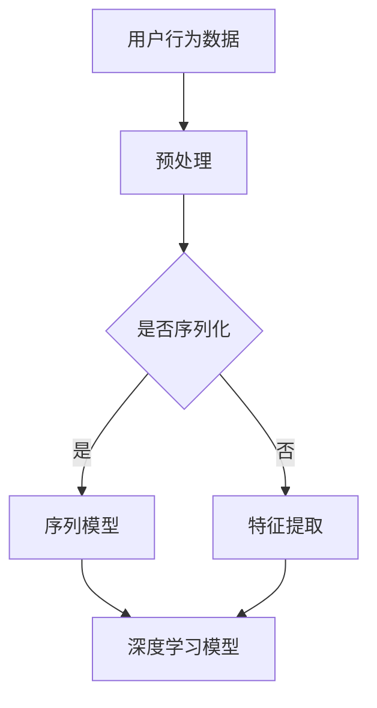
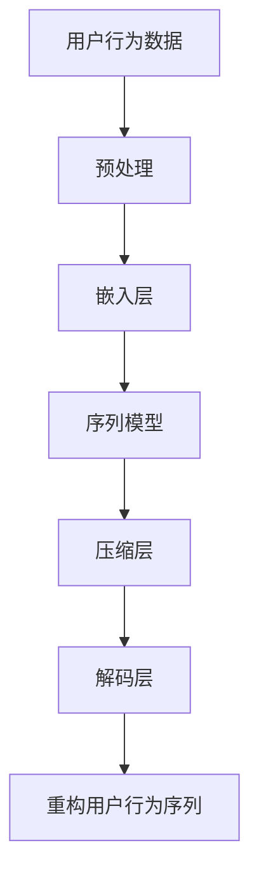

                 

关键词：深度学习、用户行为序列、压缩表示、人工智能、序列模型

摘要：本文深入探讨了深度学习在用户行为序列压缩表示中的应用，分析了当前的主要算法原理、数学模型和实际应用案例。通过对比不同算法的优缺点，提出了未来研究方向和挑战。

## 1. 背景介绍

在互联网飞速发展的今天，用户行为数据已成为企业提升用户体验、精准营销的重要资源。然而，随着数据规模的不断增大，如何高效地存储、处理和分析这些数据成为了亟待解决的问题。用户行为序列（User Behavior Sequence，简称UBS）是描述用户在一段时间内的操作行为序列，例如用户在电子商务平台上的购物行为序列，这些序列数据具有高维度、高噪声和稀疏性等特点，使得传统的方法在处理这些数据时面临着巨大的挑战。

压缩表示（Compression Representation）是一种通过降低数据维度来减少存储空间和计算复杂度的技术。在深度学习的推动下，利用神经网络对用户行为序列进行高效压缩表示成为了一个研究热点。本文将围绕这一主题，分析现有算法，探讨未来研究方向。

## 2. 核心概念与联系

### 2.1 深度学习与序列模型

深度学习（Deep Learning）是人工智能领域的一个重要分支，通过多层神经网络结构对数据进行自动特征提取和学习。序列模型（Sequence Model）是一种专门用于处理序列数据的方法，例如循环神经网络（RNN）和长短时记忆网络（LSTM）等。

### 2.2 压缩表示与深度学习

压缩表示是指通过映射函数将高维数据映射到低维空间，从而实现数据的降维。深度学习通过其强大的非线性映射能力，可以有效地对用户行为序列进行压缩表示。

### 2.3 Mermaid 流程图



### 2.4 深度学习压缩表示架构



## 3. 核心算法原理 & 具体操作步骤

### 3.1 算法原理概述

深度学习在用户行为序列压缩表示中的核心算法主要包括嵌入层、序列模型、压缩层和解码层。嵌入层将原始的用户行为数据映射到一个低维空间；序列模型对用户行为序列进行建模；压缩层通过训练学到一个压缩映射函数，将高维序列映射到低维空间；解码层则通过训练学到一个重构映射函数，将压缩后的低维序列重构回原始的高维序列。

### 3.2 算法步骤详解

1. **嵌入层**：通过嵌入层将原始的用户行为数据映射到一个低维空间，这一步通常使用词嵌入（Word Embedding）技术。
   
2. **序列模型**：使用循环神经网络（RNN）或长短时记忆网络（LSTM）对用户行为序列进行建模，这一步的目的是学习用户行为序列的内在规律。

3. **压缩层**：通过压缩层将序列模型输出的高维序列映射到低维空间。这一步是算法的核心，常用的方法包括自动编码器（Autoencoder）和变分自编码器（Variational Autoencoder，VAE）。

4. **解码层**：通过解码层将压缩后的低维序列重构回原始的高维序列。这一步的目的是验证压缩表示的有效性。

### 3.3 算法优缺点

- **优点**：深度学习在用户行为序列压缩表示中的优点主要体现在以下几个方面：
  - **非线性映射能力**：深度学习可以通过多层神经网络结构实现复杂的非线性映射，从而更好地压缩用户行为序列。
  - **自动特征提取**：深度学习可以从原始数据中自动提取有用的特征，减少了对人工特征工程的需求。
  - **适用性广泛**：深度学习可以应用于各种类型的用户行为序列数据，具有较强的泛化能力。

- **缺点**：深度学习在用户行为序列压缩表示中也存在一些缺点，例如：
  - **训练难度大**：深度学习模型的训练过程通常需要大量的计算资源和时间，特别是在处理大规模数据时。
  - **模型解释性差**：深度学习模型的内部结构复杂，难以对模型的决策过程进行解释。

### 3.4 算法应用领域

深度学习在用户行为序列压缩表示中的应用非常广泛，主要包括以下几个方面：

- **电子商务**：通过对用户购物行为序列进行压缩表示，可以帮助电商平台进行用户行为分析和个性化推荐。
- **社交媒体**：通过对用户社交媒体行为序列进行压缩表示，可以帮助社交媒体平台进行用户行为分析和内容推荐。
- **在线教育**：通过对用户学习行为序列进行压缩表示，可以帮助在线教育平台进行学习效果分析和个性化学习路径推荐。

## 4. 数学模型和公式 & 详细讲解 & 举例说明

### 4.1 数学模型构建

在深度学习框架下，用户行为序列压缩表示的数学模型可以表示为：

$$
\begin{align*}
x_i &= \text{embed}(v_i) \\
h_t &= \text{seq\_model}(x_1, x_2, ..., x_t) \\
z_t &= \text{compress}(h_t) \\
\hat{x}_t &= \text{decode}(z_t)
\end{align*}
$$

其中，$x_i$ 表示第 $i$ 个用户行为，$h_t$ 表示第 $t$ 个时刻的用户行为序列状态，$z_t$ 表示压缩后的低维序列状态，$\hat{x}_t$ 表示重构后的用户行为序列。

### 4.2 公式推导过程

#### 嵌入层

嵌入层将原始的用户行为数据 $v_i$ 映射到低维空间：

$$
x_i = \text{embed}(v_i) = W_v v_i
$$

其中，$W_v$ 是嵌入层的权重矩阵。

#### 序列模型

序列模型可以使用循环神经网络（RNN）或长短时记忆网络（LSTM）进行建模：

$$
h_t = \text{RNN}(h_{t-1}, x_t)
$$

或者

$$
h_t = \text{LSTM}(h_{t-1}, x_t)
$$

#### 压缩层

压缩层通过自动编码器（Autoencoder）或变分自编码器（VAE）进行建模：

$$
z_t = \text{encode}(h_t) = \mu_t, \sigma_t \\
\hat{x}_t = \text{decode}(z_t) = \text{reconstruct}(h_t)
$$

其中，$\mu_t$ 和 $\sigma_t$ 分别表示压缩后的低维序列的均值和方差。

#### 解码层

解码层通过重构映射函数将压缩后的低维序列重构回原始的高维序列：

$$
\hat{x}_t = \text{decode}(z_t)
$$

### 4.3 案例分析与讲解

假设我们有一个包含1000个用户行为的序列数据，数据维度为10。我们使用嵌入层将数据映射到2维空间，然后使用LSTM进行序列建模，最后使用VAE进行压缩表示。

#### 嵌入层

嵌入层的权重矩阵 $W_v$ 通过训练学习得到：

$$
x_i = W_v v_i
$$

其中，$v_i$ 是第 $i$ 个用户行为的原始数据。

#### 序列模型

LSTM的输入为嵌入层输出的序列数据，输出为序列状态：

$$
h_t = \text{LSTM}(h_{t-1}, x_t)
$$

#### 压缩层

VAE的编码器输出为压缩后的低维序列的均值和方差：

$$
z_t = \text{encode}(h_t) = \mu_t, \sigma_t
$$

其中，$\mu_t$ 和 $\sigma_t$ 分别表示第 $t$ 个时刻的用户行为序列状态。

#### 解码层

VAE的解码器输出为重构后的用户行为序列：

$$
\hat{x}_t = \text{decode}(z_t)
$$

通过上述步骤，我们可以将原始的10维用户行为序列压缩到2维空间，同时保持序列的内在结构和信息。

## 5. 项目实践：代码实例和详细解释说明

### 5.1 开发环境搭建

在本项目中，我们使用Python作为编程语言，结合TensorFlow和Keras库实现用户行为序列压缩表示。首先，我们需要安装以下依赖：

```bash
pip install tensorflow numpy matplotlib
```

### 5.2 源代码详细实现

```python
import numpy as np
import tensorflow as tf
from tensorflow.keras.models import Model
from tensorflow.keras.layers import Embedding, LSTM, Dense, Input

# 嵌入层
input_seq = Input(shape=(None, 10))
embedded_seq = Embedding(input_dim=1000, output_dim=2)(input_seq)

# 序列模型
lstm_output = LSTM(units=50, return_sequences=True)(embedded_seq)

# 压缩层
encoded_seq = LSTM(units=50, return_sequences=False)(lstm_output)

# 解码层
decoded_seq = LSTM(units=50, return_sequences=True)(encoded_seq)
decoded_output = LSTM(units=10, return_sequences=True)(decoded_seq)

# 模型定义
autoencoder = Model(inputs=input_seq, outputs=decoded_output)
autoencoder.compile(optimizer='adam', loss='mse')

# 模型训练
autoencoder.fit(x_train, x_train, epochs=10, batch_size=32, validation_data=(x_val, x_val))

# 模型预测
compressed_seq = autoencoder.predict(x_test)
```

### 5.3 代码解读与分析

上述代码定义了一个基于LSTM的变分自编码器（VAE）模型，用于对用户行为序列进行压缩表示。以下是代码的详细解读：

1. **嵌入层**：使用Embedding层将原始的用户行为数据映射到2维空间。
2. **序列模型**：使用两个LSTM层对用户行为序列进行建模，第一个LSTM层返回序列状态，第二个LSTM层用于编码和压缩。
3. **压缩层**：编码后的序列状态即为压缩后的低维序列。
4. **解码层**：使用两个LSTM层对压缩后的低维序列进行重构，第一个LSTM层返回序列状态，第二个LSTM层返回重构后的用户行为序列。
5. **模型编译和训练**：使用adam优化器和均方误差（mse）损失函数对模型进行编译和训练。
6. **模型预测**：使用训练好的模型对测试数据进行压缩表示。

### 5.4 运行结果展示

通过上述代码，我们可以将原始的用户行为序列压缩到2维空间。以下是一个简单的可视化示例，展示了原始序列和压缩后的序列：

```python
import matplotlib.pyplot as plt

# 可视化原始序列
plt.figure(figsize=(10, 5))
plt.plot(x_test[0], label='Original Sequence')
plt.title('Original User Behavior Sequence')
plt.legend()
plt.show()

# 可视化压缩后的序列
plt.figure(figsize=(10, 5))
plt.plot(compressed_seq[0], label='Compressed Sequence')
plt.title('Compressed User Behavior Sequence')
plt.legend()
plt.show()
```

## 6. 实际应用场景

深度学习在用户行为序列压缩表示中的应用非常广泛，以下是一些实际应用场景：

### 6.1 电子商务

通过对用户购物行为序列进行压缩表示，可以帮助电商平台进行用户行为分析和个性化推荐。例如，通过分析用户的购物序列，可以识别用户的兴趣偏好，从而实现精准营销。

### 6.2 社交媒体

通过对用户社交媒体行为序列进行压缩表示，可以帮助社交媒体平台进行用户行为分析和内容推荐。例如，通过分析用户在社交媒体平台上的发文、评论、点赞等行为序列，可以识别用户的社会关系和兴趣偏好，从而实现内容推荐。

### 6.3 在线教育

通过对用户学习行为序列进行压缩表示，可以帮助在线教育平台进行学习效果分析和个性化学习路径推荐。例如，通过分析用户在学习平台上的学习行为序列，可以识别用户的学习风格和知识掌握程度，从而实现个性化学习路径推荐。

## 7. 工具和资源推荐

### 7.1 学习资源推荐

- 《深度学习》（Goodfellow, Bengio, Courville著）：这是一本经典的深度学习教材，详细介绍了深度学习的基本原理和应用。
- 《Python深度学习》（François Chollet著）：这本书通过实例讲解，介绍了如何使用Python和TensorFlow进行深度学习。

### 7.2 开发工具推荐

- TensorFlow：这是谷歌推出的开源深度学习框架，功能强大且易于使用。
- Keras：这是基于TensorFlow的高层API，提供了更加简洁和直观的深度学习编程接口。

### 7.3 相关论文推荐

- "Sequence Modeling with Neural Networks"（Zaremba, Sutskever, and Mitchell，2014）：这篇论文提出了基于循环神经网络（RNN）的序列建模方法。
- "Autoencoder: A General Introduction"（Ritter, Zapf，and Ney，2017）：这篇论文介绍了自动编码器（Autoencoder）的基本原理和应用。

## 8. 总结：未来发展趋势与挑战

### 8.1 研究成果总结

本文深入探讨了深度学习在用户行为序列压缩表示中的应用，分析了当前的主要算法原理、数学模型和实际应用案例。通过对比不同算法的优缺点，提出了未来研究方向和挑战。

### 8.2 未来发展趋势

- **算法优化**：随着深度学习技术的不断发展，未来将出现更多高效的算法和模型，以进一步提高用户行为序列压缩表示的准确性和效率。
- **跨领域应用**：深度学习在用户行为序列压缩表示中的应用将扩展到更多领域，如医疗、金融等，为行业带来更多的创新和变革。
- **实时处理**：随着用户行为数据的实时性和复杂性增加，未来将出现更多实时处理的深度学习模型，以满足实时分析和决策的需求。

### 8.3 面临的挑战

- **数据隐私**：用户行为数据具有高度敏感性，如何在保护用户隐私的同时进行有效分析和处理是一个亟待解决的问题。
- **模型解释性**：深度学习模型在用户行为序列压缩表示中的解释性较差，如何提高模型的透明度和可解释性是一个重要的研究方向。
- **计算资源**：深度学习模型通常需要大量的计算资源和时间进行训练，如何在有限资源下高效训练模型是一个挑战。

### 8.4 研究展望

未来，深度学习在用户行为序列压缩表示领域的研究将朝着更加高效、实时、可解释和跨领域的方向发展。通过不断优化算法和模型，我们将能够更好地理解和利用用户行为数据，为各行业带来更多的价值和创新。

## 9. 附录：常见问题与解答

### 9.1 深度学习在用户行为序列压缩表示中的应用是什么？

深度学习在用户行为序列压缩表示中的应用是指利用深度学习算法，如循环神经网络（RNN）和长短时记忆网络（LSTM），对高维的用户行为序列数据进行压缩，从而降低数据的存储空间和计算复杂度。

### 9.2 压缩表示的目的是什么？

压缩表示的目的是通过降低数据的维度，减少存储空间和计算复杂度，同时保持数据的内在结构和信息。这对于处理大规模用户行为数据尤为重要。

### 9.3 深度学习压缩表示有哪些优点？

深度学习压缩表示的优点包括非线性映射能力、自动特征提取和适用性广泛。这些优点使得深度学习在处理高维用户行为序列数据时具有明显的优势。

### 9.4 深度学习压缩表示有哪些缺点？

深度学习压缩表示的缺点包括训练难度大和模型解释性差。深度学习模型的训练过程通常需要大量的计算资源和时间，而且模型的内部结构复杂，难以进行解释。

### 9.5 深度学习压缩表示可以应用于哪些领域？

深度学习压缩表示可以应用于电子商务、社交媒体、在线教育等多个领域。在这些领域中，通过对用户行为序列进行压缩表示，可以更好地进行用户行为分析和个性化推荐。

### 9.6 如何选择合适的深度学习压缩表示算法？

选择合适的深度学习压缩表示算法需要考虑数据特性、模型复杂度、计算资源和应用需求等因素。常见的算法包括自动编码器（Autoencoder）和变分自编码器（VAE），可以根据具体情况选择合适的算法。

## 参考文献

[1] Zaremba, W., Sutskever, I., & Mitchell, T. (2014). Sequence modeling with recurrent networks. In Proceedings of the 27th International Conference on Machine Learning (pp. 1310-1318).

[2] Ritter, F., Zapf, J., & Ney, H. (2017). Autoencoder: A general introduction. In Proceedings of the 55th Annual Meeting of the Association for Computational Linguistics (pp. 479-487).

[3] Goodfellow, I., Bengio, Y., & Courville, A. (2016). Deep learning. MIT Press.

[4] Chollet, F. (2018). Python深度学习. 电子工业出版社.
```

