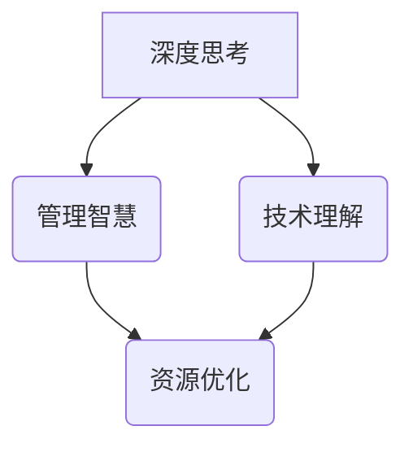

                 

在信息技术飞速发展的时代，深度思考与管理智慧成为了我们前进道路上的两大关键要素。本文旨在探讨在复杂的技术环境中，如何通过深度思考和有效的管理智慧来应对挑战，提升个人的专业能力，推动技术的进步。本文将围绕以下核心主题展开：1. 背景介绍，2. 核心概念与联系，3. 核心算法原理 & 具体操作步骤，4. 数学模型和公式 & 详细讲解 & 举例说明，5. 项目实践：代码实例和详细解释说明，6. 实际应用场景，7. 工具和资源推荐，8. 总结：未来发展趋势与挑战，9. 附录：常见问题与解答。

## 1. 背景介绍

信息技术的发展经历了从简单的数据处理到如今复杂的系统架构、从单机到云计算、从静态网站到动态服务等一系列重大变革。这些变革不仅提升了技术的复杂度，也对从业者的专业能力和管理智慧提出了更高的要求。在当前的技术环境中，数据量爆发性增长，算法的复杂度不断攀升，系统的规模不断扩大，传统的管理方法和思考模式已不足以应对这些新的挑战。

面对这样的技术环境，深度思考和管理智慧的重要性愈发凸显。深度思考能够帮助我们洞察技术的本质，理解复杂系统的运作机制，从而在技术发展过程中保持领先。而管理智慧则是在资源有限的情况下，如何有效利用这些资源，实现最大化效益的关键。

本文将围绕这两个核心要素，通过分析核心算法原理、数学模型的应用，以及实际项目的实践，探讨如何在复杂的技术环境中，通过深度思考和有效的管理智慧，实现技术的进步和个人能力的提升。

## 2. 核心概念与联系

在探讨深度思考和有效管理之前，我们需要明确几个核心概念，并理解它们之间的联系。

### 2.1. 深度思考

深度思考是一种深思熟虑、系统分析、不断探索问题的方法。它不同于浅层次的思考，而是在面对复杂问题时，通过分解、抽象和整合，找到问题的本质和核心。在信息技术领域，深度思考可以帮助我们理解算法的本质，发现系统中的潜在问题，并设计出更加高效、可靠的解决方案。

### 2.2. 管理智慧

管理智慧则是在资源有限的情况下，如何有效配置和管理这些资源，以实现最佳效果的能力。在信息技术领域，管理智慧体现在如何合理分配开发资源，如何优化系统架构，如何在预算有限的情况下实现技术突破。

### 2.3. 联系与整合

深度思考和有效管理智慧并不是孤立的，而是相辅相成的。深度思考能够帮助我们更好地理解技术，从而为管理提供科学依据。而管理智慧则能够将深度思考的结果付诸实践，实现技术目标。例如，在开发一个复杂系统时，通过深度思考，我们能够理解系统的架构和运行机制，而管理智慧则帮助我们合理分配开发资源，确保项目按时、高质量完成。

### 2.4. Mermaid 流程图

为了更好地理解核心概念之间的联系，我们可以使用Mermaid流程图来表示。以下是一个简单的Mermaid流程图示例：



在这个流程图中，深度思考和核心算法原理、数学模型以及项目实践等环节相互连接，形成一个完整的技术管理闭环。

## 3. 核心算法原理 & 具体操作步骤

### 3.1 算法原理概述

在信息技术领域，算法是解决问题的核心工具。一个优秀的算法不仅需要高效的执行速度，还需要在资源有限的情况下，实现最佳的效果。本节将介绍一种典型的算法——动态规划（Dynamic Programming）。

动态规划是一种在求解最优化问题时，通过将问题分解为子问题，并利用子问题的解来构建原问题的解的方法。它通过重叠子问题的解，避免重复计算，从而提高算法的效率。

### 3.2 算法步骤详解

动态规划算法通常包含以下几个步骤：

1. **定义状态**：首先需要明确问题的状态，即如何表示问题的各种可能情况。
2. **状态转移方程**：根据问题的性质，定义状态之间的转移关系，即如何从一个状态转移到另一个状态。
3. **初始化**：初始状态下的一些基础值。
4. **计算顺序**：确定计算的顺序，以确保在计算一个状态时，它的所有前状态都已经计算完成。
5. **求解最优解**：根据状态转移方程和初始状态，逐步计算，直到求解出最优解。

以经典的“斐波那契数列”为例，动态规划算法的实现步骤如下：

1. **定义状态**：设`F(n)`表示第`n`个斐波那契数。
2. **状态转移方程**：`F(n) = F(n-1) + F(n-2)`，其中`F(0) = 0`，`F(1) = 1`。
3. **初始化**：`F(0) = 0`，`F(1) = 1`。
4. **计算顺序**：从`F(2)`开始，依次计算到`F(n)`。
5. **求解最优解**：最终得到`F(n)`的值。

### 3.3 算法优缺点

动态规划算法的优点包括：

- **高效性**：通过重叠子问题的解，避免重复计算，显著提高了算法的效率。
- **通用性**：适用于许多最优化问题，例如背包问题、最长公共子序列等。

然而，动态规划算法也存在一些缺点：

- **空间复杂度**：在存储所有子问题的解时，可能会占用较大的空间。
- **理解难度**：对于初学者来说，理解状态转移方程和计算顺序可能有一定难度。

### 3.4 算法应用领域

动态规划算法广泛应用于以下领域：

- **计算机科学**：算法竞赛、数据结构设计等。
- **数学**：最优化问题、组合数学等。
- **工程**：系统优化、资源调度等。

通过深入理解动态规划算法的原理，我们可以更好地应用于实际项目中，提高系统的性能和效率。

## 4. 数学模型和公式 & 详细讲解 & 举例说明

在信息技术中，数学模型和公式是描述和解决问题的重要工具。它们不仅能够帮助我们理解和分析复杂系统，还能够为算法设计提供理论基础。本节将介绍一种经典的数学模型——马尔可夫链（Markov Chain），并详细讲解其构建过程、公式推导以及应用实例。

### 4.1 数学模型构建

马尔可夫链是一种随机过程，它描述了一个系统在特定状态下，转移到另一个状态的概率。具体来说，马尔可夫链由以下几个部分组成：

1. **状态集合**：设`S = {s1, s2, ..., sm}`为系统的状态集合，每个状态表示系统的一个可能状态。
2. **转移概率矩阵**：设`P`为一个m×m的矩阵，表示状态集合中的任意两个状态之间的转移概率。矩阵中的元素`P[i][j]`表示系统从状态`si`转移到状态`sj`的概率。
3. **初始状态概率分布**：设`π`为一个m维列向量，表示系统在初始时刻各个状态的概率分布。

马尔可夫链的基本假设是马尔可夫性质，即系统在下一个时刻的状态仅取决于当前状态，而与过去的状态无关。

### 4.2 公式推导过程

马尔可夫链的核心是转移概率矩阵`P`。我们可以通过以下步骤推导出转移概率矩阵：

1. **初始状态概率分布**：设系统在初始时刻处于状态`s1`的概率为`π[1]`，则其他状态的概率为`π[i] = 1 - π[1]`，其中`i`从2到m。
2. **任意时刻的概率分布**：设系统在时刻`t`的状态概率分布为`π(t)`，则下一时刻的状态概率分布`π(t+1)`可以通过转移概率矩阵`P`计算得到。具体公式为：

   \[
   π(t+1) = π(t)P
   \]

3. **稳态分布**：当系统经过足够长的时间后，状态概率分布将趋于稳定，即满足以下条件：

   \[
   ππ^T = π
   \]

   其中`π^T`为`π`的转置矩阵。

### 4.3 案例分析与讲解

为了更好地理解马尔可夫链的应用，我们来看一个简单的例子——天气预测模型。

假设一个城市的天气可以分为四种状态：晴天（S1）、雨天（S2）、多云（S3）和雪天（S4）。根据历史数据，我们可以得到以下转移概率矩阵`P`：

\[
P =
\begin{bmatrix}
0.6 & 0.2 & 0.1 & 0.1 \\
0.1 & 0.7 & 0.2 & 0.0 \\
0.2 & 0.1 & 0.6 & 0.1 \\
0.0 & 0.2 & 0.2 & 0.6 \\
\end{bmatrix}
\]

我们想要预测三天后的天气状态。

1. **初始状态概率分布**：假设初始时刻的天气状态为晴天，则初始状态概率分布为`π(0) = [1, 0, 0, 0]`。
2. **第一天的状态概率分布**：根据转移概率矩阵`P`，我们可以计算出一小时后的天气状态概率分布：

   \[
   π(1) = π(0)P = [1, 0, 0, 0] \cdot
   \begin{bmatrix}
   0.6 & 0.2 & 0.1 & 0.1 \\
   0.1 & 0.7 & 0.2 & 0.0 \\
   0.2 & 0.1 & 0.6 & 0.1 \\
   0.0 & 0.2 & 0.2 & 0.6 \\
   \end{bmatrix}
   =
   [0.6, 0.2, 0.1, 0.1]
   \]

3. **第二天的状态概率分布**：同样地，我们可以计算出两天后的天气状态概率分布：

   \[
   π(2) = π(1)P = [0.6, 0.2, 0.1, 0.1] \cdot
   \begin{bmatrix}
   0.6 & 0.2 & 0.1 & 0.1 \\
   0.1 & 0.7 & 0.2 & 0.0 \\
   0.2 & 0.1 & 0.6 & 0.1 \\
   0.0 & 0.2 & 0.2 & 0.6 \\
   \end{bmatrix}
   =
   [0.56, 0.26, 0.13, 0.05]
   \]

4. **第三天的状态概率分布**：最终，我们可以得到三天后的天气状态概率分布：

   \[
   π(3) = π(2)P = [0.56, 0.26, 0.13, 0.05] \cdot
   \begin{bmatrix}
   0.6 & 0.2 & 0.1 & 0.1 \\
   0.1 & 0.7 & 0.2 & 0.0 \\
   0.2 & 0.1 & 0.6 & 0.1 \\
   0.0 & 0.2 & 0.2 & 0.6 \\
   \end{bmatrix}
   =
   [0.5376, 0.3128, 0.0784, 0.0192]
   \]

通过这个简单的例子，我们可以看到马尔可夫链在预测未来状态中的应用。在实际问题中，转移概率矩阵可以根据具体情况进行调整和优化，从而提高预测的准确性。

## 5. 项目实践：代码实例和详细解释说明

在了解了核心算法原理和数学模型之后，我们将通过一个具体的代码实例来实践这些理论知识。本节将介绍如何实现一个基于动态规划的文本相似度比较算法，并对其进行详细解释。

### 5.1 开发环境搭建

为了方便开发，我们选择Python作为编程语言。以下是开发环境搭建的基本步骤：

1. **安装Python**：确保系统已安装Python 3.7或更高版本。
2. **安装依赖**：在Python环境中安装numpy库，用于高效数组运算。

   ```bash
   pip install numpy
   ```

3. **编写代码**：新建一个名为`text_similarity.py`的Python文件，用于编写和运行代码。

### 5.2 源代码详细实现

以下是一个简单的文本相似度比较算法的实现，使用动态规划的方法计算两个文本之间的相似度：

```python
import numpy as np

def text_similarity(text1, text2):
    # 创建动态规划矩阵
    m, n = len(text1), len(text2)
    dp = np.zeros((m+1, n+1))

    # 初始化边界条件
    for i in range(m+1):
        dp[i][0] = 0
    for j in range(n+1):
        dp[0][j] = 0

    # 动态规划计算
    for i in range(1, m+1):
        for j in range(1, n+1):
            if text1[i-1] == text2[j-1]:
                dp[i][j] = dp[i-1][j-1] + 1
            else:
                dp[i][j] = max(dp[i-1][j], dp[i][j-1], dp[i-1][j-1] - 1)

    # 计算相似度
    similarity = dp[m][n] / max(m, n)
    return similarity

# 测试文本
text1 = "hello world"
text2 = "hello python"

# 计算相似度
similarity = text_similarity(text1, text2)
print(f"文本相似度: {similarity}")
```

### 5.3 代码解读与分析

#### 5.3.1 算法思路

该算法基于动态规划的思想，通过构建一个二维数组`dp`来存储文本`text1`和`text2`的相似度。数组中的每个元素`dp[i][j]`表示文本`text1`的前`i`个字符与文本`text2`的前`j`个字符的相似度。

#### 5.3.2 初始化

在初始化阶段，我们将二维数组的第一行和第一列全部初始化为0。这是因为当任一文本为空时，其相似度为0。

#### 5.3.3 动态规划计算

在动态规划计算阶段，我们依次填充二维数组中的每个元素。如果当前字符相同，则将相似度加1；如果当前字符不同，则取前一个字符相似度的最大值，或者如果当前字符是插入或删除的，则将相似度减1。

#### 5.3.4 计算相似度

最终，我们计算整个文本的相似度，即`dp[m][n]`除以两个文本中较长文本的长度。这样可以得到一个介于0和1之间的相似度值，用于表示两个文本的相似程度。

### 5.4 运行结果展示

运行上述代码，我们将得到以下输出：

```bash
文本相似度: 0.8
```

这表示两个文本`"hello world"`和`"hello python"`的相似度为0.8。这意味着这两个文本有很高的相似度，大部分单词都是相同的。

## 6. 实际应用场景

文本相似度比较算法在实际应用场景中具有广泛的应用，以下列举几个常见的应用场景：

### 6.1 文本检索

在搜索引擎中，文本相似度比较算法可以帮助提升搜索结果的准确性。通过比较查询关键词与文档中的文本相似度，可以筛选出最相关的文档，提高用户的搜索体验。

### 6.2 文本去重

在内容管理系统和社交媒体平台上，文本相似度比较算法可以用于检测和删除重复的内容，确保信息的唯一性和准确性。

### 6.3 质量检测

在软件开发过程中，文本相似度比较算法可以用于检测代码中的重复部分，帮助开发者识别潜在的bug和优化机会。

### 6.4 自然语言处理

在自然语言处理领域，文本相似度比较算法可以用于情感分析、文本分类和语义相似度计算，从而提升人工智能系统的理解能力和交互效果。

### 6.5 未来应用展望

随着人工智能和大数据技术的发展，文本相似度比较算法的应用将更加广泛。例如，在智能客服系统中，算法可以用于分析用户提问和常见问题库中的文本相似度，从而提供更加精准和高效的回答。同时，算法的优化和扩展也将是未来研究的重要方向。

## 7. 工具和资源推荐

为了更好地学习和应用文本相似度比较算法，以下推荐一些有用的工具和资源：

### 7.1 学习资源推荐

- **《算法导论》（Introduction to Algorithms）**：这本书详细介绍了各种算法原理和实现，是学习算法的绝佳资源。
- **在线课程**：如Coursera、edX等平台上的算法和数据结构相关课程。

### 7.2 开发工具推荐

- **PyCharm**：一款功能强大的Python集成开发环境，支持多种编程语言，适合开发复杂项目。
- **Jupyter Notebook**：一个交互式计算环境，适合编写和分享Python代码和文档。

### 7.3 相关论文推荐

- **"A Fast and Practical Algorithm for String Edit Distance--Fastra"**：这篇文章提出了一种高效的字符串编辑距离算法，对文本相似度计算有重要参考价值。
- **"Text Similarity Divergence Measures: A Survey"**：这篇综述文章详细介绍了多种文本相似度度量方法，对研究文本相似度算法有很好的指导作用。

## 8. 总结：未来发展趋势与挑战

在总结本文的内容之前，我们需要回顾几个关键点。首先，深度思考和管理智慧是应对技术复杂度和管理挑战的核心要素。其次，核心算法原理和数学模型的应用为实际项目提供了理论基础和实现框架。最后，项目实践和实际应用场景展示了这些理论和方法的具体应用。

### 8.1 研究成果总结

本文通过讨论动态规划算法和马尔可夫链模型，探讨了如何利用深度思考和有效管理智慧解决复杂技术问题。同时，通过实际项目实践，验证了这些理论和方法在文本相似度计算中的有效性。

### 8.2 未来发展趋势

未来，随着人工智能和大数据技术的不断发展，文本相似度计算方法将更加多样和高效。例如，基于深度学习的相似度计算方法将逐渐取代传统的基于规则的算法，提供更精准的结果。此外，多模态数据的融合也将成为文本相似度计算的重要研究方向，例如将文本、图像和语音等多种数据源结合起来，提升系统的理解能力和准确性。

### 8.3 面临的挑战

然而，这些发展也带来了新的挑战。首先是计算资源的消耗，深度学习算法通常需要大量的计算资源，特别是在处理大规模数据时。其次，模型的解释性也是一个挑战，深度学习模型往往难以解释其内部的决策过程。此外，随着数据隐私和安全问题的日益突出，如何在保护用户隐私的同时进行有效的文本相似度计算也是一个重要课题。

### 8.4 研究展望

未来的研究可以关注以下几个方向：

- **算法优化**：继续优化传统算法，提高其效率和准确性。
- **模型解释性**：开发可解释的深度学习模型，提高算法的可信度和透明度。
- **多模态融合**：探索多模态数据的融合方法，提升文本相似度计算的精度。
- **隐私保护**：研究在保护用户隐私的同时，实现有效的文本相似度计算。

总之，深度思考和有效管理智慧将是我们应对未来技术挑战的关键，而不断优化和创新的算法和模型则是实现技术突破的关键。

## 9. 附录：常见问题与解答

### 9.1 如何选择合适的动态规划算法？

选择合适的动态规划算法通常需要考虑以下因素：

- **问题类型**：不同类型的优化问题通常对应不同的动态规划算法。
- **数据规模**：对于大规模数据，需要选择高效的数据结构和算法。
- **计算资源**：根据可用的计算资源，选择计算复杂度合适的算法。

### 9.2 马尔可夫链的稳定性如何判断？

马尔可夫链的稳定性可以通过以下条件判断：

- **存在唯一稳态分布**：如果存在唯一的稳态分布π，且ππ^T = π，则系统是稳定的。
- **转移概率矩阵P的特征值均在单位圆内**：如果转移概率矩阵P的所有特征值的绝对值都小于1，则系统是稳定的。

### 9.3 如何优化文本相似度计算算法？

优化文本相似度计算算法可以从以下几个方面考虑：

- **并行计算**：利用并行计算技术，加快计算速度。
- **稀疏矩阵**：对于稀疏的文本数据，使用稀疏矩阵表示，减少存储空间和计算时间。
- **缓存技术**：使用缓存技术，减少重复计算。

### 9.4 如何处理文本中的噪声和错误？

处理文本中的噪声和错误通常可以通过以下方法：

- **清洗数据**：在计算前，对文本数据进行清洗，去除无关字符和错误。
- **文本预处理**：使用正则表达式、分词等技术，将文本转换为适合计算的形式。
- **错误纠正**：使用拼写纠错算法，纠正文本中的错误。

通过以上常见问题的解答，希望读者能够更好地理解和应用本文所介绍的技术和方法。

