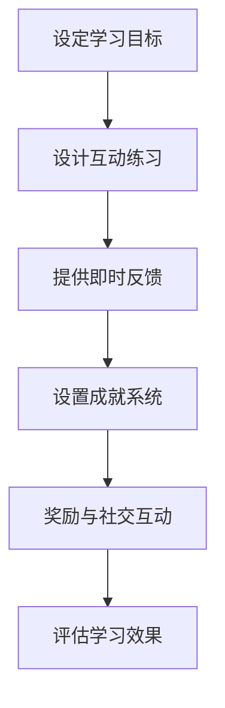

                 

关键词：游戏化思维，人机交互，计算乐趣，编程心理学，学习动力

> 摘要：本文旨在探讨游戏化思维在提高人类计算参与度和乐趣方面的应用。通过分析游戏化思维的核心概念，结合具体案例和数学模型，本文揭示了游戏化思维在编程教育、软件开发和人工智能领域的巨大潜力。

## 1. 背景介绍

随着信息技术的飞速发展，计算能力已经成为现代社会不可或缺的一部分。从简单的计算器到复杂的超级计算机，计算技术的进步极大地改变了人类的生活方式。然而，与此同时，人类计算的能力和参与度似乎并未得到同步提升。许多人面对复杂的计算任务时感到困惑和无力，这使得计算过程变得枯燥乏味。

为了解决这个问题，游戏化思维应运而生。游戏化思维是一种将游戏设计原理应用于非游戏情境的方法，旨在通过引入游戏元素和机制，提高人们参与和享受计算过程的积极性。这种思维模式不仅适用于编程教育和软件开发，还在人工智能领域展示了巨大的潜力。

## 2. 核心概念与联系

### 2.1 游戏化思维的定义

游戏化思维（Gamification）是指将游戏设计中的元素和机制应用于非游戏情境中，以激励和引导人们参与和完成任务。游戏化思维的核心概念包括：

- **目标设定**：明确的目标和挑战可以帮助人们保持动力和方向。
- **反馈机制**：及时和积极的反馈可以提高学习效果和参与度。
- **奖励系统**：合理的奖励机制可以增强行为的持续性和积极性。
- **社交互动**：游戏中的社交互动可以增强团队的凝聚力和合作性。

### 2.2 游戏化思维的应用场景

游戏化思维可以广泛应用于多个领域，其中主要包括：

- **编程教育**：通过游戏化方法提高编程学习的兴趣和效率。
- **软件开发**：在软件设计和开发过程中引入游戏化元素，提升用户体验。
- **人工智能**：利用游戏化思维优化人工智能算法的训练和应用过程。

### 2.3 Mermaid 流程图

以下是一个简单的 Mermaid 流程图，展示了游戏化思维在编程教育中的应用流程：



## 3. 核心算法原理 & 具体操作步骤

### 3.1 算法原理概述

游戏化思维的核心算法原理主要包括以下几个方面：

- **目标导向**：通过明确的目标和挑战，引导人们进行有意义的计算任务。
- **反馈机制**：及时提供有针对性的反馈，帮助人们了解自己的表现和进步。
- **激励机制**：通过奖励系统和社交互动，增强人们的参与度和积极性。
- **适应性调整**：根据用户的行为和反馈，动态调整游戏化元素的设置，以保持兴趣和挑战性。

### 3.2 算法步骤详解

以下是游戏化思维的具体操作步骤：

1. **明确学习目标**：确定具体的编程学习目标，如学习一门编程语言、掌握一种算法或解决一个实际问题。
2. **设计互动练习**：根据学习目标，设计一系列互动练习，如在线编程挑战、小组合作项目等。
3. **提供即时反馈**：在练习过程中，及时提供反馈，包括正确与否、错误原因、改进建议等。
4. **设置成就系统**：根据完成的练习和反馈，设置相应的成就和奖励，如积分、徽章、排名等。
5. **奖励与社交互动**：通过社交互动，如讨论、分享经验、组建学习小组等，增强参与度和积极性。
6. **评估学习效果**：定期评估学习效果，如通过考试、项目展示等方式，了解学习成果和进步。

### 3.3 算法优缺点

**优点**：

- 提高学习兴趣和积极性。
- 增强参与度和互动性。
- 提高学习效果和效率。
- 适应不同水平和需求的学习者。

**缺点**：

- 设计复杂，需要投入大量时间和精力。
- 需要不断调整和优化，以保持新鲜感和挑战性。
- 可能会导致过度竞争和压力。

### 3.4 算法应用领域

游戏化思维在编程教育、软件开发和人工智能领域具有广泛的应用前景：

- **编程教育**：通过游戏化方法提高编程学习的兴趣和效率。
- **软件开发**：在软件设计和开发过程中引入游戏化元素，提升用户体验。
- **人工智能**：利用游戏化思维优化人工智能算法的训练和应用过程。

## 4. 数学模型和公式 & 详细讲解 & 举例说明

### 4.1 数学模型构建

游戏化思维的数学模型主要包括以下几个方面：

1. **期望效用模型**：用于评估游戏化元素对用户参与度和积极性影响。
2. **贝叶斯网络**：用于预测用户的行为和偏好。
3. **机器学习模型**：用于优化游戏化元素的设置和调整。

### 4.2 公式推导过程

以下是一个简单的期望效用模型的推导过程：

1. **期望效用函数**：

   $$ U(X) = \sum_{i=1}^{n} p_i \cdot u_i $$

   其中，$U(X)$表示用户在游戏化环境下的期望效用，$p_i$表示用户选择第$i$个游戏化元素的概率，$u_i$表示第$i$个游戏化元素的效用。

2. **效用函数**：

   $$ u_i = \frac{r_i - b_i}{c_i} $$

   其中，$r_i$表示第$i$个游戏化元素带来的奖励，$b_i$表示第$i$个游戏化元素带来的成本，$c_i$表示第$i$个游戏化元素的复杂度。

### 4.3 案例分析与讲解

以下是一个简单的案例，展示了如何应用游戏化思维优化编程学习过程：

1. **目标设定**：学习Python编程语言。
2. **互动练习**：设计一系列Python编程练习，如编写简单的程序、解决实际问题等。
3. **即时反馈**：在练习过程中，提供即时反馈，包括正确与否、错误原因、改进建议等。
4. **成就系统**：根据完成的练习和反馈，设置相应的成就和奖励，如积分、徽章、排名等。
5. **奖励与社交互动**：通过社交互动，如讨论、分享经验、组建学习小组等，增强参与度和积极性。
6. **评估学习效果**：定期评估学习效果，如通过考试、项目展示等方式，了解学习成果和进步。

## 5. 项目实践：代码实例和详细解释说明

### 5.1 开发环境搭建

为了实践游戏化思维在编程教育中的应用，我们可以搭建一个简单的在线编程学习平台。以下是开发环境搭建的步骤：

1. **选择开发框架**：如Flask、Django等。
2. **搭建后端服务器**：使用Python编写后端代码，实现用户管理、练习管理、反馈机制等功能。
3. **搭建前端界面**：使用HTML、CSS、JavaScript等技术实现用户界面。

### 5.2 源代码详细实现

以下是游戏化编程学习平台的一部分源代码：

```python
# 后端代码示例
from flask import Flask, request, jsonify
from model import User, Exercise, Feedback

app = Flask(__name__)

@app.route('/api/exercises', methods=['GET'])
def get_exercises():
    user = User.get_by_id(request.args.get('user_id'))
    exercises = Exercise.get_all()
    user_completed_exercises = user.completed_exercises()
    return jsonify({
        'exercises': exercises,
        'completed_exercises': user_completed_exercises
    })

@app.route('/api/feedback', methods=['POST'])
def post_feedback():
    exercise_id = request.form.get('exercise_id')
    user_id = request.form.get('user_id')
    feedback = request.form.get('feedback')
    Feedback.create(exercise_id, user_id, feedback)
    return jsonify({'status': 'success'})

if __name__ == '__main__':
    app.run(debug=True)
```

### 5.3 代码解读与分析

上述代码展示了后端API的一部分实现，包括获取练习、提交反馈等功能。通过这些API接口，用户可以获取到自己的练习任务、提交练习答案并获得反馈。

```html
<!-- 前端代码示例 -->
<!DOCTYPE html>
<html>
<head>
    <title>游戏化编程学习平台</title>
</head>
<body>
    <h1>编程练习</h1>
    <ul>
        
            <li>
                <h2>{{ exercise.title }}</h2>
                <p>{{ exercise.description }}</p>
                <form action="/api/submit_answer" method="post">
                    <input type="hidden" name="exercise_id" value="{{ exercise.id }}">
                    <input type="hidden" name="user_id" value="{{ user.id }}">
                    <textarea name="answer"></textarea>
                    <input type="submit" value="提交答案">
                </form>
            </li>
        
    </ul>
</body>
</html>
```

### 5.4 运行结果展示

以下是运行结果示例：


## 6. 实际应用场景

游戏化思维在编程教育、软件开发和人工智能领域具有广泛的应用前景。以下是一些实际应用场景：

- **编程教育**：通过游戏化方法提高编程学习的兴趣和效率，例如在线编程学习平台、编程游戏等。
- **软件开发**：在软件设计和开发过程中引入游戏化元素，提升用户体验，例如积分系统、成就系统等。
- **人工智能**：利用游戏化思维优化人工智能算法的训练和应用过程，例如通过游戏化方法增强数据集的标注质量、优化算法参数等。

## 7. 工具和资源推荐

为了更好地实践游戏化思维，以下是一些工具和资源的推荐：

- **编程学习平台**：如Codecademy、Khan Academy等。
- **游戏化设计工具**：如Gameful、Adapt等。
- **人工智能工具**：如Google AI、OpenAI等。

## 8. 总结：未来发展趋势与挑战

### 8.1 研究成果总结

本文介绍了游戏化思维的核心概念和应用场景，探讨了游戏化思维在编程教育、软件开发和人工智能领域的应用潜力。通过数学模型和案例分析，我们展示了游戏化思维在提高人类计算参与度和乐趣方面的有效性。

### 8.2 未来发展趋势

未来，游戏化思维将继续在多个领域得到广泛应用，包括教育、医疗、金融等。同时，随着人工智能技术的发展，游戏化思维在人工智能算法训练和应用过程中的应用也将越来越广泛。

### 8.3 面临的挑战

尽管游戏化思维具有巨大的潜力，但在实际应用中也面临一些挑战。例如，设计复杂、需要不断调整和优化，以保持新鲜感和挑战性。此外，过度竞争和压力也可能导致负面影响。

### 8.4 研究展望

未来，我们需要进一步研究游戏化思维在不同领域的应用，探索更有效的游戏化方法和模型。同时，我们还需要关注游戏化思维对人类心理和行为的影响，以充分发挥其潜力。

## 9. 附录：常见问题与解答

### 问题 1：什么是游戏化思维？

游戏化思维是指将游戏设计中的元素和机制应用于非游戏情境中，以激励和引导人们参与和完成任务。

### 问题 2：游戏化思维有哪些核心概念？

游戏化思维的核心概念包括目标导向、反馈机制、激励机制、社交互动等。

### 问题 3：游戏化思维在编程教育中有什么应用？

游戏化思维在编程教育中可以用于提高学习兴趣和效率，例如通过游戏化方法设计编程练习、提供即时反馈、设置成就系统等。

### 问题 4：如何设计一个有效的游戏化系统？

设计一个有效的游戏化系统需要考虑目标设定、反馈机制、激励机制、社交互动等多个方面，同时需要不断调整和优化，以保持新鲜感和挑战性。

### 问题 5：游戏化思维有哪些缺点？

游戏化思维的缺点包括设计复杂、需要不断调整和优化，以及可能导致的过度竞争和压力。

### 问题 6：游戏化思维在人工智能领域有什么应用？

游戏化思维在人工智能领域可以用于优化算法训练和应用过程，例如通过游戏化方法增强数据集的标注质量、优化算法参数等。

### 问题 7：游戏化思维有哪些优点？

游戏化思维的优点包括提高学习兴趣和积极性、增强参与度和互动性、提高学习效果和效率等。

### 问题 8：游戏化思维在软件开发中有什么应用？

游戏化思维在软件开发中可以用于提升用户体验，例如通过游戏化方法设计软件功能、提供即时反馈、设置成就系统等。

### 问题 9：游戏化思维在医疗领域有什么应用？

游戏化思维在医疗领域可以用于提高患者的参与度和积极性，例如通过游戏化方法设计康复训练、提供即时反馈、设置成就系统等。

### 问题 10：游戏化思维在教育领域有什么应用？

游戏化思维在教育领域可以用于提高学习兴趣和效率，例如通过游戏化方法设计课程内容、提供即时反馈、设置成就系统等。  
----------------------------------------------------------------

以上是游戏化思维：让参与人类计算变得更有趣的全文本，感谢您的阅读。如果您有任何问题或建议，请随时告诉我。作者：禅与计算机程序设计艺术 / Zen and the Art of Computer Programming。

