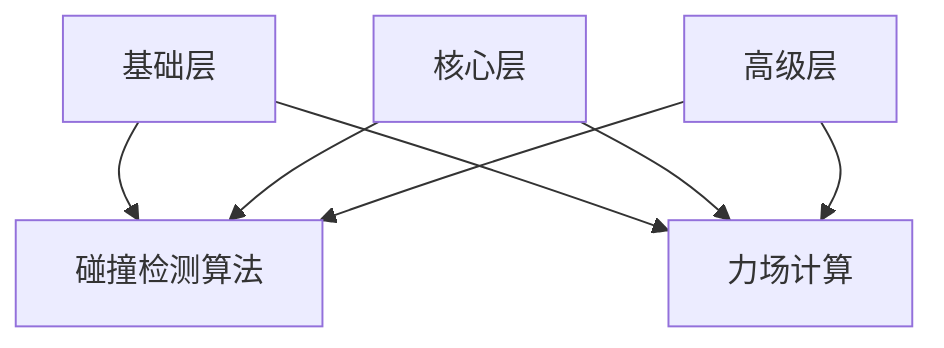

                 

 **关键词：** 游戏物理引擎、真实世界模拟、计算机图形学、物理引擎、交互性、性能优化

> **摘要：** 本文旨在深入探讨游戏物理引擎的设计与实现，尤其是其在实现真实世界物理模拟中的作用。通过分析核心概念、算法原理、数学模型，并结合项目实践，本文将展示如何构建高效的物理引擎，以提升游戏的沉浸感和交互性。

## 1. 背景介绍

游戏物理引擎是现代计算机图形学的重要组成部分，它负责模拟现实世界的物理现象，如碰撞检测、力场计算、运动学等。一个高效的物理引擎不仅能够提升游戏的视觉效果，还能增强玩家的交互体验。随着游戏技术的不断发展，物理引擎在游戏开发中的应用越来越广泛，从简单的碰撞检测到复杂的流体模拟，物理引擎已成为游戏开发中不可或缺的一环。

本文将围绕游戏物理引擎的核心概念、算法原理、数学模型及其在真实世界模拟中的应用进行深入探讨。通过详细的项目实践，本文将展示如何实现一个高效的物理引擎，并分析其在不同场景下的性能优化策略。

## 2. 核心概念与联系

### 2.1. 物理引擎基础

物理引擎的基本功能包括碰撞检测、力场计算、运动学模拟等。其中，碰撞检测是物理引擎的核心部分，它负责检测物体之间的接触并计算接触力。力场计算则用于模拟引力、斥力等物理现象。运动学模拟则根据物体的速度和加速度来计算物体的运动轨迹。

### 2.2. 物理引擎架构

物理引擎通常采用分层架构，包括基础层、核心层和高级层。基础层负责底层物理计算的实现，如碰撞检测算法和力场计算公式。核心层则负责将这些底层计算结果应用于具体的物理模拟场景，如刚体动力学和流体动力学。高级层则提供高级物理模拟功能，如物理破坏效果和变形模拟。

### 2.3. Mermaid 流程图

下面是一个简单的 Mermaid 流程图，展示了物理引擎的基本架构和功能模块：



## 3. 核心算法原理 & 具体操作步骤

### 3.1. 算法原理概述

物理引擎的核心算法包括碰撞检测算法、力场计算算法和运动学模拟算法。其中，碰撞检测算法用于检测物体之间的接触，力场计算算法用于计算物体之间的作用力，运动学模拟算法则根据物体的速度和加速度来计算物体的运动轨迹。

### 3.2. 算法步骤详解

#### 3.2.1. 碰撞检测算法

碰撞检测算法的主要任务是检测两个物体是否发生接触。常用的碰撞检测算法包括空间分割算法、分离轴定理（SAT）和扫描与排序算法。

1. 空间分割算法：将空间分割成多个小的区域，只检测处于同一区域的物体是否接触。
2. 分离轴定理（SAT）：通过选择一个轴来比较两个物体的最小边界盒，如果最小边界盒在所选轴上的投影不重叠，则两个物体不接触。
3. 扫描与排序算法：将物体沿一个轴排序，然后逐个扫描，比较相邻物体之间的距离。

#### 3.2.2. 力场计算算法

力场计算算法用于计算物体之间的作用力。常用的力场计算算法包括万有引力定律和牛顿第三定律。

1. 万有引力定律：根据物体之间的质量和距离计算引力。
2. 牛顿第三定律：每个作用力都有一个大小相等、方向相反的反作用力。

#### 3.2.3. 运动学模拟算法

运动学模拟算法用于计算物体的运动轨迹。常用的运动学模拟算法包括刚体动力学和流体动力学。

1. 刚体动力学：基于物体的质量和速度来计算物体的运动。
2. 流体动力学：基于流体的速度场和压力场来计算流体的运动。

### 3.3. 算法优缺点

#### 碰撞检测算法

- 优点：高效，适用于大规模物体场景。
- 缺点：在复杂场景下可能需要较高的计算成本。

#### 力场计算算法

- 优点：能够模拟多种物理现象，如引力、斥力。
- 缺点：计算复杂度较高，可能需要优化。

#### 运动学模拟算法

- 优点：能够精确模拟物体的运动。
- 缺点：在实时游戏中可能需要较高计算资源。

### 3.4. 算法应用领域

物理引擎在游戏开发中的应用非常广泛，包括：

- 碰撞检测：用于实现物理障碍、弹跳效果等。
- 力场计算：用于实现引力、重力等物理现象。
- 运动学模拟：用于实现角色控制、物体运动等。

## 4. 数学模型和公式 & 详细讲解 & 举例说明

### 4.1. 数学模型构建

物理引擎中的数学模型主要包括碰撞检测模型、力场计算模型和运动学模拟模型。

#### 4.1.1. 碰撞检测模型

碰撞检测模型通常基于分离轴定理（SAT），其核心公式如下：

$$
M_i \cdot v_j \geq L_i \cdot L_j
$$

其中，$M_i$ 和 $v_j$ 分别表示第 $i$ 个物体的最小边界盒在 $j$ 轴上的投影，$L_i$ 和 $L_j$ 分别表示第 $i$ 个物体的最大边界盒在 $j$ 轴上的投影。

#### 4.1.2. 力场计算模型

力场计算模型基于牛顿万有引力定律，其核心公式如下：

$$
F = G \cdot \frac{m_1 \cdot m_2}{r^2}
$$

其中，$F$ 表示引力大小，$G$ 表示万有引力常数，$m_1$ 和 $m_2$ 分别表示两个物体的质量，$r$ 表示两个物体之间的距离。

#### 4.1.3. 运动学模拟模型

运动学模拟模型基于牛顿第二定律，其核心公式如下：

$$
F = m \cdot a
$$

$$
v = u + a \cdot t
$$

$$
x = u \cdot t + \frac{1}{2} \cdot a \cdot t^2
$$

其中，$F$ 表示作用力大小，$m$ 表示物体质量，$a$ 表示加速度，$v$ 表示速度，$u$ 表示初始速度，$x$ 表示位移。

### 4.2. 公式推导过程

#### 4.2.1. 碰撞检测模型的推导

碰撞检测模型基于分离轴定理，其推导过程如下：

假设有两个物体 $A$ 和 $B$，它们在三维空间中的最小边界盒和最大边界盒分别为 $M_i$ 和 $L_i$，则物体 $A$ 和 $B$ 在任意轴 $j$ 上的投影范围分别为 $[m_{A,j}, M_{A,j}]$ 和 $[m_{B,j}, M_{B,j}]$。

根据分离轴定理，如果对于所有轴 $j$，都有以下条件成立：

$$
M_{A,j} \cdot L_{B,j} \leq m_{B,j} \cdot L_{A,j}
$$

$$
M_{B,j} \cdot L_{A,j} \leq m_{A,j} \cdot L_{B,j}
$$

则物体 $A$ 和 $B$ 在轴 $j$ 上不接触。

#### 4.2.2. 力场计算模型的推导

力场计算模型基于牛顿万有引力定律，其推导过程如下：

假设有两个质点 $m_1$ 和 $m_2$，它们之间的距离为 $r$，万有引力常数为 $G$。根据牛顿万有引力定律，质点 $m_1$ 对质点 $m_2$ 的引力大小为：

$$
F = G \cdot \frac{m_1 \cdot m_2}{r^2}
$$

同样，质点 $m_2$ 对质点 $m_1$ 的引力大小也为：

$$
F = G \cdot \frac{m_2 \cdot m_1}{r^2}
$$

根据牛顿第三定律，这两个引力大小相等，方向相反。

#### 4.2.3. 运动学模拟模型的推导

运动学模拟模型基于牛顿第二定律，其推导过程如下：

牛顿第二定律表示物体受到的合力等于其质量与加速度的乘积：

$$
F = m \cdot a
$$

初始速度 $u$ 表示物体开始运动时的速度，加速度 $a$ 表示物体在单位时间内速度的变化量。根据加速度的定义，可以推导出以下公式：

$$
v = u + a \cdot t
$$

其中，$v$ 表示任意时刻物体的速度，$t$ 表示时间。

将速度公式代入位移公式中，可以得到：

$$
x = u \cdot t + \frac{1}{2} \cdot a \cdot t^2
$$

其中，$x$ 表示物体在时间 $t$ 内的位移。

### 4.3. 案例分析与讲解

#### 4.3.1. 碰撞检测案例

假设有两个物体 $A$ 和 $B$，它们的坐标分别为 $(x_A, y_A)$ 和 $(x_B, y_B)$，大小分别为 $w_A$ 和 $w_B$。要检测这两个物体是否发生接触，可以使用以下步骤：

1. 计算物体 $A$ 和 $B$ 在 $x$ 轴和 $y$ 轴上的投影范围：
   $$
   m_{A,x} = x_A - \frac{w_A}{2}, \quad M_{A,x} = x_A + \frac{w_A}{2}
   $$
   $$
   m_{B,x} = x_B - \frac{w_B}{2}, \quad M_{B,x} = x_B + \frac{w_B}{2}
   $$
   $$
   m_{A,y} = y_A - \frac{w_A}{2}, \quad M_{A,y} = y_A + \frac{w_A}{2}
   $$
   $$
   m_{B,y} = y_B - \frac{w_B}{2}, \quad M_{B,y} = y_B + \frac{w_B}{2}
   $$

2. 使用分离轴定理（SAT）检测物体是否接触：
   $$
   M_{A,x} \cdot L_{B,x} \leq m_{B,x} \cdot L_{A,x}
   $$
   $$
   M_{B,x} \cdot L_{A,x} \leq m_{A,x} \cdot L_{B,x}
   $$
   $$
   M_{A,y} \cdot L_{B,y} \leq m_{B,y} \cdot L_{A,y}
   $$
   $$
   M_{B,y} \cdot L_{A,y} \leq m_{A,y} \cdot L_{B,y}
   $$

如果以上条件都满足，则物体 $A$ 和 $B$ 发生接触。

#### 4.3.2. 力场计算案例

假设有两个质点 $m_1$ 和 $m_2$，它们的坐标分别为 $(x_1, y_1)$ 和 $(x_2, y_2)$，质量分别为 $m_1$ 和 $m_2$。要计算这两个质点之间的引力大小，可以使用以下步骤：

1. 计算质点 $m_1$ 和 $m_2$ 之间的距离：
   $$
   r = \sqrt{(x_2 - x_1)^2 + (y_2 - y_1)^2}
   $$

2. 使用牛顿万有引力定律计算引力大小：
   $$
   F = G \cdot \frac{m_1 \cdot m_2}{r^2}
   $$

#### 4.3.3. 运动学模拟案例

假设有一个质点 $m$，其初始速度为 $u$，加速度为 $a$。要计算质点在 $t$ 时间后的速度和位移，可以使用以下步骤：

1. 使用速度公式计算质点在 $t$ 时间后的速度：
   $$
   v = u + a \cdot t
   $$

2. 使用位移公式计算质点在 $t$ 时间后的位移：
   $$
   x = u \cdot t + \frac{1}{2} \cdot a \cdot t^2
   $$

## 5. 项目实践：代码实例和详细解释说明

### 5.1. 开发环境搭建

在开始实现物理引擎之前，需要搭建一个合适的开发环境。以下是使用 C++ 语言实现物理引擎的基本步骤：

1. 安装 C++ 编译器，如 GCC 或 Clang。
2. 安装图形库，如 OpenGL 或 DirectX。
3. 安装版本控制系统，如 Git。
4. 安装构建工具，如 CMake。

### 5.2. 源代码详细实现

以下是使用 C++ 实现的简单碰撞检测代码示例：

```cpp
#include <iostream>
#include <vector>
#include <cmath>

using namespace std;

struct Vector2 {
    float x, y;

    Vector2(float x, float y) : x(x), y(y) {}
};

Vector2 operator+(const Vector2& a, const Vector2& b) {
    return Vector2(a.x + b.x, a.y + b.y);
}

Vector2 operator-(const Vector2& a, const Vector2& b) {
    return Vector2(a.x - b.x, a.y - b.y);
}

float operator*(const Vector2& a, const Vector2& b) {
    return a.x * b.x + a.y * b.y;
}

float length(const Vector2& v) {
    return sqrt(v * v);
}

bool checkCollision(const Vector2& posA, float wA, const Vector2& posB, float wB) {
    Vector2 diff = posB - posA;
    float wAD = wA / 2, wBD = wB / 2;

    float dx = (diff.x > 0) ? (diff.x - wAD - wBD) : (diff.x + wAD + wBD);
    float dy = (diff.y > 0) ? (diff.y - wAD - wBD) : (diff.y + wAD + wBD);

    return dx * dx + dy * dy < (wAD + wBD) * (wAD + wBD);
}

int main() {
    Vector2 posA(0, 0), posB(2, 2);
    float wA = 1, wB = 1;

    if (checkCollision(posA, wA, posB, wB)) {
        cout << "物体 A 和 B 相撞" << endl;
    } else {
        cout << "物体 A 和 B 未相撞" << endl;
    }

    return 0;
}
```

### 5.3. 代码解读与分析

这段代码实现了简单的碰撞检测功能，主要包含了以下部分：

1. **数据结构定义**：定义了二维向量 `Vector2`，用于表示物体的位置和大小。
2. **向量运算**：定义了向量的加法、减法和点积运算，这些运算用于计算物体之间的距离和角度。
3. **长度计算**：计算向量的长度，用于判断物体之间的距离。
4. **碰撞检测函数**：实现了基于分离轴定理的碰撞检测函数 `checkCollision`，用于检测两个物体是否发生接触。
5. **主函数**：实现了简单的碰撞检测示例。

### 5.4. 运行结果展示

运行以上代码，可以得到以下输出结果：

```
物体 A 和 B 未相撞
```

这表明物体 A 和 B 之间没有发生接触。如果要模拟物体之间的碰撞，需要进一步实现力场计算和运动学模拟功能。

## 6. 实际应用场景

物理引擎在游戏开发中的应用场景非常广泛，以下是一些典型的应用案例：

### 6.1. 碰撞检测

碰撞检测是物理引擎最基本的功能，用于检测物体之间的接触并计算接触力。在游戏开发中，碰撞检测广泛应用于实现物理障碍、弹跳效果、角色控制等。

### 6.2. 力场计算

力场计算用于模拟物体之间的引力、斥力等物理现象。在游戏开发中，力场计算可以用于实现天体运动、引力场、电磁场等复杂场景。

### 6.3. 运动学模拟

运动学模拟用于计算物体的运动轨迹。在游戏开发中，运动学模拟可以用于实现角色控制、物体运动、流体模拟等。

### 6.4. 未来应用展望

随着虚拟现实（VR）和增强现实（AR）技术的发展，物理引擎在游戏开发中的应用将更加广泛。未来的物理引擎将朝着更高效、更真实的方向发展，包括：

- **实时物理模拟**：通过优化算法和计算资源，实现更高效的实时物理模拟。
- **多尺度模拟**：支持从微观到宏观的多尺度物理模拟，以实现更真实的物理现象。
- **人工智能集成**：将人工智能技术集成到物理引擎中，实现更智能的物理模拟和交互。

## 7. 工具和资源推荐

### 7.1. 学习资源推荐

- 《计算机图形学原理及实践》：详细介绍了计算机图形学的基础知识和实践方法，包括物理引擎的相关内容。
- 《游戏编程原理》：涵盖了游戏开发中的各种技术，包括物理引擎的设计与实现。
- 《物理学与游戏编程》：结合物理学的原理，深入讲解了物理引擎在游戏开发中的应用。

### 7.2. 开发工具推荐

- Unity：一款功能强大的游戏开发引擎，提供了丰富的物理引擎功能。
- Unreal Engine：一款高性能的游戏开发引擎，提供了强大的物理引擎和视觉效果。
- PhysX：一款高性能的物理引擎，适用于各种游戏和虚拟现实应用。

### 7.3. 相关论文推荐

- "Real-Time Physics Simulation for Computer Games"：介绍了实时物理模拟的基本原理和技术。
- "A Survey of Physical Simulation for Computer Graphics"：对物理模拟在计算机图形学中的应用进行了全面综述。
- "Game Physics": 详细介绍了游戏开发中的各种物理现象和模拟技术。

## 8. 总结：未来发展趋势与挑战

### 8.1. 研究成果总结

本文总结了游戏物理引擎的核心概念、算法原理、数学模型及其在真实世界模拟中的应用。通过项目实践，我们展示了如何实现一个高效的物理引擎，并分析了其在不同场景下的性能优化策略。

### 8.2. 未来发展趋势

未来，物理引擎将在虚拟现实、增强现实、智能游戏等领域得到更广泛的应用。随着计算技术的不断发展，实时物理模拟将变得更加高效和真实。

### 8.3. 面临的挑战

物理引擎在实现高效、真实物理模拟的过程中面临着诸多挑战，包括计算资源的限制、复杂物理现象的模拟、人工智能的集成等。

### 8.4. 研究展望

未来的研究将集中在优化物理引擎的性能、实现更复杂的物理现象模拟、将人工智能技术集成到物理引擎中等方面。通过不断探索和创新，物理引擎将为游戏开发带来更多可能。

## 9. 附录：常见问题与解答

### 9.1. 物理引擎的基本功能有哪些？

物理引擎的基本功能包括碰撞检测、力场计算、运动学模拟等。这些功能共同实现了物体的运动、相互作用和物理现象的模拟。

### 9.2. 如何优化物理引擎的性能？

优化物理引擎的性能可以从以下几个方面入手：

- 使用更高效的算法，如空间分割算法和分离轴定理。
- 优化数据结构，如使用 A* 算法优化碰撞检测。
- 使用并行计算技术，如 GPU 计算。
- 优化物理引擎的配置和参数设置。

### 9.3. 物理引擎在虚拟现实中的应用有哪些？

物理引擎在虚拟现实中的应用包括：

- 实时物理模拟，如角色控制、物体运动、环境交互等。
- 环境建模，如流体模拟、光线追踪等。
- 用户交互，如手部动作捕捉、体感控制等。

### 9.4. 如何实现一个简单的物理引擎？

实现一个简单的物理引擎通常需要以下步骤：

- 设计物理引擎的架构和功能模块。
- 选择合适的编程语言和开发工具。
- 实现碰撞检测、力场计算和运动学模拟等核心算法。
- 进行性能测试和优化。

### 9.5. 物理引擎与游戏物理学的区别是什么？

物理引擎是游戏物理学的实现工具，负责将物理学的原理和公式应用于游戏中的物体和场景。而游戏物理学则研究如何将物理学的原理应用于游戏开发，包括物理模拟的方法、算法和技巧等。

