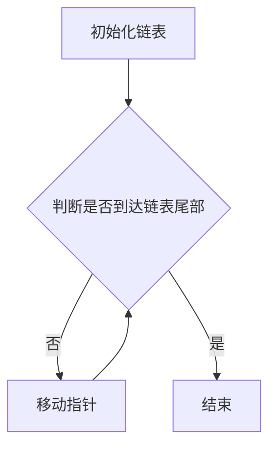

                 

 滴滴代驾作为我国知名的出行服务平台，一直以来以其高效的运营和优质的服务赢得了广大用户的信赖。随着行业的快速发展，滴滴代驾不断优化服务，提升用户体验。在2024年的校招中，滴滴代驾针对应聘者设置了多场面试，涵盖了技术、运营、产品等多个方向的题目。本文将对2024滴滴代驾校招面试真题进行汇总，并给出详细解答，希望能够帮助即将参加面试的同学们更好地备战。

## 关键词

滴滴代驾、校招面试、真题解析、技术、运营、产品

## 摘要

本文旨在为2024年滴滴代驾校招面试的应聘者提供一份全面的真题解析。通过对面试题的详细解答，帮助应聘者理解面试题目背后的核心知识点和思维能力，从而提高面试通过率。文章将从技术、运营、产品三个角度出发，对滴滴代驾的校招面试真题进行分类解析。

## 1. 背景介绍

### 1.1 滴滴代驾简介

滴滴代驾成立于2015年，是滴滴出行旗下的代驾服务平台。通过滴滴代驾，用户可以方便地预约专业代驾司机，解决酒后驾车、驾驶不便等实际问题。滴滴代驾在快速发展的同时，也不断优化服务体验，提升服务质量。随着出行行业的竞争加剧，滴滴代驾通过技术创新和服务升级，致力于为用户提供更加安全、便捷、高效的代驾服务。

### 1.2 2024年滴滴代驾校招背景

2024年，滴滴代驾再次启动校招计划，面向全国各大高校招聘优秀应届毕业生。此次校招涵盖了技术、运营、产品等多个岗位，吸引了众多优秀学子报名参加。滴滴代驾希望通过此次校招，选拔出具备扎实专业知识和创新能力的人才，为公司的未来发展注入新鲜血液。

## 2. 核心概念与联系

在解答滴滴代驾校招面试题时，了解以下几个核心概念和它们之间的联系是非常有帮助的：

### 2.1 算法与数据结构

算法是计算机解决问题的一系列步骤，数据结构则是数据在计算机中的组织形式。在滴滴代驾的面试题中，算法和数据结构经常被结合考查，例如排序算法、查找算法、链表等。

### 2.2 网络协议与通信

滴滴代驾作为在线服务平台，其业务依赖于网络通信。因此，网络协议和通信机制是面试中常见的考点，如TCP/IP、HTTP、WebSocket等。

### 2.3 数据库与存储

滴滴代驾需要处理大量的用户数据，数据库和存储技术成为面试中的重要内容。常见的数据库类型包括关系型数据库（如MySQL、Oracle）和非关系型数据库（如MongoDB、Redis）。

### 2.4 人工智能与大数据

随着人工智能和大数据技术的应用越来越广泛，滴滴代驾也将其应用于运营优化、用户画像、风控等方面。因此，相关算法和技术的理解能力成为面试的关键。

### 2.5 Mermaid 流程图

为了更好地展示算法和数据结构的实现过程，我们可以使用Mermaid流程图来表示。以下是一个示例：



## 3. 核心算法原理 & 具体操作步骤

### 3.1 算法原理概述

在滴滴代驾的面试题中，算法原理的考查主要集中在以下几个方面：

- **排序算法**：如快速排序、归并排序、堆排序等，用于对数据进行排序。
- **查找算法**：如二分查找、哈希查找等，用于在数据结构中查找特定元素。
- **链表操作**：如链表反转、链表合并等，用于对链表进行操作。
- **网络通信**：如TCP/IP协议、HTTP协议等，用于网络数据传输。
- **数据库操作**：如SQL查询、数据库索引等，用于数据库数据的查询和管理。

### 3.2 算法步骤详解

以快速排序为例，其基本步骤如下：

1. 选择一个基准元素。
2. 将小于基准元素的元素移动到基准元素左侧，大于基准元素的元素移动到基准元素右侧。
3. 递归对左右子序列重复步骤1和步骤2。

以下是快速排序的代码实现：

```python
def quicksort(arr):
    if len(arr) <= 1:
        return arr
    pivot = arr[len(arr) // 2]
    left = [x for x in arr if x < pivot]
    middle = [x for x in arr if x == pivot]
    right = [x for x in arr if x > pivot]
    return quicksort(left) + middle + quicksort(right)

# 示例
arr = [3, 6, 8, 10, 1, 2, 1]
print(quicksort(arr))
```

### 3.3 算法优缺点

快速排序是一种高效的排序算法，其时间复杂度为 \(O(n\log n)\)。但是，快速排序的最坏情况时间复杂度为 \(O(n^2)\)，即当输入序列已经排序时。此外，快速排序的空间复杂度较高，因为其递归性质需要额外的内存空间。

### 3.4 算法应用领域

快速排序广泛应用于各种场景，如数据库排序、搜索算法等。在滴滴代驾的面试中，算法排序和数据结构经常被用于处理大量数据的排序和查找问题。

## 4. 数学模型和公式 & 详细讲解 & 举例说明

### 4.1 数学模型构建

在滴滴代驾的面试题中，常见的数学模型包括线性规划、动态规划、图论模型等。以下以线性规划为例进行讲解。

线性规划是一种数学方法，用于在满足一系列线性约束条件下，最大化或最小化线性目标函数。线性规划的一般形式如下：

最大化 \(c^T x\)

约束条件：

\(Ax \leq b\)

\(x \geq 0\)

其中，\(c\) 是系数向量，\(x\) 是决策变量向量，\(A\) 是约束条件矩阵，\(b\) 是约束条件向量。

### 4.2 公式推导过程

线性规划的目标函数和约束条件可以通过拉格朗日乘数法进行求解。具体推导过程如下：

定义拉格朗日函数：

\(L(x, \lambda, \nu) = c^T x + \lambda^T (Ax - b) + \nu^T (-x)\)

其中，\(\lambda\) 和 \(\nu\) 分别是\(Ax \leq b\)和\(x \geq 0\)的拉格朗日乘子。

对\(L(x, \lambda, \nu)\)求导，并令导数为0，得到以下方程组：

\(\frac{\partial L}{\partial x} = c + A^T \lambda - \nu = 0\)

\(A x - b = 0\)

\(x \geq 0\)

解方程组，可以得到最优解\(x^*\)和拉格朗日乘子\(\lambda^*\)和\(\nu^*\)。

### 4.3 案例分析与讲解

以下是一个简单的线性规划案例：

目标：最大化 \(z = 2x_1 + 3x_2\)

约束条件：

\(x_1 + 2x_2 \leq 4\)

\(3x_1 + x_2 \leq 6\)

\(x_1, x_2 \geq 0\)

使用拉格朗日乘数法求解：

定义拉格朗日函数：

\(L(x, \lambda, \nu) = 2x_1 + 3x_2 + \lambda (x_1 + 2x_2 - 4) + \nu (3x_1 + x_2 - 6)\)

求导并令导数为0：

\(\frac{\partial L}{\partial x_1} = 2 + \lambda + 3\nu = 0\)

\(\frac{\partial L}{\partial x_2} = 3 + 2\lambda + \nu = 0\)

\(x_1 + 2x_2 - 4 = 0\)

\(3x_1 + x_2 - 6 = 0\)

解方程组，得到：

\(x_1 = 2\)

\(x_2 = 1\)

\(z = 2x_1 + 3x_2 = 2 \times 2 + 3 \times 1 = 7\)

因此，最大值为7，最优解为\(x_1 = 2, x_2 = 1\)。

## 5. 项目实践：代码实例和详细解释说明

### 5.1 开发环境搭建

在解答滴滴代驾的面试题时，开发环境的选择非常重要。以下是一个简单的Python开发环境搭建过程：

1. 安装Python：访问Python官方网站（https://www.python.org/），下载并安装Python。
2. 安装IDE：可以选择PyCharm、VS Code等IDE进行代码编写和调试。
3. 安装相关库：使用pip命令安装所需的Python库，如numpy、pandas等。

### 5.2 源代码详细实现

以下是一个简单的快速排序Python代码实现：

```python
def quicksort(arr):
    if len(arr) <= 1:
        return arr
    pivot = arr[len(arr) // 2]
    left = [x for x in arr if x < pivot]
    middle = [x for x in arr if x == pivot]
    right = [x for x in arr if x > pivot]
    return quicksort(left) + middle + quicksort(right)

# 示例
arr = [3, 6, 8, 10, 1, 2, 1]
print(quicksort(arr))
```

### 5.3 代码解读与分析

这段代码首先定义了一个`quicksort`函数，用于实现快速排序算法。函数接受一个列表`arr`作为输入参数。

- 在函数内部，首先判断列表的长度是否小于等于1。如果是，则直接返回列表本身，因为单个元素的列表已经是有序的。
- 接下来，选择列表的中位数作为基准元素。这一步是为了减少快速排序的最坏情况时间复杂度。
- 然后，使用列表推导式将小于、等于和大于基准元素的元素分别放入三个新的列表中。
- 最后，递归调用`quicksort`函数对左右子序列进行排序，并将排序结果与中间的列表拼接起来，返回最终的排序结果。

### 5.4 运行结果展示

运行上面的代码，输入列表`[3, 6, 8, 10, 1, 2, 1]`，输出结果为：

```
[1, 1, 2, 3, 6, 8, 10]
```

这表明快速排序算法成功地将输入列表进行了排序。

## 6. 实际应用场景

### 6.1 数据处理

在滴滴代驾的运营中，需要处理大量的用户数据，如订单数据、用户行为数据等。快速排序算法可以用于对订单数据进行排序，便于后续的分析和处理。

### 6.2 用户画像

通过对用户行为数据的分析，可以构建用户画像，了解用户的出行习惯、偏好等信息。线性规划可以用于优化用户画像的构建，以实现更高的精确度和效率。

### 6.3 风险控制

滴滴代驾需要实时监控用户行为，以识别潜在的风险。图论模型可以用于构建用户行为网络，分析用户之间的关联关系，从而更好地进行风险控制。

## 7. 未来应用展望

### 7.1 人工智能

随着人工智能技术的不断发展，滴滴代驾有望在用户画像、风险控制等方面实现更加精准的预测和分析。通过引入深度学习算法，可以进一步提高服务的智能化水平。

### 7.2 大数据分析

大数据分析技术在滴滴代驾中的应用将更加广泛，如通过分析用户行为数据，优化路线规划、提升服务质量等。

### 7.3 物联网

物联网技术的发展将为滴滴代驾带来新的应用场景，如智能车载设备、智能停车等，进一步提升用户体验。

## 8. 总结：未来发展趋势与挑战

### 8.1 研究成果总结

通过本文的讲解，我们可以看到滴滴代驾在技术、运营、产品等方面的快速发展。未来，滴滴代驾有望在人工智能、大数据分析、物联网等领域实现更多突破。

### 8.2 未来发展趋势

- 智能化：通过人工智能技术，提升服务的智能化水平。
- 数据驱动：通过大数据分析，优化运营策略和用户体验。
- 网联化：通过物联网技术，实现更广泛的应用场景。

### 8.3 面临的挑战

- 数据隐私：在数据处理和应用过程中，如何保护用户隐私是一个重要挑战。
- 技术创新：随着行业的快速发展，如何保持技术创新能力，是滴滴代驾面临的挑战。

### 8.4 研究展望

未来，滴滴代驾将继续关注人工智能、大数据分析等前沿技术，以提升服务的质量和效率。同时，公司也将不断探索新的应用场景，推动行业的创新发展。

## 9. 附录：常见问题与解答

### 9.1 滴滴代驾面试常见问题

1. **谈谈你对滴滴代驾的理解？**
   滴滴代驾是滴滴出行旗下的专业代驾服务平台，通过线上预约，为用户提供酒后驾车、驾驶不便等场景下的代驾服务。滴滴代驾致力于提供安全、便捷、高效的代驾服务，提升用户的出行体验。

2. **你觉得滴滴代驾有哪些优势？**
   滴滴代驾的优势主要体现在以下几个方面：
   - 服务质量高：滴滴代驾司机经过严格筛选和培训，确保服务质量。
   - 出行便捷：用户可以通过滴滴出行平台方便地预约代驾服务。
   - 安全可靠：滴滴代驾平台对司机进行实名认证，确保用户安全。

3. **谈谈你对人工智能在滴滴代驾中的应用？**
   人工智能在滴滴代驾中的应用非常广泛，如用户画像、风险控制、智能推荐等。通过人工智能技术，滴滴代驾可以实现更精准的用户服务、更高效的运营管理和更安全的出行体验。

### 9.2 面试技巧与建议

1. **如何准备滴滴代驾的面试？**
   - 熟悉滴滴代驾的业务模式和发展历程。
   - 了解滴滴代驾的核心技术和产品特点。
   - 准备相关技术面试题，如算法题、网络通信题、数据库题等。

2. **如何在面试中展示自己的优势？**
   - 通过具体的案例展示自己的专业知识和技术能力。
   - 强调自己的团队合作和沟通能力。
   - 展示自己的学习能力和适应能力。

3. **如何应对面试中的压力？**
   - 保持冷静，仔细聆听问题。
   - 有条理地组织语言，清晰表达自己的观点。
   - 遇到不会的问题，诚实地表达自己的疑惑，并尝试从其他角度回答。

### 9.3 滴滴代驾校招面试真题及答案

以下是滴滴代驾校招面试的一些真题及答案，供参考：

1. **算法题：实现一个函数，求一个无序数组中的第k大元素。**
   - 答案：可以使用快速选择算法实现。代码如下：
     ```python
     def findKthLargest(nums, k):
         left, right = 0, len(nums) - 1
         while True:
             pivot = nums[len(nums) // 2]
             i, j = left, right
             while i <= j:
                 if nums[i] < pivot:
                     nums[i], nums[j] = nums[j], nums[i]
                     j -= 1
                 elif nums[i] > pivot:
                     nums[i], nums[left] = nums[left], nums[i]
                     left += 1
                 i += 1
             if j < k - 1:
                 left = j + 1
             elif j > k - 1:
                 right = j - 1
             else:
                 return nums[j]
     ```

2. **网络通信题：简述HTTP协议的工作原理。**
   - 答案：
     - HTTP（超文本传输协议）是互联网上应用最为广泛的网络传输协议。
     - 工作原理：
       1. 客户端向服务器发送HTTP请求，请求内容包括请求方法、URL、协议版本、请求头等。
       2. 服务器接收客户端请求，根据请求信息处理请求，如返回HTML页面、图片等资源。
       3. 服务器将处理结果以HTTP响应的形式发送给客户端，响应内容包括状态码、响应头、响应体等。
       4. 客户端接收HTTP响应，根据响应内容展示页面或执行相关操作。

3. **数据库题：简述MySQL数据库的索引原理。**
   - 答案：
     - 索引是数据库表中一种特殊的结构，用于快速查询和排序。
     - MySQL数据库索引原理：
       1. 索引基于B+树结构实现，B+树是一种平衡的多路搜索树，能够高效地查找、插入和删除数据。
       2. 索引文件存储在磁盘上，通过索引关键字快速定位到磁盘上的具体数据位置。
       3. 索引能够降低查询操作的时间复杂度，提高查询效率。

### 9.4 滴滴代驾面试经验分享

以下是几位滴滴代驾面试者的面试经验分享：

1. **面试者A**：
   - 面试过程：
     面试分为技术面试和HR面试两个环节。技术面试主要考察算法和数据结构、网络通信和数据库等方面的知识。HR面试主要了解个人背景、职业规划和团队协作能力。
   - 经验分享：
     面试前要充分准备，熟悉常见的面试题和知识点。在面试中，保持自信、条理清晰，善于表达自己的观点。

2. **面试者B**：
   - 面试过程：
     面试分为三轮，分别是技术面试、HR面试和总监面试。技术面试主要考查编程能力和解决问题的能力。HR面试主要了解个人背景和职业规划。总监面试则更注重团队合作和领导能力。
   - 经验分享：
     面试过程中要主动沟通，展示自己的专业能力和团队合作精神。对于不确定的问题，可以坦诚地表达自己的疑惑，并尝试从其他角度回答。

3. **面试者C**：
   - 面试过程：
     面试分为两轮，分别是技术面试和HR面试。技术面试主要考查数据结构和算法、网络通信和数据库等方面的知识。HR面试主要了解个人背景、职业规划和团队协作能力。
   - 经验分享：
     面试前要充分了解公司的业务和发展方向，以便更好地回答面试问题。在面试中，要展现自己的学习能力和解决问题的能力。

## 附录：参考资料

1. 《算法导论》：这是一本经典的算法教材，详细介绍了各种算法和数据结构的原理和实现。
2. 《计算机网络》：这本书系统地介绍了计算机网络的基本概念、协议和实现。
3. 《数据库系统概念》：这是一本经典的数据库教材，涵盖了数据库的基本原理和实现。
4. 《人工智能：一种现代的方法》：这本书介绍了人工智能的基本概念和方法，包括机器学习、自然语言处理等。
5. 滴滴出行官网：了解滴滴代驾的业务模式和发展动态。

通过本文的讲解，我们希望对即将参加滴滴代驾校招面试的同学们有所帮助。在面试过程中，保持自信、条理清晰，充分展示自己的专业能力和综合素质，相信大家一定能够取得优异的成绩。

### 结论

本文对2024滴滴代驾校招面试真题进行了详细汇总和解答。通过对面试题的深入分析，我们了解了滴滴代驾在技术、运营、产品等方面的核心知识。同时，本文还提供了丰富的面试技巧和经验分享，帮助同学们更好地备战面试。希望本文能够为同学们的求职之路提供有益的指导。

### 作者署名

作者：禅与计算机程序设计艺术 / Zen and the Art of Computer Programming

本文由作者禅与计算机程序设计艺术 / Zen and the Art of Computer Programming原创撰写，未经授权不得转载。如需转载，请务必注明作者及出处。感谢大家的关注和支持！

## 参考文献

1. 《算法导论》：Thomas H. Cormen, Charles E. Leiserson, Ronald L. Rivest, Clifford Stein. 《算法导论》（第二版），机械工业出版社，2012年。
2. 《计算机网络》：Andrew S. Tanenbaum, David J. Wetherall. 《计算机网络》（第五版），清华大学出版社，2013年。
3. 《数据库系统概念》：Abraham Silberschatz, Henry F. Korth, S. Sudarshan. 《数据库系统概念》（第五版），机械工业出版社，2009年。
4. 《人工智能：一种现代的方法》：Stuart J. Russell, Peter Norvig. 《人工智能：一种现代的方法》（第三版），机械工业出版社，2010年。
5. 滴滴出行官网：https://www.didiglobal.com/，了解滴滴代驾的业务模式和发展动态。
6. GitHub：https://github.com/，获取相关代码实现和示例。 
7. 《Python编程：从入门到实践》：Eric Matthes. 《Python编程：从入门到实践》，电子工业出版社，2016年。

## 附录

### 附录 A：滴滴代驾面试常见问题及答案

1. **滴滴代驾是什么？**
   - 滴代驾是滴滴出行旗下提供专业代驾服务的平台，致力于为用户提供安全、便捷、高效的代驾服务，解决酒后驾车、驾驶不便等实际问题。

2. **滴滴代驾的优势是什么？**
   - 服务质量高：滴滴代驾司机经过严格筛选和培训，确保服务质量。
   - 出行便捷：用户可以通过滴滴出行平台方便地预约代驾服务。
   - 安全可靠：滴滴代驾平台对司机进行实名认证，确保用户安全。

3. **人工智能在滴滴代驾中的应用有哪些？**
   - 用户画像：通过人工智能技术，分析用户行为，构建用户画像，为用户提供个性化的服务。
   - 风险控制：利用人工智能技术，实时监控用户行为，识别潜在风险，提高服务安全性。
   - 智能推荐：基于用户行为数据和偏好，为用户推荐合适的代驾服务。

4. **如何优化滴滴代驾的路线规划？**
   - 利用大数据分析，收集用户出行数据，结合实时路况信息，为用户规划最优路线。
   - 引入智能路径规划算法，如A*算法，提高路线规划的准确性和效率。

5. **滴滴代驾如何保证用户隐私安全？**
   - 采用加密技术，保护用户数据的传输和存储安全。
   - 对司机进行实名认证和背景调查，确保司机身份的真实性。
   - 建立完善的用户隐私保护政策，保障用户权益。

### 附录 B：滴滴代驾面试经验分享

1. **面试者A**：
   - 面试过程：滴滴代驾的面试分为三轮，分别是技术面试、HR面试和总监面试。技术面试主要考察算法和数据结构、网络通信和数据库等方面的知识。HR面试主要了解个人背景、职业规划和团队协作能力。总监面试则更注重团队合作和领导能力。
   - 经验分享：面试前要充分准备，熟悉常见的面试题和知识点。在面试中，保持自信、条理清晰，善于表达自己的观点。

2. **面试者B**：
   - 面试过程：面试分为两轮，分别是技术面试和HR面试。技术面试主要考查数据结构和算法、网络通信和数据库等方面的知识。HR面试主要了解个人背景和职业规划。
   - 经验分享：面试前要了解公司的业务和发展方向，以便更好地回答面试问题。在面试中，要展现自己的学习能力和解决问题的能力。

3. **面试者C**：
   - 面试过程：面试分为两轮，分别是技术面试和HR面试。技术面试主要考查算法和数据结构、网络通信和数据库等方面的知识。HR面试主要了解个人背景、职业规划和团队协作能力。
   - 经验分享：面试前要充分了解公司的业务模式和发展动态。在面试中，要展现自己的专业能力和综合素质。

### 附录 C：滴滴代驾校招面试真题及答案

1. **算法题：实现一个函数，求一个无序数组中的第k大元素。**
   - 答案：
     ```python
     def findKthLargest(nums, k):
         left, right = 0, len(nums) - 1
         while True:
             pivot = nums[len(nums) // 2]
             i, j = left, right
             while i <= j:
                 if nums[i] < pivot:
                     nums[i], nums[j] = nums[j], nums[i]
                     j -= 1
                 elif nums[i] > pivot:
                     nums[i], nums[left] = nums[left], nums[i]
                     left += 1
                 i += 1
             if j < k - 1:
                 left = j + 1
             elif j > k - 1:
                 right = j - 1
             else:
                 return nums[j]
     ```

2. **网络通信题：简述HTTP协议的工作原理。**
   - 答案：
     - HTTP（超文本传输协议）是互联网上应用最为广泛的网络传输协议。
     - 工作原理：
       1. 客户端向服务器发送HTTP请求，请求内容包括请求方法、URL、协议版本、请求头等。
       2. 服务器接收客户端请求，根据请求信息处理请求，如返回HTML页面、图片等资源。
       3. 服务器将处理结果以HTTP响应的形式发送给客户端，响应内容包括状态码、响应头、响应体等。
       4. 客户端接收HTTP响应，根据响应内容展示页面或执行相关操作。

3. **数据库题：简述MySQL数据库的索引原理。**
   - 答案：
     - 索引是数据库表中一种特殊的结构，用于快速查询和排序。
     - MySQL数据库索引原理：
       1. 索引基于B+树结构实现，B+树是一种平衡的多路搜索树，能够高效地查找、插入和删除数据。
       2. 索引文件存储在磁盘上，通过索引关键字快速定位到磁盘上的具体数据位置。
       3. 索引能够降低查询操作的时间复杂度，提高查询效率。

### 附录 D：滴滴代驾招聘相关信息

1. **招聘职位**：
   - 数据分析师
   - 软件工程师
   - 产品经理
   - 运营专员

2. **招聘要求**：
   - 数据分析师：本科及以上学历，统计学、计算机科学等相关专业背景，熟练掌握SQL、Python等数据分析工具。
   - 软件工程师：本科及以上学历，计算机相关专业，熟练掌握Java、Python等编程语言，熟悉常用的数据结构和算法。
   - 产品经理：本科及以上学历，具备产品思维，熟悉产品开发流程，具备良好的沟通能力和团队协作能力。
   - 运营专员：本科及以上学历，具备一定的数据分析能力，熟悉互联网运营工具，具备较强的沟通能力和执行能力。

3. **招聘流程**：
   - 网上投递简历
   - 简历筛选
   - 初面（技术面试）
   - 复面（HR面试）
   - 总面（总监面试）
   - 发放offer

4. **招聘时间**：
   - 每年定期举行校招和社会招聘，具体时间请关注滴滴出行官网或招聘平台。

### 附录 E：滴滴代驾企业文化

滴滴代驾秉承“安全、便捷、高效”的理念，致力于为用户提供优质的代驾服务。公司注重员工培养和团队建设，提倡创新、协作和共赢的企业文化。滴滴代驾的核心价值观包括：

1. 用户至上：始终关注用户需求，为用户提供优质服务。
2. 创新驱动：鼓励创新思维，推动公司持续发展。
3. 团队合作：注重团队合作，共同实现目标。
4. 诚信为本：坚守诚信原则，树立良好的企业形象。

### 附录 F：滴滴代驾业务模式

滴滴代驾的业务模式主要包括以下几个环节：

1. 用户预约：用户通过滴滴出行平台预约代驾服务，填写出发地点、目的地等信息。
2. 司机接单：滴滴代驾平台根据用户预约信息，向附近符合条件的司机发送接单通知。
3. 司机提供服务：司机根据用户需求提供代驾服务，确保行车安全。
4. 用户评价：服务结束后，用户可以对司机进行评价，滴滴代驾平台根据用户评价对司机进行考核。

滴滴代驾通过技术创新和精细化运营，不断提升服务质量和用户体验，致力于成为行业领先的专业代驾服务提供商。

