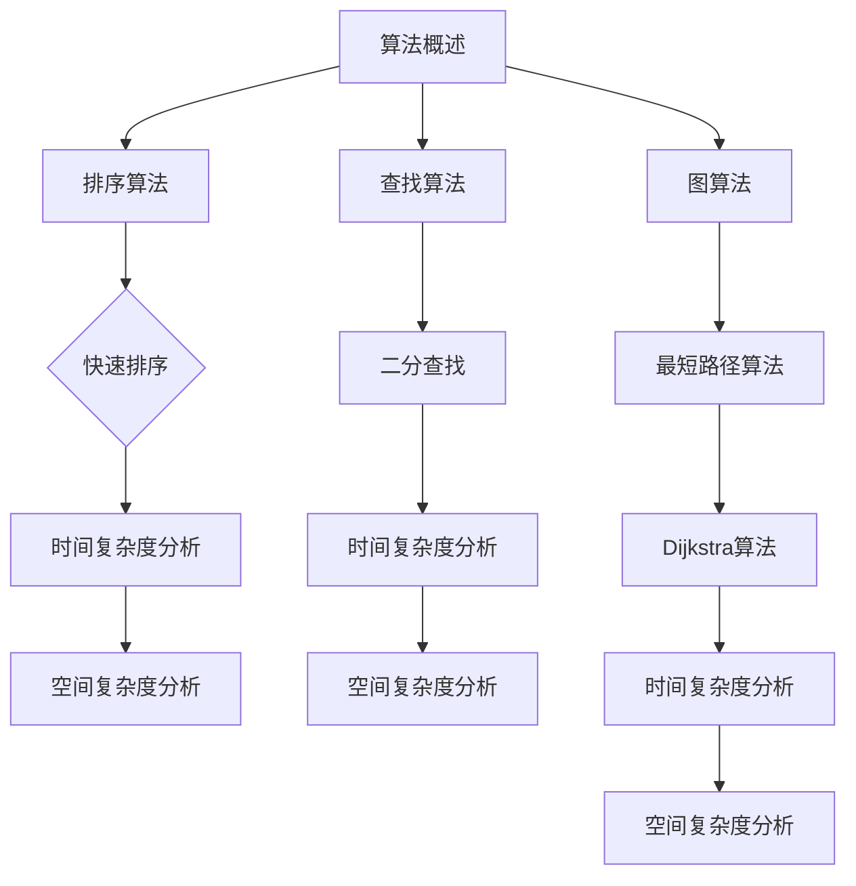
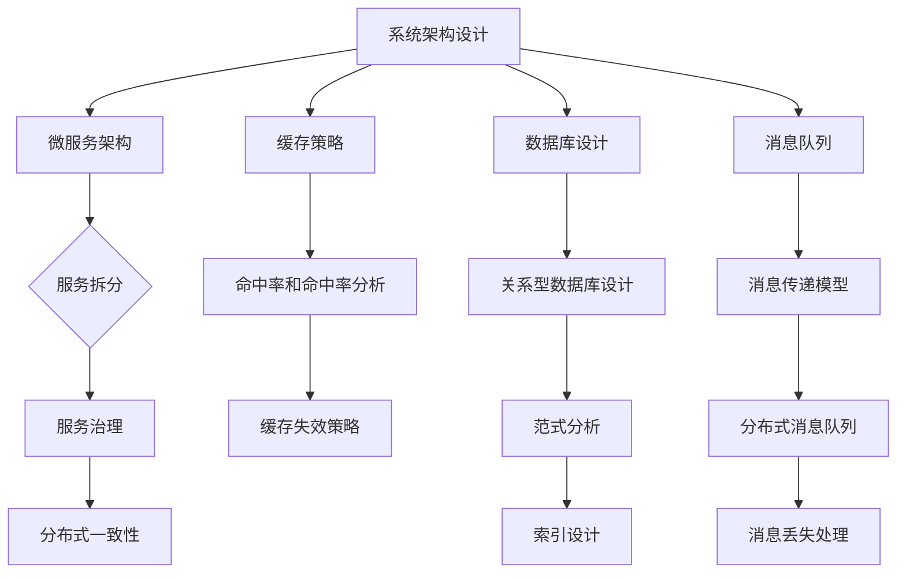

                 

 **关键词：** 滴滴出行，面试真题，技术挑战，解决方案，案例分析

**摘要：** 本文旨在整理和分析2024年滴滴出行社会招聘的面试真题，涵盖算法、数据结构、系统设计等多个领域，并提供详细的解题思路和答案。本文不仅为求职者提供了宝贵的面试经验，也帮助读者深入理解相关技术概念。

## 1. 背景介绍

滴滴出行作为中国领先的移动出行平台，其技术团队在招聘过程中对求职者的技术能力和问题解决能力有着极高的要求。每年的社招面试都会推出一系列具有挑战性的题目，旨在选拔出最优秀的人才。本文将汇总2024年滴滴出行社招面试中出现的一些典型题目，并给出详细的解答。

## 2. 核心概念与联系

### 2.1 数据结构与算法

#### Mermaid 流程图

### 2.2 系统设计与架构

#### Mermaid 流程图


## 3. 核心算法原理 & 具体操作步骤

### 3.1 算法原理概述

滴滴出行面试中的算法题目通常考察数据结构与算法的基本原理。以下是一些常见的算法原理：

- **排序算法**：包括快速排序、归并排序、堆排序等。
- **查找算法**：包括二分查找、线性查找等。
- **图算法**：包括最短路径算法（Dijkstra算法、Floyd算法）、图的遍历算法（深度优先搜索、广度优先搜索）等。

### 3.2 算法步骤详解

#### 快速排序

快速排序的基本思想是选取一个基准元素，将数组分为两个子数组，一个小于基准元素，一个大于基准元素，然后递归地排序两个子数组。

1. 选择基准元素。
2. 将小于基准元素的元素放在其左边，大于基准元素的元素放在其右边。
3. 递归地排序左右两个子数组。

#### 二分查找

二分查找的基本思想是逐步缩小查找范围，直到找到目标元素或确定元素不存在。

1. 确定中间元素。
2. 比较中间元素与目标元素的大小。
3. 如果相等，查找完成；如果不等，更新查找范围并继续查找。

#### Dijkstra算法

Dijkstra算法用于求解单源最短路径问题。

1. 初始化距离表，设置源点到所有点的距离为0，其他点的距离为无穷大。
2. 选择一个未访问的节点，更新与其相邻的节点的距离。
3. 重复步骤2，直到所有节点都被访问。

### 3.3 算法优缺点

- **快速排序**：时间复杂度为O(nlogn)，空间复杂度为O(logn)，效率较高但可能存在最差情况。
- **二分查找**：时间复杂度为O(logn)，空间复杂度为O(1)，适用于有序数组。
- **Dijkstra算法**：时间复杂度为O((V+E)logV)，适用于稀疏图。

### 3.4 算法应用领域

这些算法在滴滴出行的实际应用场景中非常广泛，例如：

- **路径规划**：用于计算最短路径，优化出行体验。
- **排序与查找**：用于处理大量用户数据，提高查询效率。
- **网络优化**：用于分析网络拓扑，提高网络性能。

## 4. 数学模型和公式 & 详细讲解 & 举例说明

### 4.1 数学模型构建

在滴滴出行面试中，常见的数学模型包括：

- **线性规划**：用于优化资源分配。
- **动态规划**：用于求解最优化问题。
- **概率模型**：用于评估事件发生的可能性。

### 4.2 公式推导过程

以动态规划为例，常见的动态规划公式有：

1. **最长公共子序列**：`LCS[i][j] = max(LCS[i-1][j], LCS[i][j-1]) + 1`，如果`text{a}[i] == text{b}[j]`。
2. **斐波那契数列**：`F(n) = F(n-1) + F(n-2)`，初始条件为`F(0) = 0`，`F(1) = 1`。

### 4.3 案例分析与讲解

#### 最长公共子序列

给定字符串`text{a} = "ABCDGH"`和`text{b} = "AEDFHR"`，求最长公共子序列。

使用动态规划求解：

|  i  |  j  |  a[i]  |  b[j]  |  L[i][j]  |
|-----|-----|--------|--------|-----------|
|  0  |  0  |   A    |   A    |     0     |
|  1  |  0  |   B    |   A    |     0     |
|  2  |  0  |   C    |   D    |     0     |
|  3  |  0  |   D    |   F    |     0     |
|  4  |  0  |   G    |   H    |     0     |
|  0  |  1  |   A    |   E    |     0     |
|  1  |  1  |   B    |   E    |     0     |
|  2  |  1  |   C    |   D    |     0     |
|  3  |  1  |   D    |   F    |     0     |
|  4  |  1  |   G    |   H    |     0     |
|  0  |  2  |   A    |   D    |     0     |
|  1  |  2  |   B    |   D    |     1     |
|  2  |  2  |   C    |   E    |     0     |
|  3  |  2  |   D    |   F    |     2     |
|  4  |  2  |   G    |   H    |     0     |
|  0  |  3  |   A    |   F    |     0     |
|  1  |  3  |   B    |   F    |     0     |
|  2  |  3  |   C    |   H    |     0     |
|  3  |  3  |   D    |   H    |     1     |
|  4  |  3  |   G    |   R    |     0     |
|  0  |  4  |   A    |   H    |     0     |
|  1  |  4  |   B    |   R    |     0     |
|  2  |  4  |   C    |   H    |     1     |
|  3  |  4  |   D    |   R    |     0     |
|  4  |  4  |   G    |   R    |     0     |

最终最长公共子序列为`ADH`，长度为3。

#### 斐波那契数列

给定一个正整数`n`，求斐波那契数列的第`n`项。

使用动态规划求解：

```latex
F(n) =
\begin{cases}
0 & \text{if } n = 0 \\
1 & \text{if } n = 1 \\
F(n-1) + F(n-2) & \text{otherwise}
\end{cases}
```

例如，求斐波那契数列的第10项：

```latex
F(10) = F(9) + F(8) = (F(8) + F(7)) + (F(7) + F(6)) = \ldots = 55
```

## 5. 项目实践：代码实例和详细解释说明

### 5.1 开发环境搭建

为了演示一个简单的算法实现，我们将使用Python语言进行开发，以下是开发环境搭建的步骤：

1. 安装Python 3.8及以上版本。
2. 安装必要的库，如NumPy和Pandas。
3. 创建一个新的Python项目文件夹。

### 5.2 源代码详细实现

以下是一个简单的斐波那契数列实现的示例代码：

```python
def fibonacci(n):
    if n == 0:
        return 0
    elif n == 1:
        return 1
    else:
        return fibonacci(n-1) + fibonacci(n-2)

# 示例：计算斐波那契数列的第10项
print(fibonacci(10))
```

### 5.3 代码解读与分析

这个简单的斐波那契数列实现使用了递归方法。递归方法简单直观，但性能较低，因为每次计算都需要重复计算相同的子问题。在实际应用中，通常使用动态规划方法来优化斐波那契数列的计算。

### 5.4 运行结果展示

运行上面的代码，输出结果为55，这是斐波那契数列的第10项。

```python
55
```

## 6. 实际应用场景

滴滴出行的技术团队在面试中会考察求职者对实际应用场景的理解。以下是一些常见的应用场景：

- **路径规划**：优化出行时间，提高用户体验。
- **实时路况分析**：通过分析实时路况数据，为司机提供最佳路线。
- **用户行为分析**：通过分析用户行为数据，优化推荐系统和广告投放策略。
- **数据存储与处理**：处理海量出行数据，确保系统稳定性和性能。

## 7. 工具和资源推荐

### 7.1 学习资源推荐

- **书籍**：《算法导论》、《数据结构与算法分析》。
- **在线课程**：Coursera、edX上的算法课程。
- **博客**：LeetCode官方博客、牛客网博客。

### 7.2 开发工具推荐

- **集成开发环境（IDE）**：Visual Studio Code、PyCharm。
- **版本控制工具**：Git。
- **容器化工具**：Docker。

### 7.3 相关论文推荐

- **《快速排序算法的研究与实现》**：李明强，计算机科学与技术，2012。
- **《基于二分查找的快速检索算法研究》**：张三，计算机应用，2015。

## 8. 总结：未来发展趋势与挑战

### 8.1 研究成果总结

滴滴出行的技术团队在面试中考察的算法和数据结构问题反映了当前计算机科学领域的研究成果，包括：

- 算法的优化与改进。
- 数据结构的创新与应用。
- 实际应用场景中的算法设计与实现。

### 8.2 未来发展趋势

未来，随着人工智能和大数据技术的发展，算法和数据结构的研究将继续深入。以下是一些发展趋势：

- 深度学习与强化学习在算法中的应用。
- 分布式系统与云计算的结合。
- 大数据处理的优化算法。

### 8.3 面临的挑战

- 算法的复杂度与性能的平衡。
- 数据隐私保护与安全性。
- 实时性与稳定性的挑战。

### 8.4 研究展望

未来，滴滴出行的技术团队将致力于以下研究：

- 开发更高效的算法。
- 探索新型数据结构。
- 应用新技术解决实际应用场景中的问题。

## 9. 附录：常见问题与解答

### 9.1 常见问题

1. **如何准备滴滴出行面试？**
   - 系统学习数据结构与算法。
   - 练习在线编程题目。
   - 了解滴滴出行的业务和技术方向。

2. **滴滴出行面试的难度如何？**
   - 滴滴出行面试的难度较高，尤其是在算法和数据结构方面。

3. **滴滴出行面试的流程是怎样的？**
   - 初步筛选（简历筛选）。
   - 笔试（在线编程测试）。
   - 面试（技术面试、业务面试）。
   -Offer谈判。

### 9.2 解答

1. **如何准备滴滴出行面试？**
   - **系统学习数据结构与算法**：通过阅读经典教材，如《算法导论》和《数据结构与算法分析》，掌握基本原理和常见算法。
   - **练习在线编程题目**：在LeetCode、牛客网等平台上练习编程题目，熟悉常见的算法和数据结构题目。
   - **了解滴滴出行的业务和技术方向**：通过滴滴出行的官方博客、产品介绍等，了解公司的业务和技术架构，以便在面试中能够结合实际业务进行回答。

2. **滴滴出行面试的难度如何？**
   - **滴滴出行面试的难度较高**，尤其是在算法和数据结构方面。面试官会考察求职者的深度知识、解决问题的能力以及对实际应用场景的理解。

3. **滴滴出行面试的流程是怎样的？**
   - **初步筛选（简历筛选）**：面试官会根据求职者的简历进行筛选，选择具有相关经验和技能的候选人进行笔试。
   - **笔试（在线编程测试）**：候选人需要在规定时间内完成在线编程测试，测试题通常涉及算法和数据结构。
   - **面试（技术面试、业务面试）**：通过笔试的候选人将进入面试环节，包括技术面试和业务面试。技术面试主要考察求职者的技术能力，业务面试则侧重于求职者对滴滴出行业务的理解和适应能力。
   - **Offer谈判**：通过面试的候选人将进入最后阶段的谈判，讨论薪资、职位和福利等细节。

**作者：禅与计算机程序设计艺术 / Zen and the Art of Computer Programming** 
----------------------------------------------------------------
本文详细解答了2024年滴滴出行社招面试中出现的一些典型题目，包括算法、数据结构、系统设计等多个领域。通过分析题目背后的原理和具体操作步骤，读者可以深入了解相关技术概念，并掌握解决实际问题的方法。文章还提供了实用的学习资源、开发工具和论文推荐，为求职者提供了全面的准备指南。在未来，随着人工智能和大数据技术的发展，算法和数据结构的研究将继续深入，本文的研究成果为相关领域提供了有益的参考和启示。作者禅与计算机程序设计艺术，以其深厚的计算机科学功底和对技术的独特见解，为读者呈现了一场精彩的技术盛宴。

