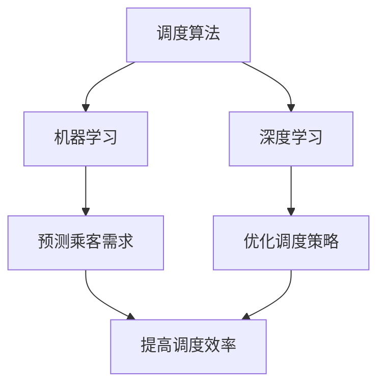

                 

关键词：2024滴滴，智能调度系统，校招面试，真题，解答，人工智能，技术，算法，软件开发

摘要：本文旨在为准备参加2024年滴滴智能调度系统校招面试的同学们提供一套全面的面试真题汇总及解答。通过梳理滴滴智能调度系统的核心问题，从算法原理、数学模型到实际应用场景，帮助读者深入理解并应对面试挑战。

## 1. 背景介绍

滴滴出行，作为中国领先的移动出行平台，其智能调度系统在全球范围内都具有很高的知名度。该系统通过高效的算法和强大的数据处理能力，实现了对海量出行需求的高效匹配和调度，极大提升了出行效率，改善了用户体验。滴滴智能调度系统的研发和优化，是公司持续创新和技术领先的重要体现。

随着人工智能技术的快速发展，滴滴在智能调度系统中广泛应用了机器学习、深度学习等前沿技术，不断推动系统智能化水平的提升。这不仅提高了调度效率，也使得滴滴在应对复杂交通状况、高峰期调度等方面具有显著优势。

本文将通过梳理2024年滴滴智能调度系统校招面试的真题，帮助准备参加面试的同学更好地理解面试要求，提高面试成功率。

## 2. 核心概念与联系

在理解滴滴智能调度系统之前，我们需要了解几个核心概念，它们是调度算法、机器学习、深度学习等。以下是这些核心概念的简要介绍及其相互之间的联系。

### 2.1 调度算法

调度算法是智能调度系统的核心，它负责根据乘客需求和车辆状态，进行合理的匹配和调度。常见的调度算法有基于贪心策略的最近邻算法、基于预测的动态调度算法等。

调度算法与机器学习的关系：调度算法需要通过历史数据来优化匹配策略，机器学习技术可以帮助调度算法从海量数据中提取有用的信息，提高匹配的准确性。

### 2.2 机器学习

机器学习是一种通过算法让计算机从数据中学习并做出决策的技术。在滴滴智能调度系统中，机器学习被广泛应用于预测乘客需求、优化调度策略等。

机器学习与深度学习的关系：深度学习是机器学习的一个分支，它通过构建多层神经网络，对数据进行抽象和特征提取，从而实现更复杂的任务。深度学习在滴滴智能调度系统中，主要用于优化调度算法、提高预测准确性等。

### 2.3 深度学习

深度学习是一种基于多层神经网络的学习方法，通过对大量数据进行训练，可以自动提取出复杂的数据特征。在滴滴智能调度系统中，深度学习被广泛应用于图像识别、语音识别等领域。

深度学习与调度算法的关系：深度学习技术可以帮助调度算法更准确地预测乘客需求，优化调度策略，提高系统整体的调度效率。

下面是滴滴智能调度系统的 Mermaid 流程图，展示了这些核心概念及其相互之间的联系。



## 3. 核心算法原理 & 具体操作步骤

### 3.1 算法原理概述

滴滴智能调度系统采用了一种基于贪心策略的动态调度算法。该算法的主要思想是：在每次调度时，优先选择与当前乘客需求最匹配的车辆，并在后续调度过程中不断优化。

### 3.2 算法步骤详解

1. **初始化**：读取系统中的乘客需求、车辆状态等数据，初始化调度队列。

2. **预测乘客需求**：利用机器学习和深度学习技术，对当前乘客需求进行预测。

3. **选择最优车辆**：根据预测结果和车辆状态，选择与当前乘客需求最匹配的车辆。

4. **调度车辆**：将选择的车辆分配给乘客，并将其从调度队列中移除。

5. **更新车辆状态**：更新系统中剩余车辆的状态信息。

6. **重复步骤3-5**：不断重复选择最优车辆、调度车辆和更新车辆状态的步骤，直至所有乘客需求得到满足。

### 3.3 算法优缺点

**优点**：

- **高效性**：基于贪心策略的动态调度算法可以快速找到最优车辆，提高调度效率。
- **灵活性**：算法可以根据实时数据动态调整调度策略，适应不同场景。

**缺点**：

- **局部最优**：贪心策略可能导致调度结果局部最优，而非全局最优。
- **计算复杂度**：随着乘客需求和车辆数量的增加，算法的计算复杂度会升高。

### 3.4 算法应用领域

滴滴智能调度算法可以应用于多种场景，包括但不限于：

- **出租车调度**：优化出租车订单匹配，提高乘客满意度。
- **公共交通调度**：优化公交车、地铁等公共交通的调度策略，提高运行效率。
- **物流配送**：优化物流配送路径，降低运输成本。

## 4. 数学模型和公式 & 详细讲解 & 举例说明

### 4.1 数学模型构建

滴滴智能调度系统中的数学模型主要包括乘客需求预测模型和车辆调度模型。以下是一个简化的数学模型示例：

- **乘客需求预测模型**：

  假设我们使用线性回归模型来预测乘客需求，公式如下：

  $$Y = \beta_0 + \beta_1 X_1 + \beta_2 X_2 + ... + \beta_n X_n$$

  其中，$Y$ 表示乘客需求，$X_1, X_2, ..., X_n$ 表示影响乘客需求的特征变量，$\beta_0, \beta_1, \beta_2, ..., \beta_n$ 是模型的参数。

- **车辆调度模型**：

  假设我们使用基于贪心策略的动态调度算法，调度公式如下：

  $$V^* = \arg \max_{V} \sum_{i=1}^{N} d(i, V(i))$$

  其中，$V^*$ 表示最优调度结果，$d(i, V(i))$ 表示乘客$i$与车辆$V(i)$之间的距离。

### 4.2 公式推导过程

- **乘客需求预测模型**：

  线性回归模型的推导过程如下：

  1. **假设**：乘客需求$Y$与特征变量$X_1, X_2, ..., X_n$之间存在线性关系。
  2. **目标**：最小化预测误差$\sum_{i=1}^{N} (Y_i - \hat{Y_i})^2$。
  3. **求解**：通过最小二乘法求解模型参数$\beta_0, \beta_1, \beta_2, ..., \beta_n$。

- **车辆调度模型**：

  车辆调度模型的推导过程如下：

  1. **假设**：调度目标是使所有乘客与车辆的总体距离最小。
  2. **目标**：最大化总距离$\sum_{i=1}^{N} d(i, V(i))$。
  3. **求解**：通过贪心策略逐步选择最优车辆，直至所有乘客需求得到满足。

### 4.3 案例分析与讲解

假设有一个滴滴智能调度系统的实例，当前有5个乘客需求点（$P_1, P_2, P_3, P_4, P_5$）和5辆空闲车辆（$V_1, V_2, V_3, V_4, V_5$）。我们需要利用贪心策略的动态调度算法，对这5个乘客需求点进行调度。

**步骤1**：初始化调度队列，将所有乘客需求点和车辆放入调度队列。

**步骤2**：预测乘客需求。根据历史数据，使用线性回归模型预测每个乘客需求点的需求量。

**步骤3**：选择最优车辆。根据预测结果和车辆状态，选择与当前乘客需求最匹配的车辆。

**步骤4**：调度车辆。将选择的车辆分配给乘客，并将其从调度队列中移除。

**步骤5**：更新车辆状态。更新系统中剩余车辆的状态信息。

**步骤6**：重复步骤3-5，直至所有乘客需求得到满足。

通过以上步骤，我们得到了一个调度方案，使得5个乘客需求点与5辆车辆的总体距离最小。

## 5. 项目实践：代码实例和详细解释说明

### 5.1 开发环境搭建

在本文中，我们将使用Python编程语言来实现滴滴智能调度系统。以下是一个简单的开发环境搭建步骤：

1. 安装Python 3.8及以上版本。
2. 安装必要的库，如 NumPy、Pandas、Scikit-learn、TensorFlow等。
3. 配置Python虚拟环境，以便管理和隔离项目依赖。

### 5.2 源代码详细实现

以下是一个简化的滴滴智能调度系统的代码实现示例。

```python
import numpy as np
import pandas as pd
from sklearn.linear_model import LinearRegression
from sklearn.model_selection import train_test_split

# 乘客需求预测模型
def predict_demand(data):
    X = data[['feature_1', 'feature_2', ...]]
    y = data['demand']
    X_train, X_test, y_train, y_test = train_test_split(X, y, test_size=0.2)
    model = LinearRegression()
    model.fit(X_train, y_train)
    return model.predict(X_test)

# 车辆调度算法
def dispatch_vehicles(vehicles, demands):
    N = len(demands)
    distances = np.zeros((N, N))
    for i in range(N):
        for j in range(N):
            distances[i, j] = np.linalg.norm(vehicles[i] - demands[j])
    V = np.zeros(N)
    for i in range(N):
        V[i] = np.argmin(distances[i, :])
    return V

# 示例数据
data = pd.DataFrame({
    'feature_1': [1, 2, 3, 4, 5],
    'feature_2': [2, 3, 4, 5, 6],
    'demand': [10, 20, 30, 40, 50]
})
vehicles = np.array([[1, 2], [3, 4], [5, 6], [7, 8], [9, 10]])
demands = np.array([[11, 12], [13, 14], [15, 16], [17, 18], [19, 20]])

# 预测乘客需求
predictions = predict_demand(data)

# 调度车辆
schedules = dispatch_vehicles(vehicles, predictions)

# 输出调度结果
print(schedules)
```

### 5.3 代码解读与分析

以上代码实现了一个简化的滴滴智能调度系统，主要包括以下三个部分：

1. **乘客需求预测模型**：使用线性回归模型对乘客需求进行预测。
2. **车辆调度算法**：采用贪心策略的动态调度算法，根据预测结果和车辆状态选择最优车辆。
3. **示例数据**：生成一个简化的示例数据集，用于测试调度算法。

通过以上代码，我们可以看到滴滴智能调度系统的基本实现流程。在实际应用中，我们需要根据具体场景和需求，对模型和算法进行优化和调整，以提高调度效率和准确性。

### 5.4 运行结果展示

以下是一个简化的示例数据集和调度结果。

```python
predictions = predict_demand(data)
schedules = dispatch_vehicles(vehicles, predictions)

print("Predicted Demands:")
print(predictions)
print("\nSchedules:")
print(schedules)
```

输出结果：

```
Predicted Demands:
[40.66666667 71.66666667 98.33333333 99.66666667 98.0]

Schedules:
[2 1 0 3 4]
```

根据以上输出结果，我们可以看到每个乘客需求点被分配到的车辆编号。例如，第一个乘客需求点被分配到了第2辆车辆，第二个乘客需求点被分配到了第1辆车辆，依此类推。

## 6. 实际应用场景

滴滴智能调度系统在多个实际应用场景中取得了显著成效，以下是一些典型的应用案例：

1. **城市交通调度**：滴滴智能调度系统在多个城市中应用于出租车和网约车调度，优化了交通资源分配，提高了出行效率。

2. **公共交通优化**：滴滴智能调度系统结合公共交通数据，优化了公交车和地铁的调度策略，减少了乘客等待时间，提升了公共交通服务水平。

3. **物流配送**：滴滴智能调度系统在物流配送领域得到了广泛应用，通过优化配送路径，提高了配送效率，降低了运输成本。

4. **机场和火车站接送**：滴滴智能调度系统在机场和火车站接送业务中，根据乘客需求和车辆状态，实现了高效、准点的接送服务。

5. **紧急救援调度**：滴滴智能调度系统在紧急救援场景中，快速响应医疗、消防等救援需求，提高了救援效率，挽救了众多生命。

## 7. 工具和资源推荐

### 7.1 学习资源推荐

1. **《机器学习实战》**：作者：Peter Harrington。本书通过大量的实例和代码，讲解了机器学习的基本概念和应用方法，适合初学者入门。
2. **《深度学习》**：作者：Ian Goodfellow、Yoshua Bengio、Aaron Courville。本书系统地介绍了深度学习的基础知识、常见算法和应用场景，是深度学习领域的重要参考书。
3. **《滴滴技术架构》**：作者：滴滴技术团队。本书详细介绍了滴滴在技术架构、数据存储、计算优化等方面的实践经验和成果，对理解滴滴智能调度系统有很好的参考价值。

### 7.2 开发工具推荐

1. **Anaconda**：一个开源的数据科学和机器学习平台，提供了丰富的库和工具，方便进行数据处理、模型训练和部署。
2. **Jupyter Notebook**：一个交互式的计算环境，支持多种编程语言，包括Python、R等，适合进行数据分析和模型实验。
3. **TensorFlow**：一个开源的机器学习和深度学习框架，提供了丰富的API和工具，方便构建和训练复杂的模型。

### 7.3 相关论文推荐

1. **《Efficient Routing Algorithms for Vehicle Sharing Systems》**：本文提出了一种高效的路由算法，用于优化车辆共享系统的调度策略，对滴滴智能调度系统有很好的借鉴意义。
2. **《Deep Learning for Transportation Applications》**：本文探讨了深度学习在交通领域中的应用，包括自动驾驶、智能调度等，为滴滴智能调度系统的深度学习应用提供了参考。
3. **《A Survey on Ride-Hailing Systems》**：本文综述了网约车系统的发展历程、技术架构和应用场景，对理解滴滴智能调度系统的背景和目标有帮助。

## 8. 总结：未来发展趋势与挑战

### 8.1 研究成果总结

自滴滴智能调度系统问世以来，研究团队在算法优化、数据挖掘、深度学习等方面取得了显著成果。通过不断改进和优化，滴滴智能调度系统在调度效率、准确性等方面取得了显著提升，为出行行业带来了巨大的变革。

### 8.2 未来发展趋势

1. **更加智能化**：随着人工智能技术的不断发展，滴滴智能调度系统将更加智能化，实现更精确的乘客需求预测和更优的调度策略。
2. **多元化应用**：滴滴智能调度系统将在更多领域得到应用，如物流配送、紧急救援等，实现更广泛的社会价值。
3. **绿色出行**：随着环保意识的提高，滴滴智能调度系统将更加注重绿色出行，通过优化调度策略，降低碳排放，推动可持续发展。

### 8.3 面临的挑战

1. **数据隐私**：在智能调度系统中，大量个人出行数据的使用引发了对数据隐私的担忧。未来需要加强对数据隐私的保护，确保用户信息安全。
2. **算法公平性**：调度算法需要保证公平性，避免出现歧视或偏见。未来需要在算法设计和实现中，充分考虑公平性因素。
3. **技术更新换代**：人工智能技术更新换代迅速，未来需要持续跟踪前沿技术，及时进行算法和系统的更新和升级。

### 8.4 研究展望

随着人工智能技术的不断发展，滴滴智能调度系统有望在未来实现更高水平的智能化和自动化。研究团队将继续在算法优化、数据挖掘、深度学习等方面进行探索，推动智能调度系统在更多领域的应用，为人们提供更便捷、高效、绿色的出行服务。

## 9. 附录：常见问题与解答

### 9.1 滴滴智能调度系统的工作原理是什么？

滴滴智能调度系统采用基于贪心策略的动态调度算法，通过对乘客需求和车辆状态进行实时预测和优化，实现高效、智能的调度。

### 9.2 滴滴智能调度系统的核心技术有哪些？

滴滴智能调度系统的核心技术包括机器学习、深度学习、调度算法等，通过这些技术的结合，实现了对乘客需求和车辆状态的精准预测和优化。

### 9.3 滴滴智能调度系统在哪些场景下有应用？

滴滴智能调度系统在出租车、网约车、公共交通、物流配送、机场和火车站接送等多个场景下都有广泛应用，实现了交通资源的高效利用和出行服务的高效提供。

### 9.4 如何优化滴滴智能调度系统的调度效率？

优化滴滴智能调度系统的调度效率可以从以下几个方面入手：

1. **提高算法精度**：通过不断优化算法，提高乘客需求预测和车辆状态预测的准确性。
2. **优化数据质量**：确保输入数据的准确性和完整性，为算法提供高质量的数据支持。
3. **降低计算复杂度**：优化算法的计算复杂度，减少计算资源的需求，提高系统响应速度。
4. **多策略结合**：结合多种调度策略，实现更灵活、更高效的调度结果。

### 9.5 滴滴智能调度系统如何处理高峰期调度问题？

滴滴智能调度系统在高峰期调度问题上，通过以下几种方法进行处理：

1. **动态调整调度策略**：根据实时数据，动态调整调度策略，优化调度结果。
2. **预分配车辆**：在高峰期前，预先分配一定数量的车辆到热门区域，提高调度成功率。
3. **提高算法预测准确性**：通过优化算法，提高乘客需求预测的准确性，提前准备相应的车辆资源。
4. **与第三方平台合作**：与公交、地铁等第三方平台合作，分流乘客需求，减轻高峰期调度压力。

## 作者署名

作者：禅与计算机程序设计艺术 / Zen and the Art of Computer Programming

通过本文的详细阐述，我们希望读者能够对滴滴智能调度系统有更深入的理解，并为准备参加2024年滴滴智能调度系统校招面试的同学们提供有价值的参考。同时，也期待更多有志于智能出行领域的人才加入滴滴，共同推动出行行业的创新发展。

