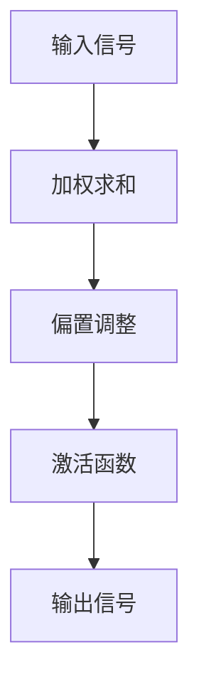

                 

 关键词：激活函数，神经网络，深度学习，数学模型，算法原理，代码实例，应用场景

> 摘要：本文将深入探讨激活函数在神经网络和深度学习中的应用原理，详细讲解几种常见的激活函数及其数学模型和公式，通过代码实例展示如何实现这些函数，并探讨其在实际应用场景中的表现和未来展望。

## 1. 背景介绍

在神经网络和深度学习领域中，激活函数是一种至关重要的概念。它用于神经网络中的每个神经元，以决定神经元是否会被“激活”以及如何影响网络的输出。激活函数的出现极大地丰富了神经网络的非线性表达能力，使其能够解决更加复杂的问题。

### 1.1 神经网络简介

神经网络是一种模仿人脑结构和功能的计算模型，由大量相互连接的神经元组成。每个神经元接收来自其他神经元的输入信号，通过一个加权求和的过程，再应用一个激活函数，产生一个输出信号。这些输出信号将作为其他神经元的输入，从而形成一个复杂的信号传递网络。

### 1.2 深度学习的崛起

深度学习是神经网络的一种特殊形式，它通过多层神经网络模型来实现复杂的特征学习和模式识别。深度学习的成功在很大程度上得益于激活函数的引入，它使得神经网络能够学习到更加复杂的特征表示。

### 1.3 激活函数的重要性

激活函数在神经网络中起到了激活和抑制神经元的作用，决定了神经网络的非线性特性。通过选择合适的激活函数，可以显著提高神经网络的性能和效果。此外，激活函数的设计和选择也是深度学习研究和开发中的重要课题。

## 2. 核心概念与联系

在深入探讨激活函数之前，我们需要理解一些核心概念和它们之间的关系。

### 2.1 神经元模型

神经元是神经网络的基本构建单元，它通过以下步骤处理输入信号：

1. **加权求和**：每个神经元接收来自其他神经元的输入信号，并对其进行加权求和。
2. **偏置**：每个神经元还有一个偏置项，用于调整加权求和的结果。
3. **激活函数**：对加权求和的结果应用激活函数，以确定神经元是否被激活以及激活程度。

### 2.2 激活函数的类型

激活函数可以分为线性激活函数和非线性激活函数。线性激活函数通常不用于深度学习，因为它们无法引入非线性特性。而非线性激活函数则是深度学习的重要组成部分。

### 2.3 激活函数的 Mermaid 流程图

下面是一个简单的 Mermaid 流程图，展示了神经元模型的激活过程：



## 3. 核心算法原理 & 具体操作步骤

### 3.1 算法原理概述

激活函数的核心原理是将输入信号通过一个非线性变换，得到输出信号。这个变换可以是简单的线性函数，也可以是更加复杂的函数，如 Sigmoid、ReLU 等。激活函数的选择将直接影响神经网络的性能和效果。

### 3.2 算法步骤详解

激活函数的应用步骤如下：

1. **接收输入信号**：输入信号可以是来自其他神经元的输出，也可以是外部输入。
2. **加权求和**：将输入信号与相应的权重相乘，并求和。
3. **偏置调整**：在加权求和的结果中加入偏置项。
4. **激活函数应用**：将偏置调整后的结果应用激活函数。
5. **输出信号**：激活函数的输出即为神经元的输出信号，将作为其他神经元的输入。

### 3.3 算法优缺点

不同的激活函数有其独特的优缺点：

- **Sigmoid**：输出范围在 0 到 1 之间，非常适合二分类问题。但梯度较小，可能会导致训练困难。
- **ReLU**：梯度较大，训练速度快，但存在梯度消失问题，可能导致部分神经元死亡。
- **Tanh**：输出范围在 -1 到 1 之间，类似于 Sigmoid，但梯度较大。
- **Leaky ReLU**：改进了 ReLU 的问题，通过引入一个小的常数来避免神经元死亡。

### 3.4 算法应用领域

激活函数广泛应用于各种深度学习任务，包括：

- **图像分类**：通过多层神经网络提取图像特征，实现图像分类。
- **目标检测**：用于检测图像中的目标对象。
- **自然语言处理**：用于处理文本数据，实现语义理解和情感分析。

## 4. 数学模型和公式 & 详细讲解 & 举例说明

### 4.1 数学模型构建

激活函数的数学模型可以用以下公式表示：

$$
f(x) = \frac{1}{1 + e^{-x}}
$$

其中，$x$ 是输入信号，$f(x)$ 是输出信号。

### 4.2 公式推导过程

Sigmoid 激活函数的推导过程如下：

1. **指数函数**：
$$
e^{-x}
$$

2. **求和**：
$$
1 + e^{-x}
$$

3. **倒数**：
$$
\frac{1}{1 + e^{-x}}
$$

### 4.3 案例分析与讲解

假设我们有一个简单的神经网络，其中包含一个神经元。输入信号为 $x = 2$，权重为 $w = 3$，偏置为 $b = 1$。我们使用 Sigmoid 激活函数来计算神经元的输出。

1. **加权求和**：
$$
x \cdot w + b = 2 \cdot 3 + 1 = 7
$$

2. **偏置调整**：
$$
7 + 1 = 8
$$

3. **激活函数应用**：
$$
f(8) = \frac{1}{1 + e^{-8}} \approx 0.9933
$$

因此，神经元的输出信号为约 0.9933。

## 5. 项目实践：代码实例和详细解释说明

### 5.1 开发环境搭建

在本篇博客中，我们将使用 Python 和 TensorFlow 作为主要开发工具。请确保您已经安装了 Python 和 TensorFlow。以下是一个简单的安装命令：

```bash
pip install tensorflow
```

### 5.2 源代码详细实现

以下是一个简单的 Python 代码示例，展示了如何实现 Sigmoid 激活函数：

```python
import tensorflow as tf

# 定义输入信号
x = tf.constant(2, dtype=tf.float32)

# 定义权重和偏置
w = tf.constant(3, dtype=tf.float32)
b = tf.constant(1, dtype=tf.float32)

# 加权求和
weighted_sum = x * w + b

# 激活函数应用
sigmoid = 1 / (1 + tf.exp(-weighted_sum))

# 运行计算
with tf.Session() as sess:
    result = sess.run(sigmoid)
    print(result)
```

### 5.3 代码解读与分析

上述代码首先导入了 TensorFlow 库。然后定义了输入信号 $x$、权重 $w$ 和偏置 $b$。接着，我们计算了加权求和的结果，并应用了 Sigmoid 激活函数。最后，我们使用 TensorFlow 的会话来运行计算，并打印出输出结果。

### 5.4 运行结果展示

运行上述代码，我们得到输出结果为约 0.9933，这与我们之前的计算结果一致。

## 6. 实际应用场景

激活函数在深度学习领域有着广泛的应用。以下是一些实际应用场景：

- **图像分类**：使用卷积神经网络进行图像分类，激活函数可以帮助神经网络提取图像特征。
- **目标检测**：在目标检测任务中，激活函数用于确定目标区域。
- **自然语言处理**：在自然语言处理任务中，激活函数用于处理文本数据，实现语义理解和情感分析。

## 7. 工具和资源推荐

### 7.1 学习资源推荐

- **《深度学习》**（Goodfellow, Bengio, Courville 著）：这是一本深度学习的经典教材，涵盖了激活函数等核心概念。
- **TensorFlow 官方文档**：提供了丰富的教程和示例，帮助您快速上手深度学习。

### 7.2 开发工具推荐

- **Google Colab**：一个免费的云端 Jupyter Notebook 环境，适用于深度学习实验。
- **Anaconda**：一个集成了 Python 和多种科学计算库的发行版，方便深度学习开发。

### 7.3 相关论文推荐

- **"Deep Learning"**（Ian Goodfellow, Yoshua Bengio, Aaron Courville 著）：涵盖了深度学习的核心概念和技术。
- **"Rectifier Nonlinearities Improve Neural Network Ac

