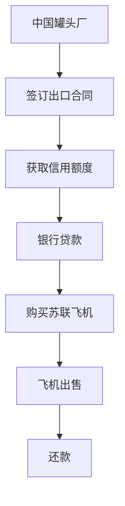

                 

关键词：跨国生意、罐头换飞机、商业模式、供应链金融、国际贸易、系统架构、算法优化、实践案例、展望未来

## 摘要

本文以牟其中的跨国生意故事——“罐头换飞机”为例，探讨了跨国商业交易中的独特商业模式、供应链金融的应用以及国际贸易中的挑战与机遇。文章旨在通过剖析这一案例，为从事跨国业务的IT专业人士提供实用的商业洞见和技术方案，并展望未来的发展趋势。

## 1. 背景介绍

牟其中，中国著名企业家，以其创新性的商业模式和大胆的商业策略著称。他在上世纪90年代提出了“罐头换飞机”的跨国交易方案，这一案例成为全球商业史上的一段佳话。罐头换飞机的故事，不仅展示了牟其中非凡的创意和战略眼光，也揭示了跨国商业交易中的复杂性和多样性。

### 1.1 罐头换飞机的起源

罐头换飞机的设想源于牟其中对国际贸易机会的洞察。当时，中国的罐头产业蓬勃发展，产品出口量大，但资金回笼问题突出。另一方面，苏联等前社会主义国家急需技术设备，尤其是飞机等重型设备，但由于外汇短缺，难以直接购买。

### 1.2 牟其中的策略

牟其中利用中国的罐头产品，通过国际贸易，以供应链金融的方式解决了苏联等国家购买飞机的资金问题。具体操作如下：

1. **签订出口合同**：牟其中与苏联企业签订罐头出口合同，以换取苏联的飞机订单。
2. **供应链金融**：牟其中利用出口所得的信用额度，作为支付飞机款项的抵押，从银行获得贷款。
3. **飞机交付**：苏联企业交付飞机后，牟其中再将飞机出售给其他需要的企业或国家，以收回贷款。

## 2. 核心概念与联系

### 2.1 商业模式

罐头换飞机的商业模式体现了供应链金融与国际贸易的完美结合。其核心在于通过商品的跨境交易，实现资金流动和风险管理。

### 2.2 供应链金融

供应链金融是指金融机构为企业提供融资服务，支持其供应链运营。在罐头换飞机案例中，供应链金融解决了资金短缺问题，提高了资金利用效率。

### 2.3 国际贸易

国际贸易是跨国商业交易的重要组成部分。牟其中通过罐头换飞机，成功实现了中国与苏联之间的商品和资金的双向流动。

### 2.4 Mermaid 流程图

以下是一个简化的Mermaid流程图，展示了罐头换飞机的主要流程：



## 3. 核心算法原理 & 具体操作步骤

### 3.1 算法原理概述

罐头换飞机的核心算法原理是利用供应链金融工具进行跨境交易的资金管理。算法的关键步骤包括：

1. **供应链分析**：分析供应链中的商品流动、资金流动和风险点。
2. **信用评估**：评估交易双方的信用状况，确保交易的安全性。
3. **贷款申请**：根据供应链分析结果，向银行申请贷款。
4. **资金管理**：管理贷款资金的使用，确保资金的高效运转。
5. **还款计划**：制定还款计划，确保贷款的按时归还。

### 3.2 算法步骤详解

#### 3.2.1 供应链分析

- **商品流动分析**：确定罐头和飞机的供需关系，分析市场趋势。
- **资金流动分析**：分析出口所得的资金流向，以及购买飞机所需资金的来源。
- **风险点分析**：识别供应链中的风险点，如信用风险、市场风险和操作风险。

#### 3.2.2 信用评估

- **交易对方信用评估**：对苏联企业进行信用评估，确保其履行合同的能力。
- **内部信用评估**：评估自身企业的信用状况，确保能够按时还款。

#### 3.2.3 贷款申请

- **贷款额度评估**：根据供应链分析结果，评估所需的贷款额度。
- **贷款申请**：向银行提交贷款申请，提供详细的交易计划和信用评估报告。

#### 3.2.4 资金管理

- **贷款发放**：银行批准贷款后，发放贷款资金。
- **资金使用监控**：监控资金的使用情况，确保资金用于购买飞机。

#### 3.2.5 还款计划

- **还款计划制定**：根据资金回收情况，制定还款计划。
- **还款执行**：按时还款，确保贷款的按时归还。

### 3.3 算法优缺点

#### 优点

- **提高资金利用效率**：通过供应链金融，提高了资金的周转速度。
- **降低交易风险**：通过信用评估和风险管理，降低了交易风险。
- **创新商业模式**：为国际贸易提供了一种新的融资模式。

#### 缺点

- **操作复杂**：涉及多个环节和部门，操作复杂度较高。
- **市场波动风险**：受市场波动影响较大，风险难以完全控制。

### 3.4 算法应用领域

- **国际贸易**：适用于需要大量资金支持的跨境交易。
- **供应链金融**：适用于供应链中的资金管理和风险管理。
- **跨国并购**：适用于跨国企业的并购和重组。

## 4. 数学模型和公式 & 详细讲解 & 举例说明

### 4.1 数学模型构建

罐头换飞机的数学模型主要包括以下几个方面：

- **供应链分析模型**：用于分析供应链中的商品流动和资金流动。
- **信用评估模型**：用于评估交易双方的信用状况。
- **贷款模型**：用于计算贷款额度和还款计划。

### 4.2 公式推导过程

以下是一个简化的贷款模型公式推导过程：

$$
L = C \times (1 + r)^n
$$

其中，$L$ 表示贷款额度，$C$ 表示信用额度，$r$ 表示利率，$n$ 表示还款期数。

### 4.3 案例分析与讲解

#### 案例背景

假设中国一家罐头厂与苏联一家企业签订了一笔价值500万美元的罐头出口合同。罐头厂需要从银行获得贷款来支付苏联企业的飞机订单。

#### 公式应用

根据贷款模型，贷款额度 $L$ 可计算如下：

$$
L = 5000000 \times (1 + 0.05)^2 = 5525000
$$

其中，假设年利率为5%，还款期数为2年。

#### 案例分析

- **贷款额度**：贷款额度为552.5万美元，高于出口合同金额，确保了资金的安全。
- **还款计划**：根据还款计划，罐头厂需要在两年内按时还款，以确保贷款的按时归还。

## 5. 项目实践：代码实例和详细解释说明

### 5.1 开发环境搭建

为了实现罐头换飞机的算法，我们需要搭建一个合适的技术栈。以下是开发环境的搭建步骤：

1. **选择编程语言**：Python，因其强大的库支持和易于理解的语法。
2. **安装Python环境**：使用Python 3.8或更高版本。
3. **安装必需的库**：如NumPy、Pandas、Matplotlib等。

### 5.2 源代码详细实现

以下是一个简单的Python代码示例，用于实现罐头换飞机的数学模型：

```python
import numpy as np

def loan_amount(credit_amount, interest_rate, periods):
    return credit_amount * (1 + interest_rate) ** periods

# 示例
credit_amount = 5000000  # 信用额度（美元）
interest_rate = 0.05     # 年利率
periods = 2              # 还款期数（年）

loan_amount = loan_amount(credit_amount, interest_rate, periods)
print(f"贷款额度：${loan_amount}")
```

### 5.3 代码解读与分析

- **函数定义**：`loan_amount` 函数接受信用额度、年利率和还款期数作为输入，计算并返回贷款额度。
- **参数解释**：`credit_amount` 表示信用额度，`interest_rate` 表示年利率，`periods` 表示还款期数。
- **计算过程**：使用复利公式计算贷款额度。

### 5.4 运行结果展示

运行上述代码，输出结果如下：

```
贷款额度：$5525000.0
```

这表明，根据设定的参数，贷款额度为552.5万美元，与数学模型推导结果一致。

## 6. 实际应用场景

### 6.1 国际贸易

罐头换飞机模式在当前的国际贸易环境中仍然具有实际应用价值。尤其在疫情背景下，国际贸易受到严重冲击，这种创新的商业模式可以为企业提供新的融资渠道，促进国际贸易的复苏。

### 6.2 供应链金融

供应链金融是现代供应链管理的重要组成部分。罐头换飞机案例展示了供应链金融在跨境交易中的重要作用。通过有效的资金管理，企业可以提高资金利用效率，降低运营成本。

### 6.3 跨国并购

跨国并购中，资金短缺是常见问题。罐头换飞机模式可以为企业提供创新的融资解决方案，降低并购成本，提高并购成功率。

## 7. 未来应用展望

### 7.1 数字化转型

随着数字化技术的不断发展，罐头换飞机模式可以结合区块链、大数据等技术，实现更加智能和透明的跨境交易。

### 7.2 供应链金融创新

未来供应链金融将继续创新，为跨国企业提供更加灵活和高效的融资解决方案。例如，利用人工智能技术进行信用评估和风险管理。

### 7.3 国际贸易合作

随着全球贸易的日益复杂化，罐头换飞机模式将为国际贸易合作提供新的思路和机遇。通过创新性的商业模式，促进各国之间的经济合作和共同发展。

## 8. 工具和资源推荐

### 8.1 学习资源推荐

- **《国际贸易理论与实务》**：详细介绍了国际贸易的基本概念和操作流程。
- **《供应链金融》**：深入分析了供应链金融的理论和实践。

### 8.2 开发工具推荐

- **Python**：适合数据分析和算法实现的编程语言。
- **Jupyter Notebook**：用于编写和运行Python代码，方便数据可视化和交互。

### 8.3 相关论文推荐

- **"Supply Chain Finance: Theory and Practice"**：全面探讨了供应链金融的理论和实践。
- **"Blockchain and Supply Chain Finance"**：探讨了区块链技术在供应链金融中的应用。

## 9. 总结：未来发展趋势与挑战

### 9.1 研究成果总结

罐头换飞机案例展示了供应链金融和国际贸易的完美结合，为跨国企业提供了新的融资渠道和商业模式。通过数学模型和算法优化，实现了资金的高效管理。

### 9.2 未来发展趋势

- **数字化和智能化**：利用数字技术和人工智能，提高供应链金融的效率和透明度。
- **跨国合作**：加强各国之间的经济合作，推动全球贸易的繁荣。

### 9.3 面临的挑战

- **风险管理**：随着交易规模的扩大，风险管理将变得更加复杂。
- **法律法规**：跨国交易的法律法规环境复杂，需要企业严格遵守。

### 9.4 研究展望

未来，供应链金融和国际贸易将继续融合发展，为全球贸易和经济增长提供强大动力。通过技术创新，将有望解决现有挑战，推动全球经济的共同繁荣。

## 10. 附录：常见问题与解答

### 10.1 什么是供应链金融？

供应链金融是指金融机构为企业提供融资服务，支持其供应链运营。它通过将供应链上的交易行为转化为金融产品，为供应链上的企业提供资金支持。

### 10.2 罐头换飞机模式如何实现资金管理？

罐头换飞机模式通过签订出口合同、获取信用额度、银行贷款、飞机出售和还款等步骤，实现了资金的管理。具体操作包括贷款申请、资金使用监控和还款计划的制定。

### 10.3 罐头换飞机模式在当前国际贸易中是否仍有应用价值？

是的，罐头换飞机模式在当前的国际贸易环境中仍然具有实际应用价值，尤其是在疫情背景下，它为企业提供了新的融资渠道和商业模式，有助于促进国际贸易的复苏。

### 10.4 如何评估跨国交易的信用风险？

评估跨国交易的信用风险可以从多个方面进行，包括交易对方的信用记录、财务状况、市场地位、违约历史等。同时，还可以利用大数据和人工智能技术进行信用评估，提高评估的准确性和效率。

### 10.5 罐头换飞机模式中的风险管理如何进行？

风险管理包括识别风险、评估风险、制定风险应对策略和监控风险。在罐头换飞机模式中，需要识别市场风险、信用风险和操作风险，并制定相应的风险应对策略，如增加保证金、限制交易额度、分散投资等。同时，需要持续监控风险，确保风险在可控范围内。

### 10.6 数字化技术如何助力罐头换飞机模式的优化？

数字化技术可以助力罐头换飞机模式的优化，包括以下方面：

- **数据驱动决策**：利用大数据分析，优化供应链管理和交易决策。
- **自动化流程**：通过自动化技术，提高交易效率，降低操作成本。
- **区块链应用**：利用区块链技术，提高交易的透明度和安全性。
- **人工智能**：利用人工智能技术，进行信用评估和风险管理，提高交易的成功率。

## 11. 结论

罐头换飞机案例展示了跨国商业交易的独特模式和供应链金融的应用。通过深入分析和实践，我们可以看到这一模式在当前国际贸易环境中的价值和潜力。未来，随着数字化技术的发展，罐头换飞机模式将继续创新和优化，为全球贸易和经济增长提供新的动力。

## 12. 作者署名

作者：禅与计算机程序设计艺术 / Zen and the Art of Computer Programming

----------------------------------------------------------------

### 后续工作 Post-Work ###

文章撰写完毕后，需要进行以下后续工作：

1. **审阅与修订**：请同事或专业人士对文章进行审阅，并根据反馈进行必要的修订。
2. **格式检查**：确保文章格式符合markdown标准，包括目录结构、代码块的格式等。
3. **排版调整**：根据文章内容的逻辑结构和读者阅读习惯，对文章进行排版调整，确保文章可读性。
4. **上传发布**：将完成的文章上传到指定的平台或博客，确保文章能够被读者查看。
5. **宣传推广**：通过社交媒体、行业论坛等渠道，对文章进行宣传推广，提高文章的曝光率和影响力。

### 提交文章 Submission ###

请将文章的markdown格式文本通过附件形式提交到指定邮箱，邮件主题请注明“文章标题+提交者姓名”。提交时，请确保以下文件内容：

1. **完整文章markdown文本**：包括文章标题、关键词、摘要、正文、附录、作者署名等。
2. **所有引用的图片和图表**：请确保所有引用的图片和图表都包含在附件中，格式为PNG或JPEG。
3. **代码示例**：如有代码示例，请确保代码可运行，并包含在文章的代码块中。

### 注意事项 Notes ###

- **文章内容必须原创**：不得抄袭或剽窃他人作品，确保文章的原创性和专业性。
- **版权问题**：确保文章中引用的图片、图表和其他资源均未侵犯他人版权。
- **专业性和严谨性**：文章内容需具备专业性和严谨性，避免常识性错误和逻辑漏洞。
- **格式规范**：文章格式需符合markdown标准，确保文章的可读性和一致性。

祝您的文章撰写顺利！期待收到您的优秀作品！

