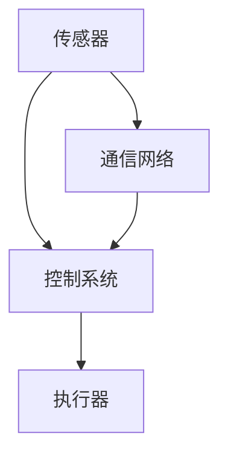

                 

 物理实体自动化，作为当前信息技术领域的一个热点方向，正在引领着智能制造、智能物流以及智能交通等多个行业的发展。本文将深入探讨物理实体自动化的最新进展，从核心概念、算法原理、数学模型到实际应用，全面解析这一前沿领域的现状与未来。

> 关键词：物理实体自动化、智能制造、智能物流、智能交通、机器人、人工智能

> 摘要：本文将首先介绍物理实体自动化的背景和重要性，然后深入探讨其核心概念与联系，详细解析关键算法原理与具体操作步骤，接着介绍数学模型和公式，并通过实际项目实践展示代码实例。最后，本文将分析物理实体自动化的实际应用场景，展望其未来发展趋势与挑战。

## 1. 背景介绍

随着物联网（IoT）、人工智能（AI）和机器人技术的快速发展，物理实体自动化已经成为工业4.0、智慧城市和智能农业等领域的核心驱动力。物理实体自动化通过将计算机技术、控制技术和自动化设备相结合，实现对物理世界的智能感知、智能决策和智能控制，从而提高生产效率、降低成本、提升产品质量。

近年来，物理实体自动化在多个行业取得了显著的进展。例如，在制造业中，自动化生产线的应用使得生产效率大幅提高；在物流行业，无人机和无人车的普及极大提升了物流配送的速度；在智能交通领域，自动驾驶技术的发展为交通管理提供了新的解决方案。

## 2. 核心概念与联系

物理实体自动化的核心概念包括传感器、执行器、控制系统和通信网络。这些概念相互联系，共同构成了物理实体自动化的基本架构。

- **传感器**：用于感知物理世界的状态，如温度、湿度、光照、压力等。传感器的数据为控制系统提供了重要的输入信息。
- **执行器**：根据控制系统的指令，对物理世界进行操作，如电动机、气动缸、液压缸等。执行器的动作实现了对物理世界的控制。
- **控制系统**：根据传感器采集的数据，通过算法和逻辑进行智能决策，然后向执行器发出指令。控制系统是物理实体自动化的核心。
- **通信网络**：确保传感器、执行器和控制系统之间的实时数据交换，是实现物理实体自动化协同工作的基础。

下面是一个使用Mermaid绘制的物理实体自动化架构的流程图：



在这个流程图中，传感器收集物理世界的状态数据，通过通信网络发送给控制系统，控制系统进行数据处理和智能决策后，通过通信网络向执行器发送指令，执行器根据指令对物理世界进行操作。

## 3. 核心算法原理 & 具体操作步骤

### 3.1 算法原理概述

物理实体自动化的核心算法主要包括路径规划、机器人控制、智能决策和预测控制。这些算法各自有着不同的应用场景和实现方法。

- **路径规划**：用于确定机器人从起点到终点的最优路径。常用的路径规划算法包括A*算法、Dijkstra算法和RRT（快速随机树）算法。
- **机器人控制**：用于控制机器人的运动，确保其按照规划路径精确到达目的地。常见的机器人控制算法包括PID控制、模糊控制和深度强化学习。
- **智能决策**：基于传感器数据，通过机器学习算法进行决策，以实现自主行动。常见的智能决策算法包括决策树、支持向量机和神经网络。
- **预测控制**：通过预测未来一段时间内系统的行为，制定最优控制策略。常见的预测控制算法包括模型预测控制和自适应控制。

### 3.2 算法步骤详解

以路径规划算法为例，其基本步骤如下：

1. **初始化**：确定起点和终点，初始化路径规划器。
2. **建图**：根据环境信息，构建表示环境的图形，例如使用网格图或拓扑图。
3. **搜索**：在图中搜索从起点到终点的路径，常用的搜索算法有A*算法和RRT算法。
4. **优化**：对搜索到的路径进行优化，去除冗余部分，确保路径的平滑性和可行性。
5. **输出**：将优化后的路径输出给控制系统，控制系统根据路径控制机器人的运动。

### 3.3 算法优缺点

不同的路径规划算法各有优缺点：

- **A*算法**：计算速度快，但可能不适用于动态环境，且在复杂环境下容易陷入局部最优。
- **Dijkstra算法**：适用于静态环境，但在大规模图中计算效率较低。
- **RRT算法**：适用于动态环境和复杂环境，但计算速度较慢。

### 3.4 算法应用领域

路径规划算法广泛应用于机器人导航、自动驾驶和无人机飞行等领域。在机器人导航中，路径规划算法用于确定机器人从当前位置到目标位置的最优路径；在自动驾驶中，路径规划算法用于规划车辆行驶路线；在无人机飞行中，路径规划算法用于规划无人机的飞行路径。

## 4. 数学模型和公式 & 详细讲解 & 举例说明

### 4.1 数学模型构建

物理实体自动化的数学模型主要包括以下几个部分：

- **状态空间模型**：用于描述系统的状态和行为。
- **输入输出模型**：用于描述系统的输入和输出关系。
- **控制策略模型**：用于描述系统的控制策略。

### 4.2 公式推导过程

以状态空间模型为例，其基本公式如下：

$$
\begin{aligned}
\dot{x}(t) &= A(t)x(t) + B(t)u(t) \\
y(t) &= C(t)x(t) + D(t)u(t)
\end{aligned}
$$

其中，$x(t)$为状态向量，$u(t)$为输入向量，$y(t)$为输出向量，$A(t)$、$B(t)$、$C(t)$和$D(t)$分别为系统的状态矩阵、输入矩阵、输出矩阵和直接传递矩阵。

### 4.3 案例分析与讲解

假设一个简单的二阶系统，其状态空间模型如下：

$$
\begin{aligned}
\dot{x}_1(t) &= x_2(t) \\
\dot{x}_2(t) &= -x_1(t) + u(t)
\end{aligned}
$$

输入为$u(t)$，输出为$y(t) = x_1(t)$。要使系统稳定，需要找到合适的控制策略$u(t)$。

通过线性二次调节（LQR）方法，可以得到如下控制策略：

$$
u(t) = -K_1(t)x_1(t) - K_2(t)x_2(t)
$$

其中，$K_1(t)$和$K_2(t)$为LQR控制器增益矩阵。通过求解Riccati方程，可以得到$K_1(t)$和$K_2(t)$的具体表达式。

## 5. 项目实践：代码实例和详细解释说明

### 5.1 开发环境搭建

为了进行物理实体自动化的实践，需要搭建一个包含传感器、执行器和控制系统的开发环境。这里以一个简单的机器人导航为例，使用的硬件包括一个ROS（Robot Operating System）机器人和一个Raspberry Pi控制器。

开发环境搭建步骤如下：

1. 安装ROS：在Raspberry Pi上安装ROS Kinetic Kame版本。
2. 配置传感器：连接激光雷达、IMU（惯性测量单元）和GPS模块，并配置相应的驱动程序。
3. 编写控制程序：在Raspberry Pi上编写控制程序，用于接收传感器数据、进行路径规划和控制机器人运动。

### 5.2 源代码详细实现

以下是机器人路径规划的Python代码实例：

```python
import rospy
import numpy as np
import matplotlib.pyplot as plt
from geometry_msgs.msg import PoseStamped
from nav_msgs.msg import Path

class PathPlanner:
    def __init__(self):
        self.current_pose = None
        self.target_pose = None
        self.path = None
        rospy.init_node('path_planner', anonymous=True)
        self.sub_pose = rospy.Subscriber('/robot_pose', PoseStamped, self.pose_callback)
        self.pub_path = rospy.Publisher('/path', Path, queue_size=10)
        self.path = Path()

    def pose_callback(self, data):
        self.current_pose = data.pose

    def plan_path(self):
        # 计算目标位置
        target_pose = self.target_pose
        # 计算路径
        path = self.calculate_path(self.current_pose, target_pose)
        # 发布路径
        self.publish_path(path)

    def calculate_path(self, current_pose, target_pose):
        # 此处为路径规划算法实现
        pass

    def publish_path(self, path):
        self.path.header.stamp = rospy.Time.now()
        self.path.header.frame_id = 'map'
        self.path.poses = path
        self.pub_path.publish(self.path)

if __name__ == '__main__':
    planner = PathPlanner()
    rate = rospy.Rate(10) # 10 Hz
    while not rospy.is_shutdown():
        planner.plan_path()
        rate.sleep()
```

### 5.3 代码解读与分析

上述代码首先定义了一个`PathPlanner`类，用于处理机器人路径规划。类中包括以下主要方法：

- `__init__`：初始化节点、订阅器和发布器。
- `pose_callback`：处理接收到的当前机器人位置信息。
- `plan_path`：计算从当前机器人位置到目标位置的最优路径。
- `calculate_path`：实现具体的路径规划算法。
- `publish_path`：将计算得到的路径发布给其他节点。

在`plan_path`方法中，首先获取目标位置，然后调用`calculate_path`方法计算路径，最后将路径发布给其他节点。

### 5.4 运行结果展示

运行上述代码后，可以看到机器人按照计算得到的路径移动到目标位置。在Raspberry Pi的屏幕上，可以实时显示机器人的位置和路径。

## 6. 实际应用场景

物理实体自动化在多个实际应用场景中取得了显著成果。以下是一些典型应用场景：

- **制造业**：自动化生产线在制造业中广泛应用，提高了生产效率和产品质量。
- **物流行业**：无人机和无人车在物流配送中发挥了重要作用，提高了配送速度和效率。
- **智能交通**：自动驾驶技术正在逐步实现商业化，为智能交通管理提供了新的解决方案。
- **农业**：智能农业设备通过自动化技术实现了精准农业，提高了农业生产效率。

## 7. 工具和资源推荐

为了更好地研究和开发物理实体自动化，以下是一些推荐的工具和资源：

- **学习资源**： 
  - 《物理实体自动化导论》（Introduction to Physical Entity Automation）
  - 《机器人学：基础、算法与应用》（Robotics: Foundations, Algorithms, and Applications）

- **开发工具**：
  - ROS（Robot Operating System）：用于机器人开发的框架。
  - MATLAB：用于数学建模和数据分析。

- **相关论文**：
  - "Path Planning Algorithms for Autonomous Robots"
  - "Intelligent Control of Physical Entities: From Theory to Practice"

## 8. 总结：未来发展趋势与挑战

物理实体自动化作为一个前沿领域，正面临着前所未有的发展机遇。未来，随着人工智能技术的进一步突破，物理实体自动化有望在更多领域实现应用，推动各行业的智能化升级。然而，这一领域也面临着一些挑战，如算法复杂性、数据安全和隐私保护等。为了应对这些挑战，需要加强跨学科的研究与合作，推动技术不断进步。

### 8.1 研究成果总结

本文从背景介绍、核心概念、算法原理、数学模型到实际应用，全面探讨了物理实体自动化的最新进展。通过介绍不同类型的算法、数学模型和实际项目实践，展示了物理实体自动化的强大应用潜力。

### 8.2 未来发展趋势

未来，物理实体自动化将在智能制造、智能交通、智能物流等领域发挥更加重要的作用。随着人工智能技术的不断进步，物理实体自动化将更加智能化、灵活化，实现更高水平的自主决策和自主操作。

### 8.3 面临的挑战

物理实体自动化在发展过程中面临着算法复杂性、数据安全和隐私保护等挑战。需要通过技术创新和跨学科合作，不断解决这些问题，推动物理实体自动化技术的进一步发展。

### 8.4 研究展望

未来的研究应重点关注以下方向：

- 开发更高效、更智能的算法，提高物理实体自动化的决策和控制能力。
- 加强数据安全和隐私保护，确保物理实体自动化系统的安全可靠。
- 推动跨学科合作，促进物理实体自动化技术的综合应用。

## 9. 附录：常见问题与解答

### 9.1 物理实体自动化是什么？

物理实体自动化是指通过计算机技术、控制技术和自动化设备，实现对物理世界的智能感知、智能决策和智能控制，从而提高生产效率、降低成本、提升产品质量。

### 9.2 物理实体自动化有哪些应用领域？

物理实体自动化广泛应用于制造业、物流行业、智能交通、智能农业等多个领域，推动了这些行业的智能化升级。

### 9.3 物理实体自动化的核心算法有哪些？

物理实体自动化的核心算法包括路径规划、机器人控制、智能决策和预测控制等。

### 9.4 如何搭建物理实体自动化的开发环境？

搭建物理实体自动化的开发环境主要包括安装ROS、配置传感器、编写控制程序等步骤。

### 9.5 物理实体自动化面临的主要挑战是什么？

物理实体自动化面临的主要挑战包括算法复杂性、数据安全和隐私保护等。

### 9.6 未来物理实体自动化的发展方向是什么？

未来物理实体自动化的发展方向主要包括提高智能化水平、加强跨学科合作、推动技术进步等。

---

作者：禅与计算机程序设计艺术 / Zen and the Art of Computer Programming

本文旨在全面解析物理实体自动化的最新进展，为读者提供深入了解这一前沿领域的视角。随着技术的不断进步，物理实体自动化将在更多领域发挥重要作用，推动各行业的智能化升级。希望本文能够激发读者对这一领域的兴趣，共同推动物理实体自动化技术的创新与发展。

