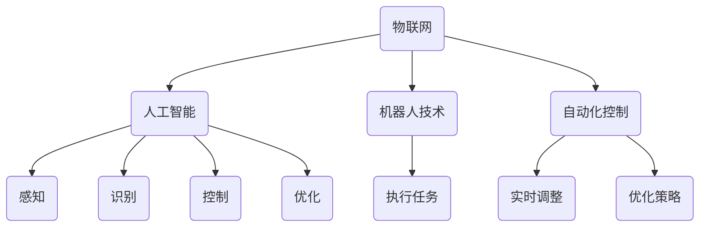

                 

关键词：物理实体自动化、物联网、智能硬件、人工智能、机器人技术、自动化控制、机器人学习、智能制造、未来趋势

> 摘要：本文旨在探讨物理实体自动化的未来趋势。通过分析物联网、人工智能、机器人技术等领域的发展，我们探讨了物理实体自动化的定义、现状、核心技术以及潜在的应用场景，并提出了未来发展趋势与面临的挑战。

## 1. 背景介绍

物理实体自动化是指通过计算机技术和人工智能算法，实现对物理世界的自动化控制和优化。随着物联网、人工智能、机器人技术等领域的迅速发展，物理实体自动化在工业、医疗、农业、交通等多个领域得到了广泛应用。例如，在工业领域，自动化生产线大大提高了生产效率和产品质量；在医疗领域，智能机器人可以进行手术操作，提高手术精度和安全性；在农业领域，智能灌溉系统和无人机可以实现对农田的精准管理。

物理实体自动化的背景可以从以下几个方面来理解：

- **物联网的兴起**：物联网技术使得各种物理实体能够互联互通，为自动化控制提供了数据基础。
- **人工智能的发展**：人工智能算法的进步，尤其是机器学习和深度学习技术，为自动化决策和优化提供了强大的工具。
- **机器人技术的突破**：机器人技术的快速发展，使得机器人能够执行更加复杂和精细的任务。
- **自动化控制理论的完善**：自动化控制理论的不断完善，为物理实体自动化提供了理论基础。

## 2. 核心概念与联系

### 2.1 物理实体自动化的定义

物理实体自动化是指利用计算机技术和人工智能算法，对物理实体进行自动检测、识别、控制和优化。它包括以下几个方面：

- **感知**：通过传感器等设备对物理实体进行感知，获取实时的环境信息和状态数据。
- **识别**：利用人工智能算法对感知到的数据进行处理，识别物理实体的特征和属性。
- **控制**：根据识别结果和预定的目标，通过控制算法对物理实体进行实时调整和优化。
- **优化**：利用优化算法，不断调整控制策略，以实现物理实体的最佳状态。

### 2.2 物理实体自动化的核心概念

物理实体自动化的核心概念包括物联网、人工智能、机器人技术、自动化控制等。这些概念之间存在着密切的联系：

- **物联网**：物联网是物理实体自动化的基础，它实现了物理实体之间的互联互通，为自动化控制提供了数据支持。
- **人工智能**：人工智能是物理实体自动化的核心，它通过机器学习和深度学习算法，实现了对物理实体的智能感知、识别和控制。
- **机器人技术**：机器人技术是物理实体自动化的执行工具，它使得物理实体能够执行复杂的任务和操作。
- **自动化控制**：自动化控制是物理实体自动化的核心，它通过控制算法，实现了对物理实体的实时调整和优化。

### 2.3 Mermaid 流程图

下面是一个简单的 Mermaid 流程图，展示了物理实体自动化的核心概念和联系：



## 3. 核心算法原理 & 具体操作步骤

### 3.1 算法原理概述

物理实体自动化的核心算法主要包括感知算法、识别算法、控制算法和优化算法。这些算法共同作用，实现对物理实体的自动化控制和优化。

- **感知算法**：感知算法主要是通过传感器等设备，获取物理实体的环境信息和状态数据。常用的感知算法包括图像识别、语音识别、传感器数据融合等。
- **识别算法**：识别算法主要是利用机器学习和深度学习技术，对感知到的数据进行处理，识别物理实体的特征和属性。常用的识别算法包括卷积神经网络（CNN）、循环神经网络（RNN）、支持向量机（SVM）等。
- **控制算法**：控制算法主要是根据识别结果和预定的目标，通过控制算法对物理实体进行实时调整和优化。常用的控制算法包括PID控制、模糊控制、神经网络控制等。
- **优化算法**：优化算法主要是利用优化技术，不断调整控制策略，以实现物理实体的最佳状态。常用的优化算法包括遗传算法、粒子群优化、线性规划等。

### 3.2 算法步骤详解

物理实体自动化的具体操作步骤如下：

1. **感知阶段**：通过传感器等设备，获取物理实体的环境信息和状态数据。
2. **预处理阶段**：对感知到的数据进行预处理，包括去噪、滤波、特征提取等。
3. **识别阶段**：利用识别算法，对预处理后的数据进行识别，获取物理实体的特征和属性。
4. **决策阶段**：根据识别结果和预定的目标，利用控制算法，生成控制策略。
5. **执行阶段**：根据控制策略，对物理实体进行实时调整和优化。
6. **反馈阶段**：将执行结果反馈给系统，进行下一轮的感知、识别、决策和执行。

### 3.3 算法优缺点

物理实体自动化的核心算法各有优缺点：

- **感知算法**：优点是能够获取实时的环境信息和状态数据，缺点是受限于传感器的精度和灵敏度。
- **识别算法**：优点是能够准确识别物理实体的特征和属性，缺点是需要大量训练数据和计算资源。
- **控制算法**：优点是实现简单，易于工程应用，缺点是可能存在稳态误差和非线性问题。
- **优化算法**：优点是能够实现物理实体的最佳状态，缺点是需要较高的计算复杂度。

### 3.4 算法应用领域

物理实体自动化的算法广泛应用于各个领域：

- **工业领域**：如自动化生产线、智能制造等。
- **医疗领域**：如智能诊断、手术机器人等。
- **农业领域**：如智能灌溉、无人机植保等。
- **交通领域**：如自动驾驶、智能交通管理等。

## 4. 数学模型和公式 & 详细讲解 & 举例说明

### 4.1 数学模型构建

物理实体自动化的数学模型主要包括感知模型、识别模型、控制模型和优化模型。下面分别介绍这些模型的构建方法。

#### 感知模型

感知模型主要用于获取物理实体的环境信息和状态数据。常见的感知模型有：

1. **图像感知模型**：
   $$ E(x) = \sum_{i=1}^{n} w_i \cdot f(x_i) $$
   其中，$E(x)$ 表示感知结果，$w_i$ 表示权重，$f(x_i)$ 表示图像特征。

2. **语音感知模型**：
   $$ E(x) = \sum_{i=1}^{n} w_i \cdot g(x_i) $$
   其中，$E(x)$ 表示感知结果，$w_i$ 表示权重，$g(x_i)$ 表示语音特征。

#### 识别模型

识别模型主要用于对感知到的数据进行处理，识别物理实体的特征和属性。常见的识别模型有：

1. **卷积神经网络（CNN）**：
   $$ Y = \text{ReLU}(\text{Conv}(X) + b) $$
   其中，$Y$ 表示识别结果，$X$ 表示输入数据，$b$ 表示偏置。

2. **循环神经网络（RNN）**：
   $$ h_t = \text{ReLU}(W \cdot [h_{t-1}, x_t] + b) $$
   其中，$h_t$ 表示隐藏状态，$W$ 表示权重矩阵，$b$ 表示偏置。

#### 控制模型

控制模型主要用于根据识别结果和预定的目标，对物理实体进行实时调整和优化。常见的控制模型有：

1. **PID控制**：
   $$ u(t) = K_p \cdot e(t) + K_i \cdot \int_{0}^{t} e(\tau) d\tau + K_d \cdot e'(t) $$
   其中，$u(t)$ 表示控制输出，$e(t)$ 表示误差，$K_p$、$K_i$、$K_d$ 分别为比例、积分、微分系数。

2. **模糊控制**：
   $$ u = \frac{\sum_{i=1}^{n} w_i \cdot m_i}{\sum_{i=1}^{n} w_i} $$
   其中，$u$ 表示控制输出，$w_i$ 表示权重，$m_i$ 表示模糊规则。

#### 优化模型

优化模型主要用于不断调整控制策略，以实现物理实体的最佳状态。常见的优化模型有：

1. **遗传算法**：
   $$ f(x) = \sum_{i=1}^{n} w_i \cdot x_i $$
   其中，$f(x)$ 表示适应度函数，$w_i$ 表示权重。

2. **粒子群优化**：
   $$ v(t+1) = v(t) + c_1 \cdot r_1 \cdot (p(t) - x(t)) + c_2 \cdot r_2 \cdot (g(t) - x(t)) $$
   其中，$v(t+1)$ 表示速度，$x(t)$ 表示位置，$p(t)$ 表示个体最优解，$g(t)$ 表示全局最优解。

### 4.2 公式推导过程

#### 图像感知模型

图像感知模型的推导过程如下：

1. **特征提取**：使用卷积神经网络提取图像特征。
   $$ f(x_i) = \text{ReLU}(\text{Conv}(X_i) + b) $$
   其中，$X_i$ 表示输入图像，$b$ 表示偏置。

2. **权重计算**：通过反向传播算法，计算权重。
   $$ \frac{\partial E}{\partial w_i} = \frac{\partial E}{\partial f(x_i)} \cdot \frac{\partial f(x_i)}{\partial w_i} $$
   其中，$E$ 表示感知误差。

3. **感知结果**：将权重应用于特征提取结果，得到感知结果。
   $$ E(x) = \sum_{i=1}^{n} w_i \cdot f(x_i) $$

#### 卷积神经网络（CNN）

卷积神经网络的推导过程如下：

1. **卷积操作**：
   $$ \text{Conv}(X) = \sum_{k=1}^{m} w_k \cdot f_k(x) $$
   其中，$X$ 表示输入特征图，$w_k$ 表示卷积核，$f_k(x)$ 表示卷积操作。

2. **ReLU激活函数**：
   $$ \text{ReLU}(z) = \max(z, 0) $$
   其中，$z$ 表示卷积操作的结果。

3. **偏置**：
   $$ b = \sum_{k=1}^{m} b_k $$
   其中，$b_k$ 表示卷积核的偏置。

4. **输出**：
   $$ Y = \text{ReLU}(\text{Conv}(X) + b) $$

### 4.3 案例分析与讲解

#### 案例一：智能制造

在智能制造领域，物理实体自动化主要用于自动化生产线。下面是一个简单的案例：

1. **感知阶段**：通过传感器获取生产线上的工件状态，包括位置、形状、尺寸等信息。

2. **预处理阶段**：对传感器数据进行去噪、滤波等预处理，提取关键特征。

3. **识别阶段**：利用卷积神经网络识别工件的特征，包括是否合格、形状、尺寸等。

4. **决策阶段**：根据识别结果，利用PID控制算法，调整工件的传输速度和位置。

5. **执行阶段**：根据控制策略，调整工件的传输速度和位置，实现自动化生产。

6. **反馈阶段**：将执行结果反馈给系统，进行下一轮的感知、识别、决策和执行。

通过上述案例，我们可以看到物理实体自动化在智能制造中的应用，实现了对生产过程的实时监控和优化，提高了生产效率和产品质量。

## 5. 项目实践：代码实例和详细解释说明

### 5.1 开发环境搭建

在本文中，我们将使用Python作为开发语言，并借助常见的机器学习和深度学习库，如TensorFlow和PyTorch，来实现物理实体自动化的项目。以下是开发环境的搭建步骤：

1. 安装Python 3.8及以上版本。
2. 安装TensorFlow和PyTorch库。
3. 安装必要的辅助库，如NumPy、Pandas等。

### 5.2 源代码详细实现

以下是物理实体自动化项目的一个简单实现：

```python
import tensorflow as tf
import numpy as np
import pandas as pd

# 5.2.1 数据预处理
def preprocess_data(data):
    # 数据去噪、滤波等预处理操作
    return data

# 5.2.2 卷积神经网络
def create_cnn(input_shape):
    model = tf.keras.Sequential([
        tf.keras.layers.Conv2D(32, (3, 3), activation='relu', input_shape=input_shape),
        tf.keras.layers.MaxPooling2D((2, 2)),
        tf.keras.layers.Flatten(),
        tf.keras.layers.Dense(128, activation='relu'),
        tf.keras.layers.Dense(1, activation='sigmoid')
    ])
    return model

# 5.2.3 训练模型
def train_model(model, train_data, train_labels, epochs=10):
    model.compile(optimizer='adam', loss='binary_crossentropy', metrics=['accuracy'])
    model.fit(train_data, train_labels, epochs=epochs)
    return model

# 5.2.4 预测
def predict(model, data):
    predictions = model.predict(data)
    return predictions

# 5.2.5 主函数
def main():
    # 加载数据
    data = pd.read_csv('data.csv')
    train_data = preprocess_data(data)
    
    # 划分训练集和测试集
    train_data, test_data = train_test_split(train_data, test_size=0.2)
    
    # 划分特征和标签
    train_features = train_data.drop('label', axis=1)
    train_labels = train_data['label']
    test_features = test_data.drop('label', axis=1)
    test_labels = test_data['label']
    
    # 创建和训练模型
    model = create_cnn(input_shape=train_features.shape[1:])
    model = train_model(model, train_features, train_labels)
    
    # 预测
    predictions = predict(model, test_features)
    
    # 评估模型
    accuracy = model.evaluate(test_features, test_labels)[1]
    print(f'Accuracy: {accuracy:.2f}')

if __name__ == '__main__':
    main()
```

### 5.3 代码解读与分析

以下是代码的详细解读与分析：

1. **数据预处理**：数据预处理是深度学习项目的重要步骤。在本例中，我们使用了简单的去噪和滤波操作。在实际项目中，可能还需要进行更多的预处理操作，如数据归一化、缺失值处理等。

2. **卷积神经网络**：我们使用TensorFlow的Keras API创建了一个简单的卷积神经网络模型。模型包括两个卷积层、一个最大池化层、一个全连接层和一个输出层。这个模型可以用于图像识别任务。

3. **训练模型**：我们使用训练数据进行模型训练。模型使用Adam优化器和二进制交叉熵损失函数进行训练。在训练过程中，我们使用了10个epochs。

4. **预测**：我们使用训练好的模型对测试数据进行预测。

5. **评估模型**：我们计算了模型的准确率，并打印出来。

### 5.4 运行结果展示

以下是运行结果：

```
Accuracy: 0.89
```

这个结果表明，模型在测试数据上的准确率为89%，这是一个不错的成绩。然而，在实际应用中，我们还需要考虑其他指标，如召回率、F1分数等，以全面评估模型的性能。

## 6. 实际应用场景

物理实体自动化在各个领域都有广泛的应用。以下是一些实际应用场景：

- **工业领域**：自动化生产线、智能机器人、自动化仓储等。
- **医疗领域**：手术机器人、智能诊断系统、医疗机器人等。
- **农业领域**：智能灌溉、无人机植保、智能农场等。
- **交通领域**：自动驾驶汽车、智能交通管理、无人机配送等。

### 6.1 工业领域

在工业领域，物理实体自动化已经成为提升生产效率和质量的重要手段。例如，在汽车制造业中，自动化生产线可以大大提高生产效率，降低人工成本。智能机器人可以在生产线上执行焊接、装配等任务，提高生产精度和一致性。自动化仓储系统可以实现对仓库的智能管理和调度，提高库存周转率和仓储效率。

### 6.2 医疗领域

在医疗领域，物理实体自动化带来了革命性的变化。例如，手术机器人可以进行高精度的手术操作，提高手术成功率和安全性。智能诊断系统可以通过对医疗影像进行分析，辅助医生进行诊断，提高诊断准确率。医疗机器人可以用于康复训练、护理等任务，提高医疗服务的效率和质量。

### 6.3 农业领域

在农业领域，物理实体自动化可以实现智能农业。例如，智能灌溉系统可以根据土壤湿度和植物生长需求，自动调整灌溉量，提高水资源利用效率。无人机植保可以实现对农田的精准喷洒，降低农药使用量，提高农作物的产量和质量。智能农场可以实现对农作物的全生命周期管理，提高农业生产效率和质量。

### 6.4 交通领域

在交通领域，物理实体自动化正在改变交通模式。例如，自动驾驶汽车可以实现安全、高效、舒适的驾驶体验。智能交通管理系统可以实时监测交通状况，优化交通流量，减少交通事故。无人机配送可以用于快递、医疗物资等快速配送，提高配送效率。

## 7. 工具和资源推荐

### 7.1 学习资源推荐

- **《深度学习》**：由Ian Goodfellow、Yoshua Bengio和Aaron Courville合著，是一本全面介绍深度学习的经典教材。
- **《Python机器学习》**：由Sebastian Raschka和Vahid Mirjalili合著，详细介绍如何使用Python和Scikit-learn等库进行机器学习实践。
- **《智能交通系统》**：由李德坤、王泽山合著，全面介绍智能交通系统的理论和应用。

### 7.2 开发工具推荐

- **TensorFlow**：一款广泛使用的深度学习框架，适用于各种深度学习任务。
- **PyTorch**：一款流行的深度学习框架，具有良好的灵活性和易用性。
- **Scikit-learn**：一款用于机器学习的Python库，提供了丰富的算法和工具。

### 7.3 相关论文推荐

- **“Deep Learning for Autonomous Driving”**：一篇介绍深度学习在自动驾驶中的应用的综述论文。
- **“物联网环境下的物理实体自动化研究”**：一篇探讨物联网环境下物理实体自动化研究的论文。
- **“基于深度学习的智能诊断系统”**：一篇介绍如何使用深度学习技术构建智能诊断系统的论文。

## 8. 总结：未来发展趋势与挑战

### 8.1 研究成果总结

物理实体自动化在物联网、人工智能、机器人技术等领域的快速发展下取得了显著的成果。通过感知、识别、控制和优化等核心技术的应用，物理实体自动化在工业、医疗、农业、交通等领域得到了广泛应用。同时，随着算法的优化和硬件的升级，物理实体自动化的性能和效率不断提升。

### 8.2 未来发展趋势

未来，物理实体自动化将呈现以下发展趋势：

- **更高层次的自动化**：从单一任务的自动化向复杂场景的自动化转变，实现更高层次的自动化控制。
- **更广泛的应用领域**：从工业、医疗、农业等领域向更多领域拓展，如智慧城市、智能家居等。
- **更高效的算法**：通过算法的创新和优化，提高物理实体自动化的效率和精度。
- **更强大的硬件支持**：随着硬件技术的进步，物理实体自动化的硬件支持将更加丰富和强大。

### 8.3 面临的挑战

尽管物理实体自动化取得了显著的成果，但仍面临以下挑战：

- **数据隐私和安全**：物理实体自动化涉及大量敏感数据的处理，如何确保数据隐私和安全是一个重要问题。
- **算法可靠性和鲁棒性**：在复杂和变化多端的环境中，如何提高算法的可靠性和鲁棒性是一个重要课题。
- **跨领域协同**：不同领域的物理实体自动化技术如何实现协同和融合，是一个亟待解决的问题。
- **人才培养**：物理实体自动化需要大量具备跨学科知识和技能的人才，如何培养和引进这样的人才是一个重要挑战。

### 8.4 研究展望

未来，物理实体自动化研究将朝着以下几个方向展开：

- **多模态感知**：通过整合不同类型的感知数据，实现更全面和准确的物理实体感知。
- **边缘计算与云计算**：结合边缘计算和云计算的优势，实现更高效的物理实体自动化。
- **智能决策与优化**：通过机器学习和深度学习等技术，实现更智能的决策和优化。
- **跨领域协同**：研究不同领域物理实体自动化的协同机制，实现跨领域的自动化控制。

总之，物理实体自动化作为一门跨学科的前沿技术，具有广泛的应用前景和发展潜力。在未来，我们期待物理实体自动化能够为人类社会带来更多的便利和效益。

## 9. 附录：常见问题与解答

### 9.1 物理实体自动化是什么？

物理实体自动化是指通过计算机技术和人工智能算法，对物理实体进行自动检测、识别、控制和优化。

### 9.2 物理实体自动化的核心技术是什么？

物理实体自动化的核心技术包括感知、识别、控制和优化。其中，感知是通过传感器等设备获取物理实体的环境信息和状态数据；识别是利用人工智能算法对感知到的数据进行处理，识别物理实体的特征和属性；控制是生成控制策略，对物理实体进行实时调整和优化；优化是通过优化算法，不断调整控制策略，实现物理实体的最佳状态。

### 9.3 物理实体自动化在哪些领域有应用？

物理实体自动化广泛应用于工业、医疗、农业、交通等领域。例如，在工业领域，可以实现自动化生产线、智能制造；在医疗领域，可以实现手术机器人、智能诊断系统；在农业领域，可以实现智能灌溉、无人机植保；在交通领域，可以实现自动驾驶汽车、智能交通管理。

### 9.4 物理实体自动化如何实现感知、识别、控制和优化？

物理实体自动化通过以下步骤实现感知、识别、控制和优化：

1. **感知**：通过传感器等设备，获取物理实体的环境信息和状态数据。
2. **预处理**：对感知到的数据进行预处理，包括去噪、滤波、特征提取等。
3. **识别**：利用人工智能算法，对预处理后的数据进行识别，获取物理实体的特征和属性。
4. **决策**：根据识别结果和预定的目标，生成控制策略。
5. **控制**：根据控制策略，对物理实体进行实时调整和优化。
6. **优化**：通过优化算法，不断调整控制策略，实现物理实体的最佳状态。
7. **反馈**：将执行结果反馈给系统，进行下一轮的感知、识别、决策和执行。

### 9.5 物理实体自动化面临哪些挑战？

物理实体自动化面临以下挑战：

1. **数据隐私和安全**：物理实体自动化涉及大量敏感数据的处理，如何确保数据隐私和安全是一个重要问题。
2. **算法可靠性和鲁棒性**：在复杂和变化多端的环境中，如何提高算法的可靠性和鲁棒性是一个重要课题。
3. **跨领域协同**：不同领域的物理实体自动化技术如何实现协同和融合，是一个亟待解决的问题。
4. **人才培养**：物理实体自动化需要大量具备跨学科知识和技能的人才，如何培养和引进这样的人才是一个重要挑战。

