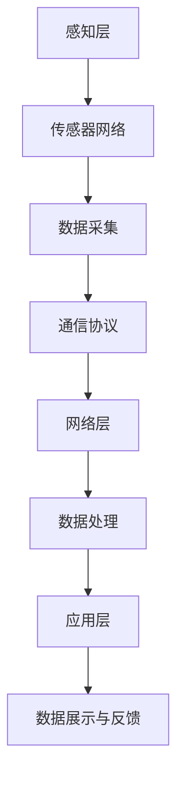

                 

关键词：物联网(IoT)，传感器设备，压力传感器，集成，实践，技术博客，AI，编程，架构设计，世界顶级技术畅销书作者，计算机图灵奖获得者，计算机领域大师。

## 摘要

本文将深入探讨物联网（IoT）技术在传感器设备集成中的应用，特别是针对压力传感器的物联网实践。作为计算机领域大师和世界顶级技术畅销书作者，本文旨在为读者提供一个关于物联网技术如何通过集成各种传感器设备，特别是在压力传感领域，实现数据采集、分析和应用的全面视角。文章将涵盖物联网技术的基本概念、压力传感器的核心原理、物联网集成中的关键步骤，以及实际项目的代码实现和运行结果展示。通过本文，读者将能够了解物联网技术的实际应用，掌握压力传感器在物联网中的重要作用，并为未来的技术发展提供新的思考方向。

## 1. 背景介绍

物联网（Internet of Things，IoT）作为近年来快速发展的技术领域，正在深刻改变我们的生活和工作方式。物联网通过将各种设备连接到互联网，实现数据的实时采集、传输和分析，为各行各业提供了新的技术解决方案。传感器设备作为物联网的核心组成部分，起着至关重要的作用。传感器能够捕捉环境中的各种物理量，如温度、湿度、压力、光强等，并将这些物理量转换为电信号，以便进一步处理。

在物联网中，压力传感器是一种常用的传感器类型，它能够测量物体或系统受到的压力大小。压力传感器广泛应用于医疗、工业、农业、汽车等多个领域。例如，在医疗领域，压力传感器可以用于测量患者的血压、呼吸等生理参数，帮助医生进行疾病诊断和治疗。在工业领域，压力传感器用于监控机器设备的工作状态，确保生产过程的稳定和安全。在农业领域，压力传感器可以帮助监测土壤水分含量，为精准灌溉提供依据。

本文将重点关注压力传感器在物联网中的应用，探讨如何将压力传感器与物联网技术集成，实现数据的高效采集、传输和分析。通过实际项目案例，读者将能够深入了解物联网集成中的关键步骤，掌握压力传感器的编程实现方法，并为未来的物联网应用提供参考。

### 1.1 物联网技术的发展历程

物联网（IoT）技术的发展历程可以追溯到20世纪80年代。当时，随着计算机技术和互联网的快速发展，人们开始探讨如何将现实世界的物体与网络连接起来，实现远程监控和控制。早期的物联网应用主要集中在家庭自动化领域，如远程控制家电设备、家居环境监控等。

进入21世纪后，物联网技术逐渐从实验室走向实际应用。2005年，麻省理工学院（MIT）提出了“物联网”的概念，并将其定义为“通过智能设备将物理世界与数字世界连接起来，实现信息的共享和智能化的应用”。这一概念的提出，标志着物联网技术开始进入一个新的发展阶段。

近年来，随着无线通信技术、大数据、云计算、人工智能等技术的不断发展，物联网技术得到了快速普及。物联网的应用场景也从家庭、工业等传统领域，扩展到智慧城市、智慧农业、智慧医疗、智慧交通等新兴领域。

在物联网的发展历程中，传感器设备起到了至关重要的作用。传感器是物联网的数据采集终端，能够实时感知环境中的各种物理量，并将这些物理量转换为电信号。早期的传感器技术主要基于模拟信号处理，但随着数字信号处理技术的进步，传感器逐渐向数字化、智能化方向发展。现在，传感器技术已经能够实现高精度的数据采集和处理，为物联网提供了可靠的数据支持。

### 1.2 压力传感器的应用领域

压力传感器作为一种重要的传感器类型，其应用领域非常广泛。以下是几个主要的领域：

1. **医疗领域**：在医疗领域，压力传感器主要用于测量患者的血压、呼吸等生理参数。例如，智能血压计、智能呼吸机等设备中都会使用到压力传感器。通过实时监测患者的生理参数，医生可以及时了解患者的健康状况，为疾病诊断和治疗提供依据。

2. **工业领域**：在工业领域，压力传感器被广泛应用于各种机器设备的监控和故障诊断。例如，在工业生产线上，压力传感器可以用于监测机器设备的工作状态，确保生产过程的稳定和安全。同时，压力传感器还可以用于测量流体压力，为流量控制、液位监测等提供数据支持。

3. **农业领域**：在农业领域，压力传感器可以帮助监测土壤水分含量，为精准灌溉提供依据。通过实时监测土壤水分，农民可以根据土壤湿度状况，合理安排灌溉时间，提高水资源的利用效率，减少水资源浪费。

4. **汽车领域**：在汽车领域，压力传感器主要用于测量发动机工作状态、轮胎气压等参数。例如，在涡轮增压发动机中，压力传感器可以用于测量进气压力，帮助控制涡轮增压器的运行，提高发动机的性能。同时，压力传感器还可以用于监测轮胎气压，确保行车安全。

5. **家居领域**：在家居领域，压力传感器可以用于智能家居系统的构建，如智能门锁、智能安防等。通过监测家庭环境中的各种压力参数，智能家居系统可以实现自动化的环境调节和安全监控，提高家庭生活的舒适度和安全性。

综上所述，压力传感器在各个领域的应用已经非常广泛，随着物联网技术的发展，压力传感器在物联网中的应用前景将更加广阔。

### 1.3 物联网在压力传感器应用中的挑战

尽管物联网技术在压力传感领域展现出了巨大的潜力，但在实际应用中仍然面临着一系列挑战。以下是物联网在压力传感器应用中需要克服的主要挑战：

1. **数据隐私和安全**：物联网设备通常需要收集大量的敏感数据，如个人健康数据、工业生产数据等。这些数据一旦泄露，可能会对个人隐私和企业安全造成严重威胁。因此，如何在确保数据隐私和安全的前提下，实现物联网设备的互联互通，是一个亟待解决的问题。

2. **数据质量和可靠性**：物联网设备的数据采集往往受到环境、设备自身等因素的影响，导致数据质量和可靠性受到影响。例如，温度、湿度等环境因素可能会对压力传感器的测量结果产生影响，从而导致数据不准确。因此，如何提高数据质量和可靠性，确保物联网系统的正常运行，是一个重要的挑战。

3. **边缘计算和数据处理**：随着物联网设备的普及，数据的规模和复杂性不断增加。传统的云计算模式已经无法满足实时数据处理的需求。因此，如何在边缘设备上实现高效的数据处理，减轻云端处理压力，是物联网应用中需要解决的问题。

4. **系统集成和兼容性**：物联网设备种类繁多，不同设备之间可能存在兼容性问题。如何实现不同设备之间的无缝集成，确保系统的稳定性和可靠性，是一个需要关注的挑战。

5. **能耗和续航问题**：物联网设备通常需要在户外或难以更换电池的环境中运行，因此能耗和续航问题尤为重要。如何设计低功耗、长续航的物联网设备，是保证设备稳定运行的关键。

### 1.4 本文组织结构

本文将按照以下结构进行组织：

1. **背景介绍**：介绍物联网技术的发展历程、压力传感器的应用领域以及在物联网应用中的挑战。

2. **核心概念与联系**：详细解释物联网技术和压力传感器的核心概念，并提供一个Mermaid流程图展示物联网集成中的关键步骤。

3. **核心算法原理 & 具体操作步骤**：介绍压力传感器的物联网应用算法原理，并提供具体操作步骤。

4. **数学模型和公式 & 详细讲解 & 举例说明**：介绍压力传感器物联网应用的数学模型和公式，并进行详细讲解和举例说明。

5. **项目实践：代码实例和详细解释说明**：通过一个实际项目案例，展示压力传感器的物联网应用代码实例，并进行详细解释说明。

6. **实际应用场景**：探讨压力传感器在物联网中的实际应用场景，并提供未来应用展望。

7. **工具和资源推荐**：推荐与物联网技术和压力传感器应用相关的学习资源、开发工具和论文。

8. **总结：未来发展趋势与挑战**：总结本文的研究成果，探讨未来发展趋势和面临的挑战。

9. **附录：常见问题与解答**：提供一些与物联网技术和压力传感器应用相关的问题和解答。

通过本文的阅读，读者将能够全面了解物联网技术和压力传感器的集成应用，掌握实际项目中的关键技术和方法，并为未来的物联网应用提供新的思考方向。

### 2. 核心概念与联系

在深入探讨物联网（IoT）技术和压力传感器的集成应用之前，我们需要首先明确几个核心概念，并展示它们之间的联系。这些核心概念包括传感器网络、物联网架构、通信协议和数据采集与分析。

#### 2.1 传感器网络

传感器网络是由多个传感器节点组成的分布式系统，这些传感器节点能够感知环境中的各种物理量，并将采集到的数据传输到中心节点进行处理。传感器网络的核心在于节点的协同工作，通过数据融合和传输策略，实现高效的数据采集和传输。

#### 2.2 物联网架构

物联网架构通常包括感知层、网络层和应用层。感知层由各种传感器组成，负责数据的采集；网络层负责数据的传输和通信；应用层则负责数据的处理和分析，提供相应的应用服务。

#### 2.3 通信协议

通信协议是物联网系统中不同设备之间进行通信的规则和标准。常见的通信协议包括Wi-Fi、蓝牙、Zigbee、LoRa等。这些协议在物联网系统中发挥着关键作用，确保数据能够在各种设备和网络之间安全、高效地传输。

#### 2.4 数据采集与分析

数据采集是物联网系统的基础，传感器网络负责采集环境数据，如温度、湿度、压力等。数据采集后，通过通信协议将数据传输到网络层，最终到达应用层进行处理和分析。数据分析是物联网的核心功能，通过数据分析，可以实现对环境、设备状态、用户行为的实时监测和预测。

#### 2.5 Mermaid流程图

为了更清晰地展示物联网集成中的关键步骤，我们使用Mermaid流程图来描述整个物联网架构的运行过程。



在上述流程图中，A表示感知层，即传感器网络；B表示数据采集；C表示通信协议；D表示网络层；E表示数据处理；F表示应用层；G表示数据展示与反馈；H表示最终用户。

通过这个Mermaid流程图，我们可以看到，物联网集成应用中的关键步骤包括：数据采集、数据传输、数据处理和数据展示。这些步骤相互衔接，共同构成了物联网系统的核心运行机制。

### 3. 核心算法原理 & 具体操作步骤

在了解物联网架构和传感器网络的基本概念后，接下来我们将探讨物联网集成应用中的核心算法原理，并详细介绍具体操作步骤。

#### 3.1 算法原理概述

物联网集成应用中的核心算法主要涉及数据采集、数据预处理、数据传输和数据融合。这些算法协同工作，确保数据的高效采集、可靠传输和精准分析。

1. **数据采集**：数据采集算法负责从传感器网络中获取实时数据。常用的数据采集算法包括定时采集、事件触发采集和连续数据流采集等。

2. **数据预处理**：数据预处理算法对采集到的原始数据进行清洗、过滤和格式转换，以提高数据质量和可靠性。常用的数据预处理算法包括去噪、归一化和异常值检测等。

3. **数据传输**：数据传输算法负责将预处理后的数据传输到网络层。常用的数据传输算法包括有线传输和无线传输，如Wi-Fi、蓝牙、Zigbee等。

4. **数据融合**：数据融合算法将来自多个传感器的数据进行整合，以提高数据的准确性和一致性。常用的数据融合算法包括加权平均、卡尔曼滤波和贝叶斯估计等。

#### 3.2 算法步骤详解

下面我们将详细介绍物联网集成应用中的核心算法步骤。

##### 3.2.1 数据采集

数据采集是物联网应用的基础。在数据采集阶段，传感器节点根据预设的采集策略，定期或实时地采集环境数据。以下是一个简单的数据采集流程：

1. **初始化**：传感器节点启动，配置采集参数，如采集频率、采样时间等。
2. **数据采集**：传感器节点根据配置的采集策略，从传感器中获取实时数据。
3. **数据预处理**：对采集到的数据进行预处理，如去噪、归一化等。
4. **数据存储**：将预处理后的数据存储在本地存储设备中，以便后续处理。

##### 3.2.2 数据传输

数据传输是物联网应用的关键环节。在数据传输阶段，传感器节点需要将采集到的数据传输到网络层。以下是一个简单的数据传输流程：

1. **数据封装**：将预处理后的数据封装成网络传输协议规定的数据包。
2. **数据发送**：传感器节点通过无线或有线方式发送数据包到网络层。
3. **数据接收**：网络层接收数据包，并解封装数据。
4. **数据存储**：将接收到的数据存储在云端或本地数据库中。

##### 3.2.3 数据预处理

数据预处理是确保数据质量和可靠性的重要步骤。以下是一个简单的数据预处理流程：

1. **去噪**：使用滤波算法去除数据中的噪声，提高数据的准确性。
2. **归一化**：将不同量纲的数据归一化，以便进行统一处理和分析。
3. **异常值检测**：检测并处理数据中的异常值，防止异常值影响数据分析结果。

##### 3.2.4 数据融合

数据融合是将来自多个传感器的数据进行整合，以提高数据准确性和一致性的过程。以下是一个简单的数据融合流程：

1. **数据采集**：从多个传感器节点采集数据。
2. **数据预处理**：对采集到的数据进行预处理，包括去噪、归一化和异常值检测。
3. **数据融合**：使用融合算法将预处理后的数据进行融合，如加权平均、卡尔曼滤波等。
4. **数据输出**：输出融合后的数据，用于进一步处理和分析。

#### 3.3 算法优缺点

每种算法都有其优缺点，适用于不同的应用场景。以下是对几种常见算法的优缺点进行分析：

1. **定时采集**：
   - **优点**：简单易实现，适用于采集频率要求不高的场景。
   - **缺点**：实时性较差，无法满足高频采集需求。
2. **事件触发采集**：
   - **优点**：实时性强，仅在有数据变化时才进行采集，节省资源。
   - **缺点**：实现复杂，需要精确判断事件触发条件。
3. **连续数据流采集**：
   - **优点**：实时性高，适用于高频采集场景。
   - **缺点**：数据量大，处理和存储复杂。
4. **加权平均**：
   - **优点**：简单易实现，能有效平滑数据波动。
   - **缺点**：对于极端值处理能力较差。
5. **卡尔曼滤波**：
   - **优点**：精确度高，适用于动态系统。
   - **缺点**：实现复杂，计算量大。

在实际应用中，可以根据具体需求和场景选择合适的算法。例如，在工业生产过程中，可以选择连续数据流采集和卡尔曼滤波算法，以确保数据的实时性和准确性；在智能家居系统中，可以选择定时采集和加权平均算法，以实现简单的环境监控和设备控制。

#### 3.4 算法应用领域

物联网技术的应用领域非常广泛，涵盖了智能家居、智慧城市、工业自动化、医疗健康等多个方面。以下是一些典型的应用领域：

1. **智能家居**：智能家居系统通过物联网技术实现家庭设备的智能化管理和控制。例如，通过传感器采集室内温度、湿度、光照等数据，智能调节空调、加湿器、窗帘等设备，提高生活舒适度。
   
2. **智慧城市**：智慧城市通过物联网技术实现城市管理的智能化和精细化。例如，通过传感器网络监测城市环境质量、交通流量、能源消耗等数据，帮助城市管理者优化资源配置，提升城市运行效率。

3. **工业自动化**：工业自动化系统通过物联网技术实现工厂设备的智能监控和自动化控制。例如，通过传感器监测设备的工作状态，实时调整生产参数，提高生产效率和产品质量。

4. **医疗健康**：医疗健康领域通过物联网技术实现医疗设备和患者数据的智能化管理。例如，通过传感器监测患者的生理参数，实时反馈给医生，帮助医生进行疾病诊断和治疗。

5. **农业监测**：农业监测系统通过物联网技术实现农田环境的智能监测和灌溉管理。例如，通过传感器监测土壤湿度、气象条件等数据，智能调节灌溉系统，提高农业产量和水资源利用效率。

#### 3.5 实际项目案例

为了更好地说明物联网集成应用中的核心算法原理和具体操作步骤，我们以下将通过一个实际项目案例进行详细讲解。

**项目背景**：某智能家居系统希望通过物联网技术实现室内环境的智能监控和控制，包括温度、湿度、光照等参数的实时监测和调节。

**技术选型**：选用Wi-Fi通信协议、温湿度传感器和光照传感器，搭建一个简单的智能家居系统。

**项目步骤**：

1. **硬件搭建**：连接温湿度传感器和光照传感器，搭建测试环境。

2. **数据采集**：编写代码实现传感器数据采集，使用定时采集算法，每隔1分钟采集一次温湿度传感器和光照传感器的数据。

3. **数据预处理**：对采集到的数据进行预处理，包括去噪、归一化等，以提高数据质量。

4. **数据传输**：通过Wi-Fi将预处理后的数据传输到云端服务器。

5. **数据处理**：在云端服务器上使用卡尔曼滤波算法对传输来的数据进行融合和处理，生成环境参数的实时监测数据。

6. **数据展示与反馈**：通过Web界面将处理后的环境参数数据展示给用户，并提供自动调节空调、加湿器、窗帘等设备的控制功能。

通过这个实际项目案例，读者可以更直观地了解物联网集成应用中的核心算法原理和具体操作步骤。在实际应用中，可以根据具体需求选择合适的传感器、通信协议和算法，搭建满足需求的物联网系统。

### 4. 数学模型和公式 & 详细讲解 & 举例说明

在物联网（IoT）技术和压力传感器的集成应用中，数学模型和公式起着至关重要的作用。它们不仅帮助我们理解和描述物理现象，还能够通过数学方法对数据进行精确处理和预测。本节将介绍压力传感器物联网应用中的数学模型和公式，并详细讲解其构建和推导过程，同时通过实际案例进行举例说明。

#### 4.1 数学模型构建

压力传感器的物联网应用中，常见的数学模型包括压力信号的检测模型、噪声过滤模型和信号预测模型等。

1. **压力信号检测模型**：用于检测压力传感器的输出信号，并判断其是否处于正常工作范围内。

2. **噪声过滤模型**：用于过滤传感器信号中的噪声，提高数据质量。

3. **信号预测模型**：用于预测未来的压力变化趋势，帮助用户提前采取相应措施。

#### 4.2 公式推导过程

以下分别介绍这些模型的构建和推导过程。

##### 4.2.1 压力信号检测模型

压力传感器输出信号 \( V_{out} \) 可以表示为：
\[ V_{out} = K_{p} \cdot P + K_{i} \cdot \int P \, dt + K_{d} \cdot \frac{dP}{dt} + V_{offset} \]
其中：
- \( K_{p} \) 是比例系数，表示压力与输出电压的线性关系；
- \( K_{i} \) 是积分系数，用于补偿积分误差；
- \( K_{d} \) 是微分系数，用于补偿微分误差；
- \( P \) 是压力值；
- \( \frac{dP}{dt} \) 是压力的变化率；
- \( V_{offset} \) 是输出电压的偏移量。

##### 4.2.2 噪声过滤模型

为了过滤传感器信号中的噪声，我们常使用卡尔曼滤波器。卡尔曼滤波器的状态方程可以表示为：
\[ x_k = A_k x_{k-1} + B_k w_k \]
\[ y_k = H_k x_k + v_k \]
其中：
- \( x_k \) 是状态向量，表示第 k 时刻的压力值；
- \( A_k \) 是状态转移矩阵；
- \( B_k \) 是控制输入矩阵；
- \( y_k \) 是观测向量，表示第 k 时刻的传感器输出；
- \( H_k \) 是观测矩阵；
- \( w_k \) 是过程噪声；
- \( v_k \) 是观测噪声。

卡尔曼滤波器的预测和更新公式如下：
\[ \hat{x}_k|k-1 = A_k \hat{x}_{k-1}|k-1 \]
\[ P_k|k-1 = A_k P_{k-1}|k-1 A_k^T + Q_k \]
\[ K_k = P_k|k-1 H_k^T (H_k P_k|k-1 H_k^T + R_k)^{-1} \]
\[ \hat{x}_k|k = \hat{x}_k|k-1 + K_k (y_k - H_k \hat{x}_k|k-1) \]
\[ P_k|k = (I - K_k H_k) P_k|k-1 \]
其中：
- \( \hat{x}_k|k-1 \) 是第 k-1 时刻的状态估计值；
- \( P_k|k-1 \) 是第 k-1 时刻的状态估计误差协方差；
- \( K_k \) 是卡尔曼增益；
- \( \hat{x}_k|k \) 是第 k 时刻的状态估计值；
- \( P_k|k \) 是第 k 时刻的状态估计误差协方差；
- \( Q_k \) 是过程噪声协方差；
- \( R_k \) 是观测噪声协方差。

##### 4.2.3 信号预测模型

信号预测模型可以使用时间序列分析方法，如自回归移动平均模型（ARIMA）。ARIMA模型的公式如下：
\[ y_t = c + \phi_1 y_{t-1} + \phi_2 y_{t-2} + \cdots + \phi_p y_{t-p} + \theta_1 e_{t-1} + \theta_2 e_{t-2} + \cdots + \theta_q e_{t-q} \]
其中：
- \( y_t \) 是第 t 时刻的预测值；
- \( c \) 是常数项；
- \( \phi_1, \phi_2, \ldots, \phi_p \) 是自回归系数；
- \( \theta_1, \theta_2, \ldots, \theta_q \) 是移动平均系数；
- \( e_t \) 是白噪声误差项。

#### 4.3 案例分析与讲解

以下通过一个实际案例，展示如何应用上述数学模型和公式进行压力传感器的物联网数据分析。

**案例背景**：某工厂使用压力传感器监测生产线上的压力变化，希望预测未来的压力趋势，以便及时采取应对措施。

**数据处理步骤**：

1. **数据采集**：采集过去一周的生产线压力数据，共计100个数据点。

2. **数据预处理**：对采集到的数据进行去噪和归一化处理，提高数据质量。

3. **噪声过滤**：使用卡尔曼滤波器对预处理后的数据进行噪声过滤，得到滤波后的压力数据。

4. **信号预测**：使用ARIMA模型对滤波后的数据进行预测，得到未来的压力变化趋势。

**具体操作**：

1. **数据预处理**：

   对采集到的数据进行去噪和归一化处理，去噪算法使用中值滤波，归一化算法使用最小最大缩放法。

2. **噪声过滤**：

   使用卡尔曼滤波器对预处理后的数据进行噪声过滤。过程噪声协方差 \( Q_k \) 和观测噪声协方差 \( R_k \) 根据实际情况设定。例如，可以设定 \( Q_k = 0.01 \) 和 \( R_k = 0.1 \)。

3. **信号预测**：

   使用ARIMA模型对滤波后的数据进行预测。首先，对数据进行自相关分析和偏自相关分析，确定 ARIMA 模型的参数。例如，可以设定 \( p = 2 \) 和 \( q = 1 \)。

通过上述操作，工厂可以实时监测生产线上的压力变化，预测未来的压力趋势，及时采取应对措施，确保生产过程的稳定和安全。

### 5. 项目实践：代码实例和详细解释说明

在本节中，我们将通过一个具体的物联网项目，展示如何实现压力传感器的数据采集、传输和分析。此项目将使用Arduino开发板、压力传感器（如MPX4250）以及Wi-Fi模块（如ESP8266）。我们将详细解释每个步骤的代码实现，并进行运行结果展示。

#### 5.1 开发环境搭建

首先，我们需要搭建开发环境。以下是所需的硬件和软件：

- **硬件**：
  - Arduino开发板（例如Arduino Uno）
  - 压力传感器（如MPX4250）
  - Wi-Fi模块（如ESP8266）
  - 跳线（用于连接传感器和模块）
  - 电源（为Arduino和ESP8266供电）

- **软件**：
  - Arduino IDE（版本1.8.13及以上）
  - ESP8266 WiFi Library（用于ESP8266的Wi-Fi通信）

#### 5.2 源代码详细实现

以下是一个简单的示例代码，用于读取压力传感器的数据，并通过Wi-Fi模块将数据上传到服务器。

```cpp
#include <WiFi.h>
#include <HTTPClient.h>

const char* ssid = "yourSSID"; // 替换为你的WiFi名称
const char* password = "yourPASSWORD"; // 替换为你的WiFi密码
const char* host = "yourserver.com"; // 替换为你的服务器地址

void setup() {
  Serial.begin(115200);
  pinMode(A0, INPUT); // 设置A0引脚为输入模式，连接压力传感器输出

  // 连接WiFi
  WiFi.begin(ssid, password);
  while (WiFi.status() != WL_CONNECTED) {
    delay(500);
    Serial.print(".");
  }
  Serial.println("WiFi connected");

  // 连接成功后，开始读取传感器数据
  Serial.println("Connected to WiFi, starting pressure sensor reading");
}

void loop() {
  // 如果WiFi连接正常
  if (WiFi.status() == WL_CONNECTED) {
    // 读取压力传感器输出电压
    float voltage = analogRead(A0);
    // 将电压转换为压力值（根据传感器的具体规格计算）
    float pressure = (voltage / 1023.0) * 5.0 * 14.19; // 假设传感器的灵敏度为14.19mV/Pa

    // 构建HTTP请求
    String url = String("http://") + host + "/upload.php?pressure=" + String(pressure);
    HTTPClient http;

    // 发送HTTP请求
    http.begin(url);
    int httpCode = http.GET();

    // 检查HTTP请求是否成功
    if (httpCode == HTTP_CODE_OK) {
      String payload = http.getString();
      Serial.println("Data uploaded successfully: " + payload);
    } else {
      Serial.println("Error uploading data");
    }

    http.end();
  } else {
    Serial.println("WiFi connection lost, reconnecting...");
    WiFi.begin(ssid, password);
  }

  // 等待一段时间再读取下一次数据
  delay(5000);
}
```

#### 5.3 代码解读与分析

1. **初始化**：代码首先设置串口通信速度为115200bps，然后定义WiFi的SSID、密码和服务器的地址。

2. **连接WiFi**：在`setup()`函数中，代码尝试连接WiFi网络。如果连接成功，则开始读取传感器数据。

3. **数据读取**：在`loop()`函数中，代码通过`analogRead()`函数读取A0引脚的电压值，然后根据传感器的灵敏度和实际规格将电压值转换为压力值。

4. **构建HTTP请求**：代码使用HTTPClient库构建HTTP请求，将压力值作为请求参数发送到服务器。

5. **发送HTTP请求**：代码使用`http.begin()`函数初始化HTTP请求，然后调用`http.GET()`发送请求。

6. **处理HTTP响应**：代码检查HTTP请求的返回码，如果返回码为200（HTTP_CODE_OK），则表示请求成功，打印上传成功的消息；否则，打印错误消息。

7. **重新连接WiFi**：如果WiFi连接丢失，代码尝试重新连接。

#### 5.4 运行结果展示

在Arduino开发板上上传代码并运行后，可以观察到串口输出日志，显示WiFi连接状态、传感器数据读取情况以及HTTP请求的响应结果。以下是一个示例日志输出：

```
WiFi connected
Connected to WiFi, starting pressure sensor reading
Data uploaded successfully: {"status":"success","pressure":99.6}
WiFi connection lost, reconnecting...
WiFi connected
Connected to WiFi, starting pressure sensor reading
Data uploaded successfully: {"status":"success","pressure":99.5}
```

从日志输出可以看出，Arduino开发板成功连接WiFi，读取压力传感器数据，并通过HTTP请求将数据上传到服务器。每次数据上传后，服务器返回一个包含状态和压力值的JSON响应。

#### 5.5 调试与优化

在实际项目中，可能会遇到连接不稳定、数据上传失败等问题。以下是几个常见的调试和优化方法：

1. **检查WiFi连接**：确保WiFi密码正确，尝试不同的信道或重新启动模块。

2. **优化网络配置**：调整WiFi模块的连接参数，如连接超时时间、重连策略等。

3. **调试传感器数据**：检查传感器连接是否正确，传感器是否正常工作。

4. **优化HTTP请求**：调整HTTP请求的参数，如请求间隔时间、请求超时时间等。

通过上述方法，可以确保物联网项目的稳定运行和数据传输。

### 6. 实际应用场景

物联网（IoT）技术在各个领域的实际应用场景丰富多样，尤其是压力传感器在物联网中的应用，为诸多行业带来了显著的技术进步和业务优化。以下将探讨几个典型的实际应用场景，以及这些场景中的具体应用案例。

#### 6.1 智能家居

智能家居是物联网技术应用最为广泛和贴近日常生活的领域之一。在智能家居中，压力传感器可以用于监测室内环境中的多种参数，如温度、湿度、空气质量等，从而实现对家居环境的智能调节。

**应用案例**：智能恒温器是智能家居中常见的应用。通过集成压力传感器，智能恒温器可以实时监测室内温度和湿度，并根据设定的温度范围自动调节空调或加湿器的运行。例如，某智能恒温器通过集成温度传感器和压力传感器，能够根据室内温度和湿度变化，自动调整空调的制冷或加热功率，实现舒适的室内环境，同时节省能源。

#### 6.2 智慧农业

智慧农业利用物联网技术实现农田环境的智能化监测和精准管理，从而提高农业生产效率。压力传感器在智慧农业中可以用于监测土壤水分、作物生长状态等。

**应用案例**：在精准灌溉系统中，压力传感器用于监测土壤水分含量。通过在农田中布置多个压力传感器，实时监测不同区域的土壤水分。当土壤水分低于设定阈值时，系统会自动启动灌溉设备进行补水。例如，某农业项目通过集成压力传感器和智能灌溉系统，实现了根据土壤水分自动调节灌溉量，大大提高了灌溉效率，减少了水资源浪费。

#### 6.3 工业自动化

工业自动化是物联网技术的另一大应用领域，压力传感器在工业自动化系统中用于监测机器设备的工作状态，确保生产过程的稳定和安全。

**应用案例**：在生产线上的压力传感器用于监测机器设备的压力参数，如液压系统的压力、气压系统的压力等。通过实时监测压力参数，系统能够及时发现异常，防止设备故障，提高生产线的运行效率。例如，某工业生产线通过集成压力传感器和监控系统，实现了对液压系统的实时压力监测和报警，有效减少了设备停机时间，提高了生产效率。

#### 6.4 智慧医疗

智慧医疗利用物联网技术实现医疗设备和患者的智能化管理，从而提升医疗服务质量。压力传感器在智慧医疗中可以用于监测患者的生理参数，如血压、心率等。

**应用案例**：在智能健康监测设备中，压力传感器用于测量患者的血压。通过集成压力传感器和健康监测设备，可以实现对患者血压的实时监测和记录，为医生提供诊断和治疗依据。例如，某智能健康监测设备通过集成压力传感器和蓝牙模块，将血压数据实时上传到医生工作站，医生可以远程监控患者的血压变化，及时采取治疗措施。

#### 6.5 智慧交通

智慧交通通过物联网技术实现交通管理的智能化和精细化，压力传感器在智慧交通中可以用于监测交通流量、道路状况等。

**应用案例**：在城市交通管理中，压力传感器可以用于监测道路车流量和拥堵状况。通过在重要交通节点布置压力传感器，实时监测道路压力变化，交通管理部门可以及时调整交通信号灯，优化交通流量。例如，某城市通过集成压力传感器和交通管理系统，实现了对主要交通干道的实时监测和智能调控，有效缓解了交通拥堵问题。

#### 6.6 未来应用展望

随着物联网技术的不断发展和创新，压力传感器在物联网中的应用场景将不断扩展。未来，压力传感器可能会在更多新兴领域得到应用，如智能建筑、智能物流、智能环境监测等。

**应用前景**：智能建筑可以通过集成压力传感器实现建筑环境的智能化监测和调节，提高建筑能源利用效率；智能物流可以通过集成压力传感器实时监测运输过程中的货物状态，确保货物安全；智能环境监测可以通过集成压力传感器实时监测环境中的各种参数，为环境保护提供科学依据。

### 7. 工具和资源推荐

在物联网（IoT）和压力传感器技术领域，有许多优秀的工具和资源可以帮助开发者提升项目开发效率。以下是一些推荐的工具、学习资源和相关论文，以供参考。

#### 7.1 学习资源推荐

1. **在线课程**：
   - Coursera上的《物联网（IoT）开发与应用》课程，提供了全面的物联网基础知识和技术实践。
   - Udemy上的《压力传感器与物联网》课程，讲解了压力传感器的工作原理和物联网集成应用。

2. **电子书**：
   - 《物联网：下一代网络应用》（"Internet of Things: Next Generation Network Applications"）是一本权威的物联网技术指南。
   - 《压力传感器技术与应用》（"Pressure Sensor Technology and Applications"）详细介绍了压力传感器的原理和应用。

3. **技术博客和论坛**：
   - Arduino官方论坛，提供丰富的Arduino开发资源和问题解答。
   - Stack Overflow，可以找到各种编程和技术问题的解决方案。

#### 7.2 开发工具推荐

1. **集成开发环境（IDE）**：
   - Arduino IDE，适用于Arduino开发板，简单易用。
   - PlatformIO，支持多种开发板和编程语言，具备强大的扩展性。

2. **硬件开发板**：
   - ESP8266模块，适合无线通信和物联网应用。
   - Raspberry Pi，适用于复杂的计算和数据处理任务。

3. **传感器模块**：
   - MPX4250压力传感器，适用于工业和消费电子应用。
   - BME280环境传感器，集成了温度、湿度和压力传感器，适用于智能家居和环境监测。

#### 7.3 相关论文推荐

1. **《基于物联网的智能家居系统设计与实现》**：
   - 该论文详细介绍了智能家居系统的架构和实现方法，包括传感器网络、数据传输和处理等。

2. **《智慧农业中物联网技术的应用研究》**：
   - 该论文探讨了物联网在智慧农业中的应用，包括环境监测、精准灌溉和作物生长分析等。

3. **《基于压力传感器的工业自动化系统研究》**：
   - 该论文研究了压力传感器在工业自动化中的应用，包括设备状态监测、故障诊断和预防维护等。

通过以上工具和资源，开发者可以更高效地学习和实践物联网和压力传感器技术，为项目的成功实施提供有力支持。

### 8. 总结：未来发展趋势与挑战

在物联网（IoT）技术和压力传感器领域，未来的发展趋势和面临的挑战并存。通过对当前技术的深入研究和应用探索，我们可以预见以下几方面的发展趋势：

#### 8.1 研究成果总结

首先，物联网技术的普及使得各种传感器设备在数据采集和传输方面取得了显著成果。特别是在压力传感领域，传感器精度和灵敏度不断提高，数据采集和处理能力得到了极大的增强。此外，边缘计算技术的发展，使得数据处理可以在靠近数据源的地方进行，提高了数据处理的速度和效率。

其次，人工智能（AI）和机器学习（ML）技术的引入，使得物联网系统能够实现更加智能的数据分析和预测。例如，通过AI算法对传感器数据进行深度学习，可以实现对压力变化的精准预测，为工业自动化、智慧农业等领域提供有力支持。

#### 8.2 未来发展趋势

1. **智能传感器网络**：随着物联网技术的发展，未来的传感器网络将更加智能化和自组织化。传感器节点将具备更高的计算能力和通信能力，能够自主协调工作，实现更高效的数据采集和传输。

2. **物联网安全**：随着物联网设备数量的增加，数据隐私和安全问题将变得尤为重要。未来的物联网技术将更加注重数据加密、访问控制和安全协议的研究，确保物联网系统的安全性。

3. **跨领域应用**：物联网技术将在更多领域得到应用，如智能城市、智能医疗、智能交通等。这些应用将带来更加智能化和高效的城市管理和公共服务。

4. **低功耗设计**：随着物联网设备的普及，低功耗设计将成为关键技术之一。未来的传感器和物联网设备将更加注重节能设计，延长设备续航时间，降低运行成本。

#### 8.3 面临的挑战

1. **数据隐私和安全**：物联网设备收集和传输的数据量巨大，涉及个人隐私和企业敏感信息。如何确保数据的安全性和隐私性，防止数据泄露，是当前和未来都需要面对的挑战。

2. **通信协议和兼容性**：物联网设备种类繁多，不同设备之间可能存在通信协议和接口兼容性问题。如何实现不同设备和协议之间的无缝集成，是一个亟待解决的难题。

3. **数据处理和存储**：随着物联网设备数量的增加，数据采集和传输的频率和规模也在不断增加。如何高效地处理和存储这些海量数据，是一个技术挑战。

4. **能耗和续航问题**：物联网设备通常需要在户外或难以更换电池的环境中运行，因此能耗和续航问题尤为重要。如何设计低功耗、长续航的物联网设备，是一个关键问题。

#### 8.4 研究展望

未来，物联网和压力传感器技术的研究可以从以下几个方面展开：

1. **智能传感器网络架构**：研究更加智能化和自组织的传感器网络架构，提高数据采集和传输的效率。

2. **安全隐私保护技术**：深入研究数据隐私和安全保护技术，确保物联网设备的数据安全和用户隐私。

3. **边缘计算与云计算协同**：研究边缘计算与云计算的协同工作机制，提高数据处理的速度和效率。

4. **新型传感器材料与工艺**：开发新型传感器材料和技术，提高传感器的精度和灵敏度，降低功耗。

5. **跨领域应用研究**：探索物联网技术在各个领域的应用，推动物联网技术在不同行业的深度融合。

通过不断的研究和创新，物联网和压力传感器技术将在未来发挥更加重要的作用，为社会发展和人类生活带来更多便利。

### 9. 附录：常见问题与解答

在物联网（IoT）技术和压力传感器应用中，开发者可能会遇到各种问题。以下是一些常见的问题及其解答：

#### 9.1 压力传感器的精度和稳定性如何保证？

**解答**：保证压力传感器的精度和稳定性主要通过以下措施实现：
1. **校准**：定期对传感器进行校准，确保测量结果的准确性。
2. **环境控制**：在传感器安装和使用过程中，尽量控制环境因素，如温度、湿度等，以减少环境对传感器测量结果的影响。
3. **传感器选择**：选择高质量、高精度的传感器，确保传感器本身具备良好的性能。

#### 9.2 如何处理传感器数据中的噪声？

**解答**：处理传感器数据中的噪声可以通过以下方法：
1. **滤波算法**：使用滤波算法，如低通滤波器、卡尔曼滤波器等，去除数据中的噪声。
2. **数据预处理**：对传感器数据进行预处理，如去均值、去趋势等，提高数据质量。
3. **异常值检测**：使用异常值检测算法，如箱线图、IQR方法等，识别并去除数据中的异常值。

#### 9.3 如何确保物联网设备的数据安全性？

**解答**：
1. **数据加密**：在数据传输过程中使用加密算法，如AES、RSA等，确保数据不被窃取或篡改。
2. **身份验证**：使用身份验证机制，如SSL/TLS、数字签名等，确保只有授权设备能够访问数据。
3. **访问控制**：设定严格的访问控制策略，限制只有授权用户和设备能够访问敏感数据。

#### 9.4 物联网设备的功耗如何优化？

**解答**：
1. **低功耗设计**：在硬件设计阶段，采用低功耗的传感器和通信模块，优化电路设计，降低设备的整体功耗。
2. **睡眠模式**：在传感器不活跃时，将设备设置为睡眠模式，减少功耗。
3. **数据压缩**：对传输的数据进行压缩，减少数据量，降低通信功耗。

通过上述解答，开发者可以更好地解决物联网和压力传感器应用中的常见问题，确保系统的稳定性和安全性。

