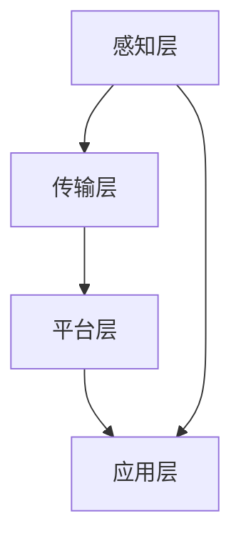

                 

关键词：物联网，传感器，设备集成，通信协议，数据处理，数据安全，应用场景，技术挑战

物联网（Internet of Things，IoT）作为一项颠覆性的技术，正在迅速改变我们的生活方式和工业生产模式。IoT技术的核心在于将各种传感器设备与互联网连接，实现对物理世界的实时监测与控制。本文将概述物联网技术的基本概念，探讨传感器设备的类型及其在IoT中的重要性，分析物联网技术与其他技术的联系，并介绍物联网系统的架构和通信协议。同时，还将讨论物联网数据处理的策略，数据安全和隐私保护措施，以及物联网技术的应用场景和未来发展趋势。

## 1. 背景介绍

### 1.1 物联网的起源与发展

物联网概念最早可以追溯到1999年，由麻省理工学院的Kevin Ashton首次提出。物联网旨在通过互联网将物理设备联网，实现设备间的智能交互和信息共享。随着传感器技术、无线通信技术、云计算技术、大数据分析技术等的发展，物联网逐渐从概念走向实际应用。

### 1.2 传感器设备的发展

传感器技术是物联网实现智能感知和交互的基础。从最初的机械式传感器到如今的智能传感器，传感器技术的发展经历了质的飞跃。现代传感器具有体积小、功耗低、灵敏度高等特点，能够实时监测各种环境参数，如温度、湿度、光照、压力等。

### 1.3 物联网的重要性

物联网技术的普及，不仅能够提高生产效率，降低运营成本，还能够改善人们的生活质量。例如，智能家居系统可以通过物联网实现家电的远程控制，智能交通系统可以实时监测交通状况，优化交通流量。在工业生产中，物联网技术可以实现对设备的实时监控和维护，提高生产效率和产品质量。

## 2. 核心概念与联系

### 2.1 物联网定义与组成部分

物联网由多个部分组成，包括传感器、数据采集与传输设备、数据处理与分析平台、用户接口等。传感器负责采集环境数据，数据采集与传输设备将数据上传到云端或本地服务器，数据处理与分析平台对数据进行处理和分析，用户接口则用于展示数据和分析结果。

### 2.2 传感器设备的分类

传感器设备可以分为以下几类：

- **环境传感器**：如温度传感器、湿度传感器、光照传感器等，用于监测环境参数。
- **运动传感器**：如加速度传感器、陀螺仪传感器等，用于检测物体的运动状态。
- **位置传感器**：如GPS传感器、RFID传感器等，用于定位和跟踪。
- **生物传感器**：如心率传感器、血压传感器等，用于健康监测。

### 2.3 物联网系统架构

物联网系统通常包括以下层次：

- **感知层**：由传感器设备组成，负责数据的采集。
- **传输层**：由无线通信模块和网络传输设备组成，负责数据的传输。
- **平台层**：由数据处理和分析设备组成，负责数据存储、处理和分析。
- **应用层**：由用户接口和应用软件组成，负责数据的展示和应用。

### 2.4 Mermaid 流程图（Mermaid 流程节点中不要有括号、逗号等特殊字符）



## 3. 核心算法原理 & 具体操作步骤

### 3.1 算法原理概述

物联网技术中的核心算法主要包括数据采集、传输、处理和分析等。这些算法的核心目标是高效、准确地处理数据，并实时反馈结果。

### 3.2 算法步骤详解

- **数据采集**：传感器采集环境数据，如温度、湿度等。
- **数据预处理**：对采集到的数据进行清洗和格式化，去除噪声和异常值。
- **数据传输**：通过无线通信模块将数据上传到服务器。
- **数据处理**：在服务器端对数据进行存储、分析和处理。
- **结果反馈**：将处理结果通过用户接口反馈给用户。

### 3.3 算法优缺点

- **优点**：实时性高，数据处理能力强，能够快速响应用户需求。
- **缺点**：数据处理和传输过程中可能存在延迟和误差，安全性问题较严重。

### 3.4 算法应用领域

物联网技术可以应用于智能家居、智能交通、智能医疗、工业生产等多个领域。

## 4. 数学模型和公式 & 详细讲解 & 举例说明

### 4.1 数学模型构建

物联网数据处理中常用的数学模型包括线性回归、神经网络等。以下是一个简单的线性回归模型示例：

$$
y = ax + b
$$

其中，$y$ 是预测值，$x$ 是输入值，$a$ 和 $b$ 是模型的参数。

### 4.2 公式推导过程

线性回归模型的推导过程如下：

$$
\begin{aligned}
y &= \beta_0 + \beta_1 x + \epsilon \\
\hat{y} &= \hat{\beta_0} + \hat{\beta_1} x \\
\end{aligned}
$$

其中，$\beta_0$ 和 $\beta_1$ 是模型参数，$\epsilon$ 是误差项。

### 4.3 案例分析与讲解

假设我们有一组数据点 $(x_1, y_1), (x_2, y_2), ..., (x_n, y_n)$，我们要通过线性回归模型预测 $x_n$ 对应的 $y_n$。

首先，计算 $x$ 和 $y$ 的平均值：

$$
\bar{x} = \frac{1}{n} \sum_{i=1}^{n} x_i \\
\bar{y} = \frac{1}{n} \sum_{i=1}^{n} y_i
$$

然后，计算线性回归模型的参数：

$$
\hat{\beta_1} = \frac{\sum_{i=1}^{n} (x_i - \bar{x})(y_i - \bar{y})}{\sum_{i=1}^{n} (x_i - \bar{x})^2} \\
\hat{\beta_0} = \bar{y} - \hat{\beta_1} \bar{x}
$$

最后，使用模型预测 $x_n$ 对应的 $y_n$：

$$
\hat{y_n} = \hat{\beta_0} + \hat{\beta_1} x_n
$$

## 5. 项目实践：代码实例和详细解释说明

### 5.1 开发环境搭建

本文使用 Python 作为编程语言，搭建开发环境时需要安装以下库：

```bash
pip install numpy matplotlib
```

### 5.2 源代码详细实现

以下是实现线性回归模型的 Python 代码：

```python
import numpy as np
import matplotlib.pyplot as plt

# 数据
x = np.array([1, 2, 3, 4, 5])
y = np.array([1, 2, 3, 4, 5])

# 计算平均值
x_mean = np.mean(x)
y_mean = np.mean(y)

# 计算参数
b1 = np.sum((x - x_mean) * (y - y_mean)) / np.sum((x - x_mean) ** 2)
b0 = y_mean - b1 * x_mean

# 模型
model = lambda x: b0 + b1 * x

# 预测
y_pred = model(x)

# 绘图
plt.scatter(x, y, label='Data')
plt.plot(x, y_pred, color='red', label='Model')
plt.xlabel('x')
plt.ylabel('y')
plt.legend()
plt.show()
```

### 5.3 代码解读与分析

上述代码首先导入了必要的库，然后定义了数据集、计算平均值、参数计算和模型预测等步骤。最后，使用 matplotlib 库绘制数据点和模型预测线。

### 5.4 运行结果展示

运行代码后，会展示一个散点图和一条红色预测线，表示线性回归模型的预测结果。

## 6. 实际应用场景

物联网技术已广泛应用于各个领域，以下是一些典型的应用场景：

- **智能家居**：通过物联网技术实现家电设备的远程控制，提高生活质量。
- **智能交通**：通过物联网技术实现交通流量监测和优化，提高交通效率。
- **智能医疗**：通过物联网技术实现健康数据的实时监测和分析，提高医疗水平。
- **工业生产**：通过物联网技术实现设备的实时监控和维护，提高生产效率和产品质量。

### 6.4 未来应用展望

随着物联网技术的不断发展，未来物联网将更广泛地应用于智能制造、智慧城市、智能农业等领域。同时，物联网技术也将面临数据隐私、安全性、标准化等挑战，需要不断进行技术创新和规范制定。

## 7. 工具和资源推荐

### 7.1 学习资源推荐

- **书籍**：《物联网技术导论》、《物联网架构设计与开发实践》
- **在线课程**：Coursera 上的《物联网技术与应用》、Udacity 上的《物联网开发基础》
- **论坛和社区**：Stack Overflow、IEEE IoT Community

### 7.2 开发工具推荐

- **编程语言**：Python、Java、C++
- **开发框架**：Spring Boot、Flask、Django
- **数据可视化工具**：Matplotlib、Plotly、Tableau

### 7.3 相关论文推荐

- **综述性论文**：《物联网技术的发展与应用》、《物联网安全挑战与对策》
- **研究性论文**：《基于物联网的智能家居系统设计与实现》、《物联网技术在智慧城市建设中的应用研究》

## 8. 总结：未来发展趋势与挑战

### 8.1 研究成果总结

物联网技术在过去几十年取得了显著的成果，已经广泛应用于各个领域。随着传感器技术、无线通信技术、云计算技术等的发展，物联网技术的应用前景更加广阔。

### 8.2 未来发展趋势

- **智能化**：物联网技术将更加智能化，实现更加精准的感知和控制。
- **集成化**：物联网将与其他技术（如人工智能、大数据等）进行深度融合。
- **标准化**：物联网技术标准化将不断完善，促进跨平台、跨设备的互操作性。

### 8.3 面临的挑战

- **数据隐私和安全**：物联网设备数量庞大，数据隐私和安全问题亟待解决。
- **能耗和续航**：物联网设备通常功耗较高，需要提高能效和续航能力。
- **标准化和互操作性**：物联网技术的标准化和互操作性仍需进一步规范。

### 8.4 研究展望

物联网技术的未来发展将更加注重智能化、集成化和标准化。同时，需要加强数据隐私和安全保护，提高设备的能效和续航能力，推动物联网技术的广泛应用。

## 9. 附录：常见问题与解答

### 9.1 物联网技术有哪些应用领域？

物联网技术可以应用于智能家居、智能交通、智能医疗、工业生产、智慧城市等多个领域。

### 9.2 物联网数据安全如何保障？

物联网数据安全可以从以下几个方面进行保障：

- **数据加密**：对数据进行加密处理，防止数据在传输和存储过程中被窃取。
- **访问控制**：对物联网设备进行访问控制，确保只有授权用户可以访问设备数据。
- **安全审计**：对物联网设备进行安全审计，及时发现和修复安全隐患。

### 9.3 物联网设备如何提高续航能力？

物联网设备可以通过以下几种方式提高续航能力：

- **节能技术**：采用低功耗的传感器和通信模块。
- **节能算法**：优化数据处理和传输算法，减少能耗。
- **备用电源**：为物联网设备配备备用电源，如电池、太阳能等。

---

作者：禅与计算机程序设计艺术 / Zen and the Art of Computer Programming
----------------------------------------------------------------

以上就是本文的完整内容，希望能够帮助您了解物联网技术和各种传感器设备的集成基础。如果您有任何问题或建议，欢迎在评论区留言。感谢阅读！
------------------------------------------------------------------

