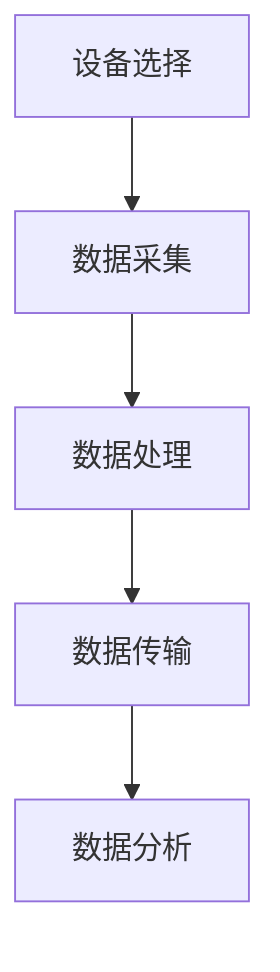

                 

关键词：物联网，传感器集成，消费电子，创新，技术

> 摘要：本文旨在探讨物联网（IoT）技术在各种传感器设备集成中的应用，以及其在消费电子领域的创新。通过详细分析物联网的基本概念、传感器的工作原理及其集成方法，本文将展示物联网如何改变传统消费电子产品的形态，提升用户体验，并探讨其未来的发展方向。

## 1. 背景介绍

### 物联网的定义与发展

物联网（Internet of Things，IoT）是指通过互联网将各种物体连接起来，使其能够相互通信和共享信息的技术。这一概念最早可以追溯到1999年，凯文·阿什顿（Kevin Ashton）首次提出了“物联网”一词，旨在描述一种通过RFID技术实现物品之间互联的网络。

物联网的发展历程可以划分为几个阶段：早期阶段（2000-2005年），主要关注简单设备的连接；发展阶段（2006-2010年），物联网技术开始应用于智能家居、工业自动化等领域；成熟阶段（2010年至今），物联网逐渐普及，应用场景多样化，形成了庞大的物联网生态系统。

### 消费电子的变革

消费电子领域是物联网技术的重要应用场景之一。随着物联网技术的不断发展，传统消费电子产品正在经历一场深刻的变革。智能手表、智能家居设备、可穿戴设备等新产品的不断涌现，使得消费电子产品更加智能化、个性化。

### 传感器技术的重要性

传感器技术是物联网的核心组成部分。传感器是一种能够检测和响应特定类型信号的装置，并将其转换为电信号或其他形式的信息。传感器技术的进步极大地推动了物联网的发展，使得物联网系统能够更准确地感知和反应外部环境。

## 2. 核心概念与联系

### 物联网的基本概念

- **物联网设备**：具备网络连接能力，能够收集、处理和发送数据的物理设备。
- **物联网平台**：用于连接、管理和分析物联网设备的数据的中心系统。
- **物联网协议**：用于数据传输和设备通信的标准协议，如MQTT、CoAP等。

### 传感器的工作原理与分类

- **工作原理**：传感器通常由敏感元件和转换元件组成。敏感元件能够感受到被测量的信息，转换元件则将敏感元件感受到的信息转换成电信号或其他形式的信息。

- **分类**：
  - **根据工作原理**：热敏、光敏、压敏、磁敏等。
  - **根据功能**：温度传感器、湿度传感器、压力传感器、加速度传感器等。

### 物联网与传感器设备的集成

物联网设备和传感器设备的集成是实现物联网应用的关键。以下是一个简单的集成流程：

1. **设备选择**：根据应用需求选择合适的物联网设备和传感器。
2. **数据采集**：传感器收集环境数据，如温度、湿度、光线等。
3. **数据处理**：物联网设备处理传感器数据，进行数据清洗、转换和分析。
4. **数据传输**：将处理后的数据通过物联网协议发送到物联网平台。
5. **数据分析**：物联网平台对数据进行存储、分析和可视化。

### Mermaid 流程图



## 3. 核心算法原理 & 具体操作步骤

### 3.1 算法原理概述

物联网设备和传感器设备的集成涉及多种算法，其中最核心的是数据采集与处理算法。这些算法包括：

- **数据采集算法**：用于从传感器中获取环境数据，如温度、湿度等。
- **数据处理算法**：用于对采集到的数据进行分析、清洗和转换。
- **数据传输算法**：用于将处理后的数据发送到物联网平台。

### 3.2 算法步骤详解

#### 3.2.1 数据采集算法

1. **初始化传感器**：设置传感器的采样率和工作模式。
2. **采集数据**：通过传感器读取环境数据，如温度、湿度等。
3. **数据预处理**：对采集到的数据进行滤波、去噪等预处理。

#### 3.2.2 数据处理算法

1. **数据清洗**：去除异常值和重复数据。
2. **数据转换**：将原始数据转换为标准格式，如JSON或XML。
3. **数据分析**：对转换后的数据进行分析，如计算平均值、标准差等。

#### 3.2.3 数据传输算法

1. **选择传输协议**：根据应用场景选择合适的传输协议，如MQTT。
2. **建立连接**：使用传输协议建立与物联网平台的连接。
3. **发送数据**：将处理后的数据发送到物联网平台。

### 3.3 算法优缺点

#### 优点：

- **高效性**：算法能够快速处理大量数据，提高系统响应速度。
- **准确性**：算法能够有效清洗和处理数据，提高数据的准确性。
- **灵活性**：算法支持多种数据传输协议和传感器，适应不同的应用场景。

#### 缺点：

- **复杂性**：算法实现和调试较为复杂，需要较高的技术门槛。
- **资源消耗**：算法运行需要大量的计算资源和网络带宽。

### 3.4 算法应用领域

物联网设备和传感器设备的集成算法广泛应用于智能家居、智慧城市、工业自动化等领域。

## 4. 数学模型和公式 & 详细讲解 & 举例说明

### 4.1 数学模型构建

物联网设备和传感器设备的集成涉及到多个数学模型，包括传感器数据模型、数据处理模型和数据传输模型。以下是一个简单的传感器数据模型：

$$
X_t = f(T_t, H_t, L_t)
$$

其中，$X_t$ 表示第 $t$ 次采集的传感器数据，$T_t$、$H_t$、$L_t$ 分别表示温度、湿度、光线等环境参数。

### 4.2 公式推导过程

传感器数据的采集和处理过程可以通过以下步骤进行推导：

1. **初始化传感器**：根据传感器的工作原理，设置传感器的初始参数。
2. **数据采集**：通过传感器读取环境数据，得到 $T_t$、$H_t$、$L_t$。
3. **数据预处理**：对采集到的数据进行滤波、去噪等预处理，得到 $T_{\text{filtered}}$、$H_{\text{filtered}}$、$L_{\text{filtered}}$。
4. **数据转换**：将预处理后的数据转换为标准格式，如 JSON 或 XML。
5. **数据处理**：根据应用需求，对转换后的数据进行进一步处理，如计算平均值、标准差等。

### 4.3 案例分析与讲解

假设我们有一个智能家居系统，需要实时监测家中的温度和湿度。以下是一个简单的案例：

1. **初始化传感器**：设置温度传感器和湿度传感器的采样率为每分钟一次。
2. **数据采集**：传感器每分钟读取一次环境温度和湿度，得到 $T_t$ 和 $H_t$。
3. **数据预处理**：对采集到的数据应用滤波算法，去除异常值，得到 $T_{\text{filtered}}$ 和 $H_{\text{filtered}}$。
4. **数据转换**：将 $T_{\text{filtered}}$ 和 $H_{\text{filtered}}$ 转换为 JSON 格式，如：
   ```json
   {
     "timestamp": "2023-04-01T12:00:00Z",
     "temperature": 25.5,
     "humidity": 45.2
   }
   ```
5. **数据处理**：计算过去一小时的平均温度和平均湿度，得到：
   $$ 
   \bar{T} = \frac{1}{60}\sum_{t=0}^{59} T_{\text{filtered}}(t)
   $$
   $$
   \bar{H} = \frac{1}{60}\sum_{t=0}^{59} H_{\text{filtered}}(t)
   $$

6. **数据传输**：将处理后的数据通过 MQTT 协议发送到物联网平台。

## 5. 项目实践：代码实例和详细解释说明

### 5.1 开发环境搭建

在本文的实践中，我们使用 Python 编写物联网设备和传感器设备的集成代码。开发环境如下：

- **操作系统**：Windows 或 Linux
- **编程语言**：Python 3.8
- **开发工具**：PyCharm 或 VSCode

### 5.2 源代码详细实现

以下是一个简单的物联网设备和传感器设备集成的 Python 代码实例：

```python
import json
import paho.mqtt.client as mqtt
import time

# 初始化传感器
def initialize_sensors():
    # 这里是初始化传感器的代码，具体实现根据传感器型号和接口而定
    pass

# 采集数据
def collect_data():
    # 这里是采集传感器数据的代码，具体实现根据传感器型号和接口而定
    temperature = 25.5
    humidity = 45.2
    return temperature, humidity

# 数据处理
def process_data(temperature, humidity):
    # 这里是处理传感器数据的代码，如滤波、去噪等
    temperature_filtered = temperature
    humidity_filtered = humidity
    return temperature_filtered, humidity_filtered

# 数据传输
def transmit_data(temperature, humidity):
    client = mqtt.Client()
    client.connect("mqtt.example.com", 1883, 60)
    data = {
        "timestamp": time.strftime("%Y-%m-%dT%H:%M:%SZ"),
        "temperature": temperature,
        "humidity": humidity
    }
    client.publish("sensor/data", json.dumps(data))
    client.disconnect()

# 主程序
if __name__ == "__main__":
    initialize_sensors()
    while True:
        temperature, humidity = collect_data()
        temperature_filtered, humidity_filtered = process_data(temperature, humidity)
        transmit_data(temperature_filtered, humidity_filtered)
        time.sleep(60)
```

### 5.3 代码解读与分析

1. **初始化传感器**：该函数用于初始化传感器，包括设置采样率、工作模式等。具体实现取决于传感器的接口和驱动。
2. **采集数据**：该函数从传感器中采集温度和湿度数据。具体实现取决于传感器的接口和驱动。
3. **数据处理**：该函数对采集到的数据进行预处理，如滤波、去噪等。预处理后的数据将用于后续处理和分析。
4. **数据传输**：该函数使用 MQTT 协议将处理后的数据发送到物联网平台。具体实现取决于物联网平台的协议和接口。

### 5.4 运行结果展示

假设我们运行上述代码，传感器采集到的数据如下：

| 时间       | 温度(°C) | 湿度(%) |
| ---------- | -------- | ------- |
| 2023-04-01T12:00:00Z | 25.5     | 45.2    |
| 2023-04-01T12:01:00Z | 25.6     | 45.3    |
| 2023-04-01T12:02:00Z | 25.7     | 45.4    |

这些数据将被处理和传输到物联网平台，以供进一步分析和应用。

## 6. 实际应用场景

物联网设备和传感器设备的集成在消费电子领域有着广泛的应用场景，以下是一些典型的应用实例：

### 智能家居

智能家居是物联网技术在消费电子领域的最典型应用之一。通过集成各种传感器设备，智能家居系统能够实现对家庭环境的实时监测和控制。例如，温度传感器、湿度传感器、光照传感器等可以实时监测家庭环境的温度、湿度、光线等参数，并根据这些参数自动调节空调、加湿器、照明等设备，提升居住舒适度。

### 可穿戴设备

可穿戴设备如智能手表、智能手环等，通过集成各种传感器，如心率传感器、加速度传感器、GPS传感器等，能够实时监测用户的生理状态、运动轨迹等。这些数据可以用于健康管理、运动分析、位置追踪等方面，帮助用户更好地了解自己的健康状况和运动状况。

### 智慧城市

智慧城市是物联网技术在更大范围内的应用。通过集成各种传感器设备，智慧城市系统能够实时监测城市环境、交通状况、公共安全等信息，实现城市管理的智能化和精细化。例如，温度传感器、湿度传感器、烟雾传感器等可以用于环境监测；交通流量传感器、摄像头等可以用于交通管理和公共安全。

### 工业自动化

物联网技术在工业自动化领域的应用也非常广泛。通过集成各种传感器设备，工业自动化系统能够实现对生产过程的实时监测和控制，提高生产效率和产品质量。例如，温度传感器、压力传感器、速度传感器等可以用于监测生产设备的工作状态；条码扫描器、RFID传感器等可以用于物流管理和库存管理。

## 7. 工具和资源推荐

### 7.1 学习资源推荐

1. **物联网基础教程**：《物联网：概念、技术与应用》
2. **传感器技术教程**：《传感器原理与应用》
3. **Python编程教程**：《Python编程：从入门到实践》

### 7.2 开发工具推荐

1. **PyCharm**：Python集成开发环境，适合编写物联网应用程序。
2. **VSCode**：通用代码编辑器，支持多种编程语言和开发插件。

### 7.3 相关论文推荐

1. **"Internet of Things: A Survey"**：对物联网技术的全面综述。
2. **"Sensor Networks: A Survey"**：对传感器网络技术的详细介绍。
3. **"Smart Home: The Impact of IoT on the Consumer Electronic Industry"**：分析物联网技术对智能家居行业的变革。

## 8. 总结：未来发展趋势与挑战

### 8.1 研究成果总结

物联网技术和传感器设备的集成在消费电子领域取得了显著的成果。通过物联网技术，消费电子产品变得更加智能化、个性化，提升了用户体验。传感器技术的进步使得物联网系统能够更准确地感知和反应外部环境。

### 8.2 未来发展趋势

未来，物联网技术和传感器设备的发展趋势将体现在以下几个方面：

1. **智能化**：随着人工智能技术的发展，物联网设备和传感器设备将更加智能化，能够进行自主学习和决策。
2. **高效化**：通过优化算法和硬件，物联网设备和传感器设备的效率和性能将得到进一步提升。
3. **普及化**：物联网技术将更加普及，渗透到更多消费电子产品和领域。
4. **绿色化**：物联网技术和传感器设备的发展将更加注重环保和节能。

### 8.3 面临的挑战

尽管物联网技术和传感器设备的发展前景广阔，但仍然面临以下挑战：

1. **安全性**：物联网设备和传感器设备的大量连接和数据传输可能导致安全漏洞和隐私泄露。
2. **标准化**：目前物联网设备和传感器设备的协议和标准尚未完全统一，限制了技术的发展和应用。
3. **能耗**：物联网设备和传感器设备的能耗问题仍需解决，以实现更长时间的运行和更广泛的应用。
4. **兼容性**：不同品牌和类型的物联网设备和传感器设备的兼容性问题仍需解决，以实现无缝集成和协同工作。

### 8.4 研究展望

未来，物联网技术和传感器设备的研究将重点关注以下几个方面：

1. **智能化传感器**：开发具有自主学习和决策能力的传感器，实现更加智能化的物联网系统。
2. **高效算法**：优化物联网设备和传感器设备的数据采集、处理和传输算法，提高效率和性能。
3. **安全与隐私保护**：研究物联网设备和传感器设备的安全防护技术，确保数据安全和用户隐私。
4. **标准化与互操作性**：推动物联网设备和传感器设备的标准化，提高不同设备和平台之间的互操作性。

## 9. 附录：常见问题与解答

### 问题1：物联网技术是什么？

物联网技术是指通过互联网将各种物体连接起来，使其能够相互通信和共享信息的技术。物联网设备包括各种智能设备，如智能手表、智能家居设备、可穿戴设备等。

### 问题2：传感器技术有哪些应用？

传感器技术在各个领域都有广泛应用，如智能家居、智慧城市、工业自动化、医疗健康等。传感器可以用于监测环境参数、生理参数、运动状态等，为物联网系统提供实时数据。

### 问题3：如何集成物联网设备和传感器设备？

集成物联网设备和传感器设备需要遵循以下步骤：

1. 选择合适的物联网设备和传感器设备。
2. 设计物联网系统和传感器网络架构。
3. 开发数据采集、处理和传输算法。
4. 实现物联网设备和传感器设备的互操作性和协同工作。

### 问题4：物联网设备和传感器设备的安全性如何保障？

物联网设备和传感器设备的安全性可以通过以下措施来保障：

1. 采用安全的通信协议，如 MQTT、CoAP 等。
2. 对物联网设备和传感器设备进行安全认证和授权。
3. 定期更新和修补物联网设备和传感器设备的安全漏洞。
4. 采用数据加密技术，确保数据传输和存储的安全性。

## 作者署名

作者：禅与计算机程序设计艺术 / Zen and the Art of Computer Programming
```

